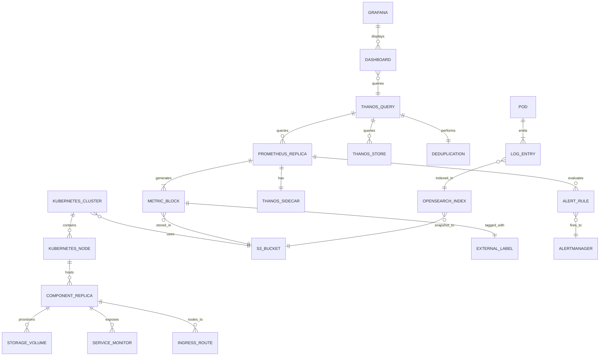
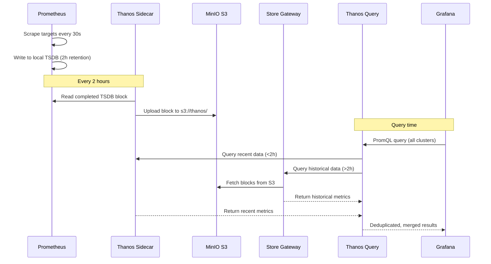
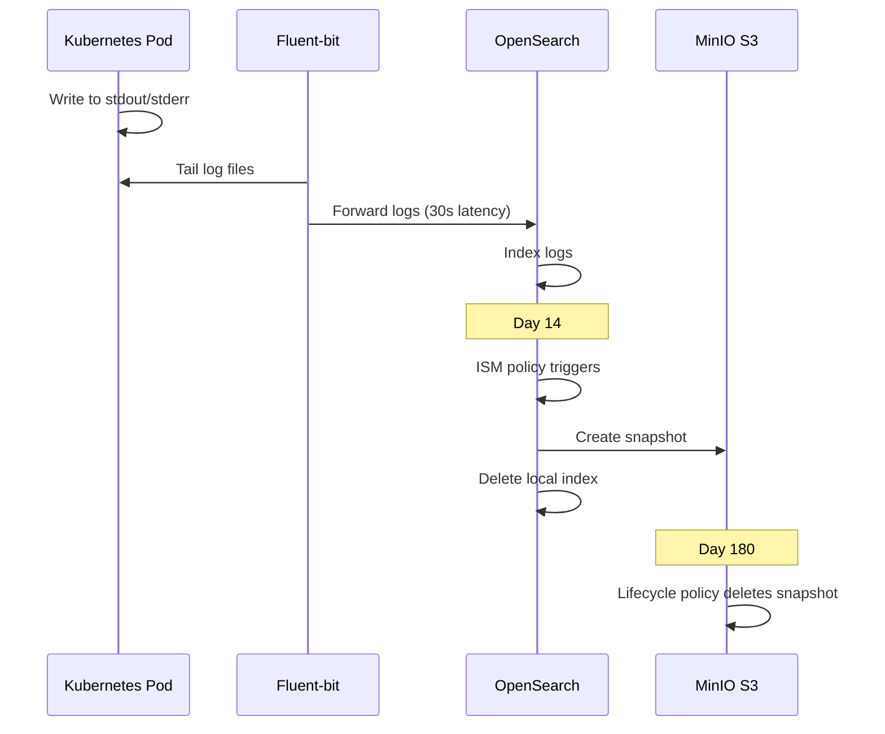

# Data Model: Thanos HA Monitoring Infrastructure with kubeadm

**Date**: 2025-10-13
**Updated**: 2025-10-14 (Changed to kubeadm HA architecture)
**Feature**: 001-thanos-multi-cluster
**Note**: This is an infrastructure project, so this document describes the deployment model and configuration entities rather than application data models.

## Entity Relationship Diagram



## Core Entities

### 1. Kubernetes Cluster

**Description**: Represents the single kubeadm-based Kubernetes cluster spanning 4 nodes

**Fields**:
```yaml
name: string              # "thanos-ha-cluster"
cluster_domain: string    # "cluster.local"
api_server_endpoint: string # Load balancer VIP or primary node IP
kubernetes_version: string  # "v1.28.0"
container_runtime: string   # "containerd"
pod_network_cidr: string    # "10.244.0.0/16" (Flannel/Calico)
service_cidr: string        # "10.96.0.0/12"
etcd_topology: enum         # "stacked" (etcd on control-plane nodes)
status: enum                # "not_installed" | "installing" | "running" | "degraded" | "failed"
```

**Relationships**:
- Has many: Kubernetes Nodes (4 nodes)
- Has many: Component Replicas distributed across nodes
- Uses: S3 Bucket for metrics and logs

**Validation Rules**:
- `kubernetes_version` >= "v1.28.0"
- `etcd_topology` MUST be "stacked"
- Minimum 4 nodes for HA configuration
- `container_runtime` MUST be "containerd"

**State Transitions**:
```
not_installed → installing → running
running → degraded (when nodes fail but quorum maintained)
degraded → running (when failed nodes recover)
installing/running → failed (on critical error or quorum loss)
failed → installing (cluster rebuild)
```

---

### 2. Kubernetes Node

**Description**: Represents a physical/virtual machine running both control-plane and worker components

**Fields**:
```yaml
name: string              # "node-194", "node-196", "node-197", "node-198"
ip_address: ipv4          # 192.168.101.{194,196,197,198}
hostname: string          # FQDN of the node
roles: list[string]       # ["control-plane", "worker"]
cpu_cores: integer        # 4 (minimum)
memory_gb: integer        # 16 (minimum)
disk_gb: integer          # 100 (minimum)
is_control_plane: boolean # true (all nodes)
is_worker: boolean        # true (all nodes)
kubelet_version: string   # "v1.28.0"
status: enum              # "not_ready" | "ready" | "scheduling_disabled" | "unreachable"
taints: list[taint]       # Node taints (if any)
labels: map[string]string # Node labels for scheduling
```

**Relationships**:
- Belongs to: Kubernetes Cluster
- Hosts: Component Replicas (pods scheduled on this node)
- Part of: etcd cluster (for control-plane)

**Validation Rules**:
- `ip_address` MUST match pattern `192.168.101.{194,196,197,198}`
- `cpu_cores` >= 4
- `memory_gb` >= 16
- `disk_gb` >= 100
- `roles` MUST include both "control-plane" and "worker"
- `kubelet_version` MUST match cluster version

**State Transitions**:
```
not_ready → ready (after kubeadm join)
ready → scheduling_disabled (cordon for maintenance)
scheduling_disabled → ready (uncordon)
ready → unreachable (network/node failure)
unreachable → ready (recovery)
```

---

### 3. Component Replica

**Description**: Individual replica/pod of a monitoring stack component

**Fields**:
```yaml
component_name: string   # "prometheus", "thanos-query", "opensearch", etc.
replica_index: integer   # 0, 1, 2... (for StatefulSets/Deployments with replicas > 1)
node: reference          # → Kubernetes Node (where this replica is scheduled)
deployment_method: string # "kustomize-helm" | "kustomize-yaml"
helm_chart: string       # "prometheus-community/kube-prometheus-stack" (if helm)
chart_version: string    # "55.5.0"
namespace: string        # "monitoring", "logging", "longhorn-system", "ingress-nginx"
pod_name: string         # Actual Kubernetes pod name
status: enum             # "pending" | "running" | "failed" | "unknown"
restart_count: integer   # Number of container restarts
health_check_url: string # For validation
anti_affinity: boolean   # Whether pod anti-affinity is configured
```

**Relationships**:
- Scheduled on: Kubernetes Node
- Provisions: Storage Volumes (if PVCs required)
- Exposes: Service Monitors (for Prometheus scraping)
- Routes to: Ingress Routes

**Component Types** (cluster-wide):
- **Storage & Ingress**: Longhorn, NGINX Ingress
- **Monitoring (HA)**: Prometheus (2+ replicas), Grafana, Alertmanager
- **Thanos**: Query (2+ replicas), Store Gateway, Compactor, Ruler
- **Thanos Sidecar**: One per Prometheus replica
- **Logging**: OpenSearch (3 replicas), Fluent-bit (DaemonSet on all nodes)

**Validation Rules**:
- `namespace` MUST match deployment conventions: monitoring, logging, longhorn-system, ingress-nginx
- Prometheus replicas MUST have anti-affinity to distribute across nodes
- Thanos Query replicas MUST have anti-affinity to distribute across nodes
- Each Prometheus replica MUST have exactly one Thanos Sidecar

**State Transitions**:
```
pending → running (successful pod start)
running → failed (container crash)
failed → running (automatic restart)
running → unknown (node unreachable)
unknown → running (node recovery)
```

---

### 4. Prometheus Replica

**Description**: Individual Prometheus instance in HA configuration

**Fields**:
```yaml
replica_id: string       # "prometheus-0", "prometheus-1"
node: reference          # → Kubernetes Node (scheduled by anti-affinity)
replica_index: integer   # 0, 1, 2...
external_labels: map[string]string # For Thanos deduplication {"replica": "A", "cluster": "thanos-ha"}
has_thanos_sidecar: boolean # true (all replicas)
sidecar_upload_enabled: boolean # true
scrape_interval: duration # 30s
retention_time: duration  # 2h (local retention only)
storage_size: string     # "10Gi" PVC size
status: enum             # "pending" | "running" | "failed"
```

**Relationships**:
- Scheduled on: Kubernetes Node
- Has one: Thanos Sidecar
- Generates: Metric Blocks
- Scrapes: Service Monitors
- Queried by: Thanos Query (via StoreAPI)

**Validation Rules**:
- `scrape_interval` = 30s (per requirements)
- `retention_time` = 2h (per requirements)
- `external_labels` MUST include "replica" label for deduplication
- Pod anti-affinity MUST be configured to avoid co-location

---

### 5. External Label

**Description**: Labels added by Thanos Sidecar to identify source Prometheus replica

**Fields**:
```yaml
prometheus_replica: reference # → Prometheus Replica
label_key: string      # "replica", "cluster", "region", etc.
label_value: string    # "A", "B", "thanos-ha", etc.
```

**Purpose**:
- Enables Thanos Query to deduplicate metrics from multiple replicas
- Identifies data source for troubleshooting
- Used in PromQL queries for filtering

**Standard Labels**:
```yaml
replica: "A" | "B" | "C"...  # Unique per Prometheus replica
cluster: "thanos-ha"          # Cluster identifier
```

---

### 6. Metric Block

**Description**: 2-hour chunk of Prometheus TSDB data uploaded to S3 by Thanos Sidecar

**Fields**:
```yaml
block_id: uuid           # Thanos block ULID
prometheus_replica: reference # → Prometheus Replica
external_labels: map[string]string # Copied from Prometheus external labels
start_time: timestamp    # Block time range start
end_time: timestamp      # Block time range end (typically start + 2h)
s3_path: string          # "s3://thanos-bucket/01HXXX.../meta.json"
size_bytes: integer      # Block size in bytes
upload_time: timestamp   # When uploaded to S3
compacted: boolean       # Whether Thanos Compactor has processed this block
compaction_level: integer # 1 (original), 2+ (compacted)
status: enum             # "collecting" | "uploaded" | "available" | "compacted" | "deleted"
```

**Relationships**:
- Generated by: Prometheus Replica (via Thanos Sidecar)
- Stored in: S3 Bucket (thanos-bucket)
- Queried by: Thanos Store Gateway
- Processed by: Thanos Compactor

**Validation Rules**:
- `end_time` - `start_time` = 2 hours (Prometheus default block duration)
- `s3_path` MUST start with "s3://thanos-bucket/"
- `size_bytes` > 0 after upload
- `external_labels` MUST match source Prometheus replica labels

**Lifecycle**:
```
collecting (Prometheus writing TSDB) →
uploaded (Sidecar uploaded to S3) →
available (Store Gateway can query) →
compacted (Compactor merges multiple blocks) →
deleted (old blocks deleted after compaction, or manual cleanup)
```

---

### 7. Log Entry

**Description**: Single log line from a Kubernetes pod

**Fields**:
```yaml
log_id: uuid             # Generated by OpenSearch
timestamp: timestamp     # Log emission time
node_name: string        # Source Kubernetes node
namespace: string        # Pod namespace
pod_name: string         # Source pod
container_name: string   # Source container
log_level: enum          # "DEBUG" | "INFO" | "WARNING" | "ERROR" | "FATAL"
message: text            # Log message body
labels: map[string]string # Kubernetes labels
```

**Relationships**:
- Emitted by: Pod (any Kubernetes pod)
- Collected by: Fluent-bit DaemonSet (running on each node)
- Indexed in: OpenSearch Index
- Snapshotted to: S3 Bucket (via OpenSearch snapshot)

**Validation Rules**:
- `timestamp` within last 24 hours (prevent stale logs)
- `node_name` MUST match one of 4 cluster nodes
- `pod_name` format: `^[a-z0-9-]+$`

**Lifecycle**:
```
emitted (pod stdout/stderr) →
collected (Fluent-bit reads) →
indexed (OpenSearch ingests, <30s latency) →
retained_local (0-14 days in OpenSearch indices) →
snapshotted (ISM policy triggers snapshot to S3) →
deleted_local (local index deleted after snapshot) →
retained_s3 (0-180 days in S3) →
deleted_s3 (S3 lifecycle policy deletes)
```

---

### 5. S3 Bucket

**Description**: MinIO S3 storage container for metrics, logs, and backups

**Fields**:
```yaml
bucket_name: string      # "thanos", "opensearch-logs", "longhorn-backups"
endpoint: url            # "https://172.20.40.21:30001"
access_key: string       # "minio" (stored in Kubernetes Secret)
secret_key: string       # "minio123" (stored in Kubernetes Secret)
region: string           # "us-east-1" (MinIO default)
tls_enabled: boolean     # true
cert_verification: boolean # false (self-signed cert assumed)
usage_bytes: integer     # Current bucket size
object_count: integer    # Number of objects
```

**Relationships**:
- Used by: All Clusters
- Stores: Metric Blocks (Thanos)
- Stores: Log Snapshots (OpenSearch)
- Stores: Volume Backups (Longhorn)

**Validation Rules**:
- `endpoint` MUST be reachable from all cluster nodes
- `access_key` and `secret_key` MUST authenticate successfully
- `bucket_name` MUST follow S3 naming rules: lowercase, no underscores

**Bucket Allocation**:
- `thanos`: Prometheus metric blocks from all clusters
- `opensearch-logs`: OpenSearch snapshot repository
- `longhorn-backups`: Longhorn volume backups per cluster

---

### 6. Storage Volume

**Description**: Persistent volume provisioned by Longhorn

**Fields**:
```yaml
pvc_name: string         # PersistentVolumeClaim name
namespace: string        # PVC namespace
cluster: reference       # → Cluster
size_gb: integer         # Requested size
storage_class: string    # "longhorn"
access_mode: enum        # "ReadWriteOnce" | "ReadWriteMany" | "ReadOnlyMany"
status: enum             # "pending" | "bound" | "released" | "failed"
actual_usage_gb: float   # Current usage
backup_enabled: boolean  # If S3 backup configured
last_backup_time: timestamp # Most recent backup to S3
```

**Relationships**:
- Provisioned by: Longhorn (Component)
- Used by: Component (pods with PVC mounts)
- Backed up to: S3 Bucket

**Validation Rules**:
- `storage_class` MUST be "longhorn"
- `size_gb` >= 1
- `status` MUST become "bound" within 60 seconds (SC-008)

**State Transitions**:
```
pending (PVC created) →
bound (Longhorn provisions volume) →
backing_up (Longhorn snapshot uploaded to S3) →
bound (ready for use) →
released (PVC deleted, volume retained) →
deleted (volume manually removed)
```

---

### 7. Service Monitor

**Description**: Prometheus Operator CRD defining scrape targets

**Fields**:
```yaml
name: string             # "thanos-sidecar-monitor", "opensearch-monitor"
namespace: string        # "monitoring"
cluster: reference       # → Cluster
selector_labels: map[string]string # Pod selector
endpoints: array[object] # [{port: 10902, path: /metrics, interval: 30s}]
scrape_interval: duration # "30s" (from clarification)
scrape_timeout: duration # "10s"
```

**Relationships**:
- Defines targets for: Prometheus
- Monitors: Component pods

**Validation Rules**:
- `scrape_interval` = "30s" (FR-004)
- `selector_labels` MUST match at least one pod
- `endpoints[].port` MUST exist on target pods

**Component-to-ServiceMonitor Mapping**:
- Thanos Sidecar: port 10902 (gRPC), path /metrics
- Thanos Query: port 10902, path /metrics
- Thanos Store Gateway: port 10902, path /metrics
- OpenSearch: port 9200, path /_prometheus/metrics
- Fluent-bit: port 2020, path /api/v1/metrics/prometheus
- Longhorn: port 9500, path /metrics
- NGINX Ingress: port 10254, path /metrics

---

### 8. Dashboard

**Description**: Grafana dashboard for visualization

**Fields**:
```yaml
name: string             # "Thanos Overview", "Prometheus Federation"
uid: string              # Grafana dashboard UID
datasource: string       # "Thanos Query", "Prometheus"
folder: string           # "Monitoring", "Logs"
cluster: reference       # Deployed on which Grafana (typically 196)
panels: array[object]    # Dashboard panels (JSON)
variables: array[object] # [{name: "cluster", type: "query", query: "label_values(cluster)"}]
refresh_interval: duration # "30s"
```

**Relationships**:
- Deployed to: Grafana (Component on cluster 196)
- Queries: Thanos Query (for multi-cluster metrics)

**Required Dashboards** (FR-011):
1. **Thanos Health**: Sidecar upload status, Store Gateway query performance, S3 connectivity
2. **Prometheus Federation**: Scrape success rate per cluster, target health
3. **OpenSearch Cluster Health**: Node status, shard allocation, index health, snapshot status
4. **Longhorn Storage**: Volume usage, backup status, replica health
5. **NGINX Ingress Traffic**: Request rate, latency, error rate per hostname

**Validation Rules**:
- `datasource` MUST exist in Grafana
- `variables` MUST include "cluster" filter for multi-cluster views
- Panels MUST handle empty data gracefully (no cluster data loss)

---

### 9. Alert Rule

**Description**: PrometheusRule CRD defining alert conditions

**Fields**:
```yaml
name: string             # "ThanosS3UploadFailed", "PrometheusScrapeFailure"
namespace: string        # "monitoring"
cluster: reference       # → Cluster where alert is evaluated
severity: enum           # "critical" | "warning" | "info"
expression: promql       # PromQL query
duration: duration       # "5m" (for how long condition must be true)
annotations: map[string]string # {summary: "...", description: "..."}
labels: map[string]string # {component: "thanos", cluster: "196"}
```

**Relationships**:
- Evaluated by: Prometheus
- Fired to: Alertmanager (Component)
- Notifies: Operators (via Alertmanager)

**Required Alerts** (FR-012):
1. **S3ConnectivityLoss**: `up{job="thanos-sidecar"} == 0 AND changes(thanos_objstore_bucket_operations_total[5m]) == 0`
2. **ThanosSidecarUploadFailure**: `rate(thanos_objstore_bucket_operation_failures_total{operation="upload"}[5m]) > 0`
3. **PrometheusScrapeFailure**: `up{job="prometheus"} == 0` OR `rate(prometheus_target_scrape_errors_total[5m]) > 0.1`
4. **DiskPressureWarning**: `kubelet_volume_stats_available_bytes / kubelet_volume_stats_capacity_bytes < 0.15`

**Validation Rules**:
- `expression` MUST be valid PromQL
- `duration` >= "1m" (avoid flapping)
- `severity` "critical" requires immediate response

**Lifecycle**:
```
inactive (condition false) →
pending (condition true, duration not met) →
firing (condition true for duration) →
alertmanager_notified (FR-012a) →
operator_intervenes_manually (FR-012b) →
resolved (condition false again)
```

---

### 10. Ingress Route

**Description**: NGINX Ingress routing rule for external access

**Fields**:
```yaml
name: string             # "grafana-ingress", "prometheus-ingress"
namespace: string        # "monitoring"
cluster: reference       # → Cluster
hostname: fqdn           # "grafana.mkube-196.miribit.lab"
service_name: string     # "kube-prometheus-stack-grafana"
service_port: integer    # 80
path: string             # "/"
path_type: enum          # "Prefix" | "Exact"
tls_enabled: boolean     # false (out of scope)
annotations: map[string]string # NGINX-specific annotations
```

**Relationships**:
- Managed by: NGINX Ingress Controller (Component)
- Routes to: Kubernetes Service

**Validation Rules**:
- `hostname` MUST match pattern: `^[a-z0-9-]+\.mkube-(196|197|198)\.miribit\.lab$` (FR-003a)
- Node number in hostname MUST match cluster node (196 → cluster-196, etc.)
- `service_name` MUST exist in same namespace
- `service_port` MUST be valid port on service

**Hostname Allocation**:
- **Cluster 196**: grafana.mkube-196.miribit.lab, prometheus.mkube-196.miribit.lab, opensearch.mkube-196.miribit.lab
- **Cluster 197**: grafana.mkube-197.miribit.lab, prometheus.mkube-197.miribit.lab, opensearch.mkube-197.miribit.lab
- **Cluster 198**: grafana.mkube-198.miribit.lab, prometheus.mkube-198.miribit.lab, opensearch.mkube-198.miribit.lab

---

## Configuration Entities

### Kustomize Base

**Purpose**: Shared configuration templates for all clusters

**Structure**:
```
deploy/base/{component}/
├── kustomization.yaml   # helmCharts or resources
├── values.yaml          # Helm values (if helmCharts)
└── *.yaml               # Additional resources
```

**Components with Base**:
- longhorn/
- nginx-ingress/
- kube-prometheus-stack/
- thanos/
- opensearch/
- fluent-bit/

---

### Kustomize Overlay

**Purpose**: Cluster-specific patches

**Structure**:
```
deploy/overlays/cluster-{196,197,198}-{central,edge}/
├── kustomization.yaml      # bases, patches, namespace
├── ingress-hostnames.yaml  # Patch with cluster-specific DNS
├── thanos-*-patch.yaml     # Component-specific patches
└── s3-secret.yaml          # S3 credentials (sealed secret in prod)
```

**Patch Examples**:
- `ingress-hostnames.yaml`: Replace `grafana.mkube-XXX.miribit.lab` with cluster-specific hostname
- `thanos-query-patch.yaml`: Add Thanos Query deployment (only on 196)
- `thanos-sidecar-patch.yaml`: Enable Sidecar sidecar container in Prometheus pod (only on 197/198)

---

## Data Flow Diagrams

### Metrics Data Flow



### Logs Data Flow



---

## Entity Count Estimates

| Entity | Count |
|--------|-------|
| Cluster | 3 (fixed) |
| Component | ~15 per cluster × 3 = 45 total |
| Metric Block | ~12 per day per cluster × 3 = 36/day (grows indefinitely in S3) |
| Log Entry | ~100,000 per day per cluster × 3 = 300,000/day (14d local, 180d S3) |
| S3 Bucket | 3 (thanos, opensearch-logs, longhorn-backups) |
| Storage Volume | ~5-10 per cluster × 3 = 15-30 total |
| Service Monitor | ~8 per cluster × 3 = 24 total |
| Dashboard | 5 (shared in central Grafana) |
| Alert Rule | ~4-8 per cluster × 3 = 12-24 total |
| Ingress Route | ~3 per cluster × 3 = 9 total |

---

## State Management

Since this is infrastructure, state is managed by:
- **Kubernetes API**: Current state of all deployed resources
- **Prometheus TSDB**: Recent metrics (2h)
- **MinIO S3**: Historical metrics (unlimited), log snapshots (180d), volume backups
- **OpenSearch**: Recent logs (14d)
- **Longhorn**: Volume state and metadata

No application database required. All state is in Kubernetes etcd or object storage.
