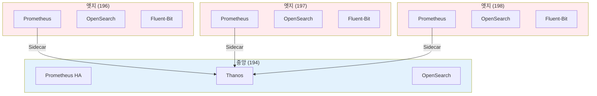
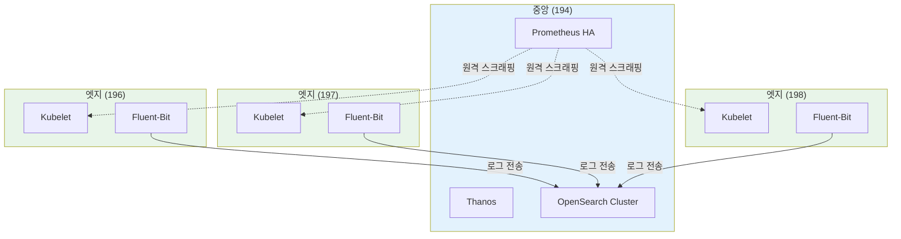

# 아키텍처 변경 요약

**변경일**: 2025-10-16
**변경 버전**: 2.0 → 2.1

---

## 변경 사항

### Before (v2.0)

**모든 클러스터에 Prometheus + OpenSearch 배포**

```
중앙 클러스터 (194):
- Prometheus HA (2 replicas)
- Thanos Query/Store/Compactor/Ruler
- OpenSearch Cluster
- Grafana

엣지 클러스터 (196, 197, 198):
- Prometheus (1 replica)
- Thanos Sidecar
- OpenSearch (1 replica)
- Fluent-Bit
```

**문제점**:
- ❌ 각 엣지 클러스터마다 ~3 CPU, ~6 GB Memory 소비
- ❌ 4개 엣지 클러스터 총 ~12 CPU, ~24 GB Memory 낭비
- ❌ 엣지 클러스터마다 OpenSearch 관리 부담
- ❌ 분산된 로그로 통합 검색 어려움

### After (v2.1)

**중앙 집중식 모니터링**

```
중앙 클러스터 (194):
- Prometheus HA (2 replicas)
- Thanos Query/Store/Compactor/Ruler
- OpenSearch Cluster (Master 3, Data 3)
- Fluent-Bit
- Grafana
- ArgoCD

엣지 클러스터 (196, 197, 198):
- Fluent-Bit (로그 전송 전용)
```

**개선 효과**:
- ✅ 엣지 클러스터당 ~3 CPU, ~6 GB Memory 절감
- ✅ 4개 엣지 클러스터 총 ~12 CPU, ~24 GB Memory 절감
- ✅ 중앙에서 통합 관리 (단일 진실 공급원)
- ✅ 모든 로그를 단일 OpenSearch에서 통합 검색
- ✅ 엣지 클러스터 운영 복잡도 대폭 감소

---

## 아키텍처 다이어그램 비교

### Before (v2.0)



### After (v2.1)



---

## 변경된 파일 목록

### 삭제된 파일

```bash
# ArgoCD Applications (엣지 클러스터)
argocd/applications/cluster-02/prometheus.yaml        # 삭제됨
argocd/applications/cluster-02/opensearch.yaml        # 삭제됨
argocd/applications/cluster-03/prometheus.yaml        # 삭제됨
argocd/applications/cluster-03/opensearch.yaml        # 삭제됨
argocd/applications/cluster-04/prometheus.yaml        # 삭제됨
argocd/applications/cluster-04/opensearch.yaml        # 삭제됨
```

### 수정된 파일

```bash
# 아키텍처 다이어그램 업데이트
docs/OPERATOR_BASED_MULTI_CLUSTER_OBSERVABILITY.md   # 수정됨
README.md                                              # 수정됨

# ArgoCD Applications (엣지 클러스터)
argocd/applications/cluster-02/fluent-bit.yaml        # 유지됨
argocd/applications/cluster-03/fluent-bit.yaml        # 유지됨
argocd/applications/cluster-04/fluent-bit.yaml        # 유지됨
```

### 추가된 파일

```bash
# 새로운 문서
docs/EDGE_CLUSTER_CONFIG.md                           # 추가됨 (엣지 클러스터 구성 가이드)
ARCHITECTURE_CHANGE_SUMMARY.md                        # 추가됨 (이 문서)
```

---

## 마이그레이션 가이드

### 기존 환경에서 업그레이드 시나리오

**현재 상태**: 모든 클러스터에 Prometheus + OpenSearch 배포됨

**마이그레이션 절차**:

#### 1. 중앙 클러스터 (194) 업그레이드

**변경 사항 없음** (이미 모든 컴포넌트 배포됨)

#### 2. 엣지 클러스터 (196, 197, 198) 다운사이징

**각 엣지 클러스터에서**:

```bash
# 1. ArgoCD Application 삭제
kubectl delete application prometheus-cluster-02 -n argocd
kubectl delete application opensearch-cluster-02 -n argocd

# 2. 리소스 수동 삭제 (ArgoCD cascade 삭제)
kubectl delete prometheus -n monitoring --all
kubectl delete opensearchcluster -n logging --all

# 3. Namespace 정리 (선택사항)
kubectl delete namespace monitoring
kubectl delete namespace logging

# 4. Fluent-Bit 재설정 (중앙으로 전송)
kubectl apply -f argocd/applications/cluster-02/fluent-bit.yaml
```

#### 3. 중앙 Prometheus에 원격 스크래핑 설정 추가

```bash
# 중앙 클러스터 (194)에서
kubectl apply -f deploy/overlays/cluster-01-central/kube-prometheus-stack/servicemonitors/remote-kubelet-cluster-02.yaml
kubectl apply -f deploy/overlays/cluster-01-central/kube-prometheus-stack/servicemonitors/remote-kubelet-cluster-03.yaml
kubectl apply -f deploy/overlays/cluster-01-central/kube-prometheus-stack/servicemonitors/remote-kubelet-cluster-04.yaml
```

#### 4. 검증

```bash
# 로그 전송 확인
kubectl exec -n logging opensearch-cluster-masters-0 -- \
  curl -u admin:admin "https://localhost:9200/_cat/indices?v" | grep fluent-bit

# 메트릭 수집 확인
# Prometheus UI에서:
up{cluster="cluster-02",job="kubelet"}
up{cluster="cluster-03",job="kubelet"}
up{cluster="cluster-04",job="kubelet"}
```

---

## 네트워크 요구사항 변경

### 추가 필요한 방화벽 규칙

**중앙 (194) → 엣지 (196, 197, 198)**:

| 소스 | 목적지 | 포트 | 프로토콜 | 용도 |
|------|--------|------|---------|------|
| 192.168.101.194 | 192.168.101.196 | 10250 | HTTPS | Kubelet metrics |
| 192.168.101.194 | 192.168.101.197 | 10250 | HTTPS | Kubelet metrics |
| 192.168.101.194 | 192.168.101.198 | 10250 | HTTPS | Kubelet metrics |

**엣지 (196, 197, 198) → 중앙 (194)**:

| 소스 | 목적지 | 포트 | 프로토콜 | 용도 |
|------|--------|------|---------|------|
| 192.168.101.196 | 192.168.101.194 | 9200 | HTTPS | OpenSearch (로그 전송) |
| 192.168.101.197 | 192.168.101.194 | 9200 | HTTPS | OpenSearch (로그 전송) |
| 192.168.101.198 | 192.168.101.194 | 9200 | HTTPS | OpenSearch (로그 전송) |

---

## 성능 영향

### 리소스 사용량 변화

**엣지 클러스터 1개당**:

| 컴포넌트 | Before | After | 절감 |
|---------|--------|-------|------|
| CPU | ~3.5 Core | ~0.1 Core | -97% |
| Memory | ~6 GB | ~128 MB | -98% |
| Disk | ~50 GB (Prometheus + OpenSearch) | ~5 GB (로그 버퍼) | -90% |

**4개 엣지 클러스터 총합**:

| 리소스 | Before | After | 절감 |
|--------|--------|-------|------|
| CPU | ~14 Core | ~0.4 Core | ~13.6 Core |
| Memory | ~24 GB | ~512 MB | ~23.5 GB |
| Disk | ~200 GB | ~20 GB | ~180 GB |

### 네트워크 트래픽 변화

**Before**:
- Thanos Sidecar → S3: ~50 MB/hour per cluster
- 총: ~200 MB/hour (4 clusters)

**After**:
- Fluent-Bit → OpenSearch: ~100 MB/hour per cluster
- Prometheus → Kubelet (원격): ~10 MB/hour per cluster
- 총: ~440 MB/hour (4 clusters)

**증가 이유**:
- 로그를 실시간으로 중앙 전송 (이전에는 로컬 저장)
- 메트릭 원격 스크래핑 추가

**완화 방법**:
- Fluent-Bit 버퍼링 및 압축 활성화
- Prometheus 스크래핑 간격 조정 (30s → 60s)

---

## 운영 변경사항

### 대시보드 접근

**Before**:
```
각 클러스터마다 별도 Grafana:
- http://grafana.k8s-cluster-01.miribit.lab
- http://grafana.k8s-cluster-02.miribit.lab
- http://grafana.k8s-cluster-03.miribit.lab
- http://grafana.k8s-cluster-04.miribit.lab
```

**After**:
```
중앙 Grafana에서 모든 클러스터 조회:
- http://grafana.k8s-cluster-01.miribit.lab

필터 예시:
- cluster="cluster-02"
- cluster=~"cluster-0[2-4]" (엣지 클러스터 전체)
```

### 로그 검색

**Before**:
```
각 클러스터마다 별도 OpenSearch Dashboards:
- http://opensearch-dashboards.k8s-cluster-01.miribit.lab
- http://opensearch-dashboards.k8s-cluster-02.miribit.lab
- ...
```

**After**:
```
중앙 OpenSearch Dashboards에서 통합 검색:
- http://opensearch-dashboards.k8s-cluster-01.miribit.lab

인덱스 패턴: fluent-bit-*
필터: _index: "fluent-bit-cluster-02-*"
```

---

## 모니터링 및 알림

### 새로운 알림 규칙

**원격 스크래핑 실패 알림**:

```yaml
apiVersion: monitoring.coreos.com/v1
kind: PrometheusRule
metadata:
  name: remote-scraping-alerts
  namespace: monitoring
spec:
  groups:
    - name: remote-scraping
      interval: 30s
      rules:
        - alert: RemoteKubeletDown
          expr: up{job="kubelet",cluster=~"cluster-0[2-4]"} == 0
          for: 5m
          labels:
            severity: warning
          annotations:
            summary: "원격 Kubelet 스크래핑 실패: {{ $labels.cluster }}"
            description: "중앙 Prometheus가 {{ $labels.cluster }}의 Kubelet 메트릭을 수집하지 못하고 있습니다."
```

**Fluent-Bit 로그 전송 실패 알림**:

```yaml
- alert: FluentBitLogForwardingFailed
  expr: |
    rate(fluentbit_output_errors_total{name="opensearch-central"}[5m]) > 0.1
  for: 5m
  labels:
    severity: warning
  annotations:
    summary: "Fluent-Bit 로그 전송 실패: {{ $labels.cluster }}"
    description: "{{ $labels.cluster }}의 Fluent-Bit가 중앙 OpenSearch로 로그를 전송하지 못하고 있습니다."
```

---

## FAQ

### Q1: 엣지 클러스터에서 메트릭을 직접 확인할 수 없나요?

**A**: 중앙 Grafana에서 cluster 레이블로 필터링하여 확인 가능합니다.

```promql
# 특정 엣지 클러스터 CPU 사용률
sum by (pod) (
  rate(container_cpu_usage_seconds_total{cluster="cluster-02"}[5m])
)
```

### Q2: 네트워크 단절 시 로그가 손실되나요?

**A**: Fluent-Bit의 로컬 버퍼에 저장되며, 네트워크 복구 후 자동 재전송됩니다.

```yaml
# Fluent-Bit 버퍼 설정
spec:
  service:
    storage.path: /var/log/flb-storage/
    storage.sync: normal
    storage.checksum: off
    storage.max_chunks_up: 128
```

### Q3: 엣지 클러스터의 Prometheus가 필요한 경우는?

**A**: 다음 경우에는 엣지에도 Prometheus를 배포할 수 있습니다:
- 네트워크 지연이 높아 실시간 메트릭 필요 시
- 로컬 알림이 필수인 경우
- 네트워크 단절에 대비한 로컬 메트릭 보관

이 경우 기존 v2.0 아키텍처를 유지하면 됩니다.

---

## 참고 문서

- [엣지 클러스터 구성 가이드](docs/EDGE_CLUSTER_CONFIG.md)
- [상세 아키텍처](docs/OPERATOR_BASED_MULTI_CLUSTER_OBSERVABILITY.md)
- [Fluent Bit 공식 문서](https://docs.fluentbit.io/)
- [Prometheus 원격 스크래핑](https://prometheus.io/docs/prometheus/latest/configuration/configuration/#scrape_config)

---

**작성일**: 2025-10-16
**작성자**: Infrastructure Team
