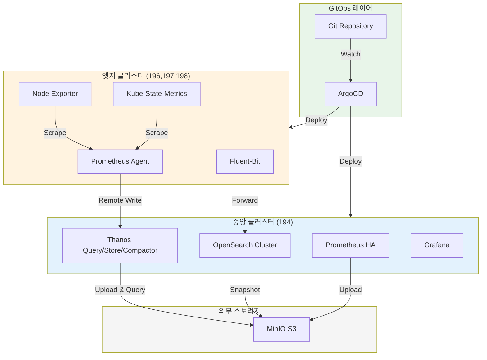
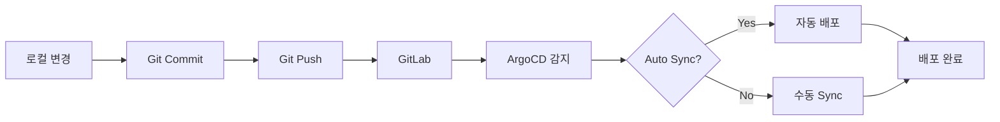

# Operator 기반 멀티클러스터 Observability 플랫폼

**Kubernetes Operator와 ArgoCD GitOps를 활용한 엔터프라이즈 급 통합 관측성 플랫폼**

[](LICENSE)
[](https://kubernetes.io/)
[](https://argo-cd.readthedocs.io/)

---

## 개요

이 프로젝트는 4개의 Kubernetes 클러스터(1개 중앙 + 3개 엣지)에서 통합 Observability 플랫폼을 구축하고 운영하기 위한 완전한 솔루션입니다.

### 주요 특징

- **Operator 기반 관리**: Prometheus Operator, OpenSearch Operator, Fluent Operator를 통한 선언적 리소스 관리
- **GitOps 배포**: ArgoCD를 통한 자동화된 배포, 업데이트, 롤백
- **멀티클러스터 메트릭**: Thanos를 통한 중앙 집중식 메트릭 쿼리 및 장기 저장
- **통합 로깅**: Fluent Bit + OpenSearch를 통한 멀티클러스터 로그 수집 및 분석
- **HA 구성**: 중앙 클러스터의 모든 주요 컴포넌트 고가용성 구성
- **S3 기반 스토리지**: MinIO S3를 활용한 메트릭 및 로그 장기 보관

---

## 아키텍처

### 전체 시스템 구성



자세한 아키텍처는 [OPERATOR_BASED_MULTI_CLUSTER_OBSERVABILITY.md](docs/OPERATOR_BASED_MULTI_CLUSTER_OBSERVABILITY.md)를 참조하세요.

---

## 클러스터 구성

| 클러스터 ID | IP | 역할 | 주요 컴포넌트 |
|------------|----|----|-------------|
| cluster-01-central | 192.168.101.194 | 중앙 모니터링 허브 | Prometheus HA, Thanos Query/Store/Compactor/Ruler/Receiver, OpenSearch Cluster (Master 3, Data 3), Fluent-Bit, Grafana, ArgoCD |
| cluster-02-edge | 192.168.101.196 | 엣지 워크로드 | Prometheus Agent, Node Exporter, Kube-State-Metrics, Fluent-Bit |
| cluster-03-edge | 192.168.101.197 | 엣지 워크로드 | Prometheus Agent, Node Exporter, Kube-State-Metrics, Fluent-Bit |
| cluster-04-edge | 192.168.101.198 | 엣지 워크로드 | Prometheus Agent, Node Exporter, Kube-State-Metrics, Fluent-Bit |

**아키텍처 특징**:
- **Prometheus Agent Mode**: 엣지에서 경량 Agent가 메트릭 수집 후 중앙 Thanos Receiver로 Remote Write
- **완전한 메트릭 수집**: Node Exporter (OS), Kube-State-Metrics (K8s 리소스), Kubelet/cAdvisor (컨테이너)
- **네트워크 단절 대응**: Agent의 WAL 버퍼로 일시적 네트워크 단절 시 데이터 손실 방지
- **로그 중앙 전송**: 모든 엣지의 Fluent-Bit가 중앙 OpenSearch로 직접 전송
- **리소스 효율**: 엣지당 ~450MB Memory (Full Prometheus의 1/4)

---

## 기술 스택

### Infrastructure
- **Kubernetes**: v1.34+ (Kubeadm, Containerd, Cilium CNI)
- **Storage**: Longhorn CSI
- **Ingress**: Cilium Ingress Controller (L2 LoadBalancer)
- **GitOps**: ArgoCD (HA mode)

### Observability
- **Metrics**: Prometheus Operator (kube-prometheus-stack) + Thanos
- **Logging**: Fluent Operator + Fluent-Bit + OpenSearch
- **Visualization**: Grafana, OpenSearch Dashboards

### External Services
- **Object Storage**: MinIO S3 (`s3.minio.miribit.lab`)

---

## 빠른 시작

### Prerequisites

**필수 도구**:
```bash
# kubectl 1.34+
curl -LO "https://dl.k8s.io/release/v1.34.1/bin/linux/amd64/kubectl"
sudo install -o root -g root -m 0755 kubectl /usr/local/bin/kubectl

# kustomize 5.0+
curl -s "https://raw.githubusercontent.com/kubernetes-sigs/kustomize/master/hack/install_kustomize.sh" | bash
sudo mv kustomize /usr/local/bin/

# helm 3.12+
curl https://raw.githubusercontent.com/helm/helm/main/scripts/get-helm-3 | bash

# argocd CLI 2.9+
curl -sSL -o argocd-linux-amd64 https://github.com/argoproj/argo-cd/releases/latest/download/argocd-linux-amd64
sudo install -m 555 argocd-linux-amd64 /usr/local/bin/argocd
rm argocd-linux-amd64
```

**인프라 요구사항**:
- 4개의 Linux 서버 (Ubuntu 22.04 권장)
- 각 서버: 4 CPU, 16GB RAM, 100GB Disk
- MinIO S3 접근 가능

### Phase 1: Kubernetes 클러스터 설치

각 노드에 Kubernetes 설치:

```bash
# 194번 노드 (중앙)
sshpass -p "123qwe" scp scripts/k8s/install-k8s-node-194.sh bsh@192.168.101.194:/tmp/
sshpass -p "123qwe" ssh bsh@192.168.101.194 "chmod +x /tmp/install-k8s-node-194.sh && sudo /tmp/install-k8s-node-194.sh"

# 196, 197, 198번 노드 (엣지)도 동일하게 실행
```

**kubeconfig 통합**:

```bash
# 각 클러스터의 kubeconfig 수집
mkdir -p ~/.kube/configs

for node in 194 196 197 198; do
  sshpass -p "123qwe" ssh bsh@192.168.101.$node \
    "sudo cat /etc/kubernetes/admin.conf" > ~/.kube/configs/cluster-0$(($node-193)).conf
done

# 통합 kubeconfig 생성
export KUBECONFIG=$(echo ~/.kube/configs/cluster-*.conf | tr ' ' ':')
kubectl config view --flatten > ~/.kube/config

# Context 이름 변경
kubectl config rename-context kubernetes-admin@kubernetes cluster-01-context
kubectl config rename-context kubernetes-admin@kubernetes cluster-02-context
kubectl config rename-context kubernetes-admin@kubernetes cluster-03-context
kubectl config rename-context kubernetes-admin@kubernetes cluster-04-context
```

### Phase 2: S3 버킷 생성

MinIO에 필요한 버킷 생성:

```bash
./scripts/s3/create-buckets.sh

# 생성되는 버킷:
# - thanos-metrics
# - opensearch-snapshots
# - longhorn-backups
```

### Phase 3: GitOps 환경 구성 (ArgoCD + GitLab)

중앙 클러스터에 ArgoCD와 GitLab 설치:

```bash
# cluster-01-central 컨텍스트 전환
kubectl config use-context cluster-01-context

# 1. ArgoCD 설치
./scripts/deploy-argocd.sh

# 출력된 접속 정보 확인:
# - URL: http://argocd.k8s-cluster-01.miribit.lab
# - Username: admin
# - Password: (자동 생성된 비밀번호)

# 2. GitLab 설치
export S3_ACCESS_KEY="your_s3_access_key"
export S3_SECRET_KEY="your_s3_secret_key"
./scripts/deploy-gitlab.sh

# 출력된 접속 정보 확인:
# - URL: http://gitlab.k8s-cluster-01.miribit.lab
# - Username: root
# - Password: (자동 생성된 비밀번호)

# 3. GitLab에서 저장소 생성
# - GitLab UI에 로그인
# - 새 그룹 생성: observability
# - 새 프로젝트 생성: observability/thanos-multi-cluster

# 4. ArgoCD-GitLab 연동
./scripts/configure-argocd-gitlab.sh

# 5. 코드를 GitLab에 푸시
git init
git remote add origin http://gitlab.k8s-cluster-01.miribit.lab/observability/thanos-multi-cluster.git
git add .
git commit -m "Initial commit: Multi-cluster observability"
git branch -M main
git push -u origin main
```

### Phase 4: GitOps 기반 멀티클러스터 배포

ArgoCD Root Application을 배포하면 모든 클러스터에 자동으로 배포됩니다:

```bash
# ArgoCD UI에서 Root Application 동기화
# URL: http://argocd.k8s-cluster-01.miribit.lab

# 또는 CLI로 배포
argocd app sync root-application

# 배포 상태 확인
argocd app list
argocd app get root-application

# 모든 Application 상태 확인
watch -n 5 'argocd app list'
```

**자동 배포 순서 (Sync Wave)**:

| Wave | 컴포넌트 | 배포 위치 |
|------|---------|----------|
| 0 | Namespace, CRD | 모든 클러스터 |
| 1 | Longhorn Storage | 모든 클러스터 |
| 2 | Thanos Receiver, Prometheus Agent | 중앙 + 엣지 |
| 3 | kube-prometheus-stack, OpenSearch | 중앙 클러스터 |
| 4 | Fluent-Bit | 모든 클러스터 |
| 5 | Grafana, Dashboards | 중앙 클러스터 |

**배포 검증**:

```bash
# 중앙 클러스터 확인
kubectl --context cluster-01-context get pods -n monitoring
kubectl --context cluster-01-context get pods -n logging

# 엣지 클러스터 확인
for cluster in 02 03 04; do
  echo "=== Cluster $cluster ==="
  kubectl --context cluster-$cluster-context get pods -n monitoring
done
```

### Phase 5: 검증

```bash
# Prometheus 및 Thanos 검증
./scripts/validation/validate-prometheus.sh
./scripts/validation/validate-thanos.sh

# OpenSearch 검증
./scripts/validation/validate-opensearch.sh

# Fluent-Bit 검증
./scripts/validation/validate-fluent-bit.sh
```

---

## 접근 URL

### 중앙 클러스터 (194)

| 서비스 | URL | 인증 정보 |
|--------|-----|----------|
| ArgoCD | http://argocd.k8s-cluster-01.miribit.lab | admin / (설정한 비밀번호) |
| GitLab | http://gitlab.k8s-cluster-01.miribit.lab | root / (설정한 비밀번호) |
| Grafana | http://grafana.k8s-cluster-01.miribit.lab | admin / admin123 |
| Thanos Query | http://thanos-query.k8s-cluster-01.miribit.lab | - |
| Prometheus | http://prometheus.k8s-cluster-01.miribit.lab | - |
| Alertmanager | http://alertmanager.k8s-cluster-01.miribit.lab | - |
| OpenSearch Dashboards | http://opensearch-dashboards.k8s-cluster-01.miribit.lab | admin / admin |

### 엣지 클러스터 (196, 197, 198)

**엣지 클러스터에는 UI 서비스가 배포되지 않습니다.**

모든 메트릭과 로그는 중앙 클러스터의 Grafana 및 OpenSearch Dashboards에서 확인 가능합니다.

---

## 디렉토리 구조

```
thanos-multi-cluster/
├── argocd/                                    # ArgoCD 매니페스트
│   ├── root-application.yaml                  # Root Application (App-of-Apps)
│   ├── projects/                              # ArgoCD Projects
│   │   └── observability-project.yaml
│   ├── clusters/                              # 클러스터 연결 Secrets
│   │   ├── cluster-02-secret.yaml
│   │   ├── cluster-03-secret.yaml
│   │   └── cluster-04-secret.yaml
│   └── applications/                          # Child Applications
│       ├── cluster-01/                        # 중앙 클러스터
│       ├── cluster-02/                        # 엣지 클러스터
│       ├── cluster-03/
│       └── cluster-04/
│
├── deploy/
│   ├── base/                                  # 기본 Helm Charts 및 공통 리소스
│   │   ├── longhorn/
│   │   ├── cilium-ingress/
│   │   ├── kube-prometheus-stack/
│   │   ├── prometheus-agent/
│   │   ├── opensearch-operator/
│   │   ├── opensearch/
│   │   ├── fluent-operator/
│   │   └── fluent-bit/
│   │
│   └── overlays/                              # 클러스터별 오버레이
│       ├── cluster-01-central/
│       │   ├── argocd/                        # ArgoCD 설치
│       │   ├── gitlab/                        # GitLab 설치
│       │   ├── kube-prometheus-stack/
│       │   ├── thanos-receiver/
│       │   ├── thanos-query/
│       │   ├── opensearch/
│       │   └── fluent-bit/
│       ├── cluster-02-edge/
│       │   ├── prometheus-agent/
│       │   └── fluent-bit/
│       ├── cluster-03-edge/
│       │   ├── prometheus-agent/
│       │   └── fluent-bit/
│       └── cluster-04-edge/
│           ├── prometheus-agent/
│           └── fluent-bit/
│
├── scripts/
│   ├── k8s/                                   # Kubernetes 설치 스크립트
│   ├── deploy-argocd.sh                       # ArgoCD 배포
│   ├── deploy-gitlab.sh                       # GitLab 배포
│   ├── configure-argocd-gitlab.sh             # ArgoCD-GitLab 연동
│   ├── s3/                                    # S3 버킷 관리
│   └── validation/                            # 검증 스크립트
│
├── dashboards/                                # Grafana 대시보드
│
└── docs/
    ├── OPERATOR_BASED_MULTI_CLUSTER_OBSERVABILITY.md  # 상세 아키텍처
    ├── GITOPS_DEPLOYMENT_GUIDE.md             # GitOps 배포 가이드 (상세)
    ├── EDGE_METRICS_COLLECTION_OPTIONS.md     # 엣지 메트릭 수집 옵션
    ├── EDGE_CLUSTER_CONFIG.md                 # 엣지 클러스터 구성 가이드
    └── ARCHITECTURE_CHANGE_SUMMARY.md         # 아키텍처 변경 요약
```

---

## 운영 가이드

### GitOps 워크플로우

모든 인프라 및 애플리케이션 변경은 Git을 통해 관리됩니다.

#### 설정 변경 프로세스



**예시: Prometheus 리텐션 기간 변경**:

```bash
# 1. 로컬에서 변경
vim deploy/overlays/cluster-01-central/kube-prometheus-stack/kube-prometheus-stack-values.yaml

# 2. Git에 커밋 및 푸시
git add .
git commit -m "chore: update prometheus retention to 30d"
git push origin main

# 3. ArgoCD가 자동으로 변경사항 적용 (5분 이내)
# 또는 수동 Sync
argocd app sync prometheus-operator-cluster-01
```

**Helm Chart 업그레이드**:

```bash
# base kustomization.yaml에서 버전 업데이트
vim deploy/base/kube-prometheus-stack/kustomization.yaml

# helmCharts.version을 새 버전으로 변경
# Git 커밋 및 푸시
# ArgoCD가 자동으로 롤아웃
```

**새 클러스터 추가**:

```bash
# 1. 새 클러스터 오버레이 생성
cp -r deploy/overlays/cluster-02-edge deploy/overlays/cluster-05-edge

# 2. ArgoCD Application 생성
cp -r argocd/applications/cluster-02 argocd/applications/cluster-05

# 3. 설정 수정 (IP, 도메인 등)
# 4. Git 커밋 및 푸시
# 5. 클러스터 등록
argocd cluster add cluster-05-context --name cluster-05
```

### 모니터링

**Application 상태 확인**:

```bash
# 모든 Application 상태
argocd app list

# 특정 Application 상세 정보
argocd app get prometheus-operator-cluster-01

# Sync 히스토리
argocd app history prometheus-operator-cluster-01
```

**Prometheus 메트릭 확인**:

```bash
# Thanos Query를 통한 멀티클러스터 쿼리
curl "http://thanos-query.k8s-cluster-01.miribit.lab/api/v1/query?query=up"

# 특정 클러스터 메트릭
curl "http://thanos-query.k8s-cluster-01.miribit.lab/api/v1/query?query=up{cluster=\"cluster-02\"}"
```

**로그 확인**:

```bash
# Fluent-Bit 로그
kubectl logs -n logging daemonset/fluent-bit --tail=100 -f

# OpenSearch 인덱스 확인
kubectl exec -n logging opensearch-cluster-masters-0 -- \
  curl -u admin:admin "https://localhost:9200/_cat/indices?v"
```

### 백업 및 복구

**설정 백업**: Git Repository 자체가 백업

**데이터 백업**:
- Prometheus: Thanos가 S3에 자동 업로드
- OpenSearch: ISM Policy를 통해 14일 후 S3 스냅샷 자동 생성

**재해 복구**:

```bash
# 1. 새 클러스터 구축
# 2. ArgoCD 재설치
./scripts/argocd/install-argocd.sh

# 3. Root Application 재배포
kubectl apply -f argocd/root-app.yaml

# 4. ArgoCD가 자동으로 모든 리소스 복구
argocd app sync root-app
```

---

## 트러블슈팅

### ArgoCD Application Out-of-Sync

**원인**: 수동으로 리소스를 변경함

**해결**:
```bash
argocd app sync <app-name> --prune --force
```

### Thanos Query가 일부 클러스터 메트릭을 조회하지 못함

**원인**: Thanos Sidecar의 gRPC 포트가 노출되지 않음

**해결**:
```bash
kubectl get svc -n monitoring | grep thanos-sidecar
kubectl logs -n monitoring deployment/thanos-query
```

### Fluent-Bit 로그가 OpenSearch에 전송되지 않음

**원인**: Output 설정 오류 또는 OpenSearch 인증 실패

**해결**:
```bash
kubectl logs -n logging daemonset/fluent-bit
kubectl get clusteroutput -n logging -o yaml
```

더 많은 트러블슈팅 가이드는 [TROUBLESHOOTING.md](docs/TROUBLESHOOTING.md)를 참조하세요.

---

## 문서

- [상세 아키텍처](docs/OPERATOR_BASED_MULTI_CLUSTER_OBSERVABILITY.md)
- [엣지 클러스터 구성 가이드](docs/EDGE_CLUSTER_CONFIG.md) ⭐ NEW
- [아키텍처 변경 요약](ARCHITECTURE_CHANGE_SUMMARY.md) ⭐ NEW
- [배포 가이드](docs/DEPLOYMENT_GUIDE.md)
- [운영 가이드](docs/OPERATIONS.md)
- [트러블슈팅](docs/TROUBLESHOOTING.md)
- [모범 사례](docs/BEST_PRACTICES.md)

---

## 참고 자료

- [Prometheus Operator](https://prometheus-operator.dev/)
- [Thanos](https://thanos.io/)
- [OpenSearch Operator](https://github.com/Opster/opensearch-k8s-operator)
- [Fluent Operator](https://github.com/fluent/fluent-operator)
- [ArgoCD](https://argo-cd.readthedocs.io/)
- [Kustomize](https://kubectl.docs.kubernetes.io/references/kustomize/)

---

## 라이센스

MIT License

---

## 기여

이슈 및 PR을 환영합니다!

---

**작성일**: 2025-10-16
**버전**: 2.0.0
**작성자**: Infrastructure Team
