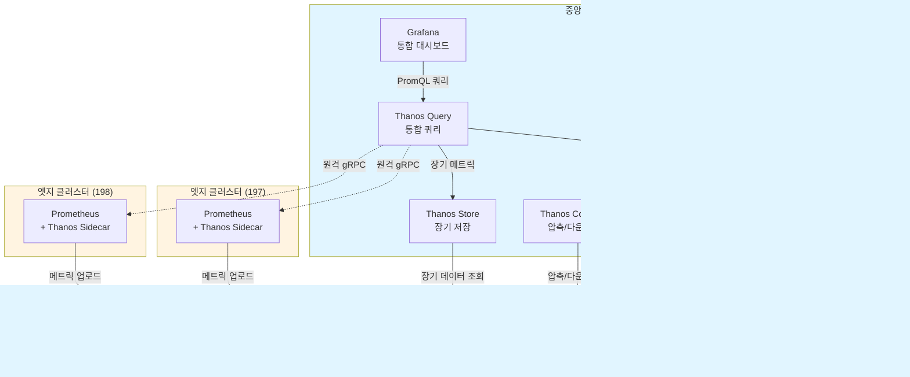

# Thanos Multi-Cluster Monitoring Infrastructure

3-노드 Minikube 클러스터에서 Thanos를 사용한 멀티클러스터 모니터링 및 로깅 인프라

## 아키텍처 개요



## 클러스터 구성

| 클러스터 | IP | 역할 | 주요 컴포넌트 |
|---------|----|----|-------------|
| cluster-196-central | 192.168.101.196 | 중앙 | Prometheus, Thanos Query/Store/Compactor/Ruler, Grafana, OpenSearch |
| cluster-197-edge | 192.168.101.197 | 엣지 | Prometheus + Thanos Sidecar |
| cluster-198-edge | 192.168.101.198 | 엣지 | Prometheus + Thanos Sidecar |

## 기술 스택

- **Kubernetes**: Minikube (containerd driver, 4 CPU, 16GB RAM per node)
- **Monitoring**: kube-prometheus-stack + Thanos
- **Logging**: OpenSearch + Fluent-bit
- **Storage**: Longhorn (CSI), MinIO S3 (외부)
- **Ingress**: NGINX Ingress Controller

## 디렉토리 구조

```
.
├── deploy/
│   ├── base/                        # 기본 Helm values 및 manifests
│   │   ├── longhorn/
│   │   ├── ingress-nginx/
│   │   ├── prometheus/
│   │   ├── thanos/
│   │   ├── opensearch/
│   │   └── fluent-bit/
│   └── overlays/                    # 클러스터별 설정
│       ├── cluster-196-central/
│       ├── cluster-197-edge/
│       └── cluster-198-edge/
├── scripts/
│   ├── minikube/                    # Minikube 설치 스크립트
│   ├── s3/                          # S3 버킷 생성 스크립트
│   └── validation/                  # 검증 스크립트
└── docs/
    ├── architecture/                # 아키텍처 문서
    └── operations/                  # 운영 가이드
```

## 빠른 시작

### 1. 사전 요구사항

- SSH 접근: `ssh bsh@<node-ip>` (비밀번호: `123qwe`)
- MinIO S3: `https://172.20.40.21:30001` (minio/minio123)

### 2. Minikube 설치 (각 노드별)

```bash
# 196번 노드
ssh bsh@192.168.101.196
curl -LO https://storage.googleapis.com/minikube/releases/latest/minikube-linux-amd64
sudo install minikube-linux-amd64 /usr/local/bin/minikube
minikube start --driver=containerd --cpus=4 --memory=16384

# 197번, 198번 노드도 동일하게 실행
```

### 3. S3 버킷 생성

```bash
# MinIO에 접속하여 다음 버킷 생성:
# - thanos
# - opensearch-logs
# - longhorn-backups
```

### 4. 중앙 클러스터 (196) 배포

```bash
# Longhorn
cd /root/develop/thanos
kustomize build deploy/overlays/cluster-196-central/longhorn --enable-helm | kubectl apply -f - -n longhorn-system

# NGINX Ingress
kustomize build deploy/overlays/cluster-196-central/ingress-nginx --enable-helm | kubectl apply -f - -n ingress-nginx

# Prometheus + Thanos
kustomize build deploy/overlays/cluster-196-central/prometheus --enable-helm | kubectl apply -f - -n monitoring

# OpenSearch
kustomize build deploy/overlays/cluster-196-central/opensearch --enable-helm | kubectl apply -f - -n logging

# Fluent-bit
kustomize build deploy/overlays/cluster-196-central/fluent-bit --enable-helm | kubectl apply -f - -n logging
```

### 5. 엣지 클러스터 (197, 198) 배포

```bash
# 197번 노드에서:
kustomize build deploy/overlays/cluster-197-edge/longhorn --enable-helm | kubectl apply -f - -n longhorn-system
kustomize build deploy/overlays/cluster-197-edge/ingress-nginx --enable-helm | kubectl apply -f - -n ingress-nginx
kustomize build deploy/overlays/cluster-197-edge/prometheus --enable-helm | kubectl apply -f - -n monitoring
kustomize build deploy/overlays/cluster-197-edge/opensearch --enable-helm | kubectl apply -f - -n logging
kustomize build deploy/overlays/cluster-197-edge/fluent-bit --enable-helm | kubectl apply -f - -n logging

# 198번 노드도 동일하게 실행 (197 → 198로 변경)
```

## 접근 URL

### 중앙 클러스터 (196)

- **Grafana**: http://grafana.mkube-196.miribit.lab:30080
- **Thanos Query**: http://thanos.mkube-196.miribit.lab:30080
- **Prometheus**: http://prometheus.mkube-196.miribit.lab:30080
- **Alertmanager**: http://alertmanager.mkube-196.miribit.lab:30080
- **OpenSearch**: http://opensearch.mkube-196.miribit.lab:30080
- **Longhorn UI**: http://longhorn.mkube-196.miribit.lab:30080

### 엣지 클러스터 (197, 198)

- **Grafana**: http://grafana.mkube-{197,198}.miribit.lab:30080
- **Alertmanager**: http://alertmanager.mkube-{197,198}.miribit.lab:30080
- **OpenSearch**: http://opensearch.mkube-{197,198}.miribit.lab:30080
- **Longhorn UI**: http://longhorn.mkube-{197,198}.miribit.lab:30080

## 주요 기능

### 1. 멀티클러스터 메트릭 통합

- 중앙 클러스터의 Thanos Query를 통해 모든 클러스터의 메트릭 통합 조회
- S3 기반 장기 저장 (14일 raw, 30일 5분 해상도, 90일 1시간 해상도)
- 자동 다운샘플링 및 압축 (Thanos Compactor)

### 2. 로그 수집 및 보관

- Fluent-bit로 모든 Pod 및 호스트 로그 수집
- OpenSearch에 14일 로컬 보관
- ISM 정책으로 14일 후 S3 스냅샷 생성
- 180일 후 자동 삭제

### 3. 알림

- Alertmanager를 통한 알림 전송 (수동 대응)
- Thanos Ruler로 글로벌 알림 규칙 관리

## 운영 가이드

자세한 운영 가이드는 다음 문서를 참조하세요:

- [아키텍처 상세](docs/architecture/README.md)
- [트러블슈팅](docs/operations/troubleshooting.md)
- [백업 및 복구](docs/operations/backup-restore.md)

## 라이센스

MIT License

## 문의

프로젝트 관련 문의는 Issue를 통해 남겨주세요.
