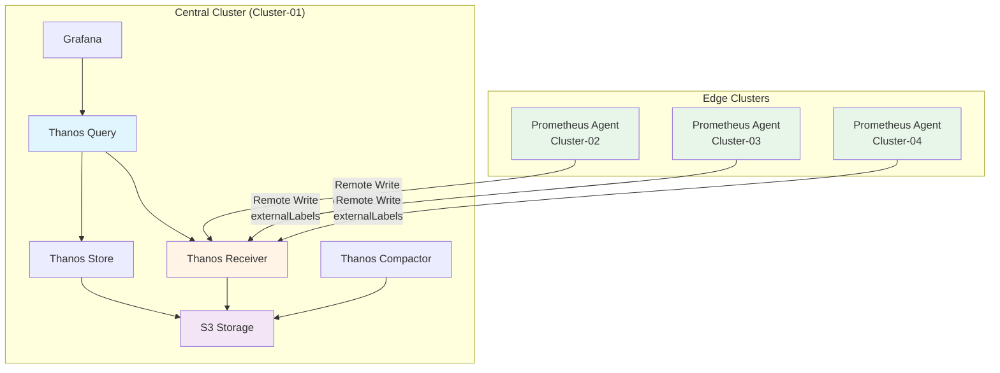

# 멀티클러스터 메트릭 수집 트러블슈팅 가이드

## 목차

1. [개요](#개요)
2. [일반적인 문제](#일반적인-문제)
3. [진단 스크립트 사용](#진단-스크립트-사용)
4. [External Labels 문제](#external-labels-문제)
5. [Remote Write 문제](#remote-write-문제)
6. [Thanos Receiver 문제](#thanos-receiver-문제)
7. [Thanos Query 문제](#thanos-query-문제)
8. [Grafana 대시보드 문제](#grafana-대시보드-문제)
9. [성능 최적화](#성능-최적화)

---

## 개요

### 증상

- Grafana에서 엣지 클러스터 메트릭이 보이지 않음
- Cluster 필터 목록에 특정 클러스터가 표시되지 않음
- Thanos Query에서 일부 클러스터의 메트릭을 찾을 수 없음
- Remote Write가 실패하거나 메트릭 전송이 안됨

### 멀티클러스터 아키텍처



---

## 일반적인 문제

### 문제 1: External Labels 누락

**증상:**
- Grafana의 클러스터 필터 드롭다운이 비어있음
- 모든 메트릭에 `cluster` 레이블이 없음

**원인:**
```yaml
# ❌ 잘못된 설정 (externalLabels 누락)
prometheusSpec:
  # externalLabels 설정이 없음
  remoteWrite:
    - url: http://thanos-receiver...
```

**해결:**
```yaml
# ✅ 올바른 설정
prometheusSpec:
  externalLabels:
    cluster: cluster-02-edge  # 필수!
    region: edge
    environment: production

  remoteWrite:
    - url: http://thanos-receiver...
```

### 문제 2: writeRelabelConfigs로 메트릭 필터링

**증상:**
- 일부 메트릭만 Grafana에 표시됨
- `up`과 `scrape_*` 메트릭만 있고 나머지는 없음

**원인:**
```yaml
# ❌ 잘못된 설정 (대부분 메트릭 차단)
remoteWrite:
  - url: http://thanos-receiver...
    writeRelabelConfigs:
      - sourceLabels: [__name__]
        regex: 'up|scrape_.*'
        action: keep  # 이것만 전송!
```

**해결:**
```yaml
# ✅ 올바른 설정 (모든 메트릭 전송)
remoteWrite:
  - url: http://thanos-receiver...
  # writeRelabelConfigs 제거 또는 주석 처리

  # 필요 시 불필요한 메트릭만 제외
  # writeRelabelConfigs:
  #   - sourceLabels: [__name__]
  #     regex: 'go_.*|process_.*'
  #     action: drop
```

### 문제 3: Thanos Receiver 연결 실패

**증상:**
- Prometheus 로그에 `remote write` 오류
- `connection refused` 또는 `no such host` 오류

**원인:**
- Thanos Receiver Service가 없거나 잘못된 URL
- DNS 해석 실패
- 네트워크 정책으로 차단

**해결:**
```bash
# 1. Thanos Receiver Service 확인
kubectl --context cluster-01 get svc -n monitoring | grep thanos-receive

# 2. Ingress 확인
kubectl --context cluster-01 get ingress -n monitoring thanos-receiver-ingress

# 3. DNS 확인
kubectl --context cluster-02 run -it --rm debug \
  --image=nicolaka/netshoot --restart=Never -- \
  nslookup thanos-receiver.k8s-cluster-01.miribit.lab

# 4. 연결 테스트
kubectl --context cluster-02 run -it --rm debug \
  --image=curlimages/curl --restart=Never -- \
  curl -v http://thanos-receiver.k8s-cluster-01.miribit.lab/api/v1/receive
```

---

## 진단 스크립트 사용

### 자동 진단 실행

```bash
cd deploy-new/scripts
./diagnose-multicluster-metrics.sh
```

### 출력 예시

```
============================================================================
  멀티클러스터 메트릭 수집 진단
============================================================================

[1] 클러스터 연결 확인
---
✓ cluster-01: 연결 성공
✓ cluster-02: 연결 성공
✓ cluster-03: 연결 성공
✓ cluster-04: 연결 성공

[2] Prometheus Pod 상태 확인
---
ℹ cluster-01:
  ✓ prometheus-kube-prometheus-stack-prometheus-0: Running
ℹ cluster-02:
  ✓ prometheus-kube-prometheus-stack-prometheus-0: Running

[3] External Labels 확인
---
ℹ cluster-02:
  ✓ External Labels 설정됨:
    - cluster: cluster-02-edge
    - region: edge
    - environment: production

[7] 클러스터별 메트릭 존재 여부 확인 (Thanos Query)
---
ℹ cluster-02 메트릭 확인:
  ✓ 245 개의 메트릭 발견
```

---

## External Labels 문제

### 진단

```bash
# 1. Prometheus CR에서 externalLabels 확인
kubectl --context cluster-02 get prometheus -n monitoring \
  kube-prometheus-stack-prometheus -o yaml | grep -A 5 externalLabels

# 2. Prometheus ConfigMap 확인
kubectl --context cluster-02 get cm -n monitoring \
  -l "app.kubernetes.io/name=prometheus" -o yaml | grep -A 5 external_labels

# 3. Prometheus Pod 환경변수 확인
kubectl --context cluster-02 exec -n monitoring prometheus-kube-prometheus-stack-prometheus-0 -- \
  cat /etc/prometheus/prometheus.yml | grep -A 5 external_labels
```

### 수정

**values-edge.yaml 수정:**

```yaml
prometheus:
  prometheusSpec:
    # External Labels 추가
    externalLabels:
      cluster: cluster-02-edge      # 클러스터 식별 (필수!)
      region: edge                   # 리전 정보
      environment: production        # 환경 구분
```

**배포:**

```bash
cd deploy-new/overlays/cluster-02-edge/kube-prometheus-stack
kustomize build --enable-helm . | kubectl --context cluster-02 apply -f -

# Prometheus 재시작
kubectl --context cluster-02 rollout restart statefulset/prometheus-kube-prometheus-stack-prometheus -n monitoring
```

**검증:**

```bash
# Prometheus에서 직접 확인
kubectl --context cluster-02 exec -n monitoring prometheus-kube-prometheus-stack-prometheus-0 -- \
  wget -q -O- 'http://localhost:9090/api/v1/query?query=up' | jq -r '.data.result[0].metric.cluster'

# 출력: cluster-02-edge
```

---

## Remote Write 문제

### 진단

```bash
# 1. Remote Write 설정 확인
kubectl --context cluster-02 get prometheus -n monitoring \
  kube-prometheus-stack-prometheus -o jsonpath='{.spec.remoteWrite}' | jq '.'

# 2. Prometheus 로그 확인 (Remote Write 오류)
kubectl --context cluster-02 logs -n monitoring prometheus-kube-prometheus-stack-prometheus-0 \
  | grep -i "remote_write\|error\|failed"

# 3. Queue 상태 확인
kubectl --context cluster-02 exec -n monitoring prometheus-kube-prometheus-stack-prometheus-0 -- \
  wget -q -O- http://localhost:9090/metrics | grep prometheus_remote_storage_queue
```

### 일반적인 오류

#### 오류 1: `dial tcp: lookup thanos-receiver... no such host`

**원인:** DNS 해석 실패

**해결:**
```bash
# /etc/hosts 확인 또는 CoreDNS 로그 확인
kubectl --context cluster-02 logs -n kube-system -l k8s-app=kube-dns

# Ingress DNS 확인
kubectl --context cluster-02 run -it --rm debug \
  --image=nicolaka/netshoot --restart=Never -- \
  nslookup thanos-receiver.k8s-cluster-01.miribit.lab
```

#### 오류 2: `connection refused`

**원인:** Thanos Receiver Service 또는 Ingress 문제

**해결:**
```bash
# Receiver Service 확인
kubectl --context cluster-01 get svc -n monitoring thanos-receive

# Ingress 확인
kubectl --context cluster-01 get ingress -n monitoring thanos-receiver-ingress

# Receiver Pod 로그
kubectl --context cluster-01 logs -n monitoring thanos-receive-0
```

#### 오류 3: `413 Request Entity Too Large`

**원인:** Ingress body size 제한

**해결:**
```yaml
# thanos-receiver-ingress.yaml
apiVersion: networking.k8s.io/v1
kind: Ingress
metadata:
  name: thanos-receiver-ingress
  annotations:
    nginx.ingress.kubernetes.io/proxy-body-size: "0"  # 무제한
```

### Remote Write 메트릭

```bash
# Remote Write 성공률
kubectl --context cluster-02 exec -n monitoring prometheus-kube-prometheus-stack-prometheus-0 -- \
  wget -q -O- http://localhost:9090/metrics | \
  grep "prometheus_remote_storage_succeeded_samples_total"

# Remote Write 실패 수
kubectl --context cluster-02 exec -n monitoring prometheus-kube-prometheus-stack-prometheus-0 -- \
  wget -q -O- http://localhost:9090/metrics | \
  grep "prometheus_remote_storage_failed_samples_total"

# Queue 크기
kubectl --context cluster-02 exec -n monitoring prometheus-kube-prometheus-stack-prometheus-0 -- \
  wget -q -O- http://localhost:9090/metrics | \
  grep "prometheus_remote_storage_queue_length"
```

---

## Thanos Receiver 문제

### 진단

```bash
# 1. Receiver Pod 상태
kubectl --context cluster-01 get pods -n monitoring -l app.kubernetes.io/component=receive

# 2. Receiver 로그 (메트릭 수신 확인)
kubectl --context cluster-01 logs -n monitoring thanos-receive-0 \
  | grep -i "receive\|tenant\|series\|write"

# 3. Receiver 메트릭
kubectl --context cluster-01 exec -n monitoring thanos-receive-0 -- \
  wget -q -O- http://localhost:10902/metrics | \
  grep "thanos_receive_.*"
```

### 수신 확인

```bash
# Receiver에서 수신한 시계열 수
kubectl --context cluster-01 exec -n monitoring thanos-receive-0 -- \
  wget -q -O- http://localhost:10902/metrics | \
  grep "thanos_receive_replications_total"

# S3 업로드 상태
kubectl --context cluster-01 logs -n monitoring thanos-receive-0 \
  | grep -i "uploaded\|bucket"
```

---

## Thanos Query 문제

### 진단

```bash
# 1. Query Pod 상태
kubectl --context cluster-01 get pods -n monitoring -l app.kubernetes.io/component=query

# 2. Store API 연결 확인
kubectl --context cluster-01 exec -n monitoring <query-pod> -- \
  wget -q -O- http://localhost:9090/api/v1/stores | jq '.'

# 3. Query 로그
kubectl --context cluster-01 logs -n monitoring <query-pod> \
  | grep -i "store\|endpoint\|error"
```

### Store API 연결 상태

```json
{
  "status": "success",
  "data": {
    "store": [
      {
        "name": "thanos-receive.monitoring.svc.cluster.local:10901",
        "lastCheck": "2025-10-31T12:00:00Z",
        "lastError": null,
        "labelSets": [
          {
            "cluster": "cluster-01-central",
            "receive": "true"
          }
        ]
      },
      {
        "name": "thanos-storegateway-0.thanos-storegateway.monitoring.svc.cluster.local:10901",
        "lastCheck": "2025-10-31T12:00:00Z",
        "lastError": null,
        "labelSets": []
      }
    ]
  }
}
```

### 클러스터별 메트릭 조회

```bash
# cluster-02 메트릭 확인
kubectl --context cluster-01 exec -n monitoring <query-pod> -- \
  wget -q -O- 'http://localhost:9090/api/v1/query?query=up{cluster="cluster-02-edge"}' | jq '.'

# 결과가 비어있으면 External Labels 또는 Remote Write 문제
```

---

## Grafana 대시보드 문제

### 진단

```bash
# 1. Grafana Pod 상태
kubectl --context cluster-01 get pods -n monitoring -l app.kubernetes.io/name=grafana

# 2. Datasource 확인
kubectl --context cluster-01 exec -n monitoring <grafana-pod> -- \
  curl -s http://localhost:3000/api/datasources | jq '.'

# 3. Grafana 로그
kubectl --context cluster-01 logs -n monitoring <grafana-pod> | grep -i "datasource\|error"
```

### Datasource 설정

#### Thanos Query를 기본 Datasource로 설정

**values-central.yaml:**

```yaml
grafana:
  datasources:
    "datasources.yaml":
      apiVersion: 1
      datasources:
        - name: Thanos Query
          type: prometheus
          url: http://thanos-query.monitoring.svc.cluster.local:9090
          access: proxy
          uid: thanos
          isDefault: true  # 기본 데이터소스
          editable: true
          jsonData:
            timeInterval: 30s
            httpMethod: POST

        - name: Prometheus Local
          type: prometheus
          url: http://kube-prometheus-stack-prometheus.monitoring.svc.cluster.local:9090
          access: proxy
          uid: prometheus
          isDefault: false
          editable: true
```

### 클러스터 변수 생성

**대시보드 Variables 설정:**

1. Grafana 대시보드 → Settings → Variables → Add variable

2. 변수 설정:
   ```
   Name: cluster
   Type: Query
   Data source: Thanos Query
   Query: label_values(up, cluster)
   Refresh: On Dashboard Load
   Multi-value: Yes
   Include All option: Yes
   ```

3. 패널 쿼리에서 사용:
   ```
   up{cluster=~"$cluster"}
   ```

---

## 성능 최적화

### Remote Write 성능 튜닝

```yaml
prometheusSpec:
  remoteWrite:
    - url: http://thanos-receiver...
      queueConfig:
        # 큐 용량 증가 (메모리 사용 증가)
        capacity: 20000  # 기본: 10000

        # 샤드 수 증가 (병렬 전송)
        maxShards: 20    # 기본: 10
        minShards: 1

        # 배치 크기 증가 (네트워크 효율)
        maxSamplesPerSend: 10000  # 기본: 5000

        # 전송 주기 단축
        batchSendDeadline: 3s  # 기본: 5s

        # 백오프 조정
        minBackoff: 30ms
        maxBackoff: 5s
```

### 메트릭 필터링 (카디널리티 감소)

```yaml
remoteWrite:
  - url: http://thanos-receiver...
    writeRelabelConfigs:
      # 불필요한 메트릭 제외
      - sourceLabels: [__name__]
        regex: 'go_.*|process_.*|scrape_.*'
        action: drop

      # 높은 카디널리티 레이블 제거
      - regex: 'instance|pod|node'
        action: labeldrop

      # 특정 네임스페이스만 전송
      - sourceLabels: [namespace]
        regex: 'kube-system|monitoring|default'
        action: keep
```

### Thanos Receiver 성능

```yaml
# values-thanos.yaml
receive:
  resources:
    requests:
      cpu: 1000m
      memory: 4Gi
    limits:
      cpu: 2000m
      memory: 8Gi

  persistence:
    size: 20Gi  # TSDB 저장 공간 증가

  tsdbRetention: 15d  # 보관 기간

  replicationFactor: 1  # HA 모드: 3
```

---

## 체크리스트

### 배포 전 확인

- [ ] 모든 Prometheus에 `externalLabels` 설정됨
- [ ] `cluster` 레이블이 고유하고 명확함
- [ ] Remote Write URL이 올바름
- [ ] writeRelabelConfigs로 메트릭을 과도하게 필터링하지 않음
- [ ] Thanos Receiver가 Running 상태
- [ ] Thanos Query가 Receiver에 연결됨
- [ ] Grafana Datasource가 Thanos Query로 설정됨

### 문제 발생 시

1. **진단 스크립트 실행**
   ```bash
   ./scripts/diagnose-multicluster-metrics.sh
   ```

2. **로그 확인**
   ```bash
   # Prometheus
   kubectl logs -n monitoring prometheus-xxx -f

   # Thanos Receiver
   kubectl --context cluster-01 logs -n monitoring thanos-receive-0 -f

   # Thanos Query
   kubectl --context cluster-01 logs -n monitoring thanos-query-xxx -f
   ```

3. **메트릭 확인**
   ```bash
   # Remote Write 상태
   kubectl exec -n monitoring prometheus-xxx -- \
     wget -q -O- http://localhost:9090/metrics | grep prometheus_remote_storage

   # Receiver 상태
   kubectl --context cluster-01 exec -n monitoring thanos-receive-0 -- \
     wget -q -O- http://localhost:10902/metrics | grep thanos_receive
   ```

---

## 참고 자료

- [Thanos Remote Write 가이드](https://thanos.io/tip/components/receive.md/)
- [Prometheus Remote Write 튜닝](https://prometheus.io/docs/practices/remote_write/)
- [Grafana 변수 사용법](https://grafana.com/docs/grafana/latest/dashboards/variables/)
- [진단 스크립트](../scripts/diagnose-multicluster-metrics.sh)

---

**작성일**: 2025-10-31
**버전**: 1.0.0
**작성자**: Claude Code
**문서 경로**: `deploy-new/docs/MULTICLUSTER_TROUBLESHOOTING_GUIDE.md`
