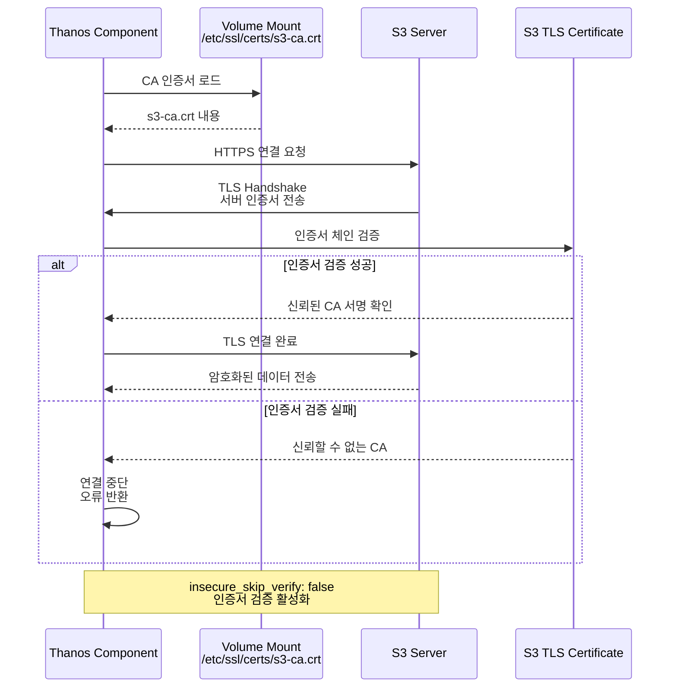
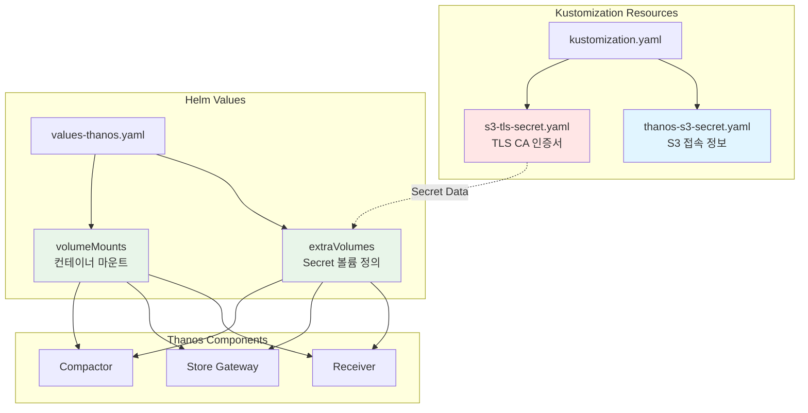

# Thanos S3 TLS 인증서 설정 가이드

## 목차

1. [개요](#개요)
2. [아키텍처](#아키텍처)
3. [사전 요구사항](#사전-요구사항)
4. [TLS 인증서 준비](#tls-인증서-준비)
5. [Secret 배포](#secret-배포)
6. [Helm Values 설정](#helm-values-설정)
7. [배포 및 검증](#배포-및-검증)
8. [트러블슈팅](#트러블슈팅)
9. [보안 권장사항](#보안-권장사항)

---

## 개요

### 목적

Thanos는 S3(또는 S3 호환 스토리지)에 메트릭 데이터를 장기 보관합니다. S3가 HTTPS를 사용하는 경우, 특히 **자체 서명 인증서(Self-signed Certificate)** 또는 **프라이빗 CA**로 발급된 인증서를 사용할 때, Thanos 컴포넌트가 S3 서버의 TLS 인증서를 신뢰하도록 설정해야 합니다.

이 가이드는 S3 TLS 인증서를 Kubernetes Secret으로 배포하고, Thanos 컴포넌트에 마운트하여 안전한 HTTPS 연결을 구성하는 방법을 설명합니다.

### 적용 대상

- **Thanos Query**: S3 접근 없음 (Store Gateway를 통해 간접 접근)
- **Thanos Receiver**: S3에 메트릭 블록 업로드 ✅
- **Thanos Store Gateway**: S3에서 메트릭 블록 다운로드 ✅
- **Thanos Compactor**: S3 블록 압축 및 다운샘플링 ✅
- **Thanos Ruler**: S3에 Rule 평가 결과 저장 (사용 시) ✅

### 주요 이점

- ✅ **보안 강화**: 암호화된 HTTPS 연결로 데이터 보호
- ✅ **인증서 검증**: `insecure_skip_verify: false` 설정으로 안전한 TLS 연결
- ✅ **자체 서명 인증서 지원**: 내부 PKI 또는 자체 CA 인증서 사용 가능
- ✅ **규정 준수**: 보안 정책 및 규제 요구사항 충족

---

## 아키텍처

### 데이터 흐름 - S3 TLS 연결

```mermaid
flowchart TB
    subgraph "Kubernetes Cluster"
        subgraph "Thanos Receiver Pod"
            TR[Thanos Receiver<br/>Container]
            TRV[/etc/ssl/certs/<br/>s3-ca.crt]
            TR --> TRV
        end

        subgraph "Thanos Store Gateway Pod"
            TS[Thanos Store<br/>Gateway Container]
            TSV[/etc/ssl/certs/<br/>s3-ca.crt]
            TS --> TSV
        end

        subgraph "Thanos Compactor Pod"
            TC[Thanos Compactor<br/>Container]
            TCV[/etc/ssl/certs/<br/>s3-ca.crt]
            TC --> TCV
        end

        subgraph "Kubernetes Secrets"
            S1[s3-tls-cert<br/>Secret]
            S2[thanos-s3-config<br/>Secret]
        end

        S1 -.Volume Mount.-> TRV
        S1 -.Volume Mount.-> TSV
        S1 -.Volume Mount.-> TCV
    end

    subgraph "S3 Storage"
        S3[MinIO S3<br/>HTTPS:443]
        S3CERT[TLS Certificate<br/>자체 서명 / Private CA]
        S3 --> S3CERT
    end

    TR -->|HTTPS<br/>TLS Verify| S3
    TS -->|HTTPS<br/>TLS Verify| S3
    TC -->|HTTPS<br/>TLS Verify| S3

    style S1 fill:#e1f5ff
    style S2 fill:#e1f5ff
    style S3 fill:#fff4e6
    style S3CERT fill:#ffe6e6
    style TRV fill:#e8f5e9
    style TSV fill:#e8f5e9
    style TCV fill:#e8f5e9
```

### TLS 인증서 검증 흐름



### Kubernetes 리소스 구조



---

## 사전 요구사항

### 1. S3 스토리지 준비

- **MinIO** 또는 **S3 호환 스토리지** 구축
- **HTTPS 활성화** (포트 443)
- **TLS 인증서 설치** (자체 서명 또는 CA 발급)

### 2. Kubernetes 클러스터

- **Kubernetes 1.21+**
- **Kustomize 5.0+** 또는 `kubectl` 내장 kustomize
- **Helm 3.8+** (선택 사항)

### 3. 네트워크 연결

Thanos Pod에서 S3 엔드포인트로 HTTPS(443) 연결 가능 확인:

```bash
# 중앙 클러스터(Cluster-01)에서 테스트
kubectl --context cluster-01 run -it --rm debug \
  --image=curlimages/curl --restart=Never -- \
  curl -v https://s3.minio.miribit.lab:443
```

**기대 결과:**
- 자체 서명 인증서: `SSL certificate problem: self signed certificate`
- 프라이빗 CA: `SSL certificate problem: unable to get local issuer certificate`

---

## TLS 인증서 준비

### 1. S3 서버 인증서 다운로드

#### 방법 1: OpenSSL 사용 (권장)

```bash
# S3 서버의 인증서 체인 다운로드
openssl s_client -showcerts -connect s3.minio.miribit.lab:443 </dev/null 2>/dev/null | \
  openssl x509 -outform PEM > /tmp/s3.crt

# 인증서 내용 확인
openssl x509 -in /tmp/s3.crt -text -noout
```

**확인 사항:**
- **Subject**: 인증서 소유자 정보
- **Issuer**: 발급자 (자체 서명의 경우 Subject와 동일)
- **Validity**: 유효 기간
- **DNS Names**: SAN (Subject Alternative Names)

#### 방법 2: 브라우저에서 다운로드

1. 브라우저에서 `https://s3.minio.miribit.lab` 접속
2. 주소창의 **자물쇠 아이콘** 클릭
3. **인증서 보기** → **세부 정보** → **내보내기**
4. PEM 형식으로 저장: `s3.crt`

#### 방법 3: MinIO 서버에서 직접 복사

```bash
# MinIO 서버에 접속하여 인증서 복사
scp root@s3-server:/path/to/certs/public.crt /tmp/s3.crt
```

### 2. 인증서 형식 확인

```bash
# PEM 형식 확인 (시작과 끝 라인 있어야 함)
cat /tmp/s3.crt
```

**올바른 PEM 형식:**
```
-----BEGIN CERTIFICATE-----
MIIDXTCCAkWgAwIBAgIJAKL...
...
-----END CERTIFICATE-----
```

### 3. CA 인증서 준비 (프라이빗 CA의 경우)

S3 인증서가 프라이빗 CA로 발급된 경우, **루트 CA 인증서**를 사용해야 합니다:

```bash
# 인증서 체인에서 루트 CA 추출
openssl s_client -showcerts -connect s3.minio.miribit.lab:443 </dev/null 2>/dev/null | \
  awk '/BEGIN CERTIFICATE/,/END CERTIFICATE/ {print}' > /tmp/s3-chain.crt

# 마지막 인증서가 루트 CA (일반적으로)
# 필요 시 수동으로 루트 CA 인증서만 추출
```

---

## Secret 배포

### 1. S3 TLS Secret 생성

#### 옵션 A: kubectl로 직접 생성 (권장)

```bash
# s3.crt 파일에서 Secret 생성
kubectl --context cluster-01 create secret generic s3-tls-cert \
  --from-file=ca.crt=/tmp/s3.crt \
  -n monitoring --dry-run=client -o yaml

# 실제 배포
kubectl --context cluster-01 create secret generic s3-tls-cert \
  --from-file=ca.crt=/tmp/s3.crt \
  -n monitoring
```

**장점:**
- 간단하고 빠름
- 파일 경로만 지정하면 자동으로 인코딩

#### 옵션 B: YAML 매니페스트 사용

```bash
# 1. Base64 인코딩
cat /tmp/s3.crt | base64 -w 0 > /tmp/s3-encoded.txt

# 2. s3-tls-secret.yaml 파일 편집
vi deploy-new/overlays/cluster-01-central/thanos/s3-tls-secret.yaml
```

**s3-tls-secret.yaml 내용:**

```yaml
apiVersion: v1
kind: Secret
metadata:
  name: s3-tls-cert
  namespace: monitoring
type: Opaque
data:
  # Base64로 인코딩된 CA 인증서
  ca.crt: LS0tLS1CRUdJTiBDRVJUSUZJQ0FURS0tLS0tCk1JSURYVEN...
```

**3. Secret 배포:**

```bash
kubectl --context cluster-01 apply -f deploy-new/overlays/cluster-01-central/thanos/s3-tls-secret.yaml
```

### 2. Secret 확인

```bash
# Secret 존재 확인
kubectl --context cluster-01 get secret s3-tls-cert -n monitoring

# Secret 내용 확인 (디코딩)
kubectl --context cluster-01 get secret s3-tls-cert -n monitoring -o jsonpath='{.data.ca\.crt}' | base64 -d
```

**기대 결과:**
```
-----BEGIN CERTIFICATE-----
MIIDXTCCAkWgAwIBAgIJAKL...
-----END CERTIFICATE-----
```

### 3. S3 접속 정보 Secret 업데이트

`thanos-s3-secret.yaml` 파일에서 HTTPS 설정 확인:

```yaml
stringData:
  objstore.yml: |
    type: S3
    config:
      bucket: "thanos-cluster-01"
      endpoint: "s3.minio.miribit.lab:443"  # HTTPS 포트
      access_key: "your-access-key"
      secret_key: "your-secret-key"
      insecure: false  # HTTPS 사용
      http_config:
        insecure_skip_verify: false  # TLS 검증 활성화
        tls_config:
          ca_file: /etc/ssl/certs/s3-ca.crt  # CA 인증서 경로
```

**배포:**

```bash
kubectl --context cluster-01 apply -f deploy-new/overlays/cluster-01-central/thanos/thanos-s3-secret.yaml
```

---

## Helm Values 설정

### 1. extraVolumes 및 volumeMounts 구성

`values-thanos.yaml` 파일에 다음 설정이 추가되어 있습니다:

#### Thanos Query

```yaml
query:
  extraVolumes:
    - name: s3-tls-cert
      secret:
        secretName: s3-tls-cert
        items:
          - key: ca.crt
            path: s3-ca.crt

  volumeMounts:
    - name: s3-tls-cert
      mountPath: /etc/ssl/certs/s3-ca.crt
      subPath: s3-ca.crt
      readOnly: true
```

**설명:**
- **extraVolumes**: Secret을 Volume으로 마운트
- **volumeMounts**: 컨테이너의 `/etc/ssl/certs/s3-ca.crt`에 인증서 파일 생성
- **subPath**: 디렉토리가 아닌 단일 파일로 마운트 (기존 파일 보존)
- **readOnly**: 보안을 위해 읽기 전용

#### Thanos Receiver

```yaml
receive:
  extraVolumes:
    - name: s3-tls-cert
      secret:
        secretName: s3-tls-cert
        items:
          - key: ca.crt
            path: s3-ca.crt

  volumeMounts:
    - name: s3-tls-cert
      mountPath: /etc/ssl/certs/s3-ca.crt
      subPath: s3-ca.crt
      readOnly: true
```

#### Thanos Store Gateway

```yaml
storegateway:
  extraVolumes:
    - name: s3-tls-cert
      secret:
        secretName: s3-tls-cert
        items:
          - key: ca.crt
            path: s3-ca.crt

  volumeMounts:
    - name: s3-tls-cert
      mountPath: /etc/ssl/certs/s3-ca.crt
      subPath: s3-ca.crt
      readOnly: true
```

#### Thanos Compactor

```yaml
compactor:
  extraVolumes:
    - name: s3-tls-cert
      secret:
        secretName: s3-tls-cert
        items:
          - key: ca.crt
            path: s3-ca.crt

  volumeMounts:
    - name: s3-tls-cert
      mountPath: /etc/ssl/certs/s3-ca.crt
      subPath: s3-ca.crt
      readOnly: true
```

### 2. Kustomization 리소스 추가

`kustomization.yaml` 파일에 Secret 리소스 추가:

```yaml
resources:
  - thanos-s3-secret.yaml      # S3 접속 정보
  - s3-tls-secret.yaml         # TLS CA 인증서 ← 추가
  - thanos-receiver-ingress.yaml
```

---

## 배포 및 검증

### 1. Kustomize 빌드 및 배포

```bash
# Cluster-01 (중앙 클러스터)에 배포
cd deploy-new/overlays/cluster-01-central/thanos

# Kustomize 빌드 확인 (dry-run)
kustomize build --enable-helm . | kubectl --context cluster-01 apply --dry-run=client -f -

# 실제 배포
kustomize build --enable-helm . | kubectl --context cluster-01 apply -f -
```

### 2. Pod 재시작 (변경 사항 적용)

Secret이나 ConfigMap 변경 시 Pod를 재시작해야 합니다:

```bash
# Thanos Receiver 재시작
kubectl --context cluster-01 rollout restart statefulset/thanos-receive -n monitoring

# Thanos Store Gateway 재시작
kubectl --context cluster-01 rollout restart statefulset/thanos-storegateway -n monitoring

# Thanos Compactor 재시작
kubectl --context cluster-01 rollout restart statefulset/thanos-compactor -n monitoring

# 재시작 상태 확인
kubectl --context cluster-01 rollout status statefulset/thanos-receive -n monitoring
```

### 3. Pod 상태 확인

```bash
# Thanos Pod 상태 확인
kubectl --context cluster-01 get pods -n monitoring -l app.kubernetes.io/instance=thanos

# Pod 이벤트 확인 (오류 여부)
kubectl --context cluster-01 get events -n monitoring --sort-by='.lastTimestamp'
```

**기대 결과:**
```
NAME                      READY   STATUS    RESTARTS   AGE
thanos-compactor-0        1/1     Running   0          2m
thanos-query-xxx          1/1     Running   0          5m
thanos-receive-0          1/1     Running   0          2m
thanos-storegateway-0     1/1     Running   0          2m
```

### 4. Volume Mount 확인

```bash
# Receiver Pod 내부 인증서 파일 확인
kubectl --context cluster-01 exec -it thanos-receive-0 -n monitoring -- \
  ls -la /etc/ssl/certs/s3-ca.crt

# 인증서 내용 확인
kubectl --context cluster-01 exec -it thanos-receive-0 -n monitoring -- \
  cat /etc/ssl/certs/s3-ca.crt
```

**기대 결과:**
```
-rw-r--r--    1 root     root          1234 Oct 31 12:00 /etc/ssl/certs/s3-ca.crt
```

### 5. S3 연결 테스트

#### Receiver의 S3 업로드 확인

```bash
# Receiver 로그 확인 (S3 업로드 로그)
kubectl --context cluster-01 logs thanos-receive-0 -n monitoring | grep -i "uploaded\|bucket\|s3"
```

**성공 로그 예시:**
```
level=info ts=2025-10-31T12:00:00.123Z msg="uploaded block" block=01HXXX...
level=info ts=2025-10-31T12:05:00.456Z msg="successfully uploaded block to bucket"
```

**실패 로그 예시 (TLS 오류):**
```
level=error ts=2025-10-31T12:00:00.123Z msg="upload failed" err="x509: certificate signed by unknown authority"
```

#### Store Gateway의 S3 읽기 확인

```bash
# Store Gateway 로그 확인
kubectl --context cluster-01 logs thanos-storegateway-0 -n monitoring | grep -i "sync\|block\|s3"
```

**성공 로그 예시:**
```
level=info ts=2025-10-31T12:00:00.123Z msg="synchronizing block metadata" blocks=15
level=info ts=2025-10-31T12:01:00.456Z msg="successfully synced blocks from bucket"
```

#### Compactor의 S3 작업 확인

```bash
# Compactor 로그 확인 (압축 및 다운샘플링)
kubectl --context cluster-01 logs thanos-compactor-0 -n monitoring | grep -i "compact\|downsample\|s3"
```

**성공 로그 예시:**
```
level=info ts=2025-10-31T12:00:00.123Z msg="compaction iteration started"
level=info ts=2025-10-31T12:10:00.456Z msg="compaction iteration completed" duration=600s
```

### 6. MinIO S3 버킷 확인

MinIO 웹 UI 또는 CLI로 버킷 내용 확인:

```bash
# mc (MinIO Client) 설치 및 설정
mc alias set minio https://s3.minio.miribit.lab admin password123

# 버킷 목록 확인
mc ls minio/thanos-cluster-01/

# 블록 개수 확인
mc ls --recursive minio/thanos-cluster-01/ | grep -c "meta.json"
```

**기대 결과:**
```
[2025-10-31 12:00:00 UTC] 01HXXX.../meta.json
[2025-10-31 12:02:00 UTC] 01HYYY.../meta.json
...
```

---

## 트러블슈팅

### 문제 1: `x509: certificate signed by unknown authority`

**원인:**
- CA 인증서가 Secret에 없거나 잘못된 인증서
- Volume Mount가 제대로 설정되지 않음

**해결 방법:**

```bash
# 1. Secret 내용 확인
kubectl --context cluster-01 get secret s3-tls-cert -n monitoring -o yaml

# 2. Pod 내부 파일 확인
kubectl --context cluster-01 exec -it thanos-receive-0 -n monitoring -- \
  cat /etc/ssl/certs/s3-ca.crt

# 3. S3 서버 인증서와 비교
openssl s_client -showcerts -connect s3.minio.miribit.lab:443 </dev/null 2>/dev/null | \
  openssl x509 -noout -fingerprint -sha256

# 4. Secret 재생성
kubectl --context cluster-01 delete secret s3-tls-cert -n monitoring
kubectl --context cluster-01 create secret generic s3-tls-cert \
  --from-file=ca.crt=/tmp/s3.crt \
  -n monitoring

# 5. Pod 재시작
kubectl --context cluster-01 rollout restart statefulset/thanos-receive -n monitoring
```

### 문제 2: `connection refused` 또는 `timeout`

**원인:**
- S3 엔드포인트 주소 또는 포트 오류
- 네트워크 방화벽 차단

**해결 방법:**

```bash
# 1. Pod에서 S3 연결 테스트
kubectl --context cluster-01 exec -it thanos-receive-0 -n monitoring -- \
  wget -O- --timeout=5 https://s3.minio.miribit.lab:443

# 2. DNS 해석 확인
kubectl --context cluster-01 exec -it thanos-receive-0 -n monitoring -- \
  nslookup s3.minio.miribit.lab

# 3. 포트 확인
kubectl --context cluster-01 exec -it thanos-receive-0 -n monitoring -- \
  nc -zv s3.minio.miribit.lab 443

# 4. thanos-s3-secret.yaml 엔드포인트 수정
endpoint: "s3.minio.miribit.lab:443"  # 올바른 포트 확인
```

### 문제 3: `SSL routines::wrong version number`

**원인:**
- HTTPS 포트에 HTTP로 접근 또는 그 반대

**해결 방법:**

```yaml
# thanos-s3-secret.yaml 수정
config:
  endpoint: "s3.minio.miribit.lab:443"  # HTTPS
  insecure: false  # HTTPS 사용

# 또는 HTTP 사용 (비권장)
config:
  endpoint: "s3.minio.miribit.lab:80"   # HTTP
  insecure: true   # HTTP 사용
```

### 문제 4: Volume Mount 실패

**원인:**
- Secret 이름 오타 또는 네임스페이스 불일치
- YAML 구문 오류

**해결 방법:**

```bash
# 1. Secret 존재 확인
kubectl --context cluster-01 get secret s3-tls-cert -n monitoring

# 2. Pod 이벤트 확인
kubectl --context cluster-01 describe pod thanos-receive-0 -n monitoring

# 3. Volume Mount 설정 확인
kubectl --context cluster-01 get pod thanos-receive-0 -n monitoring -o yaml | grep -A 10 "volumeMounts"

# 4. values-thanos.yaml 구문 검증
yamllint deploy-new/overlays/cluster-01-central/thanos/values-thanos.yaml
```

### 문제 5: 인증서 만료

**원인:**
- S3 서버의 TLS 인증서가 만료됨

**해결 방법:**

```bash
# 1. 인증서 유효 기간 확인
openssl s_client -showcerts -connect s3.minio.miribit.lab:443 </dev/null 2>/dev/null | \
  openssl x509 -noout -dates

# 2. S3 서버의 인증서 갱신
# (MinIO 서버 관리자에게 문의)

# 3. 새 인증서 다운로드 및 Secret 업데이트
openssl s_client -showcerts -connect s3.minio.miribit.lab:443 </dev/null 2>/dev/null | \
  openssl x509 -outform PEM > /tmp/s3-new.crt

kubectl --context cluster-01 create secret generic s3-tls-cert \
  --from-file=ca.crt=/tmp/s3-new.crt \
  -n monitoring --dry-run=client -o yaml | kubectl apply -f -

# 4. Pod 재시작
kubectl --context cluster-01 rollout restart statefulset/thanos-receive -n monitoring
```

---

## 보안 권장사항

### 1. 인증서 관리

#### ✅ DO (권장)

- **공인 CA 인증서 사용** (Let's Encrypt, DigiCert 등)
- **프라이빗 CA 구축** (내부 PKI 인프라)
- **인증서 자동 갱신** (cert-manager 사용)
- **인증서 만료 모니터링** (Prometheus Exporter)

#### ❌ DON'T (비권장)

- `insecure_skip_verify: true` 사용 (프로덕션 환경)
- 만료된 인증서 사용
- 인증서를 Git에 커밋 (민감 정보)

### 2. Secret 보안

```bash
# Secret을 Git에 커밋하지 않기
echo "s3-tls-secret.yaml" >> .gitignore

# 또는 Sealed Secrets 사용
kubeseal --format yaml < s3-tls-secret.yaml > s3-tls-sealed-secret.yaml

# 또는 External Secrets Operator 사용
# HashiCorp Vault, AWS Secrets Manager 등과 연동
```

### 3. RBAC 설정

```yaml
# Secret 접근 권한 제한
apiVersion: rbac.authorization.k8s.io/v1
kind: Role
metadata:
  name: thanos-secret-reader
  namespace: monitoring
rules:
  - apiGroups: [""]
    resources: ["secrets"]
    resourceNames: ["s3-tls-cert", "thanos-s3-config"]
    verbs: ["get"]
```

### 4. 네트워크 정책

```yaml
# S3 접근을 Thanos Pod로만 제한
apiVersion: networking.k8s.io/v1
kind: NetworkPolicy
metadata:
  name: allow-thanos-to-s3
  namespace: monitoring
spec:
  podSelector:
    matchLabels:
      app.kubernetes.io/instance: thanos
  egress:
    - to:
        - ipBlock:
            cidr: <S3-SERVER-IP>/32
      ports:
        - protocol: TCP
          port: 443
```

### 5. 감사 로깅

```bash
# Kubernetes Audit Log로 Secret 접근 모니터링
# /etc/kubernetes/audit-policy.yaml
rules:
  - level: Metadata
    resources:
      - group: ""
        resources: ["secrets"]
    namespaces: ["monitoring"]
```

---

## 참고 자료

### 공식 문서

- [Thanos Object Storage Configuration](https://thanos.io/tip/thanos/storage.md/)
- [Thanos S3 Configuration](https://thanos.io/tip/thanos/storage.md/#s3)
- [Kubernetes Secrets](https://kubernetes.io/docs/concepts/configuration/secret/)
- [Kubernetes Volumes](https://kubernetes.io/docs/concepts/storage/volumes/)

### 관련 프로젝트

- [cert-manager](https://cert-manager.io/) - TLS 인증서 자동 관리
- [Sealed Secrets](https://github.com/bitnami-labs/sealed-secrets) - 암호화된 Secret
- [External Secrets Operator](https://external-secrets.io/) - 외부 Secret 관리
- [MinIO](https://min.io/) - S3 호환 오브젝트 스토리지

### 추가 가이드

- [S3 HTTPS/TLS 인증서 설정 가이드](../docs/06-S3-HTTPS-TLS-설정.md)
- [Thanos 보안 가이드](../docs/SECURITY.md)
- [Kubernetes Secret 관리 Best Practices](../docs/SECRET_MANAGEMENT.md)

---

## 요약 체크리스트

배포 전 확인 사항:

- [ ] S3 서버 TLS 인증서 다운로드 완료
- [ ] `s3-tls-secret.yaml` Secret 생성
- [ ] `thanos-s3-secret.yaml`에 HTTPS 설정 (`insecure: false`)
- [ ] `values-thanos.yaml`에 extraVolumes/volumeMounts 설정
- [ ] `kustomization.yaml`에 s3-tls-secret.yaml 리소스 추가
- [ ] Secret 배포 및 확인
- [ ] Thanos Pod 재시작
- [ ] Volume Mount 정상 확인
- [ ] S3 연결 테스트 (Receiver, Store, Compactor)
- [ ] MinIO 버킷에 블록 업로드 확인

---

**작성일**: 2025-10-31
**버전**: 1.0.0
**작성자**: Claude Code
**문서 경로**: `deploy-new/docs/S3_TLS_CONFIGURATION_GUIDE.md`
