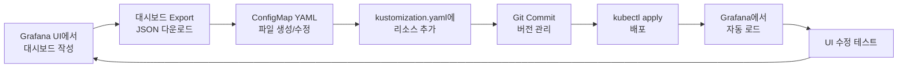

# Grafana 대시보드 구성 가이드

## 📋 개요

이 문서는 kube-prometheus-stack의 Grafana에 커스텀 대시보드를 통합하고 수정 가능하도록 설정하는 방법을 설명합니다.

## 🎯 주요 특징

- ✅ **자동 로딩**: ConfigMap으로 관리되는 대시보드를 Grafana가 자동으로 검색하여 로드
- ✅ **UI 수정 가능**: Grafana UI에서 대시보드를 직접 수정 가능 (`allowUiUpdates: true`)
- ✅ **Git 관리**: 대시보드 JSON이 Git으로 버전 관리됨
- ✅ **멀티 클러스터 지원**: 모든 네임스페이스에서 대시보드 검색 가능

## 📂 디렉토리 구조

```
deploy-new/overlays/cluster-01-central/kube-prometheus-stack/
├── kustomization.yaml              # 리소스 통합 설정
├── values-central.yaml             # Grafana 대시보드 sidecar 설정
├── s3-tls-secret.yaml
└── dashboards/                     # 대시보드 ConfigMaps
    ├── grafana-dashboard-multi-cluster-overview.yaml
    ├── grafana-dashboard-ops-main-navigation.yaml
    ├── grafana-dashboard-ops-nav-dataplatform.yaml
    ├── grafana-dashboard-ops-nav-infrastructure.yaml
    ├── grafana-dashboard-ops-nav-kubernetes.yaml
    ├── grafana-dashboard-ops-nav-monitoring.yaml
    ├── grafana-dashboard-stable-nav.yaml
    └── grafana-dashboard-k8s-resources-cluster-patch.yaml
```

## 🔧 핵심 설정

### 1. Grafana Sidecar 설정 (values-central.yaml)

```yaml
grafana:
  enabled: true
  adminPassword: admin123

  # Sidecar 설정 - 대시보드 자동 검색 활성화
  sidecar:
    datasources:
      enabled: true
      defaultDatasourceEnabled: false
    dashboards:
      enabled: true                      # 대시보드 sidecar 활성화
      defaultFolderName: "General"       # 기본 폴더명
      label: grafana_dashboard           # 검색할 ConfigMap 레이블
      labelValue: "1"
      folder: /tmp/dashboards
      folderAnnotation: grafana_folder
      searchNamespace: ALL               # 모든 네임스페이스 검색
      provider:
        name: sidecarProvider
        orgId: 1
        folder: ''
        type: file
        disableDeletion: false
        allowUiUpdates: true             # 🔑 UI 수정 허용 (중요!)
        foldersFromFilesStructure: true
```

### 2. ConfigMap 레이블 규칙

각 대시보드 ConfigMap은 반드시 다음 레이블을 포함해야 합니다:

```yaml
apiVersion: v1
kind: ConfigMap
metadata:
  name: grafana-dashboard-multi-cluster-overview
  namespace: monitoring
  labels:
    grafana_dashboard: '1'  # 필수 레이블!
data:
  multi-cluster-overview.json: |
    { ... 대시보드 JSON ... }
```

### 3. Kustomization 리소스 등록

```yaml
resources:
  - s3-tls-secret.yaml
  - dashboards/grafana-dashboard-multi-cluster-overview.yaml
  - dashboards/grafana-dashboard-ops-main-navigation.yaml
  # ... 나머지 대시보드들
```

## 🚀 배포 방법

### 방법 1: Kustomize + Helm

```bash
# 1. Kustomize 빌드 확인
kustomize build deploy-new/overlays/cluster-01-central/kube-prometheus-stack --enable-helm

# 2. 배포
kubectl apply -k deploy-new/overlays/cluster-01-central/kube-prometheus-stack --enable-helm

# 3. Grafana Pod 재시작 (필요시)
kubectl rollout restart deployment -n monitoring kube-prometheus-stack-grafana
```

### 방법 2: 단계별 배포

```bash
# 1. 대시보드 ConfigMap만 먼저 배포
kubectl apply -f deploy-new/overlays/cluster-01-central/kube-prometheus-stack/dashboards/

# 2. Grafana Sidecar 재시작으로 자동 로드
kubectl delete pod -n monitoring -l app.kubernetes.io/name=grafana

# 3. 대시보드 확인
kubectl logs -n monitoring -l app.kubernetes.io/name=grafana -c grafana-sc-dashboard
```

## 📊 포함된 대시보드 목록

| 대시보드 | UID | 설명 |
|---------|-----|------|
| 멀티클러스터 통합 모니터링 | `multi-cluster-overview` | 전체 클러스터 리소스 현황 |
| 플랫폼 운영 네비게이션 | `ops-nav-main` | 운영 카테고리별 네비게이션 |
| 인프라 운영 | `ops-nav-infrastructure` | 노드/네트워크/스토리지 모니터링 |
| 쿠버네티스 운영 | `ops-nav-kubernetes` | K8s 클러스터/워크로드 모니터링 |
| 모니터링 플랫폼 | `ops-nav-monitoring` | Thanos/Prometheus 성능 |
| 데이터 플랫폼 운영 | `ops-nav-dataplatform` | Spark/Trino/DB 모니터링 |
| Stable Navigation | `stable-nav` | 안정적인 네비게이션 대시보드 |
| K8s Resources Cluster | - | 클러스터 리소스 상세 |

## ✅ 검증 방법

### 1. Sidecar 로그 확인

```bash
# Grafana dashboard sidecar 컨테이너 로그 확인
kubectl logs -n monitoring -l app.kubernetes.io/name=grafana -c grafana-sc-dashboard --tail=50

# 예상 출력:
# INFO Namespace filtering is enabled
# INFO Searching ConfigMaps in namespace: ALL
# INFO Found ConfigMap: grafana-dashboard-multi-cluster-overview
# INFO Dashboard loaded: multi-cluster-overview.json
```

### 2. ConfigMap 레이블 확인

```bash
# grafana_dashboard 레이블이 있는 ConfigMap 조회
kubectl get cm -n monitoring -l grafana_dashboard=1

# 예상 출력:
# NAME                                          DATA   AGE
# grafana-dashboard-multi-cluster-overview      1      5m
# grafana-dashboard-ops-main-navigation         1      5m
# ...
```

### 3. Grafana UI 접속

```bash
# Grafana 접속
# URL: http://grafana.k8s-cluster-01.miribit.lab
# Username: admin
# Password: admin123

# 1. 왼쪽 메뉴 → Dashboards
# 2. General 폴더에 8개 대시보드 확인
# 3. 대시보드 열기
# 4. 우측 상단 Settings (⚙️) → General → Editable 확인 (체크되어 있어야 함)
```

### 4. 대시보드 수정 테스트

```bash
# Grafana UI에서:
# 1. 대시보드 열기
# 2. 패널 클릭 → Edit
# 3. 쿼리 또는 시각화 수정
# 4. 우측 상단 Save dashboard 버튼 클릭
# 5. "Save dashboard" 버튼이 활성화되어 있으면 성공!
```

## 🔍 문제 해결

### 문제 1: 대시보드가 로드되지 않음

**원인**: ConfigMap 레이블 누락 또는 Sidecar 비활성화

**해결**:
```bash
# 1. ConfigMap 레이블 확인
kubectl get cm -n monitoring grafana-dashboard-multi-cluster-overview -o yaml | grep -A 2 labels

# 2. Sidecar 설정 확인
kubectl get deployment -n monitoring kube-prometheus-stack-grafana -o yaml | grep -A 5 "grafana-sc-dashboard"

# 3. Sidecar 로그 확인
kubectl logs -n monitoring -l app.kubernetes.io/name=grafana -c grafana-sc-dashboard
```

### 문제 2: 대시보드를 수정할 수 없음

**원인**: `allowUiUpdates: false` 설정

**해결**:
```bash
# values-central.yaml에서 확인
grep -A 20 "sidecar:" deploy-new/overlays/cluster-01-central/kube-prometheus-stack/values-central.yaml

# allowUiUpdates: true로 설정되어 있는지 확인
# 재배포 후 Grafana Pod 재시작
kubectl rollout restart deployment -n monitoring kube-prometheus-stack-grafana
```

### 문제 3: 대시보드 변경사항이 재시작 후 사라짐

**설명**:
- UI에서 수정한 내용은 Grafana DB에만 저장됨 (Longhorn PVC)
- ConfigMap을 수정하면 Sidecar가 다시 로드하여 덮어씀

**권장 방법**:
```bash
# 1. Grafana UI에서 대시보드 Export (JSON)
# 2. Export한 JSON을 ConfigMap에 반영
kubectl edit cm -n monitoring grafana-dashboard-multi-cluster-overview

# 3. 또는 로컬 파일 수정 후 재배포
vi deploy-new/overlays/cluster-01-central/kube-prometheus-stack/dashboards/grafana-dashboard-multi-cluster-overview.yaml
kubectl apply -f deploy-new/overlays/cluster-01-central/kube-prometheus-stack/dashboards/
```

## 📝 새로운 대시보드 추가 방법

### 1. ConfigMap 생성

```bash
cat <<EOF > deploy-new/overlays/cluster-01-central/kube-prometheus-stack/dashboards/grafana-dashboard-my-new-dashboard.yaml
apiVersion: v1
kind: ConfigMap
metadata:
  name: grafana-dashboard-my-new-dashboard
  namespace: monitoring
  labels:
    grafana_dashboard: '1'
data:
  my-new-dashboard.json: |
    {
      "uid": "my-new-dashboard",
      "title": "My New Dashboard",
      "tags": ["custom"],
      "timezone": "browser",
      "schemaVersion": 27,
      "version": 1,
      "panels": []
    }
EOF
```

### 2. Kustomization에 추가

```yaml
# kustomization.yaml
resources:
  # ... 기존 리소스들
  - dashboards/grafana-dashboard-my-new-dashboard.yaml
```

### 3. 배포

```bash
kubectl apply -k deploy-new/overlays/cluster-01-central/kube-prometheus-stack --enable-helm
```

## 🎨 대시보드 개발 워크플로우



## 🔐 보안 고려사항

1. **Sensitive Data**: 대시보드에 민감한 정보(비밀번호, API 키) 포함 금지
2. **Access Control**: Grafana RBAC으로 대시보드 접근 제어
3. **Version Control**: Git으로 변경 이력 추적

## 📚 참고 자료

- [Grafana Dashboard Provisioning](https://grafana.com/docs/grafana/latest/administration/provisioning/#dashboards)
- [Kube-Prometheus-Stack Values](https://github.com/prometheus-community/helm-charts/tree/main/charts/kube-prometheus-stack)
- [Grafana Dashboard JSON 스키마](https://grafana.com/docs/grafana/latest/dashboards/json-model/)

## 🎯 주요 설정 요약

| 항목 | 설정값 | 설명 |
|-----|--------|------|
| `sidecar.dashboards.enabled` | `true` | 대시보드 자동 검색 활성화 |
| `sidecar.dashboards.label` | `grafana_dashboard` | 검색할 ConfigMap 레이블 |
| `sidecar.dashboards.searchNamespace` | `ALL` | 모든 네임스페이스 검색 |
| `sidecar.dashboards.provider.allowUiUpdates` | `true` | UI 수정 허용 🔑 |
| `sidecar.dashboards.provider.disableDeletion` | `false` | 대시보드 삭제 허용 |

---

**마지막 업데이트**: 2025-11-05
**작성자**: Thanos Multi-Cluster Project
