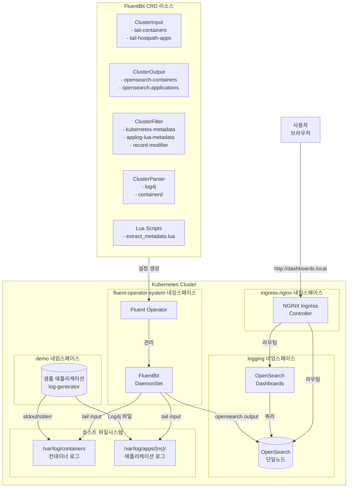
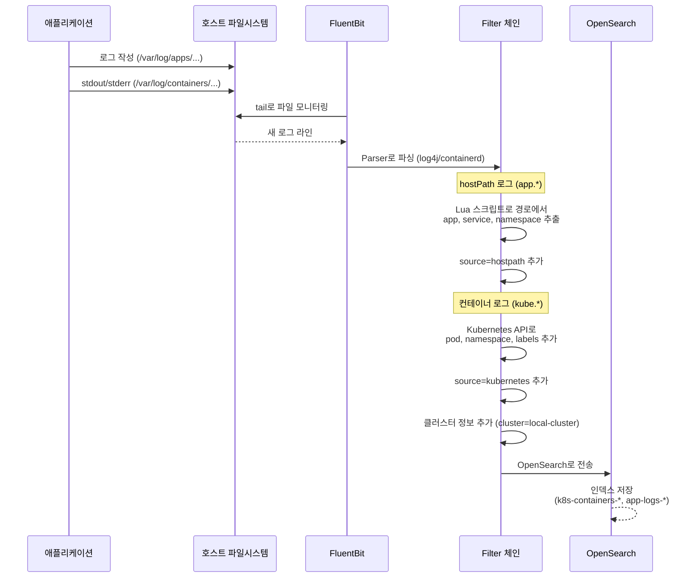
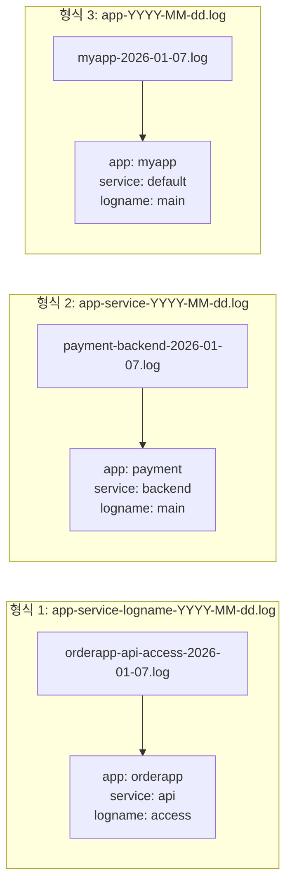

# OpenSearch + Fluent-bit 로컬 로깅 스택 배포 가이드

## 개요

이 가이드는 Kubernetes 클러스터에서 OpenSearch와 Fluent-bit Operator를 사용하여 로그 수집 파이프라인을 구성하는 방법을 설명합니다.

### 주요 특징

- **최소 리소스 구성**: 로컬 개발/테스트 환경에 최적화
- **Kustomize 기반 배포**: Helm 차트를 Kustomize로 통합 관리
- **hostPath 로그 수집**: 애플리케이션의 커스텀 로그 파일 수집 지원
- **Log4j 파싱**: Java 애플리케이션의 Log4j 형식 로그 자동 파싱
- **CRD 기반 설정**: FluentBit 설정을 Kubernetes 리소스로 선언적 관리
- **OpenSearch Dashboards**: 웹 UI를 통한 로그 검색 및 시각화
- **Ingress 기반 접속**: NGINX Ingress Controller를 통한 외부 접속 지원

---

## 아키텍처



### 로그 흐름



---

## 디렉토리 구조

```
deploy/local-logging/
├── README.md                    # 이 문서
├── kustomization.yaml           # 최상위 Kustomization
│
├── ingress-nginx/               # NGINX Ingress Controller
│   ├── kustomization.yaml
│   ├── namespace.yaml
│   └── values.yaml
│
├── opensearch/                  # OpenSearch 배포
│   ├── kustomization.yaml
│   ├── namespace.yaml
│   ├── credentials-secret.yaml  # 인증 정보 (Security 비활성화 상태)
│   └── values.yaml              # Helm values (최소 리소스)
│
├── opensearch-dashboards/       # OpenSearch Dashboards (웹 UI)
│   ├── kustomization.yaml
│   ├── values.yaml
│   └── ingress.yaml             # Ingress 설정
│
├── fluent-operator/             # Fluent Operator 배포
│   ├── kustomization.yaml
│   └── values.yaml
│
├── fluentbit-crds/              # FluentBit CRD 리소스
│   ├── kustomization.yaml
│   ├── namespace.yaml
│   ├── serviceaccount.yaml
│   ├── fluentbitconfig.yaml     # ClusterFluentBitConfig
│   ├── fluentbit.yaml           # FluentBit DaemonSet 정의
│   ├── clusterinput-containers.yaml
│   ├── clusterinput-hostpath.yaml
│   ├── clusteroutput.yaml
│   ├── clusterfilter.yaml
│   ├── clusterparser.yaml
│   └── lua-scripts-configmap.yaml
│
└── sample-app/                  # 샘플 로그 생성 애플리케이션
    ├── kustomization.yaml
    ├── namespace.yaml
    ├── deployment.yaml
    └── service.yaml
```

---

## 사전 요구사항

### 시스템 요구사항

| 항목 | 최소 사양 | 권장 사양 |
|-----|---------|---------|
| CPU | 2 cores | 4 cores |
| Memory | 4GB | 8GB |
| Disk | 20GB | 50GB |

### 소프트웨어 요구사항

- Kubernetes 1.25+ (kubeadm, minikube, kind 등)
- kubectl
- Helm 3.x
- kustomize (kubectl 내장 또는 별도 설치)

### 클러스터 준비

```bash
# kubeadm 단일 노드 클러스터 설치 (선택사항)
sudo /root/develop/thanos/scripts/kubeadm/install-kubeadm-single-node.sh

# 클러스터 상태 확인
kubectl cluster-info
kubectl get nodes
```

---

## 배포 방법

### 1. 전체 스택 한번에 배포

```bash
cd /root/develop/thanos/deploy/local-logging

# 전체 배포 (OpenSearch + Fluent Operator + CRDs + 샘플앱)
kustomize build . --enable-helm | kubectl apply -f -

# 배포 상태 확인
kubectl get pods -n logging
kubectl get pods -n fluent-operator-system
kubectl get pods -n demo
```

### 2. 개별 컴포넌트 배포

#### 2.1 NGINX Ingress Controller 배포

```bash
# Ingress Controller 배포
kustomize build ingress-nginx --enable-helm | kubectl apply -f -

# Controller 준비 대기
kubectl wait --for=condition=Ready pod -l app.kubernetes.io/component=controller -n ingress-nginx --timeout=120s

# IngressClass 확인
kubectl get ingressclass
```

#### 2.2 OpenSearch 배포

```bash
# OpenSearch 배포
kustomize build opensearch --enable-helm | kubectl apply -f -

# Pod 준비 대기 (약 2-3분)
kubectl wait --for=condition=Ready pod -l app.kubernetes.io/name=opensearch -n logging --timeout=300s

# 상태 확인
kubectl get pods -n logging
kubectl exec -n logging opensearch-cluster-master-0 -- curl -s localhost:9200
```

#### 2.3 OpenSearch Dashboards 배포

```bash
# Dashboards 배포
kustomize build opensearch-dashboards --enable-helm | kubectl apply -f -

# Pod 준비 대기
kubectl wait --for=condition=Ready pod -l app=opensearch-dashboards -n logging --timeout=180s

# Ingress 확인
kubectl get ingress -n logging
```

#### 2.4 Fluent Operator 배포

```bash
# Fluent Operator 배포
kustomize build fluent-operator --enable-helm | kubectl apply -f -

# Operator 준비 대기
kubectl wait --for=condition=Ready pod -l app.kubernetes.io/name=fluent-operator -n fluent-operator-system --timeout=120s
```

#### 2.5 FluentBit CRD 리소스 배포

```bash
# CRD 리소스 배포
kubectl apply -k fluentbit-crds/

# FluentBit DaemonSet은 별도 적용 필요 (namespace 이슈)
kubectl apply -f fluentbit-crds/fluentbit.yaml

# FluentBit 준비 대기
kubectl wait --for=condition=Ready pod -l app.kubernetes.io/name=fluent-bit -n fluent-operator-system --timeout=120s
```

#### 2.6 샘플 애플리케이션 배포

```bash
# 샘플 앱 배포
kubectl apply -k sample-app/

# 로그 파일 생성 확인
kubectl exec -n demo deploy/log-generator -- ls -la /var/log/apps/demo/
```

---

## OpenSearch Dashboards 접속

### 접속 URL

| 서비스 | 호스트명 | 설명 |
|-------|---------|------|
| OpenSearch Dashboards | `dashboards.local` | 로그 검색 및 시각화 UI |
| OpenSearch API | `opensearch.local` | OpenSearch REST API |

### 접속 방법

#### 방법 1: 호스트 파일 등록 (권장)

```bash
# 노드 IP 확인
NODE_IP=$(kubectl get nodes -o jsonpath='{.items[0].status.addresses[?(@.type=="InternalIP")].address}')
echo $NODE_IP

# /etc/hosts 파일에 추가 (관리자 권한 필요)
echo "$NODE_IP dashboards.local opensearch.local" | sudo tee -a /etc/hosts

# 브라우저에서 접속
# http://dashboards.local
```

#### 방법 2: NodePort 직접 접속

```bash
# NodePort로 접속 (Host 헤더 필요)
curl -H "Host: dashboards.local" http://<NODE_IP>:30080

# 또는 kubectl port-forward 사용
kubectl port-forward -n logging svc/opensearch-dashboards 5601:5601
# 브라우저에서 http://localhost:5601 접속
```

### Dashboards 사용법

#### 1. Index Pattern 생성

1. 좌측 메뉴에서 **Stack Management** > **Index Patterns** 선택
2. **Create index pattern** 클릭
3. Index pattern 입력:
   - 애플리케이션 로그: `app-logs-*`
   - 컨테이너 로그: `k8s-containers-*`
4. Time field로 `@timestamp` 선택
5. **Create index pattern** 클릭

#### 2. 로그 검색 (Discover)

1. 좌측 메뉴에서 **Discover** 선택
2. 상단에서 Index Pattern 선택 (예: `app-logs-*`)
3. 시간 범위 설정 (우측 상단)
4. 검색 쿼리 예시:
   ```
   level: ERROR
   level: ERROR AND logger: *Controller*
   message: "Failed*"
   ```

#### 3. 시각화 (Visualize)

1. 좌측 메뉴에서 **Visualize** 선택
2. **Create visualization** 클릭
3. 시각화 유형 선택 (Pie, Bar, Line 등)
4. Index pattern 및 메트릭 설정

---

## 구성 상세

### OpenSearch 설정 (`opensearch/values.yaml`)

```yaml
# 최소 리소스 구성
replicas: 1
singleNode: true

resources:
  requests:
    cpu: 500m
    memory: 1024Mi
  limits:
    cpu: 1000m
    memory: 1536Mi

# 영속성 비활성화 (테스트용)
persistence:
  enabled: false

# Security 비활성화
config:
  opensearch.yml: |
    plugins.security.disabled: true
    discovery.type: single-node
```

### FluentBit 설정

#### ClusterInput - 컨테이너 로그

```yaml
# clusterinput-containers.yaml
spec:
  tail:
    tag: kube.*
    path: /var/log/containers/*.log
    excludePath: /var/log/containers/*fluent*.log
    parser: containerd
    memBufLimit: 5MB
```

#### ClusterInput - hostPath 애플리케이션 로그

```yaml
# clusterinput-hostpath.yaml
spec:
  tail:
    tag: app.*
    path: /var/log/apps/*/*.log
    parser: log4j
    memBufLimit: 10MB
```

#### ClusterParser - Log4j 형식

```yaml
# clusterparser.yaml
spec:
  regex:
    regex: '^(?<time>\d{4}-\d{2}-\d{2}\s+\d{2}:\d{2}:\d{2}[.,]\d{3})\s+\[(?<thread>[^\]]+)\]\s+(?<level>\w+)\s+(?<logger>[^\s]+)\s+-\s+(?<message>.*)$'
    timeKey: time
    timeFormat: "%Y-%m-%d %H:%M:%S,%L"
```

#### ClusterOutput - OpenSearch

```yaml
# clusteroutput.yaml
spec:
  match: app.*
  opensearch:
    host: opensearch-cluster-master.logging.svc.cluster.local
    port: 9200
    logstashFormat: true
    logstashPrefix: app-logs
```

---

## 로그 경로 규칙

### 애플리케이션 로그 파일 경로 형식

```
/var/log/apps/{namespace}/{app}-{service}-{logname}-YYYY-MM-dd.log
```

| 필드 | 설명 | 예시 |
|-----|-----|-----|
| `{namespace}` | Kubernetes 네임스페이스 | `demo`, `production` |
| `{app}` | 애플리케이션 이름 | `loggenerator`, `api` |
| `{service}` | 서비스/컴포넌트 이름 | `backend`, `worker` |
| `{logname}` | 로그 종류 | `app`, `access`, `error` |
| `YYYY-MM-dd` | 날짜 (일별 로테이션) | `2026-01-07` |

### 예시

```
/var/log/apps/demo/loggenerator-backend-app-2026-01-07.log
/var/log/apps/production/api-gateway-access-2026-01-07.log
```

---

## 로그 메타데이터 Enrichment

FluentBit 파이프라인에서 hostPath 애플리케이션 로그에 메타데이터를 자동으로 추가합니다.

### 파일 경로에서 추출되는 메타데이터

Lua 스크립트(`lua-scripts-configmap.yaml`)가 파일 경로를 분석하여 다음 필드를 자동 추출합니다:

| 필드 | 설명 | 추출 방식 |
|-----|------|---------|
| `namespace` | 애플리케이션 네임스페이스 | `/var/log/apps/{namespace}/...` 에서 추출 |
| `app` | 애플리케이션 이름 | 파일명의 첫 번째 세그먼트 |
| `service` | 서비스/컴포넌트 이름 | 파일명의 두 번째 세그먼트 |
| `logname` | 로그 종류 | 파일명의 세 번째 세그먼트 |

### 지원하는 파일명 형식



### 추가되는 공통 필드

| 필드 | 값 | 설명 |
|-----|---|------|
| `source` | `hostpath` | 로그 소스 유형 (hostPath 파일) |
| `log_type` | `application` | 로그 타입 (애플리케이션 로그) |
| `cluster` | `local-cluster` | 클러스터 식별자 |

### 로그 예시

**입력 파일**: `/var/log/apps/production/orderapp-api-access-2026-01-07.log`

**입력 로그**:
```
2026-01-07 16:16:48,123 [main] INFO com.example.OrderService - Processing order #12345
```

**OpenSearch에 저장되는 문서**:
```json
{
  "@timestamp": "2026-01-07T16:16:48.123Z",
  "app": "orderapp",
  "service": "api",
  "namespace": "production",
  "logname": "access",
  "level": "INFO",
  "logger": "com.example.OrderService",
  "message": "Processing order #12345",
  "thread": "main",
  "time": "2026-01-07 16:16:48,123",
  "filepath": "/var/log/apps/production/orderapp-api-access-2026-01-07.log",
  "source": "hostpath",
  "log_type": "application",
  "cluster": "local-cluster",
  "fluent_tag": "app.var.log.apps.production.orderapp-api-access-2026-01-07.log"
}
```

### OpenSearch Dashboards에서 필터링

메타데이터 필드를 사용하여 로그를 효율적으로 필터링할 수 있습니다:

```
# 특정 앱의 로그만 조회
app: orderapp

# 특정 서비스의 로그만 조회
service: api

# 특정 네임스페이스의 로그만 조회
namespace: production

# 복합 조건 (production 환경의 ERROR 로그)
namespace: production AND level: ERROR

# 특정 앱의 특정 서비스 로그
app: payment AND service: backend

# hostPath 애플리케이션 로그만 조회
log_type: application

# 컨테이너 로그만 조회
log_type: container
```

### 컨테이너 로그 메타데이터

컨테이너 로그(`kube.*`)에는 Kubernetes API를 통해 다음 메타데이터가 자동 추가됩니다:

| 필드 | 설명 |
|-----|------|
| `namespace` | Pod의 네임스페이스 |
| `pod` | Pod 이름 |
| `container` | 컨테이너 이름 |
| `node` | 노드 호스트명 |
| `source` | `kubernetes` |
| `log_type` | `container` |
| Pod Labels | Pod에 정의된 모든 라벨 |

---

## OpenSearch 인덱스

### 인덱스 패턴

| 인덱스 패턴 | 용도 | 소스 |
|-----------|-----|-----|
| `k8s-containers-YYYY.MM.dd` | Kubernetes 컨테이너 로그 | `/var/log/containers/*.log` |
| `app-logs-YYYY.MM.dd` | hostPath 애플리케이션 로그 | `/var/log/apps/*/*.log` |

### 인덱스 조회

```bash
# 인덱스 목록 확인
kubectl exec -n logging opensearch-cluster-master-0 -- \
  curl -s localhost:9200/_cat/indices

# 최근 로그 조회 (애플리케이션 로그)
kubectl exec -n logging opensearch-cluster-master-0 -- \
  curl -s 'localhost:9200/app-logs-*/_search?size=5&pretty' \
  -H 'Content-Type: application/json' \
  -d '{"query": {"match_all": {}}, "sort": [{"@timestamp": "desc"}]}'

# 특정 레벨 로그 조회
kubectl exec -n logging opensearch-cluster-master-0 -- \
  curl -s 'localhost:9200/app-logs-*/_search?pretty' \
  -H 'Content-Type: application/json' \
  -d '{"query": {"match": {"level": "ERROR"}}}'

# 컨테이너 로그 조회
kubectl exec -n logging opensearch-cluster-master-0 -- \
  curl -s 'localhost:9200/k8s-containers-*/_search?size=5&pretty' \
  -H 'Content-Type: application/json' \
  -d '{"query": {"match": {"k8s_namespace_name": "demo"}}}'
```

---

## 검증 및 트러블슈팅

### 배포 상태 확인

```bash
# 전체 Pod 상태
kubectl get pods -A | grep -E "(logging|fluent|demo)"

# FluentBit 로그 확인
kubectl logs -n fluent-operator-system -l app.kubernetes.io/name=fluent-bit --tail=50

# FluentBit 설정 확인
kubectl get secret -n fluent-operator-system fluent-bit-config -o jsonpath='{.data.fluent-bit\.conf}' | base64 -d

# OpenSearch 클러스터 상태
kubectl exec -n logging opensearch-cluster-master-0 -- curl -s localhost:9200/_cluster/health?pretty
```

### 일반적인 문제 해결

#### 1. FluentBit Pod가 시작되지 않는 경우

```bash
# Pod 상태 및 이벤트 확인
kubectl describe pod -n fluent-operator-system -l app.kubernetes.io/name=fluent-bit

# FluentBit CR 상태 확인
kubectl get fluentbit -n fluent-operator-system -o yaml
```

#### 2. 로그가 OpenSearch에 수집되지 않는 경우

```bash
# FluentBit 로그에서 에러 확인
kubectl logs -n fluent-operator-system -l app.kubernetes.io/name=fluent-bit | grep -i error

# OpenSearch 연결 테스트
kubectl exec -n fluent-operator-system -l app.kubernetes.io/name=fluent-bit -- \
  wget -q -O- http://opensearch-cluster-master.logging.svc.cluster.local:9200

# Parser 오류 확인 (parser not registered)
kubectl get secret -n fluent-operator-system fluent-bit-config -o jsonpath='{.data.parsers\.conf}' | base64 -d
```

#### 3. hostPath 로그 파일이 수집되지 않는 경우

```bash
# 로그 파일 존재 확인
ls -la /var/log/apps/

# FluentBit Pod에서 마운트 확인
kubectl get pod -n fluent-operator-system -l app.kubernetes.io/name=fluent-bit -o yaml | grep -A 20 volumeMounts

# tail input 상태 확인 (inotify_fs_add 로그)
kubectl logs -n fluent-operator-system -l app.kubernetes.io/name=fluent-bit | grep inotify
```

#### 4. OpenSearch가 시작되지 않는 경우

```bash
# Pod 로그 확인
kubectl logs -n logging opensearch-cluster-master-0

# 리소스 부족 확인
kubectl describe pod -n logging opensearch-cluster-master-0 | grep -A 5 Events

# 노드 리소스 확인
kubectl top nodes
```

---

## 커스터마이징

### 새로운 애플리케이션 로그 수집 추가

1. **애플리케이션에서 로그 파일 작성**

```yaml
# deployment.yaml에 hostPath 볼륨 추가
volumes:
  - name: app-logs
    hostPath:
      path: /var/log/apps/my-namespace
      type: DirectoryOrCreate

volumeMounts:
  - name: app-logs
    mountPath: /var/log/apps/my-namespace
```

2. **로그 파일 경로 규칙 준수**

```
/var/log/apps/{namespace}/{app}-{service}-{logname}-YYYY-MM-dd.log
```

### 새로운 Parser 추가

```yaml
# custom-parser.yaml
apiVersion: fluentbit.fluent.io/v1alpha2
kind: ClusterParser
metadata:
  name: my-custom-parser
  labels:
    fluentbit.fluent.io/enabled: "true"
spec:
  regex:
    regex: '^(?<time>.*) (?<level>.*) (?<message>.*)$'
    timeKey: time
    timeFormat: "%Y-%m-%d %H:%M:%S"
```

### OpenSearch 리소스 조정

```yaml
# opensearch/values.yaml 수정
resources:
  requests:
    cpu: 1000m      # 증가
    memory: 2048Mi  # 증가
  limits:
    cpu: 2000m
    memory: 4096Mi

# 영속성 활성화 (프로덕션)
persistence:
  enabled: true
  size: 50Gi
  storageClass: "local-path"
```

---

## 리소스 사용량

### 최소 구성 (현재 설정)

| 컴포넌트 | CPU Request | Memory Request | CPU Limit | Memory Limit |
|---------|------------|----------------|-----------|--------------|
| NGINX Ingress | 100m | 128Mi | 500m | 512Mi |
| OpenSearch | 500m | 1024Mi | 1000m | 1536Mi |
| OpenSearch Dashboards | 100m | 256Mi | 500m | 512Mi |
| Fluent Operator | 100m | 128Mi | 500m | 512Mi |
| FluentBit | 50m | 64Mi | 200m | 256Mi |
| **합계** | **850m** | **1600Mi** | **2700m** | **3328Mi** |

### 프로덕션 권장

| 컴포넌트 | CPU Request | Memory Request | CPU Limit | Memory Limit |
|---------|------------|----------------|-----------|--------------|
| OpenSearch (3 replicas) | 1000m x 3 | 4096Mi x 3 | 2000m x 3 | 8192Mi x 3 |
| Fluent Operator | 200m | 256Mi | 1000m | 1024Mi |
| FluentBit | 200m | 256Mi | 500m | 512Mi |

---

## 삭제

```bash
# 개별 삭제 (역순)
kubectl delete -k sample-app/
kubectl delete -f fluentbit-crds/fluentbit.yaml
kubectl delete -k fluentbit-crds/
kustomize build fluent-operator --enable-helm | kubectl delete -f -
kustomize build opensearch-dashboards --enable-helm | kubectl delete -f -
kustomize build opensearch --enable-helm | kubectl delete -f -
kustomize build ingress-nginx --enable-helm | kubectl delete -f -

# 네임스페이스 삭제
kubectl delete ns logging fluent-operator-system demo ingress-nginx

# hostPath 데이터 삭제 (선택)
sudo rm -rf /var/log/apps/*
sudo rm -rf /var/lib/fluent-bit/*
```

---

## 참고 자료

- [OpenSearch Documentation](https://opensearch.org/docs/latest/)
- [OpenSearch Dashboards Guide](https://opensearch.org/docs/latest/dashboards/)
- [Fluent Operator GitHub](https://github.com/fluent/fluent-operator)
- [Fluent Bit Documentation](https://docs.fluentbit.io/)
- [Fluent Bit OpenSearch Output Plugin](https://docs.fluentbit.io/manual/pipeline/outputs/opensearch)
- [NGINX Ingress Controller](https://kubernetes.github.io/ingress-nginx/)
