# 🔍 Prometheus 모니터링 패턴 완전 비교

> **문서 목적**: 단일 Prometheus부터 Thanos 멀티클러스터까지, 세 가지 모니터링 패턴을 실전 시나리오로 비교하여 최적의 선택을 돕습니다.

## 📚 목차

- [1. 네 가지 패턴 한눈에 보기](#1-네-가지-패턴-한눈에-보기)
- [2. Pattern A: 단일 kube-prometheus-stack](#2-pattern-a-단일-kube-prometheus-stack)
- [3. Pattern B: 독립 Observability 클러스터 (Remote Write)](#3-pattern-b-독립-observability-클러스터-remote-write)
- [4. Pattern B+: 모니터링 전용 클러스터 (Sidecar)](#4-pattern-b-모니터링-전용-클러스터-sidecar)
- [5. Pattern C: 공유 중앙 클러스터 (Sidecar)](#5-pattern-c-공유-중앙-클러스터-sidecar)
- [6. 실전 시나리오별 선택 가이드](#6-실전-시나리오별-선택-가이드)
- [7. 마이그레이션 전략](#7-마이그레이션-전략)

---

## 1. 네 가지 패턴 한눈에 보기

### 🎯 Quick Decision Matrix

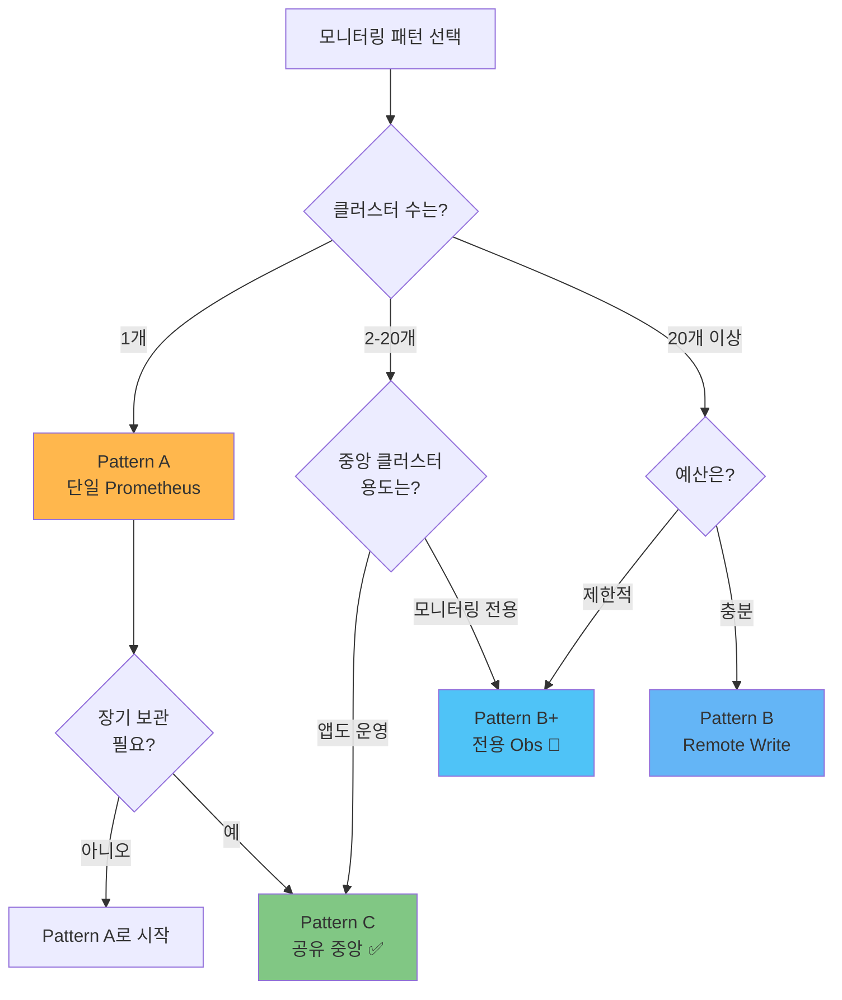

### 📊 핵심 비교 요약

| 특성 | Pattern A<br/>단일 | Pattern C<br/>공유 중앙 | Pattern B+<br/>전용 Obs | Pattern B<br/>Remote Write |
|------|-------------------|------------------------|------------------------|---------------------------|
| **복잡도** | ⭐ | ⭐⭐⭐ | ⭐⭐⭐⭐ | ⭐⭐⭐⭐⭐ |
| **비용** | $ | $$ | $$$ | $$$$ |
| **설치 시간** | 5분 | 30분 | 1시간 | 2시간+ |
| **스토리지** | 로컬 (제한) | S3 (무제한) | S3 (무제한) | S3 (무제한) |
| **멀티클러스터** | ❌ | ✅ | ✅ | ✅ |
| **HA 지원** | ❌ | ⚠️ 부분 | ✅ 완전 | ✅ 완전 |
| **클러스터 독립성** | N/A | ⚠️ 중앙 의존 | ✅ 완전 | ⚠️ 네트워크 의존 |
| **추천 환경** | Dev/Test | 중소규모 ✅ | 중대규모 🎯 | 대규모 |
| **최대 권장** | 1-2개 | 2-20개 | 10-50개 | 50개+ |

---

## 2. Pattern A: 단일 kube-prometheus-stack

### 🏗️ 아키텍처

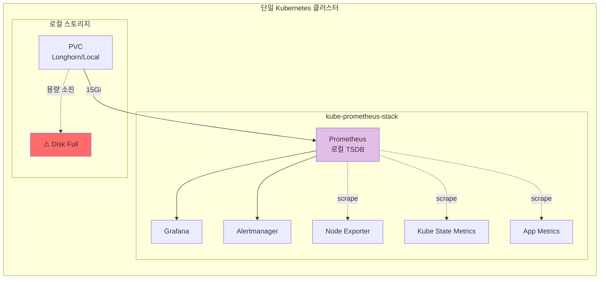

### ✅ 장점

| 장점 | 설명 | 비즈니스 가치 |
|------|------|--------------|
| **즉시 사용 가능** | Helm 한 줄로 설치 완료 | ⏱️ 5분 만에 모니터링 시작 |
| **낮은 러닝 커브** | Prometheus 표준 설정만 이해하면 OK | 👨‍💻 주니어도 운영 가능 |
| **빠른 쿼리** | 모든 데이터가 로컬 | 📈 대시보드 응답 < 100ms |
| **최소 리소스** | CPU 0.5 / Mem 1Gi | 💰 인프라 비용 최소화 |

### ❌ 단점 및 제약사항

| 단점 | 영향 | 실제 시나리오 |
|------|------|--------------|
| **스토리지 제한** | 디스크 용량만큼만 보관 | "3개월 전 장애 원인을 알 수 없어요" |
| **단일 장애점 (SPOF)** | Prometheus 죽으면 메트릭 손실 | "재시작 중 30분 데이터 공백" |
| **멀티클러스터 불가** | 클러스터마다 별도 Grafana | "4개 화면을 일일이 확인해야 해요" |
| **확장 한계** | 수백만 시계열 처리 어려움 | "Prometheus가 OOM 발생" |

### 📊 리소스 사용량

```yaml
# Pattern A: 단일 Prometheus
Prometheus:
  CPU: 500m → 1000m (peak)
  Memory: 1Gi → 2Gi (peak)
  Disk: 15Gi (15일 보관 가능)

Grafana:
  CPU: 100m
  Memory: 256Mi

Alertmanager:
  CPU: 50m
  Memory: 128Mi

---
총 사용량:
  CPU: ~650m (0.65 core)
  Memory: ~1.4Gi
  Disk: 15Gi
```

### 💡 적합한 환경

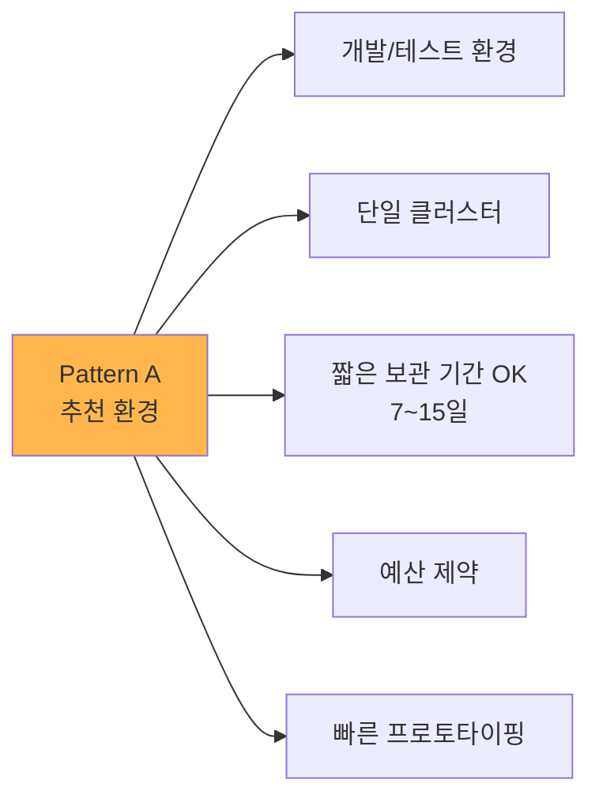

### 🚀 설치 예시

```bash
# Helm으로 5분 설치
helm repo add prometheus-community https://prometheus-community.github.io/helm-charts
helm repo update

helm install kube-prometheus-stack prometheus-community/kube-prometheus-stack \
  --namespace monitoring \
  --create-namespace \
  --set prometheus.prometheusSpec.retention=15d \
  --set prometheus.prometheusSpec.storageSpec.volumeClaimTemplate.spec.resources.requests.storage=15Gi
```

---

## 3. Pattern B: 독립 Observability 클러스터

### 🏗️ 아키텍처

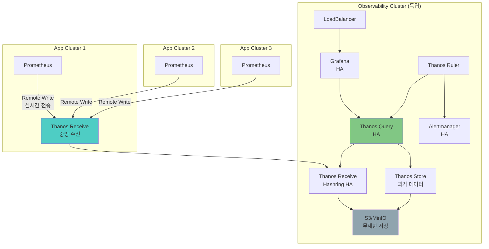

### ✅ 장점

| 장점 | 설명 | 비즈니스 가치 |
|------|------|--------------|
| **완전한 분리** | 관측성 플랫폼 독립 운영 | 🔒 App 장애가 모니터링에 영향 없음 |
| **무제한 확장** | 클러스터 추가가 자유로움 | 📈 100+ 클러스터 지원 |
| **엔터프라이즈 HA** | 모든 컴포넌트 HA 구성 | 💎 99.99% 가용성 |
| **중앙 집중 관리** | 단일 제어점 | 🎯 일관된 정책 적용 |

### ❌ 단점 및 제약사항

| 단점 | 영향 | 실제 시나리오 |
|------|------|--------------|
| **높은 비용** | 독립 클러스터 운영 | "노드 3대 추가 필요 (월 $300+)" |
| **복잡한 설정** | 10개 이상 컴포넌트 관리 | "초기 구축 2주 소요" |
| **네트워크 의존성** | Remote Write 실패 시 데이터 손실 | "네트워크 단절 시 메트릭 누락" |
| **Remote Write 부하** | 실시간 전송으로 부하 | "초당 100만 샘플 전송" |

### 📊 리소스 사용량

```yaml
# Pattern B: Observability Cluster

## App Cluster (each)
Prometheus (Remote Write Only):
  CPU: 500m
  Memory: 1Gi
  Disk: 5Gi (local buffer)

## Observability Cluster
Thanos Receive (Hashring 3 replicas):
  CPU: 1000m × 3 = 3 cores
  Memory: 2Gi × 3 = 6Gi

Thanos Query (2 replicas):
  CPU: 500m × 2 = 1 core
  Memory: 1Gi × 2 = 2Gi

Thanos Store (2 replicas):
  CPU: 500m × 2 = 1 core
  Memory: 1Gi × 2 = 2Gi

Thanos Compactor:
  CPU: 500m
  Memory: 1Gi

Grafana (HA):
  CPU: 250m × 2 = 0.5 core
  Memory: 512Mi × 2 = 1Gi

---
총 사용량 (Obs Cluster):
  CPU: ~6.5 cores
  Memory: ~12Gi
  Node: 최소 3대 (Master + Worker×2)
```

### 💡 적합한 환경

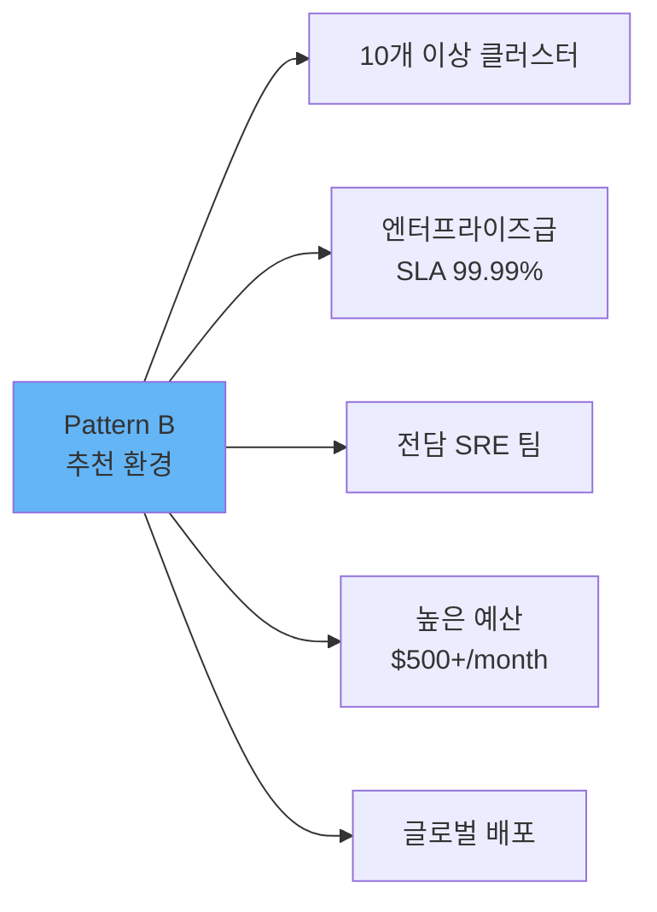

### 🚀 설치 예시 (간략)

```bash
# 1. Observability 클러스터 생성
kubeadm init --pod-network-cidr=10.244.0.0/16

# 2. Thanos Receive 배포
helm install thanos-receive bitnami/thanos \
  --set receive.enabled=true \
  --set receive.replicaCount=3 \
  --set receive.persistence.size=50Gi

# 3. 각 App 클러스터에서 Remote Write 설정
prometheus:
  prometheusSpec:
    remoteWrite:
      - url: http://thanos-receive.observability:19291/api/v1/receive
        queueConfig:
          capacity: 10000
          maxShards: 50
```

### ⚠️ 주의사항

1. **네트워크 대역폭**: 클러스터당 초당 10Mbps+ 필요
2. **Remote Write 버퍼**: 네트워크 단절 대비 로컬 버퍼 필수
3. **비용 계산**: 독립 클러스터 운영 비용 고려 필요

---

## 4. Pattern B+: 모니터링 전용 클러스터 (Sidecar) 🎯

### 🏗️ 아키텍처

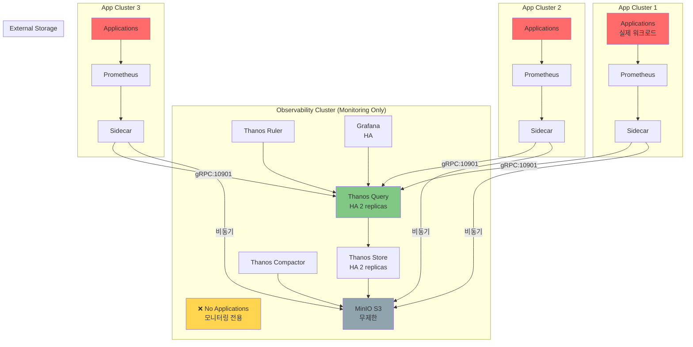

### ✅ 장점

| 장점 | 설명 | 비즈니스 가치 |
|------|------|--------------|
| **완전한 분리** | 관측성 플랫폼 완전 독립 | 🔒 App 장애가 모니터링에 영향 없음 |
| **리소스 보장** | 모니터링 리소스 100% 할당 | 📊 안정적인 성능 |
| **비용 효율** | Pattern B 대비 -60% | 💰 Remote Write 비용 없음 |
| **클러스터 독립성** | 비동기 업로드로 느슨한 결합 | 🔗 네트워크 단절 OK |
| **확장 용이** | Thanos 컴포넌트만 스케일 | 📈 50개 클러스터까지 |

### ❌ 단점 및 제약사항

| 단점 | 영향 | 완화 방법 |
|------|------|----------|
| **독립 클러스터 비용** | 노드 추가 필요 | 중소형 노드로 시작 (4 cores, 8Gi) |
| **초기 설정 복잡** | Pattern C 대비 +30% 시간 | 자동화 스크립트 사용 |
| **2시간 업로드 지연** | 최신 블록 2시간 후 S3 | Sidecar gRPC로 실시간 조회 |

### 📊 리소스 사용량

```yaml
# Pattern B+: Dedicated Observability Cluster (4 App Clusters)

## Observability Cluster
Thanos Query (2 replicas):
  CPU: 500m × 2 = 1 core
  Memory: 512Mi × 2 = 1Gi

Thanos Store (2 replicas):
  CPU: 500m × 2 = 1 core
  Memory: 512Mi × 2 = 1Gi

Thanos Compactor:
  CPU: 500m
  Memory: 512Mi

Thanos Ruler:
  CPU: 200m
  Memory: 256Mi

Grafana (2 replicas):
  CPU: 250m × 2 = 0.5 core
  Memory: 512Mi × 2 = 1Gi

---
Observability Cluster 총:
  CPU: ~3.2 cores
  Memory: ~4.3Gi
  최소 노드: 1대 (4 cores, 8Gi)

## 각 App Cluster (동일)
Prometheus:
  CPU: 500m
  Memory: 1Gi

Thanos Sidecar:
  CPU: 100m
  Memory: 128Mi

---
App Cluster 당:
  CPU: ~0.6 cores
  Memory: ~1.1Gi

## 전체 (Obs 1 + App 4)
총 CPU: 3.2 + (0.6 × 4) = 5.6 cores
총 Memory: 4.3 + (1.1 × 4) = 8.7Gi
S3 Storage: ~500Gi (3개월)
```

### 💡 적합한 환경

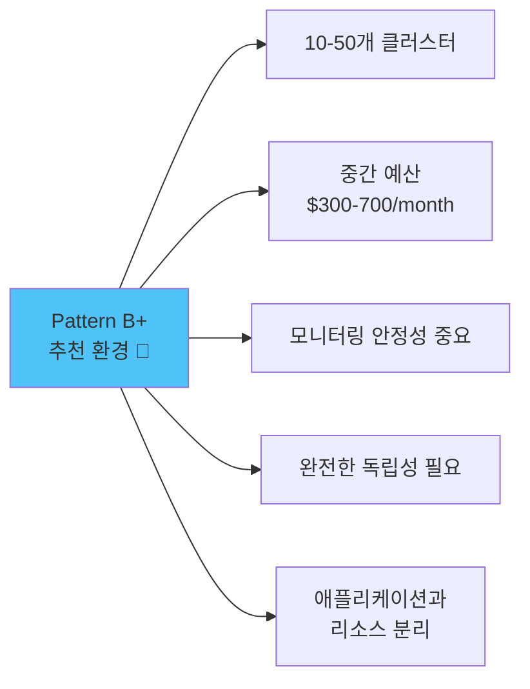

### 🚀 설치 예시

```bash
# 1. 모니터링 전용 클러스터 생성
# 노드: 192.168.101.199 (4 cores, 8Gi)
kubeadm init --pod-network-cidr=10.244.0.0/16

# 2. Cilium CNI + LoadBalancer
helm install cilium cilium/cilium \
  --set l2announcements.enabled=true

# 3. 모든 Thanos 컴포넌트 배포
cd /root/develop/thanos/deploy/overlays/observability-cluster/
kustomize build . --enable-helm | kubectl apply -f -

# 4. 각 App 클러스터는 Sidecar만 배포
cd /root/develop/thanos/deploy/overlays/app-cluster-01/
kustomize build . --enable-helm | kubectl apply -f -
```

### 🎯 핵심 차이점: Pattern B vs B+ vs C

| 구분 | Pattern B<br/>Remote Write | Pattern B+<br/>Dedicated Obs 🎯 | Pattern C<br/>Shared Central |
|------|---------------------------|--------------------------------|------------------------------|
| **중앙 클러스터** | 모니터링 전용 | 모니터링 전용 | 앱 + 모니터링 |
| **데이터 전송** | Remote Write (실시간) | Sidecar (비동기) | Sidecar (비동기) |
| **네트워크 의존성** | ⚠️ 높음 (실시간) | ✅ 낮음 (비동기) | ✅ 낮음 (비동기) |
| **클러스터 독립성** | ⚠️ 낮음 | ✅ 높음 | ⚠️ 중간 |
| **비용** | $$$$ ($2100) | $$$ ($500) | $$ ($270) |
| **최대 권장** | 50-100개 | 10-50개 | 2-20개 |
| **App 장애 영향** | ✅ 없음 | ✅ 없음 | ⚠️ 있음 (리소스 경쟁) |

### ⚠️ Pattern B+가 최적인 경우

```
✅ 모니터링 안정성이 최우선
✅ 10개 이상 클러스터 관리
✅ 애플리케이션과 리소스 분리 필요
✅ Remote Write 비용 부담스러움
✅ 중대규모 확장 예상 (10→50 클러스터)

→ Pattern B+를 선택하세요! 🎯
```

---

## 5. Pattern C: 공유 중앙 클러스터 (Sidecar) ✅

### 🏗️ 아키텍처 (현재 구성)

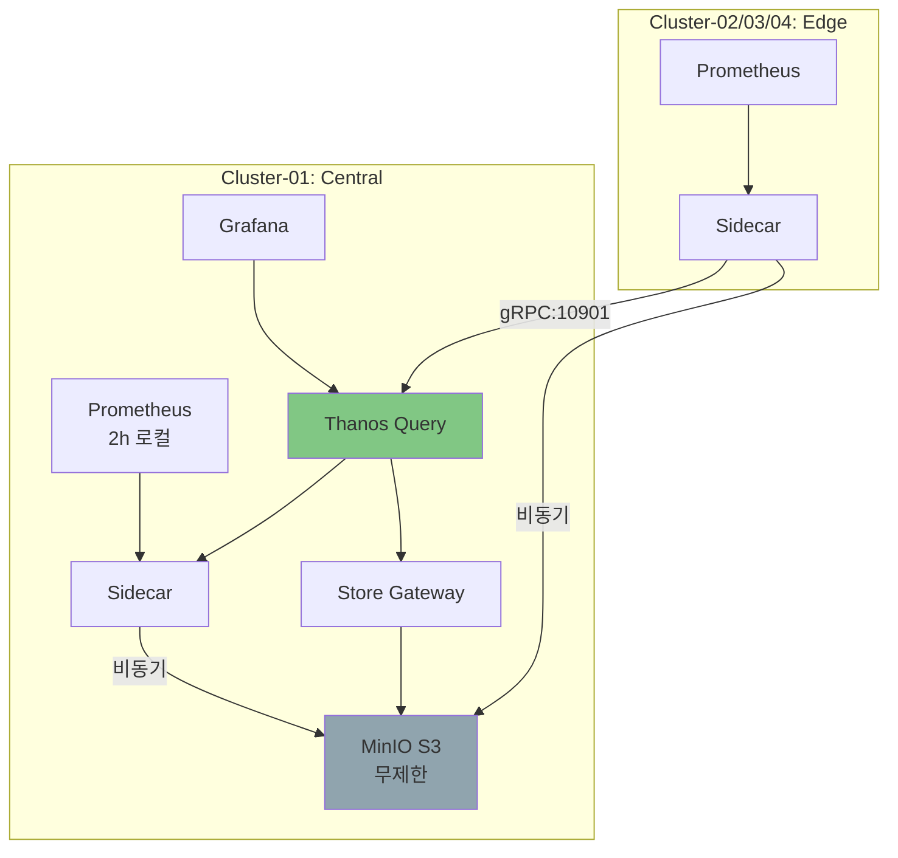

### ✅ 장점

| 장점 | 설명 | 비즈니스 가치 |
|------|------|--------------|
| **클러스터 독립성** | 네트워크 단절해도 각자 동작 | 🔗 높은 복원력 |
| **비동기 업로드** | S3 장애가 Prometheus에 영향 없음 | 📤 낮은 결합도 |
| **적절한 비용** | 독립 클러스터 불필요 | 💰 Pattern A 대비 +50% 비용 |
| **표준 Helm Chart** | kube-prometheus-stack 그대로 사용 | 🛠️ 기존 지식 활용 |

### ❌ 단점 및 제약사항

| 단점 | 영향 | 완화 방법 |
|------|------|----------|
| **Sidecar 리소스** | Prometheus당 추가 100m CPU | Pod 리소스 +20% 할당 |
| **Query SPOF** | Thanos Query 죽으면 통합 조회 불가 | Query 다중화 (2 replicas) |
| **2시간 지연** | 최신 블록은 2시간 후 S3 업로드 | 실시간은 Sidecar gRPC로 조회 |
| **S3 비용** | 스토리지 비용 발생 | Compaction으로 용량 50% 절감 |

### 📊 리소스 사용량

```yaml
# Pattern C: Thanos Sidecar (4 Clusters)

## Central Cluster (01)
Prometheus:
  CPU: 500m → 1000m
  Memory: 1Gi → 2Gi
  Disk: 15Gi (2h retention)

Thanos Sidecar:
  CPU: 100m
  Memory: 128Mi

Thanos Query:
  CPU: 200m
  Memory: 512Mi

Thanos Store:
  CPU: 200m
  Memory: 512Mi

Thanos Compactor:
  CPU: 200m
  Memory: 512Mi

Grafana:
  CPU: 250m
  Memory: 256Mi

---
Central Cluster 총:
  CPU: ~1.45 cores
  Memory: ~3Gi

## Edge Cluster (02/03/04 each)
Prometheus + Sidecar:
  CPU: 600m
  Memory: 1.1Gi
  Disk: 15Gi

---
4-Cluster 전체 총합:
  CPU: ~3.25 cores
  Memory: ~6.3Gi
  S3 Storage: ~500Gi (3개월 보관 시)
```

### 💡 적합한 환경

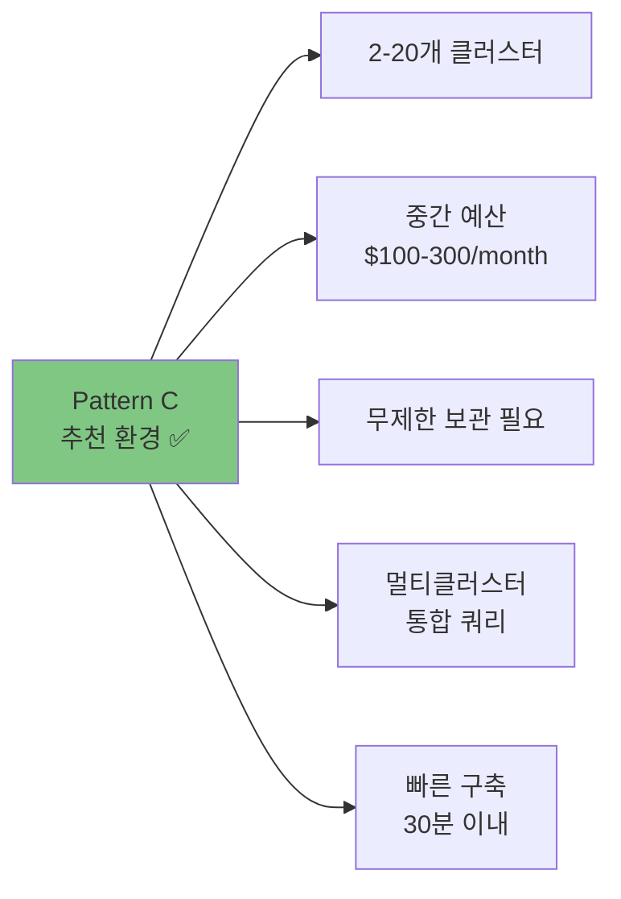

### 🚀 설치 예시

```bash
# Kustomize로 30분 설치
cd /root/develop/thanos/deploy/overlays/cluster-01-central/kube-prometheus-stack

# 1. Base 설정 확인
cat ../../base/kube-prometheus-stack/values.yaml

# 2. Overlay로 배포
kustomize build . --enable-helm | kubectl apply -f -

# 3. Edge 클러스터도 동일
cd ../cluster-02-edge/kube-prometheus-stack
kustomize build . --enable-helm | kubectl apply -f -
```

### 🎯 핵심 설정

```yaml
# values.yaml - Thanos Sidecar 활성화
prometheus:
  prometheusSpec:
    retention: 2h  # 로컬은 2시간만
    thanos:
      image: quay.io/thanos/thanos:v0.37.2
      objectStorageConfig:
        name: thanos-s3-config
        key: objstore.yml
      resources:
        limits:
          cpu: 500m
          memory: 512Mi
```

---

## 5. 실전 시나리오별 선택 가이드

### 📖 시나리오 1: 스타트업 (1개 클러스터, 예산 제한)

```
상황:
- Kubernetes 클러스터 1개
- 개발팀 5명
- 월 예산 $100 이하
- 7일 보관이면 충분

추천: Pattern A (단일 Prometheus)

이유:
✅ 5분 설치
✅ 최소 비용 (~$30/month)
✅ 러닝 커브 낮음
❌ 확장 어려움 (나중에 마이그레이션)

# 설치 명령
helm install kube-prometheus-stack prometheus-community/kube-prometheus-stack \
  --namespace monitoring --create-namespace
```

### 📖 시나리오 2: 중소기업 (4개 클러스터, 3개월 보관 필요)

```
상황:
- Production 2개 + Staging 2개
- DevOps 팀 3명
- 월 예산 $200
- 규정 준수로 3개월 보관 필요

추천: Pattern C (Thanos Sidecar) ✅ 현재 구성

이유:
✅ 멀티클러스터 통합 쿼리
✅ S3 무제한 보관
✅ 30분 설치
✅ 클러스터 독립성
❌ Pattern A 대비 +50% 비용

# 설치 명령
git clone [repo]
cd deploy/overlays/cluster-01-central/kube-prometheus-stack
kustomize build . --enable-helm | kubectl apply -f -
```

### 📖 시나리오 3: 대기업 (50개 클러스터, SLA 99.99%)

```
상황:
- 글로벌 50개 클러스터
- 전담 SRE 팀 10명
- 월 예산 $2000+
- 엔터프라이즈급 SLA 필요

추천: Pattern B (Observability Cluster)

이유:
✅ 완전한 HA
✅ 중앙 집중 관리
✅ 무제한 확장
❌ 높은 비용 (~$1500/month)
❌ 복잡한 설정 (2주 소요)

# 설치 명령 (간략)
helm install thanos-receive bitnami/thanos --set receive.enabled=true
helm install thanos-query bitnami/thanos --set query.enabled=true
```

### 📊 시나리오별 비용 비교

| 항목 | 시나리오 1<br/>(1 Cluster) | 시나리오 2<br/>(4 Clusters) | 시나리오 3<br/>(50 Clusters) |
|------|---------------------------|----------------------------|------------------------------|
| **패턴** | A | C ✅ | B |
| **컴퓨팅** | $30 | $120 | $1200 |
| **스토리지** | $10 (150Gi) | $50 (500Gi S3) | $300 (5TB S3) |
| **네트워크** | $5 | $20 | $100 |
| **관리 비용** | $20 (2h/month) | $80 (8h/month) | $500 (50h/month) |
| **월 총합** | **$65** | **$270** | **$2100** |

---

## 6. 마이그레이션 전략

### 🔄 Pattern A → Pattern C 마이그레이션

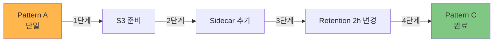

#### 단계별 가이드

```bash
# 1단계: S3 버킷 생성 (5분)
mc alias set minio http://s3.minio.miribit.lab minio minio123
mc mb minio/thanos-bucket

# 2단계: S3 Secret 생성 (5분)
kubectl create secret generic thanos-s3-config \
  --from-file=objstore.yml=thanos-s3-secret.yaml \
  -n monitoring

# 3단계: Helm Values 업데이트 (10분)
# values.yaml에 thanos sidecar 설정 추가
prometheus:
  prometheusSpec:
    retention: 2h  # 15d → 2h
    thanos:
      objectStorageConfig:
        name: thanos-s3-config
        key: objstore.yml

# 4단계: Helm Upgrade (5분)
helm upgrade kube-prometheus-stack prometheus-community/kube-prometheus-stack \
  --namespace monitoring \
  --values values-with-thanos.yaml

# 5단계: Thanos Query 배포 (5분)
kubectl apply -f thanos-query.yaml

# 6단계: Grafana Datasource 변경 (2분)
# Prometheus → Thanos Query

⏱️ 총 소요 시간: ~30분
⚠️ 다운타임: 0분 (Rolling Update)
```

### 🔄 Pattern C → Pattern B 마이그레이션

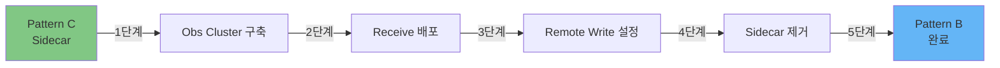

⏱️ 총 소요 시간: ~2주
💰 비용 증가: +400%

---

## 🎓 핵심 요약

### ✅ 의사결정 체크리스트

```
□ 클러스터 수: ____개
□ 데이터 보관 기간: ____일
□ 월 예산: $____
□ DevOps 팀 규모: ____명
□ SLA 요구사항: ____%
□ 멀티클러스터 통합 쿼리 필요: Y / N
□ HA 필수 여부: Y / N
```

### 🎯 최종 추천

```
1-2개 클러스터 & 예산 제한
→ Pattern A (단일 Prometheus)

2-20개 클러스터 & 장기 보관 필요
→ Pattern C (Thanos Sidecar) ✅ 추천

20개 이상 & 엔터프라이즈 SLA
→ Pattern B (Observability Cluster)
```

### 📚 관련 문서

- [아키텍처 개요](./ARCHITECTURE.md) - 전체 구조 이해
- [배포 가이드](./DEPLOYMENT_GUIDE.md) - Pattern C 설치
- [운영 가이드](./OPERATIONS.md) - 일상 운영

---

**Last Updated**: 2025-10-15
**Comparison Version**: 1.0
**Document Style**: Narrative-first + Cognitive UX Writing
