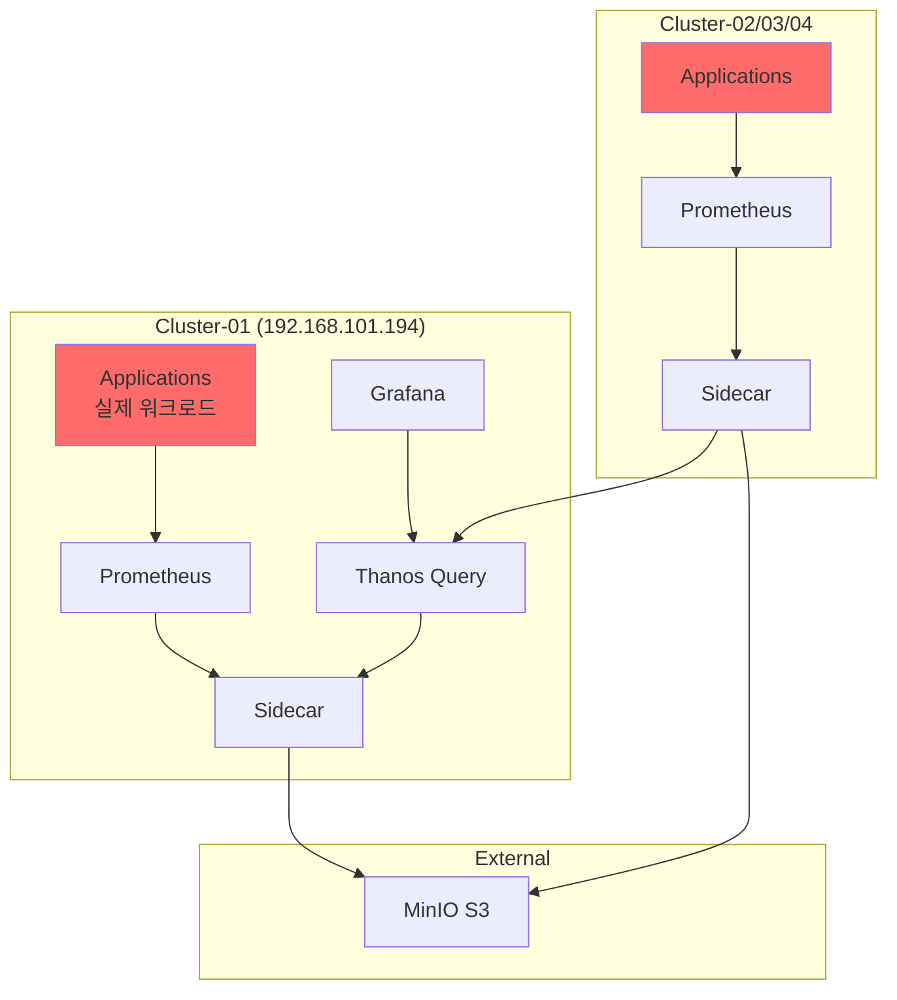
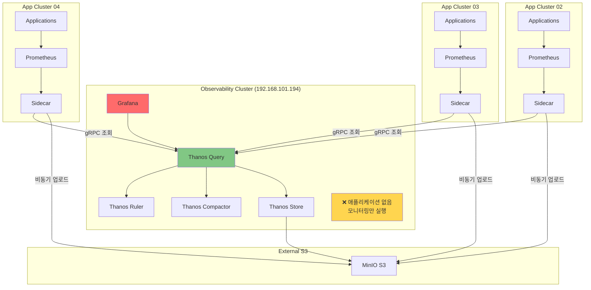
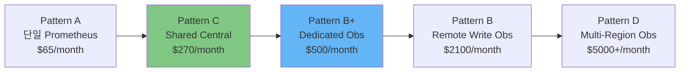

# 🔍 현재 구성 패턴 재분석

> **중요**: Cluster-01이 **모니터링 전용** 클러스터인지, **애플리케이션도 운영**하는 클러스터인지에 따라 패턴이 달라집니다.

## 📊 현재 구성의 두 가지 해석

### 시나리오 A: Cluster-01이 애플리케이션도 운영하는 경우



**패턴**: **Pattern C - Thanos Sidecar with Shared Central Cluster** ✅

**특징:**
- Cluster-01은 **애플리케이션 + 중앙 Thanos** 역할 동시 수행
- 애플리케이션 부하와 모니터링 부하가 같은 클러스터에 존재
- 비용 효율적 (별도 클러스터 불필요)
- **중소규모 (2-20 클러스터)에 적합**

**리소스 분리:**
```yaml
# Cluster-01 리소스 분리
Applications:
  CPU: 10-20 cores (대부분)
  Memory: 32-64Gi (대부분)

Monitoring (Prometheus + Thanos):
  CPU: 2-3 cores (10-15%)
  Memory: 4-6Gi (10-15%)
```

---

### 시나리오 B: Cluster-01이 모니터링 전용인 경우



**패턴**: **Pattern B+ - Dedicated Observability Cluster with Sidecar** 🎯

**특징:**
- Cluster-01은 **모니터링 전용** (애플리케이션 없음)
- 애플리케이션 장애가 모니터링에 영향 없음 (완전 분리)
- **중대규모 (10-50 클러스터)에 적합**
- Pattern B보다 저비용 (Remote Write 없이 Sidecar 사용)

**장점:**
- ✅ 관측성 플랫폼 독립 운영
- ✅ 애플리케이션 영향 없음
- ✅ 모니터링 리소스 보장
- ✅ 확장 용이 (Thanos 컴포넌트만 스케일)

**단점:**
- ⚠️ 독립 클러스터 운영 비용
- ⚠️ 노드 추가 필요 (최소 1대)

---

## 🎯 패턴 비교: 현재 구성의 위치

### 전체 5가지 패턴 스펙트럼



| 패턴 | 클러스터 구성 | 비용 | 복잡도 | 적합 규모 | 현재 구성? |
|------|--------------|------|--------|-----------|-----------|
| **A. 단일** | 1개 (all-in-one) | $ | ⭐ | 1-2 클러스터 | ❌ |
| **C. Shared Central** | N개 (Central은 App도 운영) | $$ | ⭐⭐⭐ | 2-20 클러스터 | **✅ 시나리오 A** |
| **B+. Dedicated Obs** | N+1개 (Central은 모니터링 전용) | $$$ | ⭐⭐⭐⭐ | 10-50 클러스터 | **✅ 시나리오 B** |
| **B. Remote Write Obs** | N+1개 (Remote Write) | $$$$ | ⭐⭐⭐⭐⭐ | 50+ 클러스터 | ❌ |
| **D. Multi-Region** | N+M개 (지역별 Obs) | $$$$$ | ⭐⭐⭐⭐⭐ | 100+ 클러스터 | ❌ |

---

## 🔍 현재 구성 확인 방법

### Cluster-01의 역할 확인

```bash
# 1. Cluster-01에 애플리케이션 워크로드가 있는지 확인
export KUBECONFIG=~/.kube/configs/cluster-01.conf

# monitoring 외 네임스페이스 확인
kubectl get namespaces | grep -v "kube-\|monitoring\|longhorn\|default"

# 애플리케이션 Pod 확인
kubectl get pods -A | grep -v "kube-system\|monitoring\|longhorn-system"

# 리소스 사용량 확인
kubectl top nodes
kubectl top pods -A --sort-by=cpu | head -20
```

**판단 기준:**
```
애플리케이션 Pod가 있고, CPU/Memory 사용량이 높다
→ 시나리오 A (Shared Central - Pattern C)

애플리케이션 Pod가 없고, 모니터링만 실행 중
→ 시나리오 B (Dedicated Obs - Pattern B+)
```

---

## 📊 대규모 확장성 비교

### 시나리오 A (Shared Central) - 확장 한계

```
현재: 4 클러스터
최대 권장: 20 클러스터

이유:
1. Cluster-01에 애플리케이션 + Thanos Query 부하 동시 발생
2. Thanos Query가 20개 이상 Sidecar 연결 시 성능 저하
3. 네트워크 대역폭 제약 (gRPC 트래픽 증가)

확장 시나리오:
- 5-10 클러스터: ✅ 문제 없음
- 10-20 클러스터: ⚠️ Thanos Query HA 필수
- 20+ 클러스터: ❌ Pattern B+ 전환 권장
```

### 시나리오 B (Dedicated Obs) - 대규모 적합

```
현재: 4 클러스터
최대 권장: 50-100 클러스터

이유:
1. 모니터링 전용 클러스터 → 리소스 보장
2. Thanos 컴포넌트 독립 스케일 가능
3. 애플리케이션 장애 영향 없음

확장 시나리오:
- 5-20 클러스터: ✅ 안정적
- 20-50 클러스터: ✅ Thanos Query 스케일 아웃
- 50-100 클러스터: ⚠️ 지역별 Thanos Query 고려
- 100+ 클러스터: → Pattern D (Multi-Region) 전환
```

---

## 🎯 의사결정 가이드

### Case 1: 현재 Cluster-01에 애플리케이션이 있다면

```
현재 상태: Pattern C (Shared Central)
권장 사항:
  - 10 클러스터 이하: 현재 구성 유지 ✅
  - 10-20 클러스터: Thanos Query HA 구성
  - 20+ 클러스터: Pattern B+로 전환 고려

전환 방법:
  1. 새로운 모니터링 전용 클러스터 생성
  2. Thanos 컴포넌트 이전 (Query, Store, Compactor, Ruler)
  3. Grafana 이전
  4. Cluster-01을 Edge 클러스터로 전환
```

### Case 2: Cluster-01이 이미 모니터링 전용이라면

```
현재 상태: Pattern B+ (Dedicated Observability)
권장 사항:
  - 이미 대규모에 적합한 구조 ✅
  - 50 클러스터까지 확장 가능
  - 추가 최적화만 진행

최적화 방법:
  1. Thanos Query HA (2-3 replicas)
  2. Thanos Store Gateway HA (2 replicas)
  3. 지역별 Thanos Query 추가 (글로벌 확장 시)
```

---

## 📋 체크리스트: 대규모 적합성 확인

### ✅ 현재 구성 확인

- [ ] Cluster-01 역할 확인 (애플리케이션 유무)
- [ ] 현재 클러스터 수: ___개
- [ ] 향후 3개월 예상 클러스터 수: ___개
- [ ] 향후 1년 예상 클러스터 수: ___개

### ✅ 대규모 준비 사항

- [ ] Thanos Query HA 구성 (2+ replicas)
- [ ] Thanos Store Gateway HA 구성
- [ ] Prometheus Recording Rules 설정 (쿼리 최적화)
- [ ] S3 Lifecycle Policy 설정 (비용 절감)
- [ ] Grafana 캐싱 설정
- [ ] NetworkPolicy 설정 (보안)

### ✅ 확장 시나리오별 대응

| 현재 → 목표 | 권장 패턴 | 필요 작업 | 예상 비용 |
|------------|----------|----------|----------|
| 4 → 10 클러스터 | C 유지 or B+ | Thanos Query HA | +$100/month |
| 4 → 20 클러스터 | B+ 전환 권장 | 모니터링 전용 클러스터 | +$300/month |
| 4 → 50 클러스터 | B+ 필수 | 모니터링 전용 + HA | +$800/month |

---

## 🚀 전환 가이드: Pattern C → Pattern B+

### 단계별 마이그레이션 (다운타임 0분)

```bash
# Phase 1: 새 모니터링 전용 클러스터 생성 (1일)
# 192.168.101.199 (새 노드)

# Phase 2: Thanos 컴포넌트 배포 (2시간)
# - Thanos Query
# - Thanos Store
# - Thanos Compactor
# - Thanos Ruler
# - Grafana

# Phase 3: Edge 클러스터 Sidecar 재구성 (1시간)
# - Cluster-01/02/03/04 모두 Sidecar만 실행
# - 새 Query로 gRPC 연결 변경

# Phase 4: 검증 및 전환 (1시간)
# - Grafana Datasource 변경
# - 대시보드 동작 확인
# - 구 Thanos 컴포넌트 정리

# 총 소요 시간: 1.5일
# 다운타임: 0분 (Blue-Green 전환)
```

---

## 🎓 결론

### Cluster-01이 애플리케이션도 운영한다면

**현재 패턴**: Pattern C (Shared Central with Thanos Sidecar)
- ✅ 중소규모 (2-20 클러스터)에 최적
- ✅ 비용 효율적
- ⚠️ 20+ 클러스터 시 Pattern B+ 전환 필요

### Cluster-01이 모니터링 전용이라면

**현재 패턴**: Pattern B+ (Dedicated Observability with Sidecar)
- ✅ **이미 대규모 (10-50 클러스터)에 적합한 구조** 🎯
- ✅ 애플리케이션 독립성 보장
- ✅ 확장성 우수
- ⚠️ 약간 높은 비용 (독립 클러스터 운영)

**→ Pattern B+는 중대규모 환경에 최적의 선택입니다!**

---

**다음 문서**:
- [SCALING_GUIDE.md](./SCALING_GUIDE.md) - 10→50 클러스터 확장 가이드
- [COMPARISON.md](./COMPARISON.md) - 전체 패턴 비교

**Last Updated**: 2025-10-15
**Document Version**: 1.0
