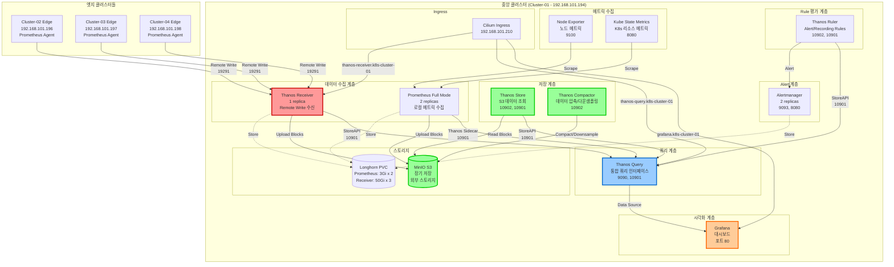

# 중앙 모니터링 클러스터 아키텍처

## 개요

프로메테우스 에이전트 + 타노스 리시버 패턴을 사용한 멀티클러스터 모니터링 아키텍처에서 중앙 클러스터(Cluster-01)는 다음과 같은 역할을 수행합니다:

1. **엣지 클러스터로부터 메트릭 수집** (Thanos Receiver)
2. **장기 메트릭 저장 및 조회** (Thanos Store + S3)
3. **통합 쿼리 인터페이스** (Thanos Query)
4. **데이터 압축 및 다운샘플링** (Thanos Compactor)
5. **Alert/Recording Rule 평가** (Thanos Ruler)
6. **시각화 대시보드** (Grafana)
7. **Alert 관리** (Alertmanager)

---

## 아키텍처 다이어그램



---

## 컴포넌트 상세 구성

### 1. 데이터 수집 계층

#### 1.1 Prometheus (Full Mode)
**역할**: 중앙 클러스터 자체의 메트릭 수집 및 Thanos Sidecar를 통한 S3 업로드

**Pod 정보**:
```yaml
이름: prometheus-kube-prometheus-stack-prometheus-0/1
Replicas: 2 (HA 구성)
컨테이너:
  - prometheus: 메트릭 수집 및 저장
  - config-reloader: 설정 자동 리로드
  - thanos-sidecar: S3 업로드 및 StoreAPI 제공
포트:
  - 9090: Prometheus HTTP API
  - 10901: Thanos StoreAPI (gRPC)
스토리지: 3Gi x 2 (Longhorn PVC)
```

**주요 설정**:
- **External Labels**: `cluster: cluster-01-central`, `environment: production`
- **Retention**: 15일 (로컬 스토리지)
- **Scrape Targets**:
  - Kubelet (cAdvisor 포함)
  - Node Exporter
  - Kube State Metrics
  - CoreDNS
  - API Server
  - Controller Manager
  - Scheduler
  - Etcd
- **Thanos Sidecar**: S3 블록 업로드 활성화

**리소스 제한**:
```yaml
resources:
  requests:
    memory: 2Gi
    cpu: 500m
  limits:
    memory: 4Gi
    cpu: 2000m
```

#### 1.2 Thanos Receiver
**역할**: 엣지 클러스터의 Prometheus Agent로부터 Remote Write로 메트릭 수신

**Pod 정보**:
```yaml
이름: thanos-receiver-0
Replicas: 1 (추후 확장 가능)
포트:
  - 10902: HTTP API
  - 10901: gRPC (StoreAPI)
  - 19291: Remote Write Endpoint
스토리지: 50Gi (Longhorn PVC)
```

**주요 설정**:
```yaml
args:
  - receive
  - --grpc-address=0.0.0.0:10901
  - --http-address=0.0.0.0:10902
  - --remote-write.address=0.0.0.0:19291
  - --tsdb.path=/var/thanos/receive
  - --label=receive="true"
  - --objstore.config-file=/etc/thanos/objstore.yml  # S3 설정
  - --tsdb.retention=6h  # 로컬 보관 기간 (이후 S3 업로드)
```

**엣지 클러스터 연결**:
- **Cluster-02**: 192.168.101.196 → Remote Write → thanos-receiver.k8s-cluster-01.miribit.lab:19291
- **Cluster-03**: 192.168.101.197 → Remote Write → thanos-receiver.k8s-cluster-01.miribit.lab:19291
- **Cluster-04**: 192.168.101.198 → Remote Write → thanos-receiver.k8s-cluster-01.miribit.lab:19291

**리소스 제한**:
```yaml
resources:
  requests:
    memory: 2Gi
    cpu: 500m
  limits:
    memory: 4Gi
    cpu: 2000m
```

---

### 2. 쿼리 계층

#### 2.1 Thanos Query
**역할**: 모든 Thanos 컴포넌트(Sidecar, Receiver, Store, Ruler)를 통합하여 쿼리

**Pod 정보**:
```yaml
이름: thanos-query-9d9d4bd44-nhtpt
Replicas: 1
포트:
  - 9090: HTTP API (PromQL 쿼리)
  - 10901: gRPC
```

**Store Endpoints** (쿼리 대상):
```yaml
stores:
  - dnssrv+_grpc._tcp.prometheus-operated.monitoring.svc.cluster.local  # Prometheus Sidecar
  - dnssrv+_grpc._tcp.thanos-receiver-headless.monitoring.svc.cluster.local  # Receiver
  - dnssrv+_grpc._tcp.thanos-store.monitoring.svc.cluster.local  # Store
  - dnssrv+_grpc._tcp.thanos-ruler.monitoring.svc.cluster.local  # Ruler (옵션)
```

**주요 기능**:
- **Deduplication**: 동일 메트릭의 중복 제거 (`replica` label 기준)
- **Query Pushdown**: 각 Store에 쿼리 분산
- **PromQL 호환**: Prometheus와 동일한 쿼리 언어 지원
- **Multi-cluster Aggregation**: cluster label 기준 집계

**리소스 제한**:
```yaml
resources:
  requests:
    memory: 1Gi
    cpu: 250m
  limits:
    memory: 2Gi
    cpu: 1000m
```

---

### 3. 저장 계층

#### 3.1 Thanos Store
**역할**: S3에 저장된 과거 메트릭 블록을 쿼리 가능하게 제공

**Pod 정보**:
```yaml
이름: thanos-store-0
Replicas: 1
포트:
  - 10902: HTTP API
  - 10901: gRPC (StoreAPI)
스토리지: 1Gi (캐시용 Longhorn PVC)
```

**주요 설정**:
```yaml
args:
  - store
  - --grpc-address=0.0.0.0:10901
  - --http-address=0.0.0.0:10902
  - --data-dir=/var/thanos/store
  - --objstore.config-file=/etc/thanos/objstore.yml
  - --index-cache-size=500MB  # 인덱스 캐싱
  - --chunk-pool-size=2GB  # 청크 풀 크기
```

**S3 연동**:
- MinIO S3 버킷에서 압축된 블록 읽기
- 장기 보관 데이터 조회 (15일 이후 데이터)

#### 3.2 Thanos Compactor
**역할**: S3의 메트릭 블록 압축, 다운샘플링, 정리

**Pod 정보**:
```yaml
이름: thanos-compactor-0
Replicas: 1 (단일 인스턴스 필수)
포트:
  - 10902: HTTP API
스토리지: 1Gi (작업용 Longhorn PVC)
```

**주요 설정**:
```yaml
args:
  - compact
  - --http-address=0.0.0.0:10902
  - --data-dir=/var/thanos/compact
  - --objstore.config-file=/etc/thanos/objstore.yml
  - --retention.resolution-raw=30d  # Raw 데이터 보관 기간
  - --retention.resolution-5m=90d  # 5분 다운샘플 보관
  - --retention.resolution-1h=180d  # 1시간 다운샘플 보관
  - --wait  # 시작 시 즉시 압축 실행
  - --delete-delay=48h  # 삭제 전 대기 시간
```

**처리 작업**:
1. **Compaction**: 작은 블록들을 큰 블록으로 병합
2. **Downsampling**: 5분/1시간 해상도로 다운샘플
3. **Retention**: 보관 기간 초과 블록 삭제

#### 3.3 MinIO S3 (외부)
**역할**: 장기 메트릭 데이터 저장소

**연결 정보**:
```yaml
endpoint: s3.minio.miribit.lab
bucket: thanos
access_key: (Secret에서 관리)
secret_key: (Secret에서 관리)
```

**저장 데이터**:
- Prometheus Sidecar가 업로드한 블록 (Cluster-01)
- Thanos Receiver가 업로드한 블록 (Cluster-02/03/04)
- Compactor가 압축/다운샘플링한 블록

---

### 4. Rule 평가 계층

#### 4.1 Thanos Ruler
**역할**: Alert Rule 및 Recording Rule 평가 (선택적)

**Pod 정보**:
```yaml
이름: thanos-ruler-0 (현재 미배포 가능)
Replicas: 1
포트:
  - 10902: HTTP API
  - 10901: gRPC (StoreAPI)
스토리지: 2Gi (Longhorn PVC)
```

**주요 설정**:
```yaml
args:
  - rule
  - --grpc-address=0.0.0.0:10901
  - --http-address=0.0.0.0:10902
  - --data-dir=/var/thanos/rule
  - --rule-file=/etc/thanos/rules/*.yaml
  - --query=dnssrv+_http._tcp.thanos-query.monitoring.svc.cluster.local
  - --objstore.config-file=/etc/thanos/objstore.yml
  - --alertmanagers.url=http://kube-prometheus-stack-alertmanager.monitoring.svc.cluster.local:9093
```

**용도**:
- 멀티클러스터 통합 Alert 평가
- Global Recording Rule 생성

---

### 5. 시각화 계층

#### 5.1 Grafana
**역할**: 메트릭 시각화 대시보드

**Pod 정보**:
```yaml
이름: kube-prometheus-stack-grafana-9f6c745cb-js9qk
Replicas: 1
컨테이너:
  - grafana: 대시보드 서버
  - grafana-sc-dashboard: 대시보드 ConfigMap 감시
  - grafana-sc-datasources: 데이터소스 ConfigMap 감시
포트: 80 (HTTP)
스토리지: 1Gi (Longhorn PVC)
```

**데이터소스 설정**:
```yaml
datasources:
  - name: Thanos Query
    type: prometheus
    url: http://thanos-query.monitoring.svc.cluster.local:9090
    isDefault: true
    access: proxy
```

**접속 정보**:
- **URL**: http://grafana.k8s-cluster-01.miribit.lab
- **Ingress IP**: 192.168.101.210

**사전 구성 대시보드**:
- Kubernetes Cluster Monitoring
- Node Exporter Full
- Prometheus Stats
- Alertmanager Overview

---

### 6. Alert 계층

#### 6.1 Alertmanager
**역할**: Alert 라우팅, 그룹핑, 침묵 처리

**Pod 정보**:
```yaml
이름: alertmanager-kube-prometheus-stack-alertmanager-0/1
Replicas: 2 (HA 구성)
컨테이너:
  - alertmanager: Alert 처리
  - config-reloader: 설정 자동 리로드
포트:
  - 9093: HTTP API
  - 8080: Metrics
  - 9094: Cluster (Gossip)
스토리지: 1Gi x 2 (Longhorn PVC)
```

**주요 설정**:
```yaml
config:
  route:
    receiver: 'default'
    group_by: ['alertname', 'cluster', 'service']
    group_wait: 10s
    group_interval: 5m
    repeat_interval: 12h

  receivers:
    - name: 'default'
      # Slack, Email, PagerDuty 등 설정 가능
```

---

### 7. 메트릭 수집 컴포넌트

#### 7.1 Node Exporter
**역할**: 노드 시스템 메트릭 수집

**Pod 정보**:
```yaml
이름: kube-prometheus-stack-prometheus-node-exporter-jtgvv
DaemonSet: 모든 노드에 1개씩 배포
포트: 9100
Host 모드: hostNetwork, hostPID 활성화
```

**수집 메트릭**:
- CPU 사용량
- 메모리 사용량
- 디스크 I/O
- 네트워크 트래픽
- 파일시스템 사용량

#### 7.2 Kube State Metrics
**역할**: Kubernetes 리소스 상태 메트릭 수집

**Pod 정보**:
```yaml
이름: kube-prometheus-stack-kube-state-metrics-55cb9c8889-gbtgg
Replicas: 1
포트: 8080
```

**수집 메트릭**:
- Pod, Deployment, StatefulSet, DaemonSet 상태
- Node 상태
- PVC 사용량
- ConfigMap, Secret 개수

---

## 네트워크 구성

### 서비스 엔드포인트

| 서비스 | ClusterIP | 포트 | 용도 |
|--------|-----------|------|------|
| thanos-query | 10.102.130.251 | 9090, 10901 | 통합 쿼리 인터페이스 |
| thanos-receiver | 10.99.179.10 | 10902, 10901, 19291 | Remote Write 수신 |
| thanos-store | None (Headless) | 10902, 10901 | S3 데이터 조회 |
| thanos-compactor | 10.103.180.32 | 10902 | 데이터 압축 |
| kube-prometheus-stack-prometheus | 10.104.76.150 | 9090, 8080 | Prometheus 쿼리 |
| kube-prometheus-stack-grafana | 10.108.106.169 | 80 | Grafana 웹 UI |
| kube-prometheus-stack-alertmanager | 10.100.200.67 | 9093, 8080 | Alertmanager API |

### Ingress 라우팅

```yaml
Cilium Ingress (L2 LoadBalancer): 192.168.101.210

Routes:
  - grafana.k8s-cluster-01.miribit.lab → Grafana (80)
  - thanos-query.k8s-cluster-01.miribit.lab → Thanos Query (9090)
  - thanos-receiver.k8s-cluster-01.miribit.lab → Thanos Receiver (19291)
```

---

## 스토리지 구성

### Longhorn PVC 현황

| PVC | 크기 | 용도 | Pod |
|-----|------|------|-----|
| prometheus-...-prometheus-0 | 3Gi | Prometheus TSDB | prometheus-0 |
| prometheus-...-prometheus-1 | 3Gi | Prometheus TSDB | prometheus-1 |
| data-thanos-receiver-0 | 50Gi | Receiver TSDB | thanos-receiver-0 |
| data-thanos-receiver-1 | 50Gi | Receiver TSDB (미사용) | - |
| data-thanos-receiver-2 | 50Gi | Receiver TSDB (미사용) | - |
| data-thanos-store-0 | 1Gi | Store 캐시 | thanos-store-0 |
| data-thanos-compactor-0 | 1Gi | Compactor 작업 공간 | thanos-compactor-0 |
| kube-prometheus-stack-grafana | 1Gi | Grafana 데이터 | grafana |
| alertmanager-...-0 | 1Gi | Alertmanager 데이터 | alertmanager-0 |
| alertmanager-...-1 | 1Gi | Alertmanager 데이터 | alertmanager-1 |

**총 스토리지 사용량**: ~163Gi (Longhorn)

---

## 데이터 흐름

### 1. 로컬 클러스터 메트릭 수집
```
Node Exporter/Kube State Metrics
  → Prometheus Scrape (9090)
  → Local TSDB (3Gi x 2)
  → Thanos Sidecar (10901)
  → S3 Upload
```

### 2. 엣지 클러스터 메트릭 수집
```
Edge Cluster Prometheus Agent
  → Remote Write (19291)
  → Thanos Receiver
  → Local TSDB (50Gi, 6시간)
  → S3 Upload
```

### 3. 쿼리 처리
```
Grafana/사용자
  → Thanos Query (9090)
  → Query Pushdown
  → [Prometheus Sidecar | Receiver | Store]
  → Deduplication
  → 결과 반환
```

### 4. 데이터 압축 및 다운샘플링
```
S3 Blocks
  → Thanos Compactor
  → Compaction (작은 블록 병합)
  → Downsampling (5m/1h)
  → Retention 정책 적용
  → S3 저장
```

---

## 고가용성 (HA) 구성

### HA 컴포넌트

1. **Prometheus**: 2 replicas
   - 동일한 메트릭을 중복 수집
   - Thanos Query가 deduplication 처리

2. **Alertmanager**: 2 replicas
   - Gossip 프로토콜로 상태 동기화
   - Alert 중복 방지

3. **Thanos Receiver**: 1 replica (추후 확장 가능)
   - Hashring 구성으로 수평 확장 가능
   - 현재는 단일 인스턴스로 충분

### 단일 인스턴스 컴포넌트

- **Thanos Compactor**: 반드시 1개 (동시 실행 시 충돌)
- **Thanos Store**: 1개 (읽기 전용이므로 확장 가능)
- **Thanos Query**: 1개 (무상태이므로 확장 가능)
- **Grafana**: 1개 (Session 관리 필요 시 주의)

---

## 리소스 사용량 요약

### CPU 요청/제한
```
Prometheus (2 replicas):   1000m / 4000m
Thanos Receiver:           500m / 2000m
Thanos Query:              250m / 1000m
Thanos Store:              250m / 1000m
Thanos Compactor:          250m / 1000m
Alertmanager (2 replicas): 200m / 400m
Grafana:                   100m / 200m
Node Exporter:             50m / 100m
Kube State Metrics:        10m / 100m

총 요청: ~2.6 CPU
총 제한: ~13.8 CPU
```

### 메모리 요청/제한
```
Prometheus (2 replicas):   4Gi / 8Gi
Thanos Receiver:           2Gi / 4Gi
Thanos Query:              1Gi / 2Gi
Thanos Store:              1Gi / 2Gi
Thanos Compactor:          1Gi / 2Gi
Alertmanager (2 replicas): 400Mi / 800Mi
Grafana:                   256Mi / 512Mi
Node Exporter:             50Mi / 100Mi
Kube State Metrics:        64Mi / 128Mi

총 요청: ~10Gi
총 제한: ~20Gi
```

---

## 운영 가이드

### 메트릭 조회 우선순위

1. **최근 데이터 (0~6시간)**: Thanos Receiver
2. **중기 데이터 (6시간~15일)**: Prometheus Sidecar
3. **장기 데이터 (15일~)**: Thanos Store (S3)

### 스케일링 가이드

**Thanos Receiver 확장** (엣지 클러스터 증가 시):
```yaml
replicas: 3
hashring:
  - name: soft-tenants
    endpoints:
      - thanos-receiver-0.thanos-receiver-headless:10901
      - thanos-receiver-1.thanos-receiver-headless:10901
      - thanos-receiver-2.thanos-receiver-headless:10901
```

**Thanos Query 확장** (쿼리 부하 증가 시):
```yaml
replicas: 3
```

### 모니터링 포인트

1. **Receiver 상태**:
   ```promql
   thanos_receive_remote_write_requests_total
   thanos_receive_head_series
   ```

2. **Query 성능**:
   ```promql
   thanos_query_duration_seconds
   thanos_store_api_query_duration_seconds
   ```

3. **Compactor 처리**:
   ```promql
   thanos_compact_iterations_total
   thanos_compact_group_compactions_total
   ```

4. **S3 업로드**:
   ```promql
   thanos_objstore_bucket_operations_total
   ```

---

## 배포 파일 위치

```
deploy/
├── base/
│   └── kube-prometheus-stack/
│       ├── Chart.yaml
│       ├── values.yaml  # 공통 설정
│       └── kustomization.yaml
│
└── overlays/
    └── cluster-01-central/
        └── kube-prometheus-stack/
            ├── kustomization.yaml
            ├── values-central.yaml  # 중앙 클러스터 오버라이드
            ├── thanos-receiver.yaml
            ├── thanos-store.yaml
            ├── thanos-compactor.yaml
            ├── thanos-query.yaml
            ├── thanos-ruler.yaml
            └── thanos-s3-secret.yaml
```

---

## 접속 정보

### 외부 접속 (Ingress)
- **Grafana**: http://grafana.k8s-cluster-01.miribit.lab
- **Thanos Query**: http://thanos-query.k8s-cluster-01.miribit.lab
- **Thanos Receiver**: http://thanos-receiver.k8s-cluster-01.miribit.lab

### 클러스터 내부 접속
- **Prometheus**: http://kube-prometheus-stack-prometheus.monitoring.svc.cluster.local:9090
- **Thanos Query**: http://thanos-query.monitoring.svc.cluster.local:9090
- **Alertmanager**: http://kube-prometheus-stack-alertmanager.monitoring.svc.cluster.local:9093

---

## 문제 해결

### Thanos Receiver가 메트릭을 받지 못할 때
```bash
# Receiver 로그 확인
kubectl logs -n monitoring thanos-receiver-0 --tail=100

# Remote Write 엔드포인트 테스트
curl -v http://thanos-receiver.k8s-cluster-01.miribit.lab/api/v1/receive
```

### 멀티클러스터 메트릭이 보이지 않을 때
```bash
# Thanos Query의 Store 엔드포인트 확인
curl http://thanos-query.k8s-cluster-01.miribit.lab/api/v1/stores

# Cluster label 확인
curl http://thanos-query.k8s-cluster-01.miribit.lab/api/v1/label/cluster/values
```

### S3 업로드 실패 시
```bash
# Sidecar 로그 확인
kubectl logs -n monitoring prometheus-kube-prometheus-stack-prometheus-0 -c thanos-sidecar

# S3 Secret 확인
kubectl get secret -n monitoring thanos-s3-config -o yaml
```

---

## 참고 자료

- [Thanos 공식 문서](https://thanos.io/tip/thanos/getting-started.md/)
- [kube-prometheus-stack Helm Chart](https://github.com/prometheus-community/helm-charts/tree/main/charts/kube-prometheus-stack)
- [Prometheus Operator](https://prometheus-operator.dev/)
- [Longhorn 문서](https://longhorn.io/docs/)
