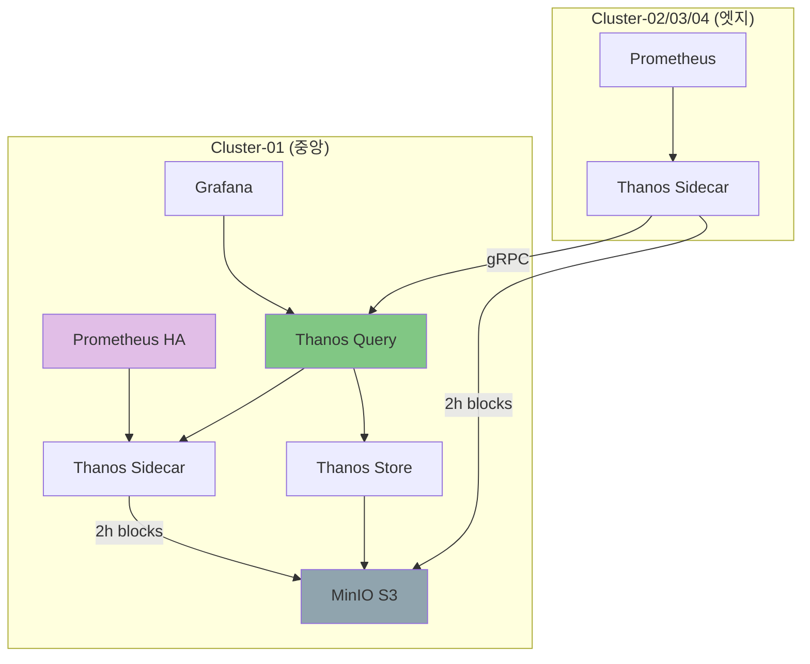

# 02. Prometheus + Thanos Sidecar 패턴

## 📋 개요

이 패턴은 **Prometheus와 Thanos Sidecar를 조합**하여 멀티클러스터 환경에서 메트릭을 수집하고 S3에 장기 저장하는 아키텍처입니다.

### 핵심 특징

- ✅ **클러스터 독립성**: 각 클러스터가 독립적으로 Prometheus 실행
- ✅ **비동기 S3 업로드**: Sidecar가 2시간 블록을 S3에 업로드
- ✅ **무제한 저장소**: MinIO S3 활용
- ✅ **글로벌 쿼리**: Thanos Query를 통한 통합 조회

---

## 🏗️ 아키텍처

---

## 📂 문서 목록

### [배포-가이드.md](./배포-가이드.md)
**목적**: Prometheus + Thanos Sidecar 패턴 배포 방법

**주요 내용**:
- Helm + Kustomize 기반 배포
- kube-prometheus-stack 설정
- Thanos Sidecar 구성
- S3 연동 설정
- 검증 및 테스트

**대상 독자**: DevOps 엔지니어, 배포 담당자

---

## 🎯 이 패턴을 선택해야 하는 경우

✅ **추천 상황**:
- 클러스터 수: 2-20개
- 각 클러스터가 독립적으로 운영되어야 함
- 네트워크 단절 시에도 로컬 메트릭 유지 필요
- 비동기 S3 업로드로 충분 (실시간 전송 불필요)

❌ **비추천 상황**:
- 클러스터 수: 20개 이상 (Remote Write 패턴 권장)
- 엣지 클러스터 리소스가 매우 제한적 (Agent 패턴 권장)
- 모든 메트릭을 실시간으로 중앙 집중화 필요

---

## 📊 리소스 요구사항

### 중앙 클러스터
| 컴포넌트 | CPU | Memory | Storage |
|---------|-----|--------|---------|
| Prometheus HA | 2 cores | 4Gi | 15Gi (PVC) |
| Thanos Query | 500m | 1Gi | - |
| Thanos Store | 500m | 1Gi | - |
| Thanos Compactor | 500m | 1Gi | 20Gi (PVC) |
| Thanos Ruler | 500m | 1Gi | - |

### 엣지 클러스터
| 컴포넌트 | CPU | Memory | Storage |
|---------|-----|--------|---------|
| Prometheus | 500m | 1Gi | 10Gi (PVC) |
| Thanos Sidecar | 100m | 256Mi | - |

---

## 🔗 관련 문서

- **패턴 비교** → [01-아키텍처-개요/패턴-비교-가이드.md](../01-아키텍처-개요/패턴-비교-가이드.md)
- **운영 가이드** → [05-운영-가이드](../05-운영-가이드/)
- **트러블슈팅** → [05-운영-가이드/트러블슈팅.md](../05-운영-가이드/트러블슈팅.md)

---

**최종 업데이트**: 2025-10-20
