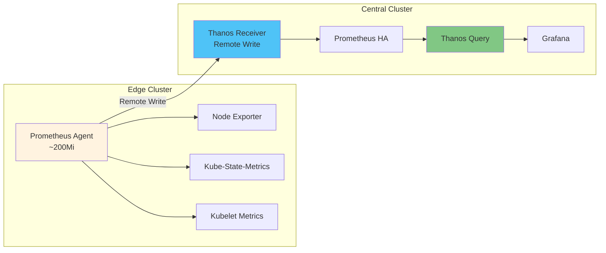

# 03. Prometheus Agent + Thanos Receiver 패턴

## 📋 개요

이 패턴은 **Prometheus Agent Mode와 Thanos Receiver를 조합**하여 엣지 클러스터에서 경량화된 메트릭 수집을 구현합니다.

### 핵심 특징

- ✅ **엣지 리소스 최소화**: ~200MB (Full Prometheus 대비 1/10)
- ✅ **Remote Write**: 메트릭을 중앙 Thanos Receiver로 전송
- ✅ **WAL 버퍼링**: 네트워크 단절 시 데이터 손실 방지
- ✅ **완전한 메트릭 수집**: Node Exporter + Kube-State-Metrics + Kubelet

---

## 🏗️ 아키텍처

---

## 📂 문서 목록

### [아키텍처-설명.md](./아키텍처-설명.md)
**목적**: 엣지 클러스터 메트릭 수집 방식 비교 및 Agent 패턴 이해

**주요 내용**:
- 옵션 1: 원격 스크래핑 (Prometheus 없음)
- 옵션 2: Prometheus Agent Mode ⭐ **현재 구성**
- 옵션 3: Full Prometheus + Thanos Sidecar
- 리소스 비교 및 선택 가이드

**대상 독자**: 아키텍트, 엣지 환경 운영자

---

### [엣지-클러스터-구성.md](./엣지-클러스터-구성.md)
**목적**: 엣지 클러스터의 실제 배포 및 구성 방법

**주요 내용**:
- Prometheus Agent 배포
- Node Exporter, Kube-State-Metrics 설정
- Remote Write 구성
- Thanos Receiver 설정
- 검증 및 모니터링

**대상 독자**: DevOps 엔지니어, 현장 배포 담당자

---

## 🎯 이 패턴을 선택해야 하는 경우

✅ **추천 상황**:
- 엣지 클러스터 리소스가 제한적 (CPU < 2 cores, Memory < 4Gi)
- 많은 수의 엣지 클러스터 (10개 이상)
- 중앙 집중식 메트릭 관리 필요
- 실시간 메트릭 전송 선호

❌ **비추천 상황**:
- 네트워크가 불안정하고 로컬 쿼리 필요
- 엣지에서 자체적으로 알림 평가 필요
- 클러스터 수가 적음 (2-5개)

---

## 📊 리소스 요구사항

### 엣지 클러스터 (각각)
| 컴포넌트 | CPU | Memory | Storage | 설명 |
|---------|-----|--------|---------|------|
| Prometheus Agent | 100m | 200Mi | - | Stateless, 로컬 저장 없음 |
| Node Exporter | 50m | 100Mi | - | DaemonSet |
| Kube-State-Metrics | 50m | 100Mi | - | Deployment |

**총계**: ~200-450MB (Full Prometheus 대비 **1/4**)

### 중앙 클러스터 (추가)
| 컴포넌트 | CPU | Memory | Storage |
|---------|-----|--------|---------|
| Thanos Receiver | 500m | 1Gi | - |
| Prometheus HA | 2 cores | 4Gi | 30Gi (모든 엣지 메트릭) |

---

## 🔗 관련 문서

- **패턴 비교** → [01-아키텍처-개요/패턴-비교-가이드.md](../01-아키텍처-개요/패턴-비교-가이드.md)
- **중앙 클러스터 구성** → [02-프로메테우스-사이드카-패턴](../02-프로메테우스-사이드카-패턴/)
- **운영 가이드** → [05-운영-가이드](../05-운영-가이드/)

---

**최종 업데이트**: 2025-10-20
