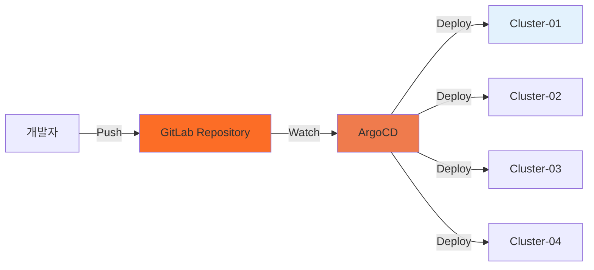
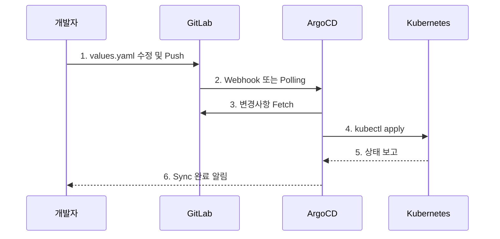

# 04. GitOps 배포

## 📋 개요

이 섹션에서는 **ArgoCD와 GitLab을 활용한 GitOps 기반 배포 전략**을 설명합니다.

### GitOps란?

Git 저장소를 인프라 및 애플리케이션 구성의 **단일 소스(Single Source of Truth)**로 사용하는 운영 모델입니다.

**핵심 원칙**:
- 모든 구성이 Git에 선언적으로 저장
- Git 변경 시 자동으로 클러스터에 반영
- 변경 이력 추적 및 롤백 가능
- 코드 리뷰를 통한 변경 승인 프로세스

---

## 🏗️ GitOps 아키텍처



---

## 📂 문서 목록

### [ArgoCD-배포-가이드.md](./ArgoCD-배포-가이드.md)
**목적**: ArgoCD와 GitLab을 사용한 멀티클러스터 배포 전체 프로세스

**주요 내용**:
- ArgoCD 설치 및 설정
- GitLab 배포
- ArgoCD-GitLab 연동
- Application-of-Applications 패턴
- 멀티클러스터 관리
- 운영 가이드

**대상 독자**: DevOps 엔지니어, GitOps 담당자

---

### [GitOps-설정-요약.md](./GitOps-설정-요약.md)
**목적**: GitOps 환경 구성 완료 후 빠른 참조

**주요 내용**:
- ArgoCD 접속 정보
- GitLab 접속 정보
- Application 목록
- 주요 명령어
- 다음 단계

**대상 독자**: 운영자, 관리자

---

### [GitOps-마이그레이션.md](./GitOps-마이그레이션.md)
**목적**: 기존 배포 방식에서 GitOps로 전환

**주요 내용**:
- 마이그레이션 사유
- 단계별 전환 계획
- 주의사항 및 롤백 전략
- Before/After 비교

**대상 독자**: 시스템 아키텍트, 마이그레이션 담당자

---

## 🎯 GitOps의 장점

### 1. 선언적 관리
```yaml
# Git에 원하는 상태 정의
apiVersion: apps/v1
kind: Deployment
metadata:
  name: prometheus
spec:
  replicas: 2  # 원하는 상태
```

### 2. 자동 동기화
- Git 변경 감지 (5분 간격)
- 자동 또는 수동 Sync
- Health Check 및 상태 모니터링

### 3. 감사 및 추적
- 모든 변경사항 Git 히스토리에 기록
- 누가, 언제, 무엇을 변경했는지 추적
- PR 리뷰를 통한 변경 승인

### 4. 롤백
```bash
# 이전 버전으로 즉시 롤백
argocd app rollback <app-name> <revision>
```

---

## 📊 배포 워크플로우



---

## 🔗 관련 문서

- **빠른 시작** → [../빠른-시작-가이드.md](../빠른-시작-가이드.md)
- **아키텍처 개요** → [01-아키텍처-개요](../01-아키텍처-개요/)
- **운영 가이드** → [05-운영-가이드](../05-운영-가이드/)

---

## 💡 주요 명령어

```bash
# ArgoCD 로그인
argocd login argocd.k8s-cluster-01.miribit.lab

# Application 목록
argocd app list

# Application 동기화
argocd app sync <app-name>

# Application 상태 확인
argocd app get <app-name>

# 롤백
argocd app rollback <app-name> <revision>
```

---

**최종 업데이트**: 2025-10-20
