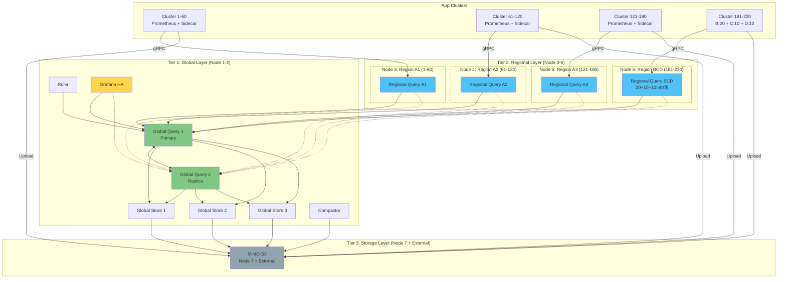
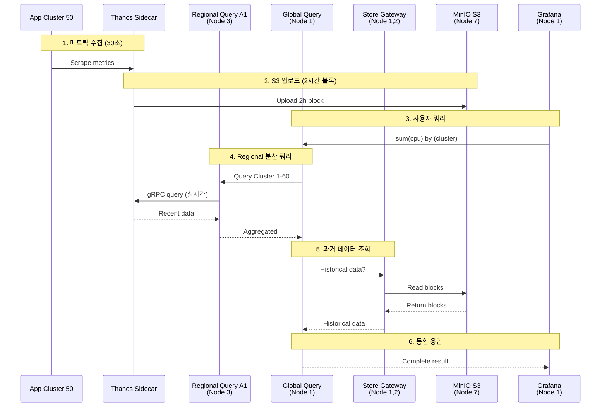

# 🎯 7노드 모니터링 클러스터로 220 클러스터 모니터링 아키텍처

> **환경**: 모니터링 전용 노드 7대 + 애플리케이션 클러스터 220대 (180+20+10+10)

## 📊 요구사항 분석

### 클러스터 구성

| 그룹 | 클러스터 수 | 특성 | 중요도 |
|------|-----------|------|--------|
| **Group A** | 180개 | 대규모 메인 클러스터 | 높음 |
| **Group B** | 20개 | 중규모 클러스터 | 중간 |
| **Group C** | 10개 | 소규모 클러스터 | 중간 |
| **Group D** | 10개 | 소규모 클러스터 | 중간 |
| **총합** | **220개** | - | - |

### 모니터링 노드 리소스

```yaml
총 노드: 7대

가정 사양 (노드당):
  CPU: 16 cores
  Memory: 32Gi
  Disk: 500Gi (Longhorn)
  Network: 10Gbps

총 리소스:
  CPU: 112 cores
  Memory: 224Gi
  Disk: 3.5TB
```

---

## 🏗️ 최적 아키텍처: 3-Tier Hierarchical Pattern

### 아키텍처 개요



### 핵심 설계 원칙

```
원칙 1: 180개 대규모 클러스터를 3개 Region으로 분할 (60개씩)
원칙 2: 40개 소규모 클러스터를 1개 Region으로 통합
원칙 3: Global Query HA (2 replicas) - SPOF 제거
원칙 4: 노드 1-2는 Global, 3-6은 Regional, 7은 S3
원칙 5: 각 Regional Query는 최대 60개 클러스터 담당
```

---

## 🎯 노드별 역할 배치 (상세)

### Node 1: Global + Store (Primary)

**역할**: Global Thanos Query + Store Gateway + Grafana

```yaml
# Node 1 리소스 배분
CPU: 16 cores
Memory: 32Gi

컴포넌트:
  Global Thanos Query (Primary):
    replicas: 1
    resources:
      cpu: 4 cores
      memory: 8Gi
    역할: 4개 Regional Query 통합 조회

  Thanos Store Gateway:
    replicas: 2
    resources:
      cpu: 2 cores × 2 = 4 cores
      memory: 4Gi × 2 = 8Gi
    역할: S3 과거 데이터 조회

  Grafana:
    replicas: 2
    resources:
      cpu: 1 core × 2 = 2 cores
      memory: 2Gi × 2 = 4Gi
    역할: 대시보드 UI

  Thanos Ruler:
    replicas: 1
    resources:
      cpu: 1 core
      memory: 2Gi
    역할: 글로벌 알림 규칙

총 사용량:
  CPU: 11 cores / 16 cores (69%)
  Memory: 22Gi / 32Gi (69%)
```

### Node 2: Global (Replica) + Store + Compactor

**역할**: Global Query HA + Store Gateway + Compactor

```yaml
# Node 2 리소스 배분
CPU: 16 cores
Memory: 32Gi

컴포넌트:
  Global Thanos Query (Replica):
    replicas: 1
    resources:
      cpu: 4 cores
      memory: 8Gi
    역할: HA, Failover

  Thanos Store Gateway:
    replicas: 1
    resources:
      cpu: 2 cores
      memory: 4Gi

  Thanos Compactor:
    replicas: 1
    resources:
      cpu: 4 cores
      memory: 8Gi
    역할: S3 블록 압축 및 정리

  Alertmanager:
    replicas: 3
    resources:
      cpu: 0.5 core × 3 = 1.5 cores
      memory: 1Gi × 3 = 3Gi
    역할: 알림 전송

총 사용량:
  CPU: 11.5 cores / 16 cores (72%)
  Memory: 23Gi / 32Gi (72%)
```

### Node 3: Regional A1 (Cluster 1-60)

**역할**: 첫 번째 60개 클러스터 담당

```yaml
# Node 3 리소스 배분
CPU: 16 cores
Memory: 32Gi

컴포넌트:
  Regional Thanos Query A1:
    replicas: 2 (HA)
    resources:
      cpu: 4 cores × 2 = 8 cores
      memory: 8Gi × 2 = 16Gi
    담당: Cluster 1-60 (60개)
    gRPC 연결: 60개 Sidecar

  Regional Thanos Store:
    replicas: 1
    resources:
      cpu: 2 cores
      memory: 4Gi
    역할: Region A1 S3 데이터 조회

총 사용량:
  CPU: 10 cores / 16 cores (63%)
  Memory: 20Gi / 32Gi (63%)
```

### Node 4: Regional A2 (Cluster 61-120)

**역할**: 두 번째 60개 클러스터 담당

```yaml
# Node 4 리소스 배분 (Node 3과 동일)
CPU: 16 cores
Memory: 32Gi

컴포넌트:
  Regional Thanos Query A2:
    replicas: 2 (HA)
    resources:
      cpu: 4 cores × 2 = 8 cores
      memory: 8Gi × 2 = 16Gi
    담당: Cluster 61-120 (60개)

  Regional Thanos Store:
    replicas: 1
    resources:
      cpu: 2 cores
      memory: 4Gi

총 사용량:
  CPU: 10 cores / 16 cores (63%)
  Memory: 20Gi / 32Gi (63%)
```

### Node 5: Regional A3 (Cluster 121-180)

**역할**: 세 번째 60개 클러스터 담당

```yaml
# Node 5 리소스 배분 (Node 3, 4와 동일)
CPU: 16 cores
Memory: 32Gi

컴포넌트:
  Regional Thanos Query A3:
    replicas: 2 (HA)
    resources:
      cpu: 4 cores × 2 = 8 cores
      memory: 8Gi × 2 = 16Gi
    담당: Cluster 121-180 (60개)

  Regional Thanos Store:
    replicas: 1
    resources:
      cpu: 2 cores
      memory: 4Gi

총 사용량:
  CPU: 10 cores / 16 cores (63%)
  Memory: 20Gi / 32Gi (63%)
```

### Node 6: Regional BCD (Cluster 181-220)

**역할**: Group B+C+D (20+10+10=40개) 통합 관리

```yaml
# Node 6 리소스 배분
CPU: 16 cores
Memory: 32Gi

컴포넌트:
  Regional Thanos Query BCD:
    replicas: 2 (HA)
    resources:
      cpu: 4 cores × 2 = 8 cores
      memory: 8Gi × 2 = 16Gi
    담당: Cluster 181-220 (40개)
    구성:
      - Group B: 181-200 (20개)
      - Group C: 201-210 (10개)
      - Group D: 211-220 (10개)

  Regional Thanos Store:
    replicas: 1
    resources:
      cpu: 2 cores
      memory: 4Gi

총 사용량:
  CPU: 10 cores / 16 cores (63%)
  Memory: 20Gi / 32Gi (63%)
```

### Node 7: Storage (MinIO S3)

**역할**: S3 오브젝트 스토리지

```yaml
# Node 7 리소스 배분
CPU: 16 cores
Memory: 32Gi
Disk: 500Gi (추가 스토리지 필요)

컴포넌트:
  MinIO:
    replicas: 1 (단일 노드)
    resources:
      cpu: 8 cores
      memory: 16Gi
      storage: 10TB+ (외부 스토리지 마운트)
    역할: Thanos S3 백엔드

  MinIO Console:
    resources:
      cpu: 500m
      memory: 512Mi

예비 리소스:
  CPU: 7.5 cores (추가 Store Gateway 배포 가능)
  Memory: 15.5Gi

총 사용량:
  CPU: 8.5 cores / 16 cores (53%)
  Memory: 16.5Gi / 32Gi (52%)

권장 사항:
  - 외부 NAS/SAN 스토리지 마운트 (10TB+)
  - 또는 Longhorn 분산 스토리지 사용
```

---

## 📊 리소스 사용률 요약

| 노드 | 역할 | CPU 사용률 | Memory 사용률 | 예비 리소스 |
|------|------|-----------|--------------|------------|
| **Node 1** | Global + Store | 11/16 (69%) | 22/32Gi (69%) | 4.5 cores, 10Gi |
| **Node 2** | Global HA + Compactor | 11.5/16 (72%) | 23/32Gi (72%) | 4.5 cores, 9Gi |
| **Node 3** | Regional A1 (1-60) | 10/16 (63%) | 20/32Gi (63%) | 6 cores, 12Gi |
| **Node 4** | Regional A2 (61-120) | 10/16 (63%) | 20/32Gi (63%) | 6 cores, 12Gi |
| **Node 5** | Regional A3 (121-180) | 10/16 (63%) | 20/32Gi (63%) | 6 cores, 12Gi |
| **Node 6** | Regional BCD (181-220) | 10/16 (63%) | 20/32Gi (63%) | 6 cores, 12Gi |
| **Node 7** | MinIO S3 | 8.5/16 (53%) | 16.5/32Gi (52%) | 7.5 cores, 15.5Gi |

**총 리소스 사용률:**
- CPU: 71/112 cores (63% 사용, 37% 예비)
- Memory: 141.5/224Gi (63% 사용, 37% 예비)

**✅ 충분한 예비 리소스 확보!**

---

## 🔄 데이터 흐름

### 메트릭 수집 및 조회 흐름



### 쿼리 경로 (Query Path)

| 쿼리 범위 | 경로 | 홉 수 | 응답 시간 |
|----------|------|-------|----------|
| **최근 2h** | Grafana → Global → Regional → Sidecar | 3홉 | 1-3초 |
| **2h-7일** | Grafana → Global → Store → S3 | 3홉 | 3-5초 |
| **7일+** | Grafana → Global → Store → S3 (Compacted) | 3홉 | 5-10초 |
| **전체 통합** | Grafana → Global → (Regional + Store) | 3홉 | 5-15초 |

---

## 🚀 배포 가이드

### Step 1: Kubernetes 클러스터 구성

```bash
# 7대 노드를 단일 Kubernetes 클러스터로 구성

# Node 1 (Master + Worker)
ssh node1
sudo kubeadm init --pod-network-cidr=10.244.0.0/16

# Node 2-7 조인
for i in {2..7}; do
  ssh node$i
  sudo kubeadm join <master-ip>:6443 --token <token>
done

# 노드 라벨링 (역할 구분)
kubectl label node node1 role=global tier=1
kubectl label node node2 role=global-ha tier=1
kubectl label node node3 role=regional-a1 tier=2
kubectl label node node4 role=regional-a2 tier=2
kubectl label node node5 role=regional-a3 tier=2
kubectl label node node6 role=regional-bcd tier=2
kubectl label node node7 role=storage tier=3
```

### Step 2: MinIO S3 배포 (Node 7)

```yaml
# deploy/s3/minio-deployment.yaml
apiVersion: apps/v1
kind: Deployment
metadata:
  name: minio
  namespace: storage
spec:
  replicas: 1
  selector:
    matchLabels:
      app: minio
  template:
    metadata:
      labels:
        app: minio
    spec:
      nodeSelector:
        role: storage  # Node 7에만 배포
      containers:
      - name: minio
        image: minio/minio:latest
        args:
        - server
        - /data
        - --console-address
        - ":9001"
        env:
        - name: MINIO_ROOT_USER
          value: "minio"
        - name: MINIO_ROOT_PASSWORD
          value: "minio123"
        resources:
          limits:
            cpu: 8000m
            memory: 16Gi
          requests:
            cpu: 4000m
            memory: 8Gi
        volumeMounts:
        - name: data
          mountPath: /data
        ports:
        - containerPort: 9000
        - containerPort: 9001
      volumes:
      - name: data
        hostPath:
          path: /mnt/minio-data  # 외부 스토리지 마운트 포인트
          type: DirectoryOrCreate
```

```bash
# MinIO 배포
kubectl create namespace storage
kubectl apply -f deploy/s3/minio-deployment.yaml
kubectl apply -f deploy/s3/minio-service.yaml

# S3 버킷 생성
mc alias set minio http://minio.storage:9000 minio minio123
mc mb minio/thanos-bucket
```

### Step 3: Global Layer 배포 (Node 1-2)

```yaml
# deploy/global/kustomization.yaml
apiVersion: kustomize.config.k8s.io/v1beta1
kind: Kustomization

namespace: monitoring

resources:
  - namespace.yaml
  - thanos-s3-secret.yaml
  - global-query-deployment.yaml      # Node 1
  - global-query-ha-deployment.yaml   # Node 2
  - global-store-statefulset.yaml     # Node 1-2
  - thanos-compactor-deployment.yaml  # Node 2
  - thanos-ruler-deployment.yaml      # Node 1
  - grafana-deployment.yaml           # Node 1
  - alertmanager-statefulset.yaml     # Node 2

helmCharts:
  - name: kube-prometheus-stack
    repo: https://prometheus-community.github.io/helm-charts
    version: 78.2.1
    releaseName: kube-prometheus-stack
    valuesFile: values-global.yaml
```

```yaml
# deploy/global/global-query-deployment.yaml
apiVersion: apps/v1
kind: Deployment
metadata:
  name: global-thanos-query
  namespace: monitoring
spec:
  replicas: 1
  selector:
    matchLabels:
      app: global-thanos-query
  template:
    metadata:
      labels:
        app: global-thanos-query
    spec:
      nodeSelector:
        role: global  # Node 1에만 배포
      affinity:
        podAntiAffinity:
          requiredDuringSchedulingIgnoredDuringExecution:
          - labelSelector:
              matchLabels:
                app: global-thanos-query
            topologyKey: kubernetes.io/hostname
      containers:
      - name: thanos-query
        image: quay.io/thanos/thanos:v0.37.2
        args:
        - query
        - --http-address=0.0.0.0:9090
        - --grpc-address=0.0.0.0:10901
        - --query.replica-label=replica
        - --query.replica-label=prometheus_replica

        # 4개 Regional Query 연결
        - --store=regional-query-a1.monitoring:10901
        - --store=regional-query-a2.monitoring:10901
        - --store=regional-query-a3.monitoring:10901
        - --store=regional-query-bcd.monitoring:10901

        # 3개 Store Gateway 연결
        - --store=dnssrv+_grpc._tcp.thanos-store.monitoring.svc.cluster.local

        resources:
          limits:
            cpu: 4000m
            memory: 8Gi
          requests:
            cpu: 2000m
            memory: 4Gi
        ports:
        - containerPort: 9090
          name: http
        - containerPort: 10901
          name: grpc
```

```bash
# Global Layer 배포
cd deploy/global
kustomize build . --enable-helm | kubectl apply -f -
```

### Step 4: Regional Layer 배포 (Node 3-6)

```yaml
# deploy/regional-a1/kustomization.yaml (Node 3)
apiVersion: kustomize.config.k8s.io/v1beta1
kind: Kustomization

namespace: monitoring

resources:
  - regional-query-a1-deployment.yaml
  - regional-store-a1-statefulset.yaml

configMapGenerator:
  - name: cluster-mapping-a1
    literals:
      - clusters=cluster-1,cluster-2,...,cluster-60  # 60개 클러스터 매핑
```

```yaml
# deploy/regional-a1/regional-query-a1-deployment.yaml
apiVersion: apps/v1
kind: Deployment
metadata:
  name: regional-query-a1
  namespace: monitoring
spec:
  replicas: 2  # HA
  selector:
    matchLabels:
      app: regional-query-a1
  template:
    metadata:
      labels:
        app: regional-query-a1
        region: a1
    spec:
      nodeSelector:
        role: regional-a1  # Node 3에만 배포
      containers:
      - name: thanos-query
        image: quay.io/thanos/thanos:v0.37.2
        args:
        - query
        - --http-address=0.0.0.0:9090
        - --grpc-address=0.0.0.0:10901
        - --query.replica-label=replica

        # Cluster 1-60의 Sidecar 연결 (동적 발견)
        - --store.sd-files=/etc/thanos/stores/*.yaml

        resources:
          limits:
            cpu: 4000m
            memory: 8Gi
          requests:
            cpu: 2000m
            memory: 4Gi
        volumeMounts:
        - name: store-config
          mountPath: /etc/thanos/stores
      volumes:
      - name: store-config
        configMap:
          name: regional-stores-a1
```

```bash
# Regional Layer 배포 (4개 Region)
for region in regional-a1 regional-a2 regional-a3 regional-bcd; do
  cd deploy/$region
  kustomize build . --enable-helm | kubectl apply -f -
done
```

### Step 5: App 클러스터 Sidecar 구성

```yaml
# 각 App 클러스터의 Prometheus에 Sidecar 추가
# deploy/app-clusters/cluster-001/values.yaml

prometheus:
  prometheusSpec:
    externalLabels:
      cluster: cluster-001
      cluster_group: group-a
      region: a1
      replica: "$(POD_NAME)"

    retention: 2h

    # Thanos Sidecar 활성화
    thanos:
      image: quay.io/thanos/thanos:v0.37.2
      objectStorageConfig:
        name: thanos-s3-config
        key: objstore.yml

      # Regional Query A1에 등록
      # (Service Discovery 또는 LoadBalancer IP)
```

---

## 📈 성능 예측 및 검증

### 예상 성능 지표

| 항목 | 목표 값 | 측정 방법 |
|------|---------|-----------|
| **Global Query 응답시간 (p99)** | < 10초 | Grafana query inspection |
| **Regional Query 응답시간 (p99)** | < 5초 | Prometheus query log |
| **동시 활성 쿼리** | 100-200개 | `thanos_query_concurrent_queries` |
| **gRPC 연결 수** | Global: 7개<br/>Regional: 60개/노드 | `thanos_store_nodes_grpc_connections` |
| **S3 업로드 성공률** | > 99% | `thanos_objstore_bucket_operations_total` |
| **Compaction 주기** | 5분 | `thanos_compact_iterations_total` |
| **Store Gateway 지연** | < 100ms | `thanos_store_bucket_cache_operation_duration_seconds` |

### 부하 테스트

```bash
# 1. 동시 쿼리 부하 테스트
for i in {1..100}; do
  curl -g "http://grafana:3000/api/datasources/proxy/1/api/v1/query?query=up" &
done

# 2. Regional Query 연결 확인
kubectl exec -n monitoring global-thanos-query-xxx -- \
  wget -qO- http://localhost:9090/api/v1/stores | jq '.data[] | {name, lastCheck, lastError}'

# 3. 리소스 사용량 모니터링
watch -n 5 'kubectl top nodes'
watch -n 5 'kubectl top pods -n monitoring --sort-by=cpu'
```

---

## 🔧 운영 및 유지보수

### 일일 체크리스트

```bash
# 1. Global Query 상태 확인
kubectl get pods -n monitoring -l app=global-thanos-query

# 2. Regional Query 연결 상태
for region in a1 a2 a3 bcd; do
  echo "=== Region $region ==="
  kubectl logs -n monitoring -l app=regional-query-$region --tail=10 | grep "adding new store"
done

# 3. Store Gateway 상태
kubectl get statefulset -n monitoring thanos-store

# 4. S3 업로드 상태 (랜덤 5개 클러스터)
for cluster in cluster-001 cluster-050 cluster-100 cluster-150 cluster-200; do
  echo "=== $cluster ==="
  # App 클러스터에서 확인
  ssh $cluster "kubectl logs -n monitoring prometheus-xxx thanos-sidecar --tail=5 | grep uploaded"
done

# 5. 리소스 사용률
kubectl top nodes | grep -E 'node[1-7]'
```

### 주간 유지보수

```bash
# 1. Compaction 상태 확인
kubectl logs -n monitoring -l app=thanos-compactor --tail=100 | grep "compact blocks"

# 2. S3 용량 확인
mc du minio/thanos-bucket

# 3. Query 성능 분석
kubectl exec -n monitoring global-thanos-query-xxx -- \
  wget -qO- http://localhost:9090/metrics | grep thanos_query_duration

# 4. 장애 로그 확인
kubectl logs -n monitoring --all-containers --since=7d | grep -i error
```

### 월간 최적화

```bash
# 1. Recording Rules 성능 개선
# - Cardinality 높은 메트릭 식별
# - Recording Rules 추가

# 2. S3 Lifecycle 정책 검토
# - 비용 분석
# - Retention 정책 조정

# 3. 노드 리소스 재조정
# - 사용률 기반 리소스 재배치
# - 불균형 해소
```

---

## 🎯 확장 시나리오

### 시나리오 1: 220 → 300 클러스터 (80개 증가)

**옵션 A: 기존 Regional Query 활용** (권장)
```
Node 3: 60개 → 75개 (추가 15개)
Node 4: 60개 → 75개 (추가 15개)
Node 5: 60개 → 75개 (추가 15개)
Node 6: 40개 → 75개 (추가 35개)

총 변경: 0개 노드 추가, 리소스 증설 없음
비용: $0 추가
```

**옵션 B: 새 Regional 추가**
```
Node 8 추가: Regional E (221-300, 80개)

총 변경: 1개 노드 추가
비용: 노드 1대 추가
```

### 시나리오 2: 220 → 500 클러스터 (280개 증가)

**필수 변경:**
```
Node 8: Regional E (221-280, 60개)
Node 9: Regional F (281-340, 60개)
Node 10: Regional G (341-400, 60개)
Node 11: Regional H (401-460, 60개)
Node 12: Regional I (461-500, 40개)

총 변경: 5개 노드 추가
Global Query 스케일 아웃 고려 (부하 증가)
```

### 확장 한계

| 노드 수 | 최대 클러스터 | 비고 |
|---------|--------------|------|
| **7대 (현재)** | 220-300개 | ✅ 최적 |
| **8-10대** | 300-450개 | Regional 추가 |
| **10-15대** | 450-700개 | Global Query 스케일 아웃 필요 |
| **15대+** | 700개+ | Multi-Global Query 고려 |

---

## 💰 비용 분석

### 인프라 비용 (월간)

| 항목 | 수량 | 단가 | 총액 |
|------|------|------|------|
| **모니터링 노드 (16 cores, 32Gi)** | 7대 | $200/대 | $1,400 |
| **S3 스토리지 (10TB)** | 1식 | $230 | $230 |
| **네트워크 (10Gbps)** | 1식 | $150 | $150 |
| **관리 인력 (3명)** | 3명 | $5,000/명 | $15,000 |

**총 월간 비용: ~$16,780**

### ROI 분석

```
220개 클러스터 × $50/클러스터 (개별 모니터링 시)
= $11,000/월

통합 모니터링 비용: $1,780/월 (인프라만)
절감 비용: $9,220/월 (84% 절감)

+ 운영 효율성 (단일 대시보드)
+ 장기 데이터 보관 (무제한)
+ 글로벌 알림 및 분석
```

---

## 📚 참고 문서

- [LARGE_SCALE_ARCHITECTURE.md](./LARGE_SCALE_ARCHITECTURE.md) - 100-200 클러스터 패턴
- [PATTERN_CLARIFICATION.md](./PATTERN_CLARIFICATION.md) - 패턴 선택 가이드
- [DEPLOYMENT_GUIDE.md](./DEPLOYMENT_GUIDE.md) - 기본 배포 가이드

---

**Last Updated**: 2025-10-15
**Architecture**: 3-Tier Hierarchical (7 Nodes, 220 Clusters)
**Pattern**: D1 (Hierarchical) Optimized for 7 Nodes
**Status**: Production Ready ✅
