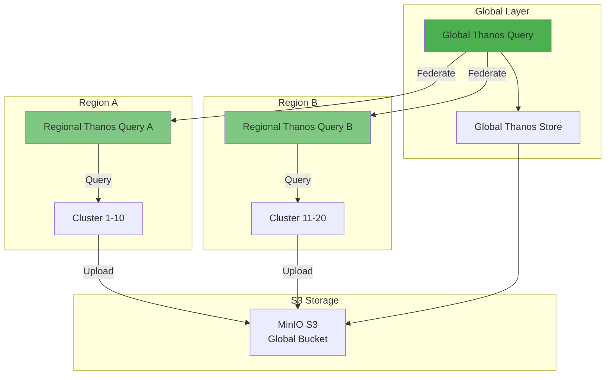

# 06. 확장 아키텍처

## 📋 개요

이 섹션에서는 **대규모 환경 및 특수한 요구사항**을 위한 확장 아키텍처를 소개합니다.

기본 4-클러스터 구성을 넘어서, 수십 개 이상의 클러스터나 특수한 지리적 분산 환경을 위한 설계입니다.

---

## 📂 문서 목록

### [대규모-아키텍처.md](./대규모-아키텍처.md)
**목적**: 대규모 멀티클러스터 환경을 위한 확장 전략

**주요 내용**:
- 20개 이상 클러스터 관리
- 계층적 Thanos 구조
- 리전별 Thanos Query 배치
- 글로벌 Aggregation Layer
- 네트워크 최적화
- 리소스 스케일링 가이드

**대상 독자**: 엔터프라이즈 아키텍트, 대규모 운영 담당자

---

### [7노드-220클러스터.md](./7노드-220클러스터.md)
**목적**: 7개 물리 노드에 220개 Minikube 클러스터 배치

**주요 내용**:
- 노드별 클러스터 배치 전략
- 리소스 할당 계산
- 네트워크 설계
- Thanos 계층 구조
- 운영 고려사항

**대상 독자**: 하이퍼바이저 환경 운영자, 클라우드 아키텍트

**특징**: 극한의 멀티테넌시 환경

---

### [단일-180노드-리전분리.md](./단일-180노드-리전분리.md)
**목적**: 단일 대형 클러스터의 리전별 워크로드 분리

**주요 내용**:
- 180개 노드 클러스터 설계
- 리전별 Node Pool 구성
- Affinity/Taints 를 통한 워크로드 격리
- 리전별 Prometheus 배치
- 네트워크 레이턴시 최적화

**대상 독자**: 클라우드 인프라 아키텍트, 대규모 클러스터 운영자

**특징**: 단일 컨트롤 플레인, 리전별 데이터 플레인 분리

---

## 🎯 확장 패턴 비교

| 패턴 | 클러스터 수 | 노드 수 | 적합한 환경 |
|------|-----------|---------|------------|
| **기본 (4-클러스터)** | 1-20개 | ~10개/클러스터 | 중소규모, 온프레미스 |
| **대규모** | 20-100개 | ~10-50개/클러스터 | 멀티리전, 하이브리드 클라우드 |
| **7노드-220클러스터** | 220개 | 1개/클러스터 | 개발/테스트 환경, 멀티테넌시 |
| **단일-180노드** | 1개 | 180개 | 대규모 단일 워크로드 |

---

## 🏗️ 확장 아키텍처 예시

### 계층적 Thanos 구조

---

## 📊 스케일링 고려사항

### 1. Thanos Query 스케일링
- **기본**: 1 replica (클러스터 1-10개)
- **중규모**: 2-3 replicas (클러스터 10-50개)
- **대규모**: 5+ replicas + 리전별 Query (클러스터 50개+)

### 2. S3 버킷 전략
- **단일 버킷**: 클러스터 < 20개
- **리전별 버킷**: 클러스터 20-100개
- **계층적 버킷**: 클러스터 100개+

### 3. 네트워크 대역폭
- **Sidecar 업로드**: ~10MB/h/클러스터
- **Remote Write**: ~50MB/h/클러스터
- **리전 간 복제**: 추가 대역폭 고려

---

## 🔗 관련 문서

- **기본 아키텍처** → [01-아키텍처-개요](../01-아키텍처-개요/)
- **패턴 비교** → [01-아키텍처-개요/패턴-비교-가이드.md](../01-아키텍처-개요/패턴-비교-가이드.md)
- **운영 가이드** → [05-운영-가이드](../05-운영-가이드/)

---

## ⚠️ 주의사항

1. **리소스 계산**: 확장 전 충분한 용량 계획 필요
2. **네트워크 설계**: 리전 간 레이턴시 고려
3. **비용 최적화**: S3 스토리지 비용 증가 예상
4. **점진적 확장**: 단계적으로 증설 권장

---

**최종 업데이트**: 2025-10-20
