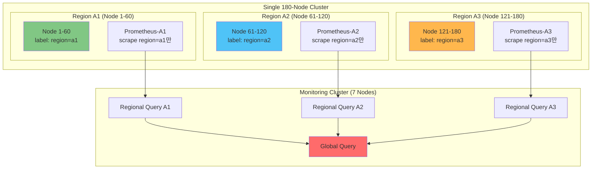
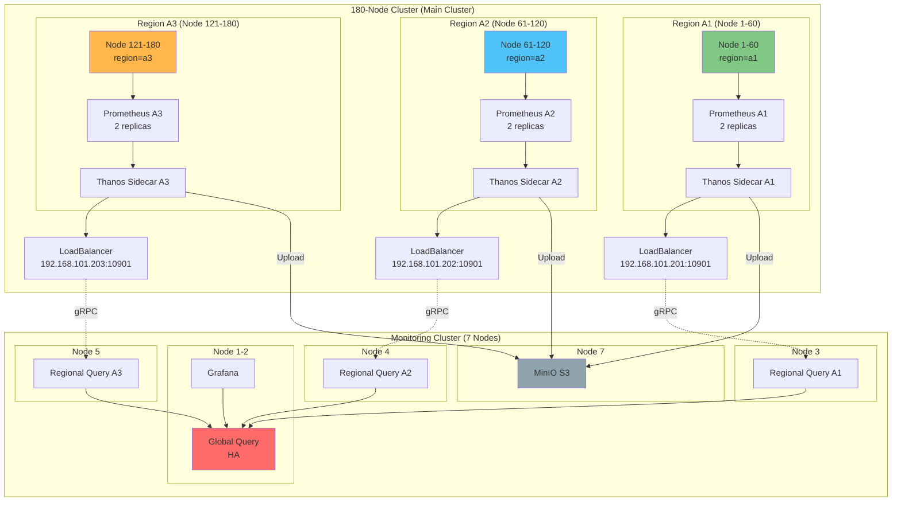

# 🌐 단일 180노드 클러스터 Region 분리 전략

> **환경**: 180개 노드가 단일 Kubernetes 클러스터 + 모니터링 전용 노드 7대

## 📊 문제 정의

### 기존 오해
- ❌ 180개 **클러스터** (X)
- ✅ 180개 **노드**로 구성된 **단일 클러스터** (O)

### 새로운 요구사항

```yaml
구성:
  - 단일 Kubernetes 클러스터: 180개 워커 노드
  - 추가 그룹:
    - Group B: 20개 노드 클러스터 (별도)
    - Group C: 10개 노드 클러스터 (별도)
    - Group D: 10개 노드 클러스터 (별도)
  - 모니터링 클러스터: 7개 노드

목표:
  - 180노드 단일 클러스터를 논리적으로 Region 분리
  - 각 Region별 메트릭 수집 및 조회
  - Region별 부하 분산
```

---

## 🎯 해결 방안: 논리적 Region 분리 (Node Labels + Relabeling)

### 핵심 개념



---

## 🏗️ 단계별 구현 전략

### Step 1: 노드 라벨링 (Region 분리)

#### 1.1 180개 노드 라벨링

```bash
# Region A1: Node 1-60
for i in {1..60}; do
  kubectl label node worker-node-$i region=a1 zone=zone-$((($i-1)/20 + 1))
done

# Region A2: Node 61-120
for i in {61..120}; do
  kubectl label node worker-node-$i region=a2 zone=zone-$((($i-61)/20 + 4))
done

# Region A3: Node 121-180
for i in {121..180}; do
  kubectl label node worker-node-$i region=a3 zone=zone-$((($i-121)/20 + 7))
done
```

**라벨 구조:**
```yaml
region: a1, a2, a3  # 대분류 (60개씩)
zone: zone-1 ~ zone-9  # 소분류 (20개씩, 총 9개 zone)
```

#### 1.2 라벨 검증

```bash
# Region별 노드 수 확인
kubectl get nodes -l region=a1 --no-headers | wc -l  # 60
kubectl get nodes -l region=a2 --no-headers | wc -l  # 60
kubectl get nodes -l region=a3 --no-headers | wc -l  # 60

# Zone별 노드 수 확인
for zone in {1..9}; do
  echo "Zone $zone: $(kubectl get nodes -l zone=zone-$zone --no-headers | wc -l)"
done
```

---

### Step 2: Region별 Prometheus 배포

#### 2.1 Prometheus Operator 설정

```yaml
# deploy/single-cluster/prometheus-a1/prometheus.yaml
apiVersion: monitoring.coreos.com/v1
kind: Prometheus
metadata:
  name: prometheus-a1
  namespace: monitoring
  labels:
    region: a1
spec:
  replicas: 2  # HA

  # Region A1 노드에만 배포
  affinity:
    nodeAffinity:
      requiredDuringSchedulingIgnoredDuringExecution:
        nodeSelectorTerms:
        - matchExpressions:
          - key: region
            operator: In
            values:
            - a1
    podAntiAffinity:
      preferredDuringSchedulingIgnoredDuringExecution:
      - weight: 100
        podAffinityTerm:
          labelSelector:
            matchLabels:
              prometheus: prometheus-a1
          topologyKey: kubernetes.io/hostname

  # Region A1 메트릭만 수집
  externalLabels:
    cluster: main-cluster
    region: a1
    prometheus_replica: "$(POD_NAME)"

  # Thanos Sidecar
  thanos:
    image: quay.io/thanos/thanos:v0.37.2
    objectStorageConfig:
      name: thanos-s3-config
      key: objstore.yml

  retention: 2h

  # ServiceMonitor 선택 (region=a1만)
  serviceMonitorSelector:
    matchLabels:
      region: a1

  # PodMonitor 선택 (region=a1만)
  podMonitorSelector:
    matchLabels:
      region: a1

  resources:
    requests:
      cpu: 2000m
      memory: 4Gi
    limits:
      cpu: 4000m
      memory: 8Gi
```

#### 2.2 ServiceMonitor 필터링 (Relabeling)

```yaml
# deploy/single-cluster/prometheus-a1/servicemonitor-node-exporter.yaml
apiVersion: monitoring.coreos.com/v1
kind: ServiceMonitor
metadata:
  name: node-exporter-a1
  namespace: monitoring
  labels:
    region: a1  # Prometheus가 이 label로 선택
spec:
  selector:
    matchLabels:
      app: node-exporter

  endpoints:
  - port: metrics
    interval: 30s

    # Region A1 노드만 스크랩
    relabelConfigs:
    # 1. Node의 region 라벨 가져오기
    - sourceLabels: [__meta_kubernetes_node_label_region]
      action: keep
      regex: a1  # region=a1인 노드만 유지

    # 2. Region 라벨 추가
    - sourceLabels: [__meta_kubernetes_node_label_region]
      targetLabel: region
      action: replace

    # 3. Zone 라벨 추가
    - sourceLabels: [__meta_kubernetes_node_label_zone]
      targetLabel: zone
      action: replace

    # 4. Node 이름 추가
    - sourceLabels: [__meta_kubernetes_node_name]
      targetLabel: node
      action: replace
```

#### 2.3 Prometheus A2, A3 동일 구조로 배포

```bash
# Prometheus A2 (Region A2)
sed 's/a1/a2/g' prometheus-a1.yaml > prometheus-a2.yaml
kubectl apply -f prometheus-a2.yaml

# Prometheus A3 (Region A3)
sed 's/a1/a3/g' prometheus-a1.yaml > prometheus-a3.yaml
kubectl apply -f prometheus-a3.yaml
```

---

### Step 3: 모니터링 클러스터 Regional Query 배포

#### 3.1 Regional Query 구성

```yaml
# 모니터링 클러스터 Node 3: Regional Query A1
apiVersion: apps/v1
kind: Deployment
metadata:
  name: regional-query-a1
  namespace: monitoring
spec:
  replicas: 2
  selector:
    matchLabels:
      app: regional-query-a1
  template:
    metadata:
      labels:
        app: regional-query-a1
        region: a1
    spec:
      # 모니터링 클러스터 Node 3에 배포
      nodeSelector:
        role: regional-a1

      containers:
      - name: thanos-query
        image: quay.io/thanos/thanos:v0.37.2
        args:
        - query
        - --http-address=0.0.0.0:9090
        - --grpc-address=0.0.0.0:10901
        - --query.replica-label=prometheus_replica

        # 180노드 클러스터의 Prometheus A1 Sidecar 연결
        # Service Discovery 사용
        - --store.sd-dns-interval=30s
        - --store=dnssrv+_grpc-sidecar._tcp.prometheus-a1-thanos-sidecar.monitoring.svc.cluster.local

        resources:
          limits:
            cpu: 4000m
            memory: 8Gi
          requests:
            cpu: 2000m
            memory: 4Gi
```

#### 3.2 Cross-Cluster Service Discovery

**문제**: 모니터링 클러스터에서 180노드 클러스터의 Prometheus Sidecar에 어떻게 접근?

**해결책 1: LoadBalancer Service (권장)**

```yaml
# 180노드 클러스터에서 배포
# Prometheus A1 Sidecar를 외부로 노출
apiVersion: v1
kind: Service
metadata:
  name: prometheus-a1-sidecar-external
  namespace: monitoring
spec:
  type: LoadBalancer
  selector:
    prometheus: prometheus-a1
    thanos-store-api: "true"
  ports:
  - name: grpc
    port: 10901
    targetPort: 10901
  externalTrafficPolicy: Local
```

```yaml
# 모니터링 클러스터에서 연결
# Regional Query A1
args:
  - --store=<loadbalancer-ip-a1>:10901  # 예: 192.168.101.201:10901
```

**해결책 2: NodePort Service**

```yaml
# 180노드 클러스터
apiVersion: v1
kind: Service
metadata:
  name: prometheus-a1-sidecar-external
  namespace: monitoring
spec:
  type: NodePort
  selector:
    prometheus: prometheus-a1
  ports:
  - name: grpc
    port: 10901
    targetPort: 10901
    nodePort: 30901  # 고정 NodePort
```

```yaml
# 모니터링 클러스터
args:
  - --store=<any-worker-node-ip>:30901
```

**해결책 3: Ingress (gRPC)**

```yaml
# 180노드 클러스터
apiVersion: networking.k8s.io/v1
kind: Ingress
metadata:
  name: prometheus-a1-sidecar-grpc
  namespace: monitoring
  annotations:
    nginx.ingress.kubernetes.io/backend-protocol: "GRPC"
spec:
  ingressClassName: nginx
  rules:
  - host: prometheus-a1-sidecar.main-cluster.local
    http:
      paths:
      - path: /
        pathType: Prefix
        backend:
          service:
            name: prometheus-a1-thanos-sidecar
            port:
              number: 10901
```

---

### Step 4: 전체 아키텍처



---

## 📊 리소스 배분

### 180노드 클러스터 리소스

#### Prometheus 배포 (Region별)

| Region | 담당 노드 | Prometheus Replicas | CPU | Memory | 배포 위치 |
|--------|----------|---------------------|-----|--------|----------|
| **A1** | 1-60 | 2 | 4 cores × 2 = 8 cores | 8Gi × 2 = 16Gi | Node 1-60 중 선택 |
| **A2** | 61-120 | 2 | 4 cores × 2 = 8 cores | 8Gi × 2 = 16Gi | Node 61-120 중 선택 |
| **A3** | 121-180 | 2 | 4 cores × 2 = 8 cores | 8Gi × 2 = 16Gi | Node 121-180 중 선택 |

**총 180노드 클러스터 모니터링 오버헤드:**
- CPU: 24 cores (전체 노드의 ~0.01%)
- Memory: 48Gi (전체 노드의 ~0.01%)

### 모니터링 클러스터 (7 Nodes)

이전 설계와 동일 유지

---

## 🔧 상세 배포 가이드

### Phase 1: 180노드 클러스터 준비

#### 1.1 노드 라벨링 스크립트

```bash
#!/bin/bash
# label-nodes.sh

# Region A1 (1-60)
echo "Labeling Region A1..."
for i in {1..60}; do
  zone=$((($i-1)/20 + 1))
  kubectl label node worker-node-$i \
    region=a1 \
    zone=zone-$zone \
    monitoring-target=true \
    --overwrite

  if [ $((i % 10)) -eq 0 ]; then
    echo "  Labeled $i/60 nodes in Region A1"
  fi
done

# Region A2 (61-120)
echo "Labeling Region A2..."
for i in {61..120}; do
  zone=$((($i-61)/20 + 4))
  kubectl label node worker-node-$i \
    region=a2 \
    zone=zone-$zone \
    monitoring-target=true \
    --overwrite

  if [ $((i % 10)) -eq 0 ]; then
    echo "  Labeled $((i-60))/60 nodes in Region A2"
  fi
done

# Region A3 (121-180)
echo "Labeling Region A3..."
for i in {121..180}; do
  zone=$((($i-121)/20 + 7))
  kubectl label node worker-node-$i \
    region=a3 \
    zone=zone-$zone \
    monitoring-target=true \
    --overwrite

  if [ $((i % 10)) -eq 0 ]; then
    echo "  Labeled $((i-120))/60 nodes in Region A3"
  fi
done

# 검증
echo ""
echo "=== Verification ==="
echo "Region A1: $(kubectl get nodes -l region=a1 --no-headers | wc -l) nodes"
echo "Region A2: $(kubectl get nodes -l region=a2 --no-headers | wc -l) nodes"
echo "Region A3: $(kubectl get nodes -l region=a3 --no-headers | wc -l) nodes"
echo ""
for zone in {1..9}; do
  count=$(kubectl get nodes -l zone=zone-$zone --no-headers | wc -l)
  echo "Zone $zone: $count nodes"
done
```

#### 1.2 실행

```bash
chmod +x label-nodes.sh
./label-nodes.sh
```

---

### Phase 2: Prometheus Operator 배포 (180노드 클러스터)

#### 2.1 kube-prometheus-stack 설치

```bash
# 180노드 클러스터에서
helm repo add prometheus-community https://prometheus-community.github.io/helm-charts
helm repo update

# 기본 설치 (Prometheus Operator만)
helm install kube-prometheus-stack prometheus-community/kube-prometheus-stack \
  --namespace monitoring \
  --create-namespace \
  --set prometheus.enabled=false \
  --set alertmanager.enabled=false \
  --set grafana.enabled=false \
  --set prometheusOperator.enabled=true
```

#### 2.2 Prometheus A1 배포

```yaml
# prometheus-a1.yaml
apiVersion: monitoring.coreos.com/v1
kind: Prometheus
metadata:
  name: prometheus-a1
  namespace: monitoring
spec:
  replicas: 2

  # Region A1 노드에 배포
  affinity:
    nodeAffinity:
      requiredDuringSchedulingIgnoredDuringExecution:
        nodeSelectorTerms:
        - matchExpressions:
          - key: region
            operator: In
            values:
            - a1

  externalLabels:
    cluster: main-cluster
    region: a1
    prometheus_replica: "$(POD_NAME)"

  # Thanos Sidecar
  thanos:
    image: quay.io/thanos/thanos:v0.37.2
    objectStorageConfig:
      name: thanos-s3-config
      key: objstore.yml
    resources:
      requests:
        cpu: 500m
        memory: 1Gi
      limits:
        cpu: 1000m
        memory: 2Gi

  retention: 2h

  # Region A1만 스크랩
  serviceMonitorSelector:
    matchLabels:
      region: a1

  podMonitorSelector:
    matchLabels:
      region: a1

  resources:
    requests:
      cpu: 2000m
      memory: 4Gi
    limits:
      cpu: 4000m
      memory: 8Gi

  storageSpec:
    volumeClaimTemplate:
      spec:
        accessModes:
        - ReadWriteOnce
        resources:
          requests:
            storage: 50Gi
```

```bash
kubectl apply -f prometheus-a1.yaml
```

#### 2.3 ServiceMonitor 생성 (Node Exporter)

```yaml
# servicemonitor-node-exporter-a1.yaml
apiVersion: monitoring.coreos.com/v1
kind: ServiceMonitor
metadata:
  name: node-exporter-a1
  namespace: monitoring
  labels:
    region: a1
spec:
  selector:
    matchLabels:
      app.kubernetes.io/name: node-exporter

  endpoints:
  - port: metrics
    interval: 30s
    scheme: http

    relabelConfigs:
    # Region A1 노드만 스크랩
    - sourceLabels: [__meta_kubernetes_endpoint_node_name]
      action: keep
      regex: worker-node-([1-9]|[1-5][0-9]|60)  # 1-60번 노드만

    # Region 라벨 추가
    - sourceLabels: [__meta_kubernetes_node_label_region]
      targetLabel: region
      action: replace

    # Zone 라벨 추가
    - sourceLabels: [__meta_kubernetes_node_label_zone]
      targetLabel: zone
      action: replace
```

**더 정확한 필터링:**

```yaml
    relabelConfigs:
    # 노드의 region 라벨 확인
    - sourceLabels: [__meta_kubernetes_node_label_region]
      action: keep
      regex: a1  # region=a1만 유지
```

#### 2.4 Prometheus A2, A3 배포

```bash
# A2 생성
sed 's/a1/a2/g; s/1-60/61-120/g; s/worker-node-([1-9]|[1-5][0-9]|60)/worker-node-(6[1-9]|[7-9][0-9]|1[01][0-9]|120)/g' \
  prometheus-a1.yaml > prometheus-a2.yaml
kubectl apply -f prometheus-a2.yaml
kubectl apply -f servicemonitor-node-exporter-a2.yaml

# A3 생성
sed 's/a1/a3/g; s/1-60/121-180/g; s/worker-node-([1-9]|[1-5][0-9]|60)/worker-node-(12[1-9]|1[3-7][0-9]|180)/g' \
  prometheus-a1.yaml > prometheus-a3.yaml
kubectl apply -f prometheus-a3.yaml
kubectl apply -f servicemonitor-node-exporter-a3.yaml
```

---

### Phase 3: Sidecar 외부 노출 (LoadBalancer)

```yaml
# prometheus-a1-sidecar-lb.yaml
apiVersion: v1
kind: Service
metadata:
  name: prometheus-a1-sidecar-lb
  namespace: monitoring
  annotations:
    metallb.universe.tf/allow-shared-ip: "prometheus-sidecars"
spec:
  type: LoadBalancer
  loadBalancerIP: 192.168.101.201  # 사전 할당된 IP
  externalTrafficPolicy: Local
  selector:
    prometheus: prometheus-a1
  ports:
  - name: grpc
    port: 10901
    targetPort: 10901
    protocol: TCP
```

```bash
# 3개 Region 모두 생성
kubectl apply -f prometheus-a1-sidecar-lb.yaml
kubectl apply -f prometheus-a2-sidecar-lb.yaml  # IP: 192.168.101.202
kubectl apply -f prometheus-a3-sidecar-lb.yaml  # IP: 192.168.101.203

# 검증
kubectl get svc -n monitoring | grep sidecar-lb
```

---

### Phase 4: 모니터링 클러스터 Regional Query 연결

```yaml
# 모니터링 클러스터 Node 3
# regional-query-a1-deployment.yaml
apiVersion: apps/v1
kind: Deployment
metadata:
  name: regional-query-a1
  namespace: monitoring
spec:
  replicas: 2
  selector:
    matchLabels:
      app: regional-query-a1
  template:
    metadata:
      labels:
        app: regional-query-a1
    spec:
      nodeSelector:
        role: regional-a1  # 모니터링 클러스터 Node 3

      containers:
      - name: thanos-query
        image: quay.io/thanos/thanos:v0.37.2
        args:
        - query
        - --http-address=0.0.0.0:9090
        - --grpc-address=0.0.0.0:10901
        - --query.replica-label=prometheus_replica

        # 180노드 클러스터 Prometheus A1 Sidecar 연결
        - --store=192.168.101.201:10901  # LoadBalancer IP

        resources:
          limits:
            cpu: 4000m
            memory: 8Gi
          requests:
            cpu: 2000m
            memory: 4Gi
```

---

## 🔍 검증 및 테스트

### 1. 노드 라벨 검증

```bash
# Region별 노드 수
kubectl get nodes -l region=a1 --no-headers | wc -l  # 60
kubectl get nodes -l region=a2 --no-headers | wc -l  # 60
kubectl get nodes -l region=a3 --no-headers | wc -l  # 60

# 특정 노드 라벨 확인
kubectl get node worker-node-1 --show-labels | grep region
kubectl get node worker-node-61 --show-labels | grep region
kubectl get node worker-node-121 --show-labels | grep region
```

### 2. Prometheus 타겟 검증

```bash
# Prometheus A1 타겟 확인 (60개 노드만 스크랩해야 함)
kubectl port-forward -n monitoring svc/prometheus-a1 9090:9090

# 브라우저에서 http://localhost:9090/targets
# Filter: region="a1"
# 예상: 60개 node-exporter 타겟

# PromQL로 확인
curl -g 'http://localhost:9090/api/v1/query?query=up{region="a1"}' | jq '.data.result | length'
# 예상 출력: 60
```

### 3. Region 분리 검증

```promql
# Region A1 노드 수
count(up{region="a1"})
# 예상: 60

# Region A2 노드 수
count(up{region="a2"})
# 예상: 60

# Region A3 노드 수
count(up{region="a3"})
# 예상: 60

# Region별 CPU 사용률
sum(rate(node_cpu_seconds_total{mode!="idle"}[5m])) by (region)
```

### 4. Thanos Query 연결 검증

```bash
# 모니터링 클러스터 Regional Query A1
kubectl exec -n monitoring regional-query-a1-xxx -- \
  wget -qO- http://localhost:9090/api/v1/stores | jq '.'

# 예상 출력:
# - 192.168.101.201:10901 (Prometheus A1 Sidecar)
# - labelSets: [{"region": "a1", "cluster": "main-cluster"}]
```

### 5. Global Query 통합 검증

```bash
# Global Query에서 전체 조회
kubectl exec -n monitoring global-thanos-query-xxx -- \
  wget -qO- 'http://localhost:9090/api/v1/query?query=count(up)' | jq '.'

# 예상: 180개 노드 메트릭
```

---

## 📊 추가 그룹 통합 (B, C, D)

### Group B (20노드), C (10노드), D (10노드) 클러스터

**동일 방식 적용:**

```bash
# Group B 클러스터 (별도 Kubernetes 클러스터)
kubectl label node worker-node-{1..20} region=b zone=zone-b --context=cluster-b
kubectl apply -f prometheus-b.yaml --context=cluster-b

# Group C 클러스터
kubectl label node worker-node-{1..10} region=c zone=zone-c --context=cluster-c
kubectl apply -f prometheus-c.yaml --context=cluster-c

# Group D 클러스터
kubectl label node worker-node-{1..10} region=d zone=zone-d --context=cluster-d
kubectl apply -f prometheus-d.yaml --context=cluster-d
```

**모니터링 클러스터 Node 6에서 통합:**

```yaml
# Regional Query BCD (모니터링 클러스터 Node 6)
args:
  - --store=192.168.101.204:10901  # Group B LB
  - --store=192.168.101.205:10901  # Group C LB
  - --store=192.168.101.206:10901  # Group D LB
```

---

## 🎯 최종 아키텍처 요약

```
┌──────────────────────────────────────────────┐
│  180-Node Single Cluster                     │
│                                              │
│  Region A1 (Node 1-60)                       │
│    → Prometheus A1 (2 replicas)             │
│    → LoadBalancer: 192.168.101.201          │
│                                              │
│  Region A2 (Node 61-120)                     │
│    → Prometheus A2 (2 replicas)             │
│    → LoadBalancer: 192.168.101.202          │
│                                              │
│  Region A3 (Node 121-180)                    │
│    → Prometheus A3 (2 replicas)             │
│    → LoadBalancer: 192.168.101.203          │
└──────────────────────────────────────────────┘
                    │
                    │ gRPC (10901)
                    ▼
┌──────────────────────────────────────────────┐
│  Monitoring Cluster (7 Nodes)               │
│                                              │
│  Node 3: Regional Query A1                  │
│  Node 4: Regional Query A2                  │
│  Node 5: Regional Query A3                  │
│  Node 6: Regional Query BCD                 │
│  Node 1-2: Global Query + Grafana           │
│  Node 7: MinIO S3                           │
└──────────────────────────────────────────────┘
```

---

## 📚 참고 문서

- [7_NODE_220_CLUSTER_ARCHITECTURE.md](./7_NODE_220_CLUSTER_ARCHITECTURE.md)
- [LARGE_SCALE_ARCHITECTURE.md](./LARGE_SCALE_ARCHITECTURE.md)
- Prometheus Operator: https://prometheus-operator.dev/
- Thanos Documentation: https://thanos.io/

---

**Last Updated**: 2025-10-15
**Architecture**: Single 180-Node Cluster with Logical Region Separation
**Key**: Node Labels + ServiceMonitor Relabeling + LoadBalancer
