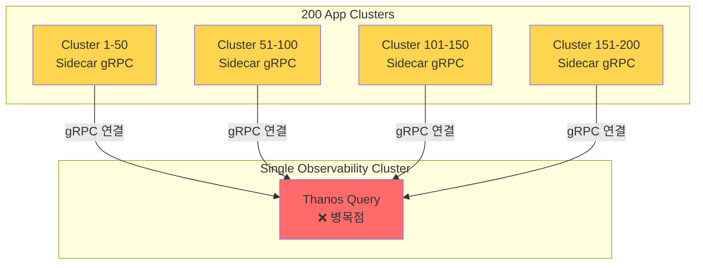
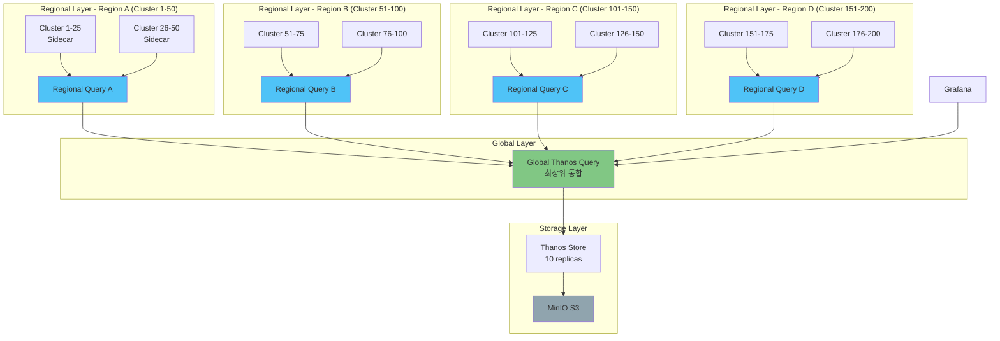
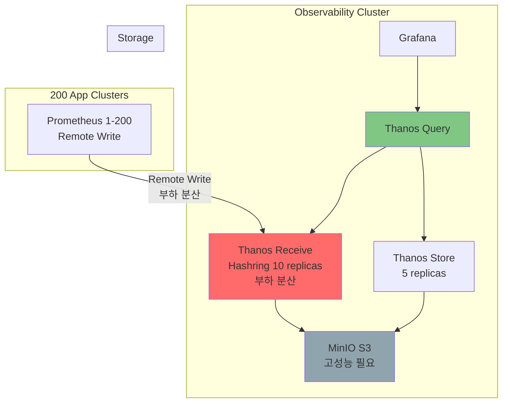
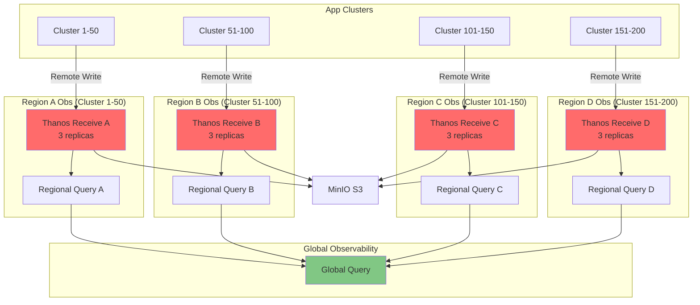
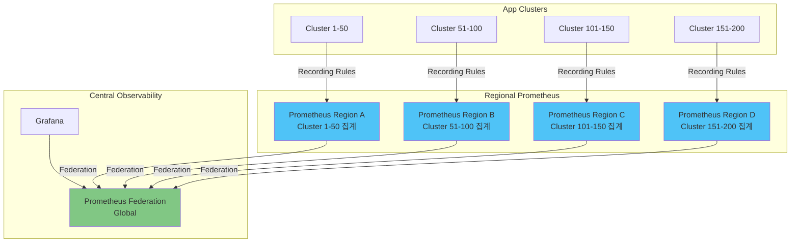
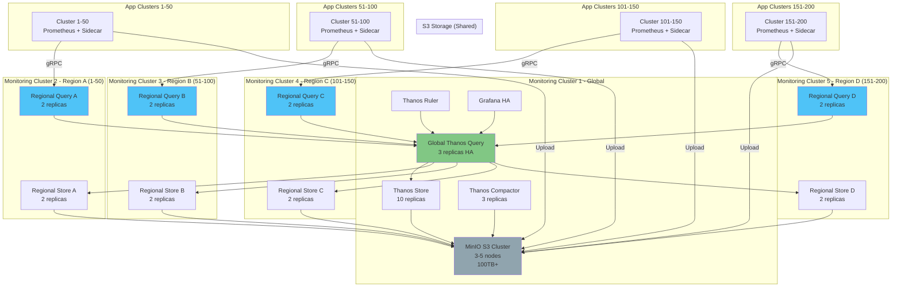

# 🚀 대규모 Thanos 아키텍처 (100-200+ 클러스터)

> **시나리오**: 모니터링 전용 클러스터 1대 + 애플리케이션 클러스터 200대

## 📊 문제 분석

### 현재 Pattern B+ 구조의 한계



### 🔴 병목점 (Bottlenecks)

| 문제 | 영향 | 임계점 |
|------|------|--------|
| **Thanos Query 과부하** | 200개 gRPC 연결 처리 불가 | 50개 이상부터 성능 저하 |
| **네트워크 대역폭** | 모든 쿼리가 단일 Query 경유 | 10Gbps 대역폭 소진 |
| **메모리 부족** | 200개 시계열 데이터 병합 | 쿼리당 수 GB 메모리 |
| **단일 장애점** | Query 죽으면 전체 조회 불가 | HA로도 한계 |
| **S3 I/O** | Store Gateway 읽기 경합 | IOPS 한계 |

### 📈 리소스 예측 (200 클러스터)

```yaml
# 현재 Pattern B+ 구조로 200 클러스터 시도 시

Thanos Query (단일):
  필요 CPU: 20+ cores (실제 제공: 1 core) ❌
  필요 Memory: 64+ Gi (실제 제공: 2Gi) ❌
  gRPC 연결: 200개 (권장 최대: 50개) ❌

Thanos Store Gateway:
  필요 CPU: 10+ cores
  필요 Memory: 32+ Gi
  S3 IOPS: 10,000+ (병목)

결론: 현재 구조로 불가능 ❌
```

---

## 🎯 해결책: 4가지 대규모 아키텍처 패턴

### Pattern D1: 계층형 Thanos Query (Hierarchical)



**특징:**
- ✅ 부하 분산: 50개씩 4개 Region으로 분할
- ✅ 확장성: Region 추가 가능
- ✅ 장애 격리: Region 장애 시 다른 Region은 정상
- ⚠️ 쿼리 홉 증가 (2단계)

**리소스:**
```yaml
Global Query (1):
  CPU: 2 cores
  Memory: 4Gi

Regional Query (4개):
  CPU: 2 cores × 4 = 8 cores
  Memory: 4Gi × 4 = 16Gi

Thanos Store (10 replicas):
  CPU: 1 core × 10 = 10 cores
  Memory: 2Gi × 10 = 20Gi

총 Observability Cluster:
  CPU: 20 cores
  Memory: 40Gi
  최소 노드: 3-5대 (고사양)
```

---

### Pattern D2: Thanos Receive (Push 방식)



**특징:**
- ✅ 부하 분산: Hashring으로 자동 분산
- ✅ 단순 구조: Regional Query 불필요
- ✅ 고성능: Receive가 직접 S3 쓰기
- ❌ Remote Write 비용 (네트워크 부하)
- ❌ 클러스터 독립성 낮음

**리소스:**
```yaml
Thanos Receive (10 replicas):
  CPU: 2 cores × 10 = 20 cores
  Memory: 4Gi × 10 = 40Gi
  네트워크: 10Gbps+

Thanos Query (3 replicas):
  CPU: 2 cores × 3 = 6 cores
  Memory: 4Gi × 3 = 12Gi

Thanos Store (5 replicas):
  CPU: 1 core × 5 = 5 cores
  Memory: 2Gi × 5 = 10Gi

총 Observability Cluster:
  CPU: 31 cores
  Memory: 62Gi
  최소 노드: 5-8대
```

---

### Pattern D3: 하이브리드 (Region + Receive)



**특징:**
- ✅ 최고 확장성: 수천 개 클러스터까지
- ✅ 지역 격리: Region 독립 운영
- ✅ 부하 분산: Region + Hashring 2단계
- ⚠️ 매우 높은 비용
- ⚠️ 매우 높은 복잡도

---

### Pattern D4: Federation (연합)



**특징:**
- ✅ 단순 구조: Prometheus 표준 기능
- ✅ 저비용: Thanos 불필요
- ❌ 장기 보관 어려움 (S3 없음)
- ❌ 제한된 쿼리 기능

---

## 📊 4가지 패턴 비교

| 항목 | D1: Hierarchical | D2: Receive | D3: Hybrid | D4: Federation |
|------|-----------------|-------------|-----------|----------------|
| **복잡도** | ⭐⭐⭐⭐ | ⭐⭐⭐⭐ | ⭐⭐⭐⭐⭐ | ⭐⭐⭐ |
| **비용/월** | $2,000 | $3,000 | $5,000+ | $1,500 |
| **최대 클러스터** | 200-500 | 500-1000 | 1000+ | 500 |
| **장기 보관** | ✅ S3 | ✅ S3 | ✅ S3 | ❌ 제한 |
| **클러스터 독립성** | ✅ 높음 | ⚠️ 낮음 | ⚠️ 낮음 | ✅ 높음 |
| **쿼리 성능** | ⚠️ 2홉 | ✅ 1홉 | ⚠️ 2홉 | ✅ 빠름 |
| **네트워크 부하** | 낮음 | **높음** | **높음** | 중간 |
| **장애 격리** | ✅ Region별 | ⚠️ 중앙 의존 | ✅ Region별 | ✅ Region별 |
| **운영 복잡도** | 중간 | 중간 | **매우 높음** | 낮음 |
| **200 클러스터** | ✅ **추천** | ✅ 가능 | ⚠️ 과도 | ✅ 가능 |

---

## 🎯 200 클러스터 권장 아키텍처: Pattern D1 (Hierarchical)

### 아키텍처 상세 설계



### 클러스터 구성

| 클러스터 | 역할 | 노드 수 | 사양 | 비용/월 |
|---------|------|---------|------|---------|
| **Monitoring-Global** | Global Query + Store + Compactor | 3-5 | 16 cores, 32Gi | $800 |
| **Monitoring-Region-A** | Regional Query + Store (1-50) | 2 | 8 cores, 16Gi | $300 |
| **Monitoring-Region-B** | Regional Query + Store (51-100) | 2 | 8 cores, 16Gi | $300 |
| **Monitoring-Region-C** | Regional Query + Store (101-150) | 2 | 8 cores, 16Gi | $300 |
| **Monitoring-Region-D** | Regional Query + Store (151-200) | 2 | 8 cores, 16Gi | $300 |
| **MinIO S3** | Object Storage (공유) | 3-5 | 8 cores, 64Gi, 20TB | $500 |

**총 비용: ~$2,500/월**

### 리소스 상세

```yaml
# Global Monitoring Cluster (Monitoring-Global)
Global Thanos Query (3 replicas):
  CPU: 2 cores × 3 = 6 cores
  Memory: 4Gi × 3 = 12Gi

Thanos Store Gateway (10 replicas):
  CPU: 1 core × 10 = 10 cores
  Memory: 2Gi × 10 = 20Gi

Thanos Compactor (3 replicas):
  CPU: 1 core × 3 = 3 cores
  Memory: 2Gi × 3 = 6Gi

Thanos Ruler:
  CPU: 500m
  Memory: 1Gi

Grafana (2 replicas):
  CPU: 500m × 2 = 1 core
  Memory: 1Gi × 2 = 2Gi

총: 20.5 cores, 41Gi

---

# Regional Monitoring Cluster (각각 동일)
Regional Thanos Query (2 replicas):
  CPU: 2 cores × 2 = 4 cores
  Memory: 4Gi × 2 = 8Gi

Regional Thanos Store (2 replicas):
  CPU: 1 core × 2 = 2 cores
  Memory: 2Gi × 2 = 4Gi

총: 6 cores, 12Gi per Region
4개 Region: 24 cores, 48Gi

---

# 전체 Observability 인프라
총 CPU: 20.5 + 24 = 44.5 cores
총 Memory: 41 + 48 = 89Gi
S3 Storage: 100TB+ (3개월 보관)
```

---

## 🚀 마이그레이션 전략: Pattern B+ → Pattern D1

### Phase 1: Regional 클러스터 구축 (Week 1-2)

```bash
# 1. 4개 Regional Monitoring 클러스터 생성
# Region A: 192.168.101.201-202 (2 nodes)
# Region B: 192.168.101.203-204 (2 nodes)
# Region C: 192.168.101.205-206 (2 nodes)
# Region D: 192.168.101.207-208 (2 nodes)

# 2. 각 Regional 클러스터에 배포
for region in region-a region-b region-c region-d; do
  cd deploy/overlays/$region/
  kustomize build . --enable-helm | kubectl apply -f -
done
```

### Phase 2: Global 클러스터 업그레이드 (Week 3)

```bash
# 기존 Monitoring-01을 Global로 업그레이드
cd deploy/overlays/monitoring-global/

# Global Query가 4개 Regional Query를 바라보도록 설정
kubectl apply -f thanos-query-global.yaml

# Store Gateway 스케일 아웃 (2 → 10 replicas)
kubectl scale statefulset thanos-store --replicas=10 -n monitoring
```

### Phase 3: App 클러스터 재구성 (Week 4-6)

```bash
# Cluster 1-50: Region A로 연결
for i in {1..50}; do
  # Sidecar gRPC 엔드포인트 변경
  # regional-query-a.monitoring-region-a:10901
done

# Cluster 51-100: Region B로 연결
# Cluster 101-150: Region C로 연결
# Cluster 151-200: Region D로 연결
```

### Phase 4: 검증 및 전환 (Week 7)

```bash
# 1. Global Query에서 모든 Region 확인
curl http://global-query:9090/api/v1/stores | jq '.data[] | .name'

# 예상 출력:
# - regional-query-a:10901
# - regional-query-b:10901
# - regional-query-c:10901
# - regional-query-d:10901
# - thanos-store-0:10901
# - ... (총 14개)

# 2. Grafana Datasource 전환
# Thanos-Query → Global-Thanos-Query

# 3. 쿼리 테스트
sum(up) by (cluster)  # 200개 클러스터 확인
```

**총 마이그레이션 기간: 7주**
**다운타임: 0분 (Blue-Green 전환)**

---

## 📊 성능 예측

### 현재 (Pattern B+, 4 클러스터)

| 메트릭 | 값 |
|--------|-----|
| Thanos Query 응답시간 (p99) | 2-5초 |
| 동시 쿼리 처리 | 10-20개 |
| gRPC 연결 수 | 7개 |
| 메모리 사용량 | 2Gi |

### 목표 (Pattern D1, 200 클러스터)

| 메트릭 | 값 |
|--------|-----|
| Global Query 응답시간 (p99) | 5-10초 |
| Regional Query 응답시간 (p99) | 2-5초 |
| 동시 쿼리 처리 | 50-100개 |
| gRPC 연결 수 (Global) | 14개 (4 Regional + 10 Store) |
| gRPC 연결 수 (Regional) | 52개 (50 Sidecar + 2 Store) |
| 메모리 사용량 (Global) | 12Gi |
| 메모리 사용량 (Regional) | 8Gi |

---

## 🎓 의사결정 매트릭스

### 200 클러스터 환경에서 패턴 선택

```
예산이 충분하고 최고 성능 필요?
→ Pattern D2 (Thanos Receive) - $3,000/월

예산 제한적이고 장기 보관 필요?
→ Pattern D1 (Hierarchical) ✅ - $2,500/월

매우 제한적 예산, 단기 보관만?
→ Pattern D4 (Federation) - $1,500/월

무제한 예산, 글로벌 수천 개 클러스터?
→ Pattern D3 (Hybrid) - $5,000+/월
```

### 200 클러스터 체크리스트

- [ ] S3 클러스터 구성 (3-5 nodes, 100TB+)
- [ ] Global Monitoring 클러스터 (3-5 nodes)
- [ ] 4개 Regional Monitoring 클러스터 (각 2 nodes)
- [ ] 네트워크 대역폭 확보 (10Gbps+)
- [ ] Recording Rules 설계 (Cardinality 관리)
- [ ] 자동화 스크립트 (Cluster onboarding)
- [ ] 모니터링 팀 확대 (최소 3-5명)

---

## 📚 관련 문서

- [PATTERN_CLARIFICATION.md](./PATTERN_CLARIFICATION.md) - 패턴 선택 가이드
- [COMPARISON.md](./COMPARISON.md) - 전체 패턴 비교
- [ARCHITECTURE.md](./ARCHITECTURE.md) - 기본 아키텍처

---

**Last Updated**: 2025-10-15
**Target Scale**: 100-200 Clusters
**Recommended Pattern**: D1 (Hierarchical Thanos Query)
**Estimated Cost**: $2,500/month
