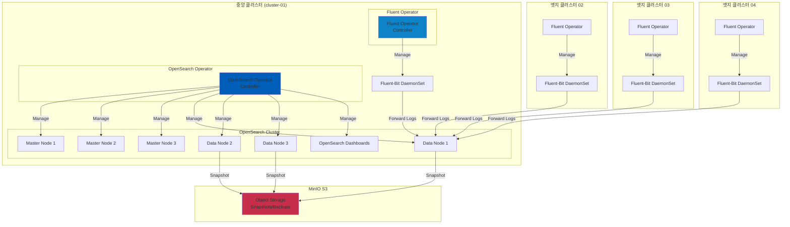
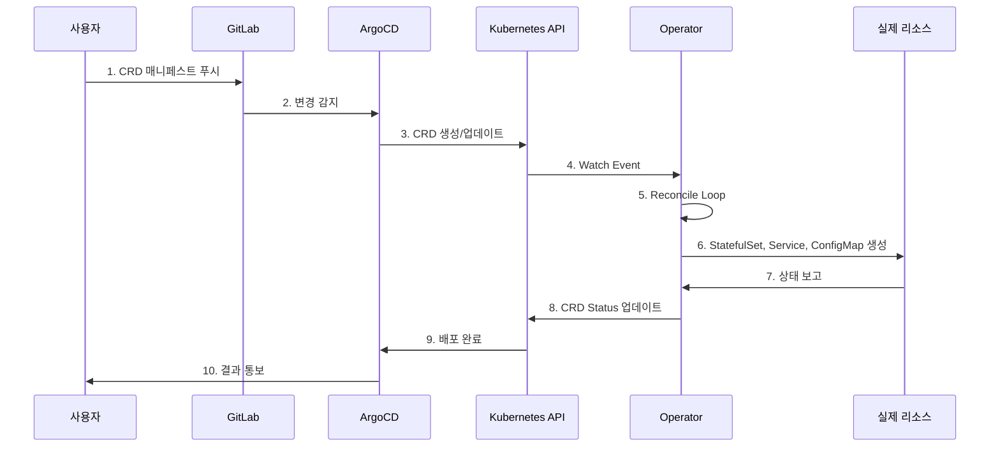

# Operator 기반 로깅 스택 배포 가이드

## 목차
1. [개요](#개요)
2. [아키텍처](#아키텍처)
3. [Operator 패턴이란](#operator-패턴이란)
4. [배포 구조](#배포-구조)
5. [배포 프로세스](#배포-프로세스)
6. [운영 가이드](#운영-가이드)
7. [트러블슈팅](#트러블슈팅)

---

## 개요

이 가이드는 **OpenSearch Operator**와 **Fluent Operator**를 사용하여 멀티클러스터 로깅 인프라를 배포하고 관리하는 방법을 설명합니다.

### 왜 Operator를 사용하는가?

**전통적인 방식**:
- Helm Chart로 OpenSearch, Fluent-Bit 직접 배포
- 설정 변경 시 Helm upgrade 필요
- 클러스터 확장/축소 수동 작업
- 백업/복구 스크립트 별도 관리

**Operator 방식**:
- Kubernetes Custom Resource로 선언적 관리
- Operator가 자동으로 리소스 생성/업데이트
- 자동 스케일링, 자동 복구
- 백업/복구 CRD로 관리

---

## 아키텍처

### 전체 로깅 아키텍처



### Operator 동작 방식



---

## Operator 패턴이란

### Kubernetes Operator

Operator는 Kubernetes 애플리케이션을 패키징, 배포, 관리하는 방법입니다.

**핵심 개념**:

1. **Custom Resource Definition (CRD)**
   - Kubernetes API 확장
   - 애플리케이션 전용 리소스 정의
   - 예: `OpenSearchCluster`, `FluentBit`, `ClusterOutput`

2. **Controller**
   - CRD를 감시(Watch)
   - 현재 상태를 원하는 상태로 조정(Reconcile)
   - 지속적으로 실행되는 컨트롤 루프

3. **Reconciliation Loop**
   ```
   while true:
     desired_state = read_custom_resource()
     current_state = read_actual_resources()
     if current_state != desired_state:
       take_action_to_match_desired_state()
     sleep(interval)
   ```

### OpenSearch Operator

**제공 CRD**:
- `OpenSearchCluster`: OpenSearch 클러스터 정의
- `OpenSearchRole`: 사용자 역할 정의
- `OpenSearchUser`: 사용자 계정
- `OpenSearchISMPolicy`: Index State Management 정책

**자동 관리 기능**:
- 노드 배포 (Master, Data, Ingest)
- TLS 인증서 자동 생성
- 롤링 업데이트
- 자동 복구
- 스케일 업/다운

### Fluent Operator

**제공 CRD**:
- `FluentBit`: Fluent-Bit DaemonSet 정의
- `ClusterInput`: 로그 입력 소스
- `ClusterFilter`: 로그 필터링 규칙
- `ClusterOutput`: 로그 출력 대상

**자동 관리 기능**:
- Fluent-Bit 설정 자동 생성
- 다중 입력/필터/출력 조합
- 동적 설정 리로드
- 네임스페이스별 격리

---

## 배포 구조

### 디렉토리 구조

```
deploy/
├── base/
│   ├── opensearch-operator/          # OpenSearch Operator Helm
│   │   ├── kustomization.yaml
│   │   ├── namespace.yaml
│   │   └── values.yaml
│   │
│   ├── opensearch-cluster/           # OpenSearch Cluster CRD
│   │   ├── kustomization.yaml
│   │   ├── namespace.yaml
│   │   ├── opensearch-cluster.yaml
│   │   ├── opensearch-dashboards.yaml
│   │   └── opensearch-service.yaml
│   │
│   ├── fluent-operator/              # Fluent Operator Helm
│   │   ├── kustomization.yaml
│   │   ├── namespace.yaml
│   │   └── values.yaml
│   │
│   └── fluentbit-cluster/            # Fluent-Bit CRD
│       ├── kustomization.yaml
│       ├── fluentbit.yaml
│       ├── clusterinput.yaml
│       ├── clusterfilter.yaml
│       └── clusteroutput.yaml
│
└── overlays/
    ├── cluster-01-central/
    │   ├── opensearch-operator/      # 중앙 클러스터 Operator
    │   ├── opensearch-cluster/       # OpenSearch 클러스터
    │   ├── fluent-operator/          # Fluent Operator
    │   └── fluentbit/                # Fluent-Bit (중앙 로그 수집)
    │
    ├── cluster-02-edge/
    │   ├── fluent-operator/          # Fluent Operator
    │   └── fluentbit/                # Fluent-Bit (엣지 로그 수집)
    │
    ├── cluster-03-edge/
    │   ├── fluent-operator/
    │   └── fluentbit/
    │
    └── cluster-04-edge/
        ├── fluent-operator/
        └── fluentbit/
```

### Base 매니페스트

#### OpenSearch Operator (Helm)

**`deploy/base/opensearch-operator/kustomization.yaml`**:
```yaml
apiVersion: kustomize.config.k8s.io/v1beta1
kind: Kustomization

helmCharts:
  - name: opensearch-operator
    repo: https://opensearch-project.github.io/opensearch-k8s-operator
    version: 2.6.0
    releaseName: opensearch-operator
    namespace: opensearch-operator-system
    valuesFile: values.yaml
    includeCRDs: true

resources:
  - namespace.yaml
```

**주요 설정**:
- Helm Chart 버전: 2.6.0
- CRD 자동 설치: `includeCRDs: true`
- Watch 모든 네임스페이스

#### OpenSearch Cluster (CRD)

**`deploy/base/opensearch-cluster/opensearch-cluster.yaml`**:
```yaml
apiVersion: opensearch.opster.io/v1
kind: OpenSearchCluster
metadata:
  name: opensearch-cluster
  namespace: logging
spec:
  general:
    serviceName: opensearch-cluster
    version: 2.11.0
    httpPort: 9200

  nodePools:
    - component: masters
      replicas: 3
      diskSize: 30Gi
      roles: [master, data]
      resources:
        requests: {memory: 2Gi, cpu: 500m}
        limits: {memory: 4Gi, cpu: 1000m}

    - component: data
      replicas: 3
      diskSize: 100Gi
      roles: [data, ingest]
      resources:
        requests: {memory: 4Gi, cpu: 1000m}
        limits: {memory: 8Gi, cpu: 2000m}

  security:
    tls:
      transport: {generate: true}
      http: {generate: true}
```

**노드 풀**:
- **Masters**: 3대 (HA 구성, 데이터 겸용)
- **Data**: 3대 (데이터 저장, Ingest 처리)

#### Fluent Operator (Helm)

**`deploy/base/fluent-operator/kustomization.yaml`**:
```yaml
helmCharts:
  - name: fluent-operator
    repo: https://fluent.github.io/helm-charts
    version: 3.3.0
    releaseName: fluent-operator
    namespace: fluent-operator-system
    valuesFile: values.yaml
    includeCRDs: true
```

#### Fluent-Bit (CRD)

**`deploy/base/fluentbit-cluster/fluentbit.yaml`**:
```yaml
apiVersion: fluentbit.fluent.io/v1alpha2
kind: FluentBit
metadata:
  name: fluent-bit
  namespace: logging
spec:
  image: kubesphere/fluent-bit:v3.1.4
  resources:
    requests: {cpu: 100m, memory: 128Mi}
    limits: {cpu: 500m, memory: 512Mi}
  tolerations:
    - operator: Exists  # 모든 노드에 배포
```

**`deploy/base/fluentbit-cluster/clusterinput.yaml`**:
```yaml
apiVersion: fluentbit.fluent.io/v1alpha2
kind: ClusterInput
metadata:
  name: tail
spec:
  tail:
    tag: kube.*
    path: /var/log/containers/*.log
    parser: docker
    refreshIntervalSeconds: 10
```

**`deploy/base/fluentbit-cluster/clusterfilter.yaml`**:
```yaml
apiVersion: fluentbit.fluent.io/v1alpha2
kind: ClusterFilter
metadata:
  name: kubernetes
spec:
  match: kube.*
  filters:
    - kubernetes:
        mergeLog: true
        keepLog: true
        k8sLoggingParser: true
```

**`deploy/base/fluentbit-cluster/clusteroutput.yaml`**:
```yaml
apiVersion: fluentbit.fluent.io/v1alpha2
kind: ClusterOutput
metadata:
  name: opensearch
spec:
  match: kube.*
  opensearch:
    host: opensearch-cluster.logging.svc.cluster.local
    port: 9200
    logstashFormat: true
    logstashPrefix: kubernetes
```

### Overlay 구성

#### 중앙 클러스터 (cluster-01)

**OpenSearch Cluster Patch**:
```yaml
# deploy/overlays/cluster-01-central/opensearch-cluster/opensearch-cluster-patch.yaml
spec:
  general:
    pluginsList:
      - repository-s3  # S3 스냅샷 플러그인

  bootstrap:
    additionalConfig:
      s3.client.default.endpoint: s3.minio.miribit.lab:9000
      s3.client.default.protocol: http

  nodePools:
    - component: masters
      persistence:
        storageClass: longhorn  # Longhorn 스토리지 사용

    - component: data
      persistence:
        storageClass: longhorn
```

**Ingress 설정**:
```yaml
# deploy/overlays/cluster-01-central/opensearch-cluster/ingress.yaml
---
apiVersion: networking.k8s.io/v1
kind: Ingress
metadata:
  name: opensearch-dashboards
  namespace: logging
spec:
  ingressClassName: nginx
  rules:
    - host: opensearch-dashboards.k8s-cluster-01.miribit.lab
      http:
        paths:
          - path: /
            pathType: Prefix
            backend:
              service:
                name: opensearch-cluster-dashboards
                port:
                  number: 5601
```

#### 엣지 클러스터 (cluster-02/03/04)

**ClusterOutput Patch**:
```yaml
# deploy/overlays/cluster-02-edge/fluentbit/clusteroutput-patch.yaml
spec:
  opensearch:
    host: opensearch-cluster.logging.svc.cluster-01.local  # 중앙 OpenSearch
    logstashPrefix: cluster-02-kubernetes  # 클러스터별 인덱스
```

---

## 배포 프로세스

### ArgoCD Application 배포 순서

| Wave | Application | 대상 클러스터 | 설명 |
|------|-------------|--------------|------|
| 1 | opensearch-operator-cluster-01 | cluster-01 | OpenSearch Operator 설치 |
| 1 | fluent-operator-cluster-01 | cluster-01 | Fluent Operator 설치 (중앙) |
| 1 | fluent-operator-cluster-02/03/04 | cluster-02/03/04 | Fluent Operator 설치 (엣지) |
| 3 | opensearch-cluster-cluster-01 | cluster-01 | OpenSearch 클러스터 생성 |
| 4 | fluentbit-cluster-01 | cluster-01 | Fluent-Bit 배포 (중앙) |
| 4 | fluentbit-cluster-02/03/04 | cluster-02/03/04 | Fluent-Bit 배포 (엣지) |

### 1. Operator 설치 (Wave 1)

```bash
# ArgoCD가 자동으로 배포 (Root Application sync 시)
argocd app sync root-application
```

**배포되는 리소스**:
- OpenSearch Operator Deployment
- Fluent Operator Deployment
- CRD (CustomResourceDefinition)
- RBAC (ServiceAccount, ClusterRole, ClusterRoleBinding)
- Webhook (Admission Controller)

**확인**:
```bash
# Operator 파드 확인
kubectl get pods -n opensearch-operator-system
kubectl get pods -n fluent-operator-system

# CRD 확인
kubectl get crd | grep opensearch
kubectl get crd | grep fluentbit
```

### 2. OpenSearch Cluster 생성 (Wave 3)

**ArgoCD가 OpenSearchCluster CRD 생성**:
```bash
# OpenSearch Operator가 감지하여 자동 생성:
# - StatefulSet (masters, data)
# - Service (headless, loadbalancer)
# - ConfigMap (opensearch.yml)
# - Secret (TLS certificates, admin credentials)
```

**배포 진행 확인**:
```bash
# OpenSearchCluster 상태
kubectl get opensearchcluster -n logging

# 생성되는 파드 확인
watch kubectl get pods -n logging

# 로그 확인
kubectl logs -n opensearch-operator-system deployment/opensearch-operator
```

**완료 조건**:
- 모든 Master 파드 Running (3/3)
- 모든 Data 파드 Running (3/3)
- OpenSearch Dashboards 파드 Running
- ClusterHealth: Green

### 3. Fluent-Bit 배포 (Wave 4)

**ArgoCD가 FluentBit CRD 생성**:
```bash
# Fluent Operator가 감지하여 자동 생성:
# - DaemonSet (모든 노드에 배포)
# - ConfigMap (fluent-bit.conf)
# - Service
```

**배포 진행 확인**:
```bash
# FluentBit 리소스 확인
kubectl get fluentbit -n logging
kubectl get clusterinput
kubectl get clusterfilter
kubectl get clusteroutput

# DaemonSet 확인
kubectl get daemonset -n logging

# 각 노드별 파드 확인
kubectl get pods -n logging -o wide
```

---

## 운영 가이드

### OpenSearch 클러스터 관리

#### 노드 스케일 업/다운

```yaml
# OpenSearchCluster 수정
spec:
  nodePools:
    - component: data
      replicas: 5  # 3 → 5로 증가
```

```bash
# Git에 커밋 및 푸시
git add deploy/overlays/cluster-01-central/opensearch-cluster/
git commit -m "scale: increase opensearch data nodes to 5"
git push origin main

# ArgoCD 자동 동기화 대기 또는 수동 동기화
argocd app sync opensearch-cluster-cluster-01
```

**Operator 동작**:
1. OpenSearchCluster 변경 감지
2. StatefulSet replicas 업데이트
3. 새 파드 생성 및 클러스터 조인
4. 데이터 리밸런싱 자동 수행

#### 리소스 제한 변경

```yaml
spec:
  nodePools:
    - component: data
      resources:
        requests:
          memory: 8Gi  # 4Gi → 8Gi
          cpu: 2000m   # 1000m → 2000m
```

**롤링 업데이트**:
- Operator가 하나씩 파드 재시작
- 다운타임 없이 업데이트

#### S3 스냅샷 설정

```bash
# S3 저장소 등록
curl -X PUT "opensearch.k8s-cluster-01.miribit.lab/_snapshot/s3_repository" \
  -H 'Content-Type: application/json' \
  -d '{
    "type": "s3",
    "settings": {
      "bucket": "opensearch-snapshots",
      "base_path": "cluster-01",
      "endpoint": "s3.minio.miribit.lab:9000",
      "protocol": "http"
    }
  }'

# 스냅샷 생성
curl -X PUT "opensearch.k8s-cluster-01.miribit.lab/_snapshot/s3_repository/snapshot_$(date +%Y%m%d)" \
  -H 'Content-Type: application/json' \
  -d '{
    "indices": "kubernetes-*",
    "ignore_unavailable": true,
    "include_global_state": false
  }'

# 스냅샷 목록
curl "opensearch.k8s-cluster-01.miribit.lab/_snapshot/s3_repository/_all"
```

### Fluent-Bit 관리

#### 로그 필터링 추가

```yaml
# 새 ClusterFilter 생성
---
apiVersion: fluentbit.fluent.io/v1alpha2
kind: ClusterFilter
metadata:
  name: exclude-system-logs
  labels:
    fluentbit.fluent.io/enabled: "true"
spec:
  match: kube.*
  filters:
    - grep:
        exclude: namespace kube-system
```

**적용**:
```bash
git add deploy/base/fluentbit-cluster/
git commit -m "feat: exclude kube-system logs"
git push origin main
```

**Operator 동작**:
1. ClusterFilter 변경 감지
2. Fluent-Bit ConfigMap 재생성
3. Fluent-Bit DaemonSet 리로드 (다운타임 없음)

#### 출력 대상 추가 (멀티 출력)

```yaml
# Elasticsearch 출력 추가
---
apiVersion: fluentbit.fluent.io/v1alpha2
kind: ClusterOutput
metadata:
  name: elasticsearch
spec:
  match: kube.*
  elasticsearch:
    host: elasticsearch.logging.svc.cluster.local
    port: 9200
    logstashFormat: true
```

**결과**:
- OpenSearch와 Elasticsearch에 동시 전송
- 각 출력별 독립적인 버퍼링

#### 로그 파싱 규칙 추가

```yaml
---
apiVersion: fluentbit.fluent.io/v1alpha2
kind: ClusterParser
metadata:
  name: nginx
spec:
  regex:
    regex: '^(?<remote>[^ ]*) (?<host>[^ ]*) (?<user>[^ ]*) \[(?<time>[^\]]*)\] "(?<method>\S+)(?: +(?<path>[^\"]*?)(?: +\S*)?)?" (?<code>[^ ]*) (?<size>[^ ]*)(?: "(?<referer>[^\"]*)" "(?<agent>[^\"]*)")?$'
    timeKey: time
    timeFormat: "%d/%b/%Y:%H:%M:%S %z"
```

### 인덱스 관리

#### Index Template 설정

```bash
curl -X PUT "opensearch.k8s-cluster-01.miribit.lab/_index_template/kubernetes_template" \
  -H 'Content-Type: application/json' \
  -d '{
    "index_patterns": ["kubernetes-*"],
    "template": {
      "settings": {
        "number_of_shards": 3,
        "number_of_replicas": 1,
        "refresh_interval": "30s"
      },
      "mappings": {
        "properties": {
          "@timestamp": {"type": "date"},
          "namespace": {"type": "keyword"},
          "pod": {"type": "keyword"},
          "container": {"type": "keyword"},
          "log": {"type": "text"}
        }
      }
    }
  }'
```

#### ISM Policy (Index State Management)

```bash
curl -X PUT "opensearch.k8s-cluster-01.miribit.lab/_plugins/_ism/policies/kubernetes_policy" \
  -H 'Content-Type: application/json' \
  -d '{
    "policy": {
      "description": "Kubernetes logs retention policy",
      "default_state": "hot",
      "states": [
        {
          "name": "hot",
          "actions": [],
          "transitions": [
            {
              "state_name": "warm",
              "conditions": {
                "min_index_age": "7d"
              }
            }
          ]
        },
        {
          "name": "warm",
          "actions": [
            {
              "replica_count": {
                "number_of_replicas": 0
              }
            }
          ],
          "transitions": [
            {
              "state_name": "delete",
              "conditions": {
                "min_index_age": "30d"
              }
            }
          ]
        },
        {
          "name": "delete",
          "actions": [
            {
              "delete": {}
            }
          ]
        }
      ]
    }
  }'
```

**정책 설명**:
- **Hot (0-7일)**: 최신 데이터, 쓰기/읽기 최적화
- **Warm (7-30일)**: Replica 0으로 축소, 읽기 전용
- **Delete (30일 이후)**: 인덱스 삭제

---

## 트러블슈팅

### OpenSearch 관련

#### 1. OpenSearchCluster가 생성되지 않음

**증상**:
```bash
kubectl get opensearchcluster -n logging
# Status: Pending
```

**원인 및 해결**:

**A. Operator 파드 미실행**:
```bash
# Operator 상태 확인
kubectl get pods -n opensearch-operator-system

# 로그 확인
kubectl logs -n opensearch-operator-system deployment/opensearch-operator

# 재시작
kubectl rollout restart deployment/opensearch-operator -n opensearch-operator-system
```

**B. CRD 미설치**:
```bash
# CRD 확인
kubectl get crd opensearchclusters.opensearch.opster.io

# 없으면 수동 설치
kubectl apply -f https://raw.githubusercontent.com/opensearch-project/opensearch-k8s-operator/main/config/crd/bases/opensearch.opster.io_opensearchclusters.yaml
```

**C. 리소스 부족**:
```bash
# 노드 리소스 확인
kubectl top nodes

# 요청 리소스 확인
kubectl describe opensearchcluster opensearch-cluster -n logging

# 리소스 요청 축소
spec:
  nodePools:
    - component: masters
      resources:
        requests:
          memory: 1Gi  # 2Gi → 1Gi로 감소
```

#### 2. OpenSearch 파드가 CrashLoopBackOff

**증상**:
```bash
kubectl get pods -n logging
# opensearch-cluster-masters-0  0/1  CrashLoopBackOff
```

**원인 및 해결**:

**A. 메모리 부족 (OOMKilled)**:
```bash
# 파드 로그 확인
kubectl logs opensearch-cluster-masters-0 -n logging

# 이전 로그 확인
kubectl logs opensearch-cluster-masters-0 -n logging --previous

# JVM Heap 크기 조정
spec:
  nodePools:
    - component: masters
      jvm: -Xmx1g -Xms1g  # 기본값에서 축소
```

**B. 디스크 공간 부족**:
```bash
# PVC 확인
kubectl get pvc -n logging

# PVC 크기 증가 (Longhorn 지원)
kubectl edit pvc opensearch-cluster-masters-opensearch-cluster-masters-0 -n logging
# spec.resources.requests.storage: 30Gi → 50Gi
```

**C. TLS 인증서 오류**:
```bash
# Secret 확인
kubectl get secret -n logging | grep tls

# Secret 재생성
kubectl delete secret opensearch-cluster-transport-cert -n logging
kubectl delete secret opensearch-cluster-http-cert -n logging

# Operator가 자동 재생성
kubectl rollout restart statefulset/opensearch-cluster-masters -n logging
```

#### 3. OpenSearch 클러스터 상태 Yellow/Red

**증상**:
```bash
curl -u admin:admin123 "opensearch.k8s-cluster-01.miribit.lab/_cluster/health"
# {"status":"yellow","number_of_nodes":3,"unassigned_shards":10}
```

**원인 및 해결**:

**A. Replica 샤드 미할당**:
```bash
# 미할당 샤드 확인
curl -u admin:admin123 "opensearch.k8s-cluster-01.miribit.lab/_cat/shards?v" | grep UNASSIGNED

# Replica 수 감소 (노드 수보다 많은 경우)
curl -X PUT "opensearch.k8s-cluster-01.miribit.lab/kubernetes-*/_settings" \
  -H 'Content-Type: application/json' \
  -u admin:admin123 \
  -d '{"index": {"number_of_replicas": 1}}'
```

**B. 디스크 watermark 초과**:
```bash
# 디스크 사용량 확인
curl -u admin:admin123 "opensearch.k8s-cluster-01.miribit.lab/_cat/allocation?v"

# Watermark 임시 조정
curl -X PUT "opensearch.k8s-cluster-01.miribit.lab/_cluster/settings" \
  -H 'Content-Type: application/json' \
  -u admin:admin123 \
  -d '{
    "transient": {
      "cluster.routing.allocation.disk.watermark.low": "90%",
      "cluster.routing.allocation.disk.watermark.high": "95%"
    }
  }'

# 오래된 인덱스 삭제
curl -X DELETE "opensearch.k8s-cluster-01.miribit.lab/kubernetes-2024.01.*" -u admin:admin123
```

### Fluent-Bit 관련

#### 1. Fluent-Bit 파드가 시작되지 않음

**증상**:
```bash
kubectl get pods -n logging
# fluent-bit-xxxxx  0/1  Init:0/1
```

**원인 및 해결**:

**A. Fluent Operator 미실행**:
```bash
# Operator 확인
kubectl get pods -n fluent-operator-system

# 로그 확인
kubectl logs -n fluent-operator-system deployment/fluent-operator
```

**B. ClusterInput/Output 없음**:
```bash
# CRD 리소스 확인
kubectl get clusterinput
kubectl get clusteroutput

# 없으면 Base 매니페스트 재배포
argocd app sync fluentbit-cluster-01
```

#### 2. 로그가 OpenSearch에 전송되지 않음

**증상**:
```bash
# OpenSearch에 인덱스 없음
curl -u admin:admin123 "opensearch.k8s-cluster-01.miribit.lab/_cat/indices?v"
# (kubernetes-* 인덱스 없음)
```

**원인 및 해결**:

**A. OpenSearch 연결 실패**:
```bash
# Fluent-Bit 로그 확인
kubectl logs -n logging daemonset/fluent-bit

# 에러 예시:
# [error] [output:opensearch:opensearch.0] HTTP status=401 URI=/_bulk

# 자격증명 Secret 확인
kubectl get secret opensearch-admin-credentials -n logging -o yaml

# Secret 재생성
kubectl delete secret opensearch-admin-credentials -n logging
kubectl create secret generic opensearch-admin-credentials -n logging \
  --from-literal=username=admin \
  --from-literal=password=admin123
```

**B. 네트워크 연결 문제 (엣지 → 중앙)**:
```bash
# 엣지 클러스터에서 연결 테스트
kubectl run -it --rm debug --image=curlimages/curl --restart=Never -- \
  curl -u admin:admin123 http://opensearch-cluster.logging.svc.cluster-01.local:9200

# DNS 해결 실패 시 CoreDNS 설정 확인
kubectl get configmap coredns -n kube-system -o yaml
```

**C. ClusterOutput 설정 오류**:
```bash
# ClusterOutput 확인
kubectl get clusteroutput opensearch -o yaml

# Host 주소 확인
spec:
  opensearch:
    host: opensearch-cluster.logging.svc.cluster.local  # 중앙 클러스터
    # 또는
    host: opensearch-cluster.logging.svc.cluster-01.local  # 엣지에서 중앙으로
```

#### 3. 로그 파싱 실패

**증상**:
```bash
# OpenSearch에서 로그 확인
# "log" 필드가 JSON 문자열 그대로 저장됨
```

**해결**:
```yaml
# ClusterFilter에 JSON 파서 추가
---
apiVersion: fluentbit.fluent.io/v1alpha2
kind: ClusterFilter
metadata:
  name: json-parser
spec:
  match: kube.*
  filters:
    - parser:
        keyName: log
        parser: json
        reserveData: true
```

### ArgoCD 동기화 관련

#### 1. Application이 OutOfSync 상태 유지

**증상**:
```bash
argocd app get opensearch-cluster-cluster-01
# Sync Status: OutOfSync
```

**원인**:
- Operator가 생성한 리소스와 Git 매니페스트 차이

**해결**:
```yaml
# ArgoCD Application에 ignoreDifferences 추가
spec:
  ignoreDifferences:
    - group: opensearch.opster.io
      kind: OpenSearchCluster
      jsonPointers:
        - /spec/nodePools/*/resources  # Operator가 동적으로 조정
        - /status  # Status 필드 무시
```

#### 2. Helm Chart 렌더링 실패

**증상**:
```bash
argocd app get opensearch-operator-cluster-01
# Error: failed to render helm chart
```

**해결**:
```bash
# 로컬에서 테스트
cd deploy/overlays/cluster-01-central/opensearch-operator
kustomize build . --enable-helm

# Helm repo 업데이트
helm repo add opensearch https://opensearch-project.github.io/opensearch-k8s-operator
helm repo update

# Chart 버전 확인
helm search repo opensearch/opensearch-operator --versions
```

---

## 요약

### Operator 기반 배포의 장점

✅ **선언적 관리**
- CRD로 원하는 상태 정의
- Operator가 자동으로 조정

✅ **자동화**
- 스케일링, 업데이트, 백업 자동화
- 수동 작업 최소화

✅ **일관성**
- 모든 클러스터에 동일한 방식 적용
- 설정 드리프트 방지

✅ **확장성**
- 새 클러스터 추가 간단
- CRD만 복사하면 자동 배포

### 주요 CRD

| CRD | 용도 | 관리 대상 |
|-----|------|----------|
| OpenSearchCluster | OpenSearch 클러스터 정의 | StatefulSet, Service, ConfigMap |
| FluentBit | Fluent-Bit 배포 | DaemonSet, ConfigMap |
| ClusterInput | 로그 입력 소스 | Fluent-Bit Input 설정 |
| ClusterFilter | 로그 필터링 | Fluent-Bit Filter 설정 |
| ClusterOutput | 로그 출력 대상 | Fluent-Bit Output 설정 |

### 배포 완료 후

```bash
# OpenSearch 클러스터 상태
curl -u admin:admin123 "opensearch.k8s-cluster-01.miribit.lab/_cluster/health?pretty"

# 인덱스 목록
curl -u admin:admin123 "opensearch.k8s-cluster-01.miribit.lab/_cat/indices?v"

# OpenSearch Dashboards 접속
open http://opensearch-dashboards.k8s-cluster-01.miribit.lab

# Fluent-Bit 상태
kubectl get fluentbit -n logging
kubectl get pods -n logging -l app.kubernetes.io/name=fluent-bit
```

이제 Operator 기반 로깅 스택이 완전히 배포되었습니다! 🎉
