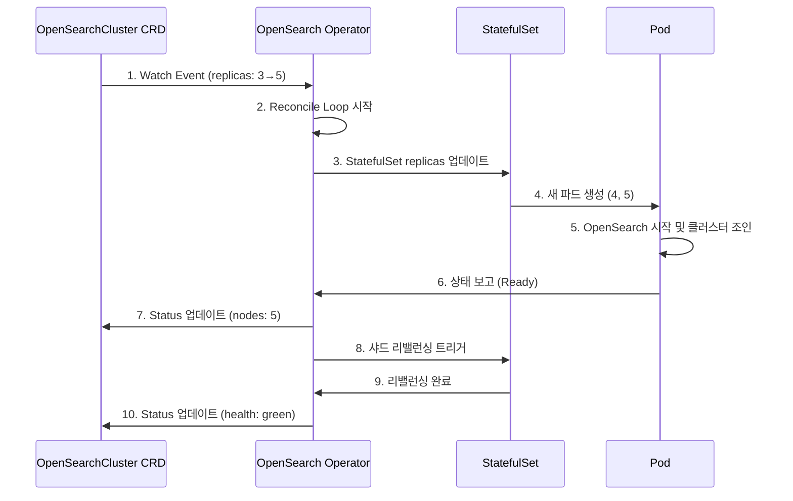

# Operator 기반 배포 구성 요약

## 완료된 작업

OpenSearch Operator와 Fluent Operator를 사용한 멀티클러스터 로깅 인프라 구성이 완료되었습니다.

---

## 생성된 리소스

### 1. Base 매니페스트

#### OpenSearch Operator
- **위치**: `deploy/base/opensearch-operator/`
- **구성**: Helm Chart (v2.6.0) + Kustomize
- **기능**: OpenSearchCluster CRD 관리

#### OpenSearch Cluster
- **위치**: `deploy/base/opensearch-cluster/`
- **구성**: OpenSearchCluster CRD
- **노드 풀**:
  - Masters: 3 replicas (master, data roles)
  - Data: 3 replicas (data, ingest roles)
- **보안**: TLS 자동 생성, Admin 자격증명

#### Fluent Operator
- **위치**: `deploy/base/fluent-operator/`
- **구성**: Helm Chart (v3.3.0) + Kustomize
- **기능**: FluentBit CRD 관리

#### Fluent-Bit Cluster
- **위치**: `deploy/base/fluentbit-cluster/`
- **구성**: FluentBit, ClusterInput, ClusterFilter, ClusterOutput CRD
- **기능**:
  - Input: Container logs (`/var/log/containers/*.log`)
  - Filter: Kubernetes metadata enrichment
  - Output: OpenSearch (logstash format)

### 2. Cluster Overlays

#### Cluster-01 (중앙)
```
deploy/overlays/cluster-01-central/
├── opensearch-operator/
│   ├── kustomization.yaml
│   └── operator-patch.yaml
├── opensearch-cluster/
│   ├── kustomization.yaml
│   ├── opensearch-cluster-patch.yaml
│   ├── ingress.yaml
│   └── s3-snapshot-secret.yaml
├── fluent-operator/
│   └── kustomization.yaml
└── fluentbit/
    ├── kustomization.yaml
    └── clusteroutput-patch.yaml
```

**특징**:
- OpenSearch 클러스터 배포 (Masters 3, Data 3)
- S3 스냅샷 플러그인 활성화
- Ingress 설정 (Dashboards, API)
- Longhorn 스토리지 사용

#### Cluster-02/03/04 (엣지)
```
deploy/overlays/cluster-0X-edge/
├── fluent-operator/
│   └── kustomization.yaml
└── fluentbit/
    ├── kustomization.yaml
    ├── namespace.yaml
    └── clusteroutput-patch.yaml
```

**특징**:
- Fluent Operator만 배포
- 중앙 OpenSearch로 로그 전송
- 클러스터별 인덱스 prefix (cluster-02-kubernetes, ...)

### 3. ArgoCD Applications

| Application | Cluster | Wave | 설명 |
|-------------|---------|------|------|
| opensearch-operator-cluster-01 | cluster-01 | 1 | OpenSearch Operator 설치 |
| fluent-operator-cluster-01 | cluster-01 | 1 | Fluent Operator 설치 |
| fluent-operator-cluster-02/03/04 | edge | 1 | Fluent Operator 설치 (엣지) |
| opensearch-cluster-cluster-01 | cluster-01 | 3 | OpenSearch 클러스터 생성 |
| fluentbit-cluster-01 | cluster-01 | 4 | Fluent-Bit 배포 (중앙) |
| fluentbit-cluster-02/03/04 | edge | 4 | Fluent-Bit 배포 (엣지) |

---

## 아키텍처 특징

### Operator 패턴


### 멀티클러스터 로깅 흐름

```
┌─────────────────────────────────────────────────────────────┐
│                    Cluster-01 (Central)                      │
│  ┌──────────────────────────────────────────────────────┐   │
│  │ OpenSearch Operator                                  │   │
│  │  ↓ manages                                           │   │
│  │ OpenSearch Cluster                                   │   │
│  │  - Masters: 3 (HA)                                   │   │
│  │  - Data: 3 (Sharded)                                 │   │
│  │  - Dashboards: 1                                     │   │
│  └──────────────────────────────────────────────────────┘   │
│                                                               │
│  ┌──────────────────────────────────────────────────────┐   │
│  │ Fluent Operator → Fluent-Bit DaemonSet              │   │
│  └────────────────┬─────────────────────────────────────┘   │
└─────────────────│─────────────────────────────────────────┘
                   │ Logs
                   ↓
┌────────────────────────────────────────────────────────────┐
│                 Cluster-02/03/04 (Edge)                     │
│  ┌──────────────────────────────────────────────────────┐  │
│  │ Fluent Operator → Fluent-Bit DaemonSet              │  │
│  └────────────────┬─────────────────────────────────────┘  │
└─────────────────│──────────────────────────────────────────┘
                   │ Logs
                   ↓
        OpenSearch Cluster (cluster-01)
              ↓
        MinIO S3 (Snapshots)
```

### CRD 리소스 구조

#### OpenSearchCluster
```yaml
apiVersion: opensearch.opster.io/v1
kind: OpenSearchCluster
metadata:
  name: opensearch-cluster
spec:
  nodePools:
    - component: masters
      replicas: 3
      roles: [master, data]
    - component: data
      replicas: 3
      roles: [data, ingest]
  security:
    tls:
      transport: {generate: true}
      http: {generate: true}
```

#### FluentBit + ClusterInput/Filter/Output
```yaml
apiVersion: fluentbit.fluent.io/v1alpha2
kind: FluentBit
metadata:
  name: fluent-bit
spec:
  image: kubesphere/fluent-bit:v3.1.4
---
apiVersion: fluentbit.fluent.io/v1alpha2
kind: ClusterInput
metadata:
  name: tail
spec:
  tail:
    path: /var/log/containers/*.log
---
apiVersion: fluentbit.fluent.io/v1alpha2
kind: ClusterFilter
metadata:
  name: kubernetes
spec:
  filters:
    - kubernetes: {}
---
apiVersion: fluentbit.fluent.io/v1alpha2
kind: ClusterOutput
metadata:
  name: opensearch
spec:
  opensearch:
    host: opensearch-cluster.logging.svc.cluster.local
    port: 9200
```

---

## 배포 프로세스

### 1. GitOps 배포 흐름

```bash
# 1. 코드 변경 (CRD 매니페스트 수정)
vim deploy/overlays/cluster-01-central/opensearch-cluster/opensearch-cluster-patch.yaml

# 2. Git 커밋 및 푸시
git add .
git commit -m "feat: scale opensearch data nodes to 5"
git push origin main

# 3. ArgoCD 자동 동기화 (또는 수동)
argocd app sync opensearch-cluster-cluster-01

# 4. Operator가 변경 감지 및 Reconcile
# - StatefulSet replicas 업데이트
# - 새 파드 생성
# - 클러스터 재조인

# 5. 배포 완료
kubectl get opensearchcluster -n logging
```

### 2. Sync Wave 순서

| Wave | 작업 | 시간 | 설명 |
|------|------|------|------|
| 0 | Namespace, CRD | 즉시 | 기본 리소스 |
| 1 | Operators | ~2분 | OpenSearch/Fluent Operator 배포 |
| 2 | - | - | (사용 안 함) |
| 3 | OpenSearch Cluster | ~5분 | Operator가 StatefulSet 생성 |
| 4 | Fluent-Bit | ~1분 | Operator가 DaemonSet 생성 |
| 5 | - | - | (사용 안 함) |

**총 배포 시간**: 약 10분

### 3. Operator Reconcile 동작



---

## 운영 시나리오

### 시나리오 1: OpenSearch 노드 증설

**요구사항**: Data 노드를 3개에서 5개로 증설

```yaml
# deploy/overlays/cluster-01-central/opensearch-cluster/opensearch-cluster-patch.yaml
spec:
  nodePools:
    - component: data
      replicas: 5  # 3 → 5
```

```bash
git add .
git commit -m "scale: increase opensearch data nodes to 5"
git push origin main

# ArgoCD 자동 동기화 또는
argocd app sync opensearch-cluster-cluster-01

# 배포 확인
kubectl get pods -n logging -l opensearch.cluster.component=data
# NAME                               READY   STATUS    AGE
# opensearch-cluster-data-0          1/1     Running   10m
# opensearch-cluster-data-1          1/1     Running   10m
# opensearch-cluster-data-2          1/1     Running   10m
# opensearch-cluster-data-3          1/1     Running   2m
# opensearch-cluster-data-4          1/1     Running   1m
```

**Operator 자동 처리**:
1. StatefulSet replicas 5로 업데이트
2. 새 파드 2개 생성
3. OpenSearch 클러스터에 자동 조인
4. 샤드 재분배 (자동)

### 시나리오 2: 로그 필터링 규칙 추가

**요구사항**: kube-system 네임스페이스 로그 제외

```yaml
# deploy/base/fluentbit-cluster/clusterfilter-exclude.yaml
---
apiVersion: fluentbit.fluent.io/v1alpha2
kind: ClusterFilter
metadata:
  name: exclude-system
  labels:
    fluentbit.fluent.io/enabled: "true"
spec:
  match: kube.*
  filters:
    - grep:
        exclude: namespace kube-system
```

```bash
git add deploy/base/fluentbit-cluster/clusterfilter-exclude.yaml
git commit -m "feat: exclude kube-system logs"
git push origin main

# ArgoCD 자동 동기화
```

**Operator 자동 처리**:
1. ClusterFilter 변경 감지
2. Fluent-Bit ConfigMap 재생성
3. Fluent-Bit 파드 설정 리로드 (재시작 없음)

### 시나리오 3: 새 엣지 클러스터 추가

**요구사항**: cluster-05 (192.168.101.199) 추가

```bash
# 1. Overlay 디렉토리 복사
cp -r deploy/overlays/cluster-02-edge deploy/overlays/cluster-05-edge

# 2. ClusterOutput 수정
vim deploy/overlays/cluster-05-edge/fluentbit/clusteroutput-patch.yaml
# logstashPrefix: cluster-05-kubernetes

# 3. ArgoCD Application 생성
cp argocd/applications/cluster-02/fluent-operator.yaml \
   argocd/applications/cluster-05/fluent-operator.yaml

# destination.server: https://192.168.101.199:6443 로 수정

# 4. Git 푸시
git add .
git commit -m "feat: add cluster-05"
git push origin main

# ArgoCD가 자동으로 cluster-05에 Fluent Operator + Fluent-Bit 배포
```

---

## 리소스 사용량

### OpenSearch Cluster (cluster-01)

| Component | Replicas | CPU Request | Memory Request | Storage |
|-----------|----------|-------------|----------------|---------|
| Masters | 3 | 500m × 3 = 1.5 CPU | 2Gi × 3 = 6Gi | 30Gi × 3 = 90Gi |
| Data | 3 | 1000m × 3 = 3 CPU | 4Gi × 3 = 12Gi | 100Gi × 3 = 300Gi |
| Dashboards | 1 | 200m | 512Mi | - |
| **Total** | **7** | **4.7 CPU** | **18.5Gi** | **390Gi** |

### Fluent-Bit (모든 클러스터)

| Component | Type | CPU Request | Memory Request |
|-----------|------|-------------|----------------|
| Fluent-Bit | DaemonSet | 100m per node | 128Mi per node |

**4개 클러스터, 노드당 평균**:
- 노드 수: 4 (각 클러스터 1노드)
- 총 CPU: 400m
- 총 Memory: 512Mi

### Operators

| Operator | CPU Request | Memory Request |
|----------|-------------|----------------|
| OpenSearch Operator | 100m | 128Mi |
| Fluent Operator (4개 클러스터) | 400m | 512Mi |
| **Total** | **500m** | **640Mi** |

### 전체 리소스 요약

| 구분 | CPU | Memory | Storage |
|------|-----|--------|---------|
| OpenSearch | 4.7 CPU | 18.5Gi | 390Gi |
| Fluent-Bit | 400m | 512Mi | - |
| Operators | 500m | 640Mi | - |
| **총합** | **~6 CPU** | **~20Gi** | **390Gi** |

---

## 모니터링 및 관리

### 주요 확인 명령어

```bash
# Operator 상태
kubectl get pods -n opensearch-operator-system
kubectl get pods -n fluent-operator-system

# OpenSearch Cluster 상태
kubectl get opensearchcluster -n logging
kubectl get pods -n logging -l app.kubernetes.io/component=opensearch-cluster

# Fluent-Bit 상태
kubectl get fluentbit -n logging
kubectl get pods -n logging -l app.kubernetes.io/name=fluent-bit

# CRD 리소스
kubectl get clusterinput
kubectl get clusterfilter
kubectl get clusteroutput

# OpenSearch 클러스터 헬스
curl -u admin:admin123 "opensearch.k8s-cluster-01.miribit.lab/_cluster/health?pretty"

# 인덱스 목록
curl -u admin:admin123 "opensearch.k8s-cluster-01.miribit.lab/_cat/indices?v"

# 샤드 할당
curl -u admin:admin123 "opensearch.k8s-cluster-01.miribit.lab/_cat/shards?v"
```

### Grafana 대시보드 메트릭

**OpenSearch 메트릭**:
- `opensearch_cluster_health_status`
- `opensearch_jvm_memory_used_bytes`
- `opensearch_indices_docs_count`
- `opensearch_indices_store_size_bytes`

**Fluent-Bit 메트릭**:
- `fluentbit_output_proc_records_total`
- `fluentbit_output_errors_total`
- `fluentbit_output_retries_total`

---

## 다음 단계

### 권장 개선사항

1. **Index Lifecycle Management (ILM)**
   - ISM Policy 설정
   - Hot-Warm-Cold 아키텍처
   - 자동 인덱스 롤오버

2. **Alerting 설정**
   - OpenSearch Alerting 플러그인
   - Slack/Email 알림
   - 로그 기반 알림 규칙

3. **보안 강화**
   - RBAC (Role-Based Access Control)
   - OpenSearch Security 플러그인
   - Audit Logging

4. **백업 자동화**
   - S3 스냅샷 정책
   - Scheduled Snapshot
   - 재해 복구 계획

5. **성능 최적화**
   - Shard 크기 최적화
   - Index Template 튜닝
   - Query 캐싱

---

## 참고 문서

- [OPERATOR_DEPLOYMENT_GUIDE.md](./OPERATOR_DEPLOYMENT_GUIDE.md) - Operator 배포 상세 가이드
- [GITOPS_DEPLOYMENT_GUIDE.md](./GITOPS_DEPLOYMENT_GUIDE.md) - GitOps 배포 가이드
- [OpenSearch Operator 공식 문서](https://github.com/opensearch-project/opensearch-k8s-operator)
- [Fluent Operator 공식 문서](https://github.com/fluent/fluent-operator)

---

## 요약

✅ **완료된 구성**:
- OpenSearch Operator + Fluent Operator 기반 로깅 인프라
- 멀티클러스터 로그 수집 (4개 클러스터)
- GitOps 자동 배포 (ArgoCD)
- Kustomize + Helm 하이브리드 구성

✅ **주요 특징**:
- CRD 기반 선언적 관리
- Operator 자동 Reconcile
- 클러스터별 격리된 인덱스
- S3 스냅샷 지원

✅ **배포 준비 완료**:
- Base 매니페스트
- 클러스터별 Overlay
- ArgoCD Application
- 운영 문서

🚀 Git Push만으로 전체 로깅 인프라 자동 배포 가능!
