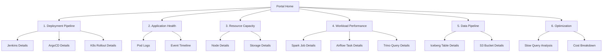

# DataOps 플랫폼 End-to-End 모니터링 시스템 설계서

**프로젝트명**: DataOps E2E Observability Platform
**버전**: v4.0 (파스텔톤 고도화)
**작성일**: 2025-01-07
**작성자**: SRE Team, Platform Engineering Team, Data Engineering Team

---

## 📋 목차

1. [프로젝트 개요](#프로젝트-개요)
2. [전문가 회의록](#전문가-회의록)
3. [대시보드 아키텍처](#대시보드-아키텍처)
4. [색상 디자인 시스템](#색상-디자인-시스템)
5. [대시보드 상세 스펙](#대시보드-상세-스펙)
6. [PromQL 표준](#promql-표준)
7. [구현 로드맵](#구현-로드맵)

---

## 📌 프로젝트 개요

### 비즈니스 목표

베어메탈 Kubernetes 위에서 동작하는 복잡한 빅데이터 플랫폼(Spark, Airflow, Trino, Iceberg, S3)의 **전체 생명주기**를 End-to-End로 모니터링하여:

1. **배포 자동화**: GitOps (Bitbucket → Jenkins → ArgoCD → K8s)
2. **배포 검증**: 애플리케이션이 정상적으로 배포되었는지 확인
3. **자원 가용성**: CPU, RAM, Storage 가용량 모니터링
4. **워크로드 실행**: Spark/Trino/Airflow 작업 분산 실행 모니터링
5. **성능 최적화**: 병목 지점 파악 및 오류 대응
6. **End-to-End 추적**: 배포부터 데이터 처리까지 전 구간 시각화

### 기술 스택

```
┌─────────────────────────────────────────────────────────────┐
│                    GitOps Deployment                        │
│  Bitbucket (Git) → Jenkins (CI) → ArgoCD (CD) → K8s        │
└─────────────────────────────────────────────────────────────┘
                              ↓
┌─────────────────────────────────────────────────────────────┐
│                  BigData Workloads                          │
│  Spark Jobs ──┐                                             │
│  Airflow DAGs ├─→ Iceberg Tables → MinIO S3               │
│  Trino Queries┘                                             │
└─────────────────────────────────────────────────────────────┘
                              ↓
┌─────────────────────────────────────────────────────────────┐
│                  Storage Backend                            │
│  • Hive Metastore (메타데이터)                              │
│  • Oracle (트랜잭션 DB)                                     │
│  • PVC: Isilon/Ceph (공유 스토리지)                        │
│  • MinIO S3 (오브젝트 스토리지)                            │
└─────────────────────────────────────────────────────────────┘
```

### 복잡도 요소

- **다중 스토리지**: Isilon, Ceph, S3, Oracle, Hive Metastore
- **다양한 워크로드**: Batch(Spark), Streaming(Kafka), Query(Trino), Orchestration(Airflow)
- **분산 환경**: Multi-cluster Kubernetes (Central + Edge)
- **GitOps 파이프라인**: 3단계 배포 프로세스
- **데이터 레이크하우스**: Iceberg format + S3 storage

---

## 👥 전문가 회의록

### 참석자

1. **SRE 전문가** (Site Reliability Engineering)
   - 역할: 시스템 안정성, SLO/SLI, 알림 정책
   - 관심사: Uptime, MTTR, Error Budget

2. **플랫폼 엔지니어** (Platform Engineering)
   - 역할: Kubernetes 인프라, 네트워크, 스토리지
   - 관심사: 자원 가용성, 클러스터 헬스, 배포 자동화

3. **데이터 엔지니어** (Data Engineering)
   - 역할: 빅데이터 워크로드, 파이프라인 최적화
   - 관심사: Job 성공률, 처리 시간, 데이터 품질

4. **DevOps 엔지니어** (DevOps)
   - 역할: CI/CD, GitOps, 배포 자동화
   - 관심사: 빌드 성공률, 배포 속도, 롤백 메커니즘

### 회의 결론

#### 1️⃣ 대시보드 구조 (Drill-down 방식)

```
Portal (Home)
  ├─ 1. Deployment Pipeline       ← DevOps 관점
  │    ├─ Jenkins Build Status
  │    ├─ ArgoCD Sync Status
  │    └─ K8s Rollout Status
  │
  ├─ 2. Application Health        ← SRE 관점
  │    ├─ Pod Status
  │    ├─ Service Endpoints
  │    └─ Health Checks
  │
  ├─ 3. Resource Capacity         ← Platform 관점
  │    ├─ CPU/RAM Usage
  │    ├─ Storage IOPS
  │    └─ Network Bandwidth
  │
  ├─ 4. Workload Performance      ← Data Engineer 관점
  │    ├─ Spark Job Metrics
  │    ├─ Airflow DAG Runs
  │    └─ Trino Query Performance
  │
  ├─ 5. Data Pipeline             ← Data Engineer 관점
  │    ├─ Iceberg Table Stats
  │    ├─ S3 Object Metrics
  │    └─ Hive Metastore
  │
  └─ 6. Optimization & Troubleshooting  ← 전체 팀
       ├─ Performance Bottlenecks
       ├─ Error Analysis
       └─ Cost Analysis
```

#### 2️⃣ 색상 디자인 원칙

**SRE 전문가 의견:**
> "24시간 NOC 환경에서 장시간 보기 위해 눈이 편안한 파스텔톤이 필요합니다.
> 고채도 원색은 피로를 유발하고, 임계값 색상(녹/황/적)은 명확해야 합니다."

**플랫폼 엔지니어 의견:**
> "인프라 계층과 애플리케이션 계층을 색상으로 구분해야 합니다.
> 물리 자원(서버/네트워크/스토리지)은 차가운 톤,
> 애플리케이션은 따뜻한 톤으로 구분하면 직관적입니다."

**데이터 엔지니어 의견:**
> "데이터 흐름을 색상 그라데이션으로 표현하면 좋겠습니다.
> 예: 데이터 수집(파란색) → 처리(보라색) → 저장(초록색)"

#### 3️⃣ 메트릭 우선순위

**Critical Metrics (빨간불 알림):**
- Deployment Failure Rate > 10%
- Pod CrashLoopBackOff
- CPU/Memory OOM
- Spark Job Failure Rate > 5%
- S3 Write Failure

**Warning Metrics (노란불 주의):**
- Build Duration > 10분
- Sync Delay > 5분
- CPU Usage > 80%
- GC Time Ratio > 15%
- Small Files > 1000개

**Info Metrics (정보성):**
- Active Users
- DAG Success Rate
- Query p95 Latency
- Cost per Job

---

## 🏗️ 대시보드 아키텍처

### Drill-down 네비게이션 구조



### End-to-End 흐름 시각화

```
┌────────────────────────────────────────────────────────────────┐
│                     Portal Dashboard                           │
│                                                                │
│  [배포] → [검증] → [자원] → [실행] → [데이터] → [최적화]      │
│                                                                │
│  각 단계별 Health Score + 소요 시간 표시                       │
└────────────────────────────────────────────────────────────────┘
```

---

## 🎨 색상 디자인 시스템

### 파스텔톤 팔레트 (눈의 피로도 최소화)

#### Primary Colors (단계별 구분)

```css
/* 1. Deployment - Soft Blue (신뢰성) */
--deploy-primary: #7FB3E8;     /* 파스텔 블루 */
--deploy-light:   #B8D8F0;     /* 연한 블루 */
--deploy-bg:      rgba(127, 179, 232, 0.1);

/* 2. Health - Soft Green (안정성) */
--health-primary: #81C995;     /* 파스텔 그린 */
--health-light:   #B8E5C5;
--health-bg:      rgba(129, 201, 149, 0.1);

/* 3. Resource - Soft Purple (자원) */
--resource-primary: #B19CD9;   /* 파스텔 퍼플 */
--resource-light:   #D5C9E8;
--resource-bg:      rgba(177, 156, 217, 0.1);

/* 4. Workload - Soft Orange (활동) */
--workload-primary: #FFB347;   /* 파스텔 오렌지 */
--workload-light:   #FFD8A8;
--workload-bg:      rgba(255, 179, 71, 0.1);

/* 5. Data Pipeline - Soft Teal (데이터 흐름) */
--data-primary: #6FB8B8;       /* 파스텔 틸 */
--data-light:   #A8D8D8;
--data-bg:      rgba(111, 184, 184, 0.1);

/* 6. Optimization - Soft Pink (최적화) */
--optimize-primary: #F4A4C4;   /* 파스텔 핑크 */
--optimize-light:   #F9D0DF;
--optimize-bg:      rgba(244, 164, 196, 0.1);
```

#### Status Colors (신호등 시스템 - 파스텔 버전)

```css
/* Success - Soft Green */
--status-success: #81C995;
--status-success-bg: rgba(129, 201, 149, 0.15);

/* Warning - Soft Amber */
--status-warning: #FFD97D;
--status-warning-bg: rgba(255, 217, 125, 0.15);

/* Error - Soft Red */
--status-error: #F48B8B;
--status-error-bg: rgba(244, 139, 139, 0.15);

/* Info - Soft Cyan */
--status-info: #7DD3FC;
--status-info-bg: rgba(125, 211, 252, 0.15);
```

#### Background & Text (어두운 배경 + 부드러운 텍스트)

```css
/* Backgrounds */
--bg-primary:   #1A1F2E;       /* 매우 어두운 네이비 */
--bg-secondary: #252B3D;       /* 어두운 네이비 */
--bg-tertiary:  #2F3648;       /* 중간 네이비 */
--bg-card:      #1E2433;       /* 카드 배경 */

/* Text */
--text-primary:   #E5E7EB;     /* 밝은 회색 */
--text-secondary: #9CA3AF;     /* 중간 회색 */
--text-tertiary:  #6B7280;     /* 어두운 회색 */

/* Borders */
--border-light:  #374151;
--border-normal: #4B5563;
```

### 색상 사용 규칙

1. **배경**: 어두운 네이비 톤 (#1A1F2E ~ #2F3648)
2. **강조**: 파스텔 컬러로 부드럽게 강조
3. **상태**: 신호등 색상은 파스텔 버전 사용
4. **호버**: 15% 밝기 증가
5. **텍스트**: 최소 4.5:1 대비율 유지 (WCAG AA)

---

## 📊 대시보드 상세 스펙

### 0. Portal Dashboard (Home)

**목적**: End-to-End 흐름 한눈에 파악

**레이아웃**:
```
┌──────────────────────────────────────────────────────────┐
│  DataOps Platform - E2E Observability                    │
│  ┌────────┬────────┬────────┬────────┬────────┬────────┐│
│  │ Deploy │ Health │Resource│Workload│  Data  │ Optim  ││
│  │  95%   │  98%   │  82%   │  91%   │  94%   │  88%   ││
│  │  🟢    │  🟢    │  🟡    │  🟢    │  🟢    │  🟡    ││
│  └────────┴────────┴────────┴────────┴────────┴────────┘│
│                                                           │
│  [Timeline View]                                          │
│  ┌─────────────────────────────────────────────────────┐│
│  │ Git Push → Build → Deploy → Health → Run → Complete││
│  │    2m      5m      3m       1m      15m      ✓      ││
│  └─────────────────────────────────────────────────────┘│
└──────────────────────────────────────────────────────────┘
```

**패널 구성**:
1. **6단계 Health Cards** (각 파스텔 색상)
2. **E2E Timeline** (가로 플로우차트)
3. **Quick Stats** (4개 핵심 지표)
4. **Recent Incidents** (최근 이슈)
5. **Navigation Cards** (6개 대시보드 링크)

---

### 1. Deployment Pipeline Dashboard

**목적**: GitOps 배포 프로세스 모니터링

**핵심 메트릭**:

| 메트릭 | PromQL | 임계값 | 설명 |
|--------|--------|--------|------|
| Jenkins Build Success Rate | `sum(rate(jenkins_job_success_total[1h])) / sum(rate(jenkins_job_total[1h])) * 100` | >90% | CI 빌드 성공률 |
| Build Duration p95 | `histogram_quantile(0.95, jenkins_job_duration_seconds_bucket)` | <600s | 빌드 소요 시간 95% |
| ArgoCD Sync Success Rate | `sum(rate(argocd_app_sync_total{phase="Succeeded"}[1h])) / sum(rate(argocd_app_sync_total[1h])) * 100` | >95% | CD 동기화 성공률 |
| Sync Duration | `argocd_app_sync_duration_seconds` | <300s | 동기화 소요 시간 |
| Out of Sync Apps | `count(argocd_app_info{sync_status="OutOfSync"})` | 0개 | 동기화 실패 앱 수 |

**패널 설명 (마우스 오버)**:

```markdown
### Jenkins Build Success Rate
**설명**: 최근 1시간 동안 Jenkins CI 빌드의 성공률

**계산식**: 성공한 빌드 수 / 전체 빌드 수 × 100

**정상 범위**: 90% 이상
- 🟢 95% 이상: 우수
- 🟡 90-95%: 양호 (코드 품질 점검 필요)
- 🔴 90% 미만: 위험 (빌드 시스템 점검)

**조치 사항**:
1. 실패 빌드 로그 확인
2. 테스트 케이스 검토
3. 의존성 버전 확인

**관련 대시보드**: Jenkins Details
```

---

### 2. Application Health Dashboard

**목적**: 배포된 애플리케이션 정상 작동 검증

**핵심 메트릭**:

| 메트릭 | PromQL | 임계값 | 설명 |
|--------|--------|--------|------|
| Pod Running Rate | `count(kube_pod_status_phase{phase="Running"}) / count(kube_pod_status_phase) * 100` | >95% | 정상 실행 중인 Pod 비율 |
| Pod Restart Count | `sum(rate(kube_pod_container_status_restarts_total[5m]))` | <0.1 | Pod 재시작 빈도 |
| CrashLoopBackOff Pods | `count(kube_pod_container_status_waiting_reason{reason="CrashLoopBackOff"})` | 0개 | 크래시 루프 상태 Pod |
| Service Availability | `sum(up{job=~".*-service"}) / count(up{job=~".*-service"}) * 100` | 100% | 서비스 엔드포인트 가용성 |
| Readiness Probe Success | `sum(rate(prober_probe_total{result="success"}[5m])) / sum(rate(prober_probe_total[5m])) * 100` | >99% | Readiness 체크 성공률 |

---

### 3. Resource Capacity Dashboard

**목적**: 인프라 자원 가용성 모니터링

**핵심 메트릭**:

| 메트릭 | PromQL | 임계값 | 설명 |
|--------|--------|--------|------|
| Cluster CPU Usage | `sum(rate(container_cpu_usage_seconds_total[5m])) / sum(machine_cpu_cores) * 100` | <80% | 클러스터 CPU 사용률 |
| Cluster Memory Usage | `sum(container_memory_working_set_bytes) / sum(machine_memory_bytes) * 100` | <85% | 클러스터 메모리 사용률 |
| Available CPU Cores | `sum(machine_cpu_cores) - sum(kube_pod_container_resource_requests{resource="cpu"})` | >10 cores | 할당 가능한 CPU |
| Available Memory | `sum(machine_memory_bytes) - sum(kube_pod_container_resource_requests{resource="memory"})` | >50GB | 할당 가능한 메모리 |
| Storage IOPS (Isilon) | `rate(isilon_node_disk_ops_total[5m])` | <50k | 스토리지 초당 I/O |
| Ceph OSD Usage | `ceph_osd_stat_bytes_used / ceph_osd_stat_bytes * 100` | <80% | Ceph 스토리지 사용률 |
| PVC Capacity | `kubelet_volume_stats_used_bytes / kubelet_volume_stats_capacity_bytes * 100` | <90% | PVC 볼륨 사용률 |

---

### 4. Workload Performance Dashboard

**목적**: 빅데이터 워크로드 실행 모니터링

**핵심 메트릭**:

| 메트릭 | PromQL | 임계값 | 설명 |
|--------|--------|--------|------|
| **Spark Metrics** |
| Spark Job Success Rate | `sum(rate(spark_job_status{status="succeeded"}[1h])) / sum(rate(spark_job_status[1h])) * 100` | >95% | Spark Job 성공률 |
| Spark GC Time Ratio | `sum(rate(jvm_gc_collection_seconds_sum[5m])) / sum(rate(jvm_gc_collection_seconds_count[5m])) * 100` | <10% | GC 소요 시간 비율 |
| Executor Memory Usage | `avg(spark_executor_memory_used_bytes / spark_executor_memory_total_bytes) * 100` | <85% | Executor 메모리 사용률 |
| Stage Duration p95 | `histogram_quantile(0.95, spark_stage_duration_seconds_bucket)` | <300s | Stage 실행 시간 95% |
| **Airflow Metrics** |
| DAG Success Rate | `sum(rate(airflow_dag_run_duration{state="success"}[1h])) / sum(rate(airflow_dag_run_duration[1h])) * 100` | >98% | DAG 실행 성공률 |
| Task Duration p95 | `histogram_quantile(0.95, airflow_task_duration_bucket)` | Job별 | Task 실행 시간 95% |
| Scheduler Latency | `airflow_scheduler_heartbeat` | <30s | 스케줄러 응답 시간 |
| **Trino Metrics** |
| Query Success Rate | `sum(rate(trino_execution_QueryExecution_CompletedQueries_TotalCount{status="FINISHED"}[5m])) / sum(rate(trino_execution_QueryExecution_CompletedQueries_TotalCount[5m])) * 100` | >99% | 쿼리 성공률 |
| Query p95 Latency | `histogram_quantile(0.95, trino_execution_QueryExecution_ExecutionTime_bucket)` | <10s | 쿼리 응답 시간 95% |
| Running Queries | `trino_execution_QueryManager_RunningQueries` | <100 | 동시 실행 쿼리 수 |

---

### 5. Data Pipeline Dashboard

**목적**: 데이터 흐름 (Iceberg → S3) 모니터링

**핵심 메트릭**:

| 메트릭 | PromQL | 임계값 | 설명 |
|--------|--------|--------|------|
| **Iceberg Metrics** |
| Table Count | `iceberg_tables_total` | - | 총 Iceberg 테이블 수 |
| Small Files Count | `iceberg_table_small_files{size_mb<128}` | <1000 | Compaction 필요 소형 파일 |
| Snapshot Age | `time() - iceberg_table_last_snapshot_timestamp` | <86400s | 마지막 스냅샷 경과 시간 |
| Write Throughput | `rate(iceberg_table_records_written[5m])` | - | 초당 레코드 쓰기 수 |
| **S3 Metrics** |
| S3 Write Success Rate | `sum(rate(s3_requests_total{operation="PutObject",status="200"}[5m])) / sum(rate(s3_requests_total{operation="PutObject"}[5m])) * 100` | >99.9% | S3 쓰기 성공률 |
| S3 Write Latency | `histogram_quantile(0.95, s3_request_duration_seconds_bucket{operation="PutObject"})` | <1s | S3 쓰기 지연 시간 |
| Bucket Size | `s3_bucket_size_bytes` | - | S3 버킷 용량 |
| Object Count | `s3_bucket_objects_count` | - | S3 오브젝트 수 |
| **Hive Metastore** |
| Metastore API Latency | `histogram_quantile(0.95, hive_metastore_api_duration_seconds_bucket)` | <500ms | Metastore API 응답 시간 |
| Connection Pool Usage | `hikaricp_connections_active / hikaricp_connections_max * 100` | <80% | DB 커넥션 풀 사용률 |

---

### 6. Optimization & Troubleshooting Dashboard

**목적**: 성능 병목 지점 파악 및 최적화

**핵심 메트릭**:

| 메트릭 | PromQL | 임계값 | 설명 |
|--------|--------|--------|------|
| Slowest Spark Jobs | `topk(10, spark_job_duration_seconds)` | - | 가장 느린 Spark Job Top 10 |
| Memory OOM Events | `sum(rate(container_memory_failures_total{failure_type="oom"}[5m]))` | 0 | Out of Memory 발생 빈도 |
| Network Bottleneck | `rate(node_network_transmit_bytes_total[5m]) / node_network_speed_bytes * 100` | <70% | 네트워크 대역폭 사용률 |
| Storage Latency | `histogram_quantile(0.99, kubelet_volume_stats_inodes_used_bucket)` | <50ms | 스토리지 I/O 지연 |
| Cost per Job | `sum(spark_job_duration_seconds * spark_executor_cores * 0.031) by (job_name)` | - | Job별 비용 (예상) |
| Error Rate by Component | `sum(rate(log_messages_total{level="error"}[5m])) by (component)` | - | 컴포넌트별 오류 발생률 |

---

## 📐 PromQL 표준 가이드

### Naming Convention

```promql
# Good
spark_job_success_rate
airflow_dag_run_duration_seconds
s3_write_latency_milliseconds

# Bad
spark_success
dag_time
s3_time
```

### Rate vs Increase

```promql
# Rate: 초당 증가율 (게이지처럼 사용)
rate(metric_total[5m])

# Increase: 절대 증가량 (카운터 증가분)
increase(metric_total[1h])
```

### Histogram Quantile

```promql
# p95 계산
histogram_quantile(0.95, metric_bucket)

# p99 계산
histogram_quantile(0.99, metric_bucket)
```

### Aggregation

```promql
# Sum by label
sum(metric) by (namespace, pod)

# Average without label
avg(metric) without (instance)

# Top K
topk(10, metric)

# Bottom K
bottomk(5, metric)
```

---

## 🚀 구현 로드맵

### Phase 1: 기반 작업 (1주)

- [x] 전문가 회의 및 스펙 작성
- [ ] 파스텔톤 색상 시스템 적용
- [ ] Portal Dashboard 구현

### Phase 2: Core Dashboards (2주)

- [ ] Deployment Pipeline Dashboard
- [ ] Application Health Dashboard
- [ ] Resource Capacity Dashboard

### Phase 3: Advanced Dashboards (2주)

- [ ] Workload Performance Dashboard
- [ ] Data Pipeline Dashboard
- [ ] Optimization Dashboard

### Phase 4: 통합 및 검증 (1주)

- [ ] Drill-down 네비게이션 연결
- [ ] 모든 패널 설명 추가
- [ ] PromQL 검증 및 최적화
- [ ] 사용자 테스트

### Phase 5: 운영 준비 (1주)

- [ ] 알림 규칙 설정
- [ ] 문서화 완료
- [ ] 운영 가이드 작성

---

## 📝 다음 단계

1. ✅ **프로젝트 스펙 작성 완료**
2. 🔄 **파스텔톤 색상 적용한 Portal Dashboard 구현**
3. ⏳ **6개 상세 대시보드 순차 구현**

---

**작성자**: DataOps Platform Team
**최종 수정**: 2025-01-07
**버전**: 1.0
