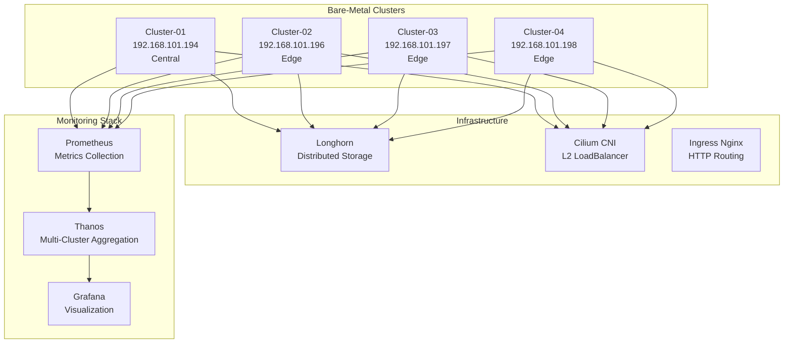
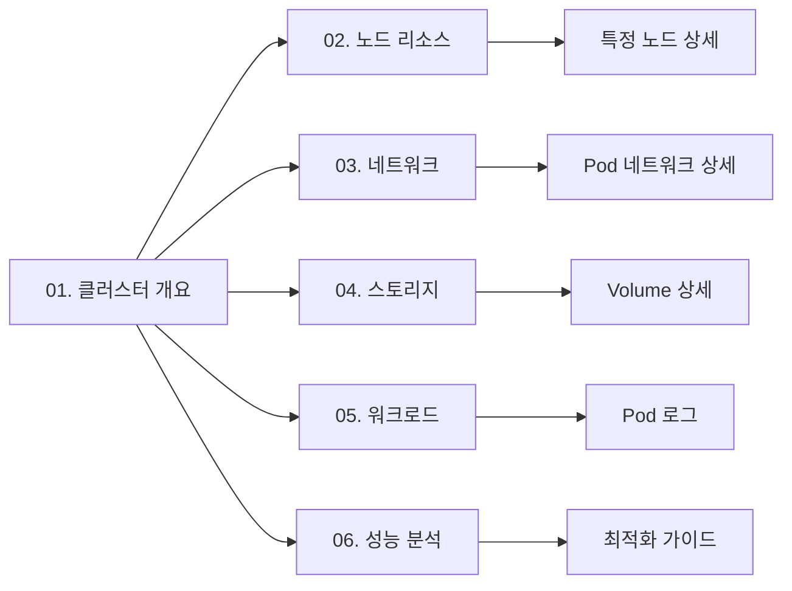

# 베어메탈 Kubernetes 인프라 모니터링 설계서

**프로젝트명**: Bare-Metal K8s Infrastructure Observability
**버전**: v1.0
**작성일**: 2025-11-08
**작성자**: Platform Engineering Team

---

## 📋 목차

1. [개요](#개요)
2. [대시보드 아키텍처](#대시보드-아키텍처)
3. [색상 시스템](#색상-시스템)
4. [대시보드 상세 스펙](#대시보드-상세-스펙)
5. [구현 계획](#구현-계획)

---

## 📌 개요

### 비즈니스 목표

**베어메탈 환경의 Kubernetes 클러스터 인프라**를 실시간으로 모니터링하여:

1. **클러스터 건강도**: 전체 클러스터 및 노드 상태 추적
2. **리소스 최적화**: CPU, 메모리, 디스크, 네트워크 용량 관리
3. **성능 분석**: 병목 지점 식별 및 최적화 기회 발견
4. **용량 계획**: 리소스 증설 시점 예측
5. **장애 대응**: 빠른 문제 진단 및 해결

### 환경 정보



### 기술 스택

| 구성요소 | 기술 | 버전 | 용도 |
|---------|------|------|------|
| **Container Runtime** | containerd | 1.7.x | 컨테이너 실행 |
| **CNI** | Cilium | 1.18.2 | 네트워킹, L2 LoadBalancer |
| **Storage** | Longhorn | 1.7.x | 분산 블록 스토리지 |
| **Ingress** | Ingress Nginx | 1.11.x | HTTP 라우팅 |
| **Metrics** | Prometheus | 2.x | 메트릭 수집 |
| **Aggregation** | Thanos | 0.39.x | 멀티 클러스터 메트릭 |
| **Exporters** | node-exporter, kube-state-metrics | latest | 메트릭 노출 |

---

## 🏗️ 대시보드 아키텍처

### 대시보드 구조 (6개)

```
쿠버네티스 인프라 모니터링
├─ 01. 쿠버네티스-클러스터-개요           ← 전체 멀티 클러스터 상태
├─ 02. 쿠버네티스-노드-리소스            ← 노드별 CPU/메모리/디스크
├─ 03. 쿠버네티스-네트워크-모니터링      ← Cilium CNI, 네트워크 트래픽
├─ 04. 쿠버네티스-스토리지-용량          ← Longhorn, PVC, Volume
├─ 05. 쿠버네티스-워크로드-현황          ← Pod, Deployment, StatefulSet
└─ 06. 쿠버네티스-성능-분석              ← 병목 지점, 최적화 권장
```

### Drill-down 네비게이션



---

## 🎨 색상 시스템

### Kubernetes 인프라 전용 파스텔 팔레트

```css
/* 01. Cluster Overview - Soft Blue */
--k8s-cluster: #B8D8F0;
--k8s-cluster-dark: #7FB3E8;

/* 02. Node Resources - Soft Green */
--k8s-node: #B8E5C5;
--k8s-node-dark: #81C995;

/* 03. Network - Soft Teal */
--k8s-network: #A8D8D8;
--k8s-network-dark: #6FB8B8;

/* 04. Storage - Soft Purple */
--k8s-storage: #D5C9E8;
--k8s-storage-dark: #B19CD9;

/* 05. Workload - Soft Orange */
--k8s-workload: #FFD8A8;
--k8s-workload-dark: #FFB347;

/* 06. Performance - Soft Pink */
--k8s-performance: #F9D0DF;
--k8s-performance-dark: #F4A4C4;

/* Status Colors */
--status-healthy: #D5F4E6;    /* 정상 - 연한 녹색 */
--status-warning: #FCF3CF;    /* 경고 - 연한 노란색 */
--status-critical: #FADBD8;   /* 위험 - 연한 빨간색 */
--status-info: #D6EAF8;       /* 정보 - 연한 파란색 */
```

---

## 📊 대시보드 상세 스펙

### 01. 쿠버네티스-클러스터-개요

**UID**: `k8s-cluster-overview-v1`
**제목**: 쿠버네티스-01-인프라-클러스터 개요
**목적**: 멀티 클러스터 전체 상태를 한눈에 파악

#### 핵심 메트릭

| 메트릭 | PromQL | 임계값 | 설명 |
|--------|--------|--------|------|
| 클러스터 수 | `count(up{job="kube-state-metrics"})` | 4개 | 총 클러스터 개수 |
| 정상 노드 비율 | `count(kube_node_status_condition{condition="Ready",status="true"}) / count(kube_node_info) * 100` | >95% | Ready 상태 노드 비율 |
| 총 Pod 수 | `count(kube_pod_info)` | - | 전체 Pod 수 |
| Running Pod 비율 | `count(kube_pod_status_phase{phase="Running"}) / count(kube_pod_info) * 100` | >90% | 정상 실행 Pod 비율 |
| 클러스터 CPU 사용률 | `sum(rate(node_cpu_seconds_total{mode!="idle"}[5m])) / sum(rate(node_cpu_seconds_total[5m])) * 100` | <80% | 전체 CPU 사용률 |
| 클러스터 메모리 사용률 | `(1 - sum(node_memory_MemAvailable_bytes) / sum(node_memory_MemTotal_bytes)) * 100` | <85% | 전체 메모리 사용률 |

#### 패널 구성

```
┌─────────────────────────────────────────────────────────────────┐
│ 쿠버네티스-01-인프라-클러스터 개요                               │
├─────────────────────────────────────────────────────────────────┤
│ [Stat] [Stat] [Stat] [Stat]                                     │
│  4개     100%    245개    92%                                   │
│ 클러스터  정상노드  총Pod  Running                               │
├─────────────────────────────────────────────────────────────────┤
│ [멀티 클러스터 상태 테이블]                                      │
│ Cluster      | Nodes | Pods | CPU% | Memory% | Status          │
│ cluster-01   |   1   |  45  | 67%  |  74%    | 🟢 Healthy      │
│ cluster-02   |   1   |  38  | 54%  |  62%    | 🟢 Healthy      │
│ cluster-03   |   1   |  42  | 61%  |  69%    | 🟢 Healthy      │
│ cluster-04   |   1   |  40  | 58%  |  65%    | 🟢 Healthy      │
├─────────────────────────────────────────────────────────────────┤
│ [Time Series] CPU 사용률 추이 (클러스터별)                      │
│ [Time Series] 메모리 사용률 추이 (클러스터별)                   │
├─────────────────────────────────────────────────────────────────┤
│ [빠른 이동]                                                     │
│ 🖥️ 노드 | 🌐 네트워크 | 💾 스토리지 | 📦 워크로드 | ⚡ 성능   │
└─────────────────────────────────────────────────────────────────┘
```

---

### 02. 쿠버네티스-노드-리소스

**UID**: `k8s-node-resources-v1`
**제목**: 쿠버네티스-02-인프라-노드 리소스
**목적**: 각 노드의 CPU, 메모리, 디스크 상세 모니터링

#### 핵심 메트릭

| 메트릭 | PromQL | 임계값 | 설명 |
|--------|--------|--------|------|
| 노드 CPU 사용률 | `100 - (avg(rate(node_cpu_seconds_total{mode="idle"}[5m])) by (instance) * 100)` | <80% | 노드별 CPU 사용률 |
| 노드 메모리 사용률 | `(1 - node_memory_MemAvailable_bytes / node_memory_MemTotal_bytes) * 100` | <85% | 노드별 메모리 사용률 |
| 노드 디스크 사용률 | `(node_filesystem_size_bytes{mountpoint="/"} - node_filesystem_free_bytes{mountpoint="/"}) / node_filesystem_size_bytes{mountpoint="/"} * 100` | <90% | 루트 파일시스템 사용률 |
| 노드 Uptime | `node_time_seconds - node_boot_time_seconds` | - | 노드 가동 시간 |
| Load Average (1m) | `node_load1` | <CPU cores | 1분 평균 부하 |
| Load Average (5m) | `node_load5` | <CPU cores | 5분 평균 부하 |
| Load Average (15m) | `node_load15` | <CPU cores | 15분 평균 부하 |
| Disk I/O 사용률 | `rate(node_disk_io_time_seconds_total[5m]) * 100` | <70% | 디스크 I/O 사용률 |

---

### 03. 쿠버네티스-네트워크-모니터링

**UID**: `k8s-network-monitoring-v1`
**제목**: 쿠버네티스-03-인프라-네트워크 모니터링
**목적**: Cilium CNI, Pod 네트워크, Ingress 트래픽 모니터링

#### 핵심 메트릭

| 메트릭 | PromQL | 임계값 | 설명 |
|--------|--------|--------|------|
| Pod 네트워크 수신 | `rate(container_network_receive_bytes_total{pod!=""}[5m])` | - | Pod별 네트워크 수신 속도 |
| Pod 네트워크 전송 | `rate(container_network_transmit_bytes_total{pod!=""}[5m])` | - | Pod별 네트워크 전송 속도 |
| Ingress 요청 수 | `sum(rate(nginx_ingress_controller_requests[5m])) by (host)` | - | Ingress별 요청 수 |
| Ingress 응답 시간 | `histogram_quantile(0.95, nginx_ingress_controller_request_duration_seconds_bucket)` | <1s | Ingress 응답 시간 P95 |
| Cilium 엔드포인트 | `cilium_endpoint_state{state="ready"}` | - | Cilium 관리 엔드포인트 수 |
| 네트워크 에러 | `rate(node_network_receive_errs_total[5m]) + rate(node_network_transmit_errs_total[5m])` | 0 | 네트워크 송수신 에러 |

---

### 04. 쿠버네티스-스토리지-용량

**UID**: `k8s-storage-capacity-v1`
**제목**: 쿠버네티스-04-인프라-스토리지 용량
**목적**: Longhorn 볼륨, PVC 용량 관리

#### 핵심 메트릭

| 메트릭 | PromQL | 임계값 | 설명 |
|--------|--------|--------|------|
| Longhorn 볼륨 수 | `count(longhorn_volume_actual_size_bytes)` | - | 총 Longhorn 볼륨 개수 |
| Longhorn 용량 사용률 | `sum(longhorn_volume_actual_size_bytes) / sum(longhorn_node_storage_capacity_bytes) * 100` | <80% | Longhorn 스토리지 사용률 |
| PVC 사용률 | `kubelet_volume_stats_used_bytes / kubelet_volume_stats_capacity_bytes * 100` | <90% | PVC별 용량 사용률 |
| PVC Inodes 사용률 | `kubelet_volume_stats_inodes_used / kubelet_volume_stats_inodes * 100` | <80% | PVC inode 사용률 |
| Longhorn Replica 상태 | `longhorn_volume_robustness{robustness="healthy"}` | 모두 healthy | 볼륨 Replica 건강도 |
| 스토리지 IOPS | `rate(node_disk_reads_completed_total[5m]) + rate(node_disk_writes_completed_total[5m])` | - | 디스크 IOPS |

---

### 05. 쿠버네티스-워크로드-현황

**UID**: `k8s-workload-status-v1`
**제목**: 쿠버네티스-05-인프라-워크로드 현황
**목적**: Pod, Deployment, StatefulSet 상태 추적

#### 핵심 메트릭

| 메트릭 | PromQL | 임계값 | 설명 |
|--------|--------|--------|------|
| Pod 상태별 개수 | `count(kube_pod_status_phase) by (phase)` | - | Running/Pending/Failed Pod 수 |
| Container 재시작 | `rate(kube_pod_container_status_restarts_total[5m])` | <0.1 | Container 재시작 빈도 |
| Deployment Available | `kube_deployment_status_replicas_available / kube_deployment_spec_replicas * 100` | 100% | Deployment 가용 Replica 비율 |
| StatefulSet Ready | `kube_statefulset_status_replicas_ready / kube_statefulset_replicas * 100` | 100% | StatefulSet Ready Replica 비율 |
| DaemonSet Ready | `kube_daemonset_status_number_ready / kube_daemonset_status_desired_number_scheduled * 100` | 100% | DaemonSet Ready Pod 비율 |
| CrashLoopBackOff | `count(kube_pod_container_status_waiting_reason{reason="CrashLoopBackOff"})` | 0 | CrashLoop 상태 Pod 수 |
| ImagePullBackOff | `count(kube_pod_container_status_waiting_reason{reason="ImagePullBackOff"})` | 0 | Image Pull 실패 Pod 수 |

---

### 06. 쿠버네티스-성능-분석

**UID**: `k8s-performance-analysis-v1`
**제목**: 쿠버네티스-06-인프라-성능 분석
**목적**: 병목 지점 식별, 최적화 권장사항 제공

#### 핵심 메트릭

| 메트릭 | PromQL | 임계값 | 설명 |
|--------|--------|--------|------|
| CPU 과다 할당 Pod | `kube_pod_container_resource_requests{resource="cpu"} > on(pod) container_cpu_usage_seconds_total * 2` | - | CPU Request 과다 할당 Pod |
| 메모리 과다 할당 Pod | `kube_pod_container_resource_requests{resource="memory"} > on(pod) container_memory_working_set_bytes * 2` | - | 메모리 Request 과다 할당 Pod |
| OOMKilled Container | `kube_pod_container_status_terminated_reason{reason="OOMKilled"}` | 0 | 메모리 부족으로 종료된 Container |
| Throttled Container | `rate(container_cpu_cfs_throttled_seconds_total[5m]) > 0` | - | CPU Throttling 발생 Container |
| 노드 압박 상태 | `kube_node_status_condition{condition=~"MemoryPressure|DiskPressure",status="true"}` | 0 | 노드 리소스 압박 |
| 느린 스토리지 I/O | `rate(node_disk_io_time_weighted_seconds_total[5m]) > 0.1` | <0.1 | 디스크 I/O 대기 시간 |

---

## 🚀 구현 계획

### Phase 1: 기반 구축 (1일)

- [x] 베어메탈 K8s 인프라 스펙 문서 작성
- [ ] 색상 시스템 정의
- [ ] Dashboard 템플릿 구조 설계

### Phase 2: Core Dashboards (2일)

- [ ] 01. 클러스터-개요 대시보드
- [ ] 02. 노드-리소스 대시보드
- [ ] 03. 네트워크-모니터링 대시보드

### Phase 3: Advanced Dashboards (2일)

- [ ] 04. 스토리지-용량 대시보드
- [ ] 05. 워크로드-현황 대시보드
- [ ] 06. 성능-분석 대시보드

### Phase 4: 검증 및 배포 (1일)

- [ ] PromQL 메트릭 검증
- [ ] Grafana 배포 및 테스트
- [ ] 네비게이션 링크 연결
- [ ] 문서화 완료

---

## 📝 메트릭 데이터 소스

### Prometheus Exporters

- **node-exporter**: 노드 리소스 메트릭 (CPU, 메모리, 디스크, 네트워크)
- **kube-state-metrics**: Kubernetes 리소스 상태 메트릭
- **cadvisor**: Container 리소스 사용량
- **Longhorn**: 스토리지 볼륨 메트릭
- **Cilium**: CNI 네트워크 메트릭
- **Ingress Nginx**: HTTP 트래픽 메트릭

### Thanos 통합

- 멀티 클러스터 메트릭 집계
- 장기 메트릭 보관 (S3)
- 글로벌 쿼리 인터페이스

---

## 🎯 성공 기준

1. ✅ 모든 클러스터의 노드 상태를 실시간으로 확인 가능
2. ✅ 리소스 사용률 80% 도달 시 자동 알림
3. ✅ 스토리지 용량 90% 도달 시 경고
4. ✅ Pod 장애 발생 시 5분 내 감지
5. ✅ 성능 병목 지점 식별 및 최적화 가이드 제공

---

**작성자**: Platform Engineering Team
**최종 수정**: 2025-11-08
**버전**: 1.0
