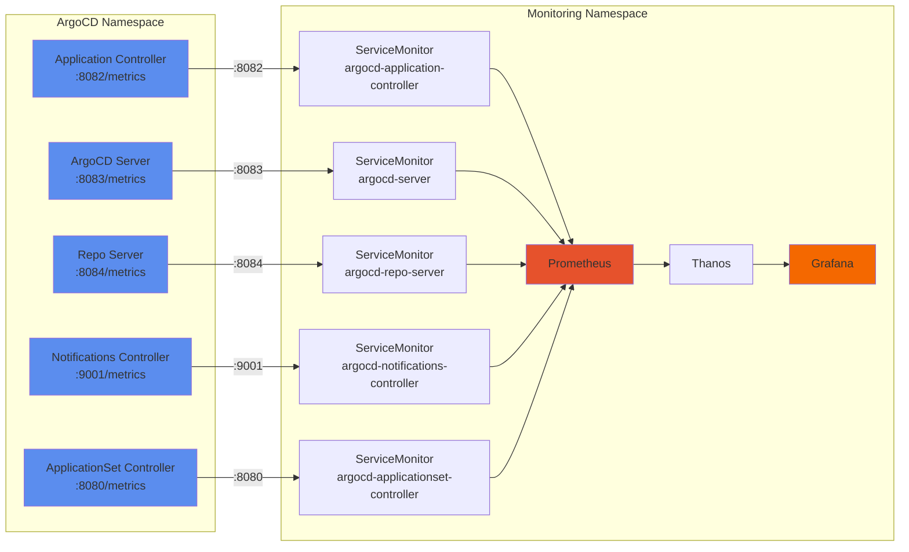
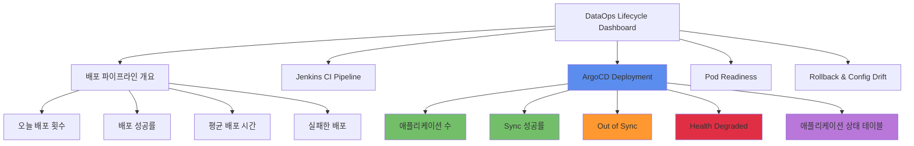

# ArgoCD 메트릭 수집 및 DataOps Lifecycle 대시보드 배포 가이드

## 📋 목차

1. [개요](#1-개요)
2. [아키텍처](#2-아키텍처)
3. [사전 요구사항](#3-사전-요구사항)
4. [ArgoCD 메트릭 엔드포인트](#4-argocd-메트릭-엔드포인트)
5. [ServiceMonitor 배포](#5-servicemonitor-배포)
6. [대시보드 업데이트](#6-대시보드-업데이트)
7. [메트릭 검증](#7-메트릭-검증)
8. [PromQL 쿼리 상세](#8-promql-쿼리-상세)
9. [트러블슈팅](#9-트러블슈팅)
10. [참고 자료](#10-참고-자료)

---

## 1. 개요

### 1.1 목적

DataOps Application Lifecycle 대시보드에서 ArgoCD의 GitOps 배포 현황을 실시간으로 모니터링하기 위한 메트릭 수집 및 시각화 구성 가이드입니다.

### 1.2 주요 기능

- **ArgoCD 애플리케이션 현황**: 전체 애플리케이션 수, Health 상태, Sync 상태
- **배포 성공률**: 24시간 기준 Sync 성공률 모니터링
- **배포 성능**: Reconcile 시간, Sync 소요 시간 분석
- **문제 감지**: Out of Sync, Health Degraded 애플리케이션 식별
- **상세 현황 테이블**: 애플리케이션별 상태 정보 (Health, Sync, Repository 등)

### 1.3 배포 범위

| 구성 요소 | 설명 | 배포 위치 |
|----------|------|----------|
| ServiceMonitor | ArgoCD 메트릭 수집 설정 (5개) | `monitoring` namespace |
| Grafana Dashboard | DataOps Lifecycle 대시보드 업데이트 | `monitoring` namespace |
| ArgoCD Services | 기존 메트릭 서비스 활용 | `argocd` namespace |

---

## 2. 아키텍처

### 2.1 메트릭 수집 흐름



### 2.2 대시보드 패널 구조



---

## 3. 사전 요구사항

### 3.1 필수 구성 요소

- ✅ ArgoCD 설치 완료 (v2.0+)
- ✅ kube-prometheus-stack 설치 완료
- ✅ Prometheus Operator 실행 중
- ✅ Grafana 실행 중

### 3.2 확인 방법

```bash
# ArgoCD 확인
kubectl get pods -n argocd
kubectl get svc -n argocd | grep metrics

# Prometheus Operator 확인
kubectl get pods -n monitoring | grep prometheus-operator
kubectl get servicemonitors -n monitoring

# Grafana 확인
kubectl get pods -n monitoring | grep grafana
kubectl get configmap -n monitoring | grep grafana-dashboard
```

### 3.3 필요한 권한

```yaml
# ServiceMonitor 생성 권한
apiVersion: rbac.authorization.k8s.io/v1
kind: ClusterRole
metadata:
  name: servicemonitor-creator
rules:
  - apiGroups: ["monitoring.coreos.com"]
    resources: ["servicemonitors"]
    verbs: ["get", "list", "create", "update", "patch"]
  - apiGroups: [""]
    resources: ["services"]
    verbs: ["get", "list"]
```

---

## 4. ArgoCD 메트릭 엔드포인트

### 4.1 메트릭 서비스 목록

| 서비스명 | 포트 | 메트릭 경로 | 주요 메트릭 |
|---------|------|-----------|-----------|
| `argocd-metrics` | 8082 | `/metrics` | `argocd_app_info`, `argocd_app_sync_total`, `argocd_app_reconcile_*` |
| `argocd-server-metrics` | 8083 | `/metrics` | `argocd_api_*`, `argocd_redis_*` |
| `argocd-repo-server` | 8084 | `/metrics` | `argocd_git_*`, `argocd_repo_*` |
| `argocd-notifications-controller-metrics` | 9001 | `/metrics` | `argocd_notifications_*` |
| `argocd-applicationset-controller` | 8080 | `/metrics` | `argocd_applicationset_*` |

### 4.2 주요 메트릭 설명

#### 4.2.1 argocd_app_info

애플리케이션의 현재 상태 정보를 제공하는 Gauge 메트릭입니다.

**레이블:**
- `name`: 애플리케이션 이름
- `namespace`: ArgoCD 네임스페이스 (일반적으로 `argocd`)
- `project`: ArgoCD 프로젝트명
- `health_status`: 헬스 상태 (`Healthy`, `Progressing`, `Degraded`, `Missing`, `Unknown`)
- `sync_status`: 싱크 상태 (`Synced`, `OutOfSync`, `Unknown`)
- `dest_namespace`: 배포 대상 네임스페이스
- `dest_server`: 배포 대상 클러스터 서버 주소
- `repo`: Git 저장소 URL
- `autosync_enabled`: Auto Sync 활성화 여부 (`true`/`false`)

**예시:**
```promql
argocd_app_info{
  name="prometheus-agent-cluster-02",
  namespace="argocd",
  project="default",
  health_status="Healthy",
  sync_status="OutOfSync",
  dest_namespace="monitoring",
  dest_server="https://192.168.101.196:6443",
  repo="https://github.com/kronenz/prometheua-ha-kustomize",
  autosync_enabled="true"
}
```

#### 4.2.2 argocd_app_sync_total

애플리케이션의 Sync 누적 횟수를 제공하는 Counter 메트릭입니다.

**레이블:**
- `name`: 애플리케이션 이름
- `namespace`: ArgoCD 네임스페이스
- `project`: ArgoCD 프로젝트명
- `dest_server`: 배포 대상 클러스터 서버 주소
- `phase`: Sync 결과 (`Succeeded`, `Failed`, `Error`, `Running`)

**예시:**
```promql
argocd_app_sync_total{
  name="prometheus-agent-cluster-02",
  namespace="argocd",
  project="default",
  dest_server="https://192.168.101.196:6443",
  phase="Succeeded"
} 5071
```

#### 4.2.3 argocd_app_reconcile_bucket

애플리케이션 Reconcile 소요 시간의 히스토그램 메트릭입니다.

**레이블:**
- `namespace`: ArgoCD 네임스페이스
- `dest_server`: 배포 대상 클러스터 서버 주소
- `le`: Histogram bucket (0.25, 0.5, 1, 2, 4, 8, 16, +Inf)

**예시:**
```promql
argocd_app_reconcile_bucket{
  namespace="argocd",
  dest_server="https://192.168.101.196:6443",
  le="0.5"
} 23773
```

#### 4.2.4 argocd_cluster_connection_status

클러스터 연결 상태를 제공하는 Gauge 메트릭입니다.

**값:**
- `1`: 연결됨 (Successful)
- `0`: 연결 실패 (Failed)

**레이블:**
- `server`: 클러스터 서버 주소

---

## 5. ServiceMonitor 배포

### 5.1 ServiceMonitor 구성

**파일 위치:** `/root/develop/thanos/deploy-new/base/kube-prometheus-stack/servicemonitors/argocd-metrics.yaml`

#### 5.1.1 ArgoCD Application Controller

```yaml
---
apiVersion: monitoring.coreos.com/v1
kind: ServiceMonitor
metadata:
  name: argocd-application-controller
  namespace: monitoring
  labels:
    app.kubernetes.io/name: argocd
    app.kubernetes.io/component: application-controller
    release: kube-prometheus-stack
spec:
  selector:
    matchLabels:
      app.kubernetes.io/name: argocd-application-controller
  namespaceSelector:
    matchNames:
      - argocd
  endpoints:
    - port: metrics
      interval: 30s
      path: /metrics
      relabelings:
        - sourceLabels: [__meta_kubernetes_service_name]
          targetLabel: service
        - sourceLabels: [__meta_kubernetes_namespace]
          targetLabel: namespace
        - targetLabel: component
          replacement: application-controller
```

#### 5.1.2 ArgoCD Server

```yaml
---
apiVersion: monitoring.coreos.com/v1
kind: ServiceMonitor
metadata:
  name: argocd-server
  namespace: monitoring
  labels:
    app.kubernetes.io/name: argocd
    app.kubernetes.io/component: server
    release: kube-prometheus-stack
spec:
  selector:
    matchLabels:
      app.kubernetes.io/name: argocd-server
  namespaceSelector:
    matchNames:
      - argocd
  endpoints:
    - port: metrics
      interval: 30s
      path: /metrics
      relabelings:
        - sourceLabels: [__meta_kubernetes_service_name]
          targetLabel: service
        - sourceLabels: [__meta_kubernetes_namespace]
          targetLabel: namespace
        - targetLabel: component
          replacement: server
```

#### 5.1.3 ArgoCD Repo Server

```yaml
---
apiVersion: monitoring.coreos.com/v1
kind: ServiceMonitor
metadata:
  name: argocd-repo-server
  namespace: monitoring
  labels:
    app.kubernetes.io/name: argocd
    app.kubernetes.io/component: repo-server
    release: kube-prometheus-stack
spec:
  selector:
    matchLabels:
      app.kubernetes.io/name: argocd-repo-server
  namespaceSelector:
    matchNames:
      - argocd
  endpoints:
    - port: metrics
      interval: 30s
      path: /metrics
      relabelings:
        - sourceLabels: [__meta_kubernetes_service_name]
          targetLabel: service
        - sourceLabels: [__meta_kubernetes_namespace]
          targetLabel: namespace
        - targetLabel: component
          replacement: repo-server
```

#### 5.1.4 ArgoCD Notifications Controller

```yaml
---
apiVersion: monitoring.coreos.com/v1
kind: ServiceMonitor
metadata:
  name: argocd-notifications-controller
  namespace: monitoring
  labels:
    app.kubernetes.io/name: argocd
    app.kubernetes.io/component: notifications-controller
    release: kube-prometheus-stack
spec:
  selector:
    matchLabels:
      app.kubernetes.io/name: argocd-notifications-controller
  namespaceSelector:
    matchNames:
      - argocd
  endpoints:
    - port: metrics
      interval: 30s
      path: /metrics
      relabelings:
        - sourceLabels: [__meta_kubernetes_service_name]
          targetLabel: service
        - sourceLabels: [__meta_kubernetes_namespace]
          targetLabel: namespace
        - targetLabel: component
          replacement: notifications-controller
```

#### 5.1.5 ArgoCD ApplicationSet Controller

```yaml
---
apiVersion: monitoring.coreos.com/v1
kind: ServiceMonitor
metadata:
  name: argocd-applicationset-controller
  namespace: monitoring
  labels:
    app.kubernetes.io/name: argocd
    app.kubernetes.io/component: applicationset-controller
    release: kube-prometheus-stack
spec:
  selector:
    matchLabels:
      app.kubernetes.io/name: argocd-applicationset-controller
  namespaceSelector:
    matchNames:
      - argocd
  endpoints:
    - port: metrics
      interval: 30s
      path: /metrics
      relabelings:
        - sourceLabels: [__meta_kubernetes_service_name]
          targetLabel: service
        - sourceLabels: [__meta_kubernetes_namespace]
          targetLabel: namespace
        - targetLabel: component
          replacement: applicationset-controller
```

### 5.2 배포 명령

```bash
# ServiceMonitor 배포
kubectl apply -f /root/develop/thanos/deploy-new/base/kube-prometheus-stack/servicemonitors/argocd-metrics.yaml

# 배포 확인
kubectl get servicemonitors -n monitoring | grep argocd

# 출력 예시:
# argocd-application-controller     30s
# argocd-applicationset-controller  30s
# argocd-notifications-controller   30s
# argocd-repo-server                30s
# argocd-server                     30s
```

### 5.3 Prometheus Target 확인

```bash
# Prometheus UI에서 확인
# URL: http://<prometheus-url>/targets

# kubectl port-forward로 확인
kubectl port-forward -n monitoring svc/kube-prometheus-stack-prometheus 9090:9090

# 브라우저에서 http://localhost:9090/targets 접속 후 "argocd" 검색
```

**정상 Target 상태:**
- `serviceMonitor/monitoring/argocd-application-controller/0 (1/1 up)`
- `serviceMonitor/monitoring/argocd-server/0 (1/1 up)`
- `serviceMonitor/monitoring/argocd-repo-server/0 (1/1 up)`
- `serviceMonitor/monitoring/argocd-notifications-controller/0 (1/1 up)`
- `serviceMonitor/monitoring/argocd-applicationset-controller/0 (1/1 up)`

---

## 6. 대시보드 업데이트

### 6.1 업데이트된 패널

#### 6.1.1 오늘 배포 횟수

**쿼리:**
```promql
sum(increase(argocd_app_sync_total[1d]))
```

**설명:** 최근 1일간 전체 ArgoCD Sync 총 횟수

**시각화:**
- Type: Stat
- Color: #5B8DEE (파란색)
- Unit: none

---

#### 6.1.2 배포 성공률 (24h)

**쿼리:**
```promql
sum(rate(argocd_app_sync_total{phase="Succeeded"}[24h]))
/
sum(rate(argocd_app_sync_total[24h]))
* 100
```

**설명:** 최근 24시간 동안의 Sync 성공률 (%)

**시각화:**
- Type: Stat
- Unit: percent (0-100)
- Thresholds:
  - 0-70%: Red
  - 70-90%: Yellow
  - 90-100%: Green

---

#### 6.1.3 평균 배포 시간

**쿼리:**
```promql
histogram_quantile(0.5, sum(rate(argocd_app_reconcile_bucket[1h])) by (le))
```

**설명:** 최근 1시간 동안의 Reconcile 소요 시간 중앙값 (P50)

**시각화:**
- Type: Stat
- Unit: seconds
- Color: #73BF69 (초록색)

---

#### 6.1.4 실패한 배포

**쿼리:**
```promql
sum(increase(argocd_app_sync_total{phase=~"Error|Failed"}[24h]))
```

**설명:** 최근 24시간 동안 실패한 Sync 횟수

**시각화:**
- Type: Stat
- Color: #E02F44 (빨간색)
- No Value: "0"

---

#### 6.1.5 ArgoCD 애플리케이션 수

**쿼리:**
```promql
count(argocd_app_info)
```

**설명:** 현재 관리 중인 ArgoCD 애플리케이션 총 개수

**시각화:**
- Type: Stat
- Color: #5B8DEE (파란색)

---

#### 6.1.6 Sync 성공률 (24h)

**쿼리:**
```promql
sum(rate(argocd_app_sync_total{phase="Succeeded"}[24h]))
/
sum(rate(argocd_app_sync_total[24h]))
* 100
```

**설명:** ArgoCD 섹션의 Sync 성공률 (배포 파이프라인 개요와 동일)

**시각화:**
- Type: Stat
- Unit: percent
- Thresholds: 0-70% (Red), 70-90% (Yellow), 90-100% (Green)

---

#### 6.1.7 Out of Sync

**쿼리:**
```promql
count(argocd_app_info{sync_status="OutOfSync"})
```

**설명:** Sync가 필요한 (Git과 클러스터가 불일치) 애플리케이션 수

**시각화:**
- Type: Stat
- Color: #FF9830 (주황색)
- Thresholds:
  - 0: Green
  - 1-4: Yellow
  - 5+: Red

---

#### 6.1.8 Health Degraded

**쿼리:**
```promql
count(argocd_app_info{health_status=~"Degraded|Missing|Unknown"})
```

**설명:** Health 상태가 비정상인 애플리케이션 수

**시각화:**
- Type: Stat
- Color: #E02F44 (빨간색)
- Thresholds:
  - 0: Green
  - 1+: Red

---

#### 6.1.9 ArgoCD 애플리케이션 상태 (Table)

**쿼리:**
```promql
argocd_app_info
```

**Transformations:**
1. **Organize fields:**
   - Exclude: `__name__`, `Time`, `Value`, `job`, `instance`, `operation`
   - Rename:
     - `name` → `Application`
     - `namespace` → `Namespace`
     - `project` → `Project`
     - `health_status` → `Health`
     - `sync_status` → `Sync Status`
     - `dest_namespace` → `Dest NS`
     - `autosync_enabled` → `Auto Sync`
     - `repo` → `Repository`

2. **Field overrides:**

**Health 컬럼:**
```json
{
  "matcher": {"id": "byName", "options": "Health"},
  "properties": [{
    "id": "mappings",
    "value": [
      {"type": "value", "options": {
        "Healthy": {"color": "green", "text": "✅ Healthy"},
        "Progressing": {"color": "yellow", "text": "🔄 Progressing"},
        "Degraded": {"color": "red", "text": "❌ Degraded"},
        "Missing": {"color": "red", "text": "❌ Missing"},
        "Unknown": {"color": "orange", "text": "❓ Unknown"}
      }}
    ]
  }]
}
```

**Sync Status 컬럼:**
```json
{
  "matcher": {"id": "byName", "options": "Sync Status"},
  "properties": [{
    "id": "mappings",
    "value": [
      {"type": "value", "options": {
        "Synced": {"color": "green", "text": "✅ Synced"},
        "OutOfSync": {"color": "red", "text": "❌ Out of Sync"},
        "Unknown": {"color": "orange", "text": "❓ Unknown"}
      }}
    ]
  }]
}
```

**시각화:**
- Type: Table
- 이모지와 색상으로 Health 및 Sync 상태 표시
- 정렬 가능, 검색 가능

---

### 6.2 대시보드 배포

#### 6.2.1 수동 업데이트 방법

```bash
# 1. 기존 대시보드 백업
kubectl get configmap -n monitoring grafana-dashboard-dataops-lifecycle-v2 -o yaml > /tmp/dashboard-backup.yaml

# 2. 업데이트된 대시보드 JSON 적용
kubectl create configmap grafana-dashboard-dataops-lifecycle-v2 \
  -n monitoring \
  --from-file=dataops-lifecycle-v2.json=/tmp/dataops-lifecycle-v2-updated.json \
  --dry-run=client -o yaml | \
  kubectl apply -f -

# 3. ConfigMap 레이블 추가 (자동 검색을 위해)
kubectl label configmap -n monitoring grafana-dashboard-dataops-lifecycle-v2 \
  grafana_dashboard="1" \
  app.kubernetes.io/name=grafana \
  app.kubernetes.io/component=dashboard \
  --overwrite

# 4. Grafana 재시작
kubectl rollout restart deployment -n monitoring kube-prometheus-stack-grafana

# 5. 재시작 완료 대기
kubectl rollout status deployment -n monitoring kube-prometheus-stack-grafana
```

#### 6.2.2 자동 업데이트 스크립트

```bash
#!/bin/bash
set -e

DASHBOARD_FILE="/tmp/dataops-lifecycle-v2-updated.json"
NAMESPACE="monitoring"
CONFIGMAP_NAME="grafana-dashboard-dataops-lifecycle-v2"

echo "🔄 Updating DataOps Lifecycle Dashboard..."

# 대시보드 ConfigMap 업데이트
kubectl create configmap ${CONFIGMAP_NAME} \
  -n ${NAMESPACE} \
  --from-file=dataops-lifecycle-v2.json=${DASHBOARD_FILE} \
  --dry-run=client -o yaml | \
  kubectl apply -f -

# 레이블 추가
kubectl label configmap -n ${NAMESPACE} ${CONFIGMAP_NAME} \
  grafana_dashboard="1" \
  app.kubernetes.io/name=grafana \
  app.kubernetes.io/component=dashboard \
  --overwrite

# Grafana 재시작
kubectl rollout restart deployment -n ${NAMESPACE} kube-prometheus-stack-grafana

# 재시작 대기
kubectl rollout status deployment -n ${NAMESPACE} kube-prometheus-stack-grafana --timeout=120s

echo "✅ Dashboard updated successfully!"
echo "🌐 Access Grafana and search for 'DataOps - Application Lifecycle'"
```

---

## 7. 메트릭 검증

### 7.1 Prometheus에서 메트릭 확인

```bash
# Prometheus 포트포워딩
kubectl port-forward -n monitoring svc/kube-prometheus-stack-prometheus 9090:9090
```

**브라우저에서 http://localhost:9090 접속 후 다음 쿼리 실행:**

#### 7.1.1 애플리케이션 총 개수
```promql
count(argocd_app_info)
```

#### 7.1.2 Health 상태별 애플리케이션 수
```promql
count by (health_status) (argocd_app_info)
```

#### 7.1.3 Sync 상태별 애플리케이션 수
```promql
count by (sync_status) (argocd_app_info)
```

#### 7.1.4 최근 1시간 Sync 총 횟수
```promql
sum(increase(argocd_app_sync_total[1h]))
```

#### 7.1.5 Sync 성공률 (24시간)
```promql
sum(rate(argocd_app_sync_total{phase="Succeeded"}[24h]))
/
sum(rate(argocd_app_sync_total[24h]))
* 100
```

#### 7.1.6 Reconcile P50/P95/P99 (1시간)
```promql
# P50
histogram_quantile(0.5, sum(rate(argocd_app_reconcile_bucket[1h])) by (le))

# P95
histogram_quantile(0.95, sum(rate(argocd_app_reconcile_bucket[1h])) by (le))

# P99
histogram_quantile(0.99, sum(rate(argocd_app_reconcile_bucket[1h])) by (le))
```

### 7.2 Grafana에서 대시보드 확인

```bash
# Grafana 포트포워딩
kubectl port-forward -n monitoring svc/kube-prometheus-stack-grafana 3000:80
```

**브라우저에서 http://localhost:3000 접속:**

1. 왼쪽 메뉴 → **Dashboards**
2. 검색창에 `dataops-lifecycle-v2` 또는 `Application Lifecycle` 입력
3. **🔄 DataOps - Application Lifecycle (GitOps)** 대시보드 선택

**확인 사항:**
- ✅ "ArgoCD 애플리케이션 수" 패널에 숫자 표시
- ✅ "Sync 성공률 (24h)" 패널에 퍼센트 표시
- ✅ "Out of Sync" 패널에 숫자 표시
- ✅ "Health Degraded" 패널에 숫자 표시
- ✅ "ArgoCD 애플리케이션 상태" 테이블에 데이터 표시 (이모지 포함)

### 7.3 메트릭 수집 상태 확인

```bash
# ServiceMonitor 상태 확인
kubectl get servicemonitors -n monitoring | grep argocd

# Prometheus Target 상태 확인 (CLI)
kubectl exec -n monitoring kube-prometheus-stack-prometheus-0 -- \
  wget -qO- http://localhost:9090/api/v1/targets | \
  jq -r '.data.activeTargets[] | select(.labels.job | contains("argocd")) | "\(.labels.job): \(.health)"'

# 출력 예시:
# serviceMonitor/monitoring/argocd-application-controller/0: up
# serviceMonitor/monitoring/argocd-server/0: up
# serviceMonitor/monitoring/argocd-repo-server/0: up
# serviceMonitor/monitoring/argocd-notifications-controller/0: up
# serviceMonitor/monitoring/argocd-applicationset-controller/0: up
```

---

## 8. PromQL 쿼리 상세

### 8.1 애플리케이션 현황

#### 8.1.1 전체 애플리케이션 수
```promql
count(argocd_app_info)
```

#### 8.1.2 프로젝트별 애플리케이션 수
```promql
count by (project) (argocd_app_info)
```

#### 8.1.3 네임스페이스별 애플리케이션 수
```promql
count by (dest_namespace) (argocd_app_info)
```

#### 8.1.4 클러스터별 애플리케이션 수
```promql
count by (dest_server) (argocd_app_info)
```

---

### 8.2 Health 상태

#### 8.2.1 Healthy 애플리케이션 수
```promql
count(argocd_app_info{health_status="Healthy"})
```

#### 8.2.2 Degraded 애플리케이션 목록
```promql
argocd_app_info{health_status="Degraded"}
```

#### 8.2.3 Health 상태 분포
```promql
count by (health_status) (argocd_app_info)
```

#### 8.2.4 Health 상태 비율 (%)
```promql
count by (health_status) (argocd_app_info)
/
count(argocd_app_info)
* 100
```

---

### 8.3 Sync 상태

#### 8.3.1 Synced 애플리케이션 수
```promql
count(argocd_app_info{sync_status="Synced"})
```

#### 8.3.2 OutOfSync 애플리케이션 수
```promql
count(argocd_app_info{sync_status="OutOfSync"})
```

#### 8.3.3 Sync 상태 분포
```promql
count by (sync_status) (argocd_app_info)
```

#### 8.3.4 OutOfSync 애플리케이션 목록
```promql
argocd_app_info{sync_status="OutOfSync"}
```

---

### 8.4 Sync 성능 및 통계

#### 8.4.1 최근 1시간 Sync 총 횟수
```promql
sum(increase(argocd_app_sync_total[1h]))
```

#### 8.4.2 최근 24시간 Sync 총 횟수
```promql
sum(increase(argocd_app_sync_total[24h]))
```

#### 8.4.3 Sync 성공 횟수 (1시간)
```promql
sum(increase(argocd_app_sync_total{phase="Succeeded"}[1h]))
```

#### 8.4.4 Sync 실패 횟수 (1시간)
```promql
sum(increase(argocd_app_sync_total{phase=~"Error|Failed"}[1h]))
```

#### 8.4.5 Sync 성공률 (24시간)
```promql
sum(rate(argocd_app_sync_total{phase="Succeeded"}[24h]))
/
sum(rate(argocd_app_sync_total[24h]))
* 100
```

#### 8.4.6 애플리케이션별 Sync 성공률
```promql
sum by (name) (rate(argocd_app_sync_total{phase="Succeeded"}[24h]))
/
sum by (name) (rate(argocd_app_sync_total[24h]))
* 100
```

#### 8.4.7 프로젝트별 Sync 총 횟수
```promql
sum by (project) (increase(argocd_app_sync_total[24h]))
```

---

### 8.5 Reconcile 성능

#### 8.5.1 Reconcile P50 (중앙값)
```promql
histogram_quantile(0.5, sum(rate(argocd_app_reconcile_bucket[1h])) by (le))
```

#### 8.5.2 Reconcile P95 (95 백분위수)
```promql
histogram_quantile(0.95, sum(rate(argocd_app_reconcile_bucket[1h])) by (le))
```

#### 8.5.3 Reconcile P99 (99 백분위수)
```promql
histogram_quantile(0.99, sum(rate(argocd_app_reconcile_bucket[1h])) by (le))
```

#### 8.5.4 클러스터별 Reconcile P50
```promql
histogram_quantile(0.5,
  sum by (dest_server, le) (rate(argocd_app_reconcile_bucket[1h]))
)
```

#### 8.5.5 Reconcile 평균 시간
```promql
rate(argocd_app_reconcile_sum[1h])
/
rate(argocd_app_reconcile_count[1h])
```

#### 8.5.6 최근 1시간 Reconcile 총 횟수
```promql
sum(increase(argocd_app_reconcile_count[1h]))
```

---

### 8.6 클러스터 연결 상태

#### 8.6.1 연결된 클러스터 수
```promql
sum(argocd_cluster_connection_status)
```

#### 8.6.2 연결 실패한 클러스터 수
```promql
count(argocd_cluster_connection_status == 0)
```

#### 8.6.3 클러스터별 연결 상태
```promql
argocd_cluster_connection_status
```

---

### 8.7 복합 쿼리

#### 8.7.1 건강한 애플리케이션 비율 (%)
```promql
count(argocd_app_info{health_status="Healthy", sync_status="Synced"})
/
count(argocd_app_info)
* 100
```

#### 8.7.2 문제가 있는 애플리케이션 수
```promql
count(argocd_app_info{health_status!="Healthy"})
+
count(argocd_app_info{sync_status="OutOfSync"})
```

#### 8.7.3 Auto Sync가 활성화된 애플리케이션 수
```promql
count(argocd_app_info{autosync_enabled="true"})
```

#### 8.7.4 Auto Sync 활성화 비율 (%)
```promql
count(argocd_app_info{autosync_enabled="true"})
/
count(argocd_app_info)
* 100
```

#### 8.7.5 프로젝트별 Health Degraded 수
```promql
count by (project) (argocd_app_info{health_status="Degraded"})
```

---

### 8.8 시계열 추이

#### 8.8.1 시간대별 Sync 횟수 추이
```promql
sum(rate(argocd_app_sync_total[5m]))
```

#### 8.8.2 시간대별 Sync 성공률 추이
```promql
sum(rate(argocd_app_sync_total{phase="Succeeded"}[5m]))
/
sum(rate(argocd_app_sync_total[5m]))
* 100
```

#### 8.8.3 시간대별 Reconcile 평균 시간 추이
```promql
rate(argocd_app_reconcile_sum[5m])
/
rate(argocd_app_reconcile_count[5m])
```

#### 8.8.4 시간대별 OutOfSync 애플리케이션 수 추이
```promql
count_over_time(argocd_app_info{sync_status="OutOfSync"}[5m])
```

---

### 8.9 알람용 쿼리

#### 8.9.1 Health Degraded 알람
```promql
count(argocd_app_info{health_status="Degraded"}) > 0
```

#### 8.9.2 OutOfSync 5개 이상 알람
```promql
count(argocd_app_info{sync_status="OutOfSync"}) >= 5
```

#### 8.9.3 Sync 성공률 90% 미만 알람
```promql
(
  sum(rate(argocd_app_sync_total{phase="Succeeded"}[1h]))
  /
  sum(rate(argocd_app_sync_total[1h]))
  * 100
) < 90
```

#### 8.9.4 Reconcile P95 > 10초 알람
```promql
histogram_quantile(0.95, sum(rate(argocd_app_reconcile_bucket[1h])) by (le)) > 10
```

#### 8.9.5 클러스터 연결 실패 알람
```promql
argocd_cluster_connection_status == 0
```

---

## 9. 트러블슈팅

### 9.1 메트릭이 수집되지 않음

#### 증상
- Prometheus Target에 ArgoCD 관련 항목이 없음
- 대시보드에 "No data" 표시

#### 원인 및 해결

**1. ServiceMonitor가 배포되지 않음**
```bash
# 확인
kubectl get servicemonitors -n monitoring | grep argocd

# 해결
kubectl apply -f /root/develop/thanos/deploy-new/base/kube-prometheus-stack/servicemonitors/argocd-metrics.yaml
```

**2. ServiceMonitor 레이블이 맞지 않음**
```bash
# Prometheus Operator가 인식하는 레이블 확인
kubectl get prometheus -n monitoring kube-prometheus-stack-prometheus -o yaml | grep -A5 serviceMonitorSelector

# ServiceMonitor에 필수 레이블 추가
kubectl label servicemonitor -n monitoring argocd-application-controller release=kube-prometheus-stack --overwrite
```

**3. ArgoCD 서비스에 메트릭 포트 없음**
```bash
# 확인
kubectl get svc -n argocd argocd-metrics -o yaml | grep -A5 ports

# ArgoCD 버전 업그레이드 또는 메트릭 서비스 수동 생성 필요
```

**4. 네임스페이스 selector 불일치**
```bash
# ServiceMonitor의 namespaceSelector 확인
kubectl get servicemonitor -n monitoring argocd-application-controller -o yaml | grep -A5 namespaceSelector

# argocd 네임스페이스가 정확히 지정되어 있는지 확인
```

---

### 9.2 대시보드에 데이터가 표시되지 않음

#### 증상
- Prometheus에서는 메트릭이 보이지만 Grafana 대시보드에 데이터 없음
- "No data" 또는 "N/A" 표시

#### 원인 및 해결

**1. Datasource 설정 오류**
```bash
# Grafana에서 Datasource 확인
# Settings → Data Sources → Prometheus

# Connection URL이 올바른지 확인:
# http://kube-prometheus-stack-prometheus.monitoring.svc.cluster.local:9090
```

**2. 쿼리 문법 오류**
```bash
# Prometheus UI에서 직접 쿼리 테스트
# http://localhost:9090

# 쿼리 예시:
count(argocd_app_info)
```

**3. 시간 범위 문제**
```bash
# Grafana 대시보드 우측 상단 시간 범위 확인
# "Last 24 hours" 또는 "Last 6 hours"로 설정

# rate() 또는 increase() 함수의 시간 범위가 너무 짧지 않은지 확인
```

**4. 메트릭 레이블 불일치**
```bash
# Prometheus에서 실제 메트릭 레이블 확인
argocd_app_info

# 대시보드 쿼리의 레이블 필터가 정확한지 확인
# 예: sync_status="OutOfSync" (대소문자 정확히 일치해야 함)
```

---

### 9.3 일부 패널만 데이터가 없음

#### 증상
- 일부 패널은 정상이지만 특정 패널에만 "No data"

#### 원인 및 해결

**1. 해당 메트릭의 ServiceMonitor가 누락됨**
```bash
# 예: argocd_app_sync_total이 없으면 "오늘 배포 횟수" 패널에 데이터 없음

# argocd-application-controller ServiceMonitor 확인
kubectl get servicemonitor -n monitoring argocd-application-controller

# 배포되지 않았다면:
kubectl apply -f /root/develop/thanos/deploy-new/base/kube-prometheus-stack/servicemonitors/argocd-metrics.yaml
```

**2. 메트릭이 아직 생성되지 않음**
```bash
# 예: argocd_app_sync_total은 Sync가 한 번이라도 발생해야 메트릭 생성

# Prometheus에서 메트릭 존재 확인
argocd_app_sync_total

# 메트릭이 없다면 ArgoCD에서 수동 Sync 실행:
# ArgoCD UI → Applications → [앱 선택] → Sync
```

**3. Histogram 메트릭 쿼리 오류**
```bash
# histogram_quantile() 함수는 _bucket 메트릭 필요

# 잘못된 쿼리:
histogram_quantile(0.5, sum(rate(argocd_app_reconcile[1h])) by (le))

# 올바른 쿼리:
histogram_quantile(0.5, sum(rate(argocd_app_reconcile_bucket[1h])) by (le))
```

---

### 9.4 ServiceMonitor가 Prometheus Target에 나타나지 않음

#### 증상
- ServiceMonitor는 생성되었지만 Prometheus Target 목록에 없음

#### 원인 및 해결

**1. Prometheus Operator가 ServiceMonitor를 인식하지 못함**
```bash
# Prometheus Operator 로그 확인
kubectl logs -n monitoring -l app.kubernetes.io/name=prometheus-operator --tail=100

# ServiceMonitor 생성 로그 확인:
# "successfully synced ServiceMonitor"
```

**2. 레이블 selector 불일치**
```bash
# Prometheus의 serviceMonitorSelector 확인
kubectl get prometheus -n monitoring kube-prometheus-stack-prometheus -o yaml | grep -A10 serviceMonitorSelector

# 출력 예시:
# serviceMonitorSelector:
#   matchLabels:
#     release: kube-prometheus-stack

# ServiceMonitor에 해당 레이블 추가
kubectl label servicemonitor -n monitoring argocd-application-controller release=kube-prometheus-stack --overwrite
```

**3. 네임스페이스 권한 문제**
```bash
# Prometheus가 argocd 네임스페이스에 접근 가능한지 확인
kubectl get prometheus -n monitoring kube-prometheus-stack-prometheus -o yaml | grep -A10 serviceMonitorNamespaceSelector

# 모든 네임스페이스 허용:
# serviceMonitorNamespaceSelector: {}
```

**4. Service와 ServiceMonitor의 selector 불일치**
```bash
# ServiceMonitor의 selector 확인
kubectl get servicemonitor -n monitoring argocd-application-controller -o yaml | grep -A5 "spec:" | grep -A3 selector

# 출력:
#   selector:
#     matchLabels:
#       app.kubernetes.io/name: argocd-application-controller

# ArgoCD 서비스의 레이블 확인
kubectl get svc -n argocd argocd-metrics -o yaml | grep -A5 "metadata:" | grep -A3 labels

# 레이블이 일치하는지 확인
```

**5. Prometheus Operator 재시작**
```bash
# Operator가 ServiceMonitor를 다시 로드하도록 재시작
kubectl rollout restart deployment -n monitoring kube-prometheus-stack-operator

# 재시작 대기
kubectl rollout status deployment -n monitoring kube-prometheus-stack-operator
```

---

### 9.5 메트릭 값이 0 또는 비정상적으로 낮음

#### 증상
- 메트릭은 수집되지만 값이 0이거나 예상보다 매우 낮음

#### 원인 및 해결

**1. rate/increase 시간 범위가 너무 짧음**
```bash
# 잘못된 쿼리 (5초 범위):
sum(increase(argocd_app_sync_total[5s]))

# 올바른 쿼리 (최소 1분 이상):
sum(increase(argocd_app_sync_total[1m]))
```

**2. 실제로 데이터가 없음**
```bash
# 예: 최근 24시간 동안 Sync가 발생하지 않았다면 0이 정상

# ArgoCD에서 수동 Sync 실행 후 재확인
```

**3. Counter 메트릭을 직접 조회**
```bash
# 잘못된 쿼리 (누적값):
argocd_app_sync_total

# 올바른 쿼리 (증가율):
rate(argocd_app_sync_total[5m])
```

**4. 클러스터 필터 문제**
```bash
# 특정 클러스터만 필터링했는지 확인
sum(rate(argocd_app_sync_total{cluster="prod"}[1h]))

# 모든 클러스터 포함:
sum(rate(argocd_app_sync_total[1h]))
```

---

### 9.6 Grafana 대시보드가 로드되지 않음

#### 증상
- Grafana에서 대시보드를 찾을 수 없거나 로드 실패

#### 원인 및 해결

**1. ConfigMap이 생성되지 않음**
```bash
# 확인
kubectl get configmap -n monitoring grafana-dashboard-dataops-lifecycle-v2

# 없다면 생성
kubectl create configmap grafana-dashboard-dataops-lifecycle-v2 \
  -n monitoring \
  --from-file=dataops-lifecycle-v2.json=/tmp/dataops-lifecycle-v2-updated.json
```

**2. ConfigMap 레이블 누락**
```bash
# Grafana가 자동으로 인식하려면 grafana_dashboard="1" 레이블 필요
kubectl label configmap -n monitoring grafana-dashboard-dataops-lifecycle-v2 \
  grafana_dashboard="1" \
  --overwrite
```

**3. Grafana sidecar가 ConfigMap을 마운트하지 못함**
```bash
# Grafana Pod 로그 확인
kubectl logs -n monitoring -l app.kubernetes.io/name=grafana -c grafana-sc-dashboard

# ConfigMap 감지 로그 확인:
# "Importing dashboard" 또는 "Dashboard imported"
```

**4. JSON 형식 오류**
```bash
# JSON 유효성 검사
kubectl get configmap -n monitoring grafana-dashboard-dataops-lifecycle-v2 \
  -o jsonpath='{.data.dataops-lifecycle-v2\.json}' | jq . > /dev/null

# 오류가 있다면:
# parse error: Invalid numeric literal at line X, column Y
```

**5. Grafana 재시작**
```bash
# Grafana Pod 재시작
kubectl rollout restart deployment -n monitoring kube-prometheus-stack-grafana

# 재시작 완료 대기
kubectl rollout status deployment -n monitoring kube-prometheus-stack-grafana
```

---

### 9.7 테이블 패널에 이모지가 표시되지 않음

#### 증상
- ArgoCD 애플리케이션 상태 테이블에서 ✅, ❌ 등의 이모지가 보이지 않음

#### 원인 및 해결

**1. Field mappings 설정 누락**
```json
// Grafana 대시보드 JSON에서 확인
{
  "fieldConfig": {
    "overrides": [
      {
        "matcher": {"id": "byName", "options": "Health"},
        "properties": [{
          "id": "mappings",
          "value": [
            {"type": "value", "options": {
              "Healthy": {"color": "green", "text": "✅ Healthy"}
            }}
          ]
        }]
      }
    ]
  }
}
```

**2. 대시보드 버전 문제**
```bash
# Grafana 버전이 8.0 이상인지 확인
kubectl exec -n monitoring -l app.kubernetes.io/name=grafana -- grafana-cli -v

# 8.0 미만이면 업그레이드 권장
```

**3. 브라우저 캐시 문제**
```bash
# 브라우저에서 Ctrl+Shift+R (강제 새로고침)
# 또는 시크릿 모드에서 Grafana 접속
```

---

### 9.8 Prometheus Target이 "Down" 상태

#### 증상
- Prometheus Target 목록에서 ArgoCD 관련 Target이 빨간색 "Down" 상태

#### 원인 및 해결

**1. Service 엔드포인트가 없음**
```bash
# Service의 Endpoints 확인
kubectl get endpoints -n argocd argocd-metrics

# Endpoints가 없다면 Service selector와 Pod 레이블 확인
kubectl get svc -n argocd argocd-metrics -o yaml | grep -A5 selector
kubectl get pods -n argocd -l app.kubernetes.io/name=argocd-application-controller --show-labels
```

**2. 메트릭 포트가 열려있지 않음**
```bash
# Pod에서 메트릭 엔드포인트 확인
kubectl exec -n argocd argocd-application-controller-0 -- wget -qO- http://localhost:8082/metrics | head -10

# 에러가 나면 ArgoCD 설정에서 메트릭 활성화 필요
```

**3. Network Policy가 Prometheus 접근 차단**
```bash
# argocd 네임스페이스의 Network Policy 확인
kubectl get networkpolicy -n argocd

# Prometheus가 argocd 네임스페이스에 접근할 수 있도록 허용하는 정책 추가
```

**4. ServiceMonitor의 port 이름 불일치**
```bash
# ServiceMonitor의 port 확인
kubectl get servicemonitor -n monitoring argocd-application-controller -o yaml | grep -A5 endpoints

# 출력:
#   endpoints:
#     - port: metrics

# Service의 port 이름 확인
kubectl get svc -n argocd argocd-metrics -o yaml | grep -A10 ports

# 출력:
#   ports:
#     - name: metrics  # 이름이 일치해야 함
```

---

## 10. 참고 자료

### 10.1 공식 문서

- **ArgoCD Metrics**: https://argo-cd.readthedocs.io/en/stable/operator-manual/metrics/
- **Prometheus Operator**: https://prometheus-operator.dev/docs/user-guides/getting-started/
- **ServiceMonitor CRD**: https://prometheus-operator.dev/docs/operator/api/#monitoring.coreos.com/v1.ServiceMonitor
- **Grafana Dashboard**: https://grafana.com/docs/grafana/latest/dashboards/

### 10.2 관련 파일

| 파일 | 경로 |
|------|------|
| ServiceMonitor | `/root/develop/thanos/deploy-new/base/kube-prometheus-stack/servicemonitors/argocd-metrics.yaml` |
| Dashboard JSON | `/tmp/dataops-lifecycle-v2-updated.json` |
| 업데이트 스크립트 | `/tmp/update_dashboard.py` |
| 배포 가이드 | `/root/develop/thanos/docs/08-그라파나디자인/05-ArgoCD-Metrics-배포가이드.md` |

### 10.3 유용한 명령어

```bash
# ArgoCD 메트릭 확인
kubectl port-forward -n argocd svc/argocd-metrics 8082:8082
curl http://localhost:8082/metrics | grep "^argocd_"

# Prometheus Target 확인
kubectl port-forward -n monitoring svc/kube-prometheus-stack-prometheus 9090:9090
# 브라우저: http://localhost:9090/targets

# Grafana 접속
kubectl port-forward -n monitoring svc/kube-prometheus-stack-grafana 3000:80
# 브라우저: http://localhost:3000

# ServiceMonitor 재배포
kubectl delete -f /root/develop/thanos/deploy-new/base/kube-prometheus-stack/servicemonitors/argocd-metrics.yaml
kubectl apply -f /root/develop/thanos/deploy-new/base/kube-prometheus-stack/servicemonitors/argocd-metrics.yaml

# Grafana 재시작
kubectl rollout restart deployment -n monitoring kube-prometheus-stack-grafana
```

### 10.4 ArgoCD 메트릭 예시

```bash
# 애플리케이션 정보
argocd_app_info{
  autosync_enabled="true",
  dest_namespace="monitoring",
  dest_server="https://192.168.101.196:6443",
  health_status="Healthy",
  name="prometheus-agent-cluster-02",
  namespace="argocd",
  operation="",
  project="default",
  repo="https://github.com/kronenz/prometheua-ha-kustomize",
  sync_status="OutOfSync"
} 1

# Sync 총 횟수
argocd_app_sync_total{
  dest_server="https://192.168.101.196:6443",
  name="prometheus-agent-cluster-02",
  namespace="argocd",
  phase="Succeeded",
  project="default"
} 5071

# Reconcile 시간 (히스토그램)
argocd_app_reconcile_bucket{
  dest_server="https://192.168.101.196:6443",
  namespace="argocd",
  le="0.5"
} 23773
```

---

**문서 작성일:** 2025-11-11
**작성자:** Claude Code
**버전:** 1.0
**대시보드 버전:** v2
**ArgoCD 버전:** v2.0+
**Prometheus Operator 버전:** v0.60+
**Grafana 버전:** v8.0+
