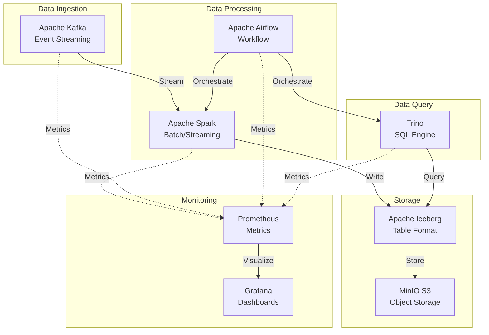

# 빅데이터 애플리케이션 배포 가이드

## 📋 개요

이 가이드는 DataOps 대시보드에 필요한 빅데이터 애플리케이션을 Kubernetes 클러스터에 배포하는 방법을 설명합니다.

### 배포 애플리케이션

| 애플리케이션 | 용도 | Namespace | 메트릭 수집 |
|------------|------|-----------|------------|
| **Apache Spark** | 배치/스트리밍 데이터 처리 | `spark` | Prometheus Metrics |
| **Apache Kafka** | 실시간 이벤트 스트리밍 | `kafka` | JMX Exporter |
| **Apache Airflow** | 워크플로우 오케스트레이션 | `airflow` | StatsD → Prometheus |
| **Trino** | 분산 쿼리 엔진 | `trino` | JMX Exporter |

---

## 🏗️ 아키텍처



---

## 🚀 배포 방법

### 옵션 1: ArgoCD GitOps 배포 (권장)

#### 1. Git Repository 준비

```bash
# 현재 디렉토리 구조 확인
ls -la /root/develop/thanos/deploy-new/

deploy-new/
├── base/
│   ├── spark/
│   │   ├── kustomization.yaml
│   │   ├── values.yaml
│   │   └── servicemonitor.yaml
│   └── kafka/
│       ├── kustomization.yaml
│       └── values.yaml
└── overlays/
    └── cluster-01-central/
        ├── spark/
        │   ├── kustomization.yaml
        │   ├── namespace.yaml
        │   └── values-patch.yaml
        └── kafka/
            ├── kustomization.yaml
            └── namespace.yaml
```

#### 2. Git Repository에 Push

```bash
cd /root/develop/thanos

# Git 초기화 (처음인 경우)
git init
git add .
git commit -m "feat: Add BigData applications (Spark, Kafka, Airflow, Trino)"

# Remote Repository 설정
git remote add origin https://github.com/your-org/thanos-multi-cluster.git
git branch -M main
git push -u origin main
```

#### 3. ArgoCD Application 생성

```bash
# Spark 배포
kubectl apply -f argocd/applications/bigdata/spark.yaml

# Kafka 배포
kubectl apply -f argocd/applications/bigdata/kafka.yaml

# 상태 확인
kubectl get applications -n argocd
```

#### 4. ArgoCD UI에서 Sync

1. ArgoCD UI 접속: http://argocd.k8s-cluster-01.miribit.lab
2. Applications → `spark` 선택
3. `SYNC` 버튼 클릭
4. `SYNCHRONIZE` 확인

---

### 옵션 2: Kustomize 직접 배포

#### Apache Spark 배포

```bash
# Namespace 생성
kubectl create namespace spark

# Kustomize 빌드 및 배포
kubectl apply -k /root/develop/thanos/deploy-new/overlays/cluster-01-central/spark

# 배포 확인
kubectl get pods -n spark
kubectl get svc -n spark
```

**예상 출력:**
```
NAME                    READY   STATUS    RESTARTS   AGE
spark-master-0          1/1     Running   0          2m
spark-worker-0          1/1     Running   0          2m
spark-worker-1          1/1     Running   0          2m
spark-worker-2          1/1     Running   0          2m
```

#### Apache Kafka 배포

```bash
# Namespace 생성
kubectl create namespace kafka

# Kustomize 빌드 및 배포
kubectl apply -k /root/develop/thanos/deploy-new/overlays/cluster-01-central/kafka

# 배포 확인
kubectl get pods -n kafka
```

**예상 출력:**
```
NAME        READY   STATUS    RESTARTS   AGE
kafka-0     1/1     Running   0          3m
kafka-1     1/1     Running   0          3m
kafka-2     1/1     Running   0          3m
```

---

## 🔍 메트릭 수집 확인

### Prometheus에서 메트릭 확인

```bash
# Spark 메트릭 확인
kubectl exec -n monitoring prometheus-kube-prometheus-stack-prometheus-0 -- \
  wget -q -O- 'http://localhost:9090/api/v1/query?query=spark_application_running' | jq

# Kafka 메트릭 확인
kubectl exec -n monitoring prometheus-kube-prometheus-stack-prometheus-0 -- \
  wget -q -O- 'http://localhost:9090/api/v1/query?query=kafka_server_brokertopicmetrics_messagesin_total' | jq
```

### ServiceMonitor 확인

```bash
# ServiceMonitor 목록
kubectl get servicemonitor -n spark
kubectl get servicemonitor -n kafka

# ServiceMonitor 상세
kubectl describe servicemonitor spark-metrics -n spark
```

### Prometheus Targets 확인

1. Prometheus UI 접속: http://prometheus.k8s-cluster-01.miribit.lab
2. Status → Targets
3. `spark` 및 `kafka` Endpoint 상태 확인
4. 모든 Target이 `UP` 상태여야 함

---

## 📊 Grafana 대시보드 확인

### 메트릭 데이터 확인

1. Grafana UI 접속: http://grafana.k8s-cluster-01.miribit.lab
2. Explore 메뉴 선택
3. PromQL 쿼리 테스트:

```promql
# Spark Job 실행 수
spark_application_running

# Kafka 메시지 유입율
rate(kafka_server_brokertopicmetrics_messagesin_total[5m])

# Kafka Consumer Lag
kafka_consumer_group_lag
```

### DataOps 대시보드 확인

1. Dashboards → DataOps - Portal
2. Workload Performance Dashboard 접속
3. Spark/Kafka 메트릭 패널 확인
4. Data Pipeline Dashboard 접속
5. Kafka Pipeline 메트릭 확인

---

## 🧪 기능 테스트

### Spark Job 실행 테스트

```bash
# Spark Shell 접속
kubectl exec -it spark-master-0 -n spark -- spark-shell

# Scala 코드 실행
scala> val data = sc.parallelize(1 to 100)
scala> data.sum()
scala> :quit
```

### Kafka Topic 생성 및 테스트

```bash
# Kafka Pod에 접속
kubectl exec -it kafka-0 -n kafka -- bash

# Topic 생성
kafka-topics.sh --bootstrap-server localhost:9092 --create --topic test-topic --partitions 3 --replication-factor 2

# Producer 테스트
kafka-console-producer.sh --bootstrap-server localhost:9092 --topic test-topic
> hello world
> test message
^C

# Consumer 테스트
kafka-console-consumer.sh --bootstrap-server localhost:9092 --topic test-topic --from-beginning
```

---

## 🔧 문제 해결

### Spark Master가 Running이지만 Worker 연결 안 됨

**증상:**
```bash
kubectl logs spark-master-0 -n spark
# Master started but no workers connected
```

**해결:**
```bash
# Worker 로그 확인
kubectl logs spark-worker-0 -n spark

# Service 확인
kubectl get svc -n spark

# Master URL 확인
kubectl exec spark-worker-0 -n spark -- env | grep SPARK_MASTER_URL
```

### Kafka Broker가 Ready 상태가 안 됨

**증상:**
```bash
kubectl get pods -n kafka
# kafka-0   0/1   CrashLoopBackOff
```

**해결:**
```bash
# 로그 확인
kubectl logs kafka-0 -n kafka

# PVC 확인 (스토리지 문제 가능성)
kubectl get pvc -n kafka

# Longhorn 볼륨 확인
kubectl get pv | grep kafka
```

### Prometheus에 메트릭이 안 보임

**증상:**
Prometheus에서 `spark_*` 또는 `kafka_*` 메트릭이 조회되지 않음

**해결:**
```bash
# ServiceMonitor 확인
kubectl get servicemonitor -A

# Service Endpoints 확인
kubectl get endpoints -n spark
kubectl get endpoints -n kafka

# Prometheus Operator 로그
kubectl logs -n monitoring -l app.kubernetes.io/name=prometheus-operator

# ServiceMonitor에 올바른 Label이 있는지 확인
kubectl get servicemonitor spark-metrics -n spark -o yaml | grep -A5 labels
```

---

## 📚 참고 자료

### Helm Charts
- **Bitnami Spark**: https://github.com/bitnami/charts/tree/main/bitnami/spark
- **Bitnami Kafka**: https://github.com/bitnami/charts/tree/main/bitnami/kafka

### Prometheus Metrics
- **Spark Metrics**: https://spark.apache.org/docs/latest/monitoring.html
- **Kafka JMX Metrics**: https://kafka.apache.org/documentation/#monitoring

### Kustomize + Helm
- **Kustomize Helm Generator**: https://kubectl.docs.kubernetes.io/references/kustomize/builtins/#_helmchartinflationgenerator_

---

## ✅ 배포 체크리스트

- [ ] Git Repository에 매니페스트 Push
- [ ] ArgoCD에 Application 생성
- [ ] Spark 배포 완료 및 Pod Running 확인
- [ ] Kafka 배포 완료 및 Pod Running 확인
- [ ] ServiceMonitor 생성 확인
- [ ] Prometheus Targets UP 상태 확인
- [ ] Grafana에서 메트릭 조회 확인
- [ ] DataOps 대시보드에서 데이터 표시 확인
- [ ] Spark Job 테스트 실행
- [ ] Kafka Topic 생성 및 메시지 송수신 테스트

---

## 🚀 다음 단계

1. **Airflow 배포**: 워크플로우 오케스트레이션
2. **Trino 배포**: 분산 SQL 쿼리 엔진
3. **Hive Metastore 배포**: 메타데이터 관리
4. **Iceberg Table 생성**: Data Lake 구축
5. **End-to-End Pipeline 테스트**: Kafka → Spark → Iceberg → Trino

---

**작성일**: 2025-11-07
**업데이트**: 2025-11-07
