# 🏗️ Thanos 멀티클러스터 모니터링 아키텍처

> **문서 목적**: 단일 Prometheus의 한계를 극복하고, 멀티클러스터 환경에서 확장 가능하고 고가용성을 제공하는 모니터링 아키텍처를 이해합니다.

## 📚 목차

- [1. 문제 인식: 왜 Thanos가 필요한가?](#1-문제-인식-왜-thanos가-필요한가)
- [2. 핵심 개념: Thanos 아키텍처 구성요소](#2-핵심-개념-thanos-아키텍처-구성요소)
- [3. 아키텍처 설계: 4-클러스터 멀티클러스터 구성](#3-아키텍처-설계-4-클러스터-멀티클러스터-구성)
- [4. 비교 분석: 세 가지 모니터링 패턴](#4-비교-분석-세-가지-모니터링-패턴)
- [5. 데이터 흐름: 메트릭의 여정](#5-데이터-흐름-메트릭의-여정)

---

## 1. 문제 인식: 왜 Thanos가 필요한가?

### 📖 이야기: 확장의 벽에 부딪힌 모니터링

당신은 4개의 Kubernetes 클러스터를 운영하고 있습니다. 각 클러스터마다 kube-prometheus-stack을 설치했고, 각자의 Grafana에서 메트릭을 확인합니다.

하지만 문제가 생깁니다:

```
문제 1: "전체 클러스터의 CPU 사용률을 한눈에 보려면?"
→ 4개 Grafana를 일일이 열어야 합니다

문제 2: "3개월 전 장애 원인을 분석하려면?"
→ Prometheus는 2시간만 보관합니다 (설정에 따라)

문제 3: "Prometheus 서버가 죽으면?"
→ 그 시간의 메트릭은 영원히 사라집니다

문제 4: "디스크가 가득 찼어요!"
→ 로컬 스토리지는 빠르게 소진됩니다
```

### 🎯 해결책: Thanos의 3가지 핵심 가치

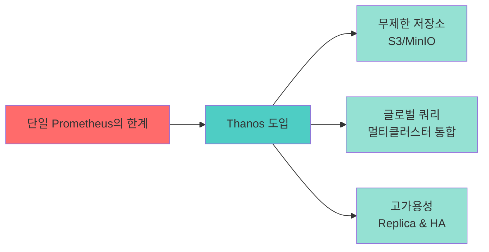

---

## 2. 핵심 개념: Thanos 아키텍처 구성요소

### 🧩 용어집: Thanos Components

| 컴포넌트 | 역할 | 비유 | 배포 위치 |
|---------|------|------|-----------|
| **Thanos Sidecar** | Prometheus의 데이터를 S3에 업로드 | "우체국 집배원" - 메트릭을 S3로 배달 | 모든 클러스터 (Prometheus 옆) |
| **Thanos Query** | 여러 소스에서 데이터 조회 | "중앙 사서" - 모든 책(메트릭)을 찾아줌 | 중앙 클러스터 |
| **Thanos Store Gateway** | S3에서 과거 메트릭 조회 | "도서관 서고" - 오래된 책을 보관 | 중앙 클러스터 |
| **Thanos Compactor** | 오래된 데이터 압축 및 정리 | "도서관 사서" - 중복 제거, 정리 | 중앙 클러스터 |
| **Thanos Ruler** | 글로벌 알림 규칙 평가 | "종합 관제센터" - 전체를 보고 판단 | 중앙 클러스터 |

### 📊 컴포넌트 역할 시각화

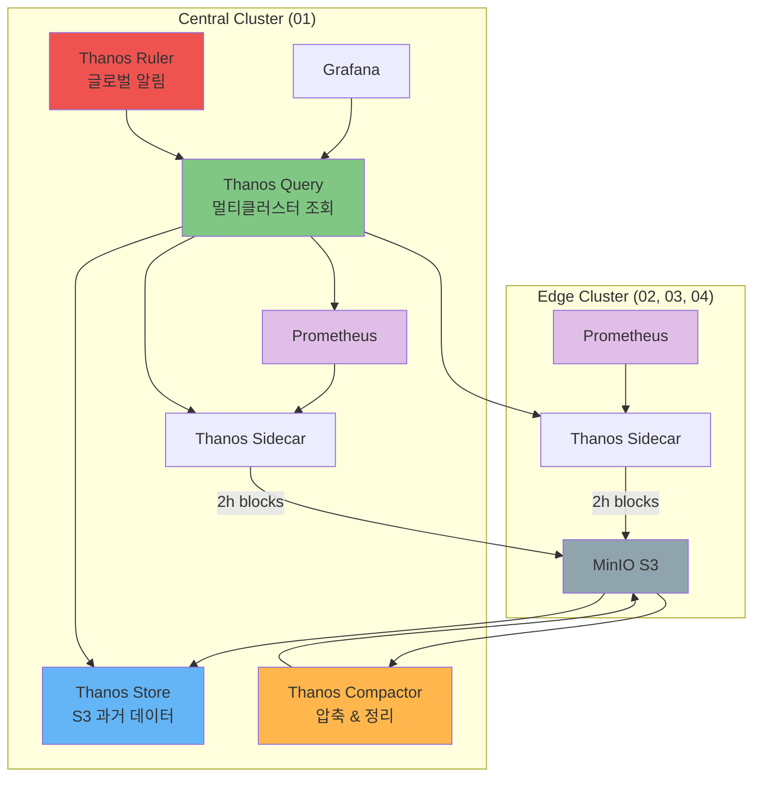

---

## 3. 아키텍처 설계: 4-클러스터 멀티클러스터 구성

### 🎨 전체 아키텍처 개요

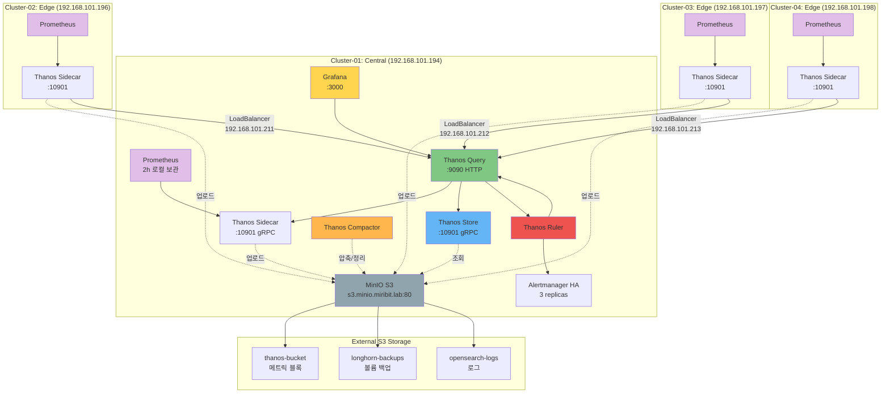

### 🏷️ 클러스터 역할 분담

| 클러스터 | 역할 | Thanos 컴포넌트 | IP | 특징 |
|----------|------|------------------|-----|------|
| **Cluster-01** | Central (중앙) | Sidecar, Query, Store, Compactor, Ruler | 192.168.101.194 | 모든 Thanos 컴포넌트 실행 |
| **Cluster-02** | Edge (엣지) | Sidecar only | 192.168.101.196 | 메트릭 수집 및 업로드만 |
| **Cluster-03** | Edge (엣지) | Sidecar only | 192.168.101.197 | 메트릭 수집 및 업로드만 |
| **Cluster-04** | Edge (엣지) | Sidecar only | 192.168.101.198 | 메트릭 수집 및 업로드만 |

### 🔐 보안 및 네트워킹

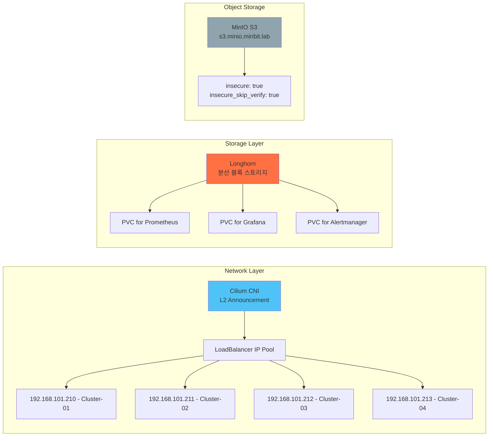

---

## 4. 비교 분석: 세 가지 모니터링 패턴

### 📊 Pattern 1: 단일 kube-prometheus-stack (기본)

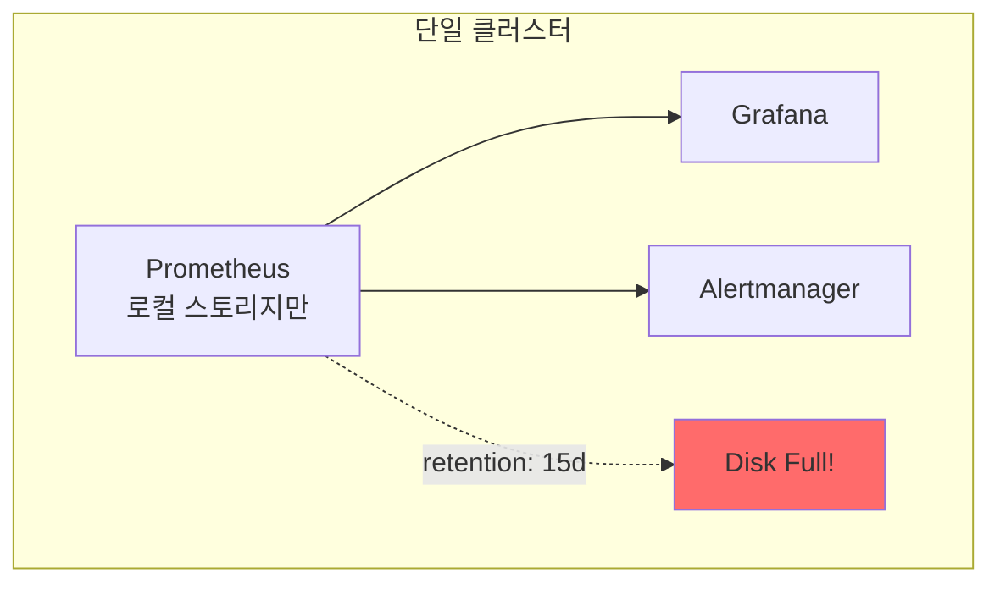

**특징:**
- ✅ 간단한 설치
- ✅ 낮은 리소스 사용
- ❌ 스토리지 제한 (디스크 용량)
- ❌ 단일 장애점 (SPOF)
- ❌ 멀티클러스터 불가

### 📊 Pattern 2: 독립된 Observability 클러스터

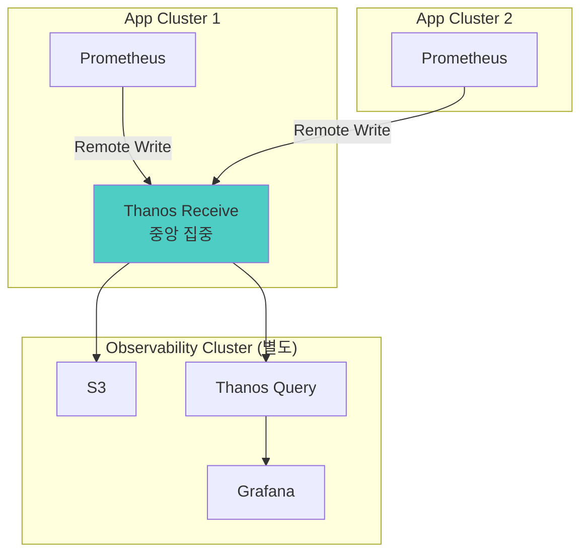

**특징:**
- ✅ 완전한 분리 (관측성 독립)
- ✅ 무제한 저장소
- ❌ 별도 클러스터 필요 (비용↑)
- ❌ Remote Write 부하
- ❌ 네트워크 의존성

### 📊 Pattern 3: 멀티클러스터 Thanos with Sidecar (현재 구성)

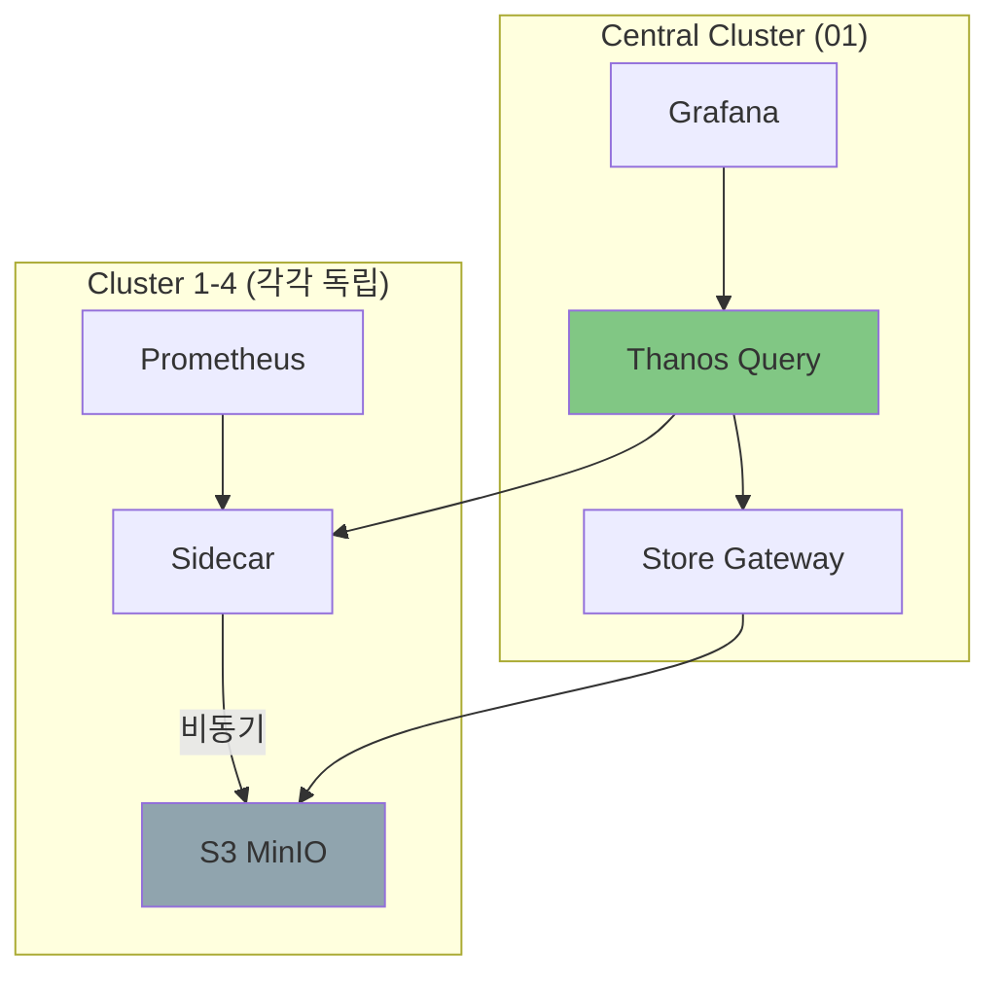

**특징:**
- ✅ 클러스터 독립성 유지
- ✅ 무제한 저장소 (S3)
- ✅ 비동기 업로드 (낮은 영향)
- ✅ 글로벌 쿼리 가능
- ⚠️ Sidecar 리소스 필요

### 🔍 상세 비교표

| 항목 | 단일 Prometheus | 독립 Observability | Thanos Sidecar (현재) |
|------|----------------|-------------------|----------------------|
| **복잡도** | ⭐ 낮음 | ⭐⭐⭐⭐⭐ 매우 높음 | ⭐⭐⭐ 중간 |
| **설치 시간** | 5분 | 2시간+ | 30분 |
| **스토리지** | 로컬 디스크만 | S3 (무제한) | S3 (무제한) |
| **데이터 보관** | 15일 (디스크 제한) | 무제한 | 무제한 |
| **멀티클러스터** | ❌ 불가 | ✅ 가능 | ✅ 가능 |
| **단일 장애점** | ❌ 있음 | ✅ 없음 | ⚠️ Query는 SPOF |
| **리소스 사용** | CPU: 0.5<br/>Mem: 1Gi | CPU: 3.0+<br/>Mem: 8Gi+ | CPU: 1.5<br/>Mem: 3Gi |
| **네트워크 부하** | 낮음 | 높음 (Remote Write) | 중간 (비동기) |
| **쿼리 성능** | 빠름 (로컬) | 중간 | 중간 |
| **HA 지원** | ❌ 없음 | ✅ 완전 | ⚠️ Query만 |
| **운영 복잡도** | 낮음 | 매우 높음 | 중간 |
| **장애 영향 범위** | 전체 | 관측성만 | Query만 |
| **비용** | $ | $$$$ | $$ |
| **적합한 환경** | 단일 클러스터<br/>Dev/Test | 대규모 엔터프라이즈<br/>100+ 클러스터 | 중소규모<br/>2-20 클러스터 |

### 💡 의사결정 가이드

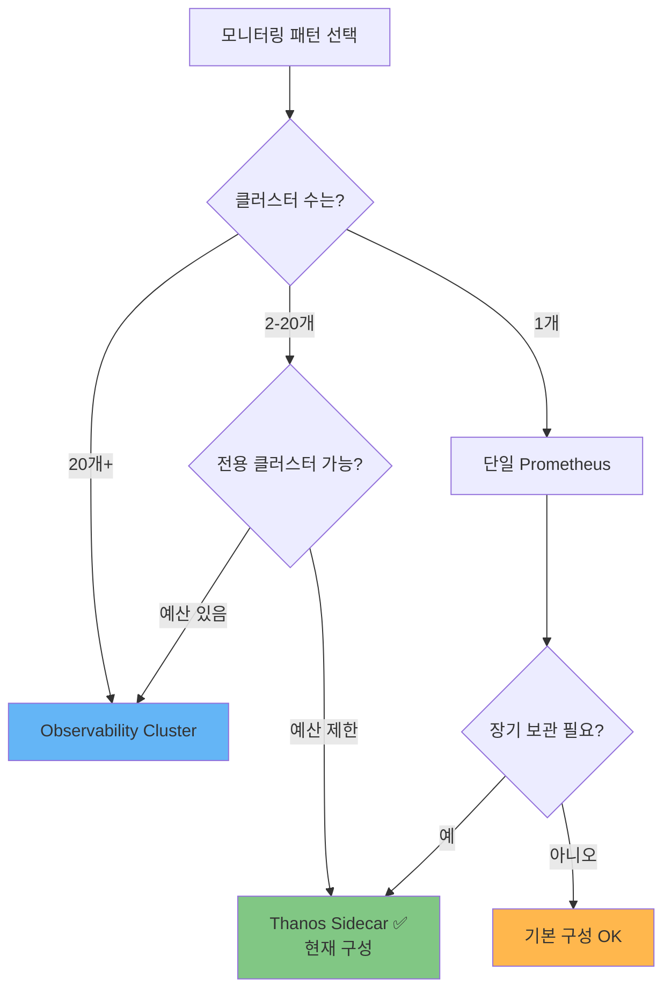

---

## 5. 데이터 흐름: 메트릭의 여정

### 🚀 메트릭 라이프사이클

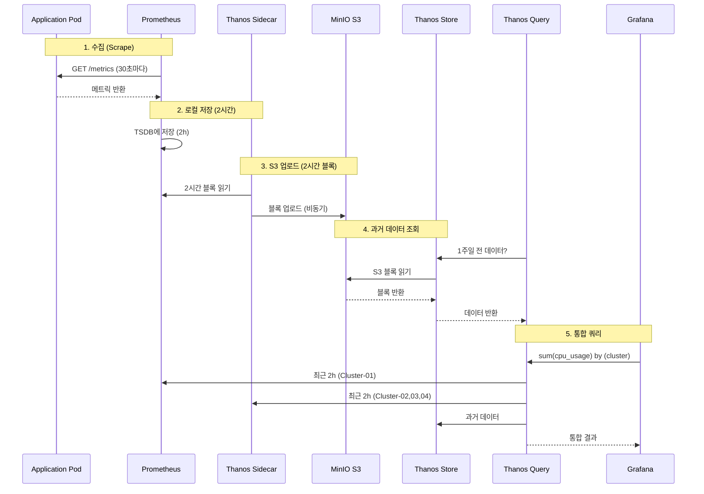

### 📦 블록 생성 및 압축 과정

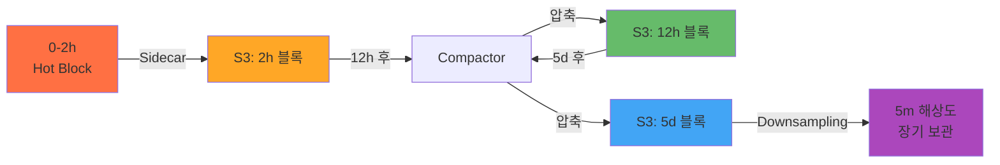

**블록 압축 정책:**
- 2시간 블록 → 12시간 블록 (12시간 후)
- 12시간 블록 → 5일 블록 (5일 후)
- 5일 블록 → Downsampling (5분 해상도)

### 🔄 고가용성 (HA) 구성

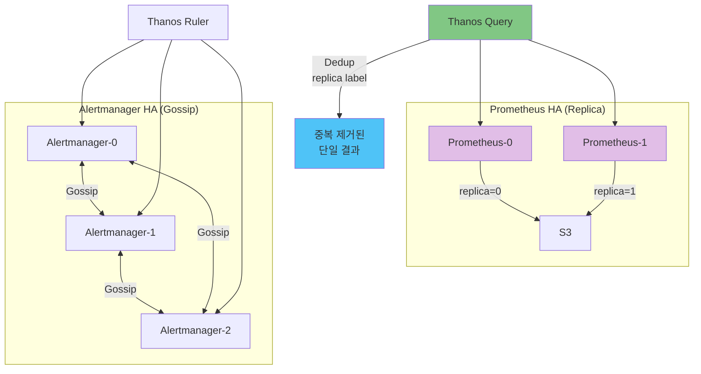

---

## 🎓 핵심 요약

### ✅ 이 아키텍처가 해결하는 문제

1. **스토리지 제한** → S3 무제한 저장 (thanos-bucket)
2. **멀티클러스터 분산** → Thanos Query로 통합 조회
3. **데이터 손실** → Sidecar 비동기 업로드 + S3 영구 보관
4. **단일 장애점** → Prometheus Replica + Alertmanager HA
5. **운영 복잡도** → Kustomize + Helm으로 표준화

### 🔑 설계 원칙

```
원칙 1: 클러스터 독립성
→ 각 클러스터는 독립적으로 작동 (네트워크 단절 OK)

원칙 2: 비동기 업로드
→ S3 업로드 실패해도 Prometheus는 계속 동작

원칙 3: 중앙 집중 쿼리
→ Cluster-01이 모든 쿼리를 담당

원칙 4: 스토리지 분리
→ 메트릭(thanos-bucket), 로그(opensearch-logs), 백업(longhorn-backups)

원칙 5: HA는 선택적
→ Critical 컴포넌트만 HA (Alertmanager, Prometheus Replica)
```

### 📚 다음 문서

- [배포 가이드](./DEPLOYMENT_GUIDE.md) - 단계별 설치 방법
- [운영 가이드](./OPERATIONS.md) - 일상 운영 작업
- [트러블슈팅](./TROUBLESHOOTING.md) - 문제 해결

---

**Last Updated**: 2025-10-15
**Architecture Version**: 1.0
**Document Style**: Domain-driven + Narrative-first Technical
