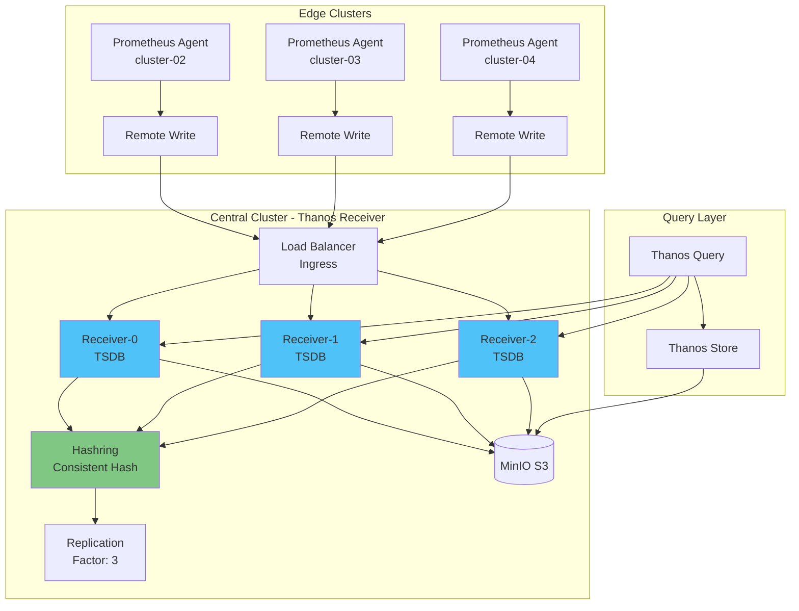
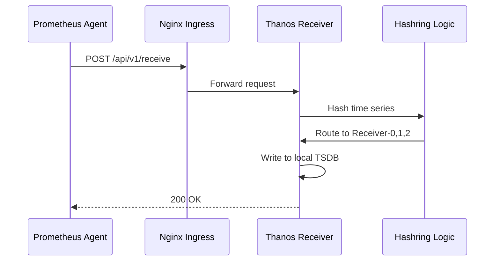
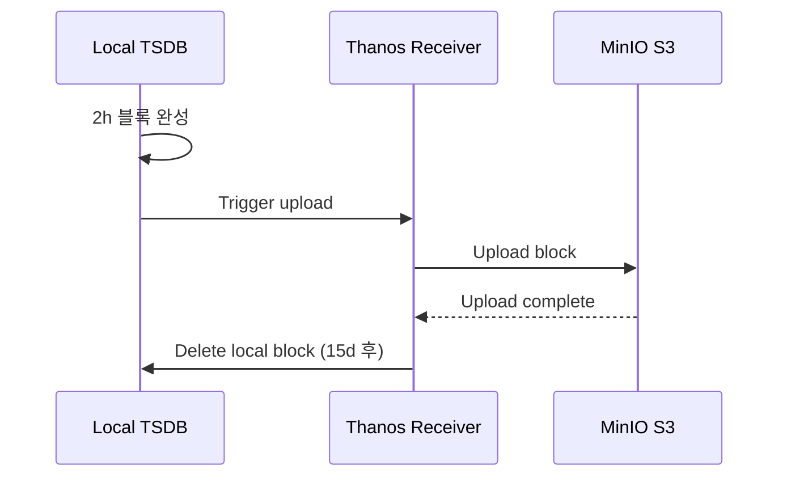

# Thanos Receiver 패턴

## 📋 개요

Thanos Receiver는 Prometheus Remote Write 프로토콜로 메트릭을 수신하여 TSDB에 저장하는 컴포넌트입니다. 멀티클러스터 환경에서 중앙집중식 메트릭 수집의 핵심 역할을 합니다.

---

## 🏗️ Thanos Receiver 아키텍처



---

## 🎯 주요 개념

### 1. Remote Write Endpoint
- **포트**: 19291 (HTTP)
- **프로토콜**: Prometheus Remote Write (Protocol Buffers over HTTP)
- **URL**: `http://thanos-receive:19291/api/v1/receive`

### 2. Hashring (Consistent Hashing)
- **목적**: 수평 확장 및 부하 분산
- **동작**:
  - 시계열을 해시하여 Receiver 노드에 분배
  - 노드 추가/제거 시 재분배 최소화
  - 테넌트별 격리 가능

### 3. Replication Factor
- **목적**: 고가용성 및 데이터 손실 방지
- **설정**: `--receive.replication-factor=3`
- **동작**: 동일 데이터를 N개 Receiver에 복제
- **주의**: 스토리지 사용량 N배 증가

### 4. TSDB (Time Series Database)
- **경로**: `/data` (PVC)
- **블록 크기**: 2시간
- **업로드**: 2시간마다 S3로 자동 업로드
- **보존 기간**: 로컬 TSDB 15일, S3 무제한

---

## ⚙️ Receiver 배포 구성

### StatefulSet 설정
```yaml
apiVersion: apps/v1
kind: StatefulSet
metadata:
  name: thanos-receive
  namespace: monitoring
spec:
  replicas: 3
  serviceName: thanos-receive
  selector:
    matchLabels:
      app: thanos-receive
  template:
    metadata:
      labels:
        app: thanos-receive
    spec:
      containers:
      - name: thanos-receive
        image: quay.io/thanos/thanos:v0.31.0
        args:
        - receive
        - --tsdb.path=/data
        - --grpc-address=0.0.0.0:10901
        - --http-address=0.0.0.0:10902
        - --remote-write.address=0.0.0.0:19291
        - --receive.replication-factor=3
        - --receive.hashrings-file=/etc/thanos/hashrings.json
        - --label=receive="true"
        - --label=replica="$(POD_NAME)"
        - --objstore.config-file=/etc/thanos/objstore.yml
        - --tsdb.retention=15d
        env:
        - name: POD_NAME
          valueFrom:
            fieldRef:
              fieldPath: metadata.name
        ports:
        - name: http
          containerPort: 10902
        - name: grpc
          containerPort: 10901
        - name: remote-write
          containerPort: 19291
        resources:
          requests:
            cpu: 1000m
            memory: 2Gi
          limits:
            cpu: 2000m
            memory: 4Gi
        volumeMounts:
        - name: data
          mountPath: /data
        - name: hashring-config
          mountPath: /etc/thanos
      volumes:
      - name: hashring-config
        configMap:
          name: thanos-receive-hashring
  volumeClaimTemplates:
  - metadata:
      name: data
    spec:
      accessModes: ["ReadWriteOnce"]
      storageClassName: longhorn
      resources:
        requests:
          storage: 100Gi
```

### Hashring ConfigMap
```yaml
apiVersion: v1
kind: ConfigMap
metadata:
  name: thanos-receive-hashring
  namespace: monitoring
data:
  hashrings.json: |
    [
      {
        "hashring": "default",
        "endpoints": [
          "thanos-receive-0.thanos-receive.monitoring.svc.cluster.local:10901",
          "thanos-receive-1.thanos-receive.monitoring.svc.cluster.local:10901",
          "thanos-receive-2.thanos-receive.monitoring.svc.cluster.local:10901"
        ],
        "tenants": []
      }
    ]
```

### Service 설정
```yaml
apiVersion: v1
kind: Service
metadata:
  name: thanos-receive
  namespace: monitoring
spec:
  clusterIP: None  # Headless for StatefulSet
  ports:
  - name: grpc
    port: 10901
    targetPort: 10901
  - name: http
    port: 10902
    targetPort: 10902
  - name: remote-write
    port: 19291
    targetPort: 19291
  selector:
    app: thanos-receive
---
apiVersion: v1
kind: Service
metadata:
  name: thanos-receive-lb
  namespace: monitoring
spec:
  type: ClusterIP
  ports:
  - name: remote-write
    port: 19291
    targetPort: 19291
  selector:
    app: thanos-receive
```

---

## 🔄 데이터 플로우

### 1. 메트릭 수신


### 2. S3 업로드


---

## 📊 Hashring 예제

### 단일 Hashring (모든 클러스터)
```json
[
  {
    "hashring": "default",
    "endpoints": [
      "thanos-receive-0.thanos-receive:10901",
      "thanos-receive-1.thanos-receive:10901",
      "thanos-receive-2.thanos-receive:10901"
    ],
    "tenants": []
  }
]
```
- **용도**: 모든 엣지 클러스터 메트릭을 default hashring에 분배
- **부하 분산**: Consistent hashing으로 자동 분배

### 다중 Hashring (테넌트별 분리)
```json
[
  {
    "hashring": "tenant-a",
    "endpoints": [
      "thanos-receive-0.thanos-receive:10901",
      "thanos-receive-1.thanos-receive:10901"
    ],
    "tenants": ["cluster-02-tenant-a"]
  },
  {
    "hashring": "tenant-b",
    "endpoints": [
      "thanos-receive-2.thanos-receive:10901"
    ],
    "tenants": ["cluster-02-tenant-b"]
  },
  {
    "hashring": "default",
    "endpoints": [
      "thanos-receive-0.thanos-receive:10901",
      "thanos-receive-1.thanos-receive:10901",
      "thanos-receive-2.thanos-receive:10901"
    ],
    "tenants": []
  }
]
```
- **용도**: cluster-02 멀티테넌시 환경에서 테넌트별 격리
- **설정**: Prometheus Agent에 `X-Prometheus-Remote-Write-Tenant` 헤더 추가

---

## 🔐 보안 및 인증

### TLS 설정
```yaml
# Ingress에서 TLS 종료
apiVersion: networking.k8s.io/v1
kind: Ingress
metadata:
  name: thanos-receive-ingress
  namespace: monitoring
  annotations:
    cert-manager.io/cluster-issuer: selfsigned-issuer
spec:
  ingressClassName: nginx
  tls:
  - hosts:
    - thanos-receive.monitoring.svc.cluster.local
    secretName: thanos-receive-tls
  rules:
  - host: thanos-receive.monitoring.svc.cluster.local
    http:
      paths:
      - path: /api/v1/receive
        pathType: Prefix
        backend:
          service:
            name: thanos-receive-lb
            port:
              number: 19291
```

### Basic Auth (Optional)
```yaml
# Prometheus Agent에서 Basic Auth 설정
server:
  remoteWrite:
    - url: https://thanos-receive:19291/api/v1/receive
      basicAuth:
        username:
          name: thanos-receive-auth
          key: username
        password:
          name: thanos-receive-auth
          key: password
```

---

## 📈 모니터링 및 메트릭

### 주요 메트릭

#### Remote Write 수신
```promql
# 초당 수신 메트릭 수
rate(thanos_receive_replication_requests_total[5m])

# Remote Write 요청 레이턴시
histogram_quantile(0.99, rate(thanos_receive_http_request_duration_seconds_bucket[5m]))
```

#### Hashring 상태
```promql
# Hashring 노드 수
thanos_receive_hashring_nodes

# Hashring 변경 횟수
thanos_receive_hashring_file_refreshes_total
```

#### TSDB 메트릭
```promql
# TSDB 블록 수
thanos_receive_tsdb_blocks_loaded

# TSDB 디스크 사용량
prometheus_tsdb_storage_blocks_bytes{job="thanos-receive"}
```

#### Replication
```promql
# Replication 성공률
rate(thanos_receive_replications_total{result="success"}[5m])
/
rate(thanos_receive_replications_total[5m])
```

---

## 🚨 알림 규칙

### Receiver Down
```yaml
- alert: ThanosReceiverDown
  expr: up{job="thanos-receive"} == 0
  for: 2m
  labels:
    severity: critical
  annotations:
    summary: "Thanos Receiver {{ $labels.pod }} is down"
    description: "Receiver has been down for more than 2 minutes"
```

### Remote Write 실패
```yaml
- alert: RemoteWriteFailureRate
  expr: |
    rate(thanos_receive_replication_requests_total{result="error"}[5m])
    /
    rate(thanos_receive_replication_requests_total[5m]) > 0.01
  for: 5m
  labels:
    severity: warning
  annotations:
    summary: "High Remote Write failure rate"
    description: "{{ $value | humanizePercentage }} of Remote Write requests failing"
```

### TSDB 디스크 부족
```yaml
- alert: ReceiverDiskSpaceLow
  expr: |
    (
      kubelet_volume_stats_available_bytes{persistentvolumeclaim=~"data-thanos-receive-.*"}
      /
      kubelet_volume_stats_capacity_bytes{persistentvolumeclaim=~"data-thanos-receive-.*"}
    ) < 0.1
  for: 5m
  labels:
    severity: warning
  annotations:
    summary: "Receiver TSDB disk space < 10%"
```

---

## 🔧 트러블슈팅

### Remote Write 타임아웃
**증상**: Prometheus Agent 로그에 `remote write timeout` 에러

**원인**:
1. Receiver 부하 과다
2. 네트워크 지연
3. TSDB 디스크 I/O 병목

**해결**:
```bash
# Receiver 리소스 증설
kubectl patch statefulset thanos-receive -n monitoring --patch '
spec:
  template:
    spec:
      containers:
      - name: thanos-receive
        resources:
          requests:
            cpu: 2000m
            memory: 4Gi
'

# Replica 증가
kubectl scale statefulset thanos-receive -n monitoring --replicas=5
```

### Hashring 변경 감지 안 됨
**증상**: ConfigMap 변경 후에도 Receiver가 기존 Hashring 사용

**해결**:
```bash
# Receiver Pod 재시작 (Rolling restart)
kubectl rollout restart statefulset thanos-receive -n monitoring
```

---

## 🔗 관련 문서

- **전체 시스템 아키텍처** → [전체-시스템-아키텍처.md](./전체-시스템-아키텍처.md)
- **고가용성 설계** → [고가용성-설계.md](./고가용성-설계.md)
- **성능 최적화** → [../09-성능-최적화/Receiver-성능-튜닝.md](../09-성능-최적화/Receiver-성능-튜닝.md)

---

**최종 업데이트**: 2025-10-20
