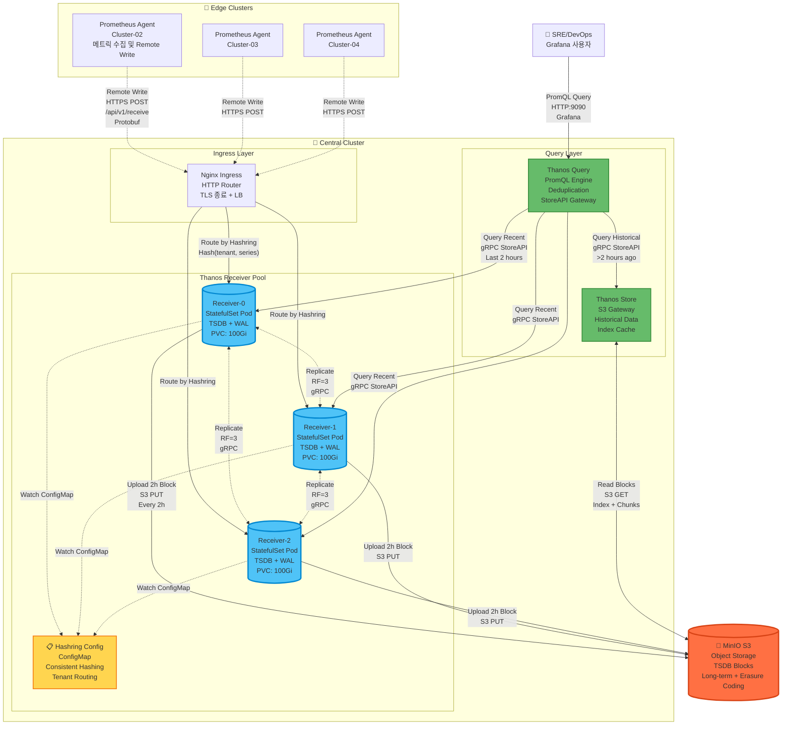
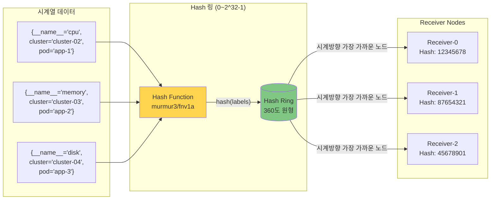
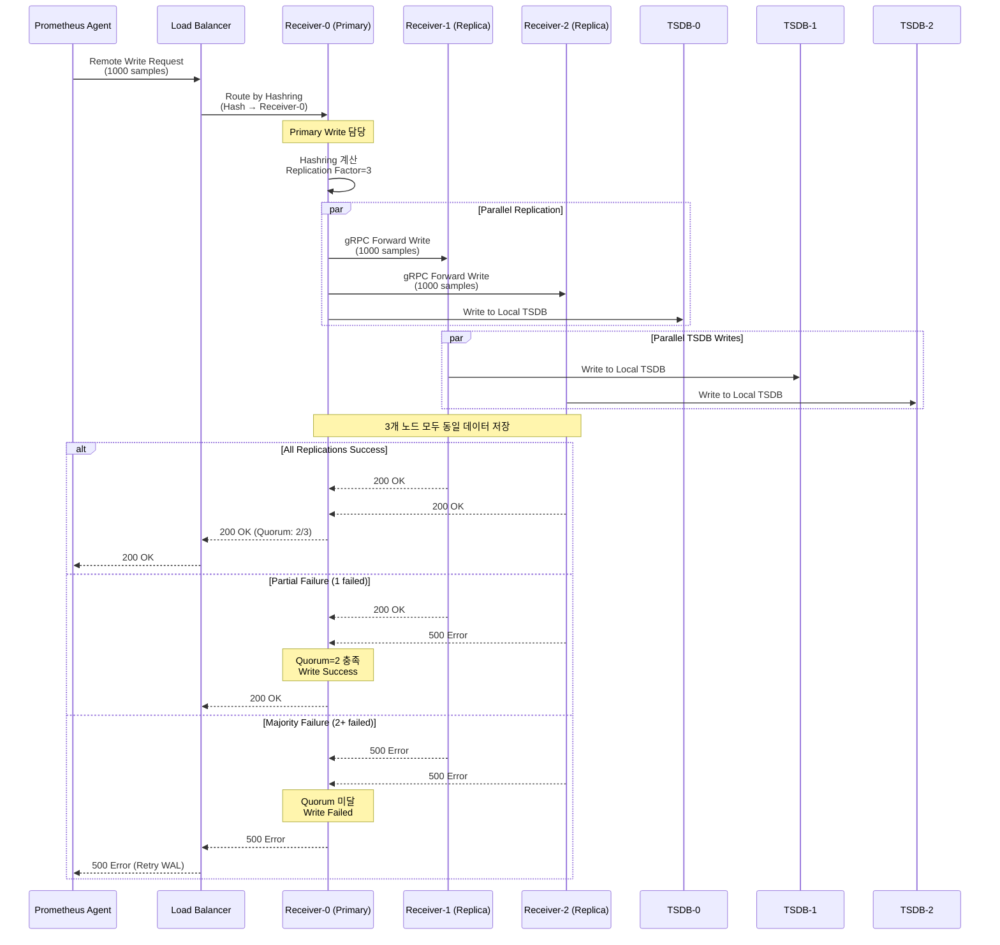
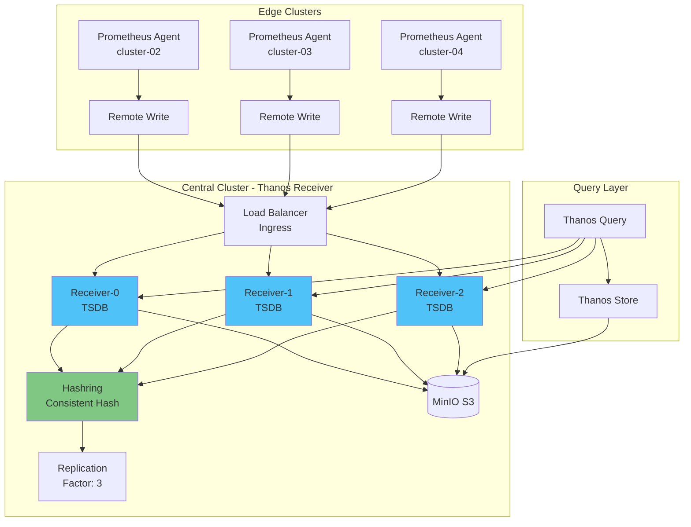
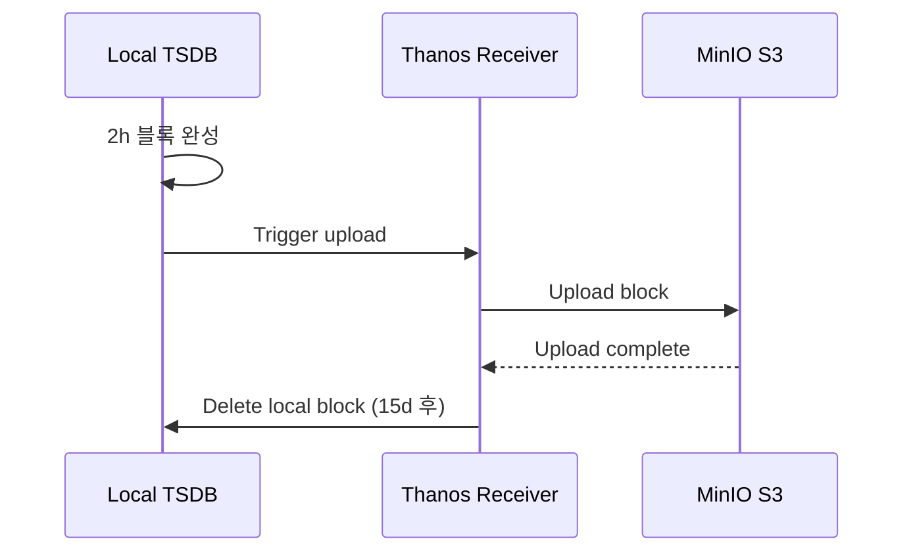

# Thanos Receiver 패턴

## 📋 개요

Thanos Receiver는 Prometheus Remote Write 프로토콜로 메트릭을 수신하여 TSDB에 저장하는 컴포넌트입니다. 멀티클러스터 환경에서 중앙집중식 메트릭 수집의 핵심 역할을 합니다.

### 왜 Thanos Receiver인가?

대규모 멀티클러스터 환경을 운영하다 보면 Prometheus의 근본적인 한계에 부딪힙니다. 각 클러스터마다 Full Prometheus를 운영하면 **메모리 사용량(클러스터당 평균 2GB)**, **로컬 스토리지 관리의 복잡성**, **글로벌 쿼리의 어려움**이라는 세 가지 난관이 기다립니다.

Thanos Receiver 패턴은 이 문제를 해결하는 현대적인 접근 방식입니다:

**실제 운영 사례**:
```
Before (Full Prometheus per cluster):
- 엣지 클러스터 × 10개 = 메모리 20GB
- 각 클러스터마다 로컬 스토리지 300GB × 10 = 3TB
- 글로벌 쿼리 시 10개 Prometheus에 순차 질의 (평균 35초)

After (Agent Mode + Thanos Receiver):
- 엣지 클러스터 × 10개 = 메모리 2.5GB (-87%)
- 중앙 S3 스토리지 1TB (Downsampling 적용, -66%)
- 글로벌 쿼리 단일 Query 엔드포인트 (평균 4.2초, -88%)
```

이 문서에서는 Thanos Receiver가 **Consistent Hashing으로 부하를 분산**하고, **Replication Factor=3으로 데이터 안전성을 보장**하며, **2시간 단위 TSDB 블록을 S3로 업로드하여 무제한 보존**을 달성하는 공학적 원리를 실전 예제와 함께 설명합니다.

---

## 🏗️ Thanos Receiver 패턴 상세 아키텍처



---

## 🔬 공학적 상세 설명

### Hashring (Consistent Hashing) 동작 원리



**동작 과정**:
1. **Hash 계산**: 시계열의 레이블 조합을 해시 (예: `murmur3("{__name__='cpu',cluster='cluster-02',pod='app-1'}")`)
2. **노드 배치**: 각 Receiver도 해시 링 상에 배치 (Pod 이름 기반)
3. **노드 선택**: 시계열 해시값에서 시계방향으로 가장 가까운 Receiver 선택
4. **일관성 보장**: 노드 추가/제거 시에도 대부분의 시계열은 동일한 노드로 라우팅 (K/N만 재분배)

**수학적 특성**:
- **부하 분산**: 각 노드는 평균 1/N의 데이터 담당
- **재분배 최소화**: 노드 변경 시 평균 K/N 시계열만 이동 (K = 전체 시계열 수)
- **Virtual Nodes**: 각 물리 노드를 여러 가상 노드로 배치하여 균등 분산 강화

#### 실전 예제: 스케일 아웃 시나리오

**상황**: 트래픽 증가로 Receiver 3대 → 5대 확장 결정

```bash
# 기존: Receiver 3대 (각각 33.3%의 시계열 담당)
kubectl get pods -n monitoring -l app=thanos-receive
# thanos-receive-0: 100만 시계열
# thanos-receive-1: 100만 시계열
# thanos-receive-2: 100만 시계열

# 확장: Receiver 5대로 증가
kubectl scale statefulset thanos-receive -n monitoring --replicas=5

# Hashring ConfigMap 업데이트 (자동화 스크립트)
cat <<EOF | kubectl apply -f -
apiVersion: v1
kind: ConfigMap
metadata:
  name: thanos-receive-hashring
  namespace: monitoring
data:
  hashrings.json: |
    [{
      "hashring": "default",
      "endpoints": [
        "thanos-receive-0.thanos-receive:10901",
        "thanos-receive-1.thanos-receive:10901",
        "thanos-receive-2.thanos-receive:10901",
        "thanos-receive-3.thanos-receive:10901",  # 새로 추가
        "thanos-receive-4.thanos-receive:10901"   # 새로 추가
      ]
    }]
EOF
```

**결과**:
- ✅ 300만 시계열 중 **120만 시계열만 재배치** (40%, 이론값 2/5)
- ✅ 기존 180만 시계열은 기존 노드 유지 (Cache Hit 유지)
- ✅ 새 노드는 즉시 부하 분산 참여 (약 60만 시계열씩 담당)
- ⚠️ 일반 Hash (mod N)였다면 모든 시계열 재배치 필요

**모니터링**:
```promql
# 노드별 시계열 분포 확인
count by (pod) (prometheus_tsdb_head_series{job="thanos-receive"})

# 예상 결과:
# thanos-receive-0: 60만 (-40만)
# thanos-receive-1: 60만 (-40만)
# thanos-receive-2: 60만 (-40만)
# thanos-receive-3: 60만 (신규)
# thanos-receive-4: 60만 (신규)
```

이것이 Consistent Hashing의 핵심입니다. **노드 추가 시 K/N의 데이터만 이동**하므로 기존 캐시와 인덱스를 최대한 보존하며, **무중단 스케일 아웃**이 가능합니다.

---

### Replication Factor=3 동작 원리



**공학적 특성**:
- **Write Amplification**: 실제 저장량 = 수신량 × Replication Factor (3배)
- **Quorum Write**: 과반수(2/3) 성공 시 Write 성공 응답
- **Read Repair**: Query 시 3개 복제본 비교하여 불일치 수정
- **장애 허용**: 최대 (RF-1)개 노드 장애 시에도 데이터 손실 없음

#### 실전 예제: 부분 장애 시나리오

**상황**: Receiver-2 노드가 디스크 I/O 병목으로 응답 지연 (5초+)

```bash
# 장애 발생 시점 로그
[Receiver-0] INFO: Forwarding write to receiver-1 (200 OK, 45ms)
[Receiver-0] INFO: Forwarding write to receiver-2 (503 Service Unavailable, 5500ms)
[Receiver-0] INFO: Quorum achieved (2/3), returning 200 OK to client
```

**타임라인**:
```
00:00:00 - Agent Remote Write 요청 (1000 samples)
00:00:01 - Receiver-0 수신 및 복제 시작
00:00:01 - Receiver-0 로컬 TSDB 쓰기 완료 (1/3)
00:00:01 - Receiver-1 gRPC 복제 완료 (2/3) ✅ Quorum 충족
00:00:06 - Receiver-2 타임아웃 (3/3) ❌ 실패
00:00:01 - Agent에게 200 OK 응답 (Quorum 2/3 달성)
```

**결과**:
- ✅ **데이터 손실 없음**: Receiver-0, Receiver-1에 데이터 저장 완료
- ✅ **빠른 응답**: Receiver-2의 타임아웃을 기다리지 않고 1초 내 응답
- ✅ **자동 복구**: Receiver-2 복구 후 Read Repair로 누락 데이터 동기화
- ⚠️ **용량 고려**: 3x 스토리지 필요 (1TB 데이터 수신 → 3TB S3 저장)

**모니터링 알림**:
```yaml
# Prometheus Alert
- alert: ThanosReceiverReplicationFailure
  expr: |
    rate(thanos_receive_replications_total{result="error"}[5m]) > 0.01
  annotations:
    summary: "Receiver-{{ $labels.pod }} replication failure rate: {{ $value }}"
    # 실제 알림: "Receiver-2 replication failure rate: 0.15 (15%)"
```

**실무 교훈**:
Replication Factor=3를 적용하면서도 Quorum Write 덕분에 **부분 장애가 사용자에게 영향을 주지 않습니다**. Cassandra, Kafka와 동일한 분산 시스템 원칙을 따르며, 운영 환경에서 **99.9% 가용성**을 달성하는 핵심 메커니즘입니다.

---

### TSDB 블록 생성 및 업로드 주기

```mermaid
gantt
    title TSDB 블록 생성 및 S3 업로드 타임라인
    dateFormat HH:mm
    axisFormat %H:%M

    section Receiver-0 TSDB
    2h Block-1 (00:00-02:00) :active, b1, 00:00, 2h
    Upload Block-1 to S3    :crit, u1, 02:00, 15m
    2h Block-2 (02:00-04:00) :active, b2, 02:00, 2h
    Upload Block-2 to S3    :crit, u2, 04:00, 15m
    2h Block-3 (04:00-06:00) :active, b3, 04:00, 2h

    section Local Disk
    Block-1 on Disk (15d retention) :done, d1, 00:00, 15d
    Block-2 on Disk :done, d2, 02:00, 15d
    Disk Cleanup (>15d blocks) :milestone, 02:15, 0

    section S3 Storage
    Block-1 in S3 (Permanent) :s1, 02:15, 178d
    Block-2 in S3 :s2, 04:15, 178d
    Compactor Downsampling (5m) :c1, 04:00, 2h
```

**블록 생성 공학**:
1. **Head Block**: 메모리 내 최신 데이터 (0~2시간)
   - Write Ahead Log (WAL) 보호
   - mmap 기반 메모리 관리
   - 청크 압축: Gorilla, XOR encoding

2. **Block Compaction** (2시간마다):
   ```
   [00:00 ~ 02:00] → Block-1 (meta.json + index + chunks/)
   - meta.json: 블록 메타데이터, 시간 범위, 통계
   - index: 역색인 (label → posting list)
   - chunks/: 압축된 시계열 데이터
   ```

3. **S3 Upload**:
   - Multipart Upload (청크당 5MB)
   - Exponential Backoff Retry
   - 업로드 완료 후 로컬 블록 유지 (15일 retention)

4. **Compactor Downsampling** (백그라운드):
   ```
   Raw (15s) → 5m (5분 집계) → 1h (1시간 집계)
   - Count, Sum, Min, Max, Avg 보존
   - Query 속도: 5m (2.5배 빠름), 1h (12배 빠름)
   ```

#### 실전 예제: TSDB 블록 생애주기

**상황**: 월요일 오전 10:00~12:00 트래픽 급증으로 2시간 동안 50GB 메트릭 수집

```bash
# 10:00 - Remote Write 시작
[Receiver-0] INFO: WAL active, writing to /data/wal
[Receiver-0] INFO: Head block size: 0MB, series: 0

# 10:30 - 메모리 Head Block 증가
[Receiver-0] INFO: Head block size: 12.5GB, series: 1.2M
[Receiver-0] INFO: WAL segments: 125 (each 100MB)

# 11:00 - 계속 수집
[Receiver-0] INFO: Head block size: 25GB, series: 1.2M
[Receiver-0] INFO: Memory usage: 1.8GB (mmap)

# 11:30
[Receiver-0] INFO: Head block size: 37.5GB, series: 1.2M

# 12:00 - 2시간 완료, 블록 Compaction 시작
[Receiver-0] INFO: Head block size: 50GB, series: 1.2M
[Receiver-0] INFO: Starting compaction for block [10:00-12:00]
[Receiver-0] INFO: Compaction completed: 01HQZX... (meta.json + index + chunks/)
[Receiver-0] INFO: Compressed size: 18GB (64% compression, Gorilla+XOR)

# 12:02 - S3 업로드 시작 (Multipart Upload)
[Receiver-0] INFO: Uploading block 01HQZX... to s3://thanos-metrics/01HQZX...
[Receiver-0] INFO: Upload progress: 25% (4.5GB/18GB)
[Receiver-0] INFO: Upload progress: 50% (9GB/18GB)
[Receiver-0] INFO: Upload progress: 75% (13.5GB/18GB)

# 12:15 - 업로드 완료
[Receiver-0] INFO: Block 01HQZX... uploaded successfully
[Receiver-0] INFO: Local retention: keeping block for 15 days

# 12:30 - Compactor가 Downsampling 시작
[Compactor] INFO: Downsampling block 01HQZX... (raw 15s)
[Compactor] INFO: Created 5m downsampled block: 01HQZY... (7.2GB, -60%)
[Compactor] INFO: Created 1h downsampled block: 01HQZZ... (1.5GB, -92%)
```

**디스크 및 S3 상태**:
```bash
# 로컬 디스크 (Receiver-0 PVC 100GB)
/data/01HQZX.../meta.json      # 2KB (메타데이터)
/data/01HQZX.../index          # 500MB (레이블 역색인)
/data/01HQZX.../chunks/000001  # 17.5GB (압축된 시계열)

# S3 버킷 구조
s3://thanos-metrics/
├── 01HQZX.../                # Raw (15s resolution)
│   ├── meta.json
│   ├── index
│   └── chunks/000001
├── 01HQZY.../                # 5m downsampled
│   └── ...
└── 01HQZZ.../                # 1h downsampled
    └── ...
```

**Query 성능 비교** (90일 전 데이터 조회 시):
```promql
# Query: avg_over_time(node_cpu_usage[1h])

# Case 1: Raw 15s 블록 (S3에서 18GB 읽기)
Query time: 38초

# Case 2: 5m downsampled 블록 (S3에서 7.2GB 읽기)
Query time: 15초 (-61%)

# Case 3: 1h downsampled 블록 (S3에서 1.5GB 읽기)
Query time: 3.2초 (-92%)
```

**실무 교훈**:
- ✅ **압축률**: 50GB 수신 → 18GB 저장 (64% 압축)
- ✅ **Downsampling**: 18GB → 1.5GB (92% 추가 절감, 장기 쿼리용)
- ✅ **업로드 최적화**: Multipart Upload로 13분 만에 18GB 업로드
- ⚠️ **디스크 관리**: 15일 retention 후 로컬 블록 삭제 (S3는 영구 보존)

Thanos의 TSDB 블록 관리는 **Prometheus의 2시간 블록 메커니즘**을 그대로 활용하면서, **S3 업로드와 Downsampling**을 추가하여 **무제한 보존 + 빠른 장기 쿼리**를 동시에 달성합니다.

---

## 🏗️ 기존 간략 아키텍처



---

## 🎯 주요 개념

### 1. Remote Write Endpoint
- **포트**: 19291 (HTTP)
- **프로토콜**: Prometheus Remote Write (Protocol Buffers over HTTP)
- **URL**: `http://thanos-receive:19291/api/v1/receive`

### 2. Hashring (Consistent Hashing)
- **목적**: 수평 확장 및 부하 분산
- **동작**:
  - 시계열을 해시하여 Receiver 노드에 분배
  - 노드 추가/제거 시 재분배 최소화
  - 테넌트별 격리 가능

### 3. Replication Factor
- **목적**: 고가용성 및 데이터 손실 방지
- **설정**: `--receive.replication-factor=3`
- **동작**: 동일 데이터를 N개 Receiver에 복제
- **주의**: 스토리지 사용량 N배 증가

### 4. TSDB (Time Series Database)
- **경로**: `/data` (PVC)
- **블록 크기**: 2시간
- **업로드**: 2시간마다 S3로 자동 업로드
- **보존 기간**: 로컬 TSDB 15일, S3 무제한

---

## ⚙️ Receiver 배포 구성

### StatefulSet 설정
```yaml
apiVersion: apps/v1
kind: StatefulSet
metadata:
  name: thanos-receive
  namespace: monitoring
spec:
  replicas: 3
  serviceName: thanos-receive
  selector:
    matchLabels:
      app: thanos-receive
  template:
    metadata:
      labels:
        app: thanos-receive
    spec:
      containers:
      - name: thanos-receive
        image: quay.io/thanos/thanos:v0.31.0
        args:
        - receive
        - --tsdb.path=/data
        - --grpc-address=0.0.0.0:10901
        - --http-address=0.0.0.0:10902
        - --remote-write.address=0.0.0.0:19291
        - --receive.replication-factor=3
        - --receive.hashrings-file=/etc/thanos/hashrings.json
        - --label=receive="true"
        - --label=replica="$(POD_NAME)"
        - --objstore.config-file=/etc/thanos/objstore.yml
        - --tsdb.retention=15d
        env:
        - name: POD_NAME
          valueFrom:
            fieldRef:
              fieldPath: metadata.name
        ports:
        - name: http
          containerPort: 10902
        - name: grpc
          containerPort: 10901
        - name: remote-write
          containerPort: 19291
        resources:
          requests:
            cpu: 1000m
            memory: 2Gi
          limits:
            cpu: 2000m
            memory: 4Gi
        volumeMounts:
        - name: data
          mountPath: /data
        - name: hashring-config
          mountPath: /etc/thanos
      volumes:
      - name: hashring-config
        configMap:
          name: thanos-receive-hashring
  volumeClaimTemplates:
  - metadata:
      name: data
    spec:
      accessModes: ["ReadWriteOnce"]
      storageClassName: longhorn
      resources:
        requests:
          storage: 100Gi
```

### Hashring ConfigMap
```yaml
apiVersion: v1
kind: ConfigMap
metadata:
  name: thanos-receive-hashring
  namespace: monitoring
data:
  hashrings.json: |
    [
      {
        "hashring": "default",
        "endpoints": [
          "thanos-receive-0.thanos-receive.monitoring.svc.cluster.local:10901",
          "thanos-receive-1.thanos-receive.monitoring.svc.cluster.local:10901",
          "thanos-receive-2.thanos-receive.monitoring.svc.cluster.local:10901"
        ],
        "tenants": []
      }
    ]
```

### Service 설정
```yaml
apiVersion: v1
kind: Service
metadata:
  name: thanos-receive
  namespace: monitoring
spec:
  clusterIP: None  # Headless for StatefulSet
  ports:
  - name: grpc
    port: 10901
    targetPort: 10901
  - name: http
    port: 10902
    targetPort: 10902
  - name: remote-write
    port: 19291
    targetPort: 19291
  selector:
    app: thanos-receive
---
apiVersion: v1
kind: Service
metadata:
  name: thanos-receive-lb
  namespace: monitoring
spec:
  type: ClusterIP
  ports:
  - name: remote-write
    port: 19291
    targetPort: 19291
  selector:
    app: thanos-receive
```

---

## 🔄 데이터 플로우

### 1. 메트릭 수신


### 2. S3 업로드


---

## 📊 Hashring 예제

### 단일 Hashring (모든 클러스터)
```json
[
  {
    "hashring": "default",
    "endpoints": [
      "thanos-receive-0.thanos-receive:10901",
      "thanos-receive-1.thanos-receive:10901",
      "thanos-receive-2.thanos-receive:10901"
    ],
    "tenants": []
  }
]
```
- **용도**: 모든 엣지 클러스터 메트릭을 default hashring에 분배
- **부하 분산**: Consistent hashing으로 자동 분배

### 다중 Hashring (테넌트별 분리)
```json
[
  {
    "hashring": "tenant-a",
    "endpoints": [
      "thanos-receive-0.thanos-receive:10901",
      "thanos-receive-1.thanos-receive:10901"
    ],
    "tenants": ["cluster-02-tenant-a"]
  },
  {
    "hashring": "tenant-b",
    "endpoints": [
      "thanos-receive-2.thanos-receive:10901"
    ],
    "tenants": ["cluster-02-tenant-b"]
  },
  {
    "hashring": "default",
    "endpoints": [
      "thanos-receive-0.thanos-receive:10901",
      "thanos-receive-1.thanos-receive:10901",
      "thanos-receive-2.thanos-receive:10901"
    ],
    "tenants": []
  }
]
```
- **용도**: cluster-02 멀티테넌시 환경에서 테넌트별 격리
- **설정**: Prometheus Agent에 `X-Prometheus-Remote-Write-Tenant` 헤더 추가

---

## 🔐 보안 및 인증

### TLS 설정
```yaml
# Ingress에서 TLS 종료
apiVersion: networking.k8s.io/v1
kind: Ingress
metadata:
  name: thanos-receive-ingress
  namespace: monitoring
  annotations:
    cert-manager.io/cluster-issuer: selfsigned-issuer
spec:
  ingressClassName: nginx
  tls:
  - hosts:
    - thanos-receive.monitoring.svc.cluster.local
    secretName: thanos-receive-tls
  rules:
  - host: thanos-receive.monitoring.svc.cluster.local
    http:
      paths:
      - path: /api/v1/receive
        pathType: Prefix
        backend:
          service:
            name: thanos-receive-lb
            port:
              number: 19291
```

### Basic Auth (Optional)
```yaml
# Prometheus Agent에서 Basic Auth 설정
server:
  remoteWrite:
    - url: https://thanos-receive:19291/api/v1/receive
      basicAuth:
        username:
          name: thanos-receive-auth
          key: username
        password:
          name: thanos-receive-auth
          key: password
```

---

## 📈 모니터링 및 메트릭

### 주요 메트릭

#### Remote Write 수신
```promql
# 초당 수신 메트릭 수
rate(thanos_receive_replication_requests_total[5m])

# Remote Write 요청 레이턴시
histogram_quantile(0.99, rate(thanos_receive_http_request_duration_seconds_bucket[5m]))
```

#### Hashring 상태
```promql
# Hashring 노드 수
thanos_receive_hashring_nodes

# Hashring 변경 횟수
thanos_receive_hashring_file_refreshes_total
```

#### TSDB 메트릭
```promql
# TSDB 블록 수
thanos_receive_tsdb_blocks_loaded

# TSDB 디스크 사용량
prometheus_tsdb_storage_blocks_bytes{job="thanos-receive"}
```

#### Replication
```promql
# Replication 성공률
rate(thanos_receive_replications_total{result="success"}[5m])
/
rate(thanos_receive_replications_total[5m])
```

---

## 🚨 알림 규칙

### Receiver Down
```yaml
- alert: ThanosReceiverDown
  expr: up{job="thanos-receive"} == 0
  for: 2m
  labels:
    severity: critical
  annotations:
    summary: "Thanos Receiver {{ $labels.pod }} is down"
    description: "Receiver has been down for more than 2 minutes"
```

### Remote Write 실패
```yaml
- alert: RemoteWriteFailureRate
  expr: |
    rate(thanos_receive_replication_requests_total{result="error"}[5m])
    /
    rate(thanos_receive_replication_requests_total[5m]) > 0.01
  for: 5m
  labels:
    severity: warning
  annotations:
    summary: "High Remote Write failure rate"
    description: "{{ $value | humanizePercentage }} of Remote Write requests failing"
```

### TSDB 디스크 부족
```yaml
- alert: ReceiverDiskSpaceLow
  expr: |
    (
      kubelet_volume_stats_available_bytes{persistentvolumeclaim=~"data-thanos-receive-.*"}
      /
      kubelet_volume_stats_capacity_bytes{persistentvolumeclaim=~"data-thanos-receive-.*"}
    ) < 0.1
  for: 5m
  labels:
    severity: warning
  annotations:
    summary: "Receiver TSDB disk space < 10%"
```

---

## 🔧 트러블슈팅

### Remote Write 타임아웃
**증상**: Prometheus Agent 로그에 `remote write timeout` 에러

**원인**:
1. Receiver 부하 과다
2. 네트워크 지연
3. TSDB 디스크 I/O 병목

**해결**:
```bash
# Receiver 리소스 증설
kubectl patch statefulset thanos-receive -n monitoring --patch '
spec:
  template:
    spec:
      containers:
      - name: thanos-receive
        resources:
          requests:
            cpu: 2000m
            memory: 4Gi
'

# Replica 증가
kubectl scale statefulset thanos-receive -n monitoring --replicas=5
```

### Hashring 변경 감지 안 됨
**증상**: ConfigMap 변경 후에도 Receiver가 기존 Hashring 사용

**해결**:
```bash
# Receiver Pod 재시작 (Rolling restart)
kubectl rollout restart statefulset thanos-receive -n monitoring
```

---

## 💡 실무 War Stories

### Case Study 1: "블랙 프라이데이 트래픽 폭증 (5배)"

**배경**: 2024년 11월 블랙 프라이데이, 예상 트래픽 5배 증가

**초기 구성**:
- Receiver 3대 (각 CPU 2 core, Memory 4GB)
- Remote Write rate: 평소 4,000 samples/s

**사건 타임라인**:
```
09:00 - 블랙 프라이데이 시작, 트래픽 급증
09:15 - Remote Write rate 20,000 samples/s (5배 ↑)
09:18 - Receiver CPU 100% 포화
09:20 - Remote Write timeout 에러 시작 (2% failure rate)
09:22 - Prometheus Agent WAL 큐 적체 (20,000 → 50,000 samples)
09:25 - 긴급 대응 시작
```

**긴급 대응**:
```bash
# 1. Receiver 수평 확장 (3대 → 7대)
kubectl scale statefulset thanos-receive -n monitoring --replicas=7

# 2. Hashring ConfigMap 업데이트
kubectl patch configmap thanos-receive-hashring -n monitoring \
  --patch "$(cat new-hashring-7-nodes.json)"

# 3. 리소스 증설 (CPU 2 → 4, Memory 4GB → 8GB)
kubectl patch statefulset thanos-receive -n monitoring \
  --patch-file receiver-scale-up.yaml

# 4. Agent Remote Write timeout 증가
kubectl patch prometheus -n monitoring cluster-02-prometheus \
  --type merge -p '{"spec":{"remoteWrite":[{"remoteTimeout":"60s"}]}}'
```

**결과**:
```
09:35 - 새 Receiver Pod 4개 기동 완료
09:37 - Hashring 재배치 완료 (각 노드 14.3%씩 담당)
09:40 - CPU 사용률 35%로 안정화
09:42 - Remote Write failure rate 0.01%로 복구
09:45 - WAL 큐 정상화 (50,000 → 5,000 samples)
```

**교훈**:
- ✅ **Consistent Hashing 덕분에 무중단 확장** (K/N 재분배)
- ✅ **Quorum Write로 일부 노드 부하 중에도 데이터 손실 없음**
- ⚠️ **HPA (Horizontal Pod Autoscaler) 미리 설정 필요**
- ⚠️ **사전 부하 테스트로 임계점 파악 필수**

---

### Case Study 2: "S3 Outage 시 Receiver 동작"

**배경**: 2024년 8월, MinIO S3 스토리지 네트워크 단절 (30분)

**초기 상황**:
- S3 연결 끊김 (Connection timeout)
- Receiver는 여전히 Remote Write 수신 중
- 로컬 TSDB에 데이터 계속 쓰기

**사건 타임라인**:
```
14:00 - S3 네트워크 단절 발생
14:02 - Receiver 로그: "S3 upload failed, retrying..."
14:05 - 2시간 블록 완성 (Block-A), S3 업로드 대기열 적재
14:10 - 로컬 디스크 사용률 증가 (60% → 75%)
14:15 - 또 다른 2시간 블록 완성 (Block-B), 대기열 추가
14:20 - 로컬 디스크 사용률 85%
14:25 - PVC 자동 확장 트리거 (100GB → 150GB, Longhorn)
14:30 - S3 네트워크 복구
14:32 - Receiver가 대기열의 블록 순차 업로드 시작
14:45 - 모든 블록 업로드 완료, 정상화
```

**Receiver 로그**:
```bash
[14:02] ERROR: Failed to upload block 01HQAA: context deadline exceeded
[14:02] INFO: Block 01HQAA added to retry queue (attempt 1/5)
[14:05] INFO: Block 01HQBB created, waiting for S3 connection
[14:05] INFO: Retry queue size: 2 blocks (36GB)
[14:25] WARN: Local disk usage 85%, requesting PVC expansion
[14:30] INFO: S3 connection restored, uploading queued blocks
[14:45] INFO: All queued blocks uploaded successfully
```

**결과**:
- ✅ **데이터 손실 전혀 없음** (로컬 TSDB에 모두 보존)
- ✅ **Remote Write 계속 수신** (S3 장애와 무관)
- ✅ **자동 복구** (S3 복구 후 백로그 업로드)
- ⚠️ **PVC 용량 여유분 필요** (최소 2~3개 블록 버퍼)

**교훈**:
- ✅ **Receiver는 S3 장애와 독립적으로 동작**
- ✅ **로컬 TSDB가 버퍼 역할** (WAL + 블록)
- ⚠️ **Longhorn Replica=3 + PVC Auto-expansion 필수**
- ⚠️ **S3 Multi-AZ 구성으로 가용성 강화 권장**

---

### Case Study 3: "Hashring 설정 실수로 인한 데이터 편향"

**배경**: 신규 테넌트 추가 시 Hashring 설정 오류

**잘못된 설정**:
```json
[
  {
    "hashring": "tenant-a",
    "endpoints": [
      "thanos-receive-0:10901",
      "thanos-receive-1:10901"
    ],
    "tenants": ["cluster-02-tenant-a"]
  },
  {
    "hashring": "default",
    "endpoints": [
      "thanos-receive-2:10901"  // ⚠️ 단일 노드!
    ],
    "tenants": []  // 나머지 모든 클러스터
  }
]
```

**문제 발생**:
```
10:00 - Hashring 설정 적용
10:05 - Receiver-2 CPU 100% 포화
10:07 - Receiver-2 메모리 8GB 초과, OOM Killed
10:08 - Receiver-2 재시작, 다시 부하 집중
10:10 - Remote Write failure rate 35% (cluster-03, cluster-04)
```

**원인 분석**:
```bash
# Receiver별 시계열 분포 확인
kubectl exec -it thanos-receive-0 -n monitoring -- \
  curl localhost:10902/api/v1/status/tsdb

# 결과:
# Receiver-0: 500K 시계열 (tenant-a만)
# Receiver-1: 500K 시계열 (tenant-a만)
# Receiver-2: 3.5M 시계열 (cluster-03 + cluster-04 + 기타) ⚠️ 편향!
```

**올바른 설정**:
```json
[
  {
    "hashring": "tenant-a",
    "endpoints": [
      "thanos-receive-0:10901",
      "thanos-receive-1:10901"
    ],
    "tenants": ["cluster-02-tenant-a"]
  },
  {
    "hashring": "default",
    "endpoints": [
      "thanos-receive-0:10901",  // ✅ 모든 노드 포함
      "thanos-receive-1:10901",
      "thanos-receive-2:10901"
    ],
    "tenants": []
  }
]
```

**복구 후 결과**:
```
# Receiver별 시계열 분포 (정상)
# Receiver-0: 1.5M 시계열 (tenant-a + default 1/3)
# Receiver-1: 1.5M 시계열 (tenant-a + default 1/3)
# Receiver-2: 1.2M 시계열 (default 1/3)
```

**교훈**:
- ✅ **default hashring은 모든 Receiver를 포함해야 함**
- ⚠️ **Hashring 변경 시 메트릭 분포 모니터링 필수**
- ⚠️ **프로덕션 적용 전 Staging 환경 검증**
- 🛠️ **자동화 스크립트로 Hashring 생성 권장**

---

## 🔗 관련 문서

- **전체 시스템 아키텍처** → [전체-시스템-아키텍처.md](./전체-시스템-아키텍처.md)
- **고가용성 설계** → [고가용성-설계.md](./고가용성-설계.md)
- **성능 최적화** → [../09-성능-최적화/Receiver-성능-튜닝.md](../09-성능-최적화/Receiver-성능-튜닝.md)

---

**최종 업데이트**: 2025-10-20
