# Thanos Receiver 패턴

## 📋 개요

Thanos Receiver는 Prometheus Remote Write 프로토콜로 메트릭을 수신하여 TSDB에 저장하는 컴포넌트입니다. 멀티클러스터 환경에서 중앙집중식 메트릭 수집의 핵심 역할을 합니다.

---

## 🏗️ C4 Container Diagram (Thanos Receiver 상세)

```mermaid
C4Container
    title Container Diagram - Thanos Receiver Pattern (Central Cluster)

    Person(sre, "SRE", "시스템 운영자")

    System_Boundary(edge, "Edge Clusters") {
        Container(agent02, "Prometheus Agent", "Agent Mode", "Cluster-02<br/>메트릭 수집 및 Remote Write")
        Container(agent03, "Prometheus Agent", "Agent Mode", "Cluster-03")
        Container(agent04, "Prometheus Agent", "Agent Mode", "Cluster-04")
    }

    System_Boundary(central, "Central Cluster") {
        Container_Boundary(ingress, "Ingress Layer") {
            Container(nginx, "Nginx Ingress", "HTTP Router", "TLS 종료<br/>로드 밸런싱")
        }

        Container_Boundary(receiver_pool, "Thanos Receiver Pool") {
            ContainerDb(recv0, "Receiver-0", "StatefulSet Pod", "Hashring Member<br/>TSDB + WAL<br/>PVC: 100Gi")
            ContainerDb(recv1, "Receiver-1", "StatefulSet Pod", "Hashring Member<br/>TSDB + WAL<br/>PVC: 100Gi")
            ContainerDb(recv2, "Receiver-2", "StatefulSet Pod", "Hashring Member<br/>TSDB + WAL<br/>PVC: 100Gi")

            Container(hashring, "Hashring Config", "ConfigMap", "Consistent Hashing<br/>Tenant Routing")
        }

        Container_Boundary(query_layer, "Query Layer") {
            Container(query, "Thanos Query", "Query Engine", "PromQL + Deduplication<br/>StoreAPI Gateway")
            Container(store, "Thanos Store", "S3 Gateway", "Historical Data<br/>Index Cache")
        }
    }

    ContainerDb(s3, "MinIO S3", "Object Storage", "TSDB Blocks<br/>Long-term Storage<br/>Erasure Coding")

    Rel(agent02, nginx, "Remote Write", "HTTPS POST<br/>/api/v1/receive<br/>Protobuf")
    Rel(agent03, nginx, "Remote Write", "HTTPS POST")
    Rel(agent04, nginx, "Remote Write", "HTTPS POST")

    Rel(nginx, recv0, "Route by Hashring", "HTTP<br/>Hash(tenant, series)")
    Rel(nginx, recv1, "Route by Hashring", "HTTP")
    Rel(nginx, recv2, "Route by Hashring", "HTTP")

    Rel(recv0, hashring, "Read Config", "Watch ConfigMap")
    Rel(recv1, hashring, "Read Config", "Watch ConfigMap")
    Rel(recv2, hashring, "Read Config", "Watch ConfigMap")

    Rel(recv0, recv1, "Replicate (RF=3)", "gRPC<br/>Forward Write")
    Rel(recv0, recv2, "Replicate (RF=3)", "gRPC")
    Rel(recv1, recv2, "Replicate (RF=3)", "gRPC")

    Rel(recv0, s3, "Upload 2h Block", "S3 PUT<br/>Every 2 hours")
    Rel(recv1, s3, "Upload 2h Block", "S3 PUT")
    Rel(recv2, s3, "Upload 2h Block", "S3 PUT")

    Rel(query, recv0, "Query Recent Data", "gRPC StoreAPI<br/>Last 2 hours")
    Rel(query, recv1, "Query Recent Data", "gRPC StoreAPI")
    Rel(query, recv2, "Query Recent Data", "gRPC StoreAPI")
    Rel(query, store, "Query Historical", "gRPC StoreAPI<br/>>2 hours ago")
    Rel(store, s3, "Read Blocks", "S3 GET<br/>Index + Chunks")

    Rel(sre, query, "PromQL Query", "HTTP/9090<br/>Grafana")

    UpdateLayoutConfig($c4ShapeInRow="3", $c4BoundaryInRow="1")
```



---

## 🔬 공학적 상세 설명

### Hashring (Consistent Hashing) 동작 원리

```mermaid
graph LR
    subgraph "시계열 데이터"
        TS1["{__name__='cpu',<br/>cluster='cluster-02',<br/>pod='app-1'}"]
        TS2["{__name__='memory',<br/>cluster='cluster-03',<br/>pod='app-2'}"]
        TS3["{__name__='disk',<br/>cluster='cluster-04',<br/>pod='app-3'}"]
    end

    subgraph "Hash 링 (0~2^32-1)"
        HASH[Hash Function<br/>murmur3/fnv1a]
        RING[("Hash Ring<br/>360도 원형")]
    end

    subgraph "Receiver Nodes"
        R0["Receiver-0<br/>Hash: 12345678"]
        R1["Receiver-1<br/>Hash: 87654321"]
        R2["Receiver-2<br/>Hash: 45678901"]
    end

    TS1 --> HASH
    TS2 --> HASH
    TS3 --> HASH

    HASH -->|"hash(labels)"| RING
    RING -->|"시계방향 가장 가까운 노드"| R0
    RING -->|"시계방향 가장 가까운 노드"| R1
    RING -->|"시계방향 가장 가까운 노드"| R2

    style RING fill:#81c784
    style HASH fill:#ffd54f
```



**동작 과정**:
1. **Hash 계산**: 시계열의 레이블 조합을 해시 (예: `murmur3("{__name__='cpu',cluster='cluster-02',pod='app-1'}")`)
2. **노드 배치**: 각 Receiver도 해시 링 상에 배치 (Pod 이름 기반)
3. **노드 선택**: 시계열 해시값에서 시계방향으로 가장 가까운 Receiver 선택
4. **일관성 보장**: 노드 추가/제거 시에도 대부분의 시계열은 동일한 노드로 라우팅 (K/N만 재분배)

**수학적 특성**:
- **부하 분산**: 각 노드는 평균 1/N의 데이터 담당
- **재분배 최소화**: 노드 변경 시 평균 K/N 시계열만 이동 (K = 전체 시계열 수)
- **Virtual Nodes**: 각 물리 노드를 여러 가상 노드로 배치하여 균등 분산 강화

---

### Replication Factor=3 동작 원리


**공학적 특성**:
- **Write Amplification**: 실제 저장량 = 수신량 × Replication Factor (3배)
- **Quorum Write**: 과반수(2/3) 성공 시 Write 성공 응답
- **Read Repair**: Query 시 3개 복제본 비교하여 불일치 수정
- **장애 허용**: 최대 (RF-1)개 노드 장애 시에도 데이터 손실 없음

---

### TSDB 블록 생성 및 업로드 주기

```mermaid
gantt
    title TSDB 블록 생성 및 S3 업로드 타임라인
    dateFormat HH:mm
    axisFormat %H:%M

    section Receiver-0 TSDB
    2h Block-1 (00:00-02:00) :active, b1, 00:00, 2h
    Upload Block-1 to S3    :crit, u1, 02:00, 15m
    2h Block-2 (02:00-04:00) :active, b2, 02:00, 2h
    Upload Block-2 to S3    :crit, u2, 04:00, 15m
    2h Block-3 (04:00-06:00) :active, b3, 04:00, 2h

    section Local Disk
    Block-1 on Disk (15d retention) :done, d1, 00:00, 15d
    Block-2 on Disk :done, d2, 02:00, 15d
    Disk Cleanup (>15d blocks) :milestone, 02:15, 0

    section S3 Storage
    Block-1 in S3 (Permanent) :s1, 02:15, 178d
    Block-2 in S3 :s2, 04:15, 178d
    Compactor Downsampling (5m) :c1, 04:00, 2h
```

**블록 생성 공학**:
1. **Head Block**: 메모리 내 최신 데이터 (0~2시간)
   - Write Ahead Log (WAL) 보호
   - mmap 기반 메모리 관리
   - 청크 압축: Gorilla, XOR encoding

2. **Block Compaction** (2시간마다):
   ```
   [00:00 ~ 02:00] → Block-1 (meta.json + index + chunks/)
   - meta.json: 블록 메타데이터, 시간 범위, 통계
   - index: 역색인 (label → posting list)
   - chunks/: 압축된 시계열 데이터
   ```

3. **S3 Upload**:
   - Multipart Upload (청크당 5MB)
   - Exponential Backoff Retry
   - 업로드 완료 후 로컬 블록 유지 (15일 retention)

4. **Compactor Downsampling** (백그라운드):
   ```
   Raw (15s) → 5m (5분 집계) → 1h (1시간 집계)
   - Count, Sum, Min, Max, Avg 보존
   - Query 속도: 5m (2.5배 빠름), 1h (12배 빠름)
   ```

---

## 🏗️ 기존 간략 아키텍처


---

## 🎯 주요 개념

### 1. Remote Write Endpoint
- **포트**: 19291 (HTTP)
- **프로토콜**: Prometheus Remote Write (Protocol Buffers over HTTP)
- **URL**: `http://thanos-receive:19291/api/v1/receive`

### 2. Hashring (Consistent Hashing)
- **목적**: 수평 확장 및 부하 분산
- **동작**:
  - 시계열을 해시하여 Receiver 노드에 분배
  - 노드 추가/제거 시 재분배 최소화
  - 테넌트별 격리 가능

### 3. Replication Factor
- **목적**: 고가용성 및 데이터 손실 방지
- **설정**: `--receive.replication-factor=3`
- **동작**: 동일 데이터를 N개 Receiver에 복제
- **주의**: 스토리지 사용량 N배 증가

### 4. TSDB (Time Series Database)
- **경로**: `/data` (PVC)
- **블록 크기**: 2시간
- **업로드**: 2시간마다 S3로 자동 업로드
- **보존 기간**: 로컬 TSDB 15일, S3 무제한

---

## ⚙️ Receiver 배포 구성

### StatefulSet 설정
```yaml
apiVersion: apps/v1
kind: StatefulSet
metadata:
  name: thanos-receive
  namespace: monitoring
spec:
  replicas: 3
  serviceName: thanos-receive
  selector:
    matchLabels:
      app: thanos-receive
  template:
    metadata:
      labels:
        app: thanos-receive
    spec:
      containers:
      - name: thanos-receive
        image: quay.io/thanos/thanos:v0.31.0
        args:
        - receive
        - --tsdb.path=/data
        - --grpc-address=0.0.0.0:10901
        - --http-address=0.0.0.0:10902
        - --remote-write.address=0.0.0.0:19291
        - --receive.replication-factor=3
        - --receive.hashrings-file=/etc/thanos/hashrings.json
        - --label=receive="true"
        - --label=replica="$(POD_NAME)"
        - --objstore.config-file=/etc/thanos/objstore.yml
        - --tsdb.retention=15d
        env:
        - name: POD_NAME
          valueFrom:
            fieldRef:
              fieldPath: metadata.name
        ports:
        - name: http
          containerPort: 10902
        - name: grpc
          containerPort: 10901
        - name: remote-write
          containerPort: 19291
        resources:
          requests:
            cpu: 1000m
            memory: 2Gi
          limits:
            cpu: 2000m
            memory: 4Gi
        volumeMounts:
        - name: data
          mountPath: /data
        - name: hashring-config
          mountPath: /etc/thanos
      volumes:
      - name: hashring-config
        configMap:
          name: thanos-receive-hashring
  volumeClaimTemplates:
  - metadata:
      name: data
    spec:
      accessModes: ["ReadWriteOnce"]
      storageClassName: longhorn
      resources:
        requests:
          storage: 100Gi
```

### Hashring ConfigMap
```yaml
apiVersion: v1
kind: ConfigMap
metadata:
  name: thanos-receive-hashring
  namespace: monitoring
data:
  hashrings.json: |
    [
      {
        "hashring": "default",
        "endpoints": [
          "thanos-receive-0.thanos-receive.monitoring.svc.cluster.local:10901",
          "thanos-receive-1.thanos-receive.monitoring.svc.cluster.local:10901",
          "thanos-receive-2.thanos-receive.monitoring.svc.cluster.local:10901"
        ],
        "tenants": []
      }
    ]
```

### Service 설정
```yaml
apiVersion: v1
kind: Service
metadata:
  name: thanos-receive
  namespace: monitoring
spec:
  clusterIP: None  # Headless for StatefulSet
  ports:
  - name: grpc
    port: 10901
    targetPort: 10901
  - name: http
    port: 10902
    targetPort: 10902
  - name: remote-write
    port: 19291
    targetPort: 19291
  selector:
    app: thanos-receive
---
apiVersion: v1
kind: Service
metadata:
  name: thanos-receive-lb
  namespace: monitoring
spec:
  type: ClusterIP
  ports:
  - name: remote-write
    port: 19291
    targetPort: 19291
  selector:
    app: thanos-receive
```

---

## 🔄 데이터 플로우

### 1. 메트릭 수신


### 2. S3 업로드


---

## 📊 Hashring 예제

### 단일 Hashring (모든 클러스터)
```json
[
  {
    "hashring": "default",
    "endpoints": [
      "thanos-receive-0.thanos-receive:10901",
      "thanos-receive-1.thanos-receive:10901",
      "thanos-receive-2.thanos-receive:10901"
    ],
    "tenants": []
  }
]
```
- **용도**: 모든 엣지 클러스터 메트릭을 default hashring에 분배
- **부하 분산**: Consistent hashing으로 자동 분배

### 다중 Hashring (테넌트별 분리)
```json
[
  {
    "hashring": "tenant-a",
    "endpoints": [
      "thanos-receive-0.thanos-receive:10901",
      "thanos-receive-1.thanos-receive:10901"
    ],
    "tenants": ["cluster-02-tenant-a"]
  },
  {
    "hashring": "tenant-b",
    "endpoints": [
      "thanos-receive-2.thanos-receive:10901"
    ],
    "tenants": ["cluster-02-tenant-b"]
  },
  {
    "hashring": "default",
    "endpoints": [
      "thanos-receive-0.thanos-receive:10901",
      "thanos-receive-1.thanos-receive:10901",
      "thanos-receive-2.thanos-receive:10901"
    ],
    "tenants": []
  }
]
```
- **용도**: cluster-02 멀티테넌시 환경에서 테넌트별 격리
- **설정**: Prometheus Agent에 `X-Prometheus-Remote-Write-Tenant` 헤더 추가

---

## 🔐 보안 및 인증

### TLS 설정
```yaml
# Ingress에서 TLS 종료
apiVersion: networking.k8s.io/v1
kind: Ingress
metadata:
  name: thanos-receive-ingress
  namespace: monitoring
  annotations:
    cert-manager.io/cluster-issuer: selfsigned-issuer
spec:
  ingressClassName: nginx
  tls:
  - hosts:
    - thanos-receive.monitoring.svc.cluster.local
    secretName: thanos-receive-tls
  rules:
  - host: thanos-receive.monitoring.svc.cluster.local
    http:
      paths:
      - path: /api/v1/receive
        pathType: Prefix
        backend:
          service:
            name: thanos-receive-lb
            port:
              number: 19291
```

### Basic Auth (Optional)
```yaml
# Prometheus Agent에서 Basic Auth 설정
server:
  remoteWrite:
    - url: https://thanos-receive:19291/api/v1/receive
      basicAuth:
        username:
          name: thanos-receive-auth
          key: username
        password:
          name: thanos-receive-auth
          key: password
```

---

## 📈 모니터링 및 메트릭

### 주요 메트릭

#### Remote Write 수신
```promql
# 초당 수신 메트릭 수
rate(thanos_receive_replication_requests_total[5m])

# Remote Write 요청 레이턴시
histogram_quantile(0.99, rate(thanos_receive_http_request_duration_seconds_bucket[5m]))
```

#### Hashring 상태
```promql
# Hashring 노드 수
thanos_receive_hashring_nodes

# Hashring 변경 횟수
thanos_receive_hashring_file_refreshes_total
```

#### TSDB 메트릭
```promql
# TSDB 블록 수
thanos_receive_tsdb_blocks_loaded

# TSDB 디스크 사용량
prometheus_tsdb_storage_blocks_bytes{job="thanos-receive"}
```

#### Replication
```promql
# Replication 성공률
rate(thanos_receive_replications_total{result="success"}[5m])
/
rate(thanos_receive_replications_total[5m])
```

---

## 🚨 알림 규칙

### Receiver Down
```yaml
- alert: ThanosReceiverDown
  expr: up{job="thanos-receive"} == 0
  for: 2m
  labels:
    severity: critical
  annotations:
    summary: "Thanos Receiver {{ $labels.pod }} is down"
    description: "Receiver has been down for more than 2 minutes"
```

### Remote Write 실패
```yaml
- alert: RemoteWriteFailureRate
  expr: |
    rate(thanos_receive_replication_requests_total{result="error"}[5m])
    /
    rate(thanos_receive_replication_requests_total[5m]) > 0.01
  for: 5m
  labels:
    severity: warning
  annotations:
    summary: "High Remote Write failure rate"
    description: "{{ $value | humanizePercentage }} of Remote Write requests failing"
```

### TSDB 디스크 부족
```yaml
- alert: ReceiverDiskSpaceLow
  expr: |
    (
      kubelet_volume_stats_available_bytes{persistentvolumeclaim=~"data-thanos-receive-.*"}
      /
      kubelet_volume_stats_capacity_bytes{persistentvolumeclaim=~"data-thanos-receive-.*"}
    ) < 0.1
  for: 5m
  labels:
    severity: warning
  annotations:
    summary: "Receiver TSDB disk space < 10%"
```

---

## 🔧 트러블슈팅

### Remote Write 타임아웃
**증상**: Prometheus Agent 로그에 `remote write timeout` 에러

**원인**:
1. Receiver 부하 과다
2. 네트워크 지연
3. TSDB 디스크 I/O 병목

**해결**:
```bash
# Receiver 리소스 증설
kubectl patch statefulset thanos-receive -n monitoring --patch '
spec:
  template:
    spec:
      containers:
      - name: thanos-receive
        resources:
          requests:
            cpu: 2000m
            memory: 4Gi
'

# Replica 증가
kubectl scale statefulset thanos-receive -n monitoring --replicas=5
```

### Hashring 변경 감지 안 됨
**증상**: ConfigMap 변경 후에도 Receiver가 기존 Hashring 사용

**해결**:
```bash
# Receiver Pod 재시작 (Rolling restart)
kubectl rollout restart statefulset thanos-receive -n monitoring
```

---

## 🔗 관련 문서

- **전체 시스템 아키텍처** → [전체-시스템-아키텍처.md](./전체-시스템-아키텍처.md)
- **고가용성 설계** → [고가용성-설계.md](./고가용성-설계.md)
- **성능 최적화** → [../09-성능-최적화/Receiver-성능-튜닝.md](../09-성능-최적화/Receiver-성능-튜닝.md)

---

**최종 업데이트**: 2025-10-20
