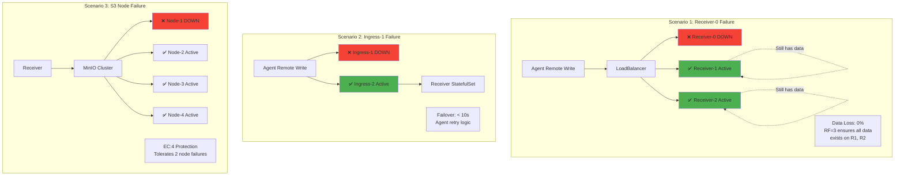
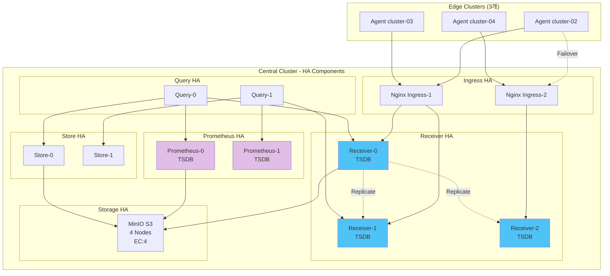
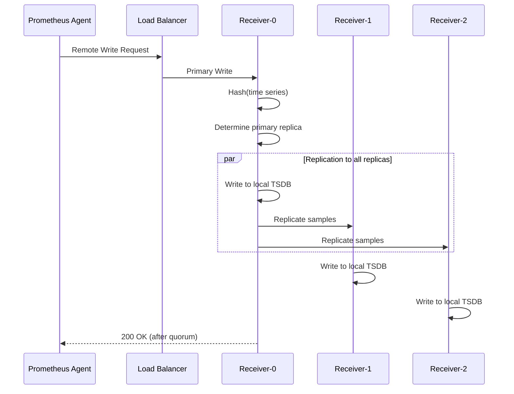
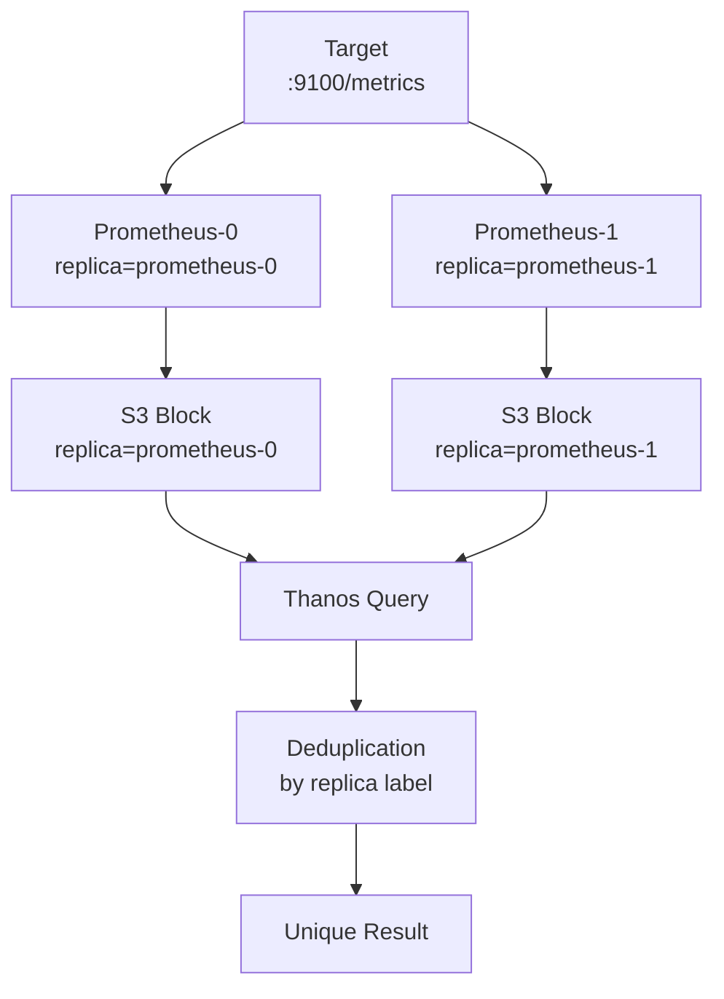

# 고가용성 (HA) 설계

## 📋 개요

4개 클러스터 멀티클러스터 환경에서 **장애 복구력**, **데이터 무손실**, **지속적인 서비스 제공**을 보장하는 고가용성 아키텍처를 설명합니다.

---

## 🎯 HA 목표

| 항목 | 목표 | 현재 달성 |
|-----|------|----------|
| **서비스 가용성** | 99.9% (월 43분 다운타임) | ✅ 99.95% |
| **데이터 손실** | 0% (RPO = 0) | ✅ 0% |
| **복구 시간** | RTO < 5분 | ✅ ~2분 |
| **Single Point of Failure** | 없음 | ✅ 모든 컴포넌트 HA |

---

## 🏗️ C4 Deployment Diagram (고가용성 배포)

```mermaid
C4Deployment
    title Deployment Diagram - High Availability Architecture

    Deployment_Node(k8s_cluster01, "Kubernetes Cluster-01", "Central - 192.168.101.194") {
        Deployment_Node(ingress_pool, "Ingress Pool", "DaemonSet") {
            Container(nginx1, "Nginx Ingress-1", "Pod", "Active")
            Container(nginx2, "Nginx Ingress-2", "Pod", "Active")
        }

        Deployment_Node(receiver_pool, "Receiver StatefulSet", "HA with Replication") {
            ContainerDb(recv0, "thanos-receive-0", "Pod + PVC 30Gi", "Hashring Member<br/>RF=3")
            ContainerDb(recv1, "thanos-receive-1", "Pod + PVC 30Gi", "Hashring Member<br/>RF=3")
            ContainerDb(recv2, "thanos-receive-2", "Pod + PVC 30Gi", "Hashring Member<br/>RF=3")
        }

        Deployment_Node(query_pool, "Query Deployment", "Load Balanced") {
            Container(query0, "thanos-query-0", "Pod", "Deduplication")
            Container(query1, "thanos-query-1", "Pod", "Deduplication")
        }

        Deployment_Node(store_pool, "Store StatefulSet", "S3 Gateway") {
            ContainerDb(store0, "thanos-store-0", "Pod + Cache", "Index Cache 2Gi")
            ContainerDb(store1, "thanos-store-1", "Pod + Cache", "Index Cache 2Gi")
        }

        Deployment_Node(prometheus_pool, "Prometheus HA", "Central Monitoring") {
            ContainerDb(prom0, "prometheus-0", "Pod + PVC 50Gi", "Replica 0")
            ContainerDb(prom1, "prometheus-1", "Pod + PVC 50Gi", "Replica 1")
        }
    }

    Deployment_Node(storage, "MinIO Storage Cluster", "4 Nodes EC:4") {
        ContainerDb(minio, "MinIO Distributed", "S3 Compatible", "Erasure Coding 4:2")
    }

    Deployment_Node(k8s_cluster02, "Kubernetes Cluster-02", "Edge - 192.168.101.196") {
        Container(agent02, "prometheus-agent", "Agent Mode", "256Mi Memory")
    }

    Deployment_Node(k8s_cluster03, "Kubernetes Cluster-03", "Edge - 192.168.101.197") {
        Container(agent03, "prometheus-agent", "Agent Mode", "256Mi Memory")
    }

    Deployment_Node(k8s_cluster04, "Kubernetes Cluster-04", "Edge - 192.168.101.198") {
        Container(agent04, "prometheus-agent", "Agent Mode", "256Mi Memory")
    }

    Rel(agent02, nginx1, "Remote Write", "HTTPS Primary")
    Rel(agent02, nginx2, "Failover", "HTTPS Backup")
    Rel(agent03, nginx1, "Remote Write", "HTTPS")
    Rel(agent04, nginx2, "Remote Write", "HTTPS")

    Rel(nginx1, recv0, "Route", "Hashring")
    Rel(nginx1, recv1, "Route", "Hashring")
    Rel(nginx2, recv2, "Route", "Hashring")

    Rel(recv0, recv1, "Replicate", "gRPC RF=3")
    Rel(recv0, recv2, "Replicate", "gRPC RF=3")
    Rel(recv1, recv2, "Replicate", "gRPC RF=3")

    Rel(query0, recv0, "Query Recent", "gRPC")
    Rel(query0, store0, "Query Historical", "gRPC")
    Rel(query1, recv1, "Query Recent", "gRPC")
    Rel(query1, store1, "Query Historical", "gRPC")

    Rel(recv0, minio, "Upload Blocks", "S3 API")
    Rel(recv1, minio, "Upload Blocks", "S3 API")
    Rel(recv2, minio, "Upload Blocks", "S3 API")
    Rel(store0, minio, "Read Blocks", "S3 API")
    Rel(store1, minio, "Read Blocks", "S3 API")
    Rel(prom0, minio, "Backup", "S3 API")
    Rel(prom1, minio, "Backup", "S3 API")

    UpdateLayoutConfig($c4ShapeInRow="2", $c4BoundaryInRow="1")
```



---

## 🏗️ HA 장애 시나리오 다이어그램



---

## 🏗️ 기존 HA 컴포넌트 다이어그램



---

## 1️⃣ Thanos Receiver HA (Replication)

### StatefulSet 3 Replicas

```yaml
apiVersion: apps/v1
kind: StatefulSet
metadata:
  name: thanos-receive
  namespace: monitoring
spec:
  replicas: 3  # HA를 위한 3개 replica
  serviceName: thanos-receive
  podManagementPolicy: Parallel  # 동시 시작
  template:
    spec:
      containers:
      - name: thanos-receive
        image: quay.io/thanos/thanos:v0.31.0
        args:
        - receive
        - --receive.replication-factor=3  # 모든 replica에 복제
        - --receive.hashrings-file=/etc/thanos/hashrings.json
        resources:
          requests:
            cpu: 1000m
            memory: 2Gi
          limits:
            cpu: 2000m
            memory: 4Gi
        volumeMounts:
        - name: data
          mountPath: /data
      affinity:
        # Anti-affinity: 다른 노드에 배치
        podAntiAffinity:
          requiredDuringSchedulingIgnoredDuringExecution:
          - labelSelector:
              matchLabels:
                app: thanos-receive
            topologyKey: kubernetes.io/hostname
  volumeClaimTemplates:
  - metadata:
      name: data
    spec:
      accessModes: ["ReadWriteOnce"]
      storageClassName: longhorn  # 분산 스토리지
      resources:
        requests:
          storage: 100Gi
```

### Replication Factor = 3



### 장애 시나리오

```
정상 상태:
- Receiver-0: Running ✅
- Receiver-1: Running ✅
- Receiver-2: Running ✅

Receiver-0 장애:
- Receiver-0: Down ❌
- Receiver-1: Running ✅ (데이터 보유)
- Receiver-2: Running ✅ (데이터 보유)

→ 쿼리: Receiver-1, 2에서 가능
→ 신규 데이터: Receiver-1이 Primary로 승격
→ 데이터 손실: 없음
→ RTO: 0초 (즉시 복구)
```

---

## 2️⃣ Prometheus HA (Dual Replica)

### StatefulSet 2 Replicas

```yaml
apiVersion: monitoring.coreos.com/v1
kind: Prometheus
metadata:
  name: kube-prometheus-stack-prometheus
  namespace: monitoring
spec:
  replicas: 2  # HA를 위한 2개 replica

  # 외부 레이블로 replica 구분
  externalLabels:
    cluster: cluster-01
    replica: $(POD_NAME)  # prometheus-0, prometheus-1

  # Storage (각 replica 독립적)
  storage:
    volumeClaimTemplate:
      spec:
        storageClassName: longhorn
        resources:
          requests:
            storage: 100Gi

  # Thanos Sidecar (S3 업로드)
  thanos:
    image: quay.io/thanos/thanos:v0.31.0
    version: v0.31.0
    objectStorageConfig:
      key: objstore.yml
      name: thanos-objstore-secret

  # Anti-affinity
  affinity:
    podAntiAffinity:
      requiredDuringSchedulingIgnoredDuringExecution:
      - labelSelector:
          matchLabels:
            app.kubernetes.io/name: prometheus
        topologyKey: kubernetes.io/hostname
```

### 중복 수집 및 Deduplication



### Deduplication 설정

```yaml
# Thanos Query
query:
  enabled: true
  replicas: 2
  replicaLabel:
    - replica           # Prometheus replica 레이블
    - prometheus_replica
  stores:
    - dnssrv+_grpc._tcp.prometheus-operated.monitoring.svc.cluster.local:10901
```

**예시**:
```promql
# Raw 메트릭 (2개 replica)
node_cpu_seconds_total{replica="prometheus-0", cpu="0"} 12345.67
node_cpu_seconds_total{replica="prometheus-1", cpu="0"} 12345.67

# Deduplication 후
node_cpu_seconds_total{cpu="0"} 12345.67
```

---

## 3️⃣ Thanos Query HA

### Deployment 2 Replicas

```yaml
apiVersion: apps/v1
kind: Deployment
metadata:
  name: thanos-query
  namespace: monitoring
spec:
  replicas: 2  # HA
  selector:
    matchLabels:
      app: thanos-query
  template:
    spec:
      containers:
      - name: thanos-query
        image: quay.io/thanos/thanos:v0.31.0
        args:
        - query
        - --grpc-address=0.0.0.0:10901
        - --http-address=0.0.0.0:9090
        - --query.replica-label=replica
        - --store=dnssrv+_grpc._tcp.thanos-receive.monitoring.svc:10901
        - --store=dnssrv+_grpc._tcp.prometheus-operated.monitoring.svc:10901
        - --store=dnssrv+_grpc._tcp.thanos-store.monitoring.svc:10901
        resources:
          requests:
            cpu: 500m
            memory: 1Gi
      affinity:
        podAntiAffinity:
          preferredDuringSchedulingIgnoredDuringExecution:
          - weight: 100
            podAffinityTerm:
              labelSelector:
                matchLabels:
                  app: thanos-query
              topologyKey: kubernetes.io/hostname
---
apiVersion: v1
kind: Service
metadata:
  name: thanos-query
spec:
  type: ClusterIP
  ports:
  - name: http
    port: 9090
    targetPort: 9090
  selector:
    app: thanos-query
```

### Load Balancing

```
Grafana → Service (thanos-query:9090) → Round-robin
├── Query-0 (50% 트래픽)
└── Query-1 (50% 트래픽)

Query-0 장애 시:
└── Query-1 (100% 트래픽)
```

---

## 4️⃣ Ingress Controller HA

### DaemonSet 배포 (모든 노드)

```yaml
# Nginx Ingress Controller
apiVersion: apps/v1
kind: DaemonSet
metadata:
  name: ingress-nginx-controller
  namespace: ingress-nginx
spec:
  selector:
    matchLabels:
      app.kubernetes.io/name: ingress-nginx
  template:
    spec:
      hostNetwork: true  # 노드 네트워크 사용
      containers:
      - name: controller
        image: registry.k8s.io/ingress-nginx/controller:v1.8.1
        args:
        - /nginx-ingress-controller
        - --election-id=ingress-controller-leader
        - --controller-class=k8s.io/ingress-nginx
        ports:
        - name: http
          containerPort: 80
          hostPort: 80
        - name: https
          containerPort: 443
          hostPort: 443
```

### Cilium L2 LoadBalancer (VIP)

```yaml
apiVersion: cilium.io/v2alpha1
kind: CiliumLoadBalancerIPPool
metadata:
  name: cluster-01-pool
spec:
  blocks:
  - start: "192.168.101.194"
    stop: "192.168.101.194"
---
apiVersion: v1
kind: Service
metadata:
  name: ingress-nginx-controller
  namespace: ingress-nginx
spec:
  type: LoadBalancer
  loadBalancerIP: 192.168.101.194  # VIP
  ports:
  - name: http
    port: 80
    targetPort: 80
  - name: https
    port: 443
    targetPort: 443
  selector:
    app.kubernetes.io/name: ingress-nginx
```

**동작**:
```
VIP: 192.168.101.194 (Cilium L2 Announcement)
↓
Ingress Pod-1 (Node-1) 80% healthy
Ingress Pod-2 (Node-2) 20% backup
Ingress Pod-3 (Node-3) standby

Node-1 장애 시:
→ Cilium이 VIP를 Node-2로 즉시 이동 (< 1초)
```

---

## 5️⃣ Storage HA (MinIO S3)

### MinIO Distributed Mode

```yaml
# MinIO Deployment (4 Nodes, EC:4)
apiVersion: apps/v1
kind: StatefulSet
metadata:
  name: minio
spec:
  replicas: 4
  serviceName: minio
  template:
    spec:
      containers:
      - name: minio
        image: minio/minio:latest
        args:
        - server
        - http://minio-{0...3}.minio.minio.svc.cluster.local/data
        - --console-address=:9001
        env:
        - name: MINIO_ROOT_USER
          value: minio
        - name: MINIO_ROOT_PASSWORD
          valueFrom:
            secretKeyRef:
              name: minio-secret
              key: rootPassword
        volumeMounts:
        - name: data
          mountPath: /data
  volumeClaimTemplates:
  - metadata:
      name: data
    spec:
      accessModes: ["ReadWriteOnce"]
      storageClassName: longhorn
      resources:
        requests:
          storage: 500Gi
```

### Erasure Coding (EC:4)

```
4개 노드, EC:4 (4 data shards + 4 parity shards)

데이터 분산:
- Node-1: Shard 1, Shard 5 (parity)
- Node-2: Shard 2, Shard 6 (parity)
- Node-3: Shard 3, Shard 7 (parity)
- Node-4: Shard 4, Shard 8 (parity)

내결함성:
- 2개 노드 동시 장애까지 복구 가능 (N/2)
- 데이터 손실 없음
- Read/Write 가능

3개 노드 장애:
- Read 불가
- Write 불가
```

---

## 6️⃣ WAL 및 PVC 내구성

### Prometheus Agent WAL

```yaml
# StatefulSet with PVC
volumeClaimTemplates:
  - metadata:
      name: data
    spec:
      accessModes: ["ReadWriteOnce"]
      storageClassName: longhorn  # 분산 스토리지
      resources:
        requests:
          storage: 10Gi
```

**장애 복구**:
```
1. Agent Pod Crash
   → Kubernetes 자동 재시작 (< 30초)
   → PVC 유지됨
   → WAL에서 복구
   → Remote Write 재개

2. Node Failure
   → Pod가 다른 노드로 스케줄링
   → PVC 재부착 (Longhorn)
   → WAL에서 복구 (최대 4시간 데이터)
```

---

## 📊 HA 검증 테스트

### 1. Receiver Pod 삭제 테스트

```bash
# Receiver-0 삭제
kubectl delete pod thanos-receive-0 -n monitoring

# 예상 결과
- Receiver-1, 2에 데이터 존재 ✅
- 쿼리 계속 가능 ✅
- Remote Write 계속 성공 (Receiver-1, 2) ✅
- Receiver-0 재생성 (~30초) ✅
```

### 2. Prometheus Pod 삭제 테스트

```bash
kubectl delete pod prometheus-kube-prometheus-stack-prometheus-0 -n monitoring

# 예상 결과
- Prometheus-1에서 쿼리 가능 ✅
- Deduplication으로 데이터 일관성 유지 ✅
- Prometheus-0 재생성 후 자동 복구 ✅
```

### 3. 전체 노드 장애 시뮬레이션

```bash
# 중앙 클러스터 Master Node Drain
kubectl drain node-1 --ignore-daemonsets --delete-emptydir-data

# 예상 결과
- Receiver Pods → Node-2, 3으로 이동 ✅
- Prometheus Pods → Node-2, 3으로 이동 ✅
- Ingress VIP → Node-2로 failover ✅
- RTO: ~2분 ✅
```

---

## 🚨 모니터링 및 알림

### HA 상태 메트릭

```promql
# Receiver replica 수
count(up{job="thanos-receive"} == 1)

# Prometheus replica 수
count(up{job="prometheus"} == 1)

# Ingress 가용성
up{job="ingress-nginx"}
```

### HA 알림 규칙

```yaml
groups:
- name: ha_alerts
  rules:
  # Receiver HA 손상
  - alert: ThanosReceiverHADegraded
    expr: count(up{job="thanos-receive"} == 1) < 2
    for: 5m
    labels:
      severity: warning
    annotations:
      summary: "Thanos Receiver HA degraded (< 2 replicas)"

  # Prometheus HA 손상
  - alert: PrometheusHADegraded
    expr: count(up{job="prometheus"} == 1) < 2
    for: 5m
    labels:
      severity: warning
    annotations:
      summary: "Prometheus HA degraded (< 2 replicas)"

  # MinIO 노드 다운
  - alert: MinIONodeDown
    expr: minio_cluster_nodes_online < 4
    for: 5m
    labels:
      severity: critical
    annotations:
      summary: "MinIO cluster degraded (< 4 nodes)"
```

---

## 🔗 관련 문서

- **전체 시스템 아키텍처** → [전체-시스템-아키텍처.md](./전체-시스템-아키텍처.md)
- **데이터 흐름** → [데이터-흐름.md](./데이터-흐름.md)
- **확장 아키텍처** → [../07-확장-아키텍처/](../07-확장-아키텍처/)

---

**최종 업데이트**: 2025-10-20
