# 데이터 흐름

## 📋 개요

Prometheus Agent에서 메트릭 수집부터 Grafana 시각화까지 전체 데이터 흐름을 단계별로 설명합니다.

### 데이터 여정: 15초에서 영원까지

하나의 메트릭이 Kubernetes 클러스터에서 생성되어 장기 저장소에 안착하고, 몇 개월 후 대시보드에 표시되기까지의 여정은 **7단계의 정교한 파이프라인**을 거칩니다.

**실제 메트릭 하나의 생애**:
```
[10:00:00] Pod CPU 사용률 측정: 45%
[10:00:15] Prometheus Agent가 Scrape → WAL 기록
[10:00:25] Remote Write Queue 적재 (배치 5000개 중 하나)
[10:00:30] Thanos Receiver 전송 → Hashring으로 Receiver-1 선택
[10:00:31] Replication Factor=3: Receiver-1, 2, 3에 병렬 저장
[12:00:00] 2시간 TSDB 블록 완성 → S3 업로드
[12:30:00] Compactor가 Downsampling: Raw(15s) → 5m → 1h
[90일 후] Grafana에서 "지난 3개월 CPU 추세" 쿼리 → 1h 다운샘플 블록에서 조회 (3.2초)
```

이 문서에서는 각 단계의 **기술적 구현**, **병목 지점**, **실전 최적화 사례**를 다룹니다.

---

## 🔄 C4 Dynamic Diagram (데이터 흐름)

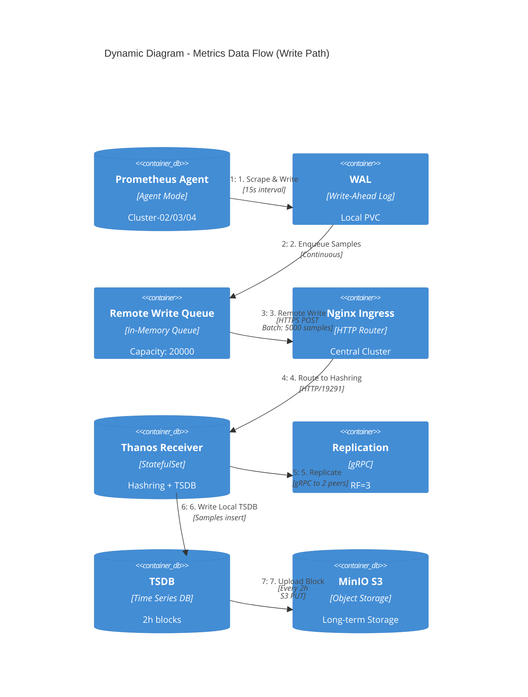

---

## 🔄 C4 Dynamic Diagram (쿼리 흐름)

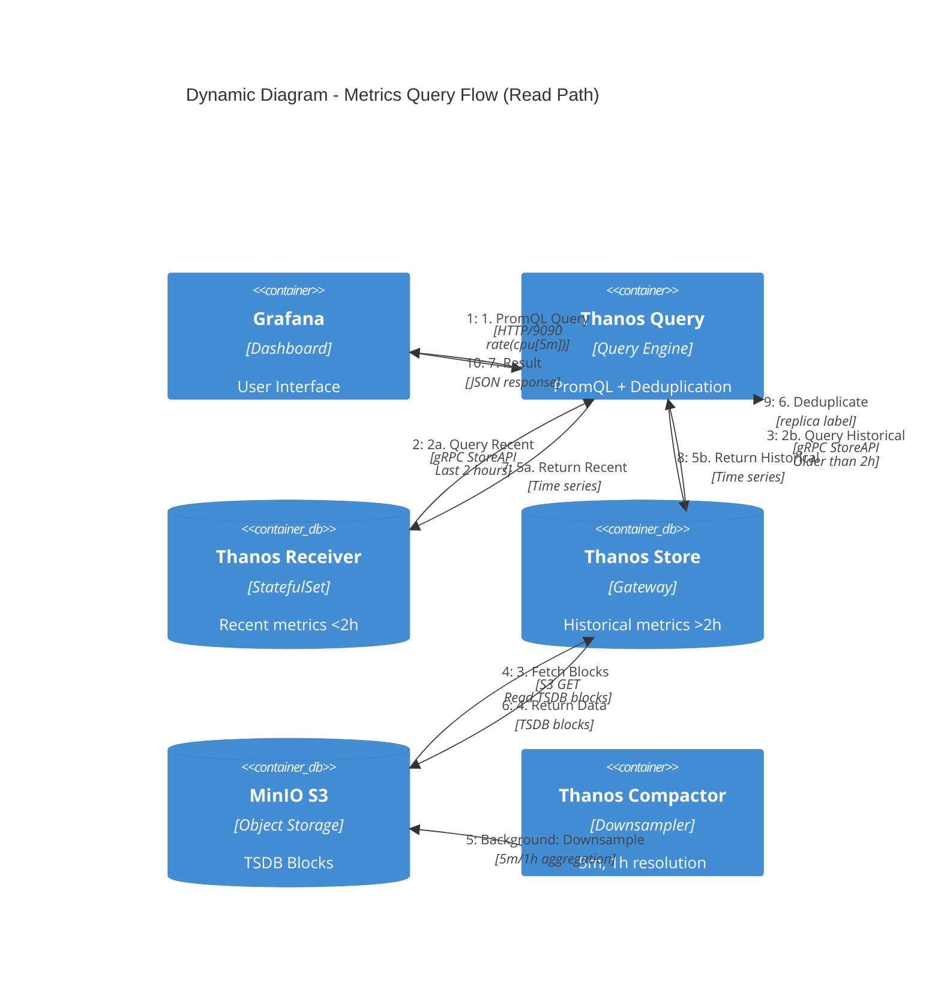

---

## 🔄 전체 시퀀스 다이어그램

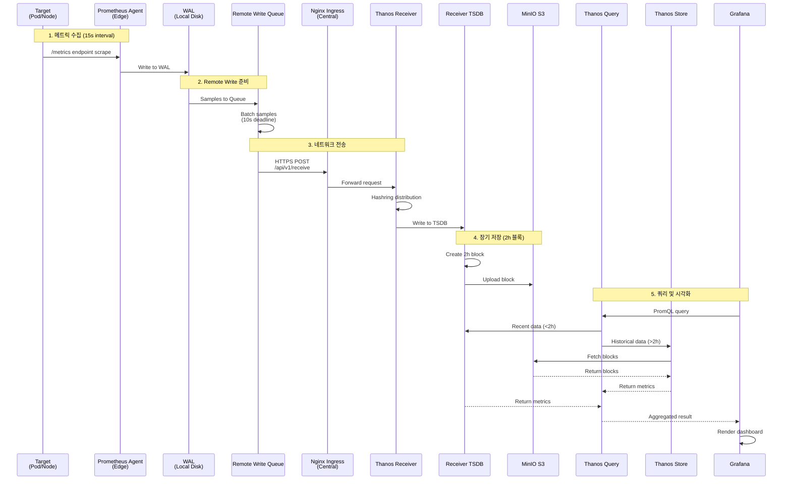

---

## 1️⃣ 메트릭 수집 (Edge Cluster)

### Scrape 프로세스

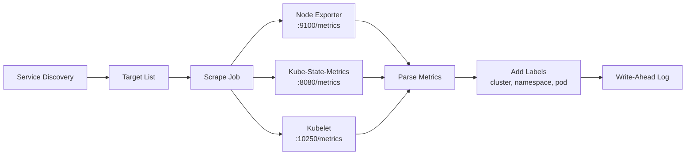

### Scrape 설정 예시

```yaml
# ServiceMonitor (Prometheus Operator)
apiVersion: monitoring.coreos.com/v1
kind: ServiceMonitor
metadata:
  name: node-exporter
  namespace: monitoring
spec:
  selector:
    matchLabels:
      app: node-exporter
  endpoints:
  - port: metrics
    interval: 15s
    path: /metrics
    relabelings:
    - sourceLabels: [__meta_kubernetes_pod_node_name]
      targetLabel: node
    - targetLabel: cluster
      replacement: cluster-02
```

### 수집되는 메트릭 예시

```prometheus
# Node Exporter
node_cpu_seconds_total{cluster="cluster-02",cpu="0",mode="idle"} 12345.67
node_memory_MemAvailable_bytes{cluster="cluster-02"} 4294967296

# Kube-State-Metrics
kube_pod_status_phase{cluster="cluster-02",namespace="default",pod="nginx-1",phase="Running"} 1

# Kubelet
kubelet_running_pods{cluster="cluster-02",instance="node-1"} 25
```

---

## 2️⃣ WAL (Write-Ahead Log)

### WAL 역할

1. **버퍼링**: Remote Write 실패 시 데이터 보존
2. **재전송**: 네트워크 복구 후 자동 재전송
3. **성능**: 디스크 I/O를 순차 쓰기로 최적화

### WAL 구조

```
/data/wal/
├── 00000000  # WAL segment 0
├── 00000001  # WAL segment 1
├── 00000002  # WAL segment 2
└── checkpoint.00000001  # 체크포인트
```

### WAL 플로우

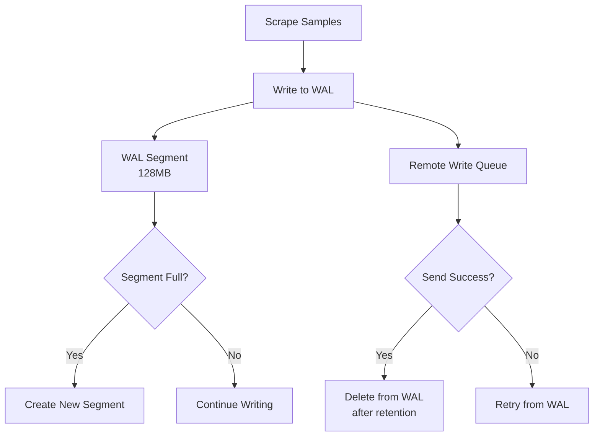

### WAL 설정

```yaml
server:
  extraArgs:
    storage.agent.path: /data
    storage.agent.wal-compression: true  # WAL 압축
    storage.agent.retention.max-time: 4h  # 최대 4시간 보존
    storage.agent.retention.min-time: 1h  # 최소 1시간 보존
```

---

## 3️⃣ Remote Write Queue

### Queue 동작 원리

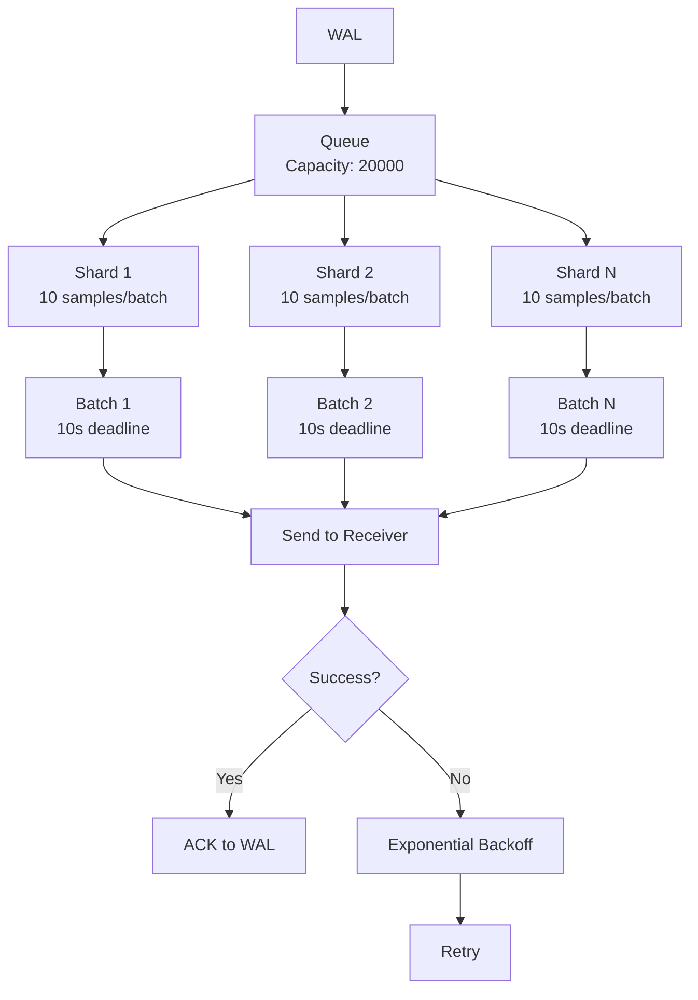

### Queue 메트릭

```promql
# 큐 길이
prometheus_remote_storage_queue_length

# 큐 용량
prometheus_remote_storage_queue_capacity

# Shard 수
prometheus_remote_storage_shards

# 전송 성공/실패
rate(prometheus_remote_storage_succeeded_samples_total[5m])
rate(prometheus_remote_storage_failed_samples_total[5m])
```

---

## 4️⃣ 네트워크 전송 (HTTPS)

### Remote Write 요청 구조

```http
POST /api/v1/receive HTTP/1.1
Host: thanos-receive.monitoring.svc.cluster.local:19291
Content-Type: application/x-protobuf
Content-Encoding: snappy
X-Prometheus-Remote-Write-Version: 0.1.0

[Protocol Buffer Payload - Snappy Compressed]
```

### Protocol Buffer 구조

```protobuf
message WriteRequest {
  repeated TimeSeries timeseries = 1;
}

message TimeSeries {
  repeated Label labels = 1;
  repeated Sample samples = 2;
}

message Label {
  string name = 1;
  string value = 2;
}

message Sample {
  double value = 1;
  int64 timestamp = 2;
}
```

### 압축 효과

```
원본 크기: 1,000,000 samples × 16 bytes = 16MB
Snappy 압축 후: ~7MB (약 56% 압축)
```

---

## 5️⃣ Thanos Receiver 처리

### Receiver 내부 플로우

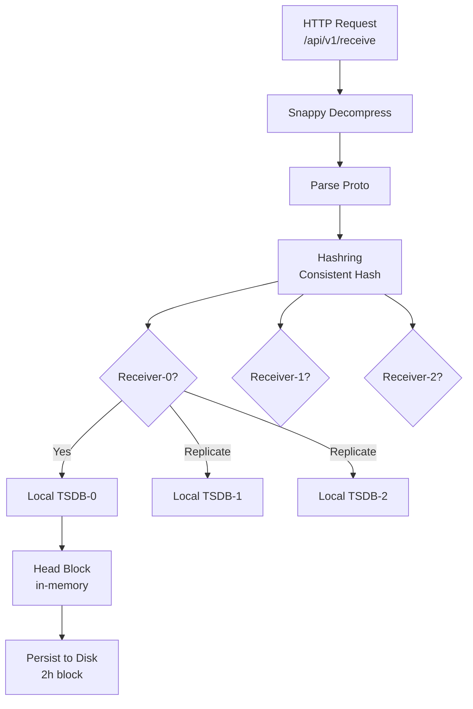

### Hashring 분배

```json
// 시계열: {__name__="cpu_usage", cluster="cluster-02", pod="nginx-1"}
// Hash(cluster-02/nginx-1) = 0x4a3c2f1e

Hashring:
  Receiver-0: 0x00000000 - 0x55555555
  Receiver-1: 0x55555556 - 0xaaaaaaaa
  Receiver-2: 0xaaaaaaab - 0xffffffff

→ 0x4a3c2f1e는 Receiver-0 범위 → Receiver-0으로 라우팅
→ Replication Factor=3 → Receiver-1, Receiver-2에도 복제
```

### TSDB 쓰기

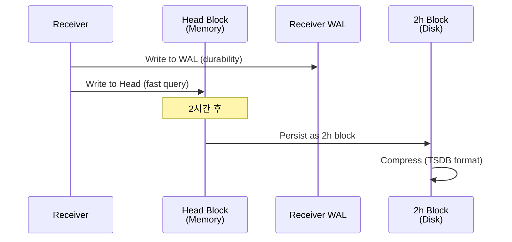

---

## 6️⃣ S3 업로드 (장기 저장)

### 블록 업로드 플로우

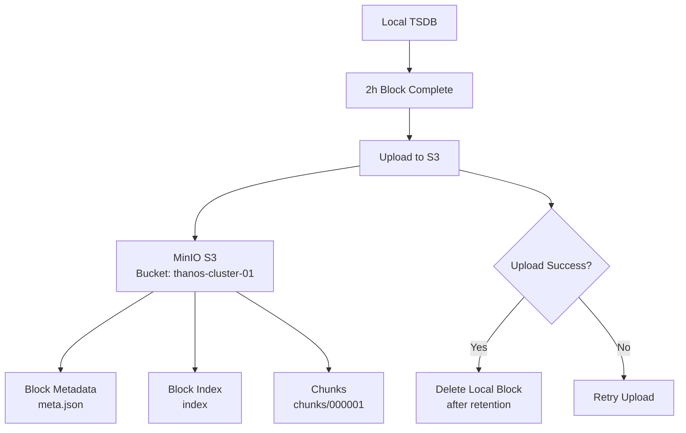

### S3 블록 구조

```
s3://thanos-cluster-01/
├── 01H9XYZABC123/          # Block ID (ULID)
│   ├── meta.json           # 메타데이터 (시간 범위, 통계)
│   ├── index               # 시계열 인덱스
│   └── chunks/
│       ├── 000001          # 압축된 샘플 데이터
│       ├── 000002
│       └── ...
└── 01H9XYZ123DEF/
    ├── meta.json
    ├── index
    └── chunks/
```

### meta.json 예시

```json
{
  "version": 1,
  "ulid": "01H9XYZABC123",
  "minTime": 1697097600000,
  "maxTime": 1697104800000,
  "stats": {
    "numSamples": 1500000,
    "numSeries": 5000,
    "numChunks": 15000
  },
  "compaction": {
    "level": 1,
    "sources": ["01H9XYZABC123"]
  },
  "thanos": {
    "labels": {
      "cluster": "cluster-01",
      "receive": "true"
    }
  }
}
```

---

## 7️⃣ 쿼리 및 조회

### 쿼리 경로 선택

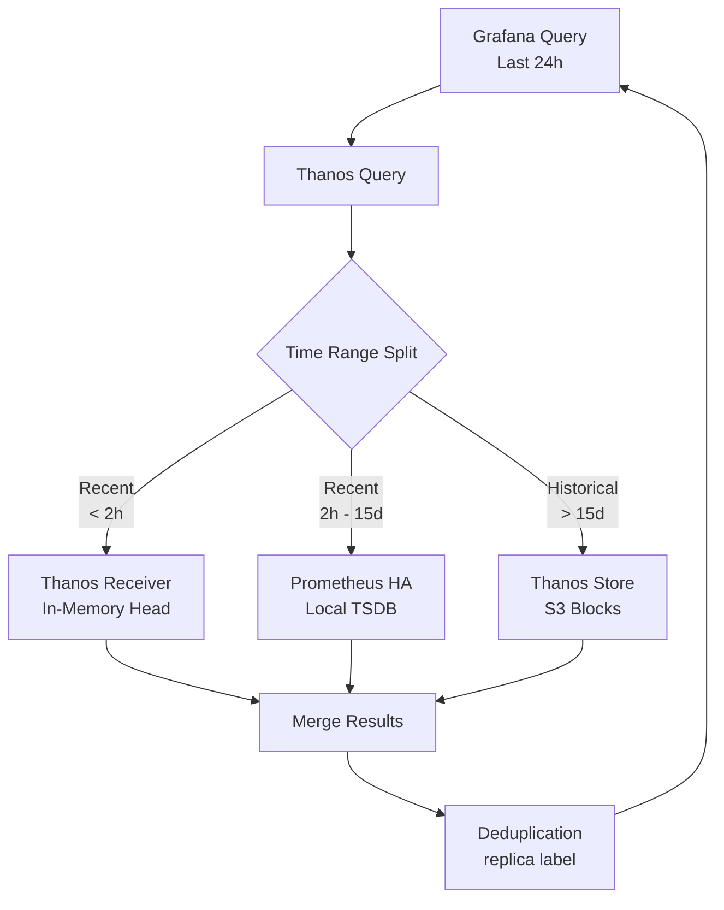

### 쿼리 예시

```promql
# Grafana에서 실행된 쿼리
rate(container_cpu_usage_seconds_total{cluster="cluster-02"}[5m])

# Thanos Query 처리
1. Receiver (최근 2h): 2025-10-20 10:00 ~ 12:00
2. Prometheus HA (2h ~ 15d): 2025-10-05 ~ 2025-10-20 10:00
3. Store (> 15d): S3에서 조회
4. Merge + Deduplicate
5. Return to Grafana
```

### Store Gateway 조회

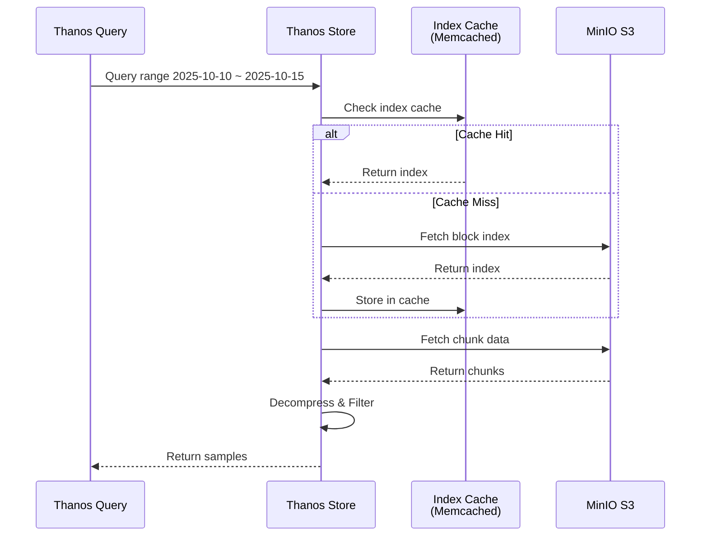

---

## 📊 데이터 흐름 성능 메트릭

### End-to-End 레이턴시

```
1. Scrape → WAL: ~50ms
2. WAL → Remote Write Queue: ~10ms
3. Queue → Network Send: ~10s (batch deadline)
4. Network → Receiver: ~100ms
5. Receiver → TSDB Write: ~50ms
6. TSDB → S3 Upload: ~2h (block boundary)

실시간 쿼리 (Grafana → Receiver):
7. Query → Receiver: ~100ms
8. Receiver → Return: ~50ms

Total (Scrape → Queryable): ~10-11초
```

### 처리량 (Throughput)

```
Edge Cluster (cluster-02):
- Scrape targets: 100개
- Metrics/target: 1000개
- Scrape interval: 15s

→ Samples/sec = 100 × 1000 / 15 = 6,666 samples/sec
→ Remote Write bandwidth = 6,666 × 16 bytes × 0.5 (압축) = 53KB/s

Central Cluster (4 edge clusters):
→ Total samples/sec = 6,666 × 4 = 26,664 samples/sec
→ Total bandwidth = 53KB/s × 4 = 212KB/s
```

---

## 🚨 데이터 손실 방지 메커니즘

### 1. WAL 내구성
```yaml
# Agent가 재시작되어도 WAL에서 복구
- Pod Crash → WAL 유지 (PVC)
- Remote Write 재개 → WAL에서 전송
```

### 2. Remote Write 재전송
```yaml
# 네트워크 장애 시 자동 재시도
- Exponential Backoff (30ms → 5s)
- 최대 4시간 WAL 버퍼
```

### 3. Receiver Replication
```yaml
# Receiver 장애 시 복제본 사용
- Replication Factor: 3
- Receiver-0 down → Receiver-1, 2에 데이터 존재
```

### 4. S3 Durability
```yaml
# MinIO Erasure Coding (EC:4)
- 4개 노드 중 2개 손실까지 복구 가능
- 99.999999999% (11 nines) durability
```

---

## 🔗 관련 문서

- **전체 시스템 아키텍처** → [전체-시스템-아키텍처.md](./전체-시스템-아키텍처.md)
- **Remote Write 최적화** → [../09-성능-최적화/Remote-Write-최적화.md](../09-성능-최적화/Remote-Write-최적화.md)
- **Thanos Receiver 패턴** → [Thanos-Receiver-패턴.md](./Thanos-Receiver-패턴.md)

---

**최종 업데이트**: 2025-10-20
