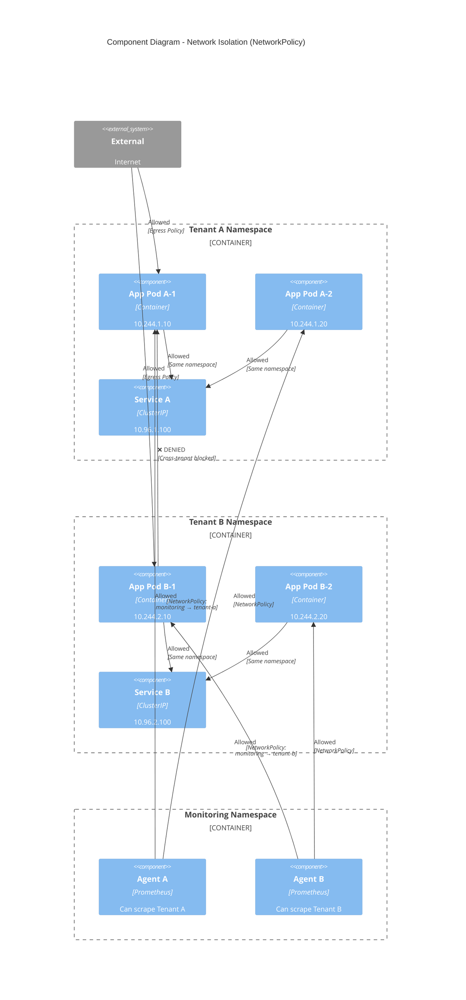
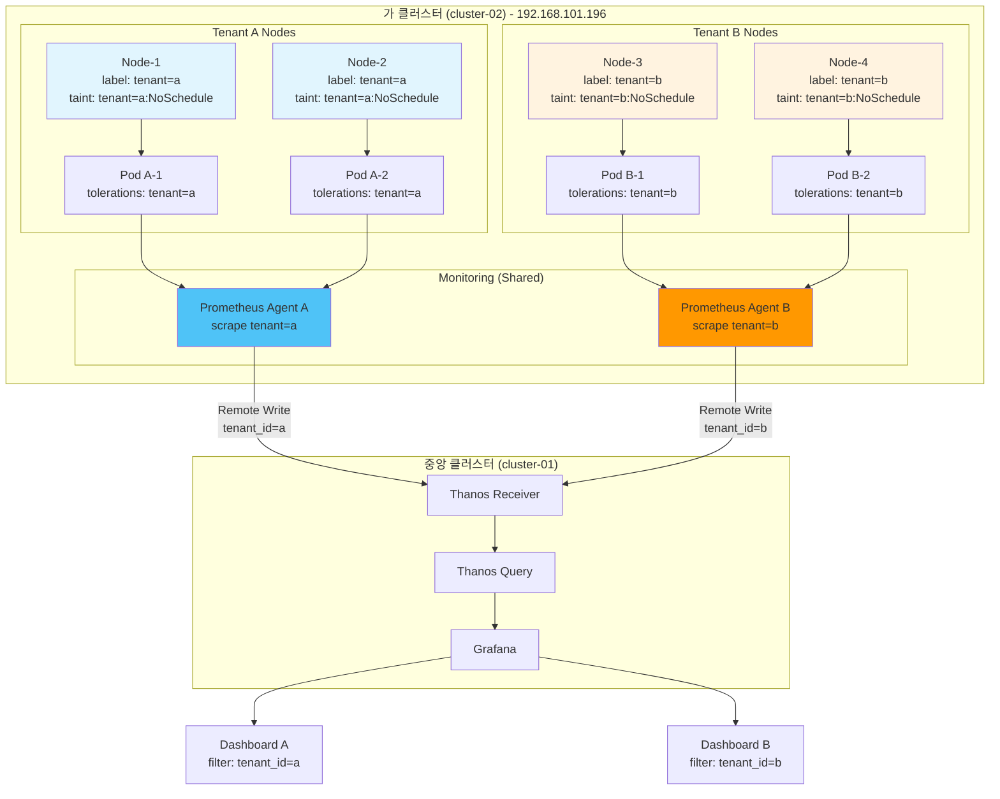

# 멀티테넌시 아키텍처

## 📋 개요

**가 클러스터 (cluster-02, 192.168.101.196)**에서 노드를 반반으로 나누어 두 개의 테넌트를 격리하는 멀티테넌시 아키텍처의 설계 원칙과 구현 방법을 설명합니다.

---

## 🎯 멀티테넌시 목표

| 목표 | 설명 | 달성 방법 |
|-----|------|----------|
| **리소스 격리** | 테넌트 A와 B가 서로의 리소스에 영향 없음 | Node Label + Affinity |
| **메트릭 분리** | 테넌트별 메트릭 독립 수집 | Prometheus Agent 분리 |
| **네트워크 격리** | Pod 간 통신 차단 | NetworkPolicy |
| **쿼리 분리** | Grafana에서 테넌트별 대시보드 | Label 필터링 |

---

## 🏗️ C4 Deployment Diagram (멀티테넌시)

```mermaid
C4Deployment
    title Deployment Diagram - Multi-Tenancy on Cluster-02 (Node-Level Isolation)

    Deployment_Node(cluster02, "Kubernetes Cluster-02", "Edge Multi-Tenant - 192.168.101.196") {
        Deployment_Node(tenant_a_infra, "Tenant A Infrastructure", "50% 노드") {
            Deployment_Node(node_a1, "Node-1", "label: tenant=tenant-a") {
                Container(pod_a1, "App Pod A-1", "Workload", "NodeAffinity: tenant-a")
                Container(exporter_a1, "Node Exporter", "Metrics", ":9100")
            }
            Deployment_Node(node_a2, "Node-2", "label: tenant=tenant-a") {
                Container(pod_a2, "App Pod A-2", "Workload", "NodeAffinity: tenant-a")
                Container(exporter_a2, "Node Exporter", "Metrics", ":9100")
            }
        }

        Deployment_Node(tenant_b_infra, "Tenant B Infrastructure", "50% 노드") {
            Deployment_Node(node_b1, "Node-3", "label: tenant=tenant-b") {
                Container(pod_b1, "App Pod B-1", "Workload", "NodeAffinity: tenant-b")
                Container(exporter_b1, "Node Exporter", "Metrics", ":9100")
            }
            Deployment_Node(node_b2, "Node-4", "label: tenant=tenant-b") {
                Container(pod_b2, "App Pod B-2", "Workload", "NodeAffinity: tenant-b")
                Container(exporter_b2, "Node Exporter", "Metrics", ":9100")
            }
        }

        Deployment_Node(monitoring, "Monitoring Namespace", "Shared Control Plane") {
            Container(agent_a, "Prometheus Agent A", "Agent Mode", "Namespace: monitoring-tenant-a<br/>Scrapes: tenant=tenant-a")
            Container(agent_b, "Prometheus Agent B", "Agent Mode", "Namespace: monitoring-tenant-b<br/>Scrapes: tenant=tenant-b")
        }
    }

    Deployment_Node(cluster01, "Kubernetes Cluster-01", "Central - 192.168.101.194") {
        ContainerDb(receiver, "Thanos Receiver", "Hashring", "Receives from all tenants")
        Container(query, "Thanos Query", "Query Engine", "Deduplication")
        Container(grafana, "Grafana", "Dashboard", "Tenant-aware Dashboards")
    }

    Rel(exporter_a1, agent_a, "Scrape", ":9100")
    Rel(exporter_a2, agent_a, "Scrape", ":9100")
    Rel(pod_a1, agent_a, "Metrics", "/metrics")
    Rel(pod_a2, agent_a, "Metrics", "/metrics")

    Rel(exporter_b1, agent_b, "Scrape", ":9100")
    Rel(exporter_b2, agent_b, "Scrape", ":9100")
    Rel(pod_b1, agent_b, "Metrics", "/metrics")
    Rel(pod_b2, agent_b, "Metrics", "/metrics")

    Rel(agent_a, receiver, "Remote Write", "HTTPS<br/>Header: X-Scope-OrgID=tenant-a")
    Rel(agent_b, receiver, "Remote Write", "HTTPS<br/>Header: X-Scope-OrgID=tenant-b")

    Rel(receiver, query, "StoreAPI", "gRPC")
    Rel(grafana, query, "PromQL", "Filter: tenant_id label")

    UpdateLayoutConfig($c4ShapeInRow="2", $c4BoundaryInRow="1")
```



---

## 🏗️ C4 Component Diagram (네트워크 격리)



---

## 🏗️ 기존 멀티테넌시 플로우 다이어그램



---

## 1️⃣ 노드 레이블 및 Taints

### 노드 라벨링

```bash
# Tenant A 노드
kubectl label nodes cluster-02-node-1 tenant=a
kubectl label nodes cluster-02-node-2 tenant=a

# Tenant B 노드
kubectl label nodes cluster-02-node-3 tenant=b
kubectl label nodes cluster-02-node-4 tenant=b
```

### 노드 Taints

```bash
# Tenant A 노드 (Tenant A Pod만 스케줄링 가능)
kubectl taint nodes cluster-02-node-1 tenant=a:NoSchedule
kubectl taint nodes cluster-02-node-2 tenant=a:NoSchedule

# Tenant B 노드 (Tenant B Pod만 스케줄링 가능)
kubectl taint nodes cluster-02-node-3 tenant=b:NoSchedule
kubectl taint nodes cluster-02-node-4 tenant=b:NoSchedule
```

### 검증

```bash
# 노드 확인
kubectl get nodes -L tenant

# 출력 예시
NAME                TENANT
cluster-02-node-1   a
cluster-02-node-2   a
cluster-02-node-3   b
cluster-02-node-4   b
```

---

## 2️⃣ Tenant별 네임스페이스 및 ResourceQuota

### 네임스페이스 생성

```yaml
# Tenant A
apiVersion: v1
kind: Namespace
metadata:
  name: tenant-a
  labels:
    tenant: a
---
# Tenant B
apiVersion: v1
kind: Namespace
metadata:
  name: tenant-b
  labels:
    tenant: b
```

### ResourceQuota

```yaml
# Tenant A Quota
apiVersion: v1
kind: ResourceQuota
metadata:
  name: tenant-a-quota
  namespace: tenant-a
spec:
  hard:
    requests.cpu: "7"           # 8 cores 중 여유 1 core
    requests.memory: 14Gi       # 16Gi 중 여유 2Gi
    limits.cpu: "8"
    limits.memory: 16Gi
    persistentvolumeclaims: "20"
    services.loadbalancers: "2"
---
# Tenant B Quota
apiVersion: v1
kind: ResourceQuota
metadata:
  name: tenant-b-quota
  namespace: tenant-b
spec:
  hard:
    requests.cpu: "7"
    requests.memory: 14Gi
    limits.cpu: "8"
    limits.memory: 16Gi
    persistentvolumeclaims: "20"
    services.loadbalancers: "2"
```

### LimitRange

```yaml
# Tenant A LimitRange
apiVersion: v1
kind: LimitRange
metadata:
  name: tenant-a-limitrange
  namespace: tenant-a
spec:
  limits:
  - max:
      cpu: "2"
      memory: 4Gi
    min:
      cpu: 100m
      memory: 128Mi
    default:
      cpu: 500m
      memory: 512Mi
    defaultRequest:
      cpu: 200m
      memory: 256Mi
    type: Container
  - max:
      storage: 50Gi
    min:
      storage: 1Gi
    type: PersistentVolumeClaim
```

---

## 3️⃣ Tenant별 Prometheus Agent 배포

### Prometheus Agent A (Tenant A)

```yaml
apiVersion: apps/v1
kind: StatefulSet
metadata:
  name: prometheus-agent-a
  namespace: monitoring
spec:
  serviceName: prometheus-agent-a
  replicas: 1
  selector:
    matchLabels:
      app: prometheus-agent-a
      tenant: a
  template:
    metadata:
      labels:
        app: prometheus-agent-a
        tenant: a
    spec:
      # Tenant A 노드에만 배치
      affinity:
        nodeAffinity:
          requiredDuringSchedulingIgnoredDuringExecution:
            nodeSelectorTerms:
            - matchExpressions:
              - key: tenant
                operator: In
                values:
                - a
      # Tenant A Taint 허용
      tolerations:
      - key: tenant
        operator: Equal
        value: a
        effect: NoSchedule

      containers:
      - name: prometheus-agent
        image: prom/prometheus:v2.45.0
        args:
        - --enable-feature=agent
        - --config.file=/etc/prometheus/prometheus.yml
        - --storage.agent.path=/data

        volumeMounts:
        - name: config
          mountPath: /etc/prometheus
        - name: data
          mountPath: /data

      volumes:
      - name: config
        configMap:
          name: prometheus-agent-a-config
```

### Prometheus Agent A 설정

```yaml
apiVersion: v1
kind: ConfigMap
metadata:
  name: prometheus-agent-a-config
  namespace: monitoring
data:
  prometheus.yml: |
    global:
      scrape_interval: 15s
      external_labels:
        cluster: cluster-02
        tenant_id: a  # Tenant A 식별

    remote_write:
    - url: https://thanos-receive.cluster-01.svc:19291/api/v1/receive
      headers:
        X-Prometheus-Remote-Write-Tenant: tenant-a  # Hashring 라우팅

    scrape_configs:
    # Tenant A 네임스페이스만 수집
    - job_name: kubernetes-pods
      kubernetes_sd_configs:
      - role: pod
        namespaces:
          names:
          - tenant-a
      relabel_configs:
      - source_labels: [__meta_kubernetes_namespace]
        target_label: namespace
```

### Prometheus Agent B (Tenant B)

```yaml
# 동일한 구조, 차이점:
# - labels: tenant: b
# - nodeAffinity: tenant=b
# - tolerations: tenant=b
# - external_labels.tenant_id: b
# - namespaces: [tenant-b]
```

---

## 4️⃣ NetworkPolicy 격리

### Tenant A NetworkPolicy

```yaml
apiVersion: networking.k8s.io/v1
kind: NetworkPolicy
metadata:
  name: tenant-a-isolation
  namespace: tenant-a
spec:
  podSelector: {}  # 모든 Pod
  policyTypes:
  - Ingress
  - Egress

  # Ingress: Tenant A 네임스페이스 내부만 허용
  ingress:
  - from:
    - namespaceSelector:
        matchLabels:
          tenant: a

  # Egress 허용
  egress:
  # 1. Tenant A 내부 통신
  - to:
    - namespaceSelector:
        matchLabels:
          tenant: a

  # 2. DNS (kube-system)
  - to:
    - namespaceSelector:
        matchLabels:
          kubernetes.io/metadata.name: kube-system
    ports:
    - protocol: UDP
      port: 53

  # 3. Monitoring (Prometheus Agent)
  - to:
    - namespaceSelector:
        matchLabels:
          kubernetes.io/metadata.name: monitoring
    ports:
    - protocol: TCP
      port: 9090

  # 4. 외부 인터넷 (선택적)
  - to:
    - namespaceSelector: {}
    ports:
    - protocol: TCP
      port: 443
```

### 검증 테스트

```bash
# Tenant A Pod에서 Tenant B Pod 접근 시도
kubectl run -it --rm test-a -n tenant-a --image=busybox -- sh

# Tenant B의 Pod IP로 curl 시도
wget -O- http://10.244.3.5  # Tenant B Pod IP

# 예상 결과: Timeout (NetworkPolicy 차단)
```

---

## 5️⃣ 메트릭 분리 및 쿼리

### Thanos Receiver Hashring (테넌트별)

```yaml
apiVersion: v1
kind: ConfigMap
metadata:
  name: thanos-receive-hashring
  namespace: monitoring
data:
  hashrings.json: |
    [
      {
        "hashring": "tenant-a",
        "endpoints": [
          "thanos-receive-0.thanos-receive:10901",
          "thanos-receive-1.thanos-receive:10901"
        ],
        "tenants": ["tenant-a"]
      },
      {
        "hashring": "tenant-b",
        "endpoints": [
          "thanos-receive-2.thanos-receive:10901"
        ],
        "tenants": ["tenant-b"]
      },
      {
        "hashring": "default",
        "endpoints": [
          "thanos-receive-0.thanos-receive:10901",
          "thanos-receive-1.thanos-receive:10901",
          "thanos-receive-2.thanos-receive:10901"
        ],
        "tenants": []
      }
    ]
```

### Grafana 테넌트별 대시보드

```json
{
  "dashboard": {
    "title": "Tenant A Dashboard",
    "templating": {
      "list": [
        {
          "name": "tenant",
          "type": "constant",
          "current": {
            "value": "a"
          }
        }
      ]
    },
    "panels": [
      {
        "title": "CPU Usage",
        "targets": [
          {
            "expr": "sum(rate(container_cpu_usage_seconds_total{tenant_id=\"a\"}[5m])) by (namespace)"
          }
        ]
      }
    ]
  }
}
```

### PromQL 쿼리 예시

```promql
# Tenant A CPU 사용률
sum(rate(container_cpu_usage_seconds_total{tenant_id="a"}[5m])) by (namespace)

# Tenant B Memory 사용량
sum(container_memory_working_set_bytes{tenant_id="b"}) by (pod)

# Tenant 비교
count(kube_pod_info) by (tenant_id)
```

---

## 6️⃣ RBAC 권한 분리

### ServiceAccount 생성

```yaml
# Tenant A ServiceAccount
apiVersion: v1
kind: ServiceAccount
metadata:
  name: tenant-a-admin
  namespace: tenant-a
---
# Tenant B ServiceAccount
apiVersion: v1
kind: ServiceAccount
metadata:
  name: tenant-b-admin
  namespace: tenant-b
```

### Role 및 RoleBinding

```yaml
# Tenant A Role (네임스페이스 내 전체 권한)
apiVersion: rbac.authorization.k8s.io/v1
kind: Role
metadata:
  name: tenant-a-admin-role
  namespace: tenant-a
rules:
- apiGroups: ["*"]
  resources: ["*"]
  verbs: ["*"]
---
apiVersion: rbac.authorization.k8s.io/v1
kind: RoleBinding
metadata:
  name: tenant-a-admin-binding
  namespace: tenant-a
subjects:
- kind: ServiceAccount
  name: tenant-a-admin
  namespace: tenant-a
roleRef:
  kind: Role
  name: tenant-a-admin-role
  apiGroup: rbac.authorization.k8s.io
```

### ClusterRole 제한 (네임스페이스 외부 접근 차단)

```yaml
# Tenant A는 자신의 네임스페이스만 조회 가능
apiVersion: rbac.authorization.k8s.io/v1
kind: ClusterRole
metadata:
  name: tenant-a-view
rules:
- apiGroups: [""]
  resources: ["namespaces"]
  verbs: ["get", "list"]
  resourceNames: ["tenant-a"]  # 자신의 네임스페이스만
```

---

## 7️⃣ 워크로드 예시 (Tenant A)

### Deployment with Affinity & Tolerations

```yaml
apiVersion: apps/v1
kind: Deployment
metadata:
  name: nginx-app
  namespace: tenant-a
spec:
  replicas: 3
  selector:
    matchLabels:
      app: nginx
      tenant: a
  template:
    metadata:
      labels:
        app: nginx
        tenant: a
    spec:
      # Tenant A 노드에만 배치
      affinity:
        nodeAffinity:
          requiredDuringSchedulingIgnoredDuringExecution:
            nodeSelectorTerms:
            - matchExpressions:
              - key: tenant
                operator: In
                values:
                - a
        # Pod Anti-Affinity (분산 배치)
        podAntiAffinity:
          preferredDuringSchedulingIgnoredDuringExecution:
          - weight: 100
            podAffinityTerm:
              labelSelector:
                matchLabels:
                  app: nginx
              topologyKey: kubernetes.io/hostname

      # Tenant A Taint 허용
      tolerations:
      - key: tenant
        operator: Equal
        value: a
        effect: NoSchedule

      containers:
      - name: nginx
        image: nginx:latest
        resources:
          requests:
            cpu: 200m
            memory: 256Mi
          limits:
            cpu: 500m
            memory: 512Mi
```

---

## 📊 멀티테넌시 검증

### 1. 노드 배치 확인

```bash
# Tenant A Pod가 Tenant A 노드에만 있는지 확인
kubectl get pods -n tenant-a -o wide

# 출력 예시
NAME            NODE                TENANT
nginx-app-1     cluster-02-node-1   a
nginx-app-2     cluster-02-node-2   a
nginx-app-3     cluster-02-node-1   a
```

### 2. 리소스 사용량 확인

```bash
# Tenant A Quota 사용률
kubectl describe resourcequota tenant-a-quota -n tenant-a

# 출력 예시
Used/Hard:
  requests.cpu:    5/7
  requests.memory: 10Gi/14Gi
```

### 3. 네트워크 격리 확인

```bash
# Tenant A → Tenant B 통신 시도
kubectl run test -n tenant-a --rm -it --image=busybox -- wget -O- http://service-b.tenant-b.svc

# 예상 결과: Timeout (NetworkPolicy 차단)
```

### 4. 메트릭 분리 확인

```promql
# Tenant A 메트릭만 조회
count(up{tenant_id="a"})

# Tenant B와 섞이지 않았는지 확인
count(up{tenant_id="b", namespace="tenant-a"})  # 결과: 0
```

---

## 🔗 관련 문서

- **전체 시스템 아키텍처** → [전체-시스템-아키텍처.md](./전체-시스템-아키텍처.md)
- **멀티테넌시 구성 가이드** → [../05-멀티테넌시-구성/](../05-멀티테넌시-구성/)
- **네트워크 보안** → [../06-네트워크-보안/](../06-네트워크-보안/)

---

**최종 업데이트**: 2025-10-20
