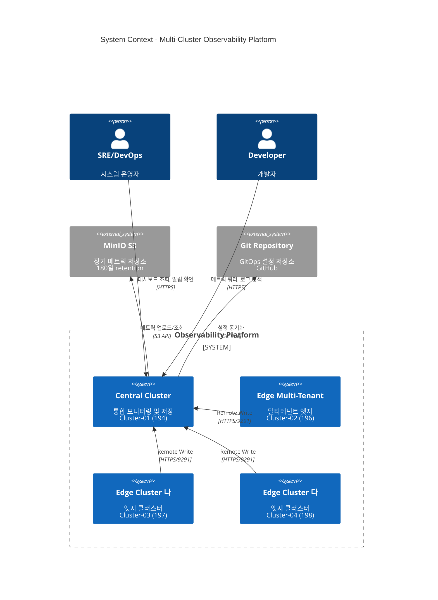
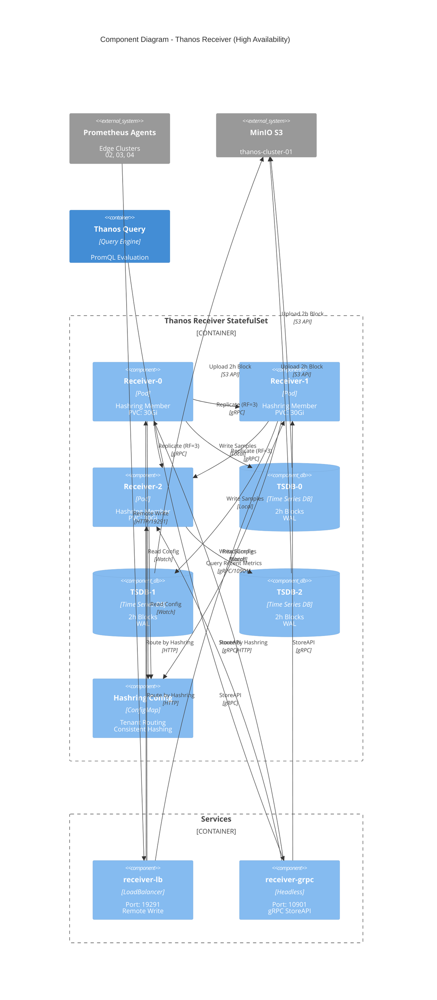
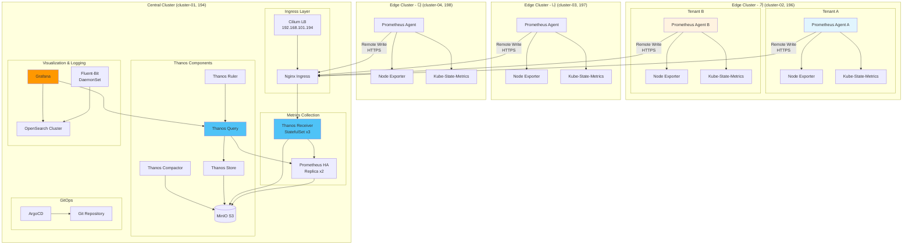
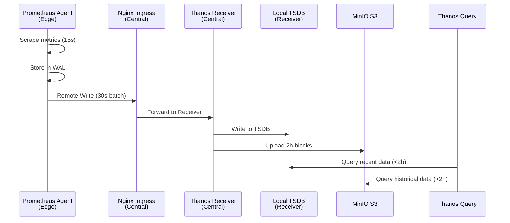
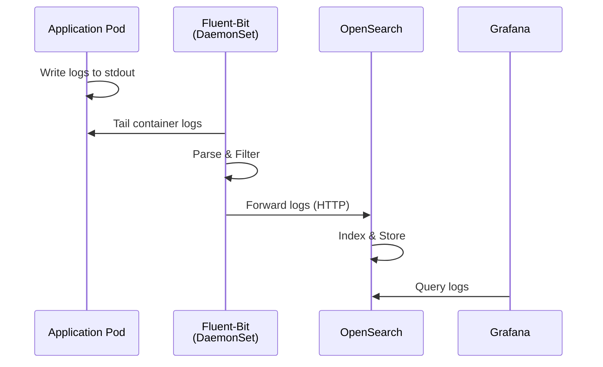

# 전체 시스템 아키텍처

## 📋 개요

Prometheus Agent + Thanos Receiver 패턴을 사용한 4개 클러스터 멀티클러스터 관찰성 플랫폼의 전체 시스템 아키텍처를 설명합니다.

---

## 🏗️ C4 Context Diagram (시스템 컨텍스트)



---

## 🏗️ C4 Container Diagram (Central Cluster)

```mermaid
C4Container
    title Container Diagram - Central Cluster (Cluster-01)

    Person(user, "User", "시스템 사용자")

    System_Boundary(cluster01, "Central Cluster (192.168.101.194)") {
        Container_Boundary(ingress, "Ingress Layer") {
            Container(cilium, "Cilium LB", "L2 LoadBalancer", "VIP: 192.168.101.210")
            Container(nginx, "Nginx Ingress", "Ingress Controller", "HTTP/HTTPS Routing")
        }

        Container_Boundary(metrics, "Metrics Pipeline") {
            ContainerDb(receiver, "Thanos Receiver", "StatefulSet x3", "Remote Write Endpoint<br/>Replication Factor=3")
            Container(query, "Thanos Query", "Deployment x2", "PromQL Query Engine<br/>Deduplication")
            ContainerDb(store, "Thanos Store", "StatefulSet x2", "S3 Gateway<br/>Historical Data")
            Container(compactor, "Thanos Compactor", "StatefulSet", "Downsampling<br/>7d→30d→180d")
            Container(ruler, "Thanos Ruler", "StatefulSet", "Recording/Alerting Rules")
        }

        Container_Boundary(viz, "Visualization") {
            Container(grafana, "Grafana", "Deployment", "Dashboard & Alerts<br/>Port: 3000")
            Container(alertmgr, "Alertmanager", "StatefulSet x3", "Alert Routing<br/>Slack/Email")
        }

        Container_Boundary(logging, "Logging Stack") {
            ContainerDb(opensearch, "OpenSearch", "StatefulSet x3", "Log Storage & Search<br/>90일 retention")
            Container(osd, "OpenSearch Dashboards", "Deployment", "Log Visualization")
            Container(fluentbit, "Fluent-Bit", "DaemonSet", "Log Collector")
        }

        Container_Boundary(gitops, "GitOps") {
            Container(argocd, "ArgoCD", "StatefulSet", "CD Pipeline<br/>App Sync")
        }
    }

    System_Ext(s3, "MinIO S3", "Object Storage")
    System_Ext(git, "Git Repo", "GitHub")

    System_Boundary(edge, "Edge Clusters") {
        Container(agent02, "Prom Agent 02", "Agent Mode", "Cluster-02<br/>Multi-Tenant")
        Container(agent03, "Prom Agent 03", "Agent Mode", "Cluster-03")
        Container(agent04, "Prom Agent 04", "Agent Mode", "Cluster-04")
    }

    Rel(user, cilium, "Access", "HTTPS")
    Rel(cilium, nginx, "Route", "HTTP")
    Rel(nginx, grafana, "Dashboard", "HTTP/3000")
    Rel(nginx, osd, "Logs", "HTTP/5601")

    Rel(agent02, nginx, "Remote Write", "HTTPS/9291")
    Rel(agent03, nginx, "Remote Write", "HTTPS/9291")
    Rel(agent04, nginx, "Remote Write", "HTTPS/9291")

    Rel(nginx, receiver, "Forward Metrics", "HTTP/19291")
    Rel(receiver, s3, "Upload Blocks", "S3 API")

    Rel(query, receiver, "Query Recent", "gRPC/10901")
    Rel(query, store, "Query Historical", "gRPC/10901")
    Rel(store, s3, "Read Blocks", "S3 API")
    Rel(compactor, s3, "Downsample", "S3 API")

    Rel(grafana, query, "PromQL", "HTTP/9090")
    Rel(grafana, opensearch, "Logs Query", "HTTP/9200")
    Rel(ruler, query, "Eval Rules", "HTTP/9090")
    Rel(ruler, alertmgr, "Send Alerts", "HTTP/9093")

    Rel(fluentbit, opensearch, "Ship Logs", "HTTP/9200")
    Rel(argocd, git, "Sync", "Git Pull")

    UpdateLayoutConfig($c4ShapeInRow="4", $c4BoundaryInRow="1")
```



---

## 🏗️ C4 Component Diagram (Thanos Receiver)



---

## 🏗️ 기존 상세 플로우 다이어그램



---

## 🎯 아키텍처 설계 원칙

### 1. 중앙집중식 메트릭 수집
- **Edge**: Prometheus Agent가 로컬 메트릭 수집 후 Remote Write
- **Central**: Thanos Receiver가 모든 클러스터 메트릭 수신 및 저장
- **이점**: 엣지 클러스터 리소스 사용량 최소화 (~80% 감소)

### 2. 고가용성 (HA)
- **Thanos Receiver**: StatefulSet 3 replicas (Hashring)
- **Prometheus HA**: 2 replicas (중복 수집 방지)
- **OpenSearch**: 3 nodes cluster
- **MinIO**: 분산 모드 (4 nodes, erasure coding)

### 3. 확장성
- **수평 확장**: Thanos Receiver Hashring으로 엣지 클러스터 무제한 확장
- **수직 확장**: Prometheus HA 스토리지 증설
- **다운샘플링**: 장기 메트릭 압축 (raw → 5m → 1h)

### 4. 격리 및 보안
- **멀티테넌시**: 가 클러스터 노드 반반 분할 (Tenant A/B)
- **네트워크 격리**: NetworkPolicy로 테넌트 간 트래픽 차단
- **TLS 암호화**: Remote Write, Ingress 모두 HTTPS

---

## 📊 클러스터 구성

| 클러스터 | IP | 역할 | CPU | Memory | Storage | 주요 컴포넌트 |
|---------|-----|------|-----|--------|---------|-------------|
| **cluster-01<br/>(중앙)** | 192.168.101.194 | 모니터링 허브 | 16 cores | 32Gi | 500Gi | Thanos Receiver/Query/Store/Compactor/Ruler<br/>Prometheus HA, Grafana, OpenSearch, ArgoCD |
| **cluster-02<br/>(가)** | 192.168.101.196 | 엣지 + 멀티테넌시 | 8 cores | 16Gi | 100Gi | Prometheus Agent x2 (Tenant A/B)<br/>Node Exporter, Kube-State-Metrics |
| **cluster-03<br/>(나)** | 192.168.101.197 | 엣지 | 4 cores | 8Gi | 50Gi | Prometheus Agent<br/>Node Exporter, Kube-State-Metrics |
| **cluster-04<br/>(다)** | 192.168.101.198 | 엣지 | 4 cores | 8Gi | 50Gi | Prometheus Agent<br/>Node Exporter, Kube-State-Metrics |

---

## 🔄 데이터 흐름

### 메트릭 수집 플로우



### 로그 수집 플로우



---

## 🧩 컴포넌트 역할

### Central Cluster (cluster-01)

#### Thanos Receiver
- **역할**: Remote Write 엔드포인트, 메트릭 수신 및 TSDB 저장
- **Replicas**: 3 (StatefulSet)
- **Replication Factor**: 3 (고가용성)
- **포트**:
  - 19291 (Remote Write)
  - 10901 (gRPC - Query 연동)
  - 10902 (HTTP - 상태 확인)

#### Thanos Query
- **역할**: 통합 쿼리 인터페이스 (Prometheus HA + Store 통합)
- **Replicas**: 2
- **포트**: 9090 (HTTP - Grafana 연동)
- **기능**: PromQL 쿼리, Deduplication

#### Thanos Store
- **역할**: S3에서 히스토리컬 메트릭 조회
- **Replicas**: 2
- **Cache**: Index Cache (Memcached)

#### Thanos Compactor
- **역할**: S3 블록 압축 및 다운샘플링
- **Replicas**: 1 (StatefulSet)
- **기능**:
  - 2h 블록 → 1d 블록 압축
  - Downsampling (5m, 1h resolution)

#### Thanos Ruler
- **역할**: Recording Rules 및 Alert Rules 평가
- **Replicas**: 2
- **Query Backend**: Thanos Query

#### Prometheus HA
- **역할**: 중앙 클러스터 자체 메트릭 수집
- **Replicas**: 2
- **Storage**: 100Gi (per replica)
- **Sidecar**: Thanos Sidecar (S3 업로드)

#### Grafana
- **역할**: 시각화 및 대시보드
- **Datasource**:
  - Prometheus (Thanos Query)
  - OpenSearch (로그)
- **인증**: Admin / OAuth (Optional)

#### OpenSearch
- **역할**: 로그 저장 및 검색
- **Nodes**: 3 (cluster)
- **Storage**: 200Gi (per node)
- **Retention**: 30d

#### ArgoCD
- **역할**: GitOps 배포 자동화
- **Applications**: 4개 클러스터 각각 관리
- **Sync Policy**: Auto (Optional)

### Edge Clusters (cluster-02, 03, 04)

#### Prometheus Agent
- **역할**: 경량 메트릭 수집 및 Remote Write
- **메모리**: ~200MB (vs Full Prometheus ~2GB)
- **기능**:
  - Scrape targets
  - Remote Write to Central
  - WAL 관리 (재전송)
- **비활성화**:
  - Local Query API
  - Alert Rules
  - Recording Rules

#### Node Exporter
- **역할**: 노드 메트릭 수집 (CPU, Memory, Disk, Network)
- **DaemonSet**: 모든 노드에 배포

#### Kube-State-Metrics
- **역할**: Kubernetes 리소스 메트릭 (Pods, Deployments, Services 등)
- **Replicas**: 1

---

## 🔐 보안 아키텍처

### TLS/암호화
```mermaid
graph LR
    A[Prometheus Agent] -->|HTTPS<br/>TLS 1.3| B[Nginx Ingress]
    B -->|HTTP<br/>(내부)| C[Thanos Receiver]
    C -->|HTTPS<br/>TLS| D[MinIO S3]
    E[User] -->|HTTPS<br/>TLS| B
    B -->|HTTP<br/>(내부)| F[Grafana]
```

### 접근 제어
- **RBAC**: Kubernetes 네이티브 역할 기반 접근 제어
- **NetworkPolicy**: Pod 간 트래픽 제어
- **Grafana Auth**: Admin 계정 + LDAP/OAuth
- **ArgoCD RBAC**: Application 별 권한 분리

---

## 📈 메트릭 보존 정책

| Resolution | 저장 위치 | 보존 기간 | 예상 크기 (4 clusters) |
|-----------|----------|----------|---------------------|
| **Raw (15s)** | Receiver TSDB + S3 | 7일 | ~350GB |
| **5m** | S3 (Downsampled) | 30일 | ~75GB |
| **1h** | S3 (Downsampled) | 180일 | ~36GB |
| **총계** | - | - | **~461GB** |

---

## 🚀 스케일링 전략

### 엣지 클러스터 추가 (4 → 10개)
1. ArgoCD Application 생성
2. Git 저장소에 overlay 추가
3. Remote Write URL 설정 → Thanos Receiver
4. 자동 Sync

### Thanos Receiver 확장 (3 → 5 replicas)
```bash
kubectl scale statefulset thanos-receive -n monitoring --replicas=5
```
- Hashring 자동 재분배
- 기존 데이터 유지

### Prometheus HA Storage 확장
```bash
kubectl edit pvc prometheus-kube-prometheus-stack-prometheus-db-prometheus-kube-prometheus-stack-prometheus-0 -n monitoring
# spec.resources.requests.storage: 100Gi → 200Gi
```

---

## 🔗 관련 문서

- **데이터 흐름 상세** → [데이터-흐름.md](./데이터-흐름.md)
- **고가용성 설계** → [고가용성-설계.md](./고가용성-설계.md)
- **Agent vs Full Prometheus** → [Agent-vs-Full-Prometheus.md](./Agent-vs-Full-Prometheus.md)

---

**최종 업데이트**: 2025-10-20
