# 전체 시스템 아키텍처

## 📋 개요

Prometheus Agent + Thanos Receiver 패턴을 사용한 4개 클러스터 멀티클러스터 관찰성 플랫폼의 전체 시스템 아키텍처를 설명합니다.

---

## 🏗️ 시스템 컨텍스트 다이어그램

```mermaid
graph TB
    subgraph Users["👥 사용자"]
        OPS[SRE/DevOps<br/>시스템 운영자]
        DEV[Developer<br/>개발자]
    end

    subgraph Platform["🏢 Observability Platform (Multi-Cluster)"]
        CENTRAL["🎯 Central Cluster<br/>Cluster-01 (192.168.101.194)<br/>통합 모니터링 및 저장"]

        subgraph EdgeClusters["엣지 클러스터"]
            EDGE02["📦 Edge Multi-Tenant<br/>Cluster-02 (196)<br/>멀티테넌트 엣지"]
            EDGE03["📦 Edge Cluster 나<br/>Cluster-03 (197)<br/>단일 테넌트"]
            EDGE04["📦 Edge Cluster 다<br/>Cluster-04 (198)<br/>단일 테넌트"]
        end
    end

    subgraph External["🌐 외부 시스템"]
        S3["💾 MinIO S3<br/>장기 메트릭 저장소<br/>180일 retention"]
        GIT["📚 Git Repository<br/>GitOps 설정<br/>GitHub"]
    end

    OPS -->|대시보드 조회<br/>알림 확인<br/>HTTPS| CENTRAL
    DEV -->|메트릭 쿼리<br/>로그 검색<br/>HTTPS| CENTRAL

    EDGE02 -.->|Remote Write<br/>HTTPS:9291| CENTRAL
    EDGE03 -.->|Remote Write<br/>HTTPS:9291| CENTRAL
    EDGE04 -.->|Remote Write<br/>HTTPS:9291| CENTRAL

    CENTRAL <-->|메트릭 업로드/조회<br/>S3 API| S3
    CENTRAL -->|설정 동기화<br/>Git Pull| GIT

    style CENTRAL fill:#4fc3f7,stroke:#0288d1,stroke-width:3px
    style EDGE02 fill:#81c784,stroke:#388e3c,stroke-width:2px
    style EDGE03 fill:#81c784,stroke:#388e3c,stroke-width:2px
    style EDGE04 fill:#81c784,stroke:#388e3c,stroke-width:2px
    style S3 fill:#ff9800,stroke:#e65100,stroke-width:2px
    style GIT fill:#9e9e9e,stroke:#424242,stroke-width:2px
```



---

## 🏗️ Central Cluster 상세 아키텍처

```mermaid
graph TB
    subgraph EdgeClusters["📡 Edge Clusters"]
        AGENT02[Prometheus Agent<br/>Cluster-02<br/>Multi-Tenant]
        AGENT03[Prometheus Agent<br/>Cluster-03]
        AGENT04[Prometheus Agent<br/>Cluster-04]
    end

    subgraph CentralCluster["🎯 Central Cluster (192.168.101.194)"]
        subgraph IngressLayer["Ingress Layer"]
            CILIUM[Cilium LB<br/>L2 LoadBalancer<br/>VIP: 192.168.101.210]
            NGINX[Nginx Ingress<br/>HTTP/HTTPS Router]
        end

        subgraph MetricsPipeline["📊 Metrics Pipeline"]
            RECEIVER[("Thanos Receiver<br/>StatefulSet x3<br/>RF=3")]
            QUERY["Thanos Query<br/>Deployment x2<br/>PromQL Engine"]
            STORE[("Thanos Store<br/>StatefulSet x2<br/>S3 Gateway")]
            COMPACTOR["Thanos Compactor<br/>Downsampling<br/>7d→30d→180d"]
            RULER["Thanos Ruler<br/>Recording Rules<br/>Alerting"]
        end

        subgraph Visualization["📈 Visualization"]
            GRAFANA["Grafana<br/>Deployment<br/>Port: 3000"]
            ALERTMGR["Alertmanager<br/>StatefulSet x3<br/>Slack/Email"]
        end

        subgraph LoggingStack["📝 Logging Stack"]
            OPENSEARCH[("OpenSearch<br/>StatefulSet x3<br/>90일 retention")]
            OSD["OpenSearch<br/>Dashboards<br/>Port: 5601"]
            FLUENTBIT["Fluent-Bit<br/>DaemonSet<br/>Log Collector"]
        end

        subgraph GitOps["🔄 GitOps"]
            ARGOCD["ArgoCD<br/>StatefulSet<br/>CD Pipeline"]
        end
    end

    subgraph ExternalSystems["🌐 External Systems"]
        S3[("MinIO S3<br/>Object Storage<br/>Metrics + Logs")]
        GIT["Git Repository<br/>GitHub<br/>Config Store"]
    end

    USER[👤 User]

    %% User flow
    USER -->|HTTPS| CILIUM
    CILIUM --> NGINX
    NGINX -->|Dashboard| GRAFANA
    NGINX -->|Logs UI| OSD

    %% Remote Write flow
    AGENT02 -.->|Remote Write<br/>HTTPS:9291| NGINX
    AGENT03 -.->|Remote Write<br/>HTTPS:9291| NGINX
    AGENT04 -.->|Remote Write<br/>HTTPS:9291| NGINX
    NGINX -->|Forward| RECEIVER

    %% Metrics storage flow
    RECEIVER -->|Upload 2h Blocks<br/>S3 API| S3
    COMPACTOR -->|Downsampling<br/>S3 API| S3

    %% Query flow
    QUERY -->|Recent Data<br/>gRPC:10901| RECEIVER
    QUERY -->|Historical Data<br/>gRPC:10901| STORE
    STORE <-->|Read Blocks<br/>S3 API| S3
    GRAFANA -->|PromQL<br/>HTTP:9090| QUERY
    RULER -->|Eval Rules<br/>HTTP:9090| QUERY
    RULER -->|Send Alerts<br/>HTTP:9093| ALERTMGR

    %% Logging flow
    FLUENTBIT -->|Ship Logs<br/>HTTP:9200| OPENSEARCH
    OPENSEARCH -->|S3 Snapshot| S3
    GRAFANA -->|Logs Query<br/>HTTP:9200| OPENSEARCH

    %% GitOps flow
    ARGOCD -->|Git Sync<br/>HTTPS| GIT

    style RECEIVER fill:#4fc3f7,stroke:#0288d1,stroke-width:3px
    style QUERY fill:#4fc3f7,stroke:#0288d1,stroke-width:2px
    style STORE fill:#4fc3f7,stroke:#0288d1,stroke-width:2px
    style GRAFANA fill:#66bb6a,stroke:#388e3c,stroke-width:2px
    style OPENSEARCH fill:#ffa726,stroke:#e65100,stroke-width:2px
    style S3 fill:#ff7043,stroke:#d84315,stroke-width:3px
```



---

## 🏗️ Thanos Receiver 고가용성 구조


---

## 🏗️ 기존 상세 플로우 다이어그램


---

## 🎯 아키텍처 설계 원칙

### 1. 중앙집중식 메트릭 수집
- **Edge**: Prometheus Agent가 로컬 메트릭 수집 후 Remote Write
- **Central**: Thanos Receiver가 모든 클러스터 메트릭 수신 및 저장
- **이점**: 엣지 클러스터 리소스 사용량 최소화 (~80% 감소)

### 2. 고가용성 (HA)
- **Thanos Receiver**: StatefulSet 3 replicas (Hashring)
- **Prometheus HA**: 2 replicas (중복 수집 방지)
- **OpenSearch**: 3 nodes cluster
- **MinIO**: 분산 모드 (4 nodes, erasure coding)

### 3. 확장성
- **수평 확장**: Thanos Receiver Hashring으로 엣지 클러스터 무제한 확장
- **수직 확장**: Prometheus HA 스토리지 증설
- **다운샘플링**: 장기 메트릭 압축 (raw → 5m → 1h)

### 4. 격리 및 보안
- **멀티테넌시**: 가 클러스터 노드 반반 분할 (Tenant A/B)
- **네트워크 격리**: NetworkPolicy로 테넌트 간 트래픽 차단
- **TLS 암호화**: Remote Write, Ingress 모두 HTTPS

---

## 📊 클러스터 구성

| 클러스터 | IP | 역할 | CPU | Memory | Storage | 주요 컴포넌트 |
|---------|-----|------|-----|--------|---------|-------------|
| **cluster-01<br/>(중앙)** | 192.168.101.194 | 모니터링 허브 | 16 cores | 32Gi | 500Gi | Thanos Receiver/Query/Store/Compactor/Ruler<br/>Prometheus HA, Grafana, OpenSearch, ArgoCD |
| **cluster-02<br/>(가)** | 192.168.101.196 | 엣지 + 멀티테넌시 | 8 cores | 16Gi | 100Gi | Prometheus Agent x2 (Tenant A/B)<br/>Node Exporter, Kube-State-Metrics |
| **cluster-03<br/>(나)** | 192.168.101.197 | 엣지 | 4 cores | 8Gi | 50Gi | Prometheus Agent<br/>Node Exporter, Kube-State-Metrics |
| **cluster-04<br/>(다)** | 192.168.101.198 | 엣지 | 4 cores | 8Gi | 50Gi | Prometheus Agent<br/>Node Exporter, Kube-State-Metrics |

---

## 🔄 데이터 흐름

### 메트릭 수집 플로우


### 로그 수집 플로우


---

## 🧩 컴포넌트 역할

### Central Cluster (cluster-01)

#### Thanos Receiver
- **역할**: Remote Write 엔드포인트, 메트릭 수신 및 TSDB 저장
- **Replicas**: 3 (StatefulSet)
- **Replication Factor**: 3 (고가용성)
- **포트**:
  - 19291 (Remote Write)
  - 10901 (gRPC - Query 연동)
  - 10902 (HTTP - 상태 확인)

#### Thanos Query
- **역할**: 통합 쿼리 인터페이스 (Prometheus HA + Store 통합)
- **Replicas**: 2
- **포트**: 9090 (HTTP - Grafana 연동)
- **기능**: PromQL 쿼리, Deduplication

#### Thanos Store
- **역할**: S3에서 히스토리컬 메트릭 조회
- **Replicas**: 2
- **Cache**: Index Cache (Memcached)

#### Thanos Compactor
- **역할**: S3 블록 압축 및 다운샘플링
- **Replicas**: 1 (StatefulSet)
- **기능**:
  - 2h 블록 → 1d 블록 압축
  - Downsampling (5m, 1h resolution)

#### Thanos Ruler
- **역할**: Recording Rules 및 Alert Rules 평가
- **Replicas**: 2
- **Query Backend**: Thanos Query

#### Prometheus HA
- **역할**: 중앙 클러스터 자체 메트릭 수집
- **Replicas**: 2
- **Storage**: 100Gi (per replica)
- **Sidecar**: Thanos Sidecar (S3 업로드)

#### Grafana
- **역할**: 시각화 및 대시보드
- **Datasource**:
  - Prometheus (Thanos Query)
  - OpenSearch (로그)
- **인증**: Admin / OAuth (Optional)

#### OpenSearch
- **역할**: 로그 저장 및 검색
- **Nodes**: 3 (cluster)
- **Storage**: 200Gi (per node)
- **Retention**: 30d

#### ArgoCD
- **역할**: GitOps 배포 자동화
- **Applications**: 4개 클러스터 각각 관리
- **Sync Policy**: Auto (Optional)

### Edge Clusters (cluster-02, 03, 04)

#### Prometheus Agent
- **역할**: 경량 메트릭 수집 및 Remote Write
- **메모리**: ~200MB (vs Full Prometheus ~2GB)
- **기능**:
  - Scrape targets
  - Remote Write to Central
  - WAL 관리 (재전송)
- **비활성화**:
  - Local Query API
  - Alert Rules
  - Recording Rules

#### Node Exporter
- **역할**: 노드 메트릭 수집 (CPU, Memory, Disk, Network)
- **DaemonSet**: 모든 노드에 배포

#### Kube-State-Metrics
- **역할**: Kubernetes 리소스 메트릭 (Pods, Deployments, Services 등)
- **Replicas**: 1

---

## 🔐 보안 아키텍처

### TLS/암호화
```mermaid
graph LR
    A[Prometheus Agent] -->|HTTPS<br/>TLS 1.3| B[Nginx Ingress]
    B -->|HTTP<br/>(내부)| C[Thanos Receiver]
    C -->|HTTPS<br/>TLS| D[MinIO S3]
    E[User] -->|HTTPS<br/>TLS| B
    B -->|HTTP<br/>(내부)| F[Grafana]
```

### 접근 제어
- **RBAC**: Kubernetes 네이티브 역할 기반 접근 제어
- **NetworkPolicy**: Pod 간 트래픽 제어
- **Grafana Auth**: Admin 계정 + LDAP/OAuth
- **ArgoCD RBAC**: Application 별 권한 분리

---

## 📈 메트릭 보존 정책

| Resolution | 저장 위치 | 보존 기간 | 예상 크기 (4 clusters) |
|-----------|----------|----------|---------------------|
| **Raw (15s)** | Receiver TSDB + S3 | 7일 | ~350GB |
| **5m** | S3 (Downsampled) | 30일 | ~75GB |
| **1h** | S3 (Downsampled) | 180일 | ~36GB |
| **총계** | - | - | **~461GB** |

---

## 🚀 스케일링 전략

### 엣지 클러스터 추가 (4 → 10개)
1. ArgoCD Application 생성
2. Git 저장소에 overlay 추가
3. Remote Write URL 설정 → Thanos Receiver
4. 자동 Sync

### Thanos Receiver 확장 (3 → 5 replicas)
```bash
kubectl scale statefulset thanos-receive -n monitoring --replicas=5
```
- Hashring 자동 재분배
- 기존 데이터 유지

### Prometheus HA Storage 확장
```bash
kubectl edit pvc prometheus-kube-prometheus-stack-prometheus-db-prometheus-kube-prometheus-stack-prometheus-0 -n monitoring
# spec.resources.requests.storage: 100Gi → 200Gi
```

---

## 🔗 관련 문서

- **데이터 흐름 상세** → [데이터-흐름.md](./데이터-흐름.md)
- **고가용성 설계** → [고가용성-설계.md](./고가용성-설계.md)
- **Agent vs Full Prometheus** → [Agent-vs-Full-Prometheus.md](./Agent-vs-Full-Prometheus.md)

---

**최종 업데이트**: 2025-10-20
