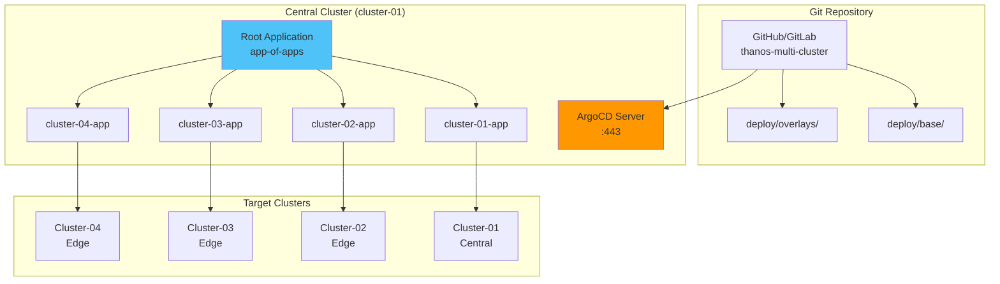

# ArgoCD 설치 및 설정

## 📋 개요

ArgoCD를 사용하여 4개 클러스터에 Prometheus Agent + Thanos Receiver 환경을 GitOps 방식으로 배포하고 관리합니다.

---

## 🎯 목표

- ArgoCD 중앙 클러스터 설치
- 4개 클러스터 등록
- Application-of-Applications 패턴 구성
- 자동 동기화 설정

---

## 🏗️ ArgoCD 아키텍처



---

## 1️⃣ ArgoCD 설치 (Central Cluster)

### Helm Chart 설치

```bash
# Helm Repository 추가
helm repo add argo https://argoproj.github.io/argo-helm
helm repo update

# ArgoCD Namespace 생성
kubectl create namespace argocd

# ArgoCD 설치
helm install argocd argo/argo-cd \
  --namespace argocd \
  --version 5.51.0 \
  --values argocd-values.yaml
```

### argocd-values.yaml

```yaml
# ArgoCD Helm Values
global:
  domain: argocd.k8s-cluster-01.miribit.lab

server:
  replicas: 2

  ingress:
    enabled: true
    ingressClassName: nginx
    hosts:
      - argocd.k8s-cluster-01.miribit.lab
    tls:
      - secretName: argocd-tls
        hosts:
          - argocd.k8s-cluster-01.miribit.lab
    annotations:
      cert-manager.io/cluster-issuer: selfsigned-issuer
      nginx.ingress.kubernetes.io/ssl-redirect: "true"
      nginx.ingress.kubernetes.io/backend-protocol: "HTTPS"

  resources:
    requests:
      cpu: 200m
      memory: 256Mi
    limits:
      cpu: 500m
      memory: 512Mi

  config:
    # Kustomize + Helm 지원
    kustomize.buildOptions: --enable-helm

    # Repository Credentials (Private Repo)
    repositories: |
      - type: git
        url: https://github.com/your-org/thanos-multi-cluster
        passwordSecret:
          name: git-repo-secret
          key: password
        usernameSecret:
          name: git-repo-secret
          key: username

repoServer:
  replicas: 2
  resources:
    requests:
      cpu: 200m
      memory: 256Mi

controller:
  replicas: 1
  resources:
    requests:
      cpu: 500m
      memory: 512Mi

redis:
  enabled: true

dex:
  enabled: false  # LDAP/OAuth 미사용 시

notifications:
  enabled: true
  argocdUrl: https://argocd.k8s-cluster-01.miribit.lab

configs:
  secret:
    # Admin 초기 비밀번호 (변경 필수)
    argocdServerAdminPassword: "$2a$10$..."  # bcrypt hash
```

### 설치 확인

```bash
# ArgoCD Pod 확인
kubectl get pods -n argocd

# 출력 예시:
# argocd-server-xxx         1/1     Running
# argocd-repo-server-xxx    1/1     Running
# argocd-application-controller-xxx  1/1     Running
# argocd-redis-xxx          1/1     Running

# Admin 비밀번호 확인 (초기)
kubectl -n argocd get secret argocd-initial-admin-secret -o jsonpath="{.data.password}" | base64 -d
```

### ArgoCD CLI 설치

```bash
# CLI 설치 (Linux)
curl -sSL -o /usr/local/bin/argocd \
  https://github.com/argoproj/argo-cd/releases/latest/download/argocd-linux-amd64
chmod +x /usr/local/bin/argocd

# 로그인
argocd login argocd.k8s-cluster-01.miribit.lab \
  --username admin \
  --password <초기-비밀번호>

# 비밀번호 변경
argocd account update-password
```

---

## 2️⃣ 클러스터 등록

### Kubeconfig 준비

```bash
# 4개 클러스터 kubeconfig 병합 (이미 완료)
export KUBECONFIG=~/.kube/config

# 컨텍스트 확인
kubectl config get-contexts

# 출력:
# cluster-01 (central)
# cluster-02 (edge)
# cluster-03 (edge)
# cluster-04 (edge)
```

### ArgoCD에 클러스터 등록

```bash
# Cluster-01 (in-cluster, 기본 등록됨)
argocd cluster add cluster-01 --name cluster-01-central

# Cluster-02 (Edge)
argocd cluster add cluster-02 --name cluster-02-edge

# Cluster-03 (Edge)
argocd cluster add cluster-03 --name cluster-03-edge

# Cluster-04 (Edge)
argocd cluster add cluster-04 --name cluster-04-edge

# 등록 확인
argocd cluster list

# 출력:
# SERVER                          NAME                 VERSION  STATUS
# https://kubernetes.default.svc  cluster-01-central   1.28     Successful
# https://192.168.101.196:6443    cluster-02-edge      1.28     Successful
# https://192.168.101.197:6443    cluster-03-edge      1.28     Successful
# https://192.168.101.198:6443    cluster-04-edge      1.28     Successful
```

### 클러스터 Secret 확인

```bash
# ArgoCD가 생성한 클러스터 Secret
kubectl get secrets -n argocd -l argocd.argoproj.io/secret-type=cluster

# 출력:
# cluster-cluster-01-central-xxx
# cluster-cluster-02-edge-xxx
# cluster-cluster-03-edge-xxx
# cluster-cluster-04-edge-xxx
```

---

## 3️⃣ Git Repository 구조

### 디렉토리 레이아웃

```
thanos-multi-cluster/
├── deploy/
│   ├── base/
│   │   ├── kube-prometheus-stack/
│   │   │   ├── kustomization.yaml
│   │   │   └── values.yaml
│   │   ├── prometheus-agent/
│   │   │   ├── kustomization.yaml
│   │   │   └── values.yaml
│   │   ├── longhorn/
│   │   └── opensearch-cluster/
│   │
│   └── overlays/
│       ├── cluster-01-central/
│       │   ├── kube-prometheus-stack/
│       │   │   ├── kustomization.yaml
│       │   │   ├── thanos-receiver.yaml
│       │   │   ├── thanos-query.yaml
│       │   │   ├── thanos-store.yaml
│       │   │   └── thanos-compactor.yaml
│       │   ├── longhorn/
│       │   └── opensearch-cluster/
│       │
│       ├── cluster-02-edge/
│       │   └── prometheus-agent/
│       │       ├── kustomization.yaml
│       │       └── remote-write-patch.yaml
│       │
│       ├── cluster-03-edge/
│       │   └── prometheus-agent/
│       │
│       └── cluster-04-edge/
│           └── prometheus-agent/
│
├── argocd/
│   ├── app-of-apps.yaml
│   ├── cluster-01-app.yaml
│   ├── cluster-02-app.yaml
│   ├── cluster-03-app.yaml
│   └── cluster-04-app.yaml
│
└── scripts/
    └── deploy-all.sh
```

---

## 4️⃣ Application-of-Applications 패턴

### Root Application (app-of-apps.yaml)

```yaml
apiVersion: argoproj.io/v1alpha1
kind: Application
metadata:
  name: thanos-root
  namespace: argocd
spec:
  project: default

  source:
    repoURL: https://github.com/your-org/thanos-multi-cluster
    targetRevision: main
    path: argocd  # app-of-apps YAML들이 있는 경로

  destination:
    server: https://kubernetes.default.svc
    namespace: argocd

  syncPolicy:
    automated:
      prune: true
      selfHeal: true
    syncOptions:
      - CreateNamespace=true
```

### Cluster-01 Application

```yaml
# argocd/cluster-01-app.yaml
apiVersion: argoproj.io/v1alpha1
kind: Application
metadata:
  name: cluster-01-central
  namespace: argocd
  finalizers:
    - resources-finalizer.argocd.argoproj.io
spec:
  project: default

  source:
    repoURL: https://github.com/your-org/thanos-multi-cluster
    targetRevision: main
    path: deploy/overlays/cluster-01-central

  destination:
    server: https://kubernetes.default.svc
    namespace: monitoring

  syncPolicy:
    automated:
      prune: true
      selfHeal: true
    syncOptions:
      - CreateNamespace=true
    retry:
      limit: 5
      backoff:
        duration: 5s
        factor: 2
        maxDuration: 3m

  # Sync Waves (순서대로 배포)
  sync:
    hooks:
      - name: pre-sync-hook
        type: PreSync
```

### Cluster-02 Application

```yaml
# argocd/cluster-02-app.yaml
apiVersion: argoproj.io/v1alpha1
kind: Application
metadata:
  name: cluster-02-edge
  namespace: argocd
spec:
  project: default

  source:
    repoURL: https://github.com/your-org/thanos-multi-cluster
    targetRevision: main
    path: deploy/overlays/cluster-02-edge

  destination:
    server: https://192.168.101.196:6443  # Cluster-02
    namespace: monitoring

  syncPolicy:
    automated:
      prune: true
      selfHeal: true
    syncOptions:
      - CreateNamespace=true
```

---

## 5️⃣ Root Application 배포

### 수동 배포

```bash
# Root Application 생성
kubectl apply -f argocd/app-of-apps.yaml

# 배포 확인
argocd app list

# 출력:
# NAME                  CLUSTER            NAMESPACE   STATUS
# thanos-root           cluster-01         argocd      Synced
# cluster-01-central    cluster-01         monitoring  Synced
# cluster-02-edge       cluster-02         monitoring  Synced
# cluster-03-edge       cluster-03         monitoring  Synced
# cluster-04-edge       cluster-04         monitoring  Synced
```

### 자동 동기화 상태 확인

```bash
# Application 상태 상세 확인
argocd app get cluster-01-central

# 출력:
# Name:               cluster-01-central
# Project:            default
# Server:             https://kubernetes.default.svc
# Namespace:          monitoring
# URL:                https://argocd.../applications/cluster-01-central
# Repo:               https://github.com/.../thanos-multi-cluster
# Target:             main
# Path:               deploy/overlays/cluster-01-central
# SyncWindow:         Sync Allowed
# Sync Policy:        Automated (Prune)
# Sync Status:        Synced to main (abc123)
# Health Status:      Healthy
```

---

## 6️⃣ RBAC 설정

### ArgoCD Projects

```yaml
apiVersion: argoproj.io/v1alpha1
kind: AppProject
metadata:
  name: thanos-project
  namespace: argocd
spec:
  description: Thanos Multi-Cluster Project

  # 허용된 소스 저장소
  sourceRepos:
    - https://github.com/your-org/thanos-multi-cluster

  # 배포 가능한 클러스터
  destinations:
    - server: https://kubernetes.default.svc
      namespace: monitoring
    - server: https://192.168.101.196:6443
      namespace: monitoring
    - server: https://192.168.101.197:6443
      namespace: monitoring
    - server: https://192.168.101.198:6443
      namespace: monitoring

  # 허용된 리소스
  clusterResourceWhitelist:
    - group: '*'
      kind: '*'

  namespaceResourceWhitelist:
    - group: '*'
      kind: '*'
```

### 사용자 RBAC

```yaml
# argocd-rbac-cm ConfigMap
apiVersion: v1
kind: ConfigMap
metadata:
  name: argocd-rbac-cm
  namespace: argocd
data:
  policy.default: role:readonly
  policy.csv: |
    # Admin 그룹
    p, role:admin, applications, *, */*, allow
    p, role:admin, clusters, *, *, allow
    p, role:admin, repositories, *, *, allow
    g, admin-group, role:admin

    # Developer 그룹 (읽기만)
    p, role:developer, applications, get, */*, allow
    p, role:developer, applications, sync, */*, allow
    g, developer-group, role:developer
```

---

## 🚨 모니터링 및 알림

### ArgoCD Notifications

```yaml
apiVersion: v1
kind: ConfigMap
metadata:
  name: argocd-notifications-cm
  namespace: argocd
data:
  # Slack 알림
  service.slack: |
    token: $slack-token

  # 알림 트리거
  trigger.on-sync-failed: |
    - when: app.status.operationState.phase in ['Error', 'Failed']
      send: [app-sync-failed]

  trigger.on-sync-succeeded: |
    - when: app.status.operationState.phase in ['Succeeded']
      send: [app-sync-succeeded]

  # 알림 템플릿
  template.app-sync-failed: |
    message: |
      Application {{.app.metadata.name}} sync failed.
      Revision: {{.app.status.sync.revision}}

  template.app-sync-succeeded: |
    message: |
      Application {{.app.metadata.name}} synced successfully.
```

### Prometheus Metrics

```promql
# ArgoCD Application 상태
argocd_app_info{sync_status="Synced"}

# Sync 실패
argocd_app_sync_total{phase="Failed"}
```

---

## 🎯 배포 체크리스트

### ArgoCD 설치
- [x] Helm Chart 설치
- [x] Ingress 설정 (argocd.k8s-cluster-01.miribit.lab)
- [x] Admin 비밀번호 변경
- [x] CLI 설치 및 로그인

### 클러스터 등록
- [x] Kubeconfig 병합
- [x] 4개 클러스터 ArgoCD 등록
- [x] 클러스터 연결 확인

### Git Repository
- [x] Repository 구조 생성
- [x] base/overlays 디렉토리
- [x] ArgoCD Application YAML 작성

### Application 배포
- [x] Root Application 생성
- [x] App-of-Apps 패턴 구성
- [x] 자동 동기화 활성화
- [x] Sync 상태 확인

---

## 🔗 관련 문서

- **Kustomize 구조** → [Kustomize-구조.md](./Kustomize-구조.md)
- **중앙 클러스터 배포** → [중앙-클러스터-배포.md](./중앙-클러스터-배포.md)
- **배포 검증** → [배포-검증.md](./배포-검증.md)

---

**최종 업데이트**: 2025-10-20
