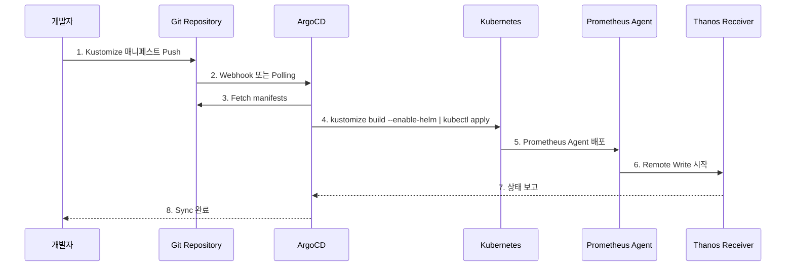

# 02. Kustomize + Helm + GitOps 배포

## 📋 개요

Kustomize와 Helm Chart를 결합하고 ArgoCD를 통해 GitOps 방식으로 4개 클러스터에 배포하는 전체 프로세스를 설명합니다.

---

## 📂 문서 목록

### 1. ArgoCD-설치-및-설정.md
**목적**: ArgoCD 중앙 배포 및 멀티 클러스터 등록

**주요 내용**:
- ArgoCD Helm Chart 설치
- Ingress 설정 (argocd.k8s-cluster-01.miribit.lab)
- 4개 클러스터 등록
- App-of-Apps 패턴 구성
- RBAC 및 알림 설정

**대상 독자**: GitOps 담당자, DevOps 엔지니어

---

### 2. Kustomize-구조.md
**목적**: Kustomize와 Helm Chart 통합 방법

**주요 내용**:
- Base/Overlay 디렉토리 구조
- `helmCharts` 섹션으로 Helm 통합
- `values.yaml` 오버라이드
- Patch 전략 (Strategic Merge, JSON 6902)
- `kustomize build --enable-helm` 명령어

**대상 독자**: DevOps 엔지니어, 배포 담당자

---

### 3. 중앙-클러스터-배포.md
**목적**: Cluster-01 (192.168.101.194) 중앙 클러스터 배포

**주요 내용**:
- Thanos Receiver StatefulSet (3 replicas)
- Prometheus HA (2 replicas) + Thanos Sidecar
- Thanos Query, Store, Compactor, Ruler
- Grafana + Ingress
- OpenSearch Cluster
- S3 Secret 생성
- Sync Wave 순서

**대상 독자**: 배포 담당자

---

### 4. 엣지-클러스터-배포.md
**목적**: Cluster-02, 03, 04 엣지 클러스터 배포

**주요 내용**:
- Prometheus Agent Mode 배포
- Node Exporter + Kube-State-Metrics
- Remote Write 설정 (→ Thanos Receiver)
- 클러스터별 externalLabels
- Cluster-02 멀티테넌시 구성 (Tenant A/B)
- Node Affinity 설정

**대상 독자**: 배포 담당자

---

### 5. 멀티테넌시-배포.md
**목적**: Cluster-02 노드 레벨 멀티테넌시 구성

**주요 내용**:
- 노드 레이블링 (tenant=tenant-a/b)
- Namespace 격리 (monitoring-tenant-a/b)
- Prometheus Agent 분리 배포
- Shared Kube-State-Metrics
- Thanos Receiver Hashring (Tenant Routing)
- X-Scope-OrgID 헤더

**대상 독자**: 멀티테넌시 담당자

---

### 6. S3-스토리지-설정.md
**목적**: MinIO S3 버킷 생성 및 Thanos 연결

**주요 내용**:
- MinIO Client (mc) 설치
- 버킷 생성 (thanos-cluster-01/02/03/04)
- objstore.yml Secret 생성
- IAM Policy 설정
- Lifecycle Policy (자동 삭제)
- Server-Side Encryption (SSE-S3)
- 저장소 용량 추정

**대상 독자**: 스토리지 담당자

---

### 7. 배포-검증.md
**목적**: 배포 후 체계적 검증 절차

**주요 내용**:
- Pod 상태 확인 (Running, Ready)
- PVC 바인딩 확인 (Bound)
- Service/Endpoint 확인
- Remote Write 연결 확인
- S3 업로드 확인 (Sidecar, Store, Compactor)
- 메트릭 쿼리 테스트 (PromQL)
- 고가용성 확인 (HA, Replication Factor)
- 자동화 검증 스크립트

**대상 독자**: 배포 담당자, QA

---

### 8. 롤백-절차.md
**목적**: 배포 실패 시 안전한 롤백 절차

**주요 내용**:
- Helm Rollback (Revision 기반)
- Git Revert + ArgoCD Sync
- ConfigMap/Secret 복원
- StatefulSet/Deployment Rollback
- PVC/데이터 복원 (Longhorn Snapshot)
- 멀티 클러스터 롤백 스크립트
- Best Practices

**대상 독자**: SRE, DevOps 엔지니어

---

### 9. Kustomization-YAML-템플릿.md
**목적**: 재사용 가능한 Kustomization 템플릿 모음

**주요 내용**:
- Base kustomization.yaml 템플릿
- Overlay kustomization.yaml 템플릿
- Patch 예시 (values-patch, resource-patch)
- 환경별 변수 관리
- 멀티 클러스터 변수 치환

**대상 독자**: DevOps 엔지니어

---

## 🎯 배포 워크플로우



---

## 🚀 빠른 시작

### 1. ArgoCD 설치

```bash
# ArgoCD 설치 가이드 확인
cat ArgoCD-설치-및-설정.md

# Helm으로 ArgoCD 설치
helm repo add argo https://argoproj.github.io/argo-helm
helm install argocd argo/argo-cd --namespace argocd --create-namespace

# 클러스터 등록
argocd cluster add cluster-01 --name cluster-01-central
argocd cluster add cluster-02 --name cluster-02-edge
argocd cluster add cluster-03 --name cluster-03-edge
argocd cluster add cluster-04 --name cluster-04-edge
```

### 2. 중앙 클러스터 배포

```bash
# 배포 가이드 확인
cat 중앙-클러스터-배포.md

# S3 Secret 생성
kubectl apply -f deploy/overlays/cluster-01-central/kube-prometheus-stack/thanos-objstore-secret.yaml

# Kustomize 배포
kustomize build deploy/overlays/cluster-01-central/kube-prometheus-stack --enable-helm \
  | kubectl apply -f -
```

### 3. 엣지 클러스터 배포

```bash
# Cluster-03 배포
export KUBECONFIG=~/.kube/configs/cluster-03.conf
kustomize build deploy/overlays/cluster-03-edge/prometheus-agent --enable-helm \
  | kubectl apply -f -

# Cluster-04 배포
export KUBECONFIG=~/.kube/configs/cluster-04.conf
kustomize build deploy/overlays/cluster-04-edge/prometheus-agent --enable-helm \
  | kubectl apply -f -
```

### 4. 멀티테넌시 설정 (Cluster-02)

```bash
# 노드 레이블링
kubectl label node <node-a> tenant=tenant-a
kubectl label node <node-b> tenant=tenant-b

# Tenant A Agent 배포
kustomize build deploy/overlays/cluster-02-edge/prometheus-agent-tenant-a --enable-helm \
  | kubectl apply -f -

# Tenant B Agent 배포
kustomize build deploy/overlays/cluster-02-edge/prometheus-agent-tenant-b --enable-helm \
  | kubectl apply -f -
```

### 5. 배포 검증

```bash
# 검증 스크립트 실행
./scripts/validate-deployment.sh

# 메트릭 쿼리 테스트
kubectl port-forward -n monitoring svc/thanos-query 9090:9090
# 브라우저: http://localhost:9090
```

---

## 📊 배포 순서 (Sync Wave)

| Wave | 컴포넌트 | 클러스터 | 설명 |
|------|---------|----------|------|
| 0 | Longhorn, Namespace | 모두 | 스토리지 및 기본 리소스 |
| 1 | Secrets (objstore.yml) | 모두 | S3 인증 정보 |
| 2 | Prometheus HA, Receiver | cluster-01 | 중앙 데이터 수신 준비 |
| 3 | Prometheus Agent | cluster-02/03/04 | 엣지 메트릭 수집 시작 |
| 4 | Thanos Query, Store, Compactor | cluster-01 | 쿼리 및 장기 저장 |
| 5 | Grafana | cluster-01 | 시각화 UI |
| 6 | OpenSearch | cluster-01 | 로그 수집 |

---

## 🔑 핵심 개념

### Kustomize + Helm 통합

```yaml
# kustomization.yaml
apiVersion: kustomize.config.k8s.io/v1beta1
kind: Kustomization

helmCharts:
- name: kube-prometheus-stack
  repo: https://prometheus-community.github.io/helm-charts
  version: 58.0.0
  releaseName: prometheus-agent
  namespace: monitoring
  valuesFile: values.yaml

patchesStrategicMerge:
  - values-patch.yaml
```

### 배포 명령어

```bash
# Kustomize + Helm 빌드
kustomize build . --enable-helm

# 직접 배포
kustomize build . --enable-helm | kubectl apply -f -

# ArgoCD 자동 배포 (GitOps)
argocd app sync cluster-01-central
```

---

## 🛠️ 트러블슈팅

### 문제: ArgoCD Sync 실패

**원인**: `--enable-helm` 플래그 누락

**해결**:
```yaml
# ArgoCD Application YAML
spec:
  source:
    plugin:
      name: kustomize-build-options
      env:
        - name: KUSTOMIZE_BUILD_OPTIONS
          value: "--enable-helm"
```

### 문제: Remote Write 실패

**원인**: Thanos Receiver Service 없음

**해결**:
```bash
# Receiver Service 확인
kubectl get svc -n monitoring thanos-receive-lb

# 없으면 배포
kubectl apply -f thanos-receiver.yaml
```

### 문제: S3 업로드 실패

**원인**: objstore.yml Secret 없음

**해결**:
```bash
# Secret 생성
kubectl apply -f thanos-objstore-secret.yaml

# Sidecar 재시작
kubectl rollout restart statefulset/prometheus-kube-prometheus-stack-prometheus -n monitoring
```

---

## 📈 성능 메트릭

### 배포 시간

| 클러스터 | 컴포넌트 수 | 배포 시간 |
|----------|------------|----------|
| cluster-01 | 12개 | ~10분 |
| cluster-02 | 5개 (Multi-Tenant) | ~5분 |
| cluster-03 | 3개 | ~3분 |
| cluster-04 | 3개 | ~3분 |
| **총합** | **23개** | **~21분** |

### 리소스 사용량 (배포 후)

| 클러스터 | CPU (requests) | Memory (requests) | Storage |
|----------|----------------|-------------------|---------|
| cluster-01 | 5.5 cores | 12Gi | 650Gi |
| cluster-02 | 650m | 704Mi | 100Gi |
| cluster-03 | 350m | 384Mi | 50Gi |
| cluster-04 | 350m | 384Mi | 50Gi |
| **총합** | **6.85 cores** | **~14Gi** | **850Gi** |

---

## 🔗 관련 섹션

- **아키텍처** → [../01-아키텍처/](../01-아키텍처/)
- **운영 가이드** → [../03-운영-가이드/](../03-운영-가이드/)
- **모니터링** → [../04-모니터링-가이드/](../04-모니터링-가이드/)
- **멀티테넌시** → [../05-멀티테넌시-구성/](../05-멀티테넌시-구성/)
- **성능 최적화** → [../09-성능-최적화/](../09-성능-최적화/)

---

**최종 업데이트**: 2025-10-20
