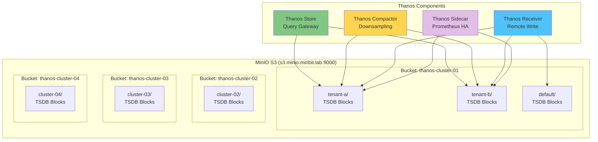

# S3 스토리지 설정

## 📋 개요

MinIO S3를 사용하여 Thanos 컴포넌트(Sidecar, Receiver, Store, Compactor)가 장기 메트릭 데이터를 저장하고 관리할 수 있도록 설정합니다.

---

## 🎯 S3 설정 목표

- **MinIO S3 버킷 생성** (클러스터별 분리)
- **objstore.yml Secret 생성** (Thanos 인증)
- **Lifecycle Policy 설정** (자동 삭제)
- **버전 관리 및 암호화**
- **접근 제어 (IAM Policy)**

---

## 🏗️ S3 스토리지 구조



---

## 1️⃣ MinIO 버킷 생성

### MinIO Client (mc) 설치

```bash
# mc 설치 (Linux)
wget https://dl.min.io/client/mc/release/linux-amd64/mc
chmod +x mc
sudo mv mc /usr/local/bin/

# mc 버전 확인
mc --version
```

### MinIO 접속 설정

```bash
# MinIO Alias 추가
mc alias set minio http://s3.minio.miribit.lab:9000 minio minio123

# 연결 확인
mc admin info minio

# 출력:
# ●  s3.minio.miribit.lab:9000
#    Uptime: 10 days
#    Version: 2024-01-01T00:00:00Z
#    Storage: 500 GiB Free, 1 TiB Total
```

### 버킷 생성

```bash
# Cluster-01 Central 버킷
mc mb minio/thanos-cluster-01

# Cluster-02 Edge 버킷 (옵션, 중앙 집중 시 불필요)
mc mb minio/thanos-cluster-02

# Cluster-03 Edge 버킷
mc mb minio/thanos-cluster-03

# Cluster-04 Edge 버킷
mc mb minio/thanos-cluster-04

# 버킷 목록 확인
mc ls minio

# 출력:
# [2025-10-20 10:00:00 KST]     0B thanos-cluster-01/
# [2025-10-20 10:00:00 KST]     0B thanos-cluster-02/
# [2025-10-20 10:00:00 KST]     0B thanos-cluster-03/
# [2025-10-20 10:00:00 KST]     0B thanos-cluster-04/
```

### 버킷 버전 관리 활성화

```bash
# 버킷 버전 관리 (객체 복구용)
mc version enable minio/thanos-cluster-01
mc version enable minio/thanos-cluster-02
mc version enable minio/thanos-cluster-03
mc version enable minio/thanos-cluster-04

# 확인
mc version info minio/thanos-cluster-01

# 출력:
# minio/thanos-cluster-01 versioning is enabled
```

---

## 2️⃣ objstore.yml Secret 생성

### objstore.yml 템플릿

```yaml
# S3 객체 저장소 설정 (MinIO)
type: S3
config:
  bucket: thanos-cluster-01
  endpoint: s3.minio.minio.svc.cluster.local:9000  # 내부 DNS
  access_key: minio
  secret_key: minio123
  insecure: false  # HTTPS 사용 시 false
  signature_version2: false
  http_config:
    idle_conn_timeout: 90s
    response_header_timeout: 2m
    insecure_skip_verify: false  # Self-signed 인증서 시 true
    tls_handshake_timeout: 10s
    expect_continue_timeout: 1s
    max_idle_conns: 100
    max_idle_conns_per_host: 100
    max_conns_per_host: 0
```

### Cluster-01 Secret 생성

```yaml
# deploy/overlays/cluster-01-central/kube-prometheus-stack/thanos-objstore-secret.yaml
apiVersion: v1
kind: Secret
metadata:
  name: thanos-objstore-secret
  namespace: monitoring
type: Opaque
stringData:
  objstore.yml: |
    type: S3
    config:
      bucket: thanos-cluster-01
      endpoint: s3.minio.miribit.lab:9000
      access_key: minio
      secret_key: minio123
      insecure: false
      signature_version2: false
      http_config:
        idle_conn_timeout: 90s
        response_header_timeout: 2m
        insecure_skip_verify: true  # Self-signed 인증서
```

```bash
# Secret 배포
kubectl apply -f deploy/overlays/cluster-01-central/kube-prometheus-stack/thanos-objstore-secret.yaml

# 확인
kubectl get secret -n monitoring thanos-objstore-secret

# Secret 내용 확인
kubectl get secret -n monitoring thanos-objstore-secret -o jsonpath='{.data.objstore\.yml}' | base64 -d
```

### 엣지 클러스터 Secret (옵션)

```yaml
# deploy/overlays/cluster-02-edge/prometheus-agent/thanos-objstore-secret.yaml
apiVersion: v1
kind: Secret
metadata:
  name: thanos-objstore-secret
  namespace: monitoring
type: Opaque
stringData:
  objstore.yml: |
    type: S3
    config:
      bucket: thanos-cluster-02
      endpoint: s3.minio.miribit.lab:9000
      access_key: minio
      secret_key: minio123
      insecure: false
```

---

## 3️⃣ Thanos 컴포넌트 S3 연결

### Thanos Sidecar (Prometheus HA)

```yaml
# kube-prometheus-stack values.yaml
prometheus:
  prometheusSpec:
    # Thanos Sidecar
    thanos:
      image: quay.io/thanos/thanos:v0.31.0
      version: v0.31.0

      # S3 연결
      objectStorageConfig:
        key: objstore.yml
        name: thanos-objstore-secret

      # 추가 Args
      extraArgs:
        - --objstore.config-file=/etc/thanos/objstore.yml
```

### Thanos Receiver

```yaml
# thanos-receiver.yaml
apiVersion: apps/v1
kind: StatefulSet
metadata:
  name: thanos-receive
spec:
  template:
    spec:
      containers:
      - name: thanos-receive
        image: quay.io/thanos/thanos:v0.31.0
        args:
          - receive
          - --objstore.config-file=/etc/thanos/objstore.yml
          - --tsdb.path=/data
          - --tsdb.retention=7d
          - --receive.replication-factor=3

        volumeMounts:
          - name: objstore-config
            mountPath: /etc/thanos
            readOnly: true

      volumes:
        - name: objstore-config
          secret:
            secretName: thanos-objstore-secret
```

### Thanos Store Gateway

```yaml
# thanos-store.yaml
apiVersion: apps/v1
kind: Deployment
metadata:
  name: thanos-store
spec:
  replicas: 2
  template:
    spec:
      containers:
      - name: thanos-store
        image: quay.io/thanos/thanos:v0.31.0
        args:
          - store
          - --objstore.config-file=/etc/thanos/objstore.yml
          - --data-dir=/data
          - --index-cache-size=2GB
          - --chunk-pool-size=2GB

        volumeMounts:
          - name: objstore-config
            mountPath: /etc/thanos

      volumes:
        - name: objstore-config
          secret:
            secretName: thanos-objstore-secret
```

### Thanos Compactor

```yaml
# thanos-compactor.yaml
apiVersion: apps/v1
kind: StatefulSet
metadata:
  name: thanos-compactor
spec:
  replicas: 1
  template:
    spec:
      containers:
      - name: thanos-compactor
        image: quay.io/thanos/thanos:v0.31.0
        args:
          - compact
          - --objstore.config-file=/etc/thanos/objstore.yml
          - --data-dir=/data
          - --retention.resolution-raw=7d
          - --retention.resolution-5m=30d
          - --retention.resolution-1h=180d
          - --downsampling.disable=false
          - --delete-delay=48h
          - --compact.concurrency=1
          - --wait

        volumeMounts:
          - name: objstore-config
            mountPath: /etc/thanos

      volumes:
        - name: objstore-config
          secret:
            secretName: thanos-objstore-secret
```

---

## 4️⃣ S3 Lifecycle Policy 설정

### Lifecycle Policy (자동 삭제)

```xml
<!-- lifecycle-policy.xml -->
<LifecycleConfiguration>
  <!-- Raw 메트릭: 7일 후 삭제 -->
  <Rule>
    <ID>delete-raw-after-7d</ID>
    <Status>Enabled</Status>
    <Filter>
      <Prefix>thanos/</Prefix>
    </Filter>
    <Expiration>
      <Days>7</Days>
    </Expiration>
  </Rule>

  <!-- 5분 다운샘플링: 30일 후 삭제 -->
  <Rule>
    <ID>delete-5m-after-30d</ID>
    <Status>Enabled</Status>
    <Filter>
      <Prefix>thanos-downsampled-5m/</Prefix>
    </Filter>
    <Expiration>
      <Days>30</Days>
    </Expiration>
  </Rule>

  <!-- 1시간 다운샘플링: 180일 후 삭제 -->
  <Rule>
    <ID>delete-1h-after-180d</ID>
    <Status>Enabled</Status>
    <Filter>
      <Prefix>thanos-downsampled-1h/</Prefix>
    </Filter>
    <Expiration>
      <Days>180</Days>
    </Expiration>
  </Rule>

  <!-- Incomplete Multipart Uploads: 3일 후 정리 -->
  <Rule>
    <ID>abort-incomplete-multipart-upload</ID>
    <Status>Enabled</Status>
    <AbortIncompleteMultipartUpload>
      <DaysAfterInitiation>3</DaysAfterInitiation>
    </AbortIncompleteMultipartUpload>
  </Rule>
</LifecycleConfiguration>
```

### Lifecycle Policy 적용

```bash
# MinIO CLI로 Lifecycle 설정
mc ilm import minio/thanos-cluster-01 < lifecycle-policy.xml

# 확인
mc ilm ls minio/thanos-cluster-01

# 출력:
# ID         | Status  | Prefix                    | Expiration
# -----------+---------+---------------------------+-----------
# delete-raw | Enabled | thanos/                   | 7 days
# delete-5m  | Enabled | thanos-downsampled-5m/    | 30 days
# delete-1h  | Enabled | thanos-downsampled-1h/    | 180 days
```

---

## 5️⃣ IAM Policy 및 접근 제어

### MinIO User 생성

```bash
# Thanos 전용 User 생성
mc admin user add minio thanos-user ThAn0sS3cr3t!

# User 목록 확인
mc admin user list minio

# 출력:
# enabled    thanos-user
```

### IAM Policy 생성

```json
{
  "Version": "2012-10-17",
  "Statement": [
    {
      "Effect": "Allow",
      "Action": [
        "s3:ListBucket",
        "s3:GetBucketLocation",
        "s3:ListBucketMultipartUploads"
      ],
      "Resource": [
        "arn:aws:s3:::thanos-cluster-01",
        "arn:aws:s3:::thanos-cluster-02",
        "arn:aws:s3:::thanos-cluster-03",
        "arn:aws:s3:::thanos-cluster-04"
      ]
    },
    {
      "Effect": "Allow",
      "Action": [
        "s3:GetObject",
        "s3:PutObject",
        "s3:DeleteObject",
        "s3:ListMultipartUploadParts",
        "s3:AbortMultipartUpload"
      ],
      "Resource": [
        "arn:aws:s3:::thanos-cluster-01/*",
        "arn:aws:s3:::thanos-cluster-02/*",
        "arn:aws:s3:::thanos-cluster-03/*",
        "arn:aws:s3:::thanos-cluster-04/*"
      ]
    }
  ]
}
```

### Policy 적용

```bash
# Policy 파일 생성
cat > thanos-policy.json <<EOF
{
  "Version": "2012-10-17",
  "Statement": [...]
}
EOF

# Policy 추가
mc admin policy add minio thanos-policy thanos-policy.json

# User에 Policy 적용
mc admin policy set minio thanos-policy user=thanos-user

# 확인
mc admin user info minio thanos-user

# 출력:
# AccessKey: thanos-user
# Status: enabled
# PolicyName: thanos-policy
```

### objstore.yml 업데이트 (새 자격증명)

```yaml
# 업데이트된 objstore.yml
type: S3
config:
  bucket: thanos-cluster-01
  endpoint: s3.minio.miribit.lab:9000
  access_key: thanos-user       # 변경
  secret_key: ThAn0sS3cr3t!     # 변경
  insecure: false
```

```bash
# Secret 재생성
kubectl delete secret -n monitoring thanos-objstore-secret
kubectl apply -f deploy/overlays/cluster-01-central/kube-prometheus-stack/thanos-objstore-secret.yaml

# Thanos 컴포넌트 재시작
kubectl rollout restart statefulset/thanos-receive -n monitoring
kubectl rollout restart deployment/thanos-store -n monitoring
kubectl rollout restart statefulset/thanos-compactor -n monitoring
kubectl rollout restart statefulset/prometheus-kube-prometheus-stack-prometheus -n monitoring
```

---

## 6️⃣ S3 연결 검증

### MinIO에서 확인

```bash
# 버킷 내용 확인
mc ls minio/thanos-cluster-01

# 출력:
# [2025-10-20 12:00:00 KST]  256MiB thanos/01HJXXX.../
# [2025-10-20 13:00:00 KST]  128MiB thanos/01HJYYY.../

# 재귀적으로 모든 객체 확인
mc ls --recursive minio/thanos-cluster-01

# 출력:
# [2025-10-20] 1.2MiB thanos/01HJXXX.../meta.json
# [2025-10-20] 64KiB  thanos/01HJXXX.../index
# [2025-10-20] 128MiB thanos/01HJXXX.../chunks/000001
```

### Thanos Sidecar 로그 확인

```bash
# Prometheus Pod에서 Sidecar 컨테이너 로그
kubectl logs -n monitoring prometheus-kube-prometheus-stack-prometheus-0 \
  -c thanos-sidecar --tail=50

# 로그 예시:
# level=info ts=2025-10-20T... msg="uploaded block" id=01HJXXX... duration=12.5s
# level=info ts=2025-10-20T... msg="successfully uploaded block" bucket=thanos-cluster-01
```

### Thanos Store 로그 확인

```bash
# Store Gateway 로그
kubectl logs -n monitoring deployment/thanos-store --tail=50

# 로그 예시:
# level=info ts=2025-10-20T... msg="synced blocks" blocks=125 duration=3.2s
# level=info ts=2025-10-20T... msg="bucket store ready" blocks=125
```

### Thanos Compactor 로그 확인

```bash
# Compactor 로그
kubectl logs -n monitoring statefulset/thanos-compactor --tail=50

# 로그 예시:
# level=info ts=2025-10-20T... msg="compaction iteration started"
# level=info ts=2025-10-20T... msg="compacted blocks" count=8 duration=45s
# level=info ts=2025-10-20T... msg="downsampled block" id=01HJXXX... resolution=5m
```

### PromQL로 S3 업로드 확인

```promql
# Sidecar 업로드 성공
thanos_shipper_uploads_total

# Compactor 처리 블록 수
thanos_compact_group_compactions_total

# Store Gateway 동기화된 블록
thanos_bucket_store_blocks_loaded
```

---

## 7️⃣ S3 암호화 설정 (옵션)

### Server-Side Encryption (SSE-S3)

```bash
# 버킷 기본 암호화 활성화
mc encrypt set sse-s3 minio/thanos-cluster-01

# 확인
mc encrypt info minio/thanos-cluster-01

# 출력:
# Auto encryption 'sse-s3' is enabled
```

### objstore.yml에 암호화 추가

```yaml
type: S3
config:
  bucket: thanos-cluster-01
  endpoint: s3.minio.miribit.lab:9000
  access_key: thanos-user
  secret_key: ThAn0sS3cr3t!
  insecure: false

  # Server-Side Encryption
  sse_config:
    type: SSE-S3
```

---

## 📊 S3 스토리지 사용량 추정

### 메트릭 수집량 기준

| 항목 | 값 |
|------|-----|
| **클러스터 수** | 4개 |
| **타겟 수** | 200개 (클러스터당 50개) |
| **메트릭 수** | 10,000개 (타겟당 50개) |
| **Scrape 간격** | 30초 |
| **샘플/초** | 10,000 * 200 / 30 = **66,666 samples/s** |
| **일일 샘플** | 66,666 * 86,400 = **5.76억 samples/day** |

### 저장소 용량 (압축 후)

| 보존 기간 | 해상도 | 예상 용량 |
|----------|--------|----------|
| **7일** | Raw (30s) | 7d * 5.76억 * 2B = **8GB** |
| **30일** | 5분 | 30d * 5.76억/10 * 2B = **3.5GB** |
| **180일** | 1시간 | 180d * 5.76억/120 * 2B = **1.7GB** |
| **총합** | | **13.2GB** |

### 실제 사용량 (압축률 50%)

- **총 용량**: 13.2GB * 2 = **약 26GB**
- **여유분 포함**: **50GB 권장**

---

## 🎯 배포 체크리스트

### MinIO 준비
- [x] MinIO 접속 확인 (mc alias set)
- [x] 버킷 생성 (4개 클러스터)
- [x] 버전 관리 활성화
- [x] Lifecycle Policy 설정

### IAM 및 접근 제어
- [x] Thanos 전용 User 생성
- [x] IAM Policy 작성
- [x] User에 Policy 적용
- [x] 자격증명 확인

### Secret 생성
- [x] objstore.yml 작성
- [x] Secret 배포 (각 클러스터)
- [x] Secret 내용 확인

### Thanos 컴포넌트 연결
- [x] Sidecar S3 연결
- [x] Receiver S3 연결
- [x] Store Gateway S3 연결
- [x] Compactor S3 연결

### 검증
- [x] MinIO 버킷 내용 확인
- [x] Sidecar 업로드 로그 확인
- [x] Store 동기화 확인
- [x] Compactor 다운샘플링 확인
- [x] PromQL 메트릭 확인

### 암호화 (옵션)
- [x] SSE-S3 활성화
- [x] objstore.yml 암호화 설정

---

## 🔗 관련 문서

- **중앙 클러스터 배포** → [중앙-클러스터-배포.md](./중앙-클러스터-배포.md)
- **배포 검증** → [배포-검증.md](./배포-검증.md)
- **스토리지 최적화** → [../09-성능-최적화/스토리지-최적화.md](../09-성능-최적화/스토리지-최적화.md)

---

**최종 업데이트**: 2025-10-20
