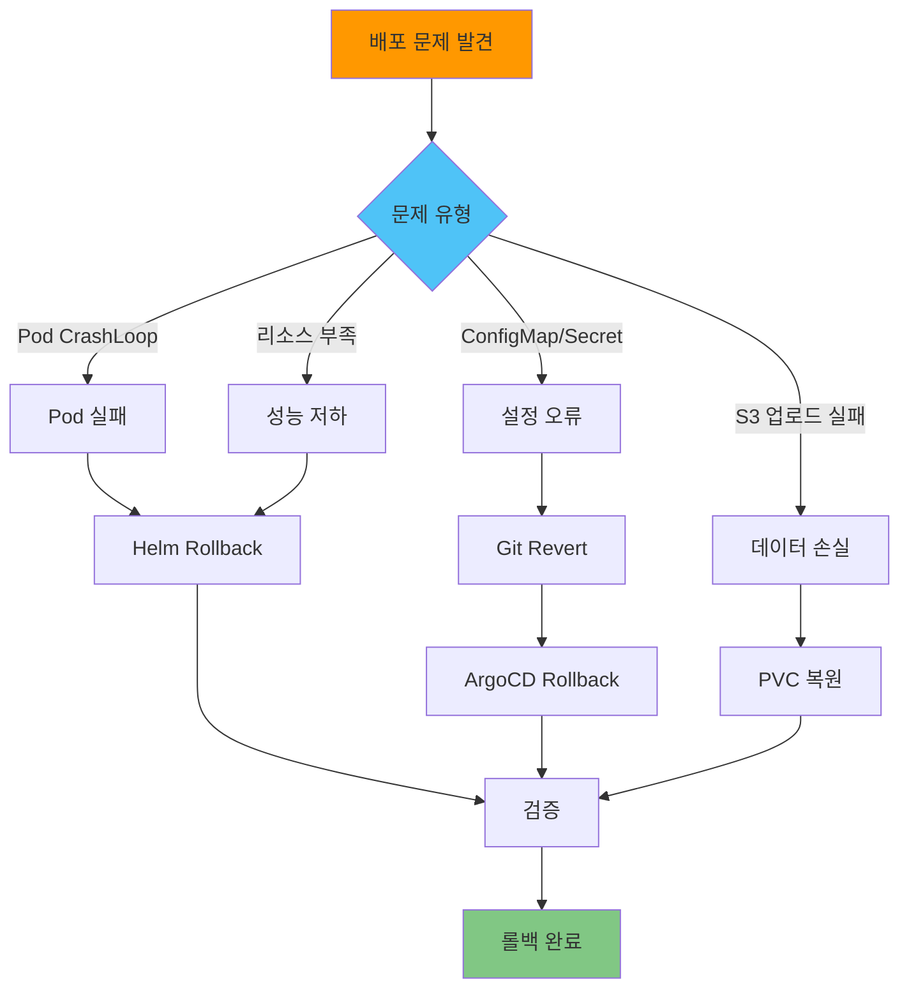

# 롤백 절차

## 📋 개요

배포 중 문제 발생 시 안전하게 이전 버전으로 롤백하는 절차를 정의합니다.

---

## 🎯 롤백 시나리오

- **배포 실패** (Pod CrashLoopBackOff)
- **설정 오류** (ConfigMap, Secret 잘못됨)
- **성능 저하** (리소스 부족, OOM)
- **데이터 손실** (S3 업로드 실패)
- **네트워크 문제** (Remote Write 실패)

---

## 🏗️ 롤백 전략



---

## 1️⃣ Helm Rollback (수동 배포)

### Helm Release 히스토리 확인

```bash
# Cluster-01 접속
export KUBECONFIG=~/.kube/configs/cluster-01.conf

# Helm Release 목록
helm list -n monitoring

# 출력:
# NAME                          NAMESPACE   REVISION   STATUS     CHART
# kube-prometheus-stack         monitoring  3          deployed   kube-prometheus-stack-58.0.0

# Release 히스토리
helm history kube-prometheus-stack -n monitoring

# 출력:
# REVISION   UPDATED                   STATUS       CHART                          DESCRIPTION
# 1          2025-10-15 10:00:00 KST   superseded   kube-prometheus-stack-57.0.0   Install complete
# 2          2025-10-18 14:30:00 KST   superseded   kube-prometheus-stack-58.0.0   Upgrade complete
# 3          2025-10-20 09:00:00 KST   deployed     kube-prometheus-stack-58.0.0   Upgrade complete
```

### 이전 Revision으로 롤백

```bash
# Revision 2로 롤백
helm rollback kube-prometheus-stack 2 -n monitoring

# 출력:
# Rollback was a success! Happy Helming!

# 롤백 확인
helm history kube-prometheus-stack -n monitoring

# 출력:
# REVISION   STATUS       DESCRIPTION
# 1          superseded   Install complete
# 2          superseded   Upgrade complete
# 3          superseded   Upgrade complete (실패)
# 4          deployed     Rollback to 2

# Pod 재시작 확인
kubectl get pods -n monitoring -w

# 출력:
# prometheus-kube-prometheus-stack-prometheus-0   0/3   Terminating
# prometheus-kube-prometheus-stack-prometheus-0   3/3   Running  (새 Pod)
```

### Dry-Run으로 롤백 미리보기

```bash
# 롤백 시뮬레이션 (실제 변경 없음)
helm rollback kube-prometheus-stack 2 -n monitoring --dry-run --debug

# 출력:
# REVISION: 4
# RELEASED: ...
# CHART: kube-prometheus-stack-57.0.0
# USER-SUPPLIED VALUES:
# ...
```

---

## 2️⃣ Kustomize Rollback (GitOps)

### Git Revert

```bash
# Git 로그 확인
cd /path/to/thanos-multi-cluster
git log --oneline

# 출력:
# abc123d (HEAD -> main) feat: Update Receiver replicas to 5
# xyz789e feat: Add Thanos Ruler
# 123abc4 feat: Initial deployment

# 잘못된 커밋 Revert
git revert abc123d

# Commit 메시지 작성
# "Revert: Update Receiver replicas to 5 (caused OOM)"

# Push
git push origin main
```

### ArgoCD Sync (자동 롤백)

```bash
# ArgoCD가 Git Revert를 감지하고 자동 Sync
argocd app get cluster-01-central

# 출력:
# Name:               cluster-01-central
# Sync Status:        Synced
# Health Status:      Healthy
# Revision:           123abc4 (Reverted commit)

# 수동 Sync (강제)
argocd app sync cluster-01-central --force

# Sync 상태 확인
argocd app wait cluster-01-central --health
```

### 특정 Revision으로 Rollback

```bash
# ArgoCD에서 이전 Revision으로 롤백
argocd app rollback cluster-01-central 123abc4

# 출력:
# Application 'cluster-01-central' rollback initiated to revision '123abc4'

# 롤백 상태 확인
argocd app get cluster-01-central

# 출력:
# Operation:          Rollback
# Sync Status:        Synced
# Revision:           123abc4
```

---

## 3️⃣ ConfigMap/Secret 롤백

### ConfigMap 히스토리 확인

```bash
# ConfigMap 백업 (배포 전)
kubectl get cm -n monitoring thanos-receive-hashring -o yaml > hashring-backup.yaml

# 잘못된 ConfigMap 확인
kubectl get cm -n monitoring thanos-receive-hashring -o yaml

# 백업에서 복원
kubectl apply -f hashring-backup.yaml

# Pod 재시작 (ConfigMap 변경 반영)
kubectl rollout restart statefulset/thanos-receive -n monitoring
```

### Secret 복원

```bash
# Secret 백업
kubectl get secret -n monitoring thanos-objstore-secret -o yaml > objstore-secret-backup.yaml

# 복원
kubectl apply -f objstore-secret-backup.yaml

# 관련 Pod 재시작
kubectl rollout restart statefulset/prometheus-kube-prometheus-stack-prometheus -n monitoring
kubectl rollout restart statefulset/thanos-receive -n monitoring
kubectl rollout restart deployment/thanos-store -n monitoring
```

---

## 4️⃣ StatefulSet/Deployment 롤백

### Deployment Rollback

```bash
# Deployment 히스토리
kubectl rollout history deployment/thanos-query -n monitoring

# 출력:
# REVISION   CHANGE-CAUSE
# 1          Initial deployment
# 2          Update image to v0.31.0
# 3          Update replicas to 3

# Revision 2로 롤백
kubectl rollout undo deployment/thanos-query -n monitoring --to-revision=2

# 롤백 상태 확인
kubectl rollout status deployment/thanos-query -n monitoring

# 출력:
# deployment "thanos-query" successfully rolled out
```

### StatefulSet Rollback

```bash
# StatefulSet 히스토리
kubectl rollout history statefulset/thanos-receive -n monitoring

# 출력:
# REVISION   CHANGE-CAUSE
# 1          Initial deployment
# 2          Update replicas to 5 (실패)

# 이전 Revision으로 롤백
kubectl rollout undo statefulset/thanos-receive -n monitoring

# Pod 순차적 재시작 확인
kubectl get pods -n monitoring -l app=thanos-receive -w

# 출력:
# thanos-receive-4   1/1   Terminating
# thanos-receive-3   1/1   Terminating
# thanos-receive-2   1/1   Running
# thanos-receive-1   1/1   Running
# thanos-receive-0   1/1   Running
```

---

## 5️⃣ PVC/데이터 복원

### Longhorn Snapshot 생성 (사전 준비)

```bash
# Longhorn UI 접속
# http://longhorn.k8s-cluster-01.miribit.lab

# 또는 CLI
kubectl apply -f - <<EOF
apiVersion: longhorn.io/v1beta2
kind: VolumeSnapshot
metadata:
  name: prometheus-data-snapshot-$(date +%Y%m%d-%H%M%S)
  namespace: longhorn-system
spec:
  volumeName: pvc-xxx  # PVC ID
EOF

# Snapshot 목록 확인
kubectl get volumesnapshot -n longhorn-system
```

### Snapshot에서 PVC 복원

```bash
# 새 PVC 생성 (Snapshot 기반)
kubectl apply -f - <<EOF
apiVersion: v1
kind: PersistentVolumeClaim
metadata:
  name: prometheus-data-restored
  namespace: monitoring
spec:
  storageClassName: longhorn
  dataSource:
    name: prometheus-data-snapshot-20251020-120000
    kind: VolumeSnapshot
    apiGroup: snapshot.storage.k8s.io
  accessModes:
    - ReadWriteOnce
  resources:
    requests:
      storage: 100Gi
EOF

# Prometheus StatefulSet 업데이트 (새 PVC 사용)
kubectl edit statefulset prometheus-kube-prometheus-stack-prometheus -n monitoring

# volumeClaimTemplates 섹션 수정:
# volumeClaimTemplates:
#   - metadata:
#       name: prometheus-data-restored  # 변경
```

### S3 백업에서 복원

```bash
# MinIO mc로 백업 확인
mc ls minio/thanos-cluster-01-backup/

# 복원 (특정 TSDB 블록)
mc cp --recursive \
  minio/thanos-cluster-01-backup/thanos/01HJXXX... \
  minio/thanos-cluster-01/thanos/

# Thanos Store 재시작 (새 블록 인식)
kubectl rollout restart deployment/thanos-store -n monitoring
```

---

## 6️⃣ 네트워크/Service 롤백

### Service 설정 복원

```bash
# Service 백업
kubectl get svc -n monitoring thanos-receive-lb -o yaml > thanos-receive-lb-backup.yaml

# 잘못된 설정 확인
kubectl describe svc -n monitoring thanos-receive-lb

# 백업에서 복원
kubectl apply -f thanos-receive-lb-backup.yaml

# Endpoint 확인
kubectl get endpoints -n monitoring thanos-receive-lb
```

### Ingress 롤백

```bash
# Ingress 백업
kubectl get ingress -n monitoring grafana -o yaml > grafana-ingress-backup.yaml

# 복원
kubectl apply -f grafana-ingress-backup.yaml

# Ingress 상태 확인
kubectl get ingress -n monitoring grafana

# curl 테스트
curl -I http://grafana.k8s-cluster-01.miribit.lab
```

---

## 7️⃣ 멀티 클러스터 롤백

### 전체 클러스터 롤백 스크립트

```bash
#!/bin/bash
# rollback-all-clusters.sh

set -e

CLUSTERS=("cluster-01" "cluster-02" "cluster-03" "cluster-04")
TARGET_REVISION="123abc4"  # 롤백할 Git Revision

echo "=== Multi-Cluster Rollback to $TARGET_REVISION ==="
echo ""

for cluster in "${CLUSTERS[@]}"; do
  echo "--- Rolling back $cluster ---"

  # ArgoCD Rollback
  argocd app rollback "$cluster" "$TARGET_REVISION"

  # 롤백 완료 대기
  argocd app wait "$cluster" --health --timeout 300

  echo "$cluster rollback complete"
  echo ""
done

echo "=== Rollback Complete ==="
```

### 사용법

```bash
# 실행 권한
chmod +x rollback-all-clusters.sh

# 실행
./rollback-all-clusters.sh

# 출력:
# === Multi-Cluster Rollback to 123abc4 ===
#
# --- Rolling back cluster-01 ---
# Application 'cluster-01' rollback initiated
# cluster-01 rollback complete
#
# --- Rolling back cluster-02 ---
# Application 'cluster-02' rollback initiated
# cluster-02 rollback complete
#
# === Rollback Complete ===
```

---

## 8️⃣ 롤백 후 검증

### Pod 상태 확인

```bash
# 모든 Pod Running 확인
kubectl get pods -n monitoring

# 출력:
# NAME                                      READY   STATUS    RESTARTS   AGE
# prometheus-kube-...-prometheus-0          3/3     Running   0          5m
# thanos-receive-0                          1/1     Running   0          5m
# ...
```

### Remote Write 연결 확인

```bash
# Agent에서 Remote Write 상태
export KUBECONFIG=~/.kube/configs/cluster-03.conf
POD=$(kubectl get pods -n monitoring -l app.kubernetes.io/name=prometheus -o name | head -1)

kubectl exec -n monitoring $POD -- wget -qO- http://localhost:9090/api/v1/status/runtimeinfo \
  | jq '.data.remoteWrite[0].queueLength'

# 출력: 0 (정상)
```

### 메트릭 쿼리 테스트

```promql
# Thanos Query에서 확인
up{cluster="cluster-03"}

# 시계열 연속성 확인
count_over_time(up{cluster="cluster-03"}[1h])

# 출력: 120 (1h / 30s scrape = 120 samples, 정상)
```

---

## 9️⃣ 롤백 Best Practices

### 사전 준비

1. **배포 전 백업**
   ```bash
   # ConfigMap/Secret 백업
   kubectl get cm,secret -n monitoring -o yaml > backup-$(date +%Y%m%d).yaml

   # PVC Snapshot 생성
   kubectl apply -f pvc-snapshot.yaml
   ```

2. **Git Tag 생성**
   ```bash
   # 안정 버전에 Tag
   git tag -a v1.0.0 -m "Stable release"
   git push origin v1.0.0

   # 롤백 시:
   git checkout v1.0.0
   ```

3. **Helm Revision 제한**
   ```bash
   # Helm 히스토리 최대 10개 유지
   helm upgrade kube-prometheus-stack ... --history-max 10
   ```

### 롤백 중 주의사항

1. **StatefulSet 순서**
   - StatefulSet은 역순으로 Pod 삭제 (N → 0)
   - PVC는 자동 삭제되지 않음 (수동 정리 필요)

2. **데이터 일관성**
   - Remote Write Queue가 비워질 때까지 대기
   - S3 업로드 완료 확인 (Sidecar 로그)

3. **Downtime 최소화**
   - Blue-Green Deployment 고려
   - Canary Rollout (ArgoCD Progressive Delivery)

### 롤백 후 후속 조치

1. **Root Cause Analysis**
   - 로그 수집 (`kubectl logs`)
   - 이벤트 확인 (`kubectl get events`)
   - 메트릭 분석 (Grafana)

2. **문서화**
   - 롤백 이유 기록
   - 재발 방지 대책 수립

3. **재배포 계획**
   - 테스트 환경에서 검증
   - 단계적 배포 (클러스터별 순차 적용)

---

## 🎯 롤백 체크리스트

### 사전 확인
- [x] 문제 유형 파악 (Pod 실패, 설정 오류, 성능 저하, 데이터 손실)
- [x] 백업 존재 확인 (ConfigMap, Secret, PVC Snapshot)
- [x] 롤백 대상 Revision 확인 (Helm, Git, ArgoCD)

### 롤백 실행
- [x] Helm Rollback 또는 Git Revert
- [x] ArgoCD Sync (GitOps)
- [x] ConfigMap/Secret 복원
- [x] StatefulSet/Deployment Rollback
- [x] PVC/데이터 복원 (필요 시)

### 검증
- [x] Pod 상태 확인 (Running)
- [x] PVC 바인딩 확인 (Bound)
- [x] Remote Write 연결 확인
- [x] 메트릭 쿼리 테스트
- [x] S3 업로드 확인

### 후속 조치
- [x] 로그 수집 및 분석
- [x] 롤백 원인 문서화
- [x] 재발 방지 대책 수립
- [x] 재배포 계획 수립

---

## 🔗 관련 문서

- **배포 검증** → [배포-검증.md](./배포-검증.md)
- **중앙 클러스터 배포** → [중앙-클러스터-배포.md](./중앙-클러스터-배포.md)
- **운영 가이드** → [../03-운영-가이드/README.md](../03-운영-가이드/README.md)
- **장애 대응** → [../03-운영-가이드/장애-대응.md](../03-운영-가이드/장애-대응.md)

---

**최종 업데이트**: 2025-10-20
