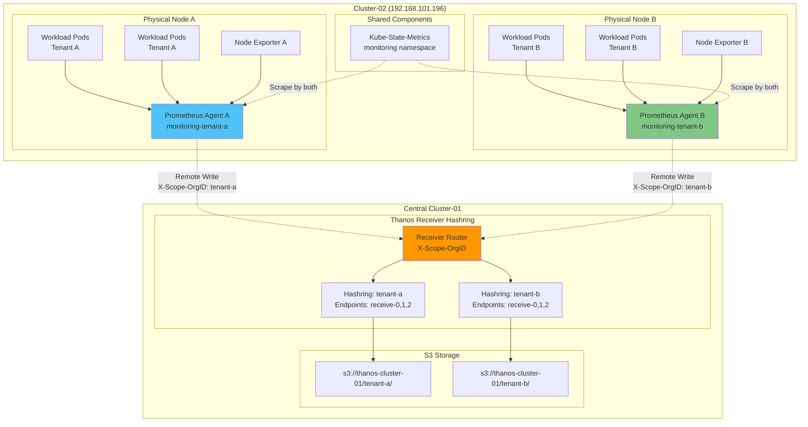

# 멀티테넌시 배포

## 📋 개요

Cluster-02에서 **노드 레벨 멀티테넌시**를 구현하여 Tenant A와 Tenant B가 물리적으로 격리된 환경에서 메트릭을 수집하고 Thanos Receiver를 통해 중앙 저장소로 전송합니다.

---

## 🎯 멀티테넌시 목표

- **물리적 격리**: 노드 레벨 분리 (50/50)
- **논리적 격리**: Namespace 분리
- **데이터 격리**: Tenant 레이블/헤더로 식별
- **리소스 할당**: Tenant별 독립적인 Prometheus Agent
- **중앙 집계**: Thanos Receiver Hashring + Tenant Routing

---

## 🏗️ 멀티테넌시 아키텍처

### 전체 구조



---

## 1️⃣ 노드 레벨 격리

### 노드 레이블링

```bash
# Cluster-02 접속
export KUBECONFIG=~/.kube/configs/cluster-02.conf

# 노드 목록 확인
kubectl get nodes

# 출력 예시:
# NAME                   STATUS   ROLES           AGE   VERSION
# cluster-02-control-01  Ready    control-plane   10d   v1.28.0

# 가상 노드 생성 (단일 노드 클러스터의 경우, Taints로 분리)
# 또는 실제 멀티노드 환경에서:

# Node A에 tenant-a 레이블
kubectl label node <node-a-name> tenant=tenant-a

# Node B에 tenant-b 레이블
kubectl label node <node-b-name> tenant=tenant-b

# 확인
kubectl get nodes --show-labels | grep tenant

# 출력:
# node-a   Ready   ...   tenant=tenant-a
# node-b   Ready   ...   tenant=tenant-b
```

### 단일 노드 환경에서 가상 분리 (개발/테스트)

```bash
# 단일 노드를 Taint로 논리적 분리 (프로덕션 비권장)
kubectl taint nodes cluster-02-control-01 tenant=tenant-a:NoSchedule
kubectl taint nodes cluster-02-control-01 tenant=tenant-b:NoSchedule

# Tenant A Pod는 toleration으로 tenant-a Taint 허용
# Tenant B Pod는 toleration으로 tenant-b Taint 허용
```

---

## 2️⃣ Namespace 격리

### Namespace 생성

```bash
# Tenant A Namespace
kubectl create namespace monitoring-tenant-a

# Tenant B Namespace
kubectl create namespace monitoring-tenant-b

# Shared 리소스 Namespace
kubectl create namespace monitoring

# 확인
kubectl get namespaces | grep monitoring

# 출력:
# monitoring               Active   1m
# monitoring-tenant-a      Active   1m
# monitoring-tenant-b      Active   1m
```

### RBAC 격리

```yaml
# Tenant A ServiceAccount
apiVersion: v1
kind: ServiceAccount
metadata:
  name: prometheus-agent-tenant-a
  namespace: monitoring-tenant-a
---
apiVersion: rbac.authorization.k8s.io/v1
kind: ClusterRole
metadata:
  name: prometheus-agent-tenant-a
rules:
- apiGroups: [""]
  resources:
  - nodes
  - nodes/metrics
  - services
  - endpoints
  - pods
  verbs: ["get", "list", "watch"]
- apiGroups: [""]
  resources:
  - configmaps
  verbs: ["get"]
- apiGroups: ["networking.k8s.io"]
  resources:
  - ingresses
  verbs: ["get", "list", "watch"]
---
apiVersion: rbac.authorization.k8s.io/v1
kind: ClusterRoleBinding
metadata:
  name: prometheus-agent-tenant-a
roleRef:
  apiGroup: rbac.authorization.k8s.io
  kind: ClusterRole
  name: prometheus-agent-tenant-a
subjects:
- kind: ServiceAccount
  name: prometheus-agent-tenant-a
  namespace: monitoring-tenant-a
```

```yaml
# Tenant B ServiceAccount (동일 구조)
apiVersion: v1
kind: ServiceAccount
metadata:
  name: prometheus-agent-tenant-b
  namespace: monitoring-tenant-b
---
# ClusterRole, ClusterRoleBinding (tenant-b)
```

---

## 3️⃣ Prometheus Agent 멀티테넌트 배포

### Tenant A Agent 구성

```yaml
# deploy/overlays/cluster-02-edge/prometheus-agent-tenant-a/kustomization.yaml
apiVersion: kustomize.config.k8s.io/v1beta1
kind: Kustomization

namespace: monitoring-tenant-a

bases:
  - ../../../base/prometheus-agent

helmCharts:
- name: kube-prometheus-stack
  repo: https://prometheus-community.github.io/helm-charts
  version: 58.0.0
  releaseName: prometheus-agent-tenant-a
  namespace: monitoring-tenant-a
  valuesFile: values.yaml

resources:
  - rbac.yaml

patchesStrategicMerge:
  - values-patch.yaml
  - scrape-config-patch.yaml
```

```yaml
# deploy/overlays/cluster-02-edge/prometheus-agent-tenant-a/values-patch.yaml
nameOverride: prometheus-agent-tenant-a
fullnameOverride: prometheus-agent-tenant-a

prometheus:
  enabled: true

  prometheusSpec:
    # Agent Mode
    enableAgentMode: true
    replicas: 1

    # ServiceAccount
    serviceAccountName: prometheus-agent-tenant-a

    # 외부 레이블
    externalLabels:
      cluster: cluster-02
      role: edge-multi-tenant
      tenant: tenant-a
      tenant_id: "1001"

    # Remote Write with Tenant Header
    remoteWrite:
      - url: http://thanos-receive-lb.monitoring.svc.cluster-01.local:19291/api/v1/receive
        name: thanos-receiver

        # Tenant 헤더 (Thanos Receiver Routing)
        headers:
          X-Scope-OrgID: tenant-a

        # Queue 설정
        queueConfig:
          capacity: 20000
          maxShards: 100
          minShards: 10
          maxSamplesPerSend: 10000
          batchSendDeadline: 10s
          minBackoff: 30ms
          maxBackoff: 5s

        # Write Relabeling
        writeRelabelConfigs:
          # tenant 레이블 강제 추가
          - targetLabel: tenant
            replacement: tenant-a
          - targetLabel: tenant_id
            replacement: "1001"

          # 불필요한 메트릭 필터링
          - sourceLabels: [__name__]
            regex: 'go_gc_.*|go_memstats_.*'
            action: drop

    # Node Affinity: tenant-a 노드만
    affinity:
      nodeAffinity:
        requiredDuringSchedulingIgnoredDuringExecution:
          nodeSelectorTerms:
          - matchExpressions:
            - key: tenant
              operator: In
              values:
              - tenant-a

    # 리소스
    resources:
      requests:
        cpu: 200m
        memory: 256Mi
      limits:
        cpu: 500m
        memory: 512Mi

    # WAL 스토리지
    storageSpec:
      volumeClaimTemplate:
        spec:
          storageClassName: longhorn
          accessModes: ["ReadWriteOnce"]
          resources:
            requests:
              storage: 50Gi

# Node Exporter (tenant-a 노드만)
prometheus-node-exporter:
  enabled: true

  affinity:
    nodeAffinity:
      requiredDuringSchedulingIgnoredDuringExecution:
        nodeSelectorTerms:
        - matchExpressions:
          - key: tenant
            operator: In
            values:
            - tenant-a

  # 추가 레이블
  extraArgs:
    - --collector.textfile.directory=/var/lib/node_exporter/textfile_collector

  resources:
    requests:
      cpu: 100m
      memory: 64Mi
    limits:
      cpu: 200m
      memory: 128Mi

# Kube-State-Metrics 비활성화 (Shared 사용)
kube-state-metrics:
  enabled: false

# Grafana, Alertmanager 비활성화
grafana:
  enabled: false

alertmanager:
  enabled: false
```

### Tenant A Scrape 설정

```yaml
# deploy/overlays/cluster-02-edge/prometheus-agent-tenant-a/scrape-config-patch.yaml
prometheus:
  prometheusSpec:
    # ServiceMonitor Selector: tenant-a만
    serviceMonitorNamespaceSelector:
      matchLabels:
        tenant: tenant-a

    serviceMonitorSelector:
      matchLabels:
        tenant: tenant-a

    # PodMonitor Selector: tenant-a만
    podMonitorNamespaceSelector:
      matchLabels:
        tenant: tenant-a

    podMonitorSelector:
      matchLabels:
        tenant: tenant-a

    # 추가 Scrape Config
    additionalScrapeConfigs:
      # Shared Kube-State-Metrics 수집
      - job_name: 'kube-state-metrics-shared'
        static_configs:
          - targets: ['kube-state-metrics.monitoring.svc.cluster.local:8080']
        relabel_configs:
          # tenant 레이블 추가
          - target_label: tenant
            replacement: tenant-a

      # Tenant A 워크로드만 필터링
      - job_name: 'kubernetes-pods-tenant-a'
        kubernetes_sd_configs:
          - role: pod
            namespaces:
              names:
                - default
                - monitoring-tenant-a
        relabel_configs:
          # tenant-a 노드의 Pod만
          - source_labels: [__meta_kubernetes_node_label_tenant]
            regex: tenant-a
            action: keep

          # tenant 레이블 추가
          - target_label: tenant
            replacement: tenant-a
```

### Tenant B Agent 구성 (동일 패턴)

```yaml
# deploy/overlays/cluster-02-edge/prometheus-agent-tenant-b/values-patch.yaml
nameOverride: prometheus-agent-tenant-b
fullnameOverride: prometheus-agent-tenant-b

prometheus:
  prometheusSpec:
    serviceAccountName: prometheus-agent-tenant-b

    externalLabels:
      cluster: cluster-02
      role: edge-multi-tenant
      tenant: tenant-b
      tenant_id: "1002"

    remoteWrite:
      - url: http://thanos-receive-lb.monitoring.svc.cluster-01.local:19291/api/v1/receive
        headers:
          X-Scope-OrgID: tenant-b

        writeRelabelConfigs:
          - targetLabel: tenant
            replacement: tenant-b
          - targetLabel: tenant_id
            replacement: "1002"

    # Node Affinity: tenant-b 노드만
    affinity:
      nodeAffinity:
        requiredDuringSchedulingIgnoredDuringExecution:
          nodeSelectorTerms:
          - matchExpressions:
            - key: tenant
              operator: In
              values:
              - tenant-b

prometheus-node-exporter:
  affinity:
    nodeAffinity:
      requiredDuringSchedulingIgnoredDuringExecution:
        nodeSelectorTerms:
        - matchExpressions:
          - key: tenant
            operator: In
            values:
            - tenant-b
```

---

## 4️⃣ Shared Kube-State-Metrics

### Shared KSM 배포

```yaml
# deploy/overlays/cluster-02-edge/kube-state-metrics/kustomization.yaml
apiVersion: kustomize.config.k8s.io/v1beta1
kind: Kustomization

namespace: monitoring

resources:
  - kube-state-metrics-deployment.yaml
  - kube-state-metrics-service.yaml
  - rbac.yaml
```

```yaml
# deploy/overlays/cluster-02-edge/kube-state-metrics/kube-state-metrics-deployment.yaml
apiVersion: apps/v1
kind: Deployment
metadata:
  name: kube-state-metrics
  namespace: monitoring
  labels:
    app: kube-state-metrics
spec:
  replicas: 1
  selector:
    matchLabels:
      app: kube-state-metrics
  template:
    metadata:
      labels:
        app: kube-state-metrics
    spec:
      serviceAccountName: kube-state-metrics
      containers:
      - name: kube-state-metrics
        image: registry.k8s.io/kube-state-metrics/kube-state-metrics:v2.10.0
        args:
          # 모든 Namespace 수집
          - --namespaces=
          - --metric-labels-allowlist=pods=[*],deployments=[*],nodes=[*]

        ports:
        - name: http-metrics
          containerPort: 8080
        - name: telemetry
          containerPort: 8081

        livenessProbe:
          httpGet:
            path: /healthz
            port: 8080
          initialDelaySeconds: 5
          timeoutSeconds: 5

        readinessProbe:
          httpGet:
            path: /
            port: 8081
          initialDelaySeconds: 5
          timeoutSeconds: 5

        resources:
          requests:
            cpu: 50m
            memory: 64Mi
          limits:
            cpu: 100m
            memory: 128Mi

        securityContext:
          allowPrivilegeEscalation: false
          capabilities:
            drop:
            - ALL
          readOnlyRootFilesystem: true
          runAsNonRoot: true
          runAsUser: 65534
```

```yaml
# deploy/overlays/cluster-02-edge/kube-state-metrics/kube-state-metrics-service.yaml
apiVersion: v1
kind: Service
metadata:
  name: kube-state-metrics
  namespace: monitoring
  labels:
    app: kube-state-metrics
spec:
  clusterIP: None
  ports:
  - name: http-metrics
    port: 8080
    targetPort: 8080
  - name: telemetry
    port: 8081
    targetPort: 8081
  selector:
    app: kube-state-metrics
```

---

## 5️⃣ Thanos Receiver Hashring (Tenant Routing)

### Receiver Hashring ConfigMap

```yaml
# deploy/overlays/cluster-01-central/kube-prometheus-stack/thanos-receive-hashring-multi-tenant.yaml
apiVersion: v1
kind: ConfigMap
metadata:
  name: thanos-receive-hashring
  namespace: monitoring
data:
  hashrings.json: |
    [
      {
        "hashring": "tenant-a",
        "tenants": ["tenant-a"],
        "endpoints": [
          "thanos-receive-0.thanos-receive.monitoring.svc.cluster.local:10901",
          "thanos-receive-1.thanos-receive.monitoring.svc.cluster.local:10901",
          "thanos-receive-2.thanos-receive.monitoring.svc.cluster.local:10901"
        ]
      },
      {
        "hashring": "tenant-b",
        "tenants": ["tenant-b"],
        "endpoints": [
          "thanos-receive-0.thanos-receive.monitoring.svc.cluster.local:10901",
          "thanos-receive-1.thanos-receive.monitoring.svc.cluster.local:10901",
          "thanos-receive-2.thanos-receive.monitoring.svc.cluster.local:10901"
        ]
      },
      {
        "hashring": "default",
        "tenants": [],
        "endpoints": [
          "thanos-receive-0.thanos-receive.monitoring.svc.cluster.local:10901",
          "thanos-receive-1.thanos-receive.monitoring.svc.cluster.local:10901",
          "thanos-receive-2.thanos-receive.monitoring.svc.cluster.local:10901"
        ]
      }
    ]
```

### Receiver Deployment 수정

```yaml
# Thanos Receiver args에 추가
args:
  - receive
  - --receive.hashrings-file=/etc/thanos/hashrings.json
  - --receive.hashrings-algorithm=ketama  # Consistent Hashing
  - --receive.tenant-header=X-Scope-OrgID
  - --receive.tenant-label-name=tenant
  - --receive.replica-header=THANOS-REPLICA
```

---

## 6️⃣ 배포 순서

### 1단계: 노드 준비

```bash
# Cluster-02 접속
export KUBECONFIG=~/.kube/configs/cluster-02.conf

# 노드 레이블링
kubectl label node <node-a> tenant=tenant-a
kubectl label node <node-b> tenant=tenant-b

# 확인
kubectl get nodes -L tenant
```

### 2단계: Namespace 생성

```bash
kubectl create namespace monitoring
kubectl create namespace monitoring-tenant-a
kubectl create namespace monitoring-tenant-b

# Namespace에 레이블 추가
kubectl label namespace monitoring-tenant-a tenant=tenant-a
kubectl label namespace monitoring-tenant-b tenant=tenant-b
```

### 3단계: RBAC 배포

```bash
# Tenant A RBAC
kubectl apply -f deploy/overlays/cluster-02-edge/prometheus-agent-tenant-a/rbac.yaml

# Tenant B RBAC
kubectl apply -f deploy/overlays/cluster-02-edge/prometheus-agent-tenant-b/rbac.yaml
```

### 4단계: Shared KSM 배포

```bash
kustomize build deploy/overlays/cluster-02-edge/kube-state-metrics \
  | kubectl apply -f -

# 확인
kubectl get pods -n monitoring
```

### 5단계: Tenant A Agent 배포

```bash
kustomize build deploy/overlays/cluster-02-edge/prometheus-agent-tenant-a --enable-helm \
  | kubectl apply -f -

# 확인
kubectl get pods -n monitoring-tenant-a

# Pod 노드 배치 확인
kubectl get pods -n monitoring-tenant-a -o wide
# 출력: 모두 tenant-a 노드에 배포됨
```

### 6단계: Tenant B Agent 배포

```bash
kustomize build deploy/overlays/cluster-02-edge/prometheus-agent-tenant-b --enable-helm \
  | kubectl apply -f -

# 확인
kubectl get pods -n monitoring-tenant-b -o wide
# 출력: 모두 tenant-b 노드에 배포됨
```

### 7단계: Central Cluster Receiver Hashring 업데이트

```bash
# Cluster-01 접속
export KUBECONFIG=~/.kube/configs/cluster-01.conf

# Hashring ConfigMap 업데이트
kubectl apply -f deploy/overlays/cluster-01-central/kube-prometheus-stack/thanos-receive-hashring-multi-tenant.yaml

# Receiver 재시작 (ConfigMap 변경 반영)
kubectl rollout restart statefulset/thanos-receive -n monitoring
```

---

## 7️⃣ 검증

### Tenant 격리 확인

```bash
# Cluster-02에서 확인

# Tenant A Pod는 tenant-a 노드에만
kubectl get pods -n monitoring-tenant-a -o wide | grep -v tenant-a
# 출력: (없음)

# Tenant B Pod는 tenant-b 노드에만
kubectl get pods -n monitoring-tenant-b -o wide | grep -v tenant-b
# 출력: (없음)
```

### Remote Write 헤더 확인

```bash
# Tenant A Agent 로그
kubectl logs -n monitoring-tenant-a prometheus-agent-tenant-a-0 | grep "X-Scope-OrgID"

# Receiver 로그 (Cluster-01)
kubectl logs -n monitoring thanos-receive-0 | grep "tenant-a"

# 로그 예시:
# level=info tenant=tenant-a samples=1250 msg="handling remote write"
```

### 메트릭 쿼리 (Tenant 필터링)

```promql
# Thanos Query에서 확인

# Tenant A 메트릭만
up{tenant="tenant-a"}

# Tenant B 메트릭만
up{tenant="tenant-b"}

# Tenant별 메트릭 수
count(up) by (tenant)

# 출력:
# {tenant="tenant-a"} 45
# {tenant="tenant-b"} 38

# Tenant별 샘플 수
sum(scrape_samples_scraped) by (tenant)
```

### Grafana에서 Tenant 분리 대시보드

```json
{
  "dashboard": {
    "title": "Multi-Tenant Metrics",
    "panels": [
      {
        "title": "Tenant A Metrics",
        "targets": [
          {
            "expr": "rate(prometheus_tsdb_head_samples_appended_total{tenant=\"tenant-a\"}[5m])"
          }
        ]
      },
      {
        "title": "Tenant B Metrics",
        "targets": [
          {
            "expr": "rate(prometheus_tsdb_head_samples_appended_total{tenant=\"tenant-b\"}[5m])"
          }
        ]
      }
    ]
  }
}
```

---

## 📊 리소스 사용량

### Cluster-02 총 리소스

| 컴포넌트 | CPU (requests) | Memory (requests) | 개수 |
|----------|----------------|-------------------|------|
| Prometheus Agent A | 200m | 256Mi | 1 |
| Prometheus Agent B | 200m | 256Mi | 1 |
| Node Exporter A | 100m | 64Mi | 1 |
| Node Exporter B | 100m | 64Mi | 1 |
| Kube-State-Metrics | 50m | 64Mi | 1 |
| **총합** | **650m** | **704Mi** | **5** |

---

## 🎯 배포 체크리스트

### 노드 준비
- [x] 노드 레이블링 (tenant=tenant-a/b)
- [x] 노드 리소스 확인 (CPU, Memory)

### Namespace 및 RBAC
- [x] Namespace 생성 (3개)
- [x] Namespace 레이블 추가
- [x] ServiceAccount 생성 (tenant-a, tenant-b)
- [x] ClusterRole/Binding 생성

### Shared 컴포넌트
- [x] Kube-State-Metrics 배포
- [x] Service 생성 및 확인

### Tenant A
- [x] Prometheus Agent 배포
- [x] Node Affinity 확인
- [x] Remote Write 설정 (X-Scope-OrgID: tenant-a)
- [x] Scrape Config (tenant-a만)
- [x] Node Exporter 배포

### Tenant B
- [x] Prometheus Agent 배포
- [x] Node Affinity 확인
- [x] Remote Write 설정 (X-Scope-OrgID: tenant-b)
- [x] Scrape Config (tenant-b만)
- [x] Node Exporter 배포

### Central Cluster
- [x] Receiver Hashring ConfigMap 업데이트
- [x] Receiver 재시작
- [x] Tenant Routing 확인

### 검증
- [x] Pod 노드 배치 확인
- [x] Remote Write 연결 확인
- [x] 메트릭 쿼리 테스트 (tenant 필터)
- [x] Grafana 대시보드 확인

---

## 🔗 관련 문서

- **엣지 클러스터 배포** → [엣지-클러스터-배포.md](./엣지-클러스터-배포.md)
- **중앙 클러스터 배포** → [중앙-클러스터-배포.md](./중앙-클러스터-배포.md)
- **배포 검증** → [배포-검증.md](./배포-검증.md)
- **멀티테넌시 구성** → [../05-멀티테넌시-구성/README.md](../05-멀티테넌시-구성/README.md)

---

**최종 업데이트**: 2025-10-20
