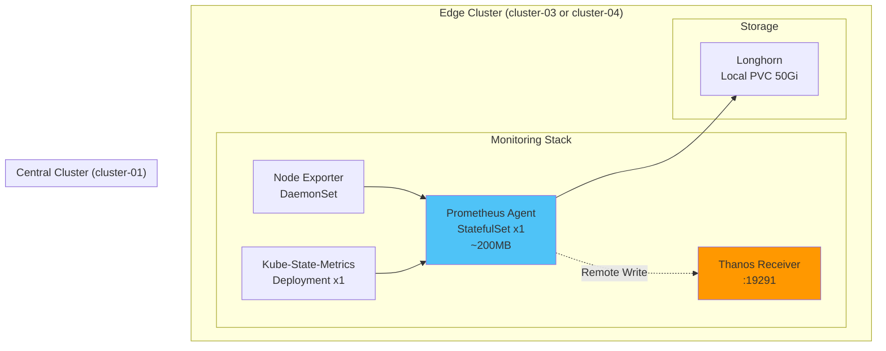
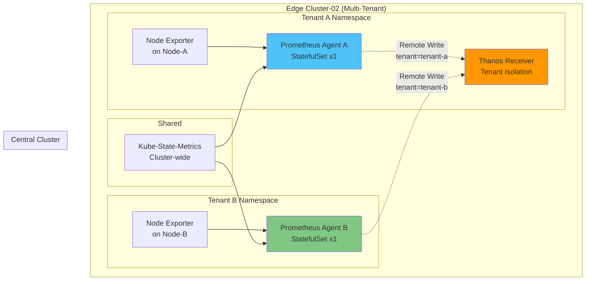
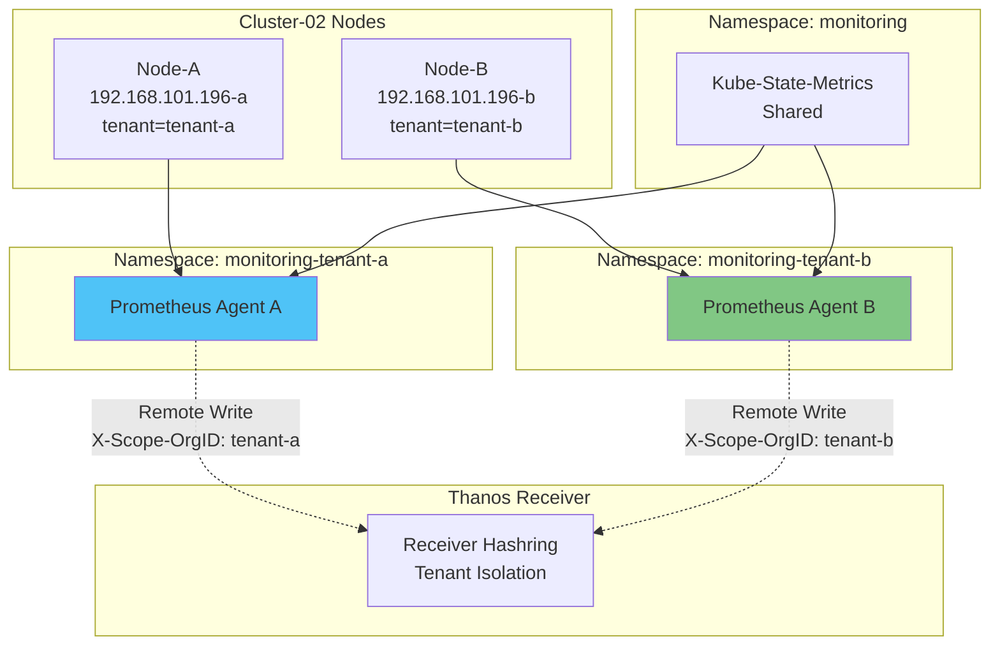

# 엣지 클러스터 배포

## 📋 개요

Cluster-02, Cluster-03, Cluster-04 엣지 클러스터에 **Prometheus Agent Mode**를 배포하여 중앙 클러스터의 Thanos Receiver로 메트릭을 전송합니다.

---

## 🎯 배포 목표

- **Prometheus Agent Mode** (경량, Remote Write 전용)
- **Node Exporter** (노드 메트릭 수집)
- **Kube-State-Metrics** (K8s 리소스 메트릭)
- **Longhorn Storage** (로컬 PVC)
- **Remote Write** → Thanos Receiver (cluster-01)

---

## 🏗️ 엣지 클러스터 아키텍처

### 일반 엣지 클러스터 (Cluster-03, Cluster-04)



### 멀티테넌트 엣지 클러스터 (Cluster-02)



---

## 1️⃣ Prometheus Agent 기본 구성

### Prometheus Agent Mode란?

| 구분 | Full Prometheus | Prometheus Agent |
|------|----------------|------------------|
| **메모리 사용량** | 2-4GB | ~200MB |
| **로컬 쿼리** | 가능 (PromQL) | **불가능** |
| **로컬 알람** | 가능 (Alertmanager) | **불가능** |
| **Remote Write** | 지원 | **전용** |
| **WAL** | 2시간 블록 생성 | WAL만 유지 |
| **스토리지** | 대용량 필요 | 최소 (WAL만) |
| **사용 사례** | 중앙 모니터링 | 엣지/IoT/경량 |

### Agent Mode 활성화

```yaml
# Prometheus Agent Mode 설정
prometheus:
  prometheusSpec:
    # Agent Mode 활성화
    enableAgentMode: true

    # 로컬 쿼리/알람 비활성화
    enableRemoteWriteReceiver: false
    enableFeatures: []

    # WAL 설정
    walCompression: true

    # 리소스 (경량)
    resources:
      requests:
        cpu: 200m
        memory: 256Mi
      limits:
        cpu: 500m
        memory: 512Mi
```

---

## 2️⃣ Cluster-03/04 배포 (일반 엣지)

### Base Values (prometheus-agent)

```yaml
# deploy/base/prometheus-agent/values.yaml
nameOverride: prometheus-agent
fullnameOverride: prometheus-agent

prometheus:
  enabled: true

  prometheusSpec:
    # Agent Mode
    enableAgentMode: true

    # 복제본 (HA 불필요)
    replicas: 1

    # Scrape 설정
    scrapeInterval: 30s
    scrapeTimeout: 10s
    evaluationInterval: 30s

    # 외부 레이블 (오버라이드됨)
    externalLabels:
      cluster: CLUSTER_NAME  # 오버레이에서 변경
      role: edge

    # WAL 스토리지
    storageSpec:
      volumeClaimTemplate:
        spec:
          storageClassName: longhorn
          accessModes: ["ReadWriteOnce"]
          resources:
            requests:
              storage: 50Gi

    # Remote Write (오버레이에서 설정)
    remoteWrite: []

    # ServiceMonitor 자동 발견
    serviceMonitorSelectorNilUsesHelmValues: false
    podMonitorSelectorNilUsesHelmValues: false

    # 리소스
    resources:
      requests:
        cpu: 200m
        memory: 256Mi
      limits:
        cpu: 500m
        memory: 512Mi

# Node Exporter
prometheus-node-exporter:
  enabled: true

  resources:
    requests:
      cpu: 100m
      memory: 64Mi
    limits:
      cpu: 200m
      memory: 128Mi

# Kube-State-Metrics
kube-state-metrics:
  enabled: true

  replicas: 1

  resources:
    requests:
      cpu: 50m
      memory: 64Mi
    limits:
      cpu: 100m
      memory: 128Mi

# Grafana, Alertmanager 비활성화
grafana:
  enabled: false

alertmanager:
  enabled: false

# Operator
prometheusOperator:
  enabled: true

  resources:
    requests:
      cpu: 100m
      memory: 128Mi
```

### Cluster-03 Overlay

```yaml
# deploy/overlays/cluster-03-edge/prometheus-agent/kustomization.yaml
apiVersion: kustomize.config.k8s.io/v1beta1
kind: Kustomization

namespace: monitoring

bases:
  - ../../../base/prometheus-agent

helmCharts:
- name: kube-prometheus-stack
  repo: https://prometheus-community.github.io/helm-charts
  version: 58.0.0
  releaseName: prometheus-agent
  namespace: monitoring
  valuesFile: values.yaml

patchesStrategicMerge:
  - values-patch.yaml
```

```yaml
# deploy/overlays/cluster-03-edge/prometheus-agent/values-patch.yaml
prometheus:
  prometheusSpec:
    # 클러스터 레이블
    externalLabels:
      cluster: cluster-03
      role: edge
      location: edge-site-1

    # Remote Write → Thanos Receiver
    remoteWrite:
      - url: http://thanos-receive-lb.monitoring.svc.cluster-01.local:19291/api/v1/receive
        name: thanos-receiver

        # 재시도 설정
        queueConfig:
          capacity: 20000
          maxShards: 100
          minShards: 10
          maxSamplesPerSend: 10000
          batchSendDeadline: 10s
          minBackoff: 30ms
          maxBackoff: 5s

        # Snappy 압축
        writeRelabelConfigs:
          # 불필요한 메트릭 필터링
          - sourceLabels: [__name__]
            regex: 'go_gc_.*|go_memstats_.*'
            action: drop

        # TLS (옵션)
        # tlsConfig:
        #   insecureSkipVerify: true
```

### 배포

```bash
# Cluster-03 배포
export KUBECONFIG=~/.kube/configs/cluster-03.conf

# Namespace 생성
kubectl create namespace monitoring

# Prometheus Agent 배포
kustomize build deploy/overlays/cluster-03-edge/prometheus-agent --enable-helm \
  | kubectl apply -f -

# Pod 확인
kubectl get pods -n monitoring

# 출력:
# prometheus-agent-prometheus-agent-0   2/2   Running
# prometheus-node-exporter-xxx          1/1   Running
# kube-state-metrics-xxx                1/1   Running
```

### Cluster-04 배포 (동일 패턴)

```yaml
# deploy/overlays/cluster-04-edge/prometheus-agent/values-patch.yaml
prometheus:
  prometheusSpec:
    externalLabels:
      cluster: cluster-04
      role: edge
      location: edge-site-2

    remoteWrite:
      - url: http://thanos-receive-lb.monitoring.svc.cluster-01.local:19291/api/v1/receive
        name: thanos-receiver
        queueConfig:
          capacity: 20000
          maxShards: 100
          # ... (동일 설정)
```

```bash
# Cluster-04 배포
export KUBECONFIG=~/.kube/configs/cluster-04.conf
kubectl create namespace monitoring
kustomize build deploy/overlays/cluster-04-edge/prometheus-agent --enable-helm \
  | kubectl apply -f -
```

---

## 3️⃣ Cluster-02 배포 (멀티테넌트)

### 멀티테넌트 아키텍처



### 노드 레이블링

```bash
# Cluster-02에서 노드 레이블 설정
export KUBECONFIG=~/.kube/configs/cluster-02.conf

# 노드 확인
kubectl get nodes

# 노드에 테넌트 레이블 추가
kubectl label node <node-a-name> tenant=tenant-a
kubectl label node <node-b-name> tenant=tenant-b

# 확인
kubectl get nodes --show-labels | grep tenant
```

### Tenant A 배포

```yaml
# deploy/overlays/cluster-02-edge/prometheus-agent-tenant-a/kustomization.yaml
apiVersion: kustomize.config.k8s.io/v1beta1
kind: Kustomization

namespace: monitoring-tenant-a

bases:
  - ../../../base/prometheus-agent

helmCharts:
- name: kube-prometheus-stack
  repo: https://prometheus-community.github.io/helm-charts
  version: 58.0.0
  releaseName: prometheus-agent-tenant-a
  namespace: monitoring-tenant-a
  valuesFile: values.yaml

patchesStrategicMerge:
  - values-patch.yaml
  - node-affinity-patch.yaml
```

```yaml
# deploy/overlays/cluster-02-edge/prometheus-agent-tenant-a/values-patch.yaml
prometheus:
  prometheusSpec:
    externalLabels:
      cluster: cluster-02
      role: edge-multi-tenant
      tenant: tenant-a

    # Remote Write with Tenant Header
    remoteWrite:
      - url: http://thanos-receive-lb.monitoring.svc.cluster-01.local:19291/api/v1/receive
        name: thanos-receiver

        # Tenant 헤더 추가
        headers:
          X-Scope-OrgID: tenant-a

        queueConfig:
          capacity: 20000
          maxShards: 100
          maxSamplesPerSend: 10000
          batchSendDeadline: 10s

        # Tenant 레이블 추가
        writeRelabelConfigs:
          - targetLabel: tenant
            replacement: tenant-a
```

```yaml
# deploy/overlays/cluster-02-edge/prometheus-agent-tenant-a/node-affinity-patch.yaml
prometheus:
  prometheusSpec:
    # Node Affinity: tenant-a 노드에만 배포
    affinity:
      nodeAffinity:
        requiredDuringSchedulingIgnoredDuringExecution:
          nodeSelectorTerms:
          - matchExpressions:
            - key: tenant
              operator: In
              values:
              - tenant-a

# Node Exporter도 tenant-a 노드만
prometheus-node-exporter:
  affinity:
    nodeAffinity:
      requiredDuringSchedulingIgnoredDuringExecution:
        nodeSelectorTerms:
        - matchExpressions:
          - key: tenant
            operator: In
            values:
            - tenant-a
```

### Tenant B 배포

```yaml
# deploy/overlays/cluster-02-edge/prometheus-agent-tenant-b/values-patch.yaml
prometheus:
  prometheusSpec:
    externalLabels:
      cluster: cluster-02
      role: edge-multi-tenant
      tenant: tenant-b

    remoteWrite:
      - url: http://thanos-receive-lb.monitoring.svc.cluster-01.local:19291/api/v1/receive
        headers:
          X-Scope-OrgID: tenant-b

        writeRelabelConfigs:
          - targetLabel: tenant
            replacement: tenant-b
```

```yaml
# deploy/overlays/cluster-02-edge/prometheus-agent-tenant-b/node-affinity-patch.yaml
prometheus:
  prometheusSpec:
    affinity:
      nodeAffinity:
        requiredDuringSchedulingIgnoredDuringExecution:
          nodeSelectorTerms:
          - matchExpressions:
            - key: tenant
              operator: In
              values:
              - tenant-b

prometheus-node-exporter:
  affinity:
    nodeAffinity:
      requiredDuringSchedulingIgnoredDuringExecution:
        nodeSelectorTerms:
        - matchExpressions:
          - key: tenant
            operator: In
            values:
            - tenant-b
```

### Shared Kube-State-Metrics

```yaml
# deploy/overlays/cluster-02-edge/kube-state-metrics/kustomization.yaml
apiVersion: kustomize.config.k8s.io/v1beta1
kind: Kustomization

namespace: monitoring

resources:
  - kube-state-metrics.yaml
```

```yaml
# deploy/overlays/cluster-02-edge/kube-state-metrics/kube-state-metrics.yaml
apiVersion: apps/v1
kind: Deployment
metadata:
  name: kube-state-metrics
  namespace: monitoring
spec:
  replicas: 1
  selector:
    matchLabels:
      app: kube-state-metrics
  template:
    metadata:
      labels:
        app: kube-state-metrics
    spec:
      serviceAccountName: kube-state-metrics
      containers:
      - name: kube-state-metrics
        image: registry.k8s.io/kube-state-metrics/kube-state-metrics:v2.10.0
        ports:
        - name: http-metrics
          containerPort: 8080
        - name: telemetry
          containerPort: 8081
        resources:
          requests:
            cpu: 50m
            memory: 64Mi
          limits:
            cpu: 100m
            memory: 128Mi
---
apiVersion: v1
kind: Service
metadata:
  name: kube-state-metrics
  namespace: monitoring
  labels:
    app: kube-state-metrics
spec:
  clusterIP: None
  ports:
  - name: http-metrics
    port: 8080
    targetPort: 8080
  - name: telemetry
    port: 8081
    targetPort: 8081
  selector:
    app: kube-state-metrics
```

### Cluster-02 배포 순서

```bash
# 1. Namespace 생성
kubectl create namespace monitoring
kubectl create namespace monitoring-tenant-a
kubectl create namespace monitoring-tenant-b

# 2. Shared Kube-State-Metrics 배포
kustomize build deploy/overlays/cluster-02-edge/kube-state-metrics \
  | kubectl apply -f -

# 3. Tenant A Agent 배포
kustomize build deploy/overlays/cluster-02-edge/prometheus-agent-tenant-a --enable-helm \
  | kubectl apply -f -

# 4. Tenant B Agent 배포
kustomize build deploy/overlays/cluster-02-edge/prometheus-agent-tenant-b --enable-helm \
  | kubectl apply -f -

# 5. 확인
kubectl get pods -n monitoring-tenant-a
kubectl get pods -n monitoring-tenant-b
kubectl get pods -n monitoring

# 출력:
# monitoring-tenant-a:
#   prometheus-agent-tenant-a-0   2/2   Running
#   prometheus-node-exporter-xxx  1/1   Running
#
# monitoring-tenant-b:
#   prometheus-agent-tenant-b-0   2/2   Running
#   prometheus-node-exporter-yyy  1/1   Running
#
# monitoring:
#   kube-state-metrics-xxx        1/1   Running
```

---

## 4️⃣ Remote Write 검증

### Agent에서 확인

```bash
# Prometheus Agent Pod 접속
kubectl exec -it prometheus-agent-prometheus-agent-0 -n monitoring -- sh

# Remote Write 상태 확인 (HTTP API)
wget -qO- http://localhost:9090/api/v1/status/runtimeinfo | jq .

# WAL 확인
ls -lh /prometheus/wal/
```

### Receiver에서 확인

```bash
# Thanos Receiver 로그 확인
kubectl logs -n monitoring thanos-receive-0 --tail=50

# Remote Write 요청 확인
# 로그 예시:
# level=info ts=2025-10-20T... msg="handling remote write request"
#   tenant=tenant-a samples=1250 cluster=cluster-02
```

### 메트릭 쿼리 테스트

```bash
# Thanos Query에서 확인
kubectl port-forward -n monitoring svc/thanos-query 9090:9090

# 브라우저: http://localhost:9090
```

```promql
# Cluster-03 메트릭 확인
up{cluster="cluster-03"}

# Cluster-02 Tenant A 메트릭
up{cluster="cluster-02", tenant="tenant-a"}

# Cluster-02 Tenant B 메트릭
up{cluster="cluster-02", tenant="tenant-b"}

# Remote Write 성공률
rate(prometheus_remote_storage_succeeded_samples_total[5m])

# Remote Write 실패
rate(prometheus_remote_storage_failed_samples_total[5m])
```

---

## 5️⃣ 리소스 사용량 비교

### Prometheus Agent vs Full Prometheus

| 메트릭 | Full Prometheus | Prometheus Agent | 절감률 |
|--------|----------------|------------------|--------|
| **메모리** | 2-4GB | ~200MB | **90%** |
| **CPU** | 1-2 cores | 0.2-0.5 cores | **75%** |
| **디스크 I/O** | 높음 (TSDB) | 낮음 (WAL만) | **80%** |
| **네트워크** | 낮음 | 중간 (Remote Write) | -20% |
| **스토리지** | 100Gi+ | 50Gi (WAL) | **50%** |

### 클러스터별 리소스 할당

```yaml
# Cluster-03/04 (일반 엣지)
resources:
  prometheus-agent:
    requests:
      cpu: 200m
      memory: 256Mi
    limits:
      cpu: 500m
      memory: 512Mi

  node-exporter:
    requests:
      cpu: 100m
      memory: 64Mi

  kube-state-metrics:
    requests:
      cpu: 50m
      memory: 64Mi

# 총합: 350m CPU, 384Mi Memory

# Cluster-02 (멀티테넌트)
resources:
  tenant-a-agent: 200m CPU, 256Mi Memory
  tenant-b-agent: 200m CPU, 256Mi Memory
  node-exporters: 200m CPU, 128Mi Memory
  kube-state-metrics: 50m CPU, 64Mi Memory

# 총합: 650m CPU, 704Mi Memory
```

---

## 📊 배포 체크리스트

### Cluster-03/04 (일반 엣지)
- [x] Namespace 생성 (`monitoring`)
- [x] Base values.yaml 확인
- [x] Overlay values-patch.yaml 작성
  - [x] externalLabels (cluster, role, location)
  - [x] remoteWrite URL 설정
  - [x] queueConfig 최적화
- [x] Kustomize 배포
- [x] Pod 상태 확인
- [x] Remote Write 연결 확인
- [x] 메트릭 쿼리 테스트

### Cluster-02 (멀티테넌트)
- [x] 노드 레이블링 (tenant=tenant-a/b)
- [x] Namespace 생성 (3개)
  - [x] `monitoring`
  - [x] `monitoring-tenant-a`
  - [x] `monitoring-tenant-b`
- [x] Shared Kube-State-Metrics 배포
- [x] Tenant A Agent 배포
  - [x] Node Affinity 설정
  - [x] X-Scope-OrgID 헤더
  - [x] Tenant 레이블
- [x] Tenant B Agent 배포
  - [x] Node Affinity 설정
  - [x] X-Scope-OrgID 헤더
  - [x] Tenant 레이블
- [x] Pod 노드 배치 확인
- [x] Tenant 격리 확인
- [x] 메트릭 쿼리 테스트

---

## 🔗 관련 문서

- **중앙 클러스터 배포** → [중앙-클러스터-배포.md](./중앙-클러스터-배포.md)
- **멀티테넌시 배포** → [멀티테넌시-배포.md](./멀티테넌시-배포.md)
- **배포 검증** → [배포-검증.md](./배포-검증.md)
- **Remote Write 최적화** → [../09-성능-최적화/Remote-Write-최적화.md](../09-성능-최적화/Remote-Write-최적화.md)

---

**최종 업데이트**: 2025-10-20
