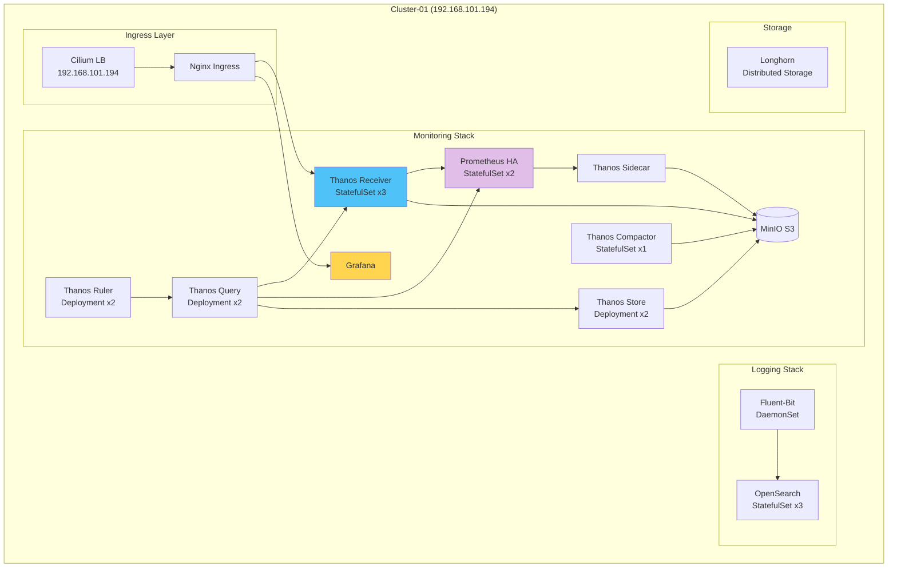

# 중앙 클러스터 배포

## 📋 개요

Cluster-01 (192.168.101.194) 중앙 클러스터에 Thanos Receiver, Prometheus HA, Grafana, OpenSearch 등 모든 중앙 컴포넌트를 배포합니다.

---

## 🎯 배포 목표

- Thanos Receiver (3 replicas)
- Prometheus HA (2 replicas)
- Thanos Query, Store, Compactor, Ruler
- Grafana
- OpenSearch Cluster
- Longhorn Storage

---

## 🏗️ 중앙 클러스터 아키텍처



---

## 1️⃣ 사전 준비

### Namespace 생성

```bash
# Monitoring Namespace
kubectl create namespace monitoring

# Longhorn Namespace
kubectl create namespace longhorn-system

# Logging Namespace
kubectl create namespace logging
```

### StorageClass 확인

```bash
# Longhorn StorageClass 확인
kubectl get storageclass

# 출력:
# NAME                 PROVISIONER          RECLAIMPOLICY
# longhorn (default)   driver.longhorn.io   Delete
```

---

## 2️⃣ S3 Secret 생성

### MinIO objstore.yml

```yaml
# deploy/overlays/cluster-01-central/kube-prometheus-stack/thanos-objstore-secret.yaml
apiVersion: v1
kind: Secret
metadata:
  name: thanos-objstore-secret
  namespace: monitoring
type: Opaque
stringData:
  objstore.yml: |
    type: S3
    config:
      bucket: thanos-cluster-01
      endpoint: s3.minio.miribit.lab:9000
      access_key: minio
      secret_key: minio123
      insecure: false
      signature_version2: false
      http_config:
        idle_conn_timeout: 90s
        response_header_timeout: 2m
```

### Secret 배포

```bash
# Secret 생성
kubectl apply -f deploy/overlays/cluster-01-central/kube-prometheus-stack/thanos-objstore-secret.yaml

# 확인
kubectl get secret -n monitoring thanos-objstore-secret
```

---

## 3️⃣ Longhorn 배포

### Kustomization

```yaml
# deploy/overlays/cluster-01-central/longhorn/kustomization.yaml
apiVersion: kustomize.config.k8s.io/v1beta1
kind: Kustomization

namespace: longhorn-system

bases:
  - ../../../base/longhorn

resources:
  - longhorn-s3-secret.yaml

patchesStrategicMerge:
  - longhorn-values-patch.yaml
```

### S3 Backup Secret

```yaml
# deploy/overlays/cluster-01-central/longhorn/longhorn-s3-secret.yaml
apiVersion: v1
kind: Secret
metadata:
  name: longhorn-s3-secret
  namespace: longhorn-system
type: Opaque
stringData:
  AWS_ACCESS_KEY_ID: minio
  AWS_SECRET_ACCESS_KEY: minio123
  AWS_ENDPOINTS: http://s3.minio.miribit.lab:9000
```

### 배포

```bash
# Longhorn 배포
kustomize build deploy/overlays/cluster-01-central/longhorn --enable-helm \
  | kubectl apply -f -

# Pod 확인
kubectl get pods -n longhorn-system

# StorageClass 확인
kubectl get storageclass longhorn
```

---

## 4️⃣ Prometheus HA + Thanos Sidecar 배포

### Values Patch

```yaml
# deploy/overlays/cluster-01-central/kube-prometheus-stack/values-patch.yaml
prometheus:
  enabled: true

  prometheusSpec:
    # HA: 2 replicas
    replicas: 2

    # 외부 레이블
    externalLabels:
      cluster: cluster-01
      role: central
      replica: $(POD_NAME)

    # Retention
    retention: 7d

    # Storage
    storageSpec:
      volumeClaimTemplate:
        spec:
          storageClassName: longhorn
          accessModes: ["ReadWriteOnce"]
          resources:
            requests:
              storage: 100Gi

    # Thanos Sidecar
    thanos:
      image: quay.io/thanos/thanos:v0.31.0
      version: v0.31.0
      objectStorageConfig:
        key: objstore.yml
        name: thanos-objstore-secret

    # 리소스
    resources:
      requests:
        cpu: 1000m
        memory: 4Gi
      limits:
        cpu: 2000m
        memory: 8Gi

    # Pod Anti-Affinity
    affinity:
      podAntiAffinity:
        requiredDuringSchedulingIgnoredDuringExecution:
        - labelSelector:
            matchLabels:
              app.kubernetes.io/name: prometheus
          topologyKey: kubernetes.io/hostname
```

### 배포

```bash
# Prometheus HA 배포
kustomize build deploy/overlays/cluster-01-central/kube-prometheus-stack --enable-helm \
  | kubectl apply -f -

# Pod 확인
kubectl get pods -n monitoring -l app.kubernetes.io/name=prometheus

# 출력:
# prometheus-kube-prometheus-stack-prometheus-0   3/3   Running
# prometheus-kube-prometheus-stack-prometheus-1   3/3   Running
```

---

## 5️⃣ Thanos Receiver 배포

### Receiver StatefulSet

```yaml
# deploy/overlays/cluster-01-central/kube-prometheus-stack/thanos-receiver.yaml
apiVersion: apps/v1
kind: StatefulSet
metadata:
  name: thanos-receive
  namespace: monitoring
  labels:
    app: thanos-receive
spec:
  replicas: 3
  serviceName: thanos-receive
  selector:
    matchLabels:
      app: thanos-receive
  template:
    metadata:
      labels:
        app: thanos-receive
    spec:
      containers:
      - name: thanos-receive
        image: quay.io/thanos/thanos:v0.31.0
        args:
        - receive
        - --tsdb.path=/data
        - --grpc-address=0.0.0.0:10901
        - --http-address=0.0.0.0:10902
        - --remote-write.address=0.0.0.0:19291
        - --receive.replication-factor=3
        - --receive.hashrings-file=/etc/thanos/hashrings.json
        - --label=receive="true"
        - --label=replica="$(POD_NAME)"
        - --objstore.config-file=/etc/thanos/objstore.yml
        - --tsdb.retention=7d
        - --tsdb.wal-compression

        env:
        - name: POD_NAME
          valueFrom:
            fieldRef:
              fieldPath: metadata.name

        ports:
        - name: http
          containerPort: 10902
        - name: grpc
          containerPort: 10901
        - name: remote-write
          containerPort: 19291

        resources:
          requests:
            cpu: 1000m
            memory: 2Gi
          limits:
            cpu: 2000m
            memory: 4Gi

        volumeMounts:
        - name: data
          mountPath: /data
        - name: hashring-config
          mountPath: /etc/thanos
        - name: objstore-config
          mountPath: /etc/thanos
          subPath: objstore.yml

        livenessProbe:
          httpGet:
            path: /-/healthy
            port: 10902
          initialDelaySeconds: 30
          periodSeconds: 10

        readinessProbe:
          httpGet:
            path: /-/ready
            port: 10902
          initialDelaySeconds: 10
          periodSeconds: 5

      volumes:
      - name: hashring-config
        configMap:
          name: thanos-receive-hashring
      - name: objstore-config
        secret:
          secretName: thanos-objstore-secret

      affinity:
        podAntiAffinity:
          requiredDuringSchedulingIgnoredDuringExecution:
          - labelSelector:
              matchLabels:
                app: thanos-receive
            topologyKey: kubernetes.io/hostname

  volumeClaimTemplates:
  - metadata:
      name: data
    spec:
      accessModes: ["ReadWriteOnce"]
      storageClassName: longhorn
      resources:
        requests:
          storage: 100Gi
---
apiVersion: v1
kind: Service
metadata:
  name: thanos-receive
  namespace: monitoring
spec:
  clusterIP: None
  ports:
  - name: grpc
    port: 10901
    targetPort: 10901
  - name: http
    port: 10902
    targetPort: 10902
  - name: remote-write
    port: 19291
    targetPort: 19291
  selector:
    app: thanos-receive
---
apiVersion: v1
kind: Service
metadata:
  name: thanos-receive-lb
  namespace: monitoring
spec:
  type: ClusterIP
  ports:
  - name: remote-write
    port: 19291
    targetPort: 19291
  selector:
    app: thanos-receive
```

### Hashring ConfigMap

```yaml
# deploy/overlays/cluster-01-central/kube-prometheus-stack/thanos-receive-hashring.yaml
apiVersion: v1
kind: ConfigMap
metadata:
  name: thanos-receive-hashring
  namespace: monitoring
data:
  hashrings.json: |
    [
      {
        "hashring": "default",
        "endpoints": [
          "thanos-receive-0.thanos-receive.monitoring.svc.cluster.local:10901",
          "thanos-receive-1.thanos-receive.monitoring.svc.cluster.local:10901",
          "thanos-receive-2.thanos-receive.monitoring.svc.cluster.local:10901"
        ],
        "tenants": []
      }
    ]
```

### 배포

```bash
# Receiver 배포
kubectl apply -f deploy/overlays/cluster-01-central/kube-prometheus-stack/thanos-receive-hashring.yaml
kubectl apply -f deploy/overlays/cluster-01-central/kube-prometheus-stack/thanos-receiver.yaml

# Pod 확인
kubectl get pods -n monitoring -l app=thanos-receive

# 출력:
# thanos-receive-0   1/1   Running
# thanos-receive-1   1/1   Running
# thanos-receive-2   1/1   Running
```

---

## 6️⃣ Thanos Query 배포

### Query Deployment

```yaml
# deploy/overlays/cluster-01-central/kube-prometheus-stack/thanos-query.yaml
apiVersion: apps/v1
kind: Deployment
metadata:
  name: thanos-query
  namespace: monitoring
spec:
  replicas: 2
  selector:
    matchLabels:
      app: thanos-query
  template:
    metadata:
      labels:
        app: thanos-query
    spec:
      containers:
      - name: thanos-query
        image: quay.io/thanos/thanos:v0.31.0
        args:
        - query
        - --grpc-address=0.0.0.0:10901
        - --http-address=0.0.0.0:9090
        - --query.replica-label=replica
        - --query.replica-label=prometheus_replica
        - --store=dnssrv+_grpc._tcp.thanos-receive.monitoring.svc.cluster.local:10901
        - --store=dnssrv+_grpc._tcp.prometheus-operated.monitoring.svc.cluster.local:10901
        - --store=dnssrv+_grpc._tcp.thanos-store.monitoring.svc.cluster.local:10901

        ports:
        - name: http
          containerPort: 9090
        - name: grpc
          containerPort: 10901

        resources:
          requests:
            cpu: 500m
            memory: 1Gi
          limits:
            cpu: 1000m
            memory: 2Gi

        livenessProbe:
          httpGet:
            path: /-/healthy
            port: 9090

        readinessProbe:
          httpGet:
            path: /-/ready
            port: 9090
---
apiVersion: v1
kind: Service
metadata:
  name: thanos-query
  namespace: monitoring
spec:
  ports:
  - name: http
    port: 9090
    targetPort: 9090
  selector:
    app: thanos-query
```

---

## 7️⃣ Grafana 배포

### Grafana Ingress

```yaml
# Values Patch에 포함
grafana:
  adminPassword: "ChangeMe123!"

  ingress:
    enabled: true
    ingressClassName: nginx
    hosts:
      - grafana.k8s-cluster-01.miribit.lab
    tls:
      - secretName: grafana-tls
        hosts:
          - grafana.k8s-cluster-01.miribit.lab
    annotations:
      cert-manager.io/cluster-issuer: selfsigned-issuer

  # Datasource
  datasources:
    datasources.yaml:
      apiVersion: 1
      datasources:
      - name: Prometheus
        type: prometheus
        url: http://thanos-query:9090
        access: proxy
        isDefault: true
```

---

## 8️⃣ OpenSearch 배포

### OpenSearch Cluster

```yaml
# deploy/overlays/cluster-01-central/opensearch-cluster/opensearch-cluster-patch.yaml
apiVersion: opensearch.opster.io/v1
kind: OpenSearchCluster
metadata:
  name: opensearch-cluster
  namespace: logging
spec:
  general:
    serviceName: opensearch
    version: 2.11.0

  dashboards:
    enable: true
    replicas: 1

  nodePools:
  - component: masters
    replicas: 3
    diskSize: 50Gi
    resources:
      requests:
        cpu: 500m
        memory: 2Gi
    roles:
      - master
      - data

  storage:
    storageClassName: longhorn
```

---

## 📊 배포 순서 (Sync Waves)

### ArgoCD Sync Waves

```yaml
# Sync Wave 0: Storage
metadata:
  annotations:
    argocd.argoproj.io/sync-wave: "0"
# Longhorn

# Sync Wave 1: Secrets
metadata:
  annotations:
    argocd.argoproj.io/sync-wave: "1"
# thanos-objstore-secret

# Sync Wave 2: Core Components
metadata:
  annotations:
    argocd.argoproj.io/sync-wave: "2"
# Prometheus HA, Receiver

# Sync Wave 3: Thanos Components
metadata:
  annotations:
    argocd.argoproj.io/sync-wave: "3"
# Query, Store, Compactor

# Sync Wave 4: Visualization
metadata:
  annotations:
    argocd.argoproj.io/sync-wave: "4"
# Grafana

# Sync Wave 5: Logging
metadata:
  annotations:
    argocd.argoproj.io/sync-wave: "5"
# OpenSearch
```

---

## 🎯 배포 체크리스트

### 사전 준비
- [x] Namespace 생성
- [x] Longhorn StorageClass 확인
- [x] S3 Secret 생성

### 컴포넌트 배포
- [x] Longhorn
- [x] Prometheus HA (2 replicas)
- [x] Thanos Receiver (3 replicas)
- [x] Thanos Query (2 replicas)
- [x] Thanos Store (2 replicas)
- [x] Thanos Compactor (1 replica)
- [x] Thanos Ruler (2 replicas)
- [x] Grafana
- [x] OpenSearch (3 nodes)

### 검증
- [x] Pod 상태 확인
- [x] PVC 바인딩 확인
- [x] Service 확인
- [x] Ingress 확인
- [x] Grafana 접속 테스트

---

## 🔗 관련 문서

- **Kustomize 구조** → [Kustomize-구조.md](./Kustomize-구조.md)
- **엣지 클러스터 배포** → [엣지-클러스터-배포.md](./엣지-클러스터-배포.md)
- **배포 검증** → [배포-검증.md](./배포-검증.md)

---

**최종 업데이트**: 2025-10-20
