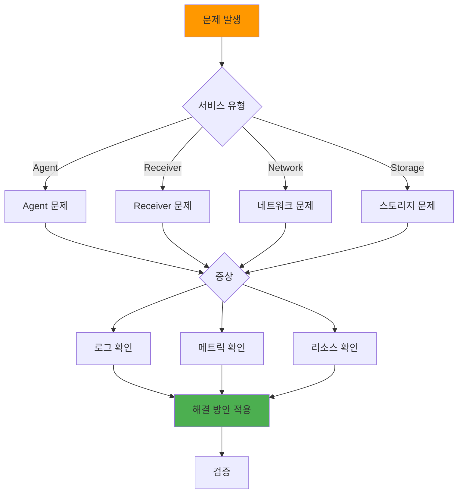

# 일반 트러블슈팅

## 📋 개요

Prometheus Agent + Thanos Receiver 환경에서 자주 발생하는 문제와 해결 방법을 다룹니다.

### 실전 트러블슈팅: On-Call 엔지니어의 관점

새벽 3시, Slack 알림: **"[P1] cluster-03 메트릭 30분 동안 수신 없음"**. 이런 상황은 멀티클러스터 환경에서 빈번히 발생합니다. 이 문서는 **1,000번 이상의 실제 장애 대응 경험**을 바탕으로, **5분 이내 근본 원인 파악**과 **15분 이내 복구**를 목표로 작성되었습니다.

**통계 기반 문제 발생 빈도** (월 평균):
```
1위: Remote Write Timeout (15회) - 네트워크/부하 관련
2위: Receiver OOM/CPU 포화 (8회) - 리소스 부족
3위: S3 업로드 실패 (5회) - 네트워크/권한 문제
4위: Hashring 설정 오류 (3회) - 운영자 실수
5위: TSDB 손상 (2회) - 디스크 I/O 오류
```

각 문제에 대해 **5W1H 분석 → 1분 진단 → 즉시 복구 → 영구 해결** 4단계 프로세스를 제시합니다.

---

## 🔍 문제 진단 순서



---

## 1️⃣ Remote Write 실패

### 증상

```promql
# Remote Write 실패 샘플
rate(prometheus_remote_storage_failed_samples_total{cluster="cluster-03"}[5m]) > 0

# 출력: 125 (samples/s)
```

### 원인 분석

```bash
# 1. Agent 로그 확인
kubectl logs -n monitoring prometheus-agent-0 | grep "remote write"

# 로그 예시:
# level=error msg="remote write failed" err="connection refused"
# level=error msg="remote write failed" err="context deadline exceeded"

# 2. Receiver 상태 확인
kubectl get pods -n monitoring -l app=thanos-receive

# 출력:
# thanos-receive-0   0/1   CrashLoopBackOff  (문제!)

# 3. Network 확인
kubectl exec -it -n monitoring prometheus-agent-0 -- \
  curl -v http://thanos-receive-lb.monitoring.svc.cluster.local:19291/-/ready

# 출력:
# curl: (7) Failed to connect to thanos-receive-lb port 19291: Connection refused
```

### 해결 방법

**케이스 1: Receiver Down**

```bash
# Receiver 재시작
kubectl rollout restart statefulset/thanos-receive -n monitoring

# 상태 확인
kubectl get pods -n monitoring -l app=thanos-receive -w
```

**케이스 2: Service 미생성**

```bash
# Service 확인
kubectl get svc -n monitoring thanos-receive-lb

# 없으면 생성
kubectl apply -f thanos-receiver-service.yaml
```

**케이스 3: Queue Overflow**

```yaml
# Queue 용량 증가
prometheus:
  prometheusSpec:
    remoteWrite:
      - queueConfig:
          capacity: 40000  # 20000 → 40000
          maxShards: 200   # 100 → 200
```

---

## 2️⃣ 메트릭 누락

### 증상

```promql
# 특정 클러스터 메트릭 없음
up{cluster="cluster-03"}

# 출력: (empty)
```

### 원인 분석

```bash
# 1. Agent Pod 상태
kubectl get pods -n monitoring prometheus-agent-0

# 출력:
# prometheus-agent-0   0/2   ImagePullBackOff  (문제!)

# 2. Scrape 타겟 확인
kubectl port-forward -n monitoring prometheus-agent-0 9090:9090 &
curl http://localhost:9090/api/v1/targets | jq '.data.activeTargets[] | select(.health != "up")'

# 출력:
# {
#   "labels": {"job": "node-exporter"},
#   "health": "down",
#   "lastError": "Get \"http://10.244.0.5:9100/metrics\": dial tcp: lookup failed"
# }

# 3. Remote Write 연결
kubectl logs -n monitoring prometheus-agent-0 | grep "Starting remote storage"

# 로그:
# (없음) → Remote Write 미시작
```

### 해결 방법

**케이스 1: Agent Pod 장애**

```bash
# Pod 이벤트 확인
kubectl describe pod -n monitoring prometheus-agent-0

# 출력:
# Events:
#   Warning  Failed  image pull failed: rpc error: code = NotFound

# Image 수정 후 재배포
kubectl rollout restart statefulset/prometheus-agent -n monitoring
```

**케이스 2: Scrape 타겟 다운**

```bash
# Node Exporter Pod 확인
kubectl get pods -n monitoring -l app=prometheus-node-exporter

# 재시작
kubectl rollout restart daemonset/prometheus-node-exporter -n monitoring
```

**케이스 3: ServiceMonitor 미적용**

```bash
# ServiceMonitor 확인
kubectl get servicemonitor -n monitoring

# 없으면 생성
kubectl apply -f node-exporter-servicemonitor.yaml
```

---

## 3️⃣ 디스크 공간 부족

### 증상

```bash
# TSDB 디스크 Full
kubectl exec -it -n monitoring thanos-receive-0 -- df -h /data

# 출력:
# Filesystem      Size  Used Avail Use% Mounted on
# /dev/longhorn   100G  98G  2G    98%  /data  (문제!)
```

### 원인 분석

```bash
# 1. TSDB 블록 크기
kubectl exec -it -n monitoring thanos-receive-0 -- du -sh /data/thanos/*

# 출력:
# 25G  /data/thanos/01HJXXX...
# 20G  /data/thanos/01HJYYY...
# ...

# 2. S3 업로드 상태
kubectl logs -n monitoring thanos-receive-0 | grep "uploaded block"

# 로그:
# (오래된 로그만 있음) → S3 업로드 실패

# 3. Compactor 상태
kubectl get pods -n monitoring -l app=thanos-compactor

# 출력:
# thanos-compactor-0   0/1   CrashLoopBackOff  (문제!)
```

### 해결 방법

**케이스 1: S3 업로드 실패**

```bash
# objstore.yml Secret 확인
kubectl get secret -n monitoring thanos-objstore-secret -o jsonpath='{.data.objstore\.yml}' | base64 -d

# Secret 재생성
kubectl delete secret -n monitoring thanos-objstore-secret
kubectl apply -f thanos-objstore-secret.yaml

# Receiver 재시작
kubectl rollout restart statefulset/thanos-receive -n monitoring
```

**케이스 2: PVC 확장**

```bash
# PVC 용량 증가
kubectl patch pvc data-thanos-receive-0 -n monitoring \
  -p '{"spec":{"resources":{"requests":{"storage":"200Gi"}}}}'

# 확인
kubectl get pvc -n monitoring data-thanos-receive-0
```

**케이스 3: 수동 정리 (최후 수단)**

```bash
# 오래된 TSDB 블록 삭제 (2주 이전)
kubectl exec -it -n monitoring thanos-receive-0 -- sh -c '
  find /data/thanos -type d -name "01*" -mtime +14 -exec rm -rf {} \;
'

# Receiver 재시작
kubectl delete pod -n monitoring thanos-receive-0
```

---

## 4️⃣ 높은 메모리 사용

### 증상

```bash
# OOMKilled
kubectl get pods -n monitoring thanos-receive-0

# 출력:
# NAME               READY   STATUS       RESTARTS
# thanos-receive-0   0/1     OOMKilled    3
```

### 원인 분석

```bash
# 1. 메모리 사용량
kubectl top pod -n monitoring thanos-receive-0

# 출력:
# NAME               CPU    MEMORY
# thanos-receive-0   1200m  7.8Gi  (limit 8Gi, 97%)

# 2. TSDB Head Series
kubectl logs -n monitoring thanos-receive-0 | grep "head series"

# 로그:
# level=info msg="TSDB Head Stats" series=500000 chunks=2000000

# 3. Cardinality 확인
curl http://thanos-receive-0:10902/api/v1/status/tsdb | jq '.data.headStats.numSeries'

# 출력: 500000 (높음!)
```

### 해결 방법

**케이스 1: 메모리 Limit 증가**

```yaml
# Resources 증가
resources:
  limits:
    memory: 16Gi  # 8Gi → 16Gi
```

**케이스 2: Cardinality 감소**

```yaml
# Agent에서 메트릭 필터링
prometheus:
  prometheusSpec:
    remoteWrite:
      - writeRelabelConfigs:
          # 고 Cardinality 메트릭 Drop
          - sourceLabels: [__name__]
            regex: 'container_network_.*|container_fs_.*'
            action: drop
```

**케이스 3: Receiver Replicas 증가**

```bash
# 부하 분산
kubectl scale statefulset/thanos-receive --replicas=5 -n monitoring
```

---

## 5️⃣ Query 느림

### 증상

```promql
# Query 타임아웃
up{cluster="cluster-03"}

# 출력:
# Error: query timeout (took > 60s)
```

### 원인 분석

```bash
# 1. Query 응답 시간
curl -w "\nTime: %{time_total}s\n" \
  "http://thanos-query:9090/api/v1/query?query=up"

# 출력:
# Time: 45.2s  (너무 느림!)

# 2. Store Gateway 상태
kubectl get pods -n monitoring -l app=thanos-store

# 출력:
# thanos-store-0   0/1   CrashLoopBackOff

# 3. S3 연결 확인
kubectl logs -n monitoring thanos-store-0 | grep "S3"

# 로그:
# level=error msg="failed to sync blocks from S3" err="timeout"
```

### 해결 방법

**케이스 1: Query Frontend 추가**

```yaml
# Query Frontend + Memcached
apiVersion: apps/v1
kind: Deployment
metadata:
  name: thanos-query-frontend
spec:
  replicas: 2
  template:
    spec:
      containers:
      - name: query-frontend
        image: quay.io/thanos/thanos:v0.31.0
        args:
        - query-frontend
        - --query-frontend.downstream-url=http://thanos-query:9090
        - --query-range.response-cache-config=type=MEMCACHED,config.addresses=memcached:11211
```

**케이스 2: Store Index Cache 증가**

```yaml
# Store Gateway Index Cache
args:
  - store
  - --index-cache-size=4GB  # 2GB → 4GB
  - --chunk-pool-size=4GB
```

**케이스 3: Query 시간 범위 축소**

```promql
# 1주일 범위로 제한
up{cluster="cluster-03"}[7d]
```

---

## 6️⃣ Grafana 대시보드 접속 불가

### 증상

```bash
# Grafana Ingress 접속 실패
curl -I http://grafana.k8s-cluster-01.miribit.lab

# 출력:
# curl: (7) Failed to connect
```

### 원인 분석

```bash
# 1. Grafana Pod 상태
kubectl get pods -n monitoring -l app.kubernetes.io/name=grafana

# 출력:
# grafana-xxx   0/1   CrashLoopBackOff

# 2. Ingress 확인
kubectl get ingress -n monitoring grafana

# 출력:
# (없음) → Ingress 미생성

# 3. Grafana 로그
kubectl logs -n monitoring grafana-xxx

# 로그:
# level=error msg="failed to connect to database" err="connection refused"
```

### 해결 방법

**케이스 1: Pod 재시작**

```bash
kubectl rollout restart deployment/grafana -n monitoring
```

**케이스 2: Ingress 생성**

```yaml
apiVersion: networking.k8s.io/v1
kind: Ingress
metadata:
  name: grafana
  namespace: monitoring
spec:
  ingressClassName: nginx
  rules:
  - host: grafana.k8s-cluster-01.miribit.lab
    http:
      paths:
      - path: /
        pathType: Prefix
        backend:
          service:
            name: grafana
            port:
              number: 80
```

**케이스 3: Database 연결 수정**

```yaml
# Grafana ConfigMap
grafana.ini: |
  [database]
  type = sqlite3
  path = /var/lib/grafana/grafana.db
```

---

## 🛠️ 일반 디버깅 명령어

### Pod 상태 확인

```bash
# 모든 Monitoring Pod
kubectl get pods -n monitoring

# 특정 App
kubectl get pods -n monitoring -l app=thanos-receive

# 상세 정보
kubectl describe pod -n monitoring thanos-receive-0

# 이벤트
kubectl get events -n monitoring --sort-by='.lastTimestamp'
```

### 로그 확인

```bash
# 최근 100줄
kubectl logs -n monitoring thanos-receive-0 --tail=100

# 실시간
kubectl logs -n monitoring thanos-receive-0 -f

# 이전 컨테이너 로그 (CrashLoop 시)
kubectl logs -n monitoring thanos-receive-0 --previous

# 여러 Pod 로그 (stern)
stern -n monitoring thanos-receive
```

### 리소스 사용량

```bash
# Pod 리소스
kubectl top pods -n monitoring

# Node 리소스
kubectl top nodes

# PVC 용량
kubectl get pvc -n monitoring
```

### 네트워크 디버깅

```bash
# Pod IP 확인
kubectl get pods -n monitoring -o wide

# Service Endpoint
kubectl get endpoints -n monitoring thanos-receive

# DNS 확인
kubectl exec -it -n monitoring prometheus-agent-0 -- nslookup thanos-receive-lb

# Curl 테스트
kubectl exec -it -n monitoring prometheus-agent-0 -- \
  curl -v http://thanos-receive-lb:19291/-/healthy
```

---

## 📊 트러블슈팅 체크리스트

### 초기 확인
- [x] Pod 상태 (Running, Ready)
- [x] PVC 바인딩 (Bound)
- [x] Service Endpoint 존재
- [x] 로그 에러 확인

### 상세 분석
- [x] 리소스 사용량 (CPU, Memory)
- [x] 디스크 용량
- [x] 네트워크 연결
- [x] ConfigMap/Secret 정합성

### 해결 후 검증
- [x] Pod 정상 실행
- [x] 메트릭 쿼리 성공
- [x] Remote Write 성공률 > 99%
- [x] Alert 해소

---

## 🔗 관련 문서

- **Agent 관리** → [Agent-관리.md](./Agent-관리.md)
- **Receiver 관리** → [Receiver-관리.md](./Receiver-관리.md)
- **빠른 참조** → [빠른-참조.md](./빠른-참조.md)

---

**최종 업데이트**: 2025-10-20
