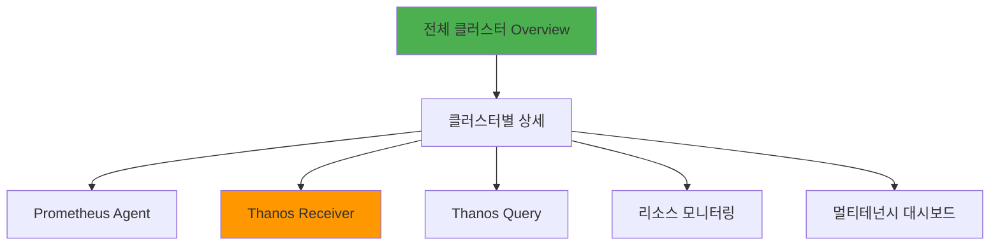

# Grafana 대시보드

## 📋 개요

사전 구성된 Grafana 대시보드와 커스터마이징 가이드입니다.

---

## 🎨 대시보드 구조

### 대시보드 계층



---

## 1️⃣ 전체 클러스터 Overview

### Dashboard JSON

```json
{
  "title": "Multi-Cluster Overview",
  "panels": [
    {
      "id": 1,
      "title": "총 클러스터 수",
      "type": "stat",
      "targets": [{
        "expr": "count(count(up) by (cluster))"
      }],
      "fieldConfig": {
        "defaults": {
          "thresholds": {
            "steps": [
              {"value": 0, "color": "red"},
              {"value": 4, "color": "green"}
            ]
          }
        }
      }
    },
    {
      "id": 2,
      "title": "클러스터별 상태",
      "type": "table",
      "targets": [{
        "expr": "count(up == 1) by (cluster)",
        "legendFormat": "Up"
      }, {
        "expr": "count(up == 0) by (cluster)",
        "legendFormat": "Down"
      }]
    },
    {
      "id": 3,
      "title": "Remote Write 성공률 (%)",
      "type": "gauge",
      "targets": [{
        "expr": "100 * sum(rate(prometheus_remote_storage_succeeded_samples_total[5m])) by (cluster) / (sum(rate(prometheus_remote_storage_succeeded_samples_total[5m])) by (cluster) + sum(rate(prometheus_remote_storage_failed_samples_total[5m])) by (cluster))"
      }],
      "fieldConfig": {
        "defaults": {
          "min": 0,
          "max": 100,
          "thresholds": {
            "steps": [
              {"value": 0, "color": "red"},
              {"value": 95, "color": "yellow"},
              {"value": 99, "color": "green"}
            ]
          }
        }
      }
    },
    {
      "id": 4,
      "title": "총 샘플 처리량 (samples/s)",
      "type": "graph",
      "targets": [{
        "expr": "sum(rate(prometheus_remote_storage_succeeded_samples_total[5m])) by (cluster)"
      }]
    }
  ]
}
```

---

## 2️⃣ Prometheus Agent 대시보드

### 패널 구성

```json
{
  "title": "Prometheus Agent Dashboard",
  "rows": [
    {
      "title": "Agent Status",
      "panels": [
        {
          "title": "Agent Up",
          "type": "stat",
          "targets": [{
            "expr": "up{job=\"prometheus-agent\"}"
          }]
        },
        {
          "title": "Agent 메모리 (MiB)",
          "type": "graph",
          "targets": [{
            "expr": "container_memory_usage_bytes{pod=~\"prometheus-agent.*\"} / 1024 / 1024"
          }]
        }
      ]
    },
    {
      "title": "Remote Write",
      "panels": [
        {
          "title": "Remote Write Queue",
          "type": "graph",
          "targets": [{
            "expr": "prometheus_remote_storage_queue_length",
            "legendFormat": "{{cluster}}"
          }],
          "alert": {
            "conditions": [{
              "evaluator": {"params": [5000], "type": "gt"},
              "operator": {"type": "and"},
              "query": {"params": ["A", "5m", "now"]},
              "reducer": {"params": [], "type": "avg"},
              "type": "query"
            }]
          }
        },
        {
          "title": "Remote Write 성공률 (%)",
          "type": "graph",
          "targets": [{
            "expr": "100 * rate(prometheus_remote_storage_succeeded_samples_total[5m]) / (rate(prometheus_remote_storage_succeeded_samples_total[5m]) + rate(prometheus_remote_storage_failed_samples_total[5m]))"
          }]
        },
        {
          "title": "Remote Write Shards",
          "type": "graph",
          "targets": [{
            "expr": "prometheus_remote_storage_shards"
          }]
        }
      ]
    },
    {
      "title": "WAL",
      "panels": [
        {
          "title": "WAL Segment 수",
          "type": "graph",
          "targets": [{
            "expr": "prometheus_tsdb_wal_segment_current"
          }]
        }
      ]
    }
  ]
}
```

---

## 3️⃣ Thanos Receiver 대시보드

### 패널 구성

```yaml
# Receiver Overview 패널
panels:
  - title: "Receiver 수신 속도 (samples/s)"
    expr: "sum(rate(thanos_receive_write_timeseries_total[5m])) by (pod)"
    type: graph

  - title: "Replication 성공률 (%)"
    expr: "100 * sum(rate(thanos_receive_replication_requests_total{result=\"success\"}[5m])) / sum(rate(thanos_receive_replication_requests_total[5m]))"
    type: gauge
    min: 0
    max: 100
    thresholds:
      - value: 0
        color: red
      - value: 99
        color: yellow
      - value: 99.9
        color: green

  - title: "Receiver 메모리 (GiB)"
    expr: "sum(container_memory_usage_bytes{pod=~\"thanos-receive.*\"}) by (pod) / 1024 / 1024 / 1024"
    type: graph

  - title: "TSDB Head Series"
    expr: "sum(thanos_receive_head_series) by (pod)"
    type: graph

  - title: "Hashring Active Nodes"
    expr: "thanos_receive_hashring_nodes{state=\"active\"}"
    type: stat
```

---

## 4️⃣ 멀티 클러스터 Summary

### 대시보드 변수

```yaml
# Grafana Variables
variables:
  - name: cluster
    type: query
    query: "label_values(up, cluster)"
    multi: true
    includeAll: true

  - name: namespace
    type: query
    query: "label_values(up{cluster=~\"$cluster\"}, namespace)"

  - name: pod
    type: query
    query: "label_values(up{cluster=~\"$cluster\", namespace=~\"$namespace\"}, pod)"
```

### 패널 예제

```json
{
  "panels": [
    {
      "title": "클러스터별 CPU 사용량 (cores)",
      "targets": [{
        "expr": "sum(rate(container_cpu_usage_seconds_total{cluster=~\"$cluster\"}[5m])) by (cluster)"
      }]
    },
    {
      "title": "클러스터별 메모리 (GiB)",
      "targets": [{
        "expr": "sum(container_memory_usage_bytes{cluster=~\"$cluster\"}) by (cluster) / 1024 / 1024 / 1024"
      }]
    },
    {
      "title": "클러스터별 타겟 수",
      "type": "table",
      "targets": [{
        "expr": "count(up{cluster=~\"$cluster\"}) by (cluster, job)",
        "format": "table",
        "instant": true
      }]
    }
  ]
}
```

---

## 5️⃣ 멀티테넌시 대시보드 (Cluster-02)

### Tenant 비교 패널

```yaml
panels:
  - title: "Tenant별 샘플 처리량"
    expr: "sum(rate(thanos_receive_write_timeseries_total{cluster=\"cluster-02\"}[5m])) by (tenant)"
    type: graph

  - title: "Tenant별 CPU 사용량"
    expr: "sum(rate(container_cpu_usage_seconds_total{namespace=~\"monitoring-tenant-.*\"}[5m])) by (namespace)"
    type: graph

  - title: "Tenant별 메모리"
    expr: "sum(container_memory_usage_bytes{pod=~\"prometheus-agent-tenant-.*\"}) by (pod) / 1024 / 1024"
    type: graph

  - title: "Tenant별 타겟 수"
    expr: "count(up{cluster=\"cluster-02\"}) by (tenant)"
    type: stat
```

---

## 6️⃣ 리소스 모니터링 대시보드

### 시스템 리소스 패널

```yaml
# Node 리소스
panels:
  - title: "Node CPU 사용률 (%)"
    expr: "100 - (avg by (instance) (irate(node_cpu_seconds_total{mode=\"idle\"}[5m])) * 100)"
    type: graph

  - title: "Node 메모리 사용률 (%)"
    expr: "100 * (1 - (node_memory_MemAvailable_bytes / node_memory_MemTotal_bytes))"
    type: graph

  - title: "디스크 사용률 (%)"
    expr: "100 * (1 - (node_filesystem_avail_bytes{mountpoint=\"/data\"} / node_filesystem_size_bytes{mountpoint=\"/data\"}))"
    type: gauge
    thresholds:
      - value: 0
        color: green
      - value: 70
        color: yellow
      - value: 85
        color: red

  - title: "디스크 I/O (MB/s)"
    expr: "rate(node_disk_written_bytes_total[5m]) / 1024 / 1024"
    type: graph

  - title: "네트워크 트래픽 (MB/s)"
    expr: "rate(node_network_receive_bytes_total[5m]) / 1024 / 1024"
    type: graph
```

---

## 7️⃣ 커스텀 대시보드 생성

### Terraform으로 대시보드 배포

```hcl
# grafana-dashboards.tf
resource "grafana_dashboard" "thanos_receiver" {
  config_json = file("${path.module}/dashboards/thanos-receiver.json")
  folder      = grafana_folder.monitoring.id
}

resource "grafana_folder" "monitoring" {
  title = "Thanos Multi-Cluster"
}
```

### ConfigMap으로 대시보드 자동 로드

```yaml
apiVersion: v1
kind: ConfigMap
metadata:
  name: grafana-dashboards
  namespace: monitoring
  labels:
    grafana_dashboard: "1"
data:
  thanos-receiver.json: |
    {
      "title": "Thanos Receiver",
      "panels": [...]
    }
```

### Grafana values.yaml 설정

```yaml
# kube-prometheus-stack values.yaml
grafana:
  sidecar:
    dashboards:
      enabled: true
      label: grafana_dashboard
      searchNamespace: monitoring
```

---

## 8️⃣ 대시보드 Import/Export

### Dashboard Export

```bash
# Grafana API로 Export
DASHBOARD_UID="thanos-receiver"
GRAFANA_URL="http://grafana.k8s-cluster-01.miribit.lab"
API_KEY="your-api-key"

curl -H "Authorization: Bearer $API_KEY" \
  "$GRAFANA_URL/api/dashboards/uid/$DASHBOARD_UID" \
  | jq .dashboard > thanos-receiver-dashboard.json
```

### Dashboard Import

```bash
# API로 Import
curl -X POST \
  -H "Authorization: Bearer $API_KEY" \
  -H "Content-Type: application/json" \
  -d @thanos-receiver-dashboard.json \
  "$GRAFANA_URL/api/dashboards/db"
```

### 대시보드 버전 관리 (Git)

```bash
# 대시보드 백업 스크립트
#!/bin/bash
GRAFANA_URL="http://grafana.k8s-cluster-01.miribit.lab"
API_KEY="your-api-key"

# 모든 대시보드 UID 가져오기
curl -H "Authorization: Bearer $API_KEY" \
  "$GRAFANA_URL/api/search?type=dash-db" \
  | jq -r '.[].uid' > dashboard-uids.txt

# 각 대시보드 Export
mkdir -p dashboards
while read uid; do
  curl -H "Authorization: Bearer $API_KEY" \
    "$GRAFANA_URL/api/dashboards/uid/$uid" \
    | jq .dashboard > "dashboards/${uid}.json"
done < dashboard-uids.txt

# Git Commit
git add dashboards/
git commit -m "backup: Grafana dashboards $(date +%Y%m%d)"
```

---

## 9️⃣ Alert 통합

### Grafana Alerts

```yaml
# Grafana Alert Rule
- uid: remote-write-failing
  title: Remote Write Failing
  condition: A
  data:
    - refId: A
      queryType: ""
      model:
        expr: "rate(prometheus_remote_storage_failed_samples_total[5m]) > 0"
        intervalMs: 1000
        maxDataPoints: 43200
  noDataState: NoData
  execErrState: Alerting
  for: 10m
  annotations:
    description: "Remote Write failing on {{ $labels.cluster }}"
  labels:
    severity: critical
```

---

## 🎨 대시보드 Best Practices

### 1. 패널 구성
- **Row 단위로 그룹화**: 관련 패널을 Row로 묶기
- **왼쪽 상단에 중요 메트릭**: Stat 패널로 핵심 지표 표시
- **시계열 데이터는 Graph**: 추세 파악
- **현재 상태는 Gauge/Stat**: 즉각적인 상태 확인

### 2. 변수 활용
```yaml
variables:
  - cluster: 클러스터 선택
  - namespace: Namespace 필터
  - interval: 시간 범위 (5m, 15m, 1h)
```

### 3. 컬러 테마
- **Green**: 정상 (> 99%)
- **Yellow**: 주의 (95-99%)
- **Red**: 경고 (< 95%)

### 4. 범례 포맷
```yaml
legendFormat: "{{cluster}} - {{pod}}"
```

---

## 📊 사전 구성된 대시보드 목록

| 대시보드 | UID | 패널 수 | 용도 |
|---------|-----|---------|------|
| **Multi-Cluster Overview** | `mc-overview` | 8 | 전체 클러스터 상태 |
| **Prometheus Agent** | `prom-agent` | 12 | Agent 상세 모니터링 |
| **Thanos Receiver** | `thanos-recv` | 15 | Receiver 상세 |
| **Thanos Query** | `thanos-query` | 8 | Query 성능 |
| **리소스 모니터링** | `resources` | 10 | CPU/메모리/디스크 |
| **멀티테넌시** | `multi-tenant` | 6 | Tenant 비교 |

---

## 🔗 관련 문서

- **핵심 메트릭** → [핵심-메트릭.md](./핵심-메트릭.md)
- **PromQL 쿼리** → [PromQL-쿼리-예제.md](./PromQL-쿼리-예제.md)
- **알림 규칙** → [알림-규칙.md](./알림-규칙.md)

---

**최종 업데이트**: 2025-10-20
