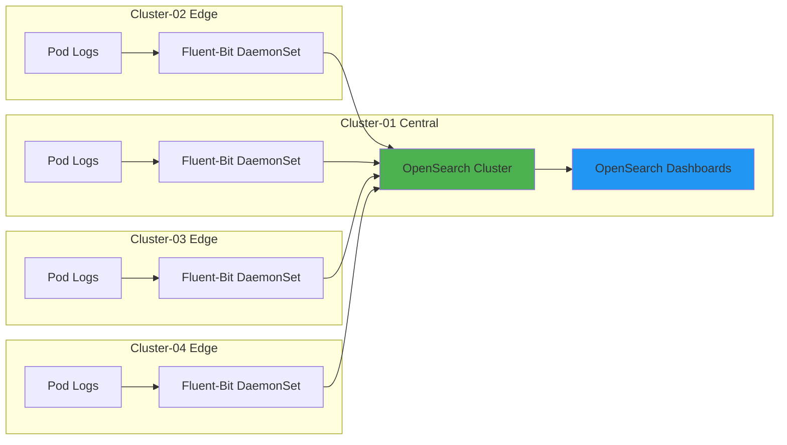
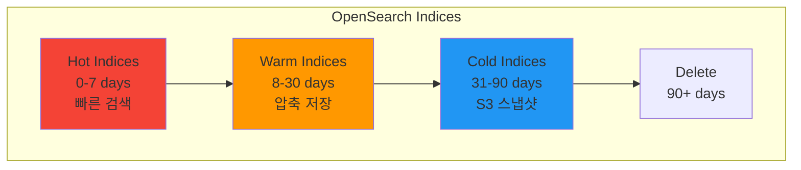

# 로그 수집 및 분석

## 📋 개요

OpenSearch + Fluent-Bit을 활용한 멀티클러스터 로그 수집, 저장, 분석 가이드입니다.

---

## 🏗️ 로그 아키텍처

### 로그 수집 흐름



### 로그 저장소 전략



---

## 1️⃣ OpenSearch Cluster 배포

### Base 설정

```yaml
# deploy/base/opensearch-cluster/opensearch-cluster.yaml
apiVersion: opensearch.opster.io/v1
kind: OpenSearchCluster
metadata:
  name: opensearch-cluster
  namespace: logging
spec:
  general:
    serviceName: opensearch
    version: 2.11.0
    httpPort: 9200

  dashboards:
    enable: true
    version: 2.11.0
    replicas: 1
    resources:
      requests:
        memory: 512Mi
        cpu: 200m
      limits:
        memory: 1Gi
        cpu: 500m

  nodePools:
    - component: masters
      replicas: 3
      diskSize: 20Gi
      resources:
        requests:
          memory: 2Gi
          cpu: 500m
        limits:
          memory: 4Gi
          cpu: 1000m
      roles:
        - cluster_manager
        - data

    - component: data
      replicas: 2
      diskSize: 100Gi
      resources:
        requests:
          memory: 4Gi
          cpu: 1000m
        limits:
          memory: 8Gi
          cpu: 2000m
      roles:
        - data
        - ingest
```

### Cluster-01 Overlay (중앙)

```yaml
# deploy/overlays/cluster-01-central/opensearch-cluster/kustomization.yaml
apiVersion: kustomize.config.k8s.io/v1beta1
kind: Kustomization

namespace: logging

resources:
  - ../../../base/opensearch-cluster

patches:
  - path: opensearch-cluster-patch.yaml
```

```yaml
# deploy/overlays/cluster-01-central/opensearch-cluster/opensearch-cluster-patch.yaml
apiVersion: opensearch.opster.io/v1
kind: OpenSearchCluster
metadata:
  name: opensearch-cluster
  namespace: logging
spec:
  general:
    additionalConfig:
      cluster.name: central-logging

  bootstrap:
    resources:
      requests:
        memory: 512Mi
        cpu: 200m

  # S3 스냅샷 저장소 설정
  s3:
    enabled: true
    endpoint: s3.minio.miribit.lab:9000
    bucket: opensearch-snapshots
    region: us-east-1
```

### Ingress 설정

```yaml
# deploy/overlays/cluster-01-central/opensearch-cluster/opensearch-ingress.yaml
apiVersion: networking.k8s.io/v1
kind: Ingress
metadata:
  name: opensearch-dashboards
  namespace: logging
  annotations:
    nginx.ingress.kubernetes.io/backend-protocol: "HTTP"
spec:
  ingressClassName: nginx
  rules:
    - host: opensearch.k8s-cluster-01.miribit.lab
      http:
        paths:
          - path: /
            pathType: Prefix
            backend:
              service:
                name: opensearch-dashboards
                port:
                  number: 5601
```

---

## 2️⃣ Fluent-Bit 배포

### Base 설정

```yaml
# deploy/base/fluent-bit/values.yaml
fluent-bit:
  image:
    repository: fluent/fluent-bit
    tag: 2.2.0

  daemonSetVolumes:
    - name: varlog
      hostPath:
        path: /var/log
    - name: varlibdockercontainers
      hostPath:
        path: /var/lib/docker/containers

  daemonSetVolumeMounts:
    - name: varlog
      mountPath: /var/log
      readOnly: true
    - name: varlibdockercontainers
      mountPath: /var/lib/docker/containers
      readOnly: true

  config:
    service: |
      [SERVICE]
          Daemon Off
          Flush 5
          Log_Level info
          Parsers_File parsers.conf

    inputs: |
      [INPUT]
          Name tail
          Path /var/log/containers/*.log
          Parser docker
          Tag kube.*
          Mem_Buf_Limit 50MB
          Skip_Long_Lines On
          Refresh_Interval 10

    filters: |
      [FILTER]
          Name kubernetes
          Match kube.*
          Kube_URL https://kubernetes.default.svc:443
          Kube_CA_File /var/run/secrets/kubernetes.io/serviceaccount/ca.crt
          Kube_Token_File /var/run/secrets/kubernetes.io/serviceaccount/token
          Kube_Tag_Prefix kube.var.log.containers.
          Merge_Log On
          Keep_Log Off
          K8S-Logging.Parser On
          K8S-Logging.Exclude On

      [FILTER]
          Name modify
          Match kube.*
          Add cluster cluster-01

      [FILTER]
          Name nest
          Match kube.*
          Operation lift
          Nested_under kubernetes
          Add_prefix k8s_

    outputs: |
      [OUTPUT]
          Name opensearch
          Match kube.*
          Host opensearch-cluster.logging.svc.cluster-01.local
          Port 9200
          Index fluentbit
          Type _doc
          Logstash_Format On
          Logstash_Prefix logstash
          Logstash_DateFormat %Y.%m.%d
          Retry_Limit 5
          Suppress_Type_Name On

    parsers: |
      [PARSER]
          Name docker
          Format json
          Time_Key time
          Time_Format %Y-%m-%dT%H:%M:%S.%L%z
```

### Cluster-02/03/04 Edge Overlay

```yaml
# deploy/overlays/cluster-02-edge/fluent-bit/kustomization.yaml
apiVersion: kustomize.config.k8s.io/v1beta1
kind: Kustomization

namespace: logging

helmCharts:
  - name: fluent-bit
    repo: https://fluent.github.io/helm-charts
    version: 0.43.0
    releaseName: fluent-bit
    namespace: logging
    valuesFile: values.yaml

patches:
  - patch: |-
      - op: replace
        path: /fluent-bit/config/filters
        value: |
          [FILTER]
              Name kubernetes
              Match kube.*
              Kube_URL https://kubernetes.default.svc:443
              Kube_CA_File /var/run/secrets/kubernetes.io/serviceaccount/ca.crt
              Kube_Token_File /var/run/secrets/kubernetes.io/serviceaccount/token
              Merge_Log On

          [FILTER]
              Name modify
              Match kube.*
              Add cluster cluster-02
              Add role edge
              Add location datacenter-a
```

---

## 3️⃣ Index Lifecycle Management (ILM)

### ISM Policy 생성

```json
{
  "policy": {
    "description": "Log retention policy",
    "default_state": "hot",
    "states": [
      {
        "name": "hot",
        "actions": [
          {
            "rollover": {
              "min_index_age": "1d",
              "min_primary_shard_size": "30gb"
            }
          }
        ],
        "transitions": [
          {
            "state_name": "warm",
            "conditions": {
              "min_index_age": "7d"
            }
          }
        ]
      },
      {
        "name": "warm",
        "actions": [
          {
            "replica_count": {
              "number_of_replicas": 1
            }
          },
          {
            "force_merge": {
              "max_num_segments": 1
            }
          }
        ],
        "transitions": [
          {
            "state_name": "cold",
            "conditions": {
              "min_index_age": "30d"
            }
          }
        ]
      },
      {
        "name": "cold",
        "actions": [
          {
            "snapshot": {
              "repository": "s3-snapshot-repo",
              "snapshot": "logstash-{{ctx.index}}"
            }
          },
          {
            "replica_count": {
              "number_of_replicas": 0
            }
          }
        ],
        "transitions": [
          {
            "state_name": "delete",
            "conditions": {
              "min_index_age": "90d"
            }
          }
        ]
      },
      {
        "name": "delete",
        "actions": [
          {
            "delete": {}
          }
        ]
      }
    ]
  }
}
```

### ISM Policy 적용

```bash
# Policy 생성
curl -X PUT "http://opensearch.k8s-cluster-01.miribit.lab/_plugins/_ism/policies/log-retention-policy" \
  -H 'Content-Type: application/json' \
  -d @ism-policy.json

# Index Template에 Policy 적용
curl -X PUT "http://opensearch.k8s-cluster-01.miribit.lab/_index_template/logstash-template" \
  -H 'Content-Type: application/json' \
  -d '{
  "index_patterns": ["logstash-*"],
  "template": {
    "settings": {
      "number_of_shards": 3,
      "number_of_replicas": 1,
      "opendistro.index_state_management.policy_id": "log-retention-policy",
      "opendistro.index_state_management.rollover_alias": "logstash"
    }
  }
}'
```

---

## 4️⃣ 로그 검색 쿼리

### OpenSearch Query DSL

```json
{
  "query": {
    "bool": {
      "must": [
        {
          "match": {
            "cluster": "cluster-02"
          }
        },
        {
          "match": {
            "k8s_namespace_name": "monitoring"
          }
        },
        {
          "range": {
            "@timestamp": {
              "gte": "now-1h",
              "lte": "now"
            }
          }
        }
      ],
      "should": [
        {
          "match": {
            "log": "error"
          }
        },
        {
          "match": {
            "log": "failed"
          }
        }
      ],
      "minimum_should_match": 1
    }
  },
  "sort": [
    {
      "@timestamp": {
        "order": "desc"
      }
    }
  ],
  "size": 100
}
```

### 클러스터별 로그 집계

```json
{
  "size": 0,
  "aggs": {
    "clusters": {
      "terms": {
        "field": "cluster.keyword",
        "size": 10
      },
      "aggs": {
        "log_levels": {
          "terms": {
            "field": "level.keyword"
          }
        }
      }
    }
  }
}
```

### Pod 에러 로그 검색

```json
{
  "query": {
    "bool": {
      "must": [
        {
          "match": {
            "k8s_pod_name": "thanos-receive-*"
          }
        },
        {
          "regexp": {
            "log": ".*error.*|.*failed.*|.*exception.*"
          }
        }
      ],
      "filter": [
        {
          "range": {
            "@timestamp": {
              "gte": "now-15m"
            }
          }
        }
      ]
    }
  }
}
```

---

## 5️⃣ OpenSearch Dashboards 대시보드

### 클러스터 로그 Overview

```yaml
visualizations:
  - type: metric
    title: "총 로그 수 (last 24h)"
    query: |
      {
        "query": {
          "range": {
            "@timestamp": {
              "gte": "now-24h"
            }
          }
        }
      }

  - type: pie
    title: "클러스터별 로그 분포"
    query: |
      {
        "aggs": {
          "clusters": {
            "terms": {
              "field": "cluster.keyword"
            }
          }
        }
      }

  - type: line
    title: "시간대별 로그 발생량"
    query: |
      {
        "aggs": {
          "logs_over_time": {
            "date_histogram": {
              "field": "@timestamp",
              "fixed_interval": "5m"
            },
            "aggs": {
              "clusters": {
                "terms": {
                  "field": "cluster.keyword"
                }
              }
            }
          }
        }
      }
```

### 에러 로그 대시보드

```yaml
visualizations:
  - type: data_table
    title: "최근 에러 로그"
    columns:
      - "@timestamp"
      - "cluster"
      - "k8s_namespace_name"
      - "k8s_pod_name"
      - "log"
    query: |
      {
        "query": {
          "bool": {
            "should": [
              {"match": {"log": "error"}},
              {"match": {"log": "exception"}},
              {"match": {"log": "failed"}}
            ]
          }
        },
        "sort": [{"@timestamp": {"order": "desc"}}]
      }

  - type: horizontal_bar
    title: "Pod별 에러 빈도"
    query: |
      {
        "query": {
          "match": {"log": "error"}
        },
        "aggs": {
          "pods": {
            "terms": {
              "field": "k8s_pod_name.keyword",
              "size": 20
            }
          }
        }
      }
```

---

## 6️⃣ 알림 규칙

### OpenSearch Alerting

```json
{
  "name": "High Error Rate Alert",
  "type": "monitor",
  "monitor_type": "query_level_monitor",
  "enabled": true,
  "schedule": {
    "period": {
      "interval": 5,
      "unit": "MINUTES"
    }
  },
  "inputs": [
    {
      "search": {
        "indices": ["logstash-*"],
        "query": {
          "size": 0,
          "query": {
            "bool": {
              "must": [
                {
                  "match": {
                    "log": "error"
                  }
                },
                {
                  "range": {
                    "@timestamp": {
                      "gte": "now-5m"
                    }
                  }
                }
              ]
            }
          },
          "aggs": {
            "error_count": {
              "value_count": {
                "field": "_id"
              }
            }
          }
        }
      }
    }
  ],
  "triggers": [
    {
      "name": "Error threshold trigger",
      "severity": "1",
      "condition": {
        "script": {
          "source": "ctx.results[0].aggregations.error_count.value > 100",
          "lang": "painless"
        }
      },
      "actions": [
        {
          "name": "Slack notification",
          "destination_id": "slack-webhook-destination",
          "message_template": {
            "source": "Error count exceeded threshold: {{ctx.results.0.aggregations.error_count.value}} errors in last 5 minutes",
            "lang": "mustache"
          }
        }
      ]
    }
  ]
}
```

---

## 7️⃣ 로그 보존 및 백업

### S3 스냅샷 저장소 설정

```bash
# S3 Snapshot Repository 등록
curl -X PUT "http://opensearch.k8s-cluster-01.miribit.lab/_snapshot/s3-snapshot-repo" \
  -H 'Content-Type: application/json' \
  -d '{
  "type": "s3",
  "settings": {
    "bucket": "opensearch-snapshots",
    "endpoint": "s3.minio.miribit.lab:9000",
    "protocol": "http",
    "region": "us-east-1",
    "base_path": "snapshots"
  }
}'
```

### 자동 스냅샷 정책

```json
{
  "policy": {
    "description": "Daily snapshot policy",
    "creation": {
      "schedule": {
        "cron": {
          "expression": "0 0 * * *",
          "timezone": "Asia/Seoul"
        }
      },
      "time_limit": "1h"
    },
    "deletion": {
      "schedule": {
        "cron": {
          "expression": "0 1 * * *",
          "timezone": "Asia/Seoul"
        }
      },
      "condition": {
        "max_age": "30d",
        "max_count": 30
      },
      "time_limit": "1h"
    },
    "snapshot_config": {
      "indices": "logstash-*",
      "repository": "s3-snapshot-repo",
      "ignore_unavailable": true,
      "include_global_state": false,
      "partial": true
    }
  }
}
```

### 수동 스냅샷 생성

```bash
# Snapshot 생성
curl -X PUT "http://opensearch.k8s-cluster-01.miribit.lab/_snapshot/s3-snapshot-repo/snapshot-$(date +%Y%m%d-%H%M%S)" \
  -H 'Content-Type: application/json' \
  -d '{
  "indices": "logstash-*",
  "ignore_unavailable": true,
  "include_global_state": false
}'

# Snapshot 복원
curl -X POST "http://opensearch.k8s-cluster-01.miribit.lab/_snapshot/s3-snapshot-repo/snapshot-20251020-120000/_restore" \
  -H 'Content-Type: application/json' \
  -d '{
  "indices": "logstash-2025.10.20",
  "ignore_unavailable": true,
  "include_global_state": false
}'
```

---

## 8️⃣ 로그 분석 Best Practices

### 효율적인 검색

```yaml
최적화 팁:
  - 시간 범위를 최대한 좁히기 (1시간, 1일 등)
  - 인덱스 패턴 사용 (logstash-2025.10.*)
  - 필터 우선 적용 후 검색
  - 불필요한 필드 제외 (_source 필터링)
  - Aggregation 크기 제한 (size 파라미터)
```

### 로그 파싱 패턴

```yaml
# Fluent-Bit Multiline Parser
parsers:
  - name: java_multiline
    type: multiline
    parser: java
    key_content: log

  - name: python_traceback
    type: multiline
    parser: python
    key_content: log
```

### 로그 필터링

```yaml
# 불필요한 로그 제외
filters:
  - name: grep
    match: kube.*
    exclude: log .*healthcheck.*

  - name: grep
    match: kube.*
    exclude: k8s_namespace_name kube-system
```

---

## 9️⃣ 트러블슈팅

### 로그가 수집되지 않는 경우

```bash
# Fluent-Bit Pod 상태 확인
kubectl get pods -n logging -l app.kubernetes.io/name=fluent-bit

# Fluent-Bit 로그 확인
kubectl logs -n logging -l app.kubernetes.io/name=fluent-bit --tail=100

# OpenSearch 연결 테스트
kubectl exec -n logging fluent-bit-xxxxx -- \
  curl -v http://opensearch-cluster.logging.svc.cluster.local:9200
```

### OpenSearch 클러스터 상태 확인

```bash
# 클러스터 상태
curl http://opensearch.k8s-cluster-01.miribit.lab/_cluster/health?pretty

# 노드 상태
curl http://opensearch.k8s-cluster-01.miribit.lab/_cat/nodes?v

# 인덱스 상태
curl http://opensearch.k8s-cluster-01.miribit.lab/_cat/indices?v&s=index
```

### 디스크 공간 부족

```bash
# 오래된 인덱스 삭제
curl -X DELETE "http://opensearch.k8s-cluster-01.miribit.lab/logstash-2025.09.*"

# Force Merge (압축)
curl -X POST "http://opensearch.k8s-cluster-01.miribit.lab/logstash-2025.10.*/_forcemerge?max_num_segments=1"
```

---

## 🔟 성능 모니터링

### OpenSearch 메트릭

```promql
# 인덱싱 속도
rate(opensearch_index_indexing_index_total[5m])

# 검색 속도
rate(opensearch_index_search_query_total[5m])

# JVM Heap 사용률
opensearch_jvm_mem_heap_used_percent

# 디스크 사용률
opensearch_fs_total_available_bytes / opensearch_fs_total_total_bytes
```

### Fluent-Bit 메트릭

```promql
# 입력 레코드 수
rate(fluentbit_input_records_total[5m])

# 출력 레코드 수
rate(fluentbit_output_records_total[5m])

# 재시도 실패
rate(fluentbit_output_retries_failed_total[5m])
```

---

## 🔗 관련 문서

- **아키텍처** → [01-아키텍처/전체-시스템-아키텍처.md](../01-아키텍처/전체-시스템-아키텍처.md)
- **배포** → [02-Kustomize-Helm-GitOps-배포/중앙-클러스터-배포.md](../02-Kustomize-Helm-GitOps-배포/중앙-클러스터-배포.md)
- **모니터링** → [핵심-메트릭.md](./핵심-메트릭.md)

---

**최종 업데이트**: 2025-10-20
