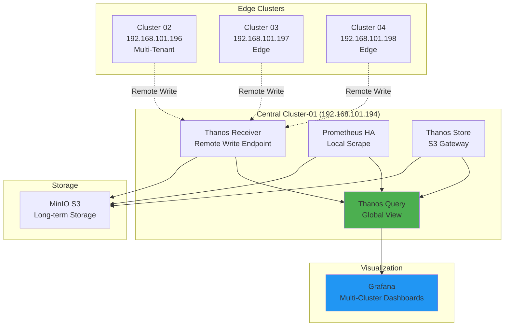

# 멀티클러스터 뷰

## 📋 개요

4개 클러스터의 통합 모니터링 및 글로벌 뷰 구성 방법입니다.

---

## 🎯 멀티클러스터 아키텍처



---

## 1️⃣ 클러스터 레이블 전략

### 외부 레이블 (externalLabels)

```yaml
# Cluster-01 (Central)
prometheus:
  prometheusSpec:
    externalLabels:
      cluster: cluster-01
      role: central
      location: datacenter-a
      environment: production

# Cluster-02 (Multi-Tenant Edge)
prometheus:
  prometheusSpec:
    externalLabels:
      cluster: cluster-02
      role: edge-multi-tenant
      location: edge-site-1

# Cluster-03 (Edge)
prometheus:
  prometheusSpec:
    externalLabels:
      cluster: cluster-03
      role: edge
      location: edge-site-2

# Cluster-04 (Edge)
prometheus:
  prometheusSpec:
    externalLabels:
      cluster: cluster-04
      role: edge
      location: edge-site-3
```

### Tenant 레이블 (Cluster-02)

```yaml
# Tenant A
prometheus:
  prometheusSpec:
    externalLabels:
      cluster: cluster-02
      tenant: tenant-a
      tenant_id: "1001"

# Tenant B
prometheus:
  prometheusSpec:
    externalLabels:
      cluster: cluster-02
      tenant: tenant-b
      tenant_id: "1002"
```

---

## 2️⃣ Thanos Query 글로벌 뷰

### Query Deployment

```yaml
apiVersion: apps/v1
kind: Deployment
metadata:
  name: thanos-query
  namespace: monitoring
spec:
  replicas: 2
  template:
    spec:
      containers:
      - name: thanos-query
        image: quay.io/thanos/thanos:v0.31.0
        args:
        - query
        - --http-address=0.0.0.0:9090
        - --grpc-address=0.0.0.0:10901
        - --query.replica-label=replica
        - --query.replica-label=prometheus_replica

        # Store Endpoints (자동 발견)
        - --store=dnssrv+_grpc._tcp.thanos-receive.monitoring.svc.cluster.local
        - --store=dnssrv+_grpc._tcp.thanos-store.monitoring.svc.cluster.local
        - --store=dnssrv+_grpc._tcp.prometheus-kube-prometheus-stack-prometheus.monitoring.svc.cluster.local

        # Deduplication
        - --query.auto-downsampling

        ports:
        - name: http
          containerPort: 9090
        - name: grpc
          containerPort: 10901
```

### Query Store API 확인

```bash
# Thanos Query Stores
curl http://thanos-query:9090/api/v1/stores | jq .

# 출력:
# {
#   "status": "success",
#   "data": [
#     {
#       "name": "thanos-receive-0:10901",
#       "lastCheck": "2025-10-20T...",
#       "lastError": null,
#       "labelSets": [{"cluster": "cluster-02"}, {"cluster": "cluster-03"}, {"cluster": "cluster-04"}]
#     },
#     {
#       "name": "thanos-store-0:10901",
#       "labelSets": [{"cluster": "cluster-01"}]
#     }
#   ]
# }
```

---

## 3️⃣ 글로벌 쿼리 예제

### 전체 클러스터 메트릭

```promql
# 모든 클러스터의 Up 타겟
up

# 클러스터별 타겟 수
count(up) by (cluster)

# 출력:
# {cluster="cluster-01"} 50
# {cluster="cluster-02"} 60
# {cluster="cluster-03"} 45
# {cluster="cluster-04"} 40

# 클러스터별 Up 타겟
count(up == 1) by (cluster)

# 총 타겟 수 (전체)
count(up)

# 출력: 195
```

### 클러스터 간 비교

```promql
# 클러스터별 CPU 사용량
sum(rate(container_cpu_usage_seconds_total{namespace="monitoring"}[5m])) by (cluster)

# 출력:
# {cluster="cluster-01"} 5.2
# {cluster="cluster-02"} 0.6
# {cluster="cluster-03"} 0.3
# {cluster="cluster-04"} 0.3

# 클러스터별 메모리 (GiB)
sum(container_memory_usage_bytes{namespace="monitoring"}) by (cluster) / 1024 / 1024 / 1024

# 클러스터별 Remote Write 성공률
sum(rate(prometheus_remote_storage_succeeded_samples_total[5m])) by (cluster)
/
(sum(rate(prometheus_remote_storage_succeeded_samples_total[5m])) by (cluster)
 + sum(rate(prometheus_remote_storage_failed_samples_total[5m])) by (cluster))
```

### Role별 집계

```promql
# Role별 타겟 수
count(up) by (role)

# 출력:
# {role="central"} 50
# {role="edge"} 85
# {role="edge-multi-tenant"} 60

# Central vs Edge 비교
sum(rate(container_cpu_usage_seconds_total[5m])) by (role)
```

### Location별 집계

```promql
# Location별 타겟 수
count(up) by (location)

# Location별 네트워크 트래픽
sum(rate(container_network_transmit_bytes_total[5m])) by (location) / 1024 / 1024
```

---

## 4️⃣ 멀티테넌시 뷰 (Cluster-02)

### Tenant 격리 쿼리

```promql
# Tenant A 메트릭만
up{cluster="cluster-02", tenant="tenant-a"}

# Tenant B 메트릭만
up{cluster="cluster-02", tenant="tenant-b"}

# Tenant별 타겟 수
count(up{cluster="cluster-02"}) by (tenant)

# 출력:
# {tenant="tenant-a"} 30
# {tenant="tenant-b"} 30

# Tenant별 샘플 처리량
sum(rate(prometheus_tsdb_head_samples_appended_total{cluster="cluster-02"}[5m])) by (tenant)
```

### Tenant 비교 대시보드

```promql
# Tenant별 CPU
sum(rate(container_cpu_usage_seconds_total{namespace=~"monitoring-tenant-.*"}[5m])) by (namespace)

# Tenant별 메모리
sum(container_memory_usage_bytes{pod=~"prometheus-agent-tenant-.*"}) by (pod) / 1024 / 1024

# Tenant별 Remote Write Queue
prometheus_remote_storage_queue_length{pod=~"prometheus-agent-tenant-.*"}
```

---

## 5️⃣ 전체 클러스터 요약 대시보드

### Overview 패널 구성

```yaml
# Panel 1: 클러스터 상태 (Table)
title: "클러스터 상태"
query: |
  count(up) by (cluster)
format: table
columns:
  - cluster
  - total_targets
  - up_targets: count(up == 1) by (cluster)
  - down_targets: count(up == 0) by (cluster)

# Panel 2: 클러스터별 샘플 처리량 (Graph)
title: "샘플 처리량 (samples/s)"
query: |
  sum(rate(prometheus_remote_storage_succeeded_samples_total[5m])) by (cluster)
legend: "{{cluster}}"

# Panel 3: 클러스터별 리소스 (Heatmap)
title: "CPU 사용량 분포"
query: |
  sum(rate(container_cpu_usage_seconds_total[5m])) by (cluster, pod)
format: heatmap

# Panel 4: Remote Write 지연 (Graph)
title: "Remote Write P99 지연"
query: |
  histogram_quantile(0.99,
    sum(rate(prometheus_remote_storage_send_duration_seconds_bucket[5m])) by (cluster, le)
  )
```

---

## 6️⃣ 클러스터 드릴다운

### 계층적 대시보드 링크

```yaml
# Overview → Cluster Detail
panels:
  - title: "클러스터 목록"
    type: table
    links:
      - title: "Cluster-01 상세"
        url: "/d/cluster-01-detail?var-cluster=cluster-01"
      - title: "Cluster-02 상세"
        url: "/d/cluster-02-detail?var-cluster=cluster-02"

# Cluster Detail → Pod Detail
panels:
  - title: "Pod 목록"
    type: table
    links:
      - title: "Pod 상세"
        url: "/d/pod-detail?var-cluster=$cluster&var-pod=$pod"
```

### 변수 전달

```yaml
# Dashboard Variables
variables:
  - name: cluster
    type: query
    query: label_values(up, cluster)

  - name: namespace
    type: query
    query: label_values(up{cluster="$cluster"}, namespace)

  - name: pod
    type: query
    query: label_values(up{cluster="$cluster", namespace="$namespace"}, pod)
```

---

## 7️⃣ 시계열 데이터 통합

### 단기 vs 장기 데이터

```promql
# 최근 24시간 (Receiver/Prometheus HA)
up[24h]

# 7일 전 데이터 (Store Gateway → S3)
up[7d] offset 7d

# 30일 전 5분 다운샘플링 데이터
avg_over_time(up[5m] offset 30d)

# 180일 전 1시간 다운샘플링 데이터
avg_over_time(up[1h] offset 180d)
```

### 장기 추세 분석

```promql
# 7일 평균
avg_over_time(
  sum(rate(prometheus_remote_storage_succeeded_samples_total[5m]))[7d:]
)

# 월별 비교
sum(rate(prometheus_remote_storage_succeeded_samples_total[5m])) by (cluster)
offset 30d

# 증가율 (전월 대비)
(sum(rate(prometheus_remote_storage_succeeded_samples_total[5m])) by (cluster)
 - sum(rate(prometheus_remote_storage_succeeded_samples_total[5m])) by (cluster) offset 30d)
/
sum(rate(prometheus_remote_storage_succeeded_samples_total[5m])) by (cluster) offset 30d
* 100
```

---

## 8️⃣ 고급 집계 쿼리

### Top N 분석

```promql
# Top 5 CPU 사용 클러스터
topk(5,
  sum(rate(container_cpu_usage_seconds_total[5m])) by (cluster)
)

# Top 10 메모리 사용 Pod (전체 클러스터)
topk(10,
  sum(container_memory_usage_bytes{namespace="monitoring"}) by (cluster, pod)
)

# Bottom 3 Remote Write 성공률
bottomk(3,
  sum(rate(prometheus_remote_storage_succeeded_samples_total[5m])) by (cluster)
  /
  (sum(rate(prometheus_remote_storage_succeeded_samples_total[5m])) by (cluster)
   + sum(rate(prometheus_remote_storage_failed_samples_total[5m])) by (cluster))
)
```

### 퍼센타일 분석

```promql
# 클러스터별 P50, P95, P99 Remote Write 지연
quantile(0.50,
  histogram_quantile(0.99,
    sum(rate(prometheus_remote_storage_send_duration_seconds_bucket[5m])) by (cluster, le)
  )
)

quantile(0.95, ...)
quantile(0.99, ...)
```

### 이상 탐지

```promql
# Remote Write 성공률이 평균보다 2 표준편차 낮은 클러스터
(
  sum(rate(prometheus_remote_storage_succeeded_samples_total[5m])) by (cluster)
  / (sum(rate(prometheus_remote_storage_succeeded_samples_total[5m])) by (cluster)
     + sum(rate(prometheus_remote_storage_failed_samples_total[5m])) by (cluster))
)
<
(
  avg(
    sum(rate(prometheus_remote_storage_succeeded_samples_total[5m])) by (cluster)
    / (sum(rate(prometheus_remote_storage_succeeded_samples_total[5m])) by (cluster)
       + sum(rate(prometheus_remote_storage_failed_samples_total[5m])) by (cluster))
  )
  - 2 * stddev(
    sum(rate(prometheus_remote_storage_succeeded_samples_total[5m])) by (cluster)
    / (sum(rate(prometheus_remote_storage_succeeded_samples_total[5m])) by (cluster)
       + sum(rate(prometheus_remote_storage_failed_samples_total[5m])) by (cluster))
  )
)
```

---

## 9️⃣ Grafana 멀티클러스터 대시보드

### JSON 템플릿

```json
{
  "title": "Multi-Cluster Global View",
  "templating": {
    "list": [
      {
        "name": "cluster",
        "type": "query",
        "query": "label_values(up, cluster)",
        "multi": true,
        "includeAll": true
      }
    ]
  },
  "panels": [
    {
      "title": "클러스터 맵",
      "type": "geomap",
      "targets": [{
        "expr": "count(up) by (cluster, location)"
      }],
      "options": {
        "view": {
          "lat": 37.5,
          "lon": 127.0,
          "zoom": 6
        }
      }
    },
    {
      "title": "클러스터별 상태",
      "type": "stat",
      "targets": [{
        "expr": "count(up{cluster=~\"$cluster\"}) by (cluster)"
      }],
      "fieldConfig": {
        "defaults": {
          "mappings": [
            {"type": "value", "value": "null", "text": "Down"}
          ],
          "thresholds": {
            "steps": [
              {"value": 0, "color": "red"},
              {"value": 1, "color": "green"}
            ]
          }
        }
      }
    }
  ]
}
```

---

## 🔟 Federation (선택적)

### Prometheus Federation 설정 (대안)

```yaml
# Central Prometheus가 Edge에서 Pull
prometheus:
  additionalScrapeConfigs:
    - job_name: 'federate-cluster-03'
      honor_labels: true
      metrics_path: '/federate'
      params:
        'match[]':
          - '{job="prometheus"}'
          - '{__name__=~"job:.*"}'
      static_configs:
        - targets:
          - 'prometheus.cluster-03.local:9090'
```

> **참고**: Agent + Receiver 패턴을 사용하므로 Federation은 불필요합니다.

---

## 📊 멀티클러스터 메트릭 요약

| 메트릭 | Cluster-01 | Cluster-02 | Cluster-03 | Cluster-04 | 총합 |
|--------|-----------|-----------|-----------|-----------|------|
| **타겟 수** | 50 | 60 | 45 | 40 | 195 |
| **샘플/초** | 12,000 | 8,500 | 8,000 | 7,500 | 36,000 |
| **CPU (cores)** | 5.2 | 0.6 | 0.3 | 0.3 | 6.4 |
| **메모리 (GiB)** | 12 | 0.7 | 0.4 | 0.4 | 13.5 |
| **스토리지 (GiB)** | 650 | 100 | 50 | 50 | 850 |

---

## 🔗 관련 문서

- **핵심 메트릭** → [핵심-메트릭.md](./핵심-메트릭.md)
- **Grafana 대시보드** → [Grafana-대시보드.md](./Grafana-대시보드.md)
- **PromQL 쿼리** → [PromQL-쿼리-예제.md](./PromQL-쿼리-예제.md)

---

**최종 업데이트**: 2025-10-20
