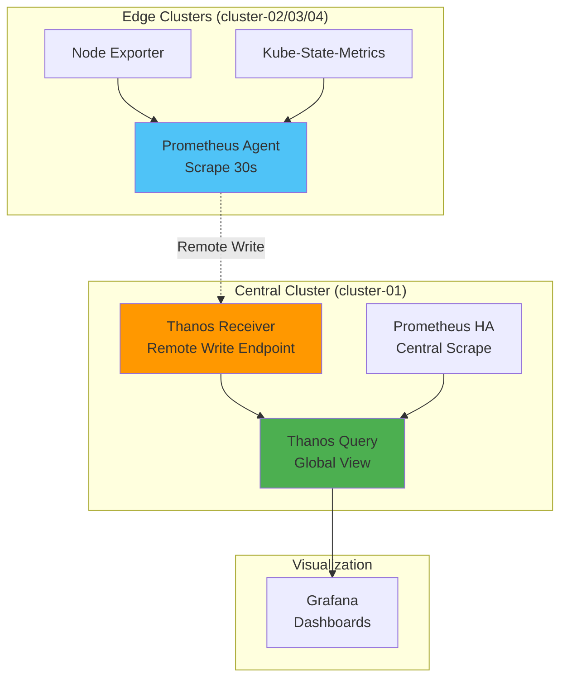

# 핵심 메트릭

## 📋 개요

Prometheus Agent + Thanos Receiver 환경에서 모니터링해야 할 필수 메트릭과 임계값을 정의합니다.

---

## 🎯 메트릭 카테고리

| 카테고리 | 메트릭 수 | 우선순위 | 수집 간격 |
|---------|---------|---------|----------|
| **Remote Write** | 12개 | P1 (Critical) | 30s |
| **Thanos Receiver** | 15개 | P1 (Critical) | 30s |
| **Agent 리소스** | 8개 | P2 (High) | 30s |
| **Receiver 리소스** | 10개 | P2 (High) | 30s |
| **TSDB** | 8개 | P2 (High) | 1m |
| **네트워크** | 6개 | P3 (Medium) | 1m |

---

## 1️⃣ Remote Write 메트릭

### 필수 메트릭

```promql
# 1. Remote Write Queue 길이 (중요도: ★★★★★)
prometheus_remote_storage_queue_length

# 임계값:
# - 정상: 0-100
# - 주의: 100-1000
# - 경고: 1000-5000
# - 위험: 5000+

# 2. Remote Write 성공 샘플 (samples/s)
rate(prometheus_remote_storage_succeeded_samples_total[5m])

# 목표: > 8,000 samples/s (cluster-03)

# 3. Remote Write 실패 샘플
rate(prometheus_remote_storage_failed_samples_total[5m])

# 목표: 0 (100% 성공)

# 4. Remote Write 성공률
rate(prometheus_remote_storage_succeeded_samples_total[5m])
/
(rate(prometheus_remote_storage_succeeded_samples_total[5m])
 + rate(prometheus_remote_storage_failed_samples_total[5m]))

# 목표: > 0.995 (99.5%)

# 5. Remote Write Shards 수
prometheus_remote_storage_shards

# 범위: 10-100 (자동 조정)

# 6. Remote Write Queue 용량
prometheus_remote_storage_queue_capacity

# 설정값: 20,000

# 7. Remote Write 전송 중 샘플
prometheus_remote_storage_pending_samples

# 목표: < 10,000

# 8. Remote Write 지연 시간 (초)
histogram_quantile(0.99,
  rate(prometheus_remote_storage_send_duration_seconds_bucket[5m])
)

# 목표: < 1s (p99)

# 9. Remote Write 재시도
rate(prometheus_remote_storage_retried_samples_total[5m])

# 목표: 최소화

# 10. Remote Write Drop 샘플
rate(prometheus_remote_storage_dropped_samples_total[5m])

# 목표: 0

# 11. Remote Write 최고 샘플 타임스탬프
prometheus_remote_storage_highest_timestamp_in_seconds

# 지연 확인: time() - prometheus_remote_storage_highest_timestamp_in_seconds

# 12. Remote Write Enqueue 지연
histogram_quantile(0.99,
  rate(prometheus_remote_storage_enqueue_duration_seconds_bucket[5m])
)

# 목표: < 100ms (p99)
```

---

## 2️⃣ Thanos Receiver 메트릭

### 수신 메트릭

```promql
# 1. Receiver Write 요청 속도 (중요도: ★★★★★)
rate(thanos_receive_write_requests_total[5m])

# 2. Receiver 수신 시계열 속도
rate(thanos_receive_write_timeseries_total[5m])

# 목표: > 8,000 timeseries/s

# 3. Receiver Write 실패
rate(thanos_receive_write_requests_total{code!~"2.."}[5m])

# 목표: 0

# 4. Receiver Replication 요청
rate(thanos_receive_replication_requests_total[5m])

# 5. Replication 성공률
rate(thanos_receive_replication_requests_total{result="success"}[5m])
/
rate(thanos_receive_replication_requests_total[5m])

# 목표: > 0.999 (99.9%)

# 6. Receiver Replication 지연
histogram_quantile(0.99,
  rate(thanos_receive_replication_duration_seconds_bucket[5m])
)

# 목표: < 500ms (p99)

# 7. Receiver Hashring Nodes (Active)
thanos_receive_hashring_nodes{state="active"}

# 예상: 3 (또는 설정된 replicas)

# 8. Receiver TSDB Head Series
thanos_receive_head_series

# 모니터링 (시간당 증가율)

# 9. Receiver TSDB Head Chunks
thanos_receive_head_chunks

# 10. Receiver Forward 요청 (Hashring 라우팅)
rate(thanos_receive_forward_requests_total[5m])

# 11. Receiver Appender 동시성
thanos_receive_head_appenders

# 12. Receiver Tenant 별 샘플 수
sum(rate(thanos_receive_write_timeseries_total[5m])) by (tenant)
```

### S3 업로드 메트릭

```promql
# 13. Shipper 업로드 성공
thanos_shipper_uploads_total{instance=~"thanos-receive.*"}

# 14. Shipper 업로드 실패
thanos_shipper_upload_failures_total{instance=~"thanos-receive.*"}

# 목표: 0

# 15. Shipper 업로드 Duration
histogram_quantile(0.99,
  rate(thanos_shipper_upload_duration_seconds_bucket{instance=~"thanos-receive.*"}[1h])
)

# 목표: < 30s (p99)
```

---

## 3️⃣ Agent 리소스 메트릭

### CPU/Memory

```promql
# 1. Agent CPU 사용량 (cores)
rate(container_cpu_usage_seconds_total{pod=~"prometheus-agent.*"}[5m])

# 목표: < 0.5 cores (limit: 0.5)

# 2. Agent 메모리 사용량 (MiB)
container_memory_usage_bytes{pod=~"prometheus-agent.*"} / 1024 / 1024

# 목표: < 400Mi (limit: 512Mi)

# 3. Agent 메모리 사용률
container_memory_usage_bytes{pod=~"prometheus-agent.*"}
/
container_spec_memory_limit_bytes{pod=~"prometheus-agent.*"}

# 목표: < 0.8 (80%)

# 4. Agent 메모리 Working Set
container_memory_working_set_bytes{pod=~"prometheus-agent.*"} / 1024 / 1024

# 5. Agent Process 메모리
process_resident_memory_bytes{job="prometheus-agent"} / 1024 / 1024
```

### WAL 및 스토리지

```promql
# 6. WAL Segment 수
prometheus_tsdb_wal_segment_current{job="prometheus-agent"}

# 7. WAL Checkpoint Duration
prometheus_tsdb_checkpoint_duration_seconds{job="prometheus-agent"}

# 8. WAL Corruption
increase(prometheus_tsdb_wal_corruptions_total[1h])

# 목표: 0
```

---

## 4️⃣ Receiver 리소스 메트릭

### CPU/Memory

```promql
# 1. Receiver CPU 사용량 (cores)
rate(container_cpu_usage_seconds_total{pod=~"thanos-receive.*"}[5m])

# 목표: < 3.5 cores (limit: 4 cores)

# 2. Receiver 메모리 사용량 (GiB)
container_memory_usage_bytes{pod=~"thanos-receive.*"} / 1024 / 1024 / 1024

# 목표: < 7Gi (limit: 8Gi)

# 3. Receiver 메모리 사용률
container_memory_usage_bytes{pod=~"thanos-receive.*"}
/
container_spec_memory_limit_bytes{pod=~"thanos-receive.*"}

# 목표: < 0.85 (85%)
```

### TSDB

```promql
# 4. TSDB Storage Blocks
prometheus_tsdb_storage_blocks_bytes{job="thanos-receive"} / 1024 / 1024 / 1024

# 5. TSDB Compaction Duration
histogram_quantile(0.99,
  rate(prometheus_tsdb_compaction_duration_seconds_bucket{job="thanos-receive"}[1h])
)

# 6. TSDB Compaction 실패
increase(prometheus_tsdb_compactions_failed_total{job="thanos-receive"}[1h])

# 목표: 0

# 7. TSDB 블록 수
prometheus_tsdb_blocks_loaded{job="thanos-receive"}

# 8. TSDB Symbol Table Size
prometheus_tsdb_symbol_table_size_bytes{job="thanos-receive"} / 1024 / 1024

# 9. TSDB Series 삭제 속도
rate(prometheus_tsdb_head_series_removed_total{job="thanos-receive"}[5m])

# 10. TSDB Out of Order 샘플
rate(prometheus_tsdb_out_of_order_samples_total{job="thanos-receive"}[5m])

# 목표: 최소화
```

---

## 5️⃣ Scrape 메트릭

```promql
# 1. Scrape Duration (초)
scrape_duration_seconds

# 목표: < 10s (timeout)

# 2. Scrape 샘플 수
scrape_samples_scraped

# 3. Scrape 속도
rate(scrape_samples_scraped[5m])

# 4. Scrape Series 추가
rate(scrape_series_added[5m])

# 5. Scrape Timeout
scrape_duration_seconds > scrape_timeout_seconds

# 목표: 0

# 6. Scrape Health
up

# 목표: 1 (모든 타겟)

# 7. Down 타겟 수
count(up == 0) by (cluster, job)

# 목표: 0

# 8. Scrape Sample Limit 초과
scrape_samples_post_metric_relabeling
```

---

## 6️⃣ 네트워크 메트릭

```promql
# 1. Remote Write 네트워크 송신 (MB/s)
rate(container_network_transmit_bytes_total{pod=~"prometheus-agent.*"}[5m]) / 1024 / 1024

# 2. Receiver 네트워크 수신 (MB/s)
rate(container_network_receive_bytes_total{pod=~"thanos-receive.*"}[5m]) / 1024 / 1024

# 3. 네트워크 송신 에러
rate(container_network_transmit_errors_total{pod=~"prometheus-agent.*"}[5m])

# 목표: 0

# 4. 네트워크 수신 에러
rate(container_network_receive_errors_total{pod=~"thanos-receive.*"}[5m])

# 목표: 0

# 5. 네트워크 패킷 Drop
rate(container_network_transmit_packets_dropped_total[5m])
rate(container_network_receive_packets_dropped_total[5m])

# 목표: 0

# 6. HTTP 요청 Duration (Remote Write)
histogram_quantile(0.99,
  rate(prometheus_http_request_duration_seconds_bucket{handler="/api/v1/receive"}[5m])
)

# 목표: < 1s (p99)
```

---

## 7️⃣ 디스크 메트릭

```promql
# 1. 디스크 사용률
(node_filesystem_size_bytes{mountpoint="/data"}
 - node_filesystem_avail_bytes{mountpoint="/data"})
/
node_filesystem_size_bytes{mountpoint="/data"}

# 임계값:
# - 정상: < 70%
# - 주의: 70-85%
# - 경고: 85-95%
# - 위험: > 95%

# 2. 디스크 사용 가능 공간 (GiB)
node_filesystem_avail_bytes{mountpoint="/data"} / 1024 / 1024 / 1024

# 3. 디스크 I/O 읽기 속도 (MB/s)
rate(node_disk_read_bytes_total[5m]) / 1024 / 1024

# 4. 디스크 I/O 쓰기 속도 (MB/s)
rate(node_disk_written_bytes_total[5m]) / 1024 / 1024

# 5. 디스크 I/O 대기 시간
rate(node_disk_io_time_seconds_total[5m])
```

---

## 8️⃣ Thanos Query 메트릭

```promql
# 1. Query 요청 속도
rate(http_requests_total{handler="query"}[5m])

# 2. Query Duration (p99)
histogram_quantile(0.99,
  rate(http_request_duration_seconds_bucket{handler="query"}[5m])
)

# 목표: < 2s (p99)

# 3. Query 에러
rate(http_requests_total{handler="query", code!~"2.."}[5m])

# 목표: 0

# 4. Store API 호출
rate(thanos_query_store_api_requests_total[5m])

# 5. Store API 지연
histogram_quantile(0.99,
  rate(thanos_query_store_api_request_duration_seconds_bucket[5m])
)
```

---

## 📊 메트릭 수집 계층



---

## 🎯 메트릭 임계값 요약

| 메트릭 | 정상 | 주의 | 경고 | 위험 |
|--------|------|------|------|------|
| **Remote Write Queue** | 0-100 | 100-1000 | 1000-5000 | 5000+ |
| **Remote Write 성공률** | > 99.5% | 95-99.5% | 90-95% | < 90% |
| **Receiver CPU** | < 70% | 70-80% | 80-90% | > 90% |
| **Receiver Memory** | < 75% | 75-85% | 85-95% | > 95% |
| **디스크 사용률** | < 70% | 70-85% | 85-95% | > 95% |
| **Query Duration (p99)** | < 1s | 1-2s | 2-5s | > 5s |

---

## 🔗 관련 문서

- **Grafana 대시보드** → [Grafana-대시보드.md](./Grafana-대시보드.md)
- **알림 규칙** → [알림-규칙.md](./알림-규칙.md)
- **PromQL 쿼리 예제** → [PromQL-쿼리-예제.md](./PromQL-쿼리-예제.md)

---

**최종 업데이트**: 2025-10-20
