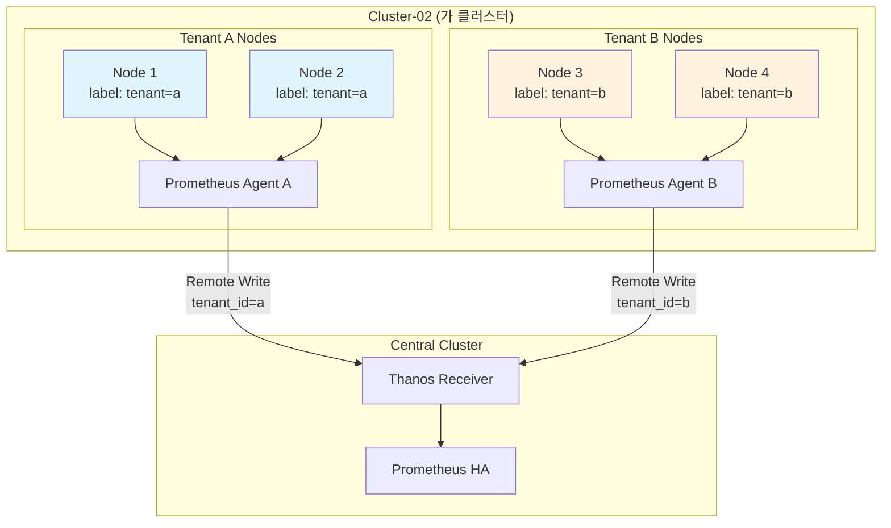

# 05. 멀티테넌시 구성

## 📋 개요

**가 클러스터 (cluster-02, 192.168.101.196)**의 노드를 반반으로 나누어 두 개의 테넌트를 구성하는 멀티테넌시 아키텍처를 설명합니다.

---

## 🏗️ 멀티테넌시 아키텍처



---

## 📂 문서 목록

### 노드-라벨링-전략.md
**목적**: 노드를 테넌트별로 분리하는 라벨링 방법

**주요 내용**:
- 노드 라벨 설정 (`tenant=a`, `tenant=b`)
- Taints 및 Tolerations
- Node Affinity 규칙
- 노드 리소스 분할 전략

**대상 독자**: 클러스터 관리자

---

### Tenant별-Prometheus-Agent.md
**목적**: 각 테넌트별 Prometheus Agent 배포

**주요 내용**:
- Agent A 배포 (tenant=a 전용)
- Agent B 배포 (tenant=b 전용)
- ServiceMonitor 테넌트 필터링
- Remote Write 레이블 추가 (`tenant_id`)

**대상 독자**: DevOps 엔지니어

---

### 리소스-격리.md
**목적**: 테넌트 간 리소스 격리 및 Quota 설정

**주요 내용**:
- ResourceQuota 설정
- LimitRange 정의
- CPU/Memory 제한
- PVC 크기 제한
- 네임스페이스 격리

**대상 독자**: 보안 담당자, SRE

---

### 네트워크-격리.md
**목적**: NetworkPolicy를 통한 테넌트 간 네트워크 격리

**주요 내용**:
- Namespace 기반 NetworkPolicy
- Tenant 간 트래픽 차단
- 공통 서비스 접근 허용
- Ingress/Egress 규칙

**대상 독자**: 네트워크 엔지니어

---

### 메트릭-분리-및-쿼리.md
**목적**: 테넌트별 메트릭 분리 및 조회 방법

**주요 내용**:
- `tenant_id` 레이블 활용
- PromQL 쿼리 필터링
- Grafana 대시보드 분리
- 테넌트별 알림 라우팅

**대상 독자**: 모니터링 담당자

---

### RBAC-설정.md
**목적**: 테넌트별 RBAC 권한 관리

**주요 내용**:
- ServiceAccount 생성
- Role 및 RoleBinding
- ClusterRole 제한
- Grafana 사용자 권한 분리

**대상 독자**: 보안 관리자

---

### 배포-및-검증.md
**목적**: 멀티테넌시 환경 배포 및 검증 절차

**주요 내용**:
- 노드 라벨링 스크립트
- Kustomize 오버레이 구조
- ArgoCD Application 분리
- 테스트 시나리오
- 검증 체크리스트

**대상 독자**: 배포 담당자

---

## 🎯 멀티테넌시 목표

### 1. 리소스 격리
- Tenant A와 Tenant B는 서로의 노드에 Pod 스케줄링 불가
- 각 테넌트는 할당된 CPU/Memory Quota 초과 불가
- 스토리지 사용량 제한

### 2. 메트릭 분리
- Prometheus Agent가 각 테넌트의 메트릭만 수집
- Remote Write 시 `tenant_id` 레이블 자동 추가
- Grafana에서 테넌트별 대시보드 분리

### 3. 네트워크 격리
- Tenant A의 Pod는 Tenant B의 Pod와 통신 불가
- 공통 서비스 (DNS, Ingress)는 양쪽 접근 가능
- NetworkPolicy로 강제

---

## 🚀 빠른 시작

### 1. 노드 라벨링
```bash
# Tenant A 노드
kubectl label nodes node-1 tenant=a
kubectl label nodes node-2 tenant=a

# Tenant B 노드
kubectl label nodes node-3 tenant=b
kubectl label nodes node-4 tenant=b
```

### 2. ResourceQuota 생성
```yaml
# tenant-a-quota.yaml
apiVersion: v1
kind: ResourceQuota
metadata:
  name: tenant-a-quota
  namespace: tenant-a
spec:
  hard:
    requests.cpu: "4"
    requests.memory: 8Gi
    persistentvolumeclaims: "10"
```

### 3. Prometheus Agent 배포
```bash
# Tenant A Agent
kustomize build deploy/overlays/cluster-02-tenant-a/prometheus-agent \
  --enable-helm | kubectl apply -f -

# Tenant B Agent
kustomize build deploy/overlays/cluster-02-tenant-b/prometheus-agent \
  --enable-helm | kubectl apply -f -
```

---

## 📊 리소스 분할 예시

### 가 클러스터 (4 Nodes, 16 Cores, 32Gi)

| 테넌트 | 노드 | CPU | Memory | 용도 |
|-------|------|-----|--------|------|
| **Tenant A** | node-1, node-2 | 8 cores | 16Gi | 프로덕션 워크로드 |
| **Tenant B** | node-3, node-4 | 8 cores | 16Gi | 개발/테스트 |

### Quota 설정
```yaml
# Tenant A
requests.cpu: 7 cores      # 여유 1 core
requests.memory: 14Gi      # 여유 2Gi

# Tenant B
requests.cpu: 7 cores
requests.memory: 14Gi
```

---

## 🔐 NetworkPolicy 예시

### Tenant A 격리
```yaml
apiVersion: networking.k8s.io/v1
kind: NetworkPolicy
metadata:
  name: tenant-a-isolation
  namespace: tenant-a
spec:
  podSelector: {}
  policyTypes:
  - Ingress
  - Egress
  ingress:
  - from:
    - namespaceSelector:
        matchLabels:
          tenant: a
  egress:
  - to:
    - namespaceSelector:
        matchLabels:
          tenant: a
  - to:  # DNS 허용
    - namespaceSelector:
        matchLabels:
          name: kube-system
    ports:
    - protocol: UDP
      port: 53
```

---

## 📈 메트릭 쿼리 예제

### Tenant A 메트릭만 조회
```promql
# CPU 사용률
sum(rate(container_cpu_usage_seconds_total{tenant_id="a"}[5m])) by (namespace)

# Memory 사용량
sum(container_memory_working_set_bytes{tenant_id="a"}) by (pod)
```

### Tenant 비교
```promql
# 테넌트별 총 Pod 수
count(kube_pod_info{cluster="cluster-02"}) by (tenant_id)
```

---

## 🔗 관련 섹션

- **아키텍처** → [01-아키텍처](../01-아키텍처/)
- **배포** → [02-Kustomize-Helm-GitOps-배포](../02-Kustomize-Helm-GitOps-배포/)
- **네트워크 보안** → [06-네트워크-보안](../06-네트워크-보안/)

---

**최종 업데이트**: 2025-10-20
