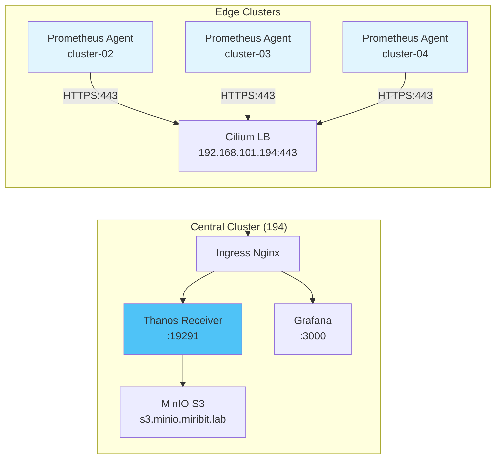

# 06. 네트워크 및 보안

## 📋 개요

Prometheus Agent + Thanos Receiver 멀티클러스터 환경의 네트워크 구성, 보안 설정, 암호화 통신, 접근 제어를 다룹니다.

---

## 🏗️ 네트워크 아키텍처



---

## 📂 문서 목록

### Cilium-CNI-설정.md
**목적**: Cilium CNI 및 L2 LoadBalancer 구성

**주요 내용**:
- Cilium 설치 및 설정
- L2 Announcement 활성화
- LoadBalancerIPPool 설정
- kube-proxy 대체
- 네트워크 정책 기본 설정

**대상 독자**: 네트워크 엔지니어

---

### Ingress-Controller-설정.md
**목적**: Nginx Ingress Controller 구성

**주요 내용**:
- Ingress Controller 배포
- TLS 인증서 설정
- Host 기반 라우팅
- PathPrefix 라우팅
- Rate Limiting

**대상 독자**: DevOps 엔지니어

---

### TLS-암호화.md
**목적**: Remote Write 및 외부 접근 TLS 암호화

**주요 내용**:
- Cert-Manager 설치
- Self-Signed 인증서 생성
- Let's Encrypt (Optional)
- Thanos Receiver TLS 설정
- 인증서 갱신 자동화

**대상 독자**: 보안 담당자

---

### NetworkPolicy.md
**목적**: Pod 간 네트워크 접근 제어

**주요 내용**:
- 기본 Deny 정책
- 네임스페이스 격리
- 멀티테넌시 네트워크 분리
- Egress 규칙 (S3, DNS)
- 트러블슈팅

**대상 독자**: 보안 엔지니어

---

### 인증-및-인가.md
**목적**: 사용자 및 서비스 인증/인가

**주요 내용**:
- Grafana 인증 (LDAP, OAuth)
- ArgoCD RBAC
- Prometheus Basic Auth
- ServiceAccount 관리
- API Token 관리

**대상 독자**: 보안 관리자

---

### Secret-관리.md
**목적**: 민감 정보 (S3 키, 비밀번호) 관리

**주요 내용**:
- Kubernetes Secret 생성
- Sealed Secrets (GitOps)
- External Secrets Operator (Optional)
- Secret 암호화
- 로테이션 전략

**대상 독자**: DevOps 엔지니어, 보안 담당자

---

### 보안-스캐닝.md
**목적**: 컨테이너 이미지 및 설정 보안 스캔

**주요 내용**:
- Trivy 이미지 스캔
- Kube-bench CIS 벤치마크
- Kube-hunter 취약점 스캔
- OPA/Gatekeeper 정책
- 정기 스캔 자동화

**대상 독자**: 보안 팀

---

## 🔐 보안 체크리스트

### 네트워크 보안
- [ ] Cilium NetworkPolicy 기본 Deny 활성화
- [ ] Ingress TLS 인증서 적용
- [ ] Remote Write HTTPS 활성화
- [ ] S3 endpoint TLS 사용
- [ ] 불필요한 NodePort 제거

### 접근 제어
- [ ] RBAC 최소 권한 원칙 적용
- [ ] Grafana 익명 접근 비활성화
- [ ] ArgoCD 관리자 비밀번호 변경
- [ ] ServiceAccount Token 자동 마운트 비활성화
- [ ] Pod Security Standards 적용

### Secret 관리
- [ ] S3 Access Key를 Secret으로 관리
- [ ] Grafana admin 비밀번호 Secret 사용
- [ ] TLS 인증서를 Secret으로 저장
- [ ] Sealed Secrets로 GitOps Secret 관리
- [ ] Secret 로테이션 주기 설정 (90일)

### 이미지 보안
- [ ] 공식 이미지 또는 검증된 이미지 사용
- [ ] 이미지 태그를 `latest` 대신 특정 버전 명시
- [ ] Trivy 스캔 통과 (HIGH 이상 취약점 없음)
- [ ] 컨테이너 rootless 실행 (가능한 경우)
- [ ] 이미지 Pull Policy: IfNotPresent

---

## 🌐 Cilium L2 LoadBalancer 설정 예시

### LoadBalancerIPPool
```yaml
apiVersion: cilium.io/v2alpha1
kind: CiliumLoadBalancerIPPool
metadata:
  name: cluster-01-pool
spec:
  blocks:
  - start: "192.168.101.194"
    stop: "192.168.101.194"
```

### L2 Announcement
```yaml
apiVersion: cilium.io/v2alpha1
kind: CiliumL2AnnouncementPolicy
metadata:
  name: default-policy
spec:
  interfaces:
  - ^ens.*
  externalIPs: true
  loadBalancerIPs: true
```

---

## 🔒 TLS 설정 예시

### Cert-Manager Issuer (Self-Signed)
```yaml
apiVersion: cert-manager.io/v1
kind: ClusterIssuer
metadata:
  name: selfsigned-issuer
spec:
  selfSigned: {}
```

### Ingress TLS
```yaml
apiVersion: networking.k8s.io/v1
kind: Ingress
metadata:
  name: grafana-ingress
  namespace: monitoring
  annotations:
    cert-manager.io/cluster-issuer: selfsigned-issuer
spec:
  ingressClassName: nginx
  tls:
  - hosts:
    - grafana.k8s-cluster-01.miribit.lab
    secretName: grafana-tls
  rules:
  - host: grafana.k8s-cluster-01.miribit.lab
    http:
      paths:
      - path: /
        pathType: Prefix
        backend:
          service:
            name: grafana
            port:
              number: 3000
```

---

## 🛡️ NetworkPolicy 예시

### 기본 Deny
```yaml
apiVersion: networking.k8s.io/v1
kind: NetworkPolicy
metadata:
  name: default-deny-all
  namespace: monitoring
spec:
  podSelector: {}
  policyTypes:
  - Ingress
  - Egress
```

### Thanos Receiver Ingress 허용
```yaml
apiVersion: networking.k8s.io/v1
kind: NetworkPolicy
metadata:
  name: thanos-receiver-allow
  namespace: monitoring
spec:
  podSelector:
    matchLabels:
      app: thanos-receive
  policyTypes:
  - Ingress
  ingress:
  - from:
    - namespaceSelector:
        matchLabels:
          name: ingress-nginx
    ports:
    - protocol: TCP
      port: 19291
```

### Egress to S3
```yaml
apiVersion: networking.k8s.io/v1
kind: NetworkPolicy
metadata:
  name: allow-s3-egress
  namespace: monitoring
spec:
  podSelector:
    matchLabels:
      app.kubernetes.io/name: prometheus
  policyTypes:
  - Egress
  egress:
  - to:
    - podSelector: {}  # MinIO in same cluster
    ports:
    - protocol: TCP
      port: 9000
  - to:  # DNS
    - namespaceSelector:
        matchLabels:
          name: kube-system
    ports:
    - protocol: UDP
      port: 53
```

---

## 🔑 Secret 관리 예시

### S3 Secret
```yaml
apiVersion: v1
kind: Secret
metadata:
  name: thanos-s3-secret
  namespace: monitoring
type: Opaque
stringData:
  objstore.yml: |
    type: S3
    config:
      bucket: thanos-cluster-01
      endpoint: s3.minio.miribit.lab
      access_key: ${S3_ACCESS_KEY}
      secret_key: ${S3_SECRET_KEY}
      insecure: false
```

### Grafana Admin Secret
```yaml
apiVersion: v1
kind: Secret
metadata:
  name: grafana-admin-secret
  namespace: monitoring
type: Opaque
stringData:
  admin-user: admin
  admin-password: ${GRAFANA_ADMIN_PASSWORD}
```

---

## 📊 보안 스캔 자동화

### Trivy 스캔 스크립트
```bash
#!/bin/bash
IMAGES=(
  "quay.io/prometheus/prometheus:v2.45.0"
  "quay.io/thanos/thanos:v0.31.0"
  "grafana/grafana:10.0.0"
)

for image in "${IMAGES[@]}"; do
  echo "Scanning $image..."
  trivy image --severity HIGH,CRITICAL "$image"
done
```

### Kube-bench 실행
```bash
kubectl apply -f https://raw.githubusercontent.com/aquasecurity/kube-bench/main/job.yaml
kubectl logs -f job/kube-bench
```

---

## 🔗 관련 섹션

- **아키텍처** → [01-아키텍처](../01-아키텍처/)
- **멀티테넌시** → [05-멀티테넌시-구성](../05-멀티테넌시-구성/)
- **운영 가이드** → [03-운영-가이드](../03-운영-가이드/)

---

**최종 업데이트**: 2025-10-20
