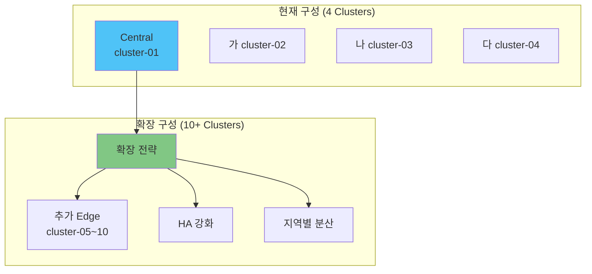
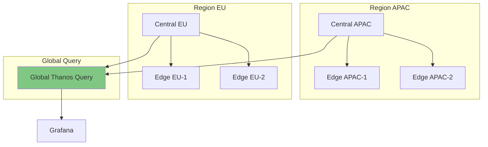

# 07. 확장 아키텍처

## 📋 개요

현재 4개 클러스터 구성에서 더 많은 클러스터로 확장하거나, 성능 및 기능을 향상시키는 확장 아키텍처 및 고급 패턴을 제공합니다.

---

## 🏗️ 확장 시나리오



---

## 📂 문서 목록

### 클러스터-확장-전략.md
**목적**: 엣지 클러스터를 5개 이상으로 확장하는 방법

**주요 내용**:
- Thanos Receiver 수평 확장 (Hashring)
- Prometheus HA Storage 증설
- ArgoCD Application 자동 생성
- 클러스터 등록 자동화
- 메트릭 보존 기간 조정

**대상 독자**: 아키텍트, SRE

---

### 지역별-클러스터-구성.md
**목적**: 지리적으로 분산된 멀티 리전 아키텍처

**주요 내용**:
- 리전별 중앙 클러스터 구성
- Thanos Query Frontend 활용
- 글로벌 Thanos Query 계층
- 레이턴시 최적화
- 재해 복구 (DR)

**대상 독자**: 글로벌 인프라 관리자

---

### Thanos-Receiver-HA.md
**목적**: Thanos Receiver 고가용성 및 확장

**주요 내용**:
- Receiver Hashring 구성
- Replication Factor 설정
- StatefulSet 스케일링
- 부하 분산 전략
- 장애 조치 (Failover)

**대상 독자**: Thanos 운영자

---

### 메트릭-다운샘플링.md
**목적**: 장기 보관을 위한 메트릭 압축

**주요 내용**:
- Thanos Compactor 다운샘플링
- 5m, 1h resolution
- 보존 기간별 정책 (1d raw, 7d 5m, 30d 1h)
- 스토리지 비용 절감
- 쿼리 성능 최적화

**대상 독자**: 스토리지 관리자

---

### Query-Frontend-캐싱.md
**목적**: Thanos Query Frontend로 쿼리 성능 향상

**주요 내용**:
- Query Frontend 배포
- 결과 캐싱 (Memcached, Redis)
- 쿼리 분할 (Query Splitting)
- 슬로우 쿼리 최적화
- Grafana 연동

**대상 독자**: 성능 엔지니어

---

### 외부-프로메테우스-통합.md
**목적**: 기존 Prometheus 서버와 통합

**주요 내용**:
- Federation 설정
- Sidecar를 통한 데이터 수집
- 레거시 Prometheus 마이그레이션
- 하이브리드 구성
- 점진적 전환 전략

**대상 독자**: 마이그레이션 담당자

---

### 분산-추적-통합.md
**목적**: Jaeger/Tempo 분산 추적 통합

**주요 내용**:
- Tempo 배포
- Grafana Traces 연동
- 메트릭-트레이스 상관관계
- Exemplar 활용
- 통합 관찰성 대시보드

**대상 독자**: 관찰성 엔지니어

---

### 비용-최적화.md
**목적**: 스토리지 및 컴퓨팅 비용 절감

**주요 내용**:
- S3 Lifecycle 정책
- Intelligent Tiering
- 메트릭 필터링 (drop, keep)
- 쿼리 비용 분석
- 리소스 Right-sizing

**대상 독자**: 비용 관리자, FinOps

---

## 🚀 확장 시나리오별 가이드

### 시나리오 1: 엣지 클러스터 10개 → 50개 확장

**변경 사항**:
- Thanos Receiver: 3 replicas → 5 replicas
- Prometheus HA Storage: 50Gi → 200Gi
- Hashring replication: 1 → 3

**예상 리소스**:
```yaml
Thanos Receiver:
  replicas: 5
  resources:
    cpu: 1 core (each)
    memory: 2Gi (each)

Prometheus HA:
  replicas: 2
  storage: 200Gi
  resources:
    cpu: 4 cores
    memory: 16Gi
```

---

### 시나리오 2: 글로벌 멀티 리전



**구성**:
- 리전별 중앙 클러스터 (APAC, EU)
- 글로벌 Thanos Query (모든 리전 쿼리)
- 리전 내 저지연 쿼리 제공

---

### 시나리오 3: Thanos Receiver HA (Hashring)

```yaml
# Receiver StatefulSet (3 replicas)
apiVersion: apps/v1
kind: StatefulSet
metadata:
  name: thanos-receive
spec:
  replicas: 3
  template:
    spec:
      containers:
      - name: thanos-receive
        args:
        - receive
        - --tsdb.path=/data
        - --grpc-address=0.0.0.0:10901
        - --http-address=0.0.0.0:10902
        - --remote-write.address=0.0.0.0:19291
        - --receive.replication-factor=3
        - --receive.hashrings-file=/etc/thanos/hashrings.json
```

**Hashring 설정**:
```json
[
  {
    "hashring": "default",
    "endpoints": [
      "thanos-receive-0.thanos-receive:10901",
      "thanos-receive-1.thanos-receive:10901",
      "thanos-receive-2.thanos-receive:10901"
    ],
    "tenants": []
  }
]
```

---

## 📊 메트릭 다운샘플링 정책

### Compactor 설정
```yaml
compactor:
  enabled: true
  retentionResolutionRaw: 7d      # Raw 데이터 7일
  retentionResolution5m: 30d      # 5분 해상도 30일
  retentionResolution1h: 180d     # 1시간 해상도 180일
```

### 스토리지 절감 효과
| Resolution | 데이터 크기 | 보존 기간 | 예상 크기 (50 clusters) |
|-----------|----------|----------|----------------------|
| Raw (15s) | 100% | 7d | 700GB |
| 5m | 5% | 30d | 150GB |
| 1h | 0.4% | 180d | 72GB |
| **총계** | - | - | **~922GB** |

**다운샘플링 없을 경우**: ~15TB (180d raw)

---

## 🎯 Query Frontend 캐싱

### Memcached 배포
```yaml
apiVersion: apps/v1
kind: Deployment
metadata:
  name: query-frontend-memcached
spec:
  replicas: 3
  template:
    spec:
      containers:
      - name: memcached
        image: memcached:1.6-alpine
        args:
        - -m 2048  # 2Gi memory
        - -c 1024  # connections
```

### Query Frontend 설정
```yaml
queryFrontend:
  enabled: true
  config:
    query_range:
      split_queries_by_interval: 24h
      results_cache:
        cache:
          memcached:
            addresses:
            - query-frontend-memcached:11211
            max_item_size: 5MB
```

**성능 향상**:
- 반복 쿼리 캐시 히트율: ~70%
- 평균 응답 시간: 3s → 500ms

---

## 💰 비용 최적화

### S3 Lifecycle 정책
```yaml
# MinIO Lifecycle (또는 AWS S3)
<LifecycleConfiguration>
  <Rule>
    <ID>delete-old-blocks</ID>
    <Status>Enabled</Status>
    <Expiration>
      <Days>180</Days>
    </Expiration>
  </Rule>
  <Rule>
    <ID>transition-to-glacier</ID>
    <Status>Enabled</Status>
    <Transition>
      <Days>90</Days>
      <StorageClass>GLACIER</StorageClass>
    </Transition>
  </Rule>
</LifecycleConfiguration>
```

### 메트릭 필터링 (Drop 규칙)
```yaml
# Prometheus Agent - values.yaml
prometheus:
  prometheusSpec:
    remoteWrite:
    - url: https://thanos-receive.monitoring/api/v1/receive
      writeRelabelConfigs:
      # 고빈도/저가치 메트릭 제외
      - sourceLabels: [__name__]
        regex: 'container_network_tcp_usage_total|go_gc_duration_seconds_.*'
        action: drop
```

---

## 🔗 관련 섹션

- **아키텍처** → [01-아키텍처](../01-아키텍처/)
- **배포** → [02-Kustomize-Helm-GitOps-배포](../02-Kustomize-Helm-GitOps-배포/)
- **운영 가이드** → [03-운영-가이드](../03-운영-가이드/)

---

**최종 업데이트**: 2025-10-20
