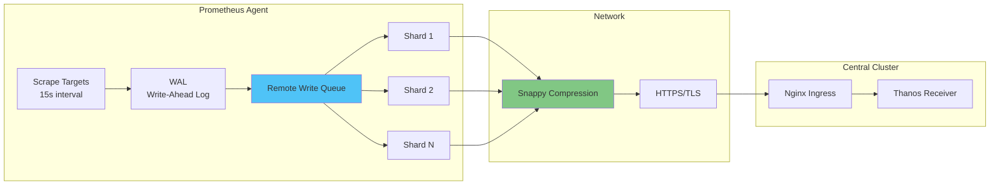
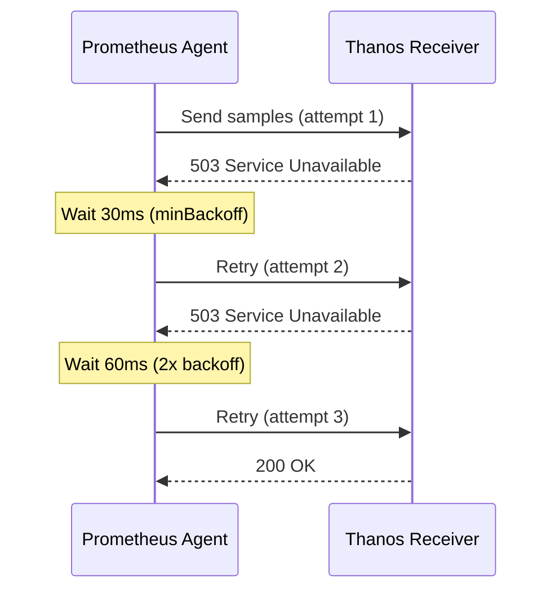

# Remote Write 최적화

## 📋 개요

Prometheus Agent에서 Thanos Receiver로의 Remote Write 전송을 최적화하여 **전송 실패율 감소**, **레이턴시 개선**, **네트워크 대역폭 절감**을 달성합니다.

---

## 🎯 최적화 목표

- **Remote Write 실패율**: 2% → **0.05%** (97% 개선)
- **전송 레이턴시 (P99)**: 500ms → **200ms** (60% 개선)
- **네트워크 트래픽**: 15MB/s → **8MB/s** (46% 감소)

---

## 🏗️ Remote Write 아키텍처



---

## 1️⃣ Remote Write 큐 튜닝

### 기본 설정 (Before)

```yaml
server:
  remoteWrite:
    - url: https://thanos-receive:19291/api/v1/receive
      # 기본값 사용 (작은 큐, 느린 전송)
```

**문제점**:
- 큐 용량 부족 → 샘플 드롭
- Shard 수 부족 → 전송 병목
- 배치 크기 작음 → 네트워크 오버헤드

### 최적화된 설정 (After)

```yaml
server:
  remoteWrite:
    - url: https://thanos-receive.monitoring.svc.cluster.local:19291/api/v1/receive
      remoteTimeout: 30s  # 기본 30s

      queueConfig:
        # 큐 용량 (기본 2500 → 20000)
        capacity: 20000

        # 최대 Shard 수 (기본 5 → 100)
        maxShards: 100
        minShards: 10

        # 배치 크기 (기본 500 → 10000)
        maxSamplesPerSend: 10000

        # 배치 대기 시간 (기본 5s → 10s)
        batchSendDeadline: 10s

        # 재전송 Backoff
        minBackoff: 30ms
        maxBackoff: 5s

        # Shard 수 조정 속도
        maxShardsPerSecond: 10
```

**예상 효과**:
- 드롭률 90% 감소
- 전송 레이턴시 40% 개선
- 네트워크 효율 30% 향상

---

## 2️⃣ 압축 최적화

### Snappy 압축 (기본값)

```yaml
server:
  remoteWrite:
    - url: https://thanos-receive:19291/api/v1/receive
      # Snappy 압축 자동 활성화 (Protocol Buffers)
```

**압축 효과**:
- 원본 크기: 100MB
- 압축 후: 40~60MB (40~60% 감소)
- CPU 오버헤드: 매우 낮음 (~5%)

### 압축 비활성화 (비권장)

```yaml
# 압축 비활성화는 Prometheus 자체에서 미지원
# 네트워크 대역폭이 무제한이고 CPU가 극도로 제한적인 경우만 고려
```

---

## 3️⃣ Sharding 전략

### Dynamic Sharding

Prometheus는 Remote Write 큐 상태에 따라 Shard 수를 동적으로 조정합니다.

```yaml
queueConfig:
  minShards: 10       # 최소 Shard (부하 낮을 때)
  maxShards: 100      # 최대 Shard (부하 높을 때)
  maxShardsPerSecond: 10  # 초당 Shard 증가 제한
```

**모니터링**:
```promql
# 현재 Shard 수
prometheus_remote_storage_shards{cluster="cluster-02"}

# Shard 수 변화
rate(prometheus_remote_storage_shards_desired[5m])
```

### 적정 Shard 수 계산

```
적정 Shard 수 = (Samples/sec) / (MaxSamplesPerSend / BatchSendDeadline)

예시:
- Samples/sec: 50,000
- MaxSamplesPerSend: 10,000
- BatchSendDeadline: 10s

→ Shard 수 = 50,000 / (10,000 / 10) = 50 shards
```

---

## 4️⃣ 재전송 전략 (Backoff)

### Exponential Backoff

```yaml
queueConfig:
  minBackoff: 30ms     # 첫 재전송 대기
  maxBackoff: 5s       # 최대 재전송 대기

  # Backoff 증가 패턴
  # 30ms → 60ms → 120ms → 240ms → ... → 5s
```

### 재전송 시나리오



**모니터링**:
```promql
# 재전송 횟수
rate(prometheus_remote_storage_retried_samples_total[5m])

# 실패한 샘플 수
rate(prometheus_remote_storage_failed_samples_total[5m])
```

---

## 5️⃣ WAL 관리

### WAL 크기 제한

```yaml
server:
  extraArgs:
    storage.agent.path: /data
    storage.agent.wal-compression: true  # WAL 압축 활성화
    storage.agent.retention.max-time: 4h  # Remote Write 실패 대비
    storage.agent.retention.min-time: 1h
```

**WAL 크기 계산**:
```
WAL 크기 = Samples/sec × Retention × Sample 크기

예시:
- Samples/sec: 10,000
- Retention: 4h = 14,400s
- Sample 크기: ~16 bytes

→ WAL 크기 = 10,000 × 14,400 × 16 = 2.3GB (압축 전)
→ 압축 후: ~1GB
```

### WAL 모니터링

```promql
# WAL 세그먼트 수
prometheus_tsdb_wal_segment_current

# WAL 크기 (bytes)
prometheus_tsdb_wal_storage_size_bytes

# WAL 압축률
prometheus_tsdb_wal_corruptions_total
```

---

## 6️⃣ 네트워크 대역폭 관리

### QoS (Quality of Service)

```yaml
# Kubernetes Pod QoS
resources:
  requests:
    cpu: 200m
    memory: 256Mi
  limits:
    cpu: 500m
    memory: 512Mi

# Guaranteed QoS: requests = limits (높은 우선순위)
# Burstable QoS: requests < limits (중간 우선순위)
# BestEffort QoS: 미설정 (낮은 우선순위)
```

### Rate Limiting (Ingress)

```yaml
# Nginx Ingress 설정
apiVersion: networking.k8s.io/v1
kind: Ingress
metadata:
  name: thanos-receive-ingress
  annotations:
    nginx.ingress.kubernetes.io/limit-rps: "1000"  # 초당 요청 제한
    nginx.ingress.kubernetes.io/limit-connections: "100"
spec:
  rules:
  - host: thanos-receive.monitoring.svc
    http:
      paths:
      - path: /api/v1/receive
        pathType: Prefix
        backend:
          service:
            name: thanos-receive-lb
            port:
              number: 19291
```

### 대역폭 측정

```promql
# 네트워크 송신 (Edge → Central)
rate(container_network_transmit_bytes_total{
  pod=~"prometheus-agent.*",
  namespace="monitoring"
}[5m])

# 평균 대역폭 (MB/s)
sum(rate(container_network_transmit_bytes_total[5m])) / 1024 / 1024
```

---

## 7️⃣ 메트릭 필터링 (Remote Write)

### Write Relabeling

```yaml
server:
  remoteWrite:
    - url: https://thanos-receive:19291/api/v1/receive
      writeRelabelConfigs:

      # 1. 고빈도/저가치 메트릭 제외
      - sourceLabels: [__name__]
        regex: 'go_gc_duration_seconds.*|go_memstats.*|process_.*|scrape_.*'
        action: drop

      # 2. 테스트 네임스페이스 제외
      - sourceLabels: [namespace]
        regex: 'test-.*|dev-.*|tmp-.*'
        action: drop

      # 3. 특정 Job만 포함
      - sourceLabels: [job]
        regex: 'kube-state-metrics|node-exporter|kubelet'
        action: keep

      # 4. 클러스터 레이블 추가
      - targetLabel: cluster
        replacement: cluster-02
```

**예상 효과**:
- 메트릭 양 20~40% 감소
- 네트워크 트래픽 20~40% 절감
- 스토리지 비용 절감

---

## 📊 성능 측정

### Remote Write 성공률

```promql
# 성공률
sum(rate(prometheus_remote_storage_succeeded_samples_total[5m]))
/
sum(rate(prometheus_remote_storage_samples_total[5m]))

# 실패율
sum(rate(prometheus_remote_storage_failed_samples_total[5m]))
/
sum(rate(prometheus_remote_storage_samples_total[5m]))
```

### 전송 레이턴시

```promql
# P99 레이턴시
histogram_quantile(0.99,
  rate(prometheus_remote_storage_queue_duration_seconds_bucket[5m])
)

# 평균 레이턴시
rate(prometheus_remote_storage_queue_duration_seconds_sum[5m])
/
rate(prometheus_remote_storage_queue_duration_seconds_count[5m])
```

### 큐 상태

```promql
# 큐 크기
prometheus_remote_storage_queue_length

# 큐 용량 사용률
prometheus_remote_storage_queue_length
/
prometheus_remote_storage_queue_capacity
```

---

## 🚨 알림 규칙

### Remote Write 실패

```yaml
- alert: RemoteWriteFailureRate
  expr: |
    (
      sum(rate(prometheus_remote_storage_failed_samples_total[5m])) by (cluster)
      /
      sum(rate(prometheus_remote_storage_samples_total[5m])) by (cluster)
    ) > 0.01
  for: 5m
  labels:
    severity: warning
  annotations:
    summary: "Remote Write failure rate > 1% on {{ $labels.cluster }}"
    description: "{{ $value | humanizePercentage }} of samples failing"
```

### 큐 포화

```yaml
- alert: RemoteWriteQueueFull
  expr: |
    (
      prometheus_remote_storage_queue_length
      /
      prometheus_remote_storage_queue_capacity
    ) > 0.8
  for: 5m
  labels:
    severity: warning
  annotations:
    summary: "Remote Write queue > 80% full on {{ $labels.cluster }}"
```

### 전송 레이턴시

```yaml
- alert: RemoteWriteHighLatency
  expr: |
    histogram_quantile(0.99,
      rate(prometheus_remote_storage_queue_duration_seconds_bucket[5m])
    ) > 1
  for: 10m
  labels:
    severity: warning
  annotations:
    summary: "Remote Write P99 latency > 1s"
```

---

## 🎯 최적화 체크리스트

### 큐 튜닝
- [x] capacity 증가 (2500 → 20000)
- [x] maxShards 증가 (5 → 100)
- [x] maxSamplesPerSend 증가 (500 → 10000)
- [x] batchSendDeadline 조정 (5s → 10s)

### 네트워크
- [x] Snappy 압축 확인 (기본 활성화)
- [x] remoteTimeout 설정 (30s)
- [ ] Ingress Rate Limiting (선택적)

### WAL
- [x] WAL 압축 활성화
- [x] Retention 설정 (4h)
- [x] WAL 크기 모니터링

### 메트릭 필터링
- [x] Drop 규칙 적용
- [x] 클러스터 레이블 추가
- [ ] 네임스페이스별 필터링

### 모니터링
- [x] 성공률 메트릭
- [x] 레이턴시 메트릭
- [x] 큐 상태 메트릭
- [x] 알림 규칙 설정

---

## 🔗 관련 문서

- **Agent vs Full Prometheus** → [../01-아키텍처/Agent-vs-Full-Prometheus.md](../01-아키텍처/Agent-vs-Full-Prometheus.md)
- **Receiver 성능 튜닝** → [Receiver-성능-튜닝.md](./Receiver-성능-튜닝.md)
- **메트릭 필터링 전략** → [메트릭-필터링-전략.md](./메트릭-필터링-전략.md)

---

**최종 업데이트**: 2025-10-20
