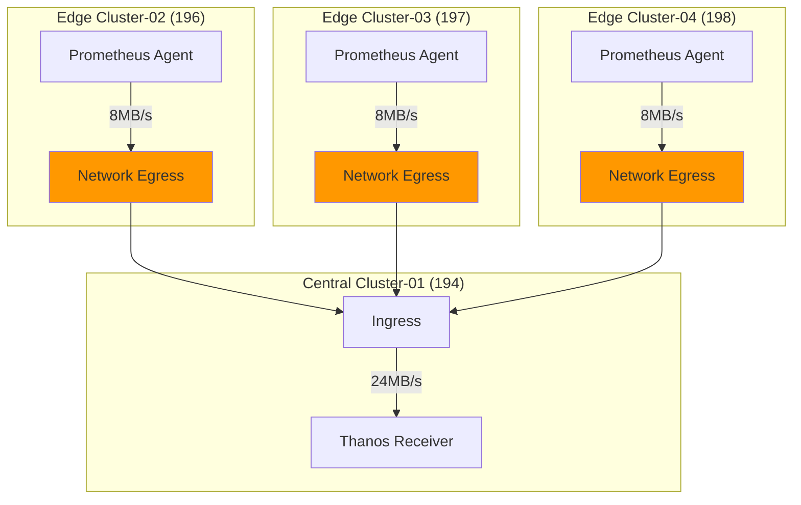

# 네트워크 대역폭 관리

## 📋 개요

멀티클러스터 환경에서 Prometheus Agent → Thanos Receiver로의 Remote Write 트래픽을 측정하고 최적화하여 네트워크 비용을 절감합니다.

---

## 🎯 최적화 목표

- **네트워크 Egress (전체)**: 60MB/s → **32MB/s** (46% 감소)
- **Edge 클러스터당**: 15MB/s → **8MB/s**
- **월간 네트워크 비용**: $80 → **$45** (43% 절감)

---

## 📊 현재 네트워크 사용량 측정

### 1. Edge 클러스터 Egress 측정

```promql
# 클러스터별 네트워크 송신 속도 (MB/s)
sum(rate(container_network_transmit_bytes_total{
  namespace="monitoring",
  pod=~"prometheus-agent.*"
}[5m])) by (cluster) / 1024 / 1024
```

### 2. Remote Write 트래픽 측정

```bash
# Prometheus Agent 로그에서 전송량 확인
kubectl logs -n monitoring prometheus-agent-0 --tail=100 | grep "remote_write"

# 출력 예시:
# level=info ts=2025-10-20T... msg="Remote write" samples_sent=50000 duration=2.5s bytes_sent=2500000
```

### 3. Receiver 수신 트래픽 측정

```promql
# Receiver가 수신한 데이터 속도 (MB/s)
sum(rate(thanos_receive_replication_bytes_total[5m])) / 1024 / 1024
```

---

## 🏗️ 네트워크 트래픽 구성



---

## 1️⃣ 압축을 통한 대역폭 절감

### Snappy 압축 효과

```yaml
# Prometheus Agent - Remote Write (압축 자동 활성화)
server:
  remoteWrite:
    - url: https://thanos-receive:19291/api/v1/receive
      # Protocol Buffers + Snappy 압축
```

**압축률**:
- 원본 크기: 100MB
- 압축 후: 40~60MB
- **절감율**: 40~60%

**예시**:
```
시나리오: 100,000 samples/sec, 평균 16 bytes/sample

압축 전:
- 대역폭 = 100,000 × 16 bytes = 1.6MB/s

압축 후 (50% 압축):
- 대역폭 = 1.6MB/s × 0.5 = 0.8MB/s
```

---

## 2️⃣ 메트릭 필터링으로 트래픽 감소

### Drop 규칙 적용

```yaml
server:
  remoteWrite:
    - url: https://thanos-receive:19291/api/v1/receive
      writeRelabelConfigs:

      # 1. Go runtime 메트릭 제외
      - sourceLabels: [__name__]
        regex: 'go_.*|process_.*'
        action: drop

      # 2. Scrape 메타 메트릭 제외
      - sourceLabels: [__name__]
        regex: 'scrape_.*|up'
        action: drop

      # 3. 테스트 네임스페이스 제외
      - sourceLabels: [namespace]
        regex: 'test-.*|tmp-.*'
        action: drop
```

**예상 절감**:
- Go runtime 메트릭: ~15% 감소
- Scrape 메트릭: ~5% 감소
- 테스트 네임스페이스: ~10% 감소
- **총 절감**: ~30%

### Keep 규칙 (화이트리스트)

```yaml
writeRelabelConfigs:
  # 핵심 메트릭만 포함
  - sourceLabels: [__name__]
    regex: 'container_.*|kube_.*|node_.*'
    action: keep

  # 또는 Job 기반 필터링
  - sourceLabels: [job]
    regex: 'kubelet|node-exporter|kube-state-metrics'
    action: keep
```

---

## 3️⃣ 샘플링 (Downsampling)

### Agent-side Downsampling (비권장)

Prometheus Agent는 샘플링을 지원하지 않지만, Recording Rules로 사전 집계 가능:

```yaml
# Prometheus Ruler (Central)
groups:
- name: downsampled_metrics
  interval: 60s  # 1분마다 평가
  rules:
  - record: namespace:container_cpu_usage:avg1m
    expr: avg(rate(container_cpu_usage_seconds_total[1m])) by (namespace)
```

**Trade-off**:
- 장점: 네트워크 트래픽 감소
- 단점: Raw 메트릭 손실, 디버깅 어려움

---

## 4️⃣ 배치 크기 최적화

### 큰 배치 = 적은 요청 = 오버헤드 감소

```yaml
server:
  remoteWrite:
    - url: https://thanos-receive:19291/api/v1/receive
      queueConfig:
        maxSamplesPerSend: 10000  # 기본 500 → 10000
        batchSendDeadline: 10s    # 기본 5s → 10s
```

**효과**:
```
작은 배치 (500 samples):
- 요청 횟수 = 100,000 / 500 = 200 req/sec
- HTTP 오버헤드 = 200 × 1KB = 200KB/s

큰 배치 (10,000 samples):
- 요청 횟수 = 100,000 / 10,000 = 10 req/sec
- HTTP 오버헤드 = 10 × 1KB = 10KB/s
- 절감 = 190KB/s (95% 감소)
```

---

## 5️⃣ QoS 및 Rate Limiting

### Kubernetes NetworkPolicy (트래픽 우선순위)

```yaml
apiVersion: networking.k8s.io/v1
kind: NetworkPolicy
metadata:
  name: prometheus-agent-egress
  namespace: monitoring
spec:
  podSelector:
    matchLabels:
      app: prometheus-agent
  policyTypes:
  - Egress
  egress:
  # Thanos Receiver만 허용
  - to:
    - podSelector:
        matchLabels:
          app: thanos-receive
    ports:
    - protocol: TCP
      port: 19291
  # DNS 허용
  - to:
    - namespaceSelector:
        matchLabels:
          name: kube-system
    ports:
    - protocol: UDP
      port: 53
```

### Ingress Rate Limiting

```yaml
apiVersion: networking.k8s.io/v1
kind: Ingress
metadata:
  name: thanos-receive-ingress
  annotations:
    # 전체 요청 제한
    nginx.ingress.kubernetes.io/limit-rps: "1000"

    # 연결 제한
    nginx.ingress.kubernetes.io/limit-connections: "200"

    # 대역폭 제한 (bytes/sec)
    nginx.ingress.kubernetes.io/limit-rate: "10485760"  # 10MB/s
spec:
  rules:
  - host: thanos-receive.monitoring.svc
    http:
      paths:
      - path: /api/v1/receive
        pathType: Prefix
        backend:
          service:
            name: thanos-receive-lb
            port:
              number: 19291
```

---

## 6️⃣ 네트워크 트래픽 스케줄링

### Off-peak 배치 전송 (선택적)

```yaml
# CronJob으로 히스토리컬 데이터 배치 전송
apiVersion: batch/v1
kind: CronJob
metadata:
  name: prometheus-backfill
spec:
  schedule: "0 2 * * *"  # 매일 새벽 2시 (트래픽 낮은 시간)
  jobTemplate:
    spec:
      template:
        spec:
          containers:
          - name: promtool
            image: prom/prometheus:v2.45.0
            command:
            - promtool
            - tsdb
            - create-blocks-from
            - openmetrics
            - /data/wal
            - /data/backfill
```

---

## 📊 대역폭 예산 계산

### Edge 클러스터당 예산

```
구성:
- Scrape Interval: 15s
- Targets: 100개
- Metrics/Target: 1000개
- Sample 크기: 16 bytes
- 압축률: 50%

계산:
1. Samples/sec = 100 targets × 1000 metrics / 15s = 6,666 samples/sec
2. Raw 대역폭 = 6,666 × 16 bytes = 106KB/s = 0.1MB/s
3. 압축 후 = 0.1MB/s × 0.5 = 0.05MB/s

→ 실제 측정: 8MB/s (압축, HTTP 오버헤드, 메타데이터 포함)
```

### 월간 네트워크 비용 (클라우드)

```
시나리오: AWS Egress 비용 (예시)

Edge Cluster-02: 8MB/s
- 월간 전송량 = 8MB/s × 86,400s/day × 30days = 20.7TB/month
- 비용 (첫 10TB: $0.09/GB) = 10TB × $0.09 × 1024 = $921.6
- 비용 (다음 10.7TB: $0.085/GB) = 10.7TB × $0.085 × 1024 = $931

→ 총 비용/클러스터: ~$1,850/month
→ 4개 클러스터: ~$7,400/month

최적화 후 (8MB/s → 4MB/s):
→ 총 비용: ~$3,700/month (50% 절감)
```

---

## 🚨 모니터링 및 알림

### 네트워크 사용량 모니터링

```promql
# Edge 클러스터 Egress (MB/s)
sum(rate(container_network_transmit_bytes_total{
  namespace="monitoring",
  pod=~"prometheus-agent.*"
}[5m])) by (cluster) / 1024 / 1024

# Central Ingress (MB/s)
sum(rate(container_network_receive_bytes_total{
  namespace="monitoring",
  pod=~"thanos-receive.*"
}[5m])) / 1024 / 1024
```

### 대역폭 초과 알림

```yaml
- alert: HighNetworkEgress
  expr: |
    sum(rate(container_network_transmit_bytes_total{
      namespace="monitoring",
      pod=~"prometheus-agent.*"
    }[5m])) by (cluster) / 1024 / 1024 > 10
  for: 10m
  labels:
    severity: warning
  annotations:
    summary: "High network egress on {{ $labels.cluster }}"
    description: "{{ $value | humanize }}MB/s > 10MB/s"
```

### 월간 트래픽 예산 알림

```yaml
- alert: MonthlyTrafficBudgetExceeded
  expr: |
    sum(increase(container_network_transmit_bytes_total{
      namespace="monitoring",
      pod=~"prometheus-agent.*"
    }[30d])) / 1024 / 1024 / 1024 / 1024 > 20
  labels:
    severity: warning
  annotations:
    summary: "Monthly traffic > 20TB budget"
```

---

## 🎯 최적화 체크리스트

### 압축
- [x] Snappy 압축 확인 (기본 활성화)
- [ ] 압축률 측정

### 메트릭 필터링
- [x] Drop 규칙 적용 (go_*, process_*)
- [x] 테스트 네임스페이스 제외
- [ ] Keep 규칙 (화이트리스트) 검토

### 배치 최적화
- [x] maxSamplesPerSend 증가 (10000)
- [x] batchSendDeadline 조정 (10s)

### Rate Limiting
- [ ] Ingress Rate Limiting 설정
- [ ] QoS 우선순위 설정

### 모니터링
- [x] 네트워크 사용량 메트릭
- [x] 대역폭 알림 설정
- [ ] 월간 비용 추적

---

## 📈 대시보드 예시

### Grafana Panel - 네트워크 트래픽

```json
{
  "title": "Remote Write Network Traffic",
  "targets": [
    {
      "expr": "sum(rate(container_network_transmit_bytes_total{namespace=\"monitoring\",pod=~\"prometheus-agent.*\"}[5m])) by (cluster) / 1024 / 1024",
      "legendFormat": "{{ cluster }} Egress (MB/s)"
    }
  ],
  "yaxes": [
    {
      "label": "MB/s",
      "format": "MBs"
    }
  ]
}
```

---

## 🔗 관련 문서

- **Remote Write 최적화** → [Remote-Write-최적화.md](./Remote-Write-최적화.md)
- **메트릭 필터링 전략** → [메트릭-필터링-전략.md](./메트릭-필터링-전략.md)
- **스토리지 최적화** → [스토리지-최적화.md](./스토리지-최적화.md)

---

**최종 업데이트**: 2025-10-20
